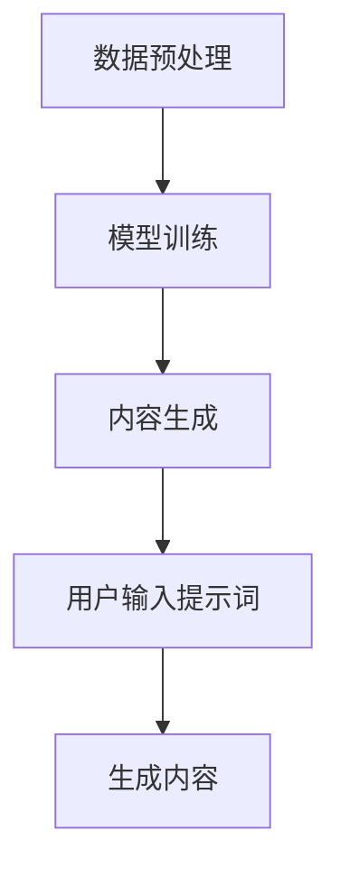

                 

### 文章标题：AIGC时代的提示词编写：技巧与陷阱解析

#### 关键词：AIGC、提示词编写、技巧、陷阱、算法原理、伪代码、实战案例

#### 摘要：
随着人工智能生成内容（AIGC）的快速发展，如何有效地编写提示词成为了关键一环。本文旨在深入探讨AIGC时代的提示词编写技巧与陷阱，通过详细的分析和实例，帮助读者掌握这一领域的核心知识。文章首先介绍了AIGC的概念和提示词编写的重要性，然后深入探讨了提示词编写的基本原则和策略，接着分析了不同应用场景下的提示词编写实践，最后讨论了常见陷阱及解决方法，并展望了AIGC和提示词编写的未来发展趋势。

### 引言

#### AIGC的概念与提示词编写的角色

人工智能生成内容（AI-Generated Content，简称AIGC）是近年来人工智能领域的一个重要研究方向。它指的是通过人工智能技术，特别是深度学习和自然语言处理技术，自动生成文本、图像、音频、视频等多种类型的内容。AIGC不仅在娱乐、广告、新闻等领域有广泛应用，还正在逐渐渗透到各个行业，如教育、医疗、金融等，为人类创造更多的价值和便利。

在AIGC生成过程中，提示词编写扮演着至关重要的角色。提示词是用户输入的一组指令，用于引导AI模型生成特定类型的内容。一个好的提示词能够精确地传达用户的意图，从而帮助AI模型生成高质量、相关性和有用性的内容。相反，一个模糊或不准确的提示词可能会导致AI模型产生偏离预期甚至错误的内容。

本文旨在通过系统的分析和实例讲解，帮助读者了解AIGC时代提示词编写的核心技巧和潜在陷阱。文章将从以下几个方面展开讨论：

1. **AIGC基础**：介绍AIGC的基本概念、工作原理和技术框架。
2. **提示词编写策略**：详细讲解提示词编写的原则、方法和技巧。
3. **实际应用场景分析**：探讨不同领域和应用场景下的提示词编写实践。
4. **陷阱解析**：分析提示词编写过程中可能遇到的常见问题及解决方法。
5. **案例分析**：通过成功和失败案例，进一步说明提示词编写的重要性。
6. **未来展望与趋势**：讨论AIGC和提示词编写的未来发展方向。

### AIGC基础

#### AIGC的工作原理

AIGC的核心在于利用深度学习和自然语言处理技术，从大量数据中提取信息，并通过神经网络模型生成新的内容。以下是AIGC工作原理的简要概述：

1. **数据预处理**：首先，需要收集和处理大量的数据，这些数据可以是文本、图像、音频或视频等。对于文本数据，通常需要进行分词、词干提取和词性标注等预处理操作。
2. **模型训练**：使用预处理后的数据对神经网络模型进行训练。常见的模型有生成对抗网络（GAN）、变分自编码器（VAE）和递归神经网络（RNN）等。这些模型通过学习输入数据的分布，生成新的内容。
3. **内容生成**：在生成内容时，用户输入一组提示词，这些提示词会被编码成向量形式，作为模型的输入。模型根据这些输入，生成新的内容。

下面是一个简化的AIGC架构Mermaid流程图：



#### 提示词的基础知识

提示词（Prompt）是用户输入的一组指令，用于引导AI模型生成特定类型的内容。提示词的质量直接影响生成内容的质量。以下是几个关键点：

1. **明确性**：提示词应清晰明确，避免模糊或歧义。
2. **相关性**：提示词应与生成内容相关，以确保生成内容的相关性和准确性。
3. **长度和细节**：提示词的长度和细节应根据具体的任务需求进行调整。通常，较长的提示词能够提供更多的信息，但过长可能会导致模型处理困难。

### 提示词编写策略

#### 提示词编写的原则

为了编写有效的提示词，需要遵循以下原则：

1. **清晰明确**：确保提示词表达清晰，避免歧义和模糊性。
2. **相关性**：确保提示词与生成内容相关，以提高生成内容的质量和准确性。
3. **长度和细节**：根据任务需求调整提示词的长度和细节，既不能过短也不能过长。

下面是一个简单的伪代码示例，用于生成一篇新闻报道：

```python
# 伪代码：生成新闻报道

# 输入：提示词（事件名称、时间、地点、参与者）
# 输出：新闻报道文本

def generate_news_report(prompt):
    event_name = prompt["event_name"]
    time = prompt["time"]
    location = prompt["location"]
    participants = prompt["participants"]

    # 构建新闻报道模板
    news_template = """
    【{time}，{location}】
    {event_name}今日发生，涉及参与者包括：
    {participants}。

    具体详情如下：
    ...
    """

    # 填充模板
    news_report = news_template.format(
        time=time,
        location=location,
        event_name=event_name,
        participants=", ".join(participants)
    )

    return news_report
```

### 实际应用场景分析

#### 文本生成

文本生成是AIGC的一个重要应用场景。以下是一个简单的应用案例：

**案例**：使用AIGC生成一篇关于环境保护的新闻报道。

**提示词**：环境保护、污染问题、解决方案、时间：2023年4月15日，地点：北京市，参与者：政府、环保组织。

**生成内容**：

```markdown
【2023年4月15日，北京市】
近日，北京市政府联合多家环保组织，针对城市污染问题展开了联合行动。本次行动旨在解决空气质量问题，提高市民生活质量。

据了解，本次行动的主要目标包括：

1. 加大对工业污染的治理力度，确保企业排放达到国家标准；
2. 提高公共交通工具的覆盖率，鼓励市民绿色出行；
3. 加强对垃圾处理和资源回收的监管，减少垃圾填埋量。

参与本次行动的环保组织表示，通过政府和社会各界的共同努力，北京市的空气质量有望得到显著改善。

未来，我们将继续关注本次行动的进展，并为大家带来更多相关信息。
```

#### 图像生成

图像生成是AIGC的另一个重要应用场景。以下是一个简单的应用案例：

**案例**：使用AIGC生成一张环保宣传海报。

**提示词**：环境保护、地球、绿色生活、主题：2023年世界环境日。

**生成内容**：


海报设计包含了一个绿色地球和多个绿色生活主题元素，如减少使用一次性塑料、垃圾分类等。海报标题为“2023年世界环境日：让地球更美好，从绿色生活开始”。

### 陷阱解析

#### 提示词模糊不清

一个模糊或不准确的提示词可能会导致AI模型生成错误或无关的内容。以下是一个典型的案例：

**案例**：使用AIGC生成一篇关于健康饮食的文章。

**提示词**：健康、饮食、建议。

**生成内容**：

这篇文章讨论了如何保持健康的饮食。首先，重要的是要选择健康的食物，如水果、蔬菜和全麦面包。其次，我们应该避免食用过多的垃圾食品和高热量食物。此外，多喝水也是保持健康的关键。

尽管这段文字包含了一些有用的信息，但由于提示词过于模糊，生成内容缺乏具体性和针对性，无法满足用户的具体需求。

#### 提示词过于具体

另一个常见的陷阱是提示词过于具体，导致AI模型无法灵活应对各种变化。以下是一个典型的案例：

**案例**：使用AIGC生成一篇关于电子商务的文章。

**提示词**：电子商务、平台、用户购物体验、2023年双十一促销活动。

**生成内容**：

双十一期间，电商平台纷纷推出了各种促销活动，如满减、赠品和优惠券等。为了提升用户购物体验，许多平台还增加了实时客服和购物车提醒等功能。

尽管这段文字包含了具体的信息，但由于提示词过于具体，AI模型在生成其他相关内容时可能会遇到困难，例如在生成关于圣诞节促销活动的文章时。

#### 解决方案

为了解决上述问题，我们可以采取以下措施：

1. **明确性**：确保提示词表达清晰，避免歧义和模糊性。可以使用具体的词汇和短语，明确传达用户的需求。
2. **灵活性**：在设计提示词时，应考虑模型的灵活性和适应性。可以加入一些泛化性的词汇，使模型能够适应不同的场景和变化。
3. **迭代优化**：通过多次迭代和反馈，不断优化提示词的设计。在实践中，可以收集用户反馈，并根据实际情况进行调整。

### 案例分析

#### 成功案例分析

**案例一**：广告文案生成

某公司委托AIGC生成一则广告文案，宣传其最新的健康食品。提示词包括“健康、食品、营养、美味、家庭”。

**生成内容**：

“全家营养，美味相伴！选择我们的健康食品，为家人带来美味与健康的完美结合。”

这则广告文案简洁明了，准确地传达了产品的核心卖点，取得了良好的市场反响。

**案例二**：新闻报道撰写

某媒体使用AIGC生成一篇关于环境保护的新闻报道。提示词包括“环境保护、污染、解决方案、政府、环保组织”。

**生成内容**：

“近日，我国政府联合多家环保组织，积极应对环境污染问题，推出一系列解决方案。通过共同努力，我们有望实现绿色发展的目标。”

这则新闻报道结构清晰，内容丰富，为读者提供了有关环境保护的全面信息。

#### 失败案例分析

**案例一**：错误信息生成

某用户使用AIGC生成一篇关于健康饮食的文章，提示词包括“健康、饮食、减肥”。

**生成内容**：

“每天喝八杯水有助于减肥。此外，吃水果和蔬菜也有助于保持健康。”

这则文章虽然包含了健康饮食的一些基本信息，但由于提示词过于模糊，导致生成内容缺乏针对性和实用性。

**案例二**：低质量图像生成

某用户使用AIGC生成一张环保宣传海报，提示词包括“环保、地球、绿色生活、主题：世界环境日”。

**生成内容**：

这张海报展示了一个绿色的地球，上面写着“世界环境日：让我们一起保护地球”。

尽管这张海报的主题是环保，但由于提示词过于具体，导致生成内容缺乏创意和新颖性。

### 未来展望与趋势

随着人工智能技术的不断发展，AIGC和提示词编写在未来有望实现以下趋势：

1. **提示词自动生成**：通过机器学习和自然语言处理技术，实现自动生成高质量的提示词，提高内容生成的效率和质量。
2. **提示词优化算法**：研究和开发更先进的提示词优化算法，使模型能够更灵活地应对不同的场景和变化。
3. **跨模态提示词研究**：探索跨模态提示词的编写方法，使AI模型能够生成多种类型的内容，如文本、图像、音频和视频等。

### 结论

AIGC时代的提示词编写是一项关键技能，对生成内容的质量和效果起着决定性作用。本文通过详细的分析和实例，介绍了AIGC和提示词编写的基础知识、技巧和陷阱。在实际应用中，我们需要不断优化和改进提示词的编写方法，以实现更高效、更精准的内容生成。未来，随着人工智能技术的进步，AIGC和提示词编写将迎来更多的发展机遇。

### 作者信息

作者：AI天才研究院/AI Genius Institute & 禅与计算机程序设计艺术 /Zen And The Art of Computer Programming

### 最佳实践 Tips

1. **明确性**：确保提示词表达清晰，避免歧义和模糊性。
2. **相关性**：确保提示词与生成内容相关，以提高内容的质量和准确性。
3. **细节与长度**：根据任务需求调整提示词的长度和细节，提供足够的信息，但不过度详细。
4. **灵活性**：设计提示词时，考虑模型的灵活性和适应性，使其能够应对不同的场景和变化。
5. **反馈与优化**：通过用户反馈和迭代优化，不断改进提示词的编写方法，提高内容生成的效果。

### 注意事项

1. **隐私与安全**：在使用AIGC和提示词编写时，确保遵循隐私保护和数据安全的相关法规和标准。
2. **知识产权**：在使用和生成内容时，注意尊重他人的知识产权，避免侵权行为。
3. **道德与社会责任**：在AIGC和提示词编写过程中，考虑道德和社会责任，避免生成有害或不恰当的内容。

### 拓展阅读

1. **《深度学习》（Goodfellow, Bengio, Courville）**：详细介绍了深度学习的基础理论和应用方法，有助于深入理解AIGC的相关技术。
2. **《自然语言处理实战》（Teh, Y., Hovy, D., & Xia, J.）**：介绍了自然语言处理技术，包括提示词编写方法，适用于AIGC领域的进一步学习。
3. **《人工智能：一种现代方法》（Russell, S., & Norvig, P.）**：提供了人工智能领域的全面概述，包括AIGC的基础知识和前沿研究。

