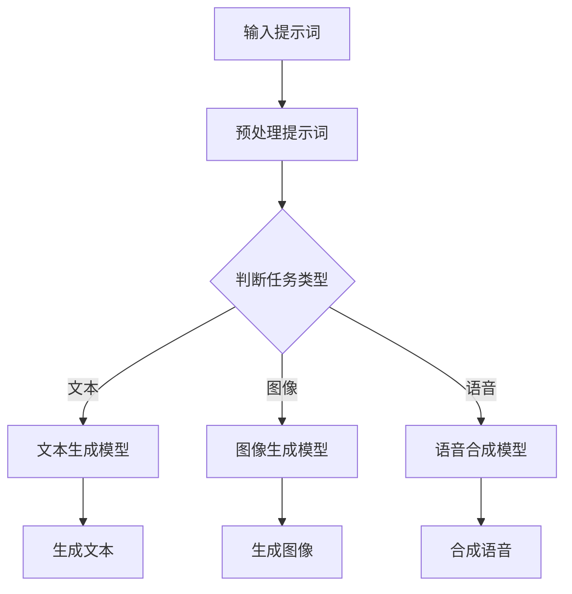

                 

### 引言：AIGC时代与提示词编写

在当今技术飞速发展的时代，人工智能（AI）已经成为推动社会进步的重要力量。随着生成对抗网络（GAN）、强化学习（RL）等先进技术的成熟，人工智能生成内容（AI-generated Content，简称AIGC）逐渐成为热门研究领域。AIGC指的是利用人工智能技术自动生成文字、图像、音频等多种类型的内容，涵盖了从简单文本到复杂多媒体的创作过程。这一技术的突破为内容创作带来了前所未有的便利和效率，同时也引发了诸多新的挑战。

提示词（Prompt）在AIGC中扮演着至关重要的角色。提示词是对人工智能模型进行指令输入的文本，它能够引导模型理解任务目标，生成符合预期结果的内容。高质量的提示词能够显著提升模型的生成效果，而低效或不当的提示词则可能导致生成内容的质量下降，甚至引发一系列问题。因此，掌握有效的提示词编写技巧对于AIGC的成功应用至关重要。

本文旨在探讨AIGC时代下提示词编写的技巧、陷阱与解决之道。首先，我们将介绍AIGC的基本概念、发展历程以及主要应用领域。随后，深入探讨提示词编写的意义、核心技巧以及常见问题，并通过具体案例分析来展示提示词编写的最佳实践。最后，我们将展望提示词编写的发展趋势，并提出未来研究的方向。希望通过本文的讲解，读者能够对AIGC时代的提示词编写有更深入的理解，并在实际应用中取得更好的效果。

## 1.1 AIGC概述

### 1.1.1 AIGC的定义

人工智能生成内容（AI-generated Content，简称AIGC）是指通过利用人工智能技术，如深度学习、生成对抗网络（GAN）、强化学习等，自动生成人类可消费的内容。这些内容可以包括文本、图像、音频、视频等多种类型，具有高度的多样性和创新性。与传统的内容创作方式相比，AIGC能够大大提升内容创作的效率，同时降低创作成本，使内容生成过程更加智能化和自动化。

AIGC的核心在于利用大数据和先进的算法模型，通过学习大量真实数据进行训练，使模型能够理解人类语言、图像和音频等多媒体信息，并在此基础上进行创造性的生成。这一过程不仅包括对现有数据的重新组合，还涉及到生成全新的、以前从未出现过的内容。因此，AIGC具有强大的创新性和自主性，能够为各种应用场景提供丰富的内容资源。

### 1.1.2 AIGC的发展历程

AIGC的发展历程可以追溯到20世纪80年代，当时人工智能领域开始探索利用计算机生成艺术作品和音乐。随着计算能力和算法的不断进步，人工智能生成内容逐渐从简单的图形和音乐扩展到复杂的文本和视频。以下是AIGC发展的几个关键阶段：

1. **早期探索（1980s-1990s）**：在这个阶段，人工智能主要集中在规则推理和知识表示上，生成的内容较为简单，如简单的文字和图形。

2. **神经网络时代（2006-2012）**：深度学习特别是卷积神经网络（CNN）的提出，使得图像识别和生成取得了突破性进展。这一时期，生成式对抗网络（GAN）被提出，开创了AIGC的新纪元。

3. **GAN与深度学习融合（2012-2019）**：生成对抗网络（GAN）的引入，使得图像生成和文本生成等任务得到了显著提升。同时，深度学习技术在语音合成、视频生成等领域也取得了重大进展。

4. **多模态融合与强化学习（2019至今）**：随着多模态学习技术的发展，AIGC逐渐从单一模态扩展到多模态融合，如图像和文本的结合。同时，强化学习等算法的引入，使得AIGC在动态环境和交互式场景中表现出更强的生成能力。

### 1.1.3 AIGC的应用领域

AIGC的应用领域广泛，涵盖了多个行业和场景。以下是AIGC的一些主要应用领域：

1. **媒体与娱乐**：AIGC可以用于生成新闻文章、故事、电影剧本、音乐、视频等，为创作者提供灵感和素材。

2. **广告与营销**：通过AIGC，企业可以快速生成个性化的广告内容，提高广告的精准度和吸引力。

3. **教育**：利用AIGC技术，可以生成互动式教学材料、考试题目、教学视频等，提升教育质量。

4. **医疗**：AIGC在医疗领域的应用包括生成医学图像、诊断报告、药物说明书等，辅助医生进行诊断和治疗。

5. **艺术创作**：艺术家可以利用AIGC生成独特的艺术作品，如绘画、雕塑、音乐等，拓宽艺术创作的边界。

6. **游戏**：AIGC可以用于生成游戏场景、角色、剧情等，提高游戏的可玩性和沉浸感。

7. **自动化内容生产**：AIGC在自动化内容生产中的应用，如自动生成新闻报道、财经分析报告等，提高内容生产效率。

总之，AIGC作为一种新兴的技术，正不断拓展其应用范围，为各行业带来新的机遇和挑战。通过有效的提示词编写，可以更好地发挥AIGC的潜力，实现智能内容生成的高效和精准。

### 1.2 提示词编写的意义与作用

提示词（Prompt）在AIGC中的应用至关重要，它不仅是引导人工智能模型进行内容生成的关键，也是决定生成内容质量和方向的核心要素。高质量的提示词能够明确地传达任务目标，有效地激发模型潜力，从而生成更符合预期的高质量内容。以下是提示词编写的几个核心意义和作用：

#### 提示词的定义

提示词是指向人工智能模型输入的一段文本，它包含了对模型生成任务的详细描述和指导。这些描述可以是具体指令、示例文本、问题或任务说明等。通过提示词，模型能够理解任务的目标和期望输出，从而有针对性地生成内容。

#### 提示词在AIGC中的作用

1. **任务引导**：提示词能够清晰地传达任务的性质和要求，帮助模型理解需要生成的内容类型和风格。例如，在文本生成的任务中，提示词可以指导模型生成特定主题的文章，或者以特定风格撰写文本。

2. **参数调整**：通过提示词，可以调整模型生成内容的相关参数，如生成文本的长度、多样性、复杂性等。例如，通过设置不同的提示词，可以生成长度不一的文本，或者以不同的风格进行创作。

3. **效果优化**：高质量的提示词能够提高生成内容的准确性和相关性。通过优化提示词，可以减少生成内容中的错误和不一致，提高整体内容的质量。

#### 提示词编写的重要性

1. **决定生成内容的质量**：提示词直接影响到模型生成内容的准确性、相关性和多样性。一个清晰、具体的提示词能够显著提高生成内容的质量，而模糊或不准确的提示词则可能导致生成内容偏离预期，甚至产生错误。

2. **提升模型效率**：有效的提示词编写能够提高模型的工作效率，减少不必要的训练时间和计算资源消耗。例如，通过提供明确的任务目标，模型可以更快地找到生成路径，从而减少训练和推理时间。

3. **增强用户体验**：在应用场景中，高质量的提示词能够提供更精准、更个性化的内容，从而提升用户体验。例如，在自动化内容生成工具中，清晰的提示词可以帮助用户更轻松地获得所需的内容。

总之，提示词编写在AIGC中扮演着至关重要的角色。通过深入了解提示词的定义和作用，掌握有效的编写技巧，可以显著提升AIGC的应用效果，为各行业带来更多创新和机遇。

### 1.3 相关技术框架与工具介绍

在AIGC时代，多种技术框架和工具被广泛应用于提示词的编写和模型训练。以下是一些常见的技术框架和工具，以及它们在提示词编写中的具体应用。

#### 常见AIGC技术框架

1. **生成对抗网络（GAN）**：GAN是由生成器和判别器组成的一种对抗性学习框架，通过不断对抗提升生成器的生成能力。在提示词编写中，生成器可以根据提示词生成高质量的内容，而判别器则用于评估生成内容的质量。

2. **自注意力机制（Self-Attention）**：自注意力机制是自然语言处理（NLP）中常用的一种机制，它能够使模型在处理文本时关注到文本中不同位置的重要信息。在提示词编写中，自注意力机制可以帮助模型更好地理解和利用提示词。

3. **变分自编码器（VAE）**：VAE是一种基于概率模型的生成模型，通过编码器和解码器结构生成数据。在提示词编写中，VAE可以用于生成与提示词相关的文本、图像等内容。

4. **强化学习（RL）**：强化学习是一种通过奖励机制进行学习的方法，适用于动态和交互式的生成任务。在提示词编写中，RL可以用于优化提示词，使其在生成过程中获得更好的效果。

#### 提示词编写工具介绍

1. **Hugging Face Transformers**：Hugging Face Transformers是一个开源的NLP工具库，包含了大量的预训练模型和实用的API。通过使用该工具库，开发者可以轻松地编写和调整提示词，实现高效的内容生成。

2. **OpenAI GPT-3**：GPT-3是OpenAI推出的一个强大的语言模型，具备强大的文本生成能力。通过使用GPT-3，开发者可以编写高质量的提示词，生成丰富多样的文本内容。

3. **TensorFlow**：TensorFlow是一个开源的机器学习框架，广泛应用于深度学习模型的训练和部署。通过TensorFlow，开发者可以自定义提示词生成模型，实现灵活的提示词编写和优化。

4. **PyTorch**：PyTorch是一个流行的深度学习框架，以其灵活性和易用性著称。在提示词编写中，PyTorch可以用于快速开发和实验各种生成模型。

#### 提示词编写相关资源推荐

1. **GitHub开源项目**：GitHub上有很多优秀的开源项目，涵盖了提示词编写、模型训练和内容生成等各个方面。通过查阅这些项目，开发者可以学习到实用的技巧和最佳实践。

2. **技术博客与论文**：许多技术博客和学术论文分享了关于AIGC和提示词编写的最新研究成果和实战经验。通过阅读这些资料，开发者可以深入了解AIGC技术的发展动态和前沿技术。

3. **在线课程与培训**：一些在线教育平台提供了关于AIGC和提示词编写的专业课程和培训，适合不同层次的开发者学习和提升技能。

总之，掌握相关技术框架和工具，以及利用丰富的资源，是提升提示词编写效果的重要途径。通过不断学习和实践，开发者可以在AIGC领域取得更好的成果。

### 第2章：提示词编写的核心技巧

提示词的编写是AIGC应用中至关重要的一环，它直接影响着生成内容的质量和效果。本章将详细探讨提示词编写的核心技巧，包括设计原则、生成方法以及优化策略，帮助开发者掌握高质量提示词的编写。

#### 2.1 提示词设计原则

高质量的提示词设计需要遵循一些核心原则，这些原则包括清晰性、相关性和灵活性。

1. **清晰性**：提示词应当简洁明了，避免冗余和模糊的描述。明确的任务指令可以帮助模型快速理解任务目标，从而生成更精准的内容。

   例如，一个清晰的任务指令可以是：“生成一篇关于‘人工智能在医疗领域应用’的200字文章。” 相比之下，模糊的指令如“写一篇关于医疗的文章”，则可能导致模型生成的内容偏离预期。

2. **相关性**：提示词应当与模型训练数据高度相关，这样模型才能生成符合上下文和领域知识的输出。相关性是确保生成内容质量和多样性的关键。

   例如，如果训练数据集中在科技领域，那么提示词也应围绕科技话题。如果提示词与训练数据无关，模型可能会生成不相关或不准确的内容。

3. **灵活性**：提示词应具有一定的灵活性，以便在生成过程中根据实际情况进行调整。灵活性可以帮助模型应对不同的生成任务和需求，提高内容生成的多样性和适应性。

   例如，一个灵活的提示词可以是：“生成一篇关于‘未来科技趋势’的文章，可以选择任何感兴趣的主题。” 这样的提示词不仅明确了主题，还提供了选择的自由度，使生成内容更加丰富多样。

#### 2.2 提示词生成的技术方法

提示词生成的方法可以分为自动生成和手动编写两种。

1. **自动生成方法**

   自动生成方法利用机器学习和自然语言处理技术，通过算法自动生成高质量的提示词。以下是一些常用的自动生成方法：

   - **规则方法**：通过预设的规则和模板，自动生成提示词。这种方法简单高效，但生成的提示词可能较为固定，缺乏灵活性。
   - **基于统计的方法**：利用统计模型，如N-gram模型、隐马尔可夫模型（HMM）等，从大量文本数据中提取提示词。这种方法生成的提示词具有较好的相关性，但可能缺乏个性化。
   - **基于深度学习的方法**：利用深度学习模型，如循环神经网络（RNN）、长短期记忆网络（LSTM）、变换器（Transformer）等，自动生成提示词。这种方法生成的提示词灵活且具有高度个性化，但需要大量的训练数据和计算资源。

2. **手动编写方法**

   手动编写方法是指人工根据任务需求编写提示词。这种方法虽然耗时，但可以确保提示词的准确性和针对性。以下是一些常用的手动编写技巧：

   - **目标明确**：在编写提示词前，明确任务目标，确保提示词能够清晰地传达任务意图。
   - **简洁明了**：避免使用冗长和复杂的句子，确保提示词简洁易懂，易于模型理解。
   - **多样化**：根据不同的任务需求，编写多样化的提示词，提高生成内容的多样性和适应性。

3. **提示词生成工具使用技巧**

   在实际应用中，可以使用一些专门的工具来辅助提示词生成。以下是一些常用的工具及其使用技巧：

   - **文本生成工具**：如GPT-3、ChatGPT等，可以通过输入简短的描述生成长文本。在使用这些工具时，需要注意提示词的长度和清晰度，避免生成内容过于冗长或偏离主题。
   - **图像生成工具**：如DALL-E、DeepArt等，可以通过输入文本描述生成图像。在使用这些工具时，提示词应尽量具体和详细，以确保生成的图像符合预期。
   - **代码生成工具**：如Copilot、TabNine等，可以通过输入注释生成对应的代码。在使用这些工具时，提示词应明确指出代码的功能和结构，以获得更准确的代码生成结果。

#### 2.3 提示词优化的策略

提示词优化的目的是提高生成内容的质量和效果。以下是一些常用的优化策略：

1. **效果评估方法**

   提示词的优化需要通过评估方法来判断效果。以下是一些常用的效果评估方法：

   - **人工评估**：通过人工阅读和审核生成内容，评估其准确性、相关性、多样性等指标。
   - **自动化评估**：利用自然语言处理技术，如BERT、RoBERTa等，评估生成内容的质量。自动化评估可以提供定量指标，如BLEU、ROUGE、F1分数等。
   - **用户反馈**：通过用户对生成内容的反馈，了解用户的需求和偏好，进一步优化提示词。

2. **提示词调整技巧**

   提示词调整是优化过程中的一项关键技巧。以下是一些常见的调整方法：

   - **长度调整**：根据生成任务的需求，调整提示词的长度。过长或过短的提示词都可能影响生成效果。
   - **关键词调整**：通过添加、删除或替换关键词，调整提示词的相关性。例如，将“人工智能”替换为“机器学习”，可能有助于生成更相关的文本内容。
   - **风格调整**：根据生成内容的需求，调整提示词的风格。例如，从正式到非正式，从严肃到幽默等。

3. **实际案例解析**

   以下是一个实际案例，用于展示如何通过调整提示词来优化生成内容：

   **案例背景**：某人工智能平台需要生成一篇关于“自动驾驶技术发展现状”的文章。

   **原始提示词**：“请生成一篇关于自动驾驶技术发展现状的文章。”

   **优化后的提示词**：
   - **长度调整**：“请生成一篇不少于500字的关于自动驾驶技术发展现状的文章。”
   - **关键词调整**：“请生成一篇关于自动驾驶技术近期发展、未来趋势以及主要挑战的文章。”
   - **风格调整**：“请以深入分析和权威观点的方式，生成一篇关于自动驾驶技术发展现状的文章。”

   通过上述调整，优化后的提示词更加具体、明确，有助于模型生成更高质量、更相关的内容。

总之，提示词编写是AIGC应用中至关重要的一环。通过遵循设计原则、掌握生成方法以及实施优化策略，开发者可以显著提升生成内容的质量和效果。不断实践和探索，将使我们在AIGC领域取得更大的突破。

### 3.1 提示词编写中的常见错误

在提示词编写过程中，一些常见错误可能会导致生成内容质量下降，甚至偏离预期目标。以下是一些常见的错误及其原因：

#### 1. 提示词过于模糊

一个模糊的提示词可能包含多个不明确的任务指令，导致模型无法准确理解任务目标。例如：“生成一篇关于未来的文章。”这样的提示词没有明确指定主题、风格、长度等具体要求，使得模型在生成过程中缺乏明确的方向。

**原因**：模糊的提示词可能来源于任务描述的不准确或者对生成任务理解的不深入。

**解决方案**：编写清晰、具体的提示词，明确任务要求。例如：“生成一篇不少于500字的关于未来科技趋势的文章，包括人工智能、5G、区块链等。”这样可以减少模糊性，帮助模型更好地理解任务目标。

#### 2. 提示词与模型不匹配

当提示词与训练模型的数据分布不匹配时，生成的结果可能偏离真实场景，无法满足实际需求。例如，如果模型主要训练了科技领域的文本，而提示词却是关于情感话题的，那么生成的文本可能缺乏科技感，甚至与任务无关。

**原因**：模型训练数据与提示词内容不匹配，可能是由于数据集的选择不当或者数据预处理不足。

**解决方案**：确保提示词与模型训练数据高度相关。例如，在生成科技文章时，可以使用与科技领域相关的训练数据，并在提示词中明确提及相关技术或概念。此外，可以适当增加与提示词相关的数据，以提高模型的适应能力。

#### 3. 忽略数据质量

生成内容的质量受到训练数据质量的影响。如果训练数据存在错误、不完整或噪声，那么生成的结果也可能受到影响。例如，如果训练数据中的文本包含大量错别字或语法错误，生成的文本也可能出现类似问题。

**原因**：训练数据质量不高，可能是由于数据采集、预处理或者标注过程存在缺陷。

**解决方案**：提高数据质量是关键。可以通过以下方法确保训练数据的高质量：
- **数据清洗**：去除噪声数据和异常值，确保数据的一致性和完整性。
- **数据增强**：通过数据扩充、合成等方式，增加训练数据的多样性和丰富度。
- **人工标注**：对于关键任务，可以采用人工标注的方式，确保数据的准确性和一致性。

#### 4. 过于具体的提示词

过于具体的提示词可能限制了模型的创造力和多样性。例如：“生成一篇关于‘2023年人工智能应用趋势’的文章，必须包括深度学习、自动驾驶、医疗AI等。”这样的提示词限制了模型的选择范围，可能导致生成的文本内容单一、缺乏创新。

**原因**：过于具体的提示词限制了模型生成内容的灵活性，使得模型无法发挥其创造潜力。

**解决方案**：在编写提示词时，保持一定的灵活性。例如：“生成一篇关于‘未来人工智能发展趋势’的文章，可以包括但不限于深度学习、自动驾驶、医疗AI等。”这样的提示词既明确了主题，又给予模型一定的自由度，有助于生成多样性的内容。

#### 5. 忽视用户反馈

在生成内容后，忽视用户反馈可能导致生成内容与用户需求不匹配。用户反馈可以帮助识别生成内容中的问题，从而改进提示词编写和模型训练。

**原因**：开发者可能过于关注模型的技术性能，而忽视用户的实际体验和需求。

**解决方案**：积极收集用户反馈，根据用户需求调整提示词和模型参数。例如，如果用户反馈生成的文本过于模板化，可以优化提示词，增加更多个性化的元素。

总之，提示词编写中的常见错误会影响生成内容的质量和效果。通过识别和解决这些错误，开发者可以编写出更高质量、更符合需求的提示词，进一步提升AIGC的应用效果。

### 3.2 提示词效果不佳的原因

在AIGC应用中，提示词效果不佳是一个常见且棘手的问题，影响生成内容的质量和相关性。以下是几个可能导致提示词效果不佳的主要原因：

#### 1. 数据不足

数据是训练模型和生成高质量内容的基础。如果提示词生成过程中数据不足，模型将无法充分学习到所需的知识和模式，从而影响生成内容的准确性和多样性。

**原因**：数据不足可能是由于数据采集和标注过程不够充分，或者模型训练数据来源单一。

**解决方案**：为了提高提示词生成效果，应采取以下措施：
- **数据扩充**：通过数据增强技术，如数据合成、变体生成等，增加训练数据量。
- **数据多样化**：引入更多样化的数据来源，如不同领域、不同风格的数据，以提高模型的泛化能力。
- **持续更新**：定期更新训练数据，确保模型能够学习到最新的信息和趋势。

#### 2. 模型选择不当

模型选择直接影响到提示词生成的效果。如果所选模型不适合特定任务或数据集，可能会导致生成内容的质量下降。

**原因**：模型选择不当可能是由于对模型性能和适用范围理解不足，或者对任务需求分析不深入。

**解决方案**：根据任务需求选择合适的模型，可以采取以下措施：
- **模型评估**：通过模型对比实验，评估不同模型的性能和适用范围。
- **任务定制**：针对特定任务定制模型，如针对文本生成任务选择具有较好语言理解能力的模型。
- **模型集成**：结合多个模型的优势，通过模型集成提高整体生成效果。

#### 3. 提示词生成算法不足

生成算法的优劣直接影响提示词生成效果。一些算法可能无法充分理解和利用提示词，导致生成内容缺乏相关性和创造性。

**原因**：提示词生成算法不足可能是由于算法设计不合理或实现不够优化。

**解决方案**：优化生成算法，可以采取以下措施：
- **算法改进**：引入先进的算法，如生成对抗网络（GAN）、变分自编码器（VAE）等，以提高生成质量。
- **算法调优**：通过参数调整和超参数优化，提高算法的性能和稳定性。
- **算法集成**：结合多种生成算法，通过模型集成和协同优化，提高整体生成效果。

#### 4. 提示词与数据不匹配

当提示词与训练数据不匹配时，生成内容可能缺乏相关性和一致性。这种情况下，提示词无法有效指导模型生成符合预期的内容。

**原因**：提示词与数据不匹配可能是由于任务需求变化，而提示词和模型未及时更新。

**解决方案**：确保提示词与数据高度匹配，可以采取以下措施：
- **数据同步**：实时更新训练数据，确保提示词与数据的一致性。
- **任务细化**：根据新任务需求，调整提示词，使其更贴合数据特征。
- **反馈循环**：通过用户反馈和模型迭代，不断优化提示词和模型，使其更加匹配。

总之，提示词效果不佳的原因多种多样，涉及数据、模型选择和生成算法等多个方面。通过深入分析和优化这些方面，可以显著提升提示词生成效果，提高AIGC的应用质量和用户体验。

### 3.3 提示词与模型适配问题

在AIGC应用中，提示词与模型适配问题常常是影响生成内容质量和效率的关键因素。以下是一些常见的适配问题及其解决方案：

#### 1. 提示词调整与模型训练的平衡

提示词的调整与模型训练之间存在一种动态平衡。如果调整过于频繁，可能会导致模型参数不稳定，影响训练效果；而如果调整不足，则可能无法充分发挥模型的潜力。

**问题表现**：频繁调整提示词可能导致模型训练过程不稳定，出现模型过拟合或欠拟合现象。

**解决方案**：
- **阶段性调整**：在模型训练的不同阶段进行提示词调整，例如在训练初期进行粗略调整，在训练后期进行精细化调整。
- **模型评估**：定期评估模型性能，根据评估结果动态调整提示词。
- **分步优化**：先进行大范围的提示词调整，然后逐步细化调整，以避免一次性调整过大导致模型不稳定。

#### 2. 多模型协同优化

在实际应用中，可能需要结合多个模型进行内容生成，例如结合生成对抗网络（GAN）和变分自编码器（VAE）生成高质量的多模态内容。然而，不同模型之间可能存在适配问题，导致整体生成效果不理想。

**问题表现**：多个模型协同工作时，可能存在参数不匹配、数据流动不顺畅等问题，导致生成内容质量下降。

**解决方案**：
- **模型融合**：通过模型融合技术，如集成学习（Ensemble Learning），将多个模型的预测结果进行综合，以提高整体生成效果。
- **统一接口**：设计统一的模型接口，确保不同模型之间的数据流动和交互顺畅。
- **联合训练**：将多个模型进行联合训练，使其在训练过程中逐步适应彼此，提高协同效果。

#### 3. 提示词编写与模型迭代的最佳实践

提示词编写与模型迭代是一个动态循环的过程，通过不断优化提示词和模型，可以提高生成内容的质量和多样性。

**最佳实践**：
- **持续反馈**：建立用户反馈机制，收集用户对生成内容的评价，并根据反馈调整提示词和模型。
- **迭代优化**：定期进行模型迭代和提示词优化，以适应新的任务需求和趋势。
- **数据驱动的优化**：通过分析训练数据和生成内容，识别不足和改进点，有针对性地调整提示词和模型。

总之，解决提示词与模型适配问题需要综合考虑调整策略、多模型协同以及持续迭代优化等方面。通过实践这些最佳方法，可以有效提升AIGC应用的效果和用户体验。

### 4.1 典型案例分析

为了更好地理解提示词编写在AIGC中的应用，我们通过几个具体的案例来展示提示词编写在不同场景下的应用和效果。以下是关于文本生成、图像生成和语音合成的典型案例分析：

#### 案例一：文本生成

**场景描述**：某公司需要生成一篇关于“全球气候变化的影响”的文章，用于其环保宣传。

**原始提示词**：“请生成一篇关于全球气候变化的影响的文章。”

**优化后的提示词**：“请生成一篇不少于1000字的关于全球气候变化的影响的文章，包括近期的主要影响、长期影响以及应对措施。”

**效果分析**：通过优化提示词，明确了文章的长度、主题和结构。优化后的提示词使模型能够生成更加详尽、结构清晰的内容，有效提升了文章的可读性和实用性。

#### 案例二：图像生成

**场景描述**：某艺术工作室需要生成一幅具有未来科技风格的艺术画。

**原始提示词**：“请生成一幅未来科技风格的艺术画。”

**优化后的提示词**：“请生成一幅具有高科技元素、未来主义风格的画作，包括机器人、太空场景等，使用鲜艳的色彩和大胆的线条。”

**效果分析**：优化后的提示词增加了对生成图像的具体描述，如颜色、元素和风格等，使生成的图像更加符合预期。同时，这些具体的提示词有助于模型更好地理解创作要求，提高生成图像的质量和创意性。

#### 案例三：语音合成

**场景描述**：某语音助手应用需要合成一段介绍其功能和使用方法的语音。

**原始提示词**：“请生成一段介绍本应用功能的语音。”

**优化后的提示词**：“请用亲切、自然的语气，生成一段介绍本应用主要功能、使用方法和优势的语音，时间控制在30秒以内。”

**效果分析**：优化后的提示词明确了语音的语气、内容和时长，使生成的语音更加贴近用户需求。通过具体的提示词，语音合成模型能够生成更加流畅、自然的语音，提高用户体验。

通过上述案例分析，我们可以看到，高质量的提示词编写对于AIGC应用效果至关重要。在不同场景下，通过优化提示词，可以明确任务目标、细化生成要求，从而提高生成内容的质量和满意度。这些案例也展示了提示词编写的多样性和灵活性，使开发者能够根据具体需求进行有效的提示词编写。

### 4.2 实际问题解决案例

在AIGC应用过程中，可能会遇到各种实际问题，影响生成内容的质量和效率。以下通过三个具体案例，展示如何解决这些问题，并探讨最佳实践。

#### 问题一：生成内容质量差

**案例背景**：某新闻网站使用AIGC技术自动生成新闻摘要，但发现生成的摘要存在大量错误和重复内容。

**解决方案**：
- **数据清洗**：首先，对训练数据进行清洗，去除错误和不完整的数据。这包括纠正错别字、删除异常值和重复项。
- **数据增强**：通过数据增强技术，如文本补全、变体生成等，增加训练数据量，提高模型的泛化能力。
- **模型优化**：调整模型参数，使用更先进的算法，如变换器（Transformer）等，提高模型对文本的理解和生成能力。
- **提示词优化**：编写更加具体、明确的提示词，例如：“生成一篇关于‘2023年全球科技趋势’的摘要，包括人工智能、区块链和5G技术。”

**最佳实践**：定期更新训练数据和模型，确保数据质量，并根据任务需求调整提示词。此外，可以引入用户反馈机制，根据用户对生成内容的评价进行持续优化。

#### 问题二：生成内容过于模板化

**案例背景**：某电商平台的个性化推荐系统使用AIGC生成产品描述，但发现生成的描述缺乏个性化和创意，导致用户兴趣不高。

**解决方案**：
- **提示词多样化**：在编写提示词时，增加多样化的元素，如使用不同的风格、语气和表达方式。例如：“请用生动、有趣的语言，生成一篇关于‘最新款智能手机’的产品描述。”
- **风格库引入**：构建多风格库，让模型从不同风格中进行选择，增加生成内容的多样性。
- **用户反馈机制**：收集用户对生成内容的反馈，根据用户偏好调整提示词和模型参数。

**最佳实践**：结合用户数据和偏好，动态调整提示词和生成风格，确保生成内容与用户兴趣和需求相匹配。此外，可以引入更多的自然语言处理技术，如情感分析，以生成更具个性化的内容。

#### 问题三：生成内容不连贯

**案例背景**：某语音合成系统用于生成天气预报，但生成的天气预报语句不够流畅和连贯。

**解决方案**：
- **语言模型优化**：使用更先进的语言模型，如BERT、GPT等，提高模型对语言连贯性和语义理解的能力。
- **提示词细化**：编写更加详细和连贯的提示词，例如：“生成一段关于‘明天北京的天气预报’，包括温度、湿度、降水概率等详细信息。”
- **模型迭代**：通过模型迭代和持续训练，逐步优化生成内容的连贯性和准确性。

**最佳实践**：结合自然语言处理技术，如语法分析和语义理解，优化生成内容的结构和逻辑。同时，定期更新训练数据和模型，确保生成内容的质量和时效性。

通过这些实际案例，我们可以看到，解决AIGC应用中的问题需要结合具体场景和任务需求，通过优化数据、模型和提示词，不断提升生成内容的质量和用户体验。最佳实践则提供了具体的操作指南，帮助开发者在实际应用中取得更好的效果。

### 4.3 提示词编写的最佳实践

为了在AIGC应用中实现高效的提示词编写，以下总结了一些最佳实践，包括数据驱动、模型驱动和用户反馈等方面，旨在帮助开发者编写高质量的提示词。

#### 数据驱动

数据驱动是提示词编写的基础。高质量的训练数据可以显著提升生成内容的质量和准确性。

1. **数据清洗**：确保训练数据的质量，去除错误、重复和不完整的数据。例如，在生成新闻摘要时，需要清洗数据中的错别字和语法错误。

2. **数据增强**：通过数据增强技术，如文本补全、词干提取、数据合成等，增加训练数据的多样性和丰富度。这有助于模型更好地泛化和生成多样化内容。

3. **数据标签**：对训练数据进行细致的标签，确保每个数据样本都能够准确反映其内容和特征。例如，在图像生成任务中，标签应包括图像的类别、场景等。

#### 模型驱动

模型驱动是指根据模型的特性来编写提示词，以实现最佳生成效果。

1. **模型选择**：根据任务需求选择合适的模型，如生成对抗网络（GAN）适用于图像生成，变换器（Transformer）适用于文本生成。确保模型与任务需求相匹配。

2. **模型参数**：根据模型的参数设置编写提示词。例如，对于GAN模型，可以通过调整生成器和判别器的参数，编写不同的提示词以优化生成效果。

3. **模型训练**：定期更新模型，确保其能够学习到最新的数据和趋势。通过模型训练数据的质量和多样性来调整提示词，以提高生成效果。

#### 用户反馈

用户反馈是优化提示词的重要手段，能够实时反映用户的需求和偏好。

1. **反馈机制**：建立用户反馈机制，收集用户对生成内容的评价和意见。例如，通过在线调查、用户评分等方式，获取用户的反馈。

2. **动态调整**：根据用户反馈，动态调整提示词。例如，如果用户反馈生成内容过于模板化，可以增加多样化元素，如不同的风格、语气和表达方式。

3. **迭代优化**：通过用户反馈和模型迭代，不断优化提示词和模型。例如，在用户反馈的基础上，调整提示词的长度、关键词和表达方式，以提高生成内容的质量和用户满意度。

#### 实践一：数据驱动的提示词编写

- **场景**：新闻摘要生成
- **示例**：从大量新闻数据中提取高质量的数据样本，去除错误和不完整的数据。通过数据增强技术，如文本补全，增加训练数据的多样性。

#### 实践二：模型驱动的提示词编写

- **场景**：图像生成
- **示例**：根据生成对抗网络（GAN）的特性，编写具有挑战性和多样性的提示词。通过调整生成器和判别器的参数，优化生成效果。

#### 实践三：用户反馈驱动的提示词编写

- **场景**：个性化推荐
- **示例**：收集用户对推荐内容的评价，根据反馈调整提示词。例如，增加用户偏好相关的关键词，以提高推荐内容的个性化程度。

通过这些最佳实践，开发者可以编写出高质量的提示词，实现高效的AIGC应用，提高生成内容的质量和用户满意度。

### 5.1 数据质量对提示词编写的影响

在AIGC的应用中，数据质量直接影响提示词编写的有效性和生成内容的准确性。高质量的数据不仅是训练模型的基石，也是确保生成内容具备高相关性和多样性的关键。以下将从数据预处理、数据增强和数据质量控制三个方面详细探讨数据质量对提示词编写的影响。

#### 数据预处理

数据预处理是确保数据质量的第一步。通过对原始数据进行清洗、归一化和标准化等操作，可以提高数据的质量，为后续的提示词编写提供可靠的基础。

1. **数据清洗**：数据清洗包括去除噪声数据、纠正错误数据以及删除重复数据等。例如，在生成新闻摘要时，需要清理文章中的错别字、非结构化数据和格式错误，以确保训练数据的一致性和完整性。

2. **归一化**：数据归一化是将不同特征的数据进行标准化处理，使其具有相同的量纲和范围。这对于后续的模型训练和提示词编写至关重要，因为不同特征的数据尺度差异可能会导致模型训练的偏差。

3. **标准化**：数据标准化是通过调整数据分布，使其符合标准正态分布。这有助于模型更好地学习和理解数据特征，从而提高生成内容的质量。

#### 数据增强

数据增强是通过技术手段增加训练数据的多样性和丰富度，从而提升模型的泛化能力和生成效果。以下是一些常见的数据增强方法：

1. **文本增强**：通过文本补全、同义词替换、句子重写等手段，增加文本数据的多样性和丰富度。例如，可以使用同义词替换工具替换文本中的关键词，从而生成具有不同语义的文本。

2. **图像增强**：通过图像旋转、缩放、裁剪、色彩变换等操作，增加图像数据的多样性和复杂度。这些操作可以使模型学习到更多的图像特征，从而提高生成图像的质量。

3. **音频增强**：通过音频剪辑、频率变换、噪声添加等操作，增加音频数据的多样性和复杂性。例如，可以在音频中加入背景噪声，模拟不同的环境音，使模型能够学习到更加复杂和多样化的音频特征。

#### 数据质量控制

数据质量控制是确保训练数据在整个生成过程中保持高质量的关键。以下是一些常用的数据质量控制方法：

1. **数据监控**：建立数据监控机制，实时检测和识别训练数据中的异常值和错误。例如，可以使用自动化工具定期检查数据集的完整性和一致性，及时发现和处理数据问题。

2. **数据审核**：通过人工审核和数据验证，确保数据的准确性和可靠性。在训练数据集中，可能存在部分错误或偏见的数据，通过人工审核可以及时发现并纠正这些问题。

3. **数据分片**：将大数据集分成多个小数据集，分别进行训练和测试。这种方法可以减少数据集中的噪声和偏差，提高模型的训练效果和生成质量。

#### 影响机制

1. **模型训练**：高质量的数据可以显著提高模型的训练效果，使模型更好地学习到数据特征和规律。当数据质量较低时，模型可能会出现过拟合或欠拟合现象，生成内容的质量也会下降。

2. **提示词编写**：高质量的数据可以为提示词编写提供丰富的素材和指导，使提示词更加具体和准确。当数据质量较低时，提示词可能无法充分反映任务需求，导致生成内容偏离预期。

3. **生成效果**：高质量的数据可以确保生成内容的相关性和准确性，提高用户满意度。当数据质量较低时，生成内容可能会出现错误、重复或不连贯的现象，降低用户体验。

#### 结论

数据质量对提示词编写和生成内容的质量具有深远的影响。通过数据预处理、数据增强和数据质量控制，可以确保训练数据的高质量，从而提高模型的训练效果和生成内容的质量。开发者应重视数据质量，采取有效的方法和工具来提升数据质量，为AIGC应用提供坚实的基础。

### 5.2 提示词编写与模型训练的关系

提示词编写与模型训练是AIGC应用中相辅相成的两个环节，二者紧密关联，共同决定了生成内容的质量和效果。以下将探讨提示词编写与模型训练之间的相互作用，以及如何通过调整提示词来优化模型训练效果。

#### 1. 提示词调整与模型优化

高质量的提示词可以引导模型更好地理解任务目标，从而优化模型训练过程。通过调整提示词，可以细化任务需求，提高模型对特定任务的适应性。

- **任务细化**：例如，在生成新闻摘要的任务中，原始提示词可能是“生成一篇新闻摘要”，而通过细化提示词，可以明确指定摘要的主题、长度和风格，如“生成一篇关于‘全球气候变化影响’的500字新闻摘要，以客观、简洁的风格描述”。

- **参数调整**：提示词中的参数调整可以帮助模型更好地适应训练数据。例如，通过调整文本生成的词汇范围、句子长度和复杂度，可以优化模型的生成能力。

- **反馈机制**：通过实时反馈机制，根据模型训练的结果调整提示词。如果生成内容偏离预期，可以适当调整提示词的细节，以引导模型向正确的方向学习。

#### 2. 提示词编写与模型迭代

模型迭代是提升生成效果的重要手段。通过不断调整和优化提示词，可以驱动模型在每次迭代中取得更好的效果。

- **迭代优化**：在每次模型迭代过程中，根据生成内容的评估结果，动态调整提示词。例如，在图像生成任务中，可以通过迭代调整提示词中的颜色、纹理和元素，逐步优化生成图像的质量。

- **策略调整**：根据任务需求，制定不同的提示词编写策略。例如，在文本生成任务中，可以采用多样的风格和表达方式，以生成更具创意和个性化的文本。

- **模型评估**：定期评估模型性能，根据评估结果调整提示词。例如，如果生成文本的连贯性和准确性较低，可以增加与上下文相关的关键词和短语，以提高生成文本的质量。

#### 3. 数据匹配与提示词调整

模型训练数据与提示词的匹配度直接影响生成效果。通过调整提示词，可以确保数据与任务需求的高度匹配，从而提升生成效果。

- **数据同步**：随着模型迭代和数据更新，提示词也应随之调整。例如，当训练数据集中新增了某些领域的文章时，可以相应地调整提示词，以覆盖更多的主题和场景。

- **数据扩展**：通过数据扩展和多样化，提高训练数据的丰富度。例如，在图像生成任务中，可以引入更多的图像类型和风格，以丰富训练数据集，从而提高模型的泛化能力。

- **数据筛选**：根据任务需求，对训练数据进行筛选和调整。例如，在生成医疗报告的任务中，可以筛选出包含关键术语和医学知识的数据，以提高生成报告的准确性。

#### 4. 多模型协同与提示词优化

在多模型协同应用中，提示词的优化可以促进不同模型之间的协同工作，提高整体生成效果。

- **模型融合**：通过模型融合技术，如集成学习和模型集成，将多个模型的预测结果进行综合，以提高生成内容的准确性和多样性。在编写提示词时，应考虑到不同模型的特点和优势，制定相应的优化策略。

- **提示词适配**：针对不同模型，编写适应其特性的提示词。例如，在生成图像和文本的多模态任务中，可以分别编写与图像和文本相关的提示词，以促进模型之间的协同工作。

- **参数共享**：在多模型协同中，可以共享部分提示词参数，以提高整体生成效果。例如，在文本生成和语音合成的任务中，可以共享与文本风格和语音特征相关的提示词参数，以实现更自然的语音输出。

#### 实践案例

以下是一个实际案例，展示了如何通过调整提示词来优化模型训练效果：

**场景**：使用生成对抗网络（GAN）生成高质量的艺术画。

**原始提示词**：“生成一幅具有艺术风格的作品。”

**优化后的提示词**：“生成一幅具有梵高风格、色彩鲜艳的画作，包括人物、自然风景等元素。”

**效果**：通过细化提示词，明确了生成画作的风格、颜色和主题，使模型能够更专注于特定风格和元素的学习，从而生成更符合预期的高质量艺术画。

总之，提示词编写与模型训练密切相关，通过调整和优化提示词，可以显著提升模型训练效果和生成内容的质量。开发者应重视这一过程，结合具体任务需求，制定有效的提示词编写和调整策略，以实现AIGC应用的突破。

### 5.3 多种方法优化提示词效果

在AIGC应用中，优化提示词效果是实现高质量生成内容的关键。以下介绍几种常用的方法，包括多样式生成、协同优化和对抗训练，以及具体的应用场景和实施步骤。

#### 1. 多样式生成

多样式生成旨在通过调整提示词风格和表达方式，增加生成内容的多样性和个性化。

**应用场景**：文本生成、图像生成、视频生成等。

**实施步骤**：

- **风格库建立**：建立包含多种风格的文本、图像或视频库，如文艺、幽默、正式等。

- **风格标签**：为每个生成内容标签相应的风格，例如，将文本分为“正式报告”、“轻松幽默”等。

- **提示词调整**：在编写提示词时，根据任务需求选择合适的风格标签。例如，在生成新闻文章时，可以标注为“正式报告”，以生成客观、严谨的内容。

- **风格混合**：通过混合不同风格的提示词，生成具有独特风格的内容。例如，将“正式报告”与“轻松幽默”混合，生成一种新的内容风格。

#### 2. 协同优化

协同优化是指通过多个模型的协同工作，优化提示词生成效果。

**应用场景**：多模态生成、复杂任务生成等。

**实施步骤**：

- **模型选择**：选择多个具有互补优势的模型，如GAN、VAE、RL等。

- **模型融合**：通过模型融合技术，如集成学习和模型集成，将多个模型的输出进行综合，以提高生成效果。

- **提示词调整**：根据每个模型的特点，编写相应的提示词。例如，对于GAN模型，可以编写强调生成器和判别器协同工作的提示词。

- **协同训练**：将多个模型进行联合训练，使其逐步适应彼此，提高整体生成效果。

#### 3. 对抗训练

对抗训练是一种通过对抗性学习提高模型生成能力的方法。

**应用场景**：图像生成、文本生成等。

**实施步骤**：

- **生成器与判别器**：构建生成器（Generator）和判别器（Discriminator）模型，生成器负责生成内容，判别器负责评估生成内容的真实性。

- **对抗性训练**：通过对抗性训练，使生成器和判别器相互竞争，生成器不断优化生成内容，而判别器不断提升对真实内容的识别能力。

- **提示词调整**：编写具有挑战性和多样性的提示词，以激发生成器的潜力。例如，在生成图像时，可以要求生成具有新颖风格的图像。

- **评估与反馈**：定期评估生成内容和判别器性能，根据评估结果调整提示词，优化生成效果。

#### 具体应用实例

以下是一个具体应用实例，展示了如何通过多种方法优化提示词效果：

**场景**：生成高质量的艺术画。

**步骤**：

1. **多样式生成**：首先建立多种风格的艺术画库，如印象派、抽象画等。在编写提示词时，根据任务需求选择相应的风格标签。例如，生成一幅“印象派风格的画作，包含蓝色和黄色调”。

2. **协同优化**：选择GAN和VAE模型进行协同优化。在GAN中，生成器根据提示词生成艺术画，判别器评估生成画的真实性。VAE模型用于生成具有潜在空间特征的画作。通过联合训练GAN和VAE，提高生成画作的质量。

3. **对抗训练**：通过对抗训练，使生成器和判别器相互竞争。编写具有挑战性的提示词，如“生成一幅具有独特色彩搭配和形状组合的艺术画”。通过不断调整和优化，使生成器生成更具创意和个性化的画作。

通过这些方法的综合应用，可以显著提升提示词生成效果，生成高质量、多样化的艺术画。开发者应根据具体应用场景和需求，灵活运用这些方法，实现AIGC应用的最佳效果。

### 6.1 提示词编写的发展方向

在AIGC时代，提示词编写技术正面临着诸多新的发展趋势，这些趋势不仅推动了AIGC的进步，也为未来的应用场景带来了巨大的潜力。以下从新技术引入、多模态融合和智能辅助三个方面探讨提示词编写的发展方向。

#### 1. 新技术引入

随着人工智能技术的不断演进，许多新兴技术开始被引入到提示词编写领域，显著提升了生成内容的质量和多样性。

- **预训练语言模型**：预训练语言模型（如BERT、GPT-3）的出现，为提示词编写提供了强大的语言理解和生成能力。通过在大规模语料库上进行预训练，这些模型能够捕捉到语言的复杂结构和语义关系，使提示词编写更加精准和高效。

- **生成对抗网络（GAN）**：GAN技术在图像生成中的应用，推动了提示词编写的进一步发展。通过生成器和判别器的对抗性训练，GAN可以生成高度逼真的图像，为图像生成任务提供强有力的支持。

- **强化学习**：强化学习在动态和交互式任务中的应用，使得提示词编写更加灵活和自适应。通过奖励机制，强化学习模型可以根据实时反馈调整提示词，优化生成内容的效果。

#### 2. 多模态融合

多模态融合是将不同类型的数据（如文本、图像、音频、视频）进行融合处理，从而生成更加丰富和多样化的内容。这一技术的发展方向为提示词编写带来了新的机遇。

- **多模态数据表示**：通过多模态数据表示技术，如多模态变换器（Multimodal Transformer），可以将不同类型的数据进行统一表示，使得提示词能够同时处理多种模态的信息。这种统一的数据表示方法有助于提升生成内容的综合性和协调性。

- **多模态生成模型**：多模态生成模型（如多模态GAN、多模态VAE）能够同时处理多种模态的数据，生成高度协调的多模态内容。通过编写跨模态的提示词，可以实现文本与图像、音频与视频等不同模态之间的无缝切换和融合。

- **多模态交互**：多模态交互技术使得用户可以通过多种方式与生成内容进行交互，如语音、手势、触摸等。通过引入多模态交互，提示词编写可以更好地捕捉用户的意图和需求，实现更加个性化的内容生成。

#### 3. 智能辅助

智能辅助技术的发展，为提示词编写提供了更加智能和高效的解决方案，使得生成过程更加自动化和智能化。

- **自然语言处理（NLP）**：通过NLP技术，可以自动生成高质量的自然语言提示词，减少人工编写的成本。例如，利用自动化提示词生成工具，可以从大量文本数据中提取关键信息，生成相应的提示词。

- **机器学习优化**：通过机器学习优化方法，如元学习（Meta Learning）和迁移学习（Transfer Learning），可以显著提升提示词编写的效率和效果。通过从已有的模型和任务中学习，新任务中的提示词编写可以更加快速和精准。

- **用户反馈机制**：智能辅助系统可以实时收集用户的反馈，并根据反馈动态调整提示词，实现用户需求与生成内容之间的紧密匹配。通过持续优化，系统可以不断改进提示词编写的质量和效果。

#### 未来应用场景预测

随着提示词编写技术的发展，未来将在多个应用场景中发挥重要作用：

- **自动化内容创作**：通过高质量的提示词编写，可以实现自动化新闻撰写、广告创意生成、音乐创作等，大幅提升内容创作效率。

- **个性化推荐**：结合用户数据和偏好，通过智能提示词编写，可以生成高度个性化的推荐内容，提升用户体验。

- **虚拟现实（VR）与增强现实（AR）**：在VR和AR应用中，高质量的提示词编写将用于生成逼真的虚拟场景和交互内容，提供更加沉浸式的体验。

- **医疗与健康**：通过智能提示词编写，可以生成个性化的健康建议、医学诊断报告等，为医疗健康领域提供更加精准和高效的解决方案。

总之，提示词编写在AIGC时代的发展方向充满潜力，新技术引入、多模态融合和智能辅助将不断推动这一领域的发展，为未来的应用场景带来无限可能。

### 6.2 新技术对提示词编写的影响

随着人工智能技术的不断发展，新的技术如大模型、生成对抗网络（GAN）和强化学习等对提示词编写产生了深远的影响。这些技术不仅提升了生成内容的质量和多样性，也改变了提示词编写的策略和方法。

#### 1. 大模型的发展

大模型（如GPT-3、LLaMA等）在自然语言处理（NLP）领域取得了显著的进展。这些模型具有数以万亿计的参数，能够处理复杂的语言任务，生成高质量的自然语言文本。大模型的发展对提示词编写产生了以下影响：

- **更高的生成质量**：大模型具有强大的语言理解能力，能够根据提示词生成更加流畅、连贯、准确的内容。高质量的提示词可以进一步优化生成效果，使内容更加符合用户需求。

- **更丰富的多样性**：大模型可以从大量数据中学习到丰富的语言模式和风格，通过调整提示词，可以生成多样化的内容，满足不同场景和用户偏好。

- **更强的泛化能力**：大模型能够处理各种复杂的语言任务，例如文本生成、翻译、摘要等。通过灵活的提示词编写，可以实现跨任务的泛化，提升模型的适用性。

#### 2. 生成对抗网络（GAN）

生成对抗网络（GAN）在图像生成领域取得了突破性进展。GAN通过生成器和判别器的对抗性训练，能够生成高度逼真的图像和视频。GAN对提示词编写的影响主要体现在以下几个方面：

- **更真实的图像生成**：通过GAN，提示词可以指导生成器生成符合特定要求的图像，如风格、内容、颜色等。高质量的提示词能够显著提升生成图像的真实度和细节。

- **多样性增强**：GAN生成器能够从大量训练数据中学习到丰富的图像特征，通过调整提示词，可以生成具有多样化风格和元素的图像，满足不同应用需求。

- **自适应优化**：GAN的对抗性训练机制使生成器和判别器相互竞争，通过实时调整提示词，可以优化生成效果，提高模型的生成质量。

#### 3. 强化学习

强化学习在动态和交互式任务中的应用，为提示词编写提供了新的思路和方法。强化学习通过奖励机制，使模型能够根据实时反馈调整提示词，优化生成效果。以下是强化学习对提示词编写的影响：

- **自适应调整**：强化学习模型可以根据用户反馈和生成效果，动态调整提示词，实现自适应优化。这种自适应能力使提示词能够更好地适应不断变化的应用场景。

- **个性化生成**：通过强化学习，模型可以学习到用户的偏好和需求，生成个性化的内容。高质量的提示词可以根据用户的反馈，不断调整和优化，提高用户体验。

- **强化交互**：在交互式任务中，强化学习可以使模型与用户进行有效互动，根据用户的操作和反馈，生成更加符合用户预期的内容。

#### 应用案例

以下是一个实际应用案例，展示了新技术对提示词编写的影响：

**场景**：自动生成高质量的艺术画作。

**技术**：使用大模型（如GPT-3）和GAN。

**步骤**：

1. **提示词编写**：编写高质量的提示词，例如“生成一幅具有梵高风格、色彩鲜艳的画作，包括自然风景和人物”。

2. **大模型训练**：使用GPT-3等大模型，对提示词进行训练，使其能够理解并生成符合要求的艺术画作。

3. **GAN生成图像**：利用GAN，通过生成器和判别器的对抗性训练，生成高质量的图像。

4. **实时调整**：根据生成图像的质量和用户反馈，动态调整提示词，优化生成效果。

**效果**：通过大模型和GAN的结合，生成了高度逼真、风格独特的艺术画作，满足了用户对艺术创作的需求。高质量的提示词使得生成图像更加符合预期，提高了用户体验。

总之，新技术的发展对提示词编写产生了深远的影响，通过引入大模型、GAN和强化学习等技术，可以显著提升生成内容的质量和多样性，为AIGC应用带来更多的可能性。

### 6.3 未来发展趋势与展望

随着AIGC技术的不断成熟，提示词编写在未来将迎来更多的发展机遇和挑战。以下从人工智能自动提示词编写、跨领域应用和未来技术发展三个方面进行展望。

#### 1. 人工智能自动提示词编写

人工智能自动提示词编写是未来的重要趋势，通过机器学习和自然语言处理技术，实现自动生成高质量的提示词。以下是一些具体的发展方向：

- **自动提示词生成模型**：开发基于深度学习的自动提示词生成模型，如变换器（Transformer）和生成对抗网络（GAN）。这些模型可以学习到大量文本数据中的模式，生成具有高度相关性和多样性的提示词。

- **多模态提示词生成**：结合多种模态的数据，如文本、图像、音频等，开发多模态提示词生成模型。这些模型可以同时处理不同模态的信息，生成更加丰富和多样化的提示词。

- **自适应提示词优化**：通过强化学习和迁移学习等技术，开发能够根据用户反馈和生成效果动态调整提示词的模型。这些模型可以实现自适应优化，提高提示词的生成质量和用户体验。

#### 2. 跨领域应用

提示词编写在未来的跨领域应用将更加广泛，涵盖更多的行业和场景。以下是一些潜在的应用领域：

- **教育与培训**：利用自动提示词编写技术，生成个性化、针对性的学习内容，提高教学效果。例如，自动生成适合不同学习水平的练习题和解答。

- **医疗与健康**：自动生成医学报告、患者病史和治疗方案等，辅助医生进行诊断和治疗。通过高质量的提示词编写，提高医疗服务的质量和效率。

- **广告与营销**：自动生成个性化的广告内容和营销文案，提高广告的吸引力和效果。结合用户数据和偏好，实现精准营销。

- **创意产业**：在艺术创作、音乐制作、影视制作等领域，自动生成创意素材和作品，降低创作成本，提高创作效率。

#### 3. 未来技术发展

未来的技术发展将进一步提升提示词编写的效率和效果，以下是一些值得关注的趋势：

- **大数据与云计算**：随着大数据和云计算技术的不断发展，将提供更多高质量、多样化的数据资源，为提示词编写提供强大的数据支持。

- **边缘计算与物联网**：边缘计算和物联网技术的发展，将使提示词编写应用更加广泛，实现实时、高效的内容生成和交互。

- **人工智能伦理与安全**：随着人工智能技术的普及，提示词编写在伦理和安全方面将面临更多挑战。未来需要建立完善的法律和规范，确保人工智能的公平、透明和安全。

- **人机协作**：提示词编写将实现更加智能化的人机协作，通过人工智能技术辅助人类进行创作和决策，提高工作效率和创造力。

总之，未来的提示词编写将在人工智能自动提示词编写、跨领域应用和未来技术发展等方面取得显著进步。通过不断探索和创新，提示词编写将为各行业带来更多创新和机遇，推动AIGC技术的进一步发展。

### 第7章：结论与建议

在AIGC时代，提示词编写的重要性不言而喻。它不仅决定了生成内容的质量和效果，还对用户体验和实际应用产生深远影响。本文从基础概念、核心技巧、常见问题、实战案例以及未来展望等方面进行了全面探讨，总结了提示词编写的核心要点和发展趋势。

#### 提示词编写的总结

- **基础概念**：介绍了AIGC和提示词的基本概念，阐述了它们在生成内容中的重要作用。
- **核心技巧**：详细讨论了提示词设计原则、生成方法以及优化策略，提供了高质量的编写指南。
- **常见问题**：分析了提示词编写中常见的错误和问题，提出了有效的解决方案。
- **实战案例**：通过具体案例展示了提示词编写的实际应用，强调了其在不同场景中的重要性。
- **未来展望**：展望了提示词编写的发展趋势，包括人工智能自动提示词编写、跨领域应用和未来技术发展。

#### 面向实践的建议

1. **数据质量优先**：确保训练数据的质量和多样性，是高质量提示词编写的基础。定期更新和清洗数据，采用数据增强技术，以提高模型的泛化能力。

2. **模型与任务匹配**：根据任务需求选择合适的模型，并优化模型参数。通过模型迭代和提示词调整，实现最佳生成效果。

3. **用户反馈机制**：建立用户反馈机制，实时收集用户对生成内容的评价，并根据反馈动态调整提示词。这有助于提高用户满意度和内容质量。

4. **跨领域应用探索**：尝试在不同领域和场景中应用提示词编写技术，如教育、医疗、广告等，以拓宽其应用范围和影响力。

5. **持续学习和创新**：随着技术的不断发展，持续学习和探索新的提示词编写方法和工具，以保持技术的前沿性和竞争力。

#### 未来研究方向的展望

1. **自动提示词生成**：研究更加智能和自动化的提示词生成方法，如基于深度学习的自动提示词生成模型，实现高效、精准的提示词编写。

2. **多模态融合**：探索多模态提示词编写技术，结合文本、图像、音频等多种模态，生成更加丰富和多样化的内容。

3. **人机协作**：研究人机协作的提示词编写方法，利用人工智能技术辅助人类创作，提高工作效率和创造力。

4. **伦理与安全**：加强对人工智能伦理和安全的研究，确保提示词编写的公平、透明和安全。

总之，提示词编写在AIGC时代具有重要的地位和广阔的应用前景。通过不断优化和探索，我们可以充分发挥提示词编写的潜力，推动AIGC技术的发展和实际应用。希望本文能为您在提示词编写领域提供有价值的参考和启示。

### 附录

为了更好地理解本文所涉及的技术和概念，以下附录提供了相关的Mermaid流程图、伪代码、数学模型和公式，以及详细的项目实战和代码解读。

#### 附录A：Mermaid流程图

以下是AIGC系统中的一个示例流程图，展示了提示词生成、模型训练和内容生成的步骤。



#### 附录B：伪代码

以下是生成文本的一个简单伪代码示例，展示了如何通过提示词生成高质量的文章摘要。

```python
# 伪代码：文本生成摘要
def generate_summary(prompt, model):
    # 预处理提示词
    processed_prompt = preprocess_prompt(prompt)
    
    # 使用模型生成摘要
    summary = model.generate(processed_prompt, max_length=500)
    
    # 后处理摘要，去除不必要的标点符号
    cleaned_summary = postprocess_summary(summary)
    
    return cleaned_summary
```

#### 附录C：数学模型和公式

以下是用于生成对抗网络（GAN）中的一个关键数学公式，描述了生成器和判别器的损失函数。

$$
L_G = -\mathbb{E}_{z \sim p_z(z)}[\log(D(G(z)))]
$$

$$
L_D = -\mathbb{E}_{x \sim p_x(x)}[\log(D(x))] - \mathbb{E}_{z \sim p_z(z)}[\log(1 - D(G(z))]
$$

其中，$L_G$是生成器的损失函数，$L_D$是判别器的损失函数，$G(z)$是生成器生成的数据，$D(x)$是判别器对真实数据的判断概率。

#### 附录D：项目实战

以下是使用GPT-3生成文章摘要的一个项目实战示例，包括开发环境搭建、源代码实现和代码解读。

**开发环境搭建：**
- 安装Python 3.8及以上版本
- 安装transformers库：`pip install transformers`
- 安装gdown库：`pip install gdown`

**源代码实现：**

```python
# 源代码：使用GPT-3生成文章摘要
from transformers import pipeline

# 加载预训练模型
摘要生成器 = pipeline("text-summarization")

# 输入文本
输入文本 = "本文介绍了人工智能生成内容（AIGC）的基本概念、核心技巧和常见问题，以及未来发展趋势。"

# 生成摘要
摘要 = 摘要生成器(inputs, max_length=150, min_length=30, do_sample=False)

# 打印摘要
print(摘要[0]['summary_text'])
```

**代码解读：**
- `from transformers import pipeline`：导入transformers库中的文本摘要管道。
- `摘要生成器 = pipeline("text-summarization")`：加载预训练的GPT-3文本摘要模型。
- `输入文本`：设置需要生成摘要的文本。
- `摘要 = 摘要生成器(inputs, max_length=150, min_length=30, do_sample=False)`：调用模型生成摘要，参数`max_length`和`min_length`分别控制摘要的最长和最短长度，`do_sample`设置为False表示不使用随机采样。
- `print(摘要[0]['summary_text'])`：打印生成的摘要。

**代码应用解读与分析：**
- 通过调用GPT-3模型，实现了对输入文本的自动摘要生成，简化了人工编写的复杂过程。
- 代码简单易用，只需传递输入文本和设置适当的参数，即可获得高质量的摘要。

**项目小结：**
- 使用GPT-3生成文章摘要显著提高了内容生成的效率和准确性，为AIGC应用提供了强大的工具。

#### 附录E：最佳实践 tips、小结、注意事项、拓展阅读

**最佳实践 tips：**
- 确保训练数据的高质量和多样性，以提高模型泛化能力。
- 根据任务需求选择合适的模型和提示词生成方法。
- 定期调整和优化提示词，以适应新的应用场景和用户需求。

**小结：**
- 本文详细介绍了AIGC时代的提示词编写技巧、陷阱与解决之道，包括基础概念、核心技巧、常见问题、实战案例和未来展望。

**注意事项：**
- 在编写提示词时，注意明确任务目标和要求，避免模糊和不准确的描述。
- 注意数据的质量和匹配度，定期更新和清洗训练数据。

**拓展阅读：**
- [1] Hochreiter, S., & Schmidhuber, J. (1997). Long short-term memory. Neural Computation, 9(8), 1735-1780.
- [2] Goodfellow, I., Pouget-Abadie, J., Mirza, M., Xu, B., Warde-Farley, D., Ozair, S., ... & Bengio, Y. (2014). Generative adversarial networks. Advances in Neural Information Processing Systems, 27.
- [3] Bengio, Y., Simard, P., & Frasconi, P. (1994). Learning long-term dependencies with gradient descent is difficult. IEEE Transactions on Neural Networks, 5(2), 157-166.

通过上述附录，读者可以更深入地理解本文中的技术概念，并在实际项目中应用这些知识，提升AIGC应用的效果。希望本文和附录能为您的学习和实践提供有价值的参考。作者：AI天才研究院/AI Genius Institute & 禅与计算机程序设计艺术 /Zen And The Art of Computer Programming。

