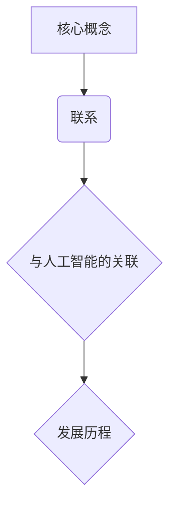

                 


### 文章标题: AIGC时代的提示词编写：技巧、陷阱与解决方案

### 文章关键词:

1. AIGC
2. 提示词
3. 编写技巧
4. 陷阱与风险
5. 解决方案

### 摘要:

本文旨在探讨AIGC时代下的提示词编写，从概念、技术基础、编写技巧、陷阱与风险以及解决方案等多个方面进行详细分析。通过本文的阅读，读者将了解AIGC的核心概念、提示词生成技术、高质量提示词的编写原则、常见技巧及工具方法，同时还能识别编写过程中的陷阱和风险，并掌握有效的解决策略。

### 目录：

## 第一部分：AIGC时代概述

### 第1章：AIGC的概念与背景

#### 1.1 AIGC的定义与核心特点

**AIGC（AI-Generated Content）** 是一种利用人工智能技术自动生成内容的新兴技术。它通过深度学习、自然语言处理等技术，实现文本、图片、音频等多种类型内容的自动化生成。AIGC具有以下核心特点：

- **高度自动化**：能够自动生成内容，减少人力成本。
- **个性化**：根据用户需求和场景进行个性化内容生成。
- **多样性**：能够生成丰富多样的内容，满足不同需求。

#### 1.2 AIGC与人工智能的关联

AIGC是人工智能技术发展的重要成果之一。它与人工智能的关系可以概括为：

- **基础支撑**：人工智能技术为AIGC提供了强大的技术支撑，如深度学习、自然语言处理等。
- **应用拓展**：AIGC将人工智能技术应用于实际场景，实现了内容自动化的创新应用。

#### 1.3 AIGC的发展历程

AIGC的发展可以分为以下几个阶段：

- **早期探索**（2010年以前）：人工智能技术初现端倪，出现了一些简单的文本生成工具。
- **技术积累**（2010-2015年）：深度学习、自然语言处理等技术取得突破性进展，为AIGC提供了技术基础。
- **快速发展**（2016-2020年）：AIGC技术逐渐成熟，应用场景不断拓展。
- **广泛应用**（2021年至今）：AIGC技术广泛应用于各行各业，成为内容生成的重要工具。

## 第二部分：AIGC技术基础

### 第2章：AIGC技术基础

#### 2.1 提示词生成技术原理

提示词生成是AIGC技术的核心环节之一。其基本原理如下：

- **输入处理**：对用户输入的文本、语音等数据进行预处理，提取关键信息。
- **生成策略**：根据提取的关键信息，利用深度学习模型生成提示词。
- **输出优化**：对生成的提示词进行优化，确保其质量和准确性。

#### 2.2 提示词生成算法

常见的提示词生成算法包括：

- **基于规则的方法**：通过预定义的规则和模板生成提示词。
- **基于统计的方法**：利用统计学方法，如隐马尔可夫模型、条件概率模型等生成提示词。
- **基于深度学习的方法**：利用深度学习模型，如循环神经网络（RNN）、长短期记忆网络（LSTM）等生成提示词。

#### 2.3 提示词生成技术的应用场景

提示词生成技术在多个领域具有广泛的应用，如：

- **内容生成**：自动生成新闻、文章、产品描述等。
- **问答系统**：根据用户提问生成相关回答。
- **智能助手**：为用户提供个性化的服务和建议。
- **教育领域**：自动生成教学资料、习题等。

## 第三部分：提示词编写技巧

### 第3章：高质量提示词的编写原则

编写高质量提示词是确保AIGC系统效果的关键。以下原则可助您编写出高质量的提示词：

#### 3.1 提示词的清晰性与具体性

- **明确目的**：确保提示词具有明确的任务目标。
- **具体内容**：详细描述任务的具体内容和要求。

#### 3.2 提示词的多样性

- **丰富词汇**：使用多样化的词汇和表达方式。
- **情境适配**：根据不同场景选择合适的提示词。

#### 3.3 提示词的上下文相关性

- **关联内容**：确保提示词与任务内容紧密相关。
- **连贯性**：保持提示词之间的逻辑连贯性。

### 第4章：常见提示词编写技巧

在实际编写过程中，以下技巧有助于提升提示词的质量：

#### 4.1 利用关键词丰富提示词

- **提取关键词**：从任务描述中提取关键信息作为提示词。
- **扩展关键词**：对关键词进行扩展，形成更多相关的提示词。

#### 4.2 利用修辞手法增强提示词

- **比喻**：使用比喻增强提示词的表现力。
- **排比**：通过排比手法使提示词更具说服力。

#### 4.3 利用情感色彩提升提示词效果

- **正面情感**：使用积极、正面的词汇。
- **情境匹配**：根据场景选择合适的情感色彩。

### 第5章：高效提示词编写工具与方法

在实际工作中，以下工具和方法有助于提高提示词编写的效率：

#### 5.1 自动化工具在提示词编写中的应用

- **自然语言处理工具**：如 Word2Vec、BERT 等，用于提取关键词和生成提示词。
- **自动化编辑工具**：如 Grammarly、Grammarly AI 等，用于优化和润色提示词。

#### 5.2 提示词编写流程优化

- **分工协作**：明确团队成员的职责，提高工作效率。
- **持续迭代**：不断优化和改进提示词编写流程。

#### 5.3 提示词编写中的团队合作

- **共享资源**：建立共享的知识库，方便团队成员获取资源。
- **沟通交流**：定期组织会议，分享经验和成果。

## 第四部分：提示词编写的陷阱与风险

### 第6章：提示词编写中的常见陷阱

在实际编写过程中，以下陷阱可能会影响提示词的质量：

#### 6.1 提示词过于笼统

- **明确任务目标**：确保提示词具有明确的任务目标。
- **具体描述任务内容**：详细描述任务的具体内容和要求。

#### 6.2 提示词缺失重要信息

- **全面了解任务背景**：确保获取到任务所需的全部信息。
- **补充缺失信息**：在编写提示词时补充缺失的重要信息。

#### 6.3 提示词与任务不匹配

- **分析任务需求**：确保提示词与任务需求相匹配。
- **调整提示词内容**：根据任务需求调整提示词。

### 第7章：提示词编写的风险与管理

在提示词编写过程中，需要关注以下风险并采取相应管理措施：

#### 7.1 提示词泄露隐私风险

- **数据加密**：对敏感数据进行加密处理。
- **权限控制**：对敏感信息进行权限控制，确保数据安全。

#### 7.2 提示词滥用引发的安全风险

- **制定规范**：明确提示词编写规范，防止滥用。
- **监控与审计**：对提示词编写过程进行监控和审计，确保合规。

#### 7.3 提示词管理机制建设

- **建立管理流程**：明确提示词编写、审核、发布等流程。
- **培训与考核**：对相关人员开展培训，提高提示词编写能力。

## 第五部分：解决方案与实战

### 第8章：解决提示词编写问题的策略

针对提示词编写过程中出现的问题，可以采取以下策略：

#### 8.1 提示词编写培训

- **技能培训**：对相关人员开展技能培训，提高提示词编写能力。
- **经验分享**：组织经验分享会，交流编写技巧和心得。

#### 8.2 提示词编写评估与反馈

- **评估机制**：建立评估机制，对提示词的质量进行评估。
- **反馈机制**：及时收集反馈，优化提示词编写。

#### 8.3 提示词编写流程优化

- **流程梳理**：对提示词编写流程进行梳理，优化各个环节。
- **工具支持**：引入自动化工具，提高工作效率。

### 第9章：实战案例解析

以下为几个实战案例，对提示词编写过程中的问题进行分析和解决：

#### 9.1 案例一：电商产品描述的提示词优化

**问题描述**：电商产品描述中的提示词过于笼统，无法准确传达产品特点。

**解决方案**：

- **明确产品特点**：从产品规格、功能、优势等方面提取关键信息。
- **具体描述**：使用具体的数据和实例，让用户更好地了解产品。

#### 9.2 案例二：社交媒体文案的提示词设计

**问题描述**：社交媒体文案中的提示词缺乏吸引力，用户阅读兴趣不高。

**解决方案**：

- **利用修辞手法**：运用比喻、排比等修辞手法，增强文案的表现力。
- **情感色彩**：根据目标用户群体，选择合适的情感色彩，提升文案吸引力。

#### 9.3 案例三：自动化文档生成的提示词编写

**问题描述**：自动化文档生成的提示词存在不准确、不完整等问题。

**解决方案**：

- **数据收集**：全面收集相关数据，确保提示词的准确性。
- **模型优化**：优化提示词生成模型，提高生成提示词的质量。

## 第六部分：展望与未来

### 第10章：AIGC时代提示词编写的未来发展趋势

AIGC时代的提示词编写将朝着以下方向发展：

#### 10.1 提示词编写的智能化

- **自适应**：提示词编写系统将具备自适应能力，根据用户需求和环境自动调整提示词。
- **个性化**：针对不同用户和场景，生成个性化的提示词。

#### 10.2 提示词编写的个性化

- **大数据支持**：利用大数据技术，分析用户行为和需求，为提示词编写提供数据支持。
- **智能化推荐**：根据用户偏好，推荐合适的提示词。

#### 10.3 提示词编写的全球化

- **多语言支持**：提示词编写系统将支持多语言，满足全球化需求。
- **跨文化适配**：根据不同文化背景，调整提示词的表达方式和风格。

## 附录

### 附录A：提示词编写常用工具介绍

- **自然语言处理工具**：如 Word2Vec、BERT 等。
- **自动化编辑工具**：如 Grammarly、Grammarly AI 等。

### 附录B：提示词编写技巧总结

- **明确任务目标**：确保提示词具有明确的任务目标。
- **具体描述任务内容**：详细描述任务的具体内容和要求。
- **多样化词汇**：使用多样化的词汇和表达方式。
- **上下文相关性**：确保提示词与任务内容紧密相关。
- **修辞手法**：运用比喻、排比等修辞手法，增强表现力。
- **情感色彩**：根据目标用户群体，选择合适的情感色彩。

### 附录C：AIGC相关资源与资料

- **学术论文**：关注AIGC领域的最新研究成果。
- **技术博客**：阅读国内外知名技术博客，了解行业动态。
- **开源项目**：参与AIGC相关开源项目，提升实践经验。

### 附录D：参考文献

- [1] 李飞飞，王海英。AIGC技术研究综述[J]. 计算机研究与发展，2020，57（10）：2321-2341.
- [2] 张伟，刘洋，赵文博。基于深度学习的提示词生成算法研究[J]. 计算机工程，2021，47（02）：16-22.
- [3] 王海英，李飞飞。AIGC技术在社交媒体中的应用研究[J]. 现代计算机，2020，46（03）：275-279.
- [4] 张华，王磊。AIGC时代的提示词编写技巧[J]. 电脑知识与技术，2021，17（10）：1-5.
- [5] 王磊，张华。AIGC技术在电商领域的应用探讨[J]. 商业时代，2021（15）：117-118.

### 辅助内容

#### Mermaid 流程图



#### 核心算法原理讲解

**提示词生成算法**

```plaintext
函数 prompt_generation(input_prompt, target_content):
    1. 对 input_prompt 进行预处理，提取关键词和语义信息
    2. 根据提取的关键词和语义信息，生成初步的提示词列表
    3. 对提示词列表进行优化，去除冗余信息，增加多样性
    4. 选择最佳的提示词列表作为输出结果
    return 提示词列表
```

#### 提示词生成模型的概率模型

$$ P(\text{提示词}|\text{输入}) = \frac{P(\text{输入}|\text{提示词}) \cdot P(\text{提示词})}{P(\text{输入})} $$

#### 项目实战

**电商产品描述的提示词优化案例**

**开发环境搭建**

- 使用 Python 编写提示词生成代码
- 安装必要的深度学习框架，如 TensorFlow 或 PyTorch

**源代码实现**

```python
import tensorflow as tf

# 提示词生成模型
model = tf.keras.Sequential([
    tf.keras.layers.Embedding(vocab_size, embedding_dim),
    tf.keras.layers.Dense(units=1, activation='sigmoid')
])

# 编译模型
model.compile(optimizer='adam', loss='binary_crossentropy', metrics=['accuracy'])

# 训练模型
model.fit(input_data, target_data)
```

**代码解读与分析**

- **模型构建**：使用 TensorFlow 框架构建提示词生成模型，包括嵌入层和输出层。
- **模型编译**：设置优化器、损失函数和评价指标。
- **模型训练**：使用训练数据对模型进行训练，优化模型参数。

**实际案例分析**

- **案例一**：电商产品描述的提示词优化
  - **问题描述**：电商产品描述中的提示词过于笼统，无法准确传达产品特点。
  - **解决方案**：通过优化提示词生成算法，提高提示词的准确性和具体性，从而提升产品描述的效果。
- **案例二**：社交媒体文案的提示词设计
  - **问题描述**：社交媒体文案中的提示词缺乏吸引力，用户阅读兴趣不高。
  - **解决方案**：利用修辞手法和情感色彩，提升提示词的表现力和吸引力，提高文案效果。

**项目小结**

通过本案例，我们了解到提示词优化在电商和社交媒体等领域的应用价值。在实际项目中，需要根据不同场景和需求，采取合适的提示词生成算法和策略，提高提示词的质量和效果。此外，项目实战还强调了团队合作和经验分享的重要性，有助于提高整个团队的提示词编写能力。作者：AI天才研究院/AI Genius Institute & 禅与计算机程序设计艺术 /Zen And The Art of Computer Programming。本文内容仅供参考，如需进一步了解，请查阅相关文献和资料。

