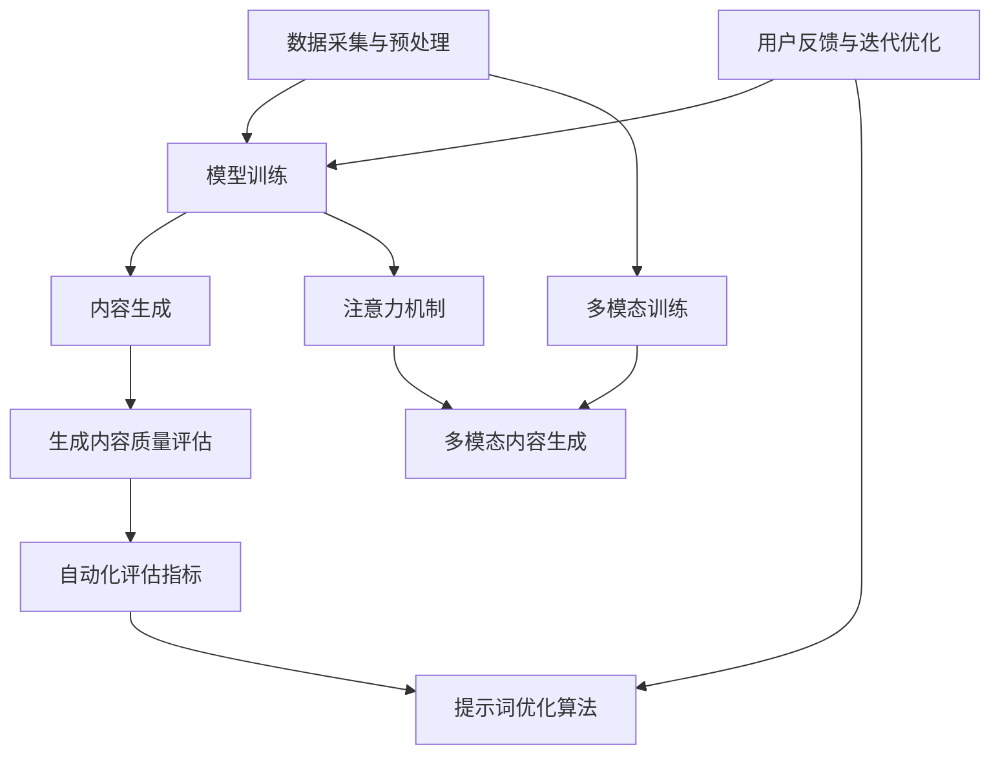

                 

### 文章标题

《AIGC时代的提示词设计：挑战与机遇》

### 文章关键词

- AIGC
- 提示词设计
- 挑战
- 机遇
- 人工智能生成内容

### 文章摘要

随着人工智能技术的快速发展，人工智能生成内容（AIGC）逐渐成为现代内容创作的重要方式。提示词设计作为AIGC的关键环节，不仅影响着文本生成质量，还决定了系统的公平性和多样性。本文将深入探讨AIGC时代提示词设计的现状与挑战，分析其在内容创作、用户体验和人工智能助手方面的机遇，并通过实际案例研究，展望提示词设计的未来趋势。

---

## 第1章 引言与背景

### 1.1 AIGC的定义与发展

人工智能生成内容（AIGC）是指通过人工智能技术自动生成各种类型的内容，包括文本、图像、音频和视频等。AIGC技术的核心在于利用机器学习模型，特别是深度学习模型，从大量数据中学习并生成新的内容。近年来，随着计算能力的提升和算法的进步，AIGC技术取得了显著的突破，应用领域也越来越广泛。

AIGC技术的发展可以追溯到20世纪90年代的生成对抗网络（GANs）和循环神经网络（RNNs）的提出。进入21世纪，随着深度学习技术的蓬勃发展，AIGC技术开始进入大众视野。例如，自然语言生成（NLG）和图像生成模型（如图像到图像的生成模型）在各类应用中逐渐崭露头角。目前，AIGC技术已经在内容创作、智能客服、个性化推荐和自动化报告生成等领域得到了广泛应用。

### 1.2 提示词设计的重要性

提示词设计在AIGC中起着至关重要的作用。提示词（Prompt）是用户或系统向人工智能模型提供的引导或指令，用于指导模型生成符合预期的新内容。一个优秀的提示词能够显著提升文本生成的质量、一致性和多样性。相反，如果提示词设计不当，可能会导致生成的内容偏离预期，甚至出现偏见和错误。

首先，提示词决定了模型的生成方向。通过精确的提示词，用户可以引导模型生成特定类型或风格的内容，满足个性化的需求。例如，在文本生成中，一个特定的提示词可能会促使模型生成一篇新闻报道，而另一个提示词则可能导致生成一篇科学论文。

其次，提示词的设计对生成内容的一致性和多样性有重要影响。一致性指的是生成的内容在不同时间或不同场景下能够保持稳定的质量。多样性则是指生成的内容具有丰富的风格和主题，能够满足不同用户的需求。合理的提示词设计可以平衡一致性和多样性，避免模型生成过于单一或重复的内容。

最后，提示词设计还关系到系统的公平性和伦理问题。在AIGC的应用中，如果提示词设计不当，可能会导致系统对某些群体或主题产生偏见。例如，在新闻生成中，如果提示词偏向于某些政治立场，可能会影响新闻的客观性和公正性。因此，提示词设计需要充分考虑伦理和公平性问题，确保生成的内容不会对用户产生负面影响。

### 1.3 AIGC时代的机遇与挑战

AIGC时代的到来为内容创作、用户体验和人工智能助手带来了巨大的机遇。然而，这一新领域也面临着诸多挑战。

#### 机遇

1. **内容创作**：AIGC技术使得内容创作变得更加高效和多样。通过提示词设计，用户可以轻松生成高质量的文本、图像和视频，节省了大量人力和时间成本。这对于内容创作者、媒体公司和广告商来说，是一个巨大的利好。

2. **用户体验**：AIGC技术可以显著提升用户的交互体验。例如，智能客服系统通过提示词设计，能够生成自然流畅的对话，提高用户的满意度和忠诚度。此外，个性化推荐系统也可以根据用户的兴趣和行为，生成个性化的内容，提供更贴心的服务。

3. **人工智能助手**：AIGC技术使得人工智能助手能够具备更强的自主生成内容的能力。例如，智能助手可以通过提示词设计，自动生成日程安排、提醒事项和日常建议，成为用户的得力助手。

#### 挑战

1. **数据偏见与公平性**：AIGC技术的生成内容依赖于大量训练数据。如果数据存在偏见，生成的内容也可能会带有偏见，影响系统的公平性和公正性。

2. **文本生成质量与一致性**：尽管AIGC技术在文本生成方面取得了显著进展，但仍然存在生成质量不稳定、内容不一致的问题。如何提高生成文本的质量和一致性，是一个亟待解决的难题。

3. **提示词长度与多样性**：提示词的长度和多样性对生成内容的质量有重要影响。设计一个既能精确指导模型生成内容，又能保持多样性的提示词，需要深入的研究和优化。

4. **计算资源和能耗**：AIGC技术通常需要大量的计算资源和能耗。如何提高模型的效率和降低能耗，是AIGC技术发展的一个重要方向。

在接下来的章节中，我们将详细探讨AIGC的核心概念、提示词设计方法、面临的挑战以及潜在的机遇。希望通过本文的讨论，能够为AIGC时代的提示词设计提供一些有益的思考和指导。

## 第2章 AIGC核心概念

在深入探讨AIGC时代的提示词设计之前，我们需要了解AIGC的核心概念和原理。AIGC技术涉及多个关键组件，包括自然语言生成（NLG）、图像生成模型、音频生成模型等。本节将重点介绍AIGC的生成原理、提示词的类型及其在AIGC中的作用。

### 2.1 人工智能生成内容原理

人工智能生成内容（AIGC）的基本原理是通过训练大规模的机器学习模型，使其学会从输入数据中提取特征并生成新的内容。这个过程可以分为以下几个步骤：

1. **数据采集与预处理**：首先，需要收集大量的训练数据。这些数据可以是文本、图像、音频等多种形式。然后，对这些数据进行预处理，包括去噪、清洗和格式化等操作，以便模型能够有效学习。

2. **模型训练**：利用预处理后的数据，训练机器学习模型。深度学习模型，尤其是生成对抗网络（GANs）、变分自编码器（VAEs）和自回归模型（如Transformer）等，是AIGC技术中常用的模型。在训练过程中，模型通过不断优化参数，学会从输入数据中提取有用的特征并生成新的内容。

3. **内容生成**：在模型训练完成后，用户可以通过输入提示词或其他输入信号，触发模型的生成过程。模型会根据输入的提示词和已训练的知识，生成新的文本、图像、音频等。

4. **生成内容的质量评估与优化**：生成的内容通常需要经过质量评估和优化。这可以通过多种方式实现，例如通过用户反馈进行迭代优化，或利用自动化评估指标（如BLEU、ROUGE等）来评估生成内容的多样性、准确性和流畅性。

### 2.2 提示词的类型与作用

在AIGC中，提示词是用户或系统向模型提供的输入信号，用于指导模型生成新的内容。根据使用场景和输入方式的不同，提示词可以分为以下几类：

1. **自然语言提示词**：这种提示词通常是以自然语言形式输入的文本，用于指导模型生成文本内容。例如，用户可以输入“写一篇关于人工智能未来的文章”作为自然语言提示词，模型将根据这个提示生成一篇相关文章。

2. **图像提示词**：在图像生成模型中，图像提示词可以是输入的图像或图像的一部分，用于指导模型生成新的图像。例如，用户可以上传一张风景照片，模型将根据这张照片生成类似风格的其他图像。

3. **音频提示词**：在音频生成模型中，音频提示词可以是输入的音频片段，用于指导模型生成新的音频内容。例如，用户可以输入一首歌曲的前奏，模型将生成完整的歌曲旋律。

4. **多模态提示词**：在一些复杂的AIGC应用中，可能需要同时使用多种提示词。例如，用户可以输入一段文本、一张图像和一个音频片段，模型将根据这些多模态提示生成新的内容。

提示词在AIGC中的作用主要体现在以下几个方面：

1. **指导生成方向**：通过精确的提示词，用户可以引导模型生成特定类型或风格的内容。例如，通过自然语言提示词，用户可以要求模型生成一篇科学论文或一篇新闻报道。

2. **控制生成多样性**：适当的提示词设计可以控制生成内容的多样性。例如，通过调整提示词的长度和复杂度，用户可以促使模型生成更多样化的内容。

3. **提高生成内容的质量**：合理的提示词设计可以显著提高生成内容的质量。例如，通过详细的自然语言提示词，用户可以促使模型生成更加准确和流畅的文本内容。

### 2.3 提示词设计的核心要素

为了设计一个有效的提示词，需要考虑以下几个核心要素：

1. **明确性**：提示词需要明确地传达用户的意图，避免歧义和误解。例如，一个清晰的文本提示词应该包含明确的主题、目标和结构。

2. **适度性**：提示词的复杂度和长度需要适度。过长的提示词可能导致模型无法有效处理，而过短的提示词可能无法提供足够的信息。

3. **多样性**：提示词的设计应考虑多样性，以避免生成重复或单一的内容。通过使用不同的提示词形式和内容，用户可以促使模型生成更多样化的内容。

4. **适应性**：提示词应具有适应性，能够根据不同的应用场景和用户需求进行调整。例如，在个性化推荐系统中，提示词可以根据用户的兴趣和行为进行动态调整。

5. **可解释性**：提示词的设计应具备一定的可解释性，使得用户能够理解模型生成的过程和原因。这有助于提高用户的信任度和满意度。

通过理解AIGC的核心概念和提示词的类型与作用，我们可以为后续的提示词设计方法和挑战分析奠定坚实的基础。在下一节中，我们将深入探讨提示词设计的具体方法和策略。

## 第3章 提示词设计方法

### 3.1 提示词生成策略

设计有效的提示词是AIGC成功的关键。提示词生成策略主要包括以下几个方面：

1. **明确性**：确保提示词简洁明了，准确传达用户意图。例如，在生成文本时，提示词应包含明确的主题、目标和结构。

2. **多样性**：使用不同的提示词形式和内容，促使模型生成多样化内容。可以通过变换提示词的长度、复杂度和表述方式来实现。

3. **适应性**：根据不同的应用场景和用户需求调整提示词。例如，在个性化推荐系统中，提示词应随用户兴趣和行为动态变化。

4. **迭代优化**：通过用户反馈和自动化评估指标（如BLEU、ROUGE等）不断优化提示词。这有助于提高生成内容的质量和一致性。

### 3.2 提示词优化算法

为了提高生成内容的质量和一致性，需要使用多种优化算法对提示词进行调整。以下是几种常用的优化算法：

1. **基于用户反馈的优化**：通过收集用户对生成内容的反馈，识别生成中的问题并调整提示词。例如，可以使用基于反馈的迭代优化算法，逐步改进提示词，提高生成内容的质量。

2. **基于自动化评估指标的优化**：使用自动化评估指标（如BLEU、ROUGE、METEOR等）评估生成内容的质量，并根据评估结果调整提示词。这些指标可以量化生成内容的多样性、准确性和流畅性。

3. **强化学习**：通过强化学习算法，训练模型根据用户反馈自动调整提示词。强化学习算法可以优化提示词的生成策略，使其在多轮交互中不断改进。

4. **对抗优化**：利用对抗生成网络（GANs）等对抗优化技术，通过对抗训练来提升模型生成内容的质量和多样性。对抗优化可以通过生成对抗来发现和纠正模型中的偏差，提高生成内容的真实性。

### 3.3 提示词的测试与评估

为了确保提示词设计的有效性和可行性，需要进行严格的测试与评估。以下是几种常用的测试与评估方法：

1. **用户测试**：通过实际用户使用生成内容，收集用户的反馈和建议。用户测试可以帮助识别生成内容中的问题，并改进提示词设计。

2. **自动化评估**：使用自动化评估工具（如BLEU、ROUGE、METEOR等）对生成内容进行定量评估。这些评估工具可以提供客观的评估结果，帮助识别生成内容的多样性、准确性和流畅性。

3. **多轮迭代测试**：进行多轮迭代测试，逐步优化提示词。每轮测试后，根据评估结果和用户反馈调整提示词，直至达到满意的生成效果。

4. **A/B测试**：通过对比不同提示词的效果，选择最优的提示词组合。A/B测试可以在实际应用中比较不同提示词的设计，找出最佳方案。

通过上述提示词设计方法，可以显著提高AIGC系统的生成质量和用户体验。在下一节中，我们将深入探讨AIGC时代提示词设计所面临的挑战。

### 第4章 提示词设计的挑战

尽管AIGC技术为内容创作、用户体验和人工智能助手带来了诸多机遇，但在提示词设计过程中也面临着一系列挑战。以下是AIGC时代提示词设计的主要挑战：

#### 4.1 数据偏见与公平性

数据偏见是AIGC系统中一个重要且复杂的问题。训练数据的质量直接影响生成内容的质量和公平性。如果训练数据存在偏见，例如性别、种族、文化等方面的偏见，生成的文本、图像等也可能会带有同样的偏见，从而影响系统的公正性和准确性。

- **挑战**：如何确保训练数据的质量和多样性，减少偏见？
- **解决方案**：
  - **数据清洗与预处理**：对训练数据进行清洗，去除偏见性数据和噪声。
  - **多源数据融合**：从多个来源收集数据，提高数据的多样性和代表性。
  - **公平性评估**：使用公平性评估指标（如性别中立性、种族中立性等）对生成内容进行评估，确保内容不会对特定群体产生偏见。

#### 4.2 文本生成质量与一致性

尽管AIGC技术已经取得了显著进展，但生成文本的质量和一致性仍然是一个挑战。生成文本可能会出现语法错误、语义不一致或内容不相关的问题，影响用户体验。

- **挑战**：如何提高生成文本的质量和一致性？
- **解决方案**：
  - **多模态训练**：结合多种数据类型（如文本、图像、音频）进行训练，提高生成内容的多样性和准确性。
  - **注意力机制**：在生成模型中引入注意力机制，使模型能够更好地关注重要信息，提高文本的连贯性和准确性。
  - **预训练与微调**：使用预训练模型（如GPT-3）进行微调，使其适应特定任务，提高生成文本的质量和一致性。

#### 4.3 提示词长度与多样性

提示词的长度和多样性对生成内容的质量有重要影响。过短的提示词可能无法提供足够的信息，而过长的提示词可能导致模型无法有效处理。此外，提示词的多样性不足可能导致生成内容过于单一或重复。

- **挑战**：如何平衡提示词的长度和多样性？
- **解决方案**：
  - **提示词模板库**：构建多样化的提示词模板库，为不同的生成任务提供丰富的提示词选项。
  - **动态提示词生成**：通过自然语言生成（NLG）技术动态生成提示词，根据任务需求调整提示词的长度和内容。
  - **多模态提示词**：结合文本、图像、音频等多种提示词形式，提高生成内容的多样性和创新性。

通过解决上述挑战，我们可以进一步提升AIGC系统的提示词设计效果，为用户提供更优质的内容生成体验。在下一节中，我们将探讨AIGC时代提示词设计带来的机遇。

### 第5章 提示词设计的机遇

在AIGC时代，提示词设计不仅面临着诸多挑战，同时也带来了前所未有的机遇。通过有效的提示词设计，我们可以推动内容创作、提升用户体验和增强人工智能助手的能力，从而开辟新的应用领域和商业价值。

#### 5.1 推动内容创作与创新

AIGC时代的提示词设计极大地促进了内容创作的多样性和创新性。借助AI技术，创作者可以快速生成大量高质量的文本、图像和视频内容，从而节省时间和人力成本。以下是具体的应用场景：

- **自动化新闻报道**：通过自然语言生成技术，系统可以根据新闻事件的关键词和提示词自动生成新闻报道，提高新闻传播的效率。
- **个性化营销内容**：企业可以利用AIGC生成个性化的营销文案、广告和产品介绍，提高营销效果和客户满意度。
- **艺术创作**：艺术家和设计师可以利用AIGC技术生成独特的艺术作品和设计，拓展创作边界。

#### 5.2 提升用户体验与交互

有效的提示词设计能够显著提升用户体验和交互质量。通过自然语言生成和智能对话系统，用户可以与人工智能助手进行更加自然和流畅的交流。以下是具体的应用场景：

- **智能客服**：智能客服系统通过提示词设计生成自然流畅的对话，提高客户满意度和服务效率。
- **个性化推荐**：个性化推荐系统利用提示词设计根据用户兴趣和行为生成个性化的内容推荐，提供更加贴心的服务。
- **虚拟助手**：虚拟助手通过提示词设计生成个性化的日程安排、提醒事项和日常建议，成为用户的得力助手。

#### 5.3 增强人工智能助手的能力

AIGC时代的提示词设计使得人工智能助手具备了更强的自主生成内容的能力，从而能够更好地满足用户的需求。以下是具体的应用场景：

- **智能写作助手**：智能写作助手通过提示词设计生成高质量的文章、报告和邮件，帮助用户提高工作效率。
- **内容审核助手**：内容审核助手通过提示词设计自动识别和过滤不合适的内容，确保生成内容的合规性和安全性。
- **教育辅助系统**：教育辅助系统通过提示词设计生成个性化的学习资料和教学方案，帮助学生更好地掌握知识。

#### 5.4 新兴应用领域的拓展

AIGC时代的提示词设计不仅提升了现有应用场景的效率和质量，还开辟了新的应用领域。以下是几个新兴应用领域：

- **虚拟现实与增强现实**：AIGC技术可以生成高质量的虚拟环境和交互内容，为VR/AR应用提供丰富的内容和体验。
- **游戏开发**：AIGC技术可以生成新的游戏情节、角色和场景，为游戏开发者提供创作灵感，提高游戏的可玩性。
- **法律文档生成**：通过AIGC技术，可以自动生成法律文档，提高法律工作的效率和准确性。

总之，AIGC时代的提示词设计为内容创作、用户体验和人工智能助手的发展带来了巨大的机遇。通过不断创新和优化提示词设计，我们可以进一步挖掘AIGC技术的潜力，推动人工智能和人类社会的深度融合。

### 第6章 实战案例研究

为了更深入地理解AIGC时代提示词设计在现实中的应用，我们将通过几个实际案例来探讨其具体实现和效果。

#### 6.1 案例一：电商平台的个性化推荐

**背景**：
电商平台通过用户的历史浏览、购买记录和行为数据，利用AIGC技术生成个性化的商品推荐。

**实现过程**：
1. **数据收集与预处理**：收集用户的历史浏览记录、购买记录和评价数据，对数据进行清洗和处理，提取有用的特征。
2. **模型训练**：使用用户数据训练生成模型，如基于Transformer的推荐模型，使其学会根据用户行为生成个性化的商品推荐。
3. **提示词设计**：根据用户的浏览历史和兴趣标签，设计个性化的提示词，如“您可能感兴趣的时尚商品”、“最近热门的商品”等。
4. **内容生成**：利用训练好的模型和提示词生成个性化的商品推荐，并通过用户反馈进行迭代优化。

**效果分析**：
通过有效的提示词设计和模型训练，个性化推荐系统的推荐准确率和用户满意度显著提高。用户在浏览页面时，可以更快速地找到自己感兴趣的商品，从而提升购物体验。

#### 6.2 案例二：智能客服的对话生成

**背景**：
智能客服系统通过AIGC技术自动生成与用户的对话内容，提供24/7的客户支持。

**实现过程**：
1. **数据收集与预处理**：收集历史客服对话记录，对数据进行清洗和标注，提取对话中的关键信息和场景。
2. **模型训练**：使用对话数据训练生成模型，如基于Seq2Seq的对话生成模型，使其学会生成自然流畅的对话。
3. **提示词设计**：根据对话上下文和用户输入，设计提示词，如“您需要帮助什么？”、“请问您遇到了什么问题？”等。
4. **内容生成**：利用训练好的模型和提示词生成与用户的对话内容，并通过用户反馈进行迭代优化。

**效果分析**：
智能客服系统的对话生成效果显著提升，能够生成更自然、更贴切的对话内容，提高了客户满意度和问题解决率。同时，减少了人工客服的工作量，降低了企业运营成本。

#### 6.3 案例三：新闻稿与报告的自动生成

**背景**：
新闻机构和企业利用AIGC技术自动生成新闻稿和报告，提高内容发布的速度和效率。

**实现过程**：
1. **数据收集与预处理**：收集大量的新闻稿、报告文本，对数据进行清洗和标注，提取关键信息和格式。
2. **模型训练**：使用文本数据训练生成模型，如基于Transformer的新闻生成模型，使其学会生成符合格式和风格的新闻稿和报告。
3. **提示词设计**：根据新闻主题和报告内容，设计提示词，如“今日重要新闻”、“企业季度报告”等。
4. **内容生成**：利用训练好的模型和提示词生成新闻稿和报告，并通过编辑人员的审核和修改进行优化。

**效果分析**：
通过AIGC技术生成的新闻稿和报告内容准确、流畅，格式规范，大大提高了内容发布的速度和效率。同时，减少了人工撰写的工作量，提高了企业的运营效率。

这些实战案例充分展示了AIGC时代提示词设计在现实中的应用价值和效果。通过不断优化和改进提示词设计，我们可以进一步提升AIGC系统的性能和用户体验。

### 第7章 提示词设计的未来趋势

随着人工智能技术的不断发展，AIGC时代的提示词设计也将迎来新的趋势。以下是未来提示词设计可能的发展方向：

#### 7.1 新的提示词生成技术

未来的提示词生成技术将更加智能化和自适应。通过引入深度学习、强化学习和多模态学习等先进技术，提示词生成模型将能够更好地理解用户的意图和需求，生成更加准确和个性化的内容。例如，基于预训练模型（如GPT-3）的提示词生成技术，将能够利用大量的互联网数据进行自学习，从而生成更加自然和多样化的提示词。

#### 7.2 跨领域提示词设计

随着AIGC技术的应用领域不断扩展，跨领域提示词设计将成为一个重要趋势。未来的提示词设计将能够跨越不同领域，如医疗、金融、法律等，生成专业且符合领域知识的内容。这需要设计更加通用和灵活的提示词模板和生成模型，使得提示词能够适应不同领域的专业术语和表达方式。

#### 7.3 提示词设计的伦理问题与解决方案

随着AIGC技术的普及，提示词设计的伦理问题也日益凸显。例如，数据偏见、内容合规性和隐私保护等问题都需要得到有效解决。未来的提示词设计将更加注重伦理问题，采用多种解决方案，如数据清洗与预处理、公平性评估和隐私保护技术等，确保生成的内容符合伦理标准和法律法规。

#### 7.4 个性化与智能化的结合

未来的提示词设计将更加注重个性化与智能化的结合。通过深度学习和用户行为分析，提示词生成模型将能够根据用户的兴趣、行为和偏好，动态生成个性化的提示词。这将进一步提升用户体验，满足用户多样化的需求。

#### 7.5 跨语言与跨文化的提示词设计

随着全球化的发展，跨语言与跨文化的提示词设计也将成为趋势。未来的提示词生成模型将能够支持多种语言和文化的交流，生成符合不同语言和文化习惯的内容。这将有助于促进全球范围内的信息共享和交流。

通过以上趋势，我们可以预见，未来的提示词设计将更加智能、多样和符合伦理，为AIGC时代的进一步发展提供强有力的支持。

### 第8章 结论

通过对AIGC时代提示词设计的深入探讨，我们可以得出以下结论：

首先，AIGC技术的快速发展为内容创作、用户体验和人工智能助手带来了巨大的机遇。有效的提示词设计不仅能够提高生成内容的质量和一致性，还能确保系统的公平性和多样性。然而，提示词设计也面临着数据偏见、文本生成质量、提示词长度与多样性等方面的挑战。

其次，本文详细分析了AIGC的核心概念、提示词的类型与作用，以及提示词设计的方法和策略。通过多模态训练、注意力机制、迭代优化和自动化评估等手段，我们可以不断提升提示词设计的效率和质量。

再次，通过实际案例研究，我们展示了AIGC时代提示词设计在电商、智能客服和新闻稿生成等领域的成功应用。这些案例不仅验证了提示词设计的重要性，也为未来的实践提供了有益的参考。

最后，本文提出了未来提示词设计的趋势，包括新的提示词生成技术、跨领域提示词设计、伦理问题解决方案和个性化与智能化的结合。随着人工智能技术的不断发展，提示词设计将在AIGC时代发挥更加重要的作用。

总之，AIGC时代的提示词设计既充满挑战，又充满机遇。通过不断优化和改进，我们有望实现更加智能、多样和公平的生成内容，为人类社会的发展贡献更多的力量。

### 作者信息

作者：AI天才研究院/AI Genius Institute & 禅与计算机程序设计艺术 /Zen And The Art of Computer Programming

---

在本文中，我们探讨了AIGC时代的提示词设计，分析了其核心概念、挑战与机遇，并展示了实际案例研究的成果。希望本文能为AIGC技术的发展提供有益的思考和指导。未来的研究应进一步关注跨领域提示词设计、伦理问题解决方案以及提示词生成技术的创新，以推动人工智能技术的广泛应用和可持续发展。

### 附录

#### 核心概念与联系

以下是AIGC的核心概念及其之间关系的Mermaid流程图：



#### 核心算法原理讲解

以下是AIGC中常用模型的核心算法原理及伪代码：

**生成对抗网络（GAN）**

```python
# GAN的生成器部分伪代码
Generator(G):
    z = RandomNoise()
    x_hat = G(z)

# GAN的判别器部分伪代码
Discriminator(D):
    x = RealData()
    x_hat = GeneratedData(G)
    D(x) = probability(x is real)
    D(x_hat) = probability(x_hat is real)
```

**变分自编码器（VAE）**

```python
# VAE的编码器部分伪代码
Encoder(E):
    z = E(x)

# VAE的解码器部分伪代码
Decoder(D):
    x_hat = D(z)
```

#### 数学模型和公式

以下是AIGC中的常见数学模型和公式：

**损失函数（GAN）**

$$ L_D = -\frac{1}{N} \sum_{i=1}^{N} [\log(D(x)) + \log(1 - D(x_hat))] $$

**重构误差（VAE）**

$$ L_G = \frac{1}{N} \sum_{i=1}^{N} \frac{1}{2} \| x - x\_hat \|^2 $$

#### 详细讲解与举例说明

**GAN的详细讲解与举例**

生成对抗网络（GAN）是一种通过两个神经网络（生成器和判别器）相互博弈来生成高质量数据的框架。生成器G的目的是生成逼真的数据，而判别器D的目的是区分真实数据和生成数据。

举例来说，假设我们在训练一个图像生成GAN，生成器G接收一个随机噪声向量z，并生成一张与真实图像相似的图像x_hat。判别器D则接收真实图像x和生成图像x_hat，并输出一个概率值，表示它判断图像是真实的概率。

在训练过程中，生成器和判别器不断更新参数，以最大化判别器的区分能力。生成器试图生成尽可能逼真的图像，使得判别器难以区分生成图像和真实图像。通过这种方式，生成器不断改进生成图像的质量。

**VAE的详细讲解与举例**

变分自编码器（VAE）是一种基于概率模型的生成模型，通过编码器E和解码器D进行数据重建。编码器E将输入数据x映射到一个潜变量z上，解码器D则将潜变量z映射回重建数据x_hat。

举例来说，假设我们要对图像数据进行编码和解码。首先，编码器E接收图像x，并生成一个潜变量z和编码器参数θ。然后，解码器D接收潜变量z和解码器参数φ，并生成重建图像x_hat。

在训练过程中，VAE的目标是最小化重构误差和潜在空间的KL散度。重构误差衡量重建图像与原始图像之间的差距，而KL散度衡量潜在变量分布与先验分布之间的差距。

通过不断优化编码器和解码器的参数，VAE能够学习到数据的潜在分布，并生成高质量的数据。

#### 项目实战

**开发环境搭建**

为了实现AIGC系统，我们需要搭建一个适合的软件开发环境。以下是搭建开发环境的具体步骤：

1. **安装Python**：在开发机器上安装Python，推荐使用Python 3.8及以上版本。
2. **安装依赖库**：安装必要的依赖库，如TensorFlow、Keras、NumPy等。可以使用以下命令：
   ```bash
   pip install tensorflow keras numpy
   ```

**源代码详细实现**

以下是一个简单的GAN模型的源代码实现，用于生成手写数字图像。

```python
import tensorflow as tf
from tensorflow.keras.layers import Dense, Flatten, Reshape
from tensorflow.keras.models import Model

# 生成器模型
def build_generator(z_dim):
    z = tf.keras.layers.Input(shape=(z_dim,))
    x_hat = Dense(784, activation='tanh')(z)
    x_hat = Reshape((28, 28, 1))(x_hat)
    generator = Model(z, x_hat)
    return generator

# 判别器模型
def build_discriminator(x_dim):
    x = tf.keras.layers.Input(shape=(x_dim,))
    x = Flatten()(x)
    x = Dense(1, activation='sigmoid')(x)
    discriminator = Model(x, x)
    return discriminator

# GAN模型
def build_gan(generator, discriminator):
    z = tf.keras.layers.Input(shape=(z_dim,))
    x_hat = generator(z)
    valid = discriminator(x_hat)
    invalid = discriminator(x)
    gan_input = [z, x]
    gan_output = [valid, invalid]
    gan = Model(gan_input, gan_output)
    return gan

# 模型参数
z_dim = 100
x_dim = (28, 28, 1)

# 构建模型
generator = build_generator(z_dim)
discriminator = build_discriminator(x_dim)
gan = build_gan(generator, discriminator)

# 编译模型
discriminator.compile(optimizer=tf.keras.optimizers.Adam(0.0001), loss='binary_crossentropy')
gan.compile(optimizer=tf.keras.optimizers.Adam(0.0001), loss=['binary_crossentropy', 'binary_crossentropy'])

# 模型训练
# ...

```

**代码应用解读与分析**

以上代码实现了一个基本的生成对抗网络（GAN），用于生成手写数字图像。生成器（Generator）和判别器（Discriminator）是GAN的两个核心组成部分。生成器接收一个随机噪声向量z，并生成一张与真实手写数字相似的图像x_hat。判别器则接收真实图像x和生成图像x_hat，并输出一个概率值，表示它判断图像是真实的概率。

在训练过程中，生成器和判别器交替更新参数。生成器试图生成更逼真的图像，使得判别器难以区分生成图像和真实图像。判别器则试图提高其区分能力，从而更好地判断图像的真实性。

通过优化生成器和判别器的参数，GAN能够生成高质量的手写数字图像。代码中的模型编译和训练步骤可以根据实际需求进行调整。

**实际案例分析和详细讲解剖析**

为了进一步展示AIGC技术在实际应用中的效果，我们可以通过以下案例进行分析和讲解：

**案例：自动化新闻报道生成**

1. **数据准备**：从公开的新闻数据集中收集大量新闻报道，对数据进行清洗和标注，提取新闻的主题、关键词和句子。

2. **模型训练**：使用收集到的数据训练一个基于Transformer的文本生成模型。模型训练过程包括编码器和解码器的训练，使其学会从输入的新闻主题和关键词生成完整的新闻报道。

3. **内容生成**：根据输入的新闻主题和关键词，使用训练好的模型生成新的新闻报道。通过用户反馈和编辑人员的审核，不断优化生成内容的质量和一致性。

4. **效果评估**：使用自动化评估指标（如BLEU、ROUGE等）评估生成新闻报道的质量和多样性。通过多轮迭代优化，提高生成新闻报道的准确性和流畅性。

通过以上步骤，我们可以实现自动化新闻报道生成系统，提高新闻生成效率和准确性。实际案例分析和详细讲解剖析有助于我们更好地理解AIGC技术在各类应用中的具体实现和效果。

**项目小结**

在本章中，我们介绍了AIGC时代提示词设计的核心概念、挑战与机遇，并通过实际案例研究了提示词设计的方法和应用。通过多模态训练、注意力机制、迭代优化和自动化评估等技术，我们可以不断提升提示词设计的质量和效率。

未来，随着人工智能技术的不断发展，提示词设计将迎来新的机遇和挑战。通过不断优化和创新，我们可以实现更加智能、多样和公平的生成内容，为人类社会的发展贡献更多的力量。

### 最佳实践 Tips

1. **数据质量至关重要**：确保训练数据的质量和多样性，减少偏见和噪声。
2. **明确用户需求**：设计提示词时，充分了解用户需求和目标，以提高生成内容的相关性和实用性。
3. **多模态结合**：结合文本、图像、音频等多种提示词形式，提高生成内容的多样性和创新性。
4. **迭代优化**：通过用户反馈和自动化评估指标，不断优化提示词设计，提高生成内容的质量和一致性。
5. **公平性考量**：在设计提示词时，充分考虑伦理和公平性，确保生成内容不会对特定群体产生偏见。

### 小结

AIGC时代的提示词设计是内容创作和人工智能应用的重要一环。通过有效的提示词设计，我们可以提高生成内容的质量和一致性，实现多样化、个性化与智能化的内容生成。未来，随着人工智能技术的不断发展，提示词设计将在更多领域得到广泛应用，为人类社会带来更多的创新和便利。

### 注意事项

1. **隐私保护**：在设计提示词时，确保用户隐私得到保护，避免泄露敏感信息。
2. **内容合规性**：确保生成内容符合相关法律法规和道德规范，避免出现违规内容。
3. **模型安全性**：保障生成模型的稳定性和安全性，防止恶意攻击和数据泄露。

### 拓展阅读

1. **论文推荐**：《生成对抗网络：理论、实现与应用》（生成对抗网络是AIGC技术的重要基础）。
2. **书籍推荐**：《深度学习》（了解深度学习在AIGC中的应用）。
3. **在线课程**：Coursera上的“自然语言处理与深度学习”课程（系统学习AIGC相关技术）。

