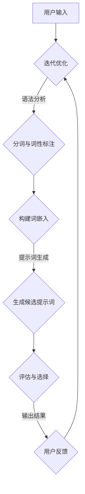

                 

### 《AIGC时代的提示词设计：挑战与机遇并存》目录大纲

#### 引言

本文将深入探讨AIGC时代的提示词设计，这一主题不仅关系到人工智能技术的应用深度，也影响着用户体验和系统性能。首先，我们将对AIGC技术进行概述，理解其在现代科技中的地位和作用。接下来，我们将详细分析提示词设计在AIGC中的应用，探讨其面临的挑战和机遇。然后，我们将介绍一些实用的提示词设计方法，并结合实际案例展示其应用。在讨论过程中，我们会使用Mermaid流程图和伪代码来辅助说明核心概念和算法原理。最后，我们还会展望提示词设计的未来趋势，并提出一些最佳实践建议。

#### 关键词

- AIGC（AI-Generated Content）
- 提示词设计
- 人工智能
- 自然语言处理
- 用户交互

#### 摘要

本文旨在探讨AIGC时代的提示词设计，分析其重要性、设计原则、实践方法和未来趋势。通过结合实际案例和核心技术，我们展示了如何应对设计中的挑战，把握机遇，从而提高人工智能系统的性能和用户体验。文章将引导读者深入了解这一领域的核心概念和最新进展，为未来的研究和应用提供参考。

### 第一部分：AIGC时代概述

#### 1.1 AIGC技术背景与定义

**AIGC（AI-Generated Content）**，即人工智能生成内容，是近年来随着人工智能技术的快速发展而出现的新兴领域。AIGC技术利用人工智能算法，特别是生成对抗网络（GAN）、变分自编码器（VAE）和自动回归模型等，能够自动生成文本、图像、音频等多种形式的内容。

**AIGC技术的发展历程**可以追溯到2000年代中期，当时深度学习和神经网络开始得到广泛关注。随着计算能力的提升和数据量的激增，深度学习技术在图像和语音处理等领域取得了显著突破。2014年，GAN的提出标志着人工智能生成内容的新纪元。GAN由生成器（Generator）和判别器（Discriminator）组成，通过两个网络的对抗训练，生成逼真的图像和文本。

**AIGC的核心技术**包括：

- **生成对抗网络（GAN）**：通过生成器和判别器的对抗训练，生成高仿真的数据。
- **变分自编码器（VAE）**：通过编码器和解码器，实现数据的降维和重建。
- **自动回归模型（AR）**：用于生成序列数据，如文本、时间序列等。

**AIGC的应用场景**广泛，包括但不限于以下领域：

- **文本生成**：生成新闻报道、文章摘要、对话系统等。
- **图像生成**：生成艺术作品、人脸合成、场景模拟等。
- **音频生成**：生成音乐、语音合成等。
- **视频生成**：生成短视频、电影片段等。

#### 1.2 AIGC与提示词设计的关系

**提示词设计**在AIGC中起着至关重要的作用。提示词（Prompt）是用户或系统输入的文本，用于引导生成器生成目标内容。一个优秀的提示词能够提高生成内容的准确性和质量，同时减少生成过程中的噪声和偏差。

**提示词设计在AIGC中的重要性**主要体现在以下几个方面：

- **引导生成方向**：提示词能够明确指出生成器的目标，帮助其避免无意义的生成。
- **提高生成效率**：通过有效的提示词设计，可以减少生成器的搜索空间，提高生成速度。
- **提升用户体验**：优质的提示词能够提高生成内容的质量，从而提升用户体验。

**提示词设计的挑战与机遇**：

- **挑战**：
  - 数据隐私与伦理问题：提示词可能包含敏感信息，需要妥善处理。
  - 提示词效果评估：如何衡量提示词的有效性，是一个需要深入研究的问题。
  - 多语言与跨文化适配：不同语言和文化背景下，提示词的设计和效果可能存在差异。

- **机遇**：
  - 创新应用领域拓展：随着AIGC技术的成熟，新的应用领域不断涌现，为提示词设计提供了广阔的舞台。
  - 提升用户体验：通过精细化的提示词设计，可以提升用户的交互体验，增加用户黏性。
  - 提高生产效率：高效的提示词设计可以显著提高内容生成的速度和质量，降低人力成本。

#### 1.3 AIGC时代的提示词设计原则

**AIGC时代的提示词设计原则**主要包括以下几个方面：

- **明确性**：提示词应明确传达生成任务的目标，避免歧义。
- **精确性**：提示词应包含关键信息，帮助生成器更好地理解任务要求。
- **灵活性**：提示词应具有一定的灵活性，允许生成器在一定范围内探索生成结果。
- **多样性**：提示词应涵盖多种生成可能性，以提高生成内容的多样性。

**提示词设计的理论基础**主要包括自然语言处理（NLP）和机器学习（ML）中的相关技术。例如，词嵌入（Word Embedding）、序列到序列（Seq2Seq）模型、注意力机制（Attention Mechanism）等，都是提示词设计的重要理论基础。

**提示词设计的实践方法**主要包括以下几个方面：

- **文本分析技术**：通过对输入文本进行分词、词性标注、实体识别等处理，提取关键信息作为提示词。
- **数据驱动方法**：基于大规模数据集，使用统计模型或深度学习模型，自动生成提示词。
- **模式识别技术**：通过分析大量成功的提示词，提取模式，为新任务的提示词设计提供参考。

### 第二部分：提示词设计实践

#### 2.1 提示词设计方法

**提示词设计方法**主要包括以下几个方面：

- **文本分析技术**：文本分析技术能够帮助我们理解输入文本的结构和语义，提取关键信息作为提示词。常用的文本分析技术包括分词、词性标注、命名实体识别、依存句法分析等。

- **数据驱动方法**：数据驱动方法是基于大规模数据集，使用统计模型或深度学习模型，自动生成提示词。这种方法通常涉及训练一个模型，用于从输入文本中提取关键信息，并生成相应的提示词。

- **模式识别技术**：模式识别技术通过分析大量成功的提示词，提取模式，为新任务的提示词设计提供参考。这种方法适用于有大量成功案例的场景，可以显著提高提示词设计的效率。

**2.1.1 文本分析技术**

**分词**是文本分析的基础步骤，它将连续的文本序列分割成一组词语序列。分词的准确性对后续的词性标注和实体识别有重要影响。常用的分词方法包括基于词典的分词、基于统计的分词和基于深度学习的分词。

**词性标注**是对文本中的每个词进行词性分类，如名词、动词、形容词等。词性标注有助于理解文本的语义，为生成提示词提供依据。常用的词性标注方法包括基于规则的方法、基于统计的方法和基于深度学习的方法。

**命名实体识别**是从文本中识别出具有特定意义的实体，如人名、地名、组织名等。命名实体识别有助于提取关键信息，提高提示词的精确性。

**依存句法分析**是分析句子中词语之间的依存关系，如主谓关系、动宾关系等。依存句法分析有助于理解句子的语义结构，为生成提示词提供更精细的信息。

**2.1.2 数据驱动方法**

**统计模型**：统计模型通过分析输入文本和对应的提示词，使用统计方法生成提示词。常用的统计模型包括朴素贝叶斯、最大熵模型和条件概率模型等。

**深度学习模型**：深度学习模型，如循环神经网络（RNN）、长短期记忆网络（LSTM）和变换器（Transformer）等，可以通过端到端的方式学习输入文本和提示词之间的映射关系。这些模型在处理长文本和复杂语义方面具有优势。

**2.1.3 模式识别技术**

**案例学习**：案例学习通过分析大量成功案例，提取提示词设计中的规律和模式。这种方法适用于新任务的提示词设计，可以快速提供有效的提示词。

**规则提取**：规则提取从成功案例中提取规则，用于指导新任务的提示词设计。这种方法适用于有明确规则和模式的场景，可以显著提高设计效率。

**2.2 提示词设计工具与平台**

**提示词设计工具**和**平台**为提示词设计提供了便捷的解决方案。以下是一些常用的提示词设计工具和平台：

- **自然语言处理工具包**：如NLTK、spaCy、Stanford NLP等，提供了丰富的文本分析功能，可用于分词、词性标注、命名实体识别等任务。
- **深度学习框架**：如TensorFlow、PyTorch、Keras等，提供了强大的模型训练和部署能力，可用于构建数据驱动和模式识别的提示词生成模型。
- **提示词设计平台**：如OpenAI的GPT-3、谷歌的BERT等，提供了预训练的模型和API接口，用户可以轻松调用这些模型进行提示词生成。

**2.2.1 常用提示词设计工具介绍**

**NLTK**：NLTK是Python中流行的自然语言处理工具包，提供了丰富的文本处理功能，如分词、词性标注、命名实体识别等。NLTK适合初学者和研究者，可以快速实现文本分析任务。

**spaCy**：spaCy是一个快速易用的自然语言处理库，提供了详细的语言模型和高质量的文本分析功能。spaCy适合需要高效处理大量文本数据的场景。

**Stanford NLP**：Stanford NLP是一个开源的Python库，提供了多种自然语言处理任务的功能，如分词、词性标注、命名实体识别等。Stanford NLP适合需要高性能文本分析任务的场景。

**2.2.2 提示词设计平台的构建**

**构建提示词设计平台**通常涉及以下几个步骤：

- **需求分析**：确定平台的目标用户和功能需求，如文本分析、提示词生成、效果评估等。
- **技术选型**：选择合适的自然语言处理工具和深度学习框架，如NLTK、spaCy、TensorFlow、PyTorch等。
- **平台设计**：设计平台的架构和功能模块，如文本处理模块、模型训练模块、提示词生成模块等。
- **模型训练**：使用训练数据集训练模型，优化模型的性能和效果。
- **平台部署**：将平台部署到服务器或云平台，提供API接口供用户调用。

**2.3 提示词设计案例分析**

**2.3.1 案例一：社交媒体内容生成**

社交媒体平台是AIGC技术的重要应用场景之一。在社交媒体内容生成中，提示词设计起着关键作用。

**案例背景**：某社交媒体平台希望利用AIGC技术生成用户感兴趣的内容，提高用户活跃度和留存率。

**需求分析**：平台需要生成多种类型的内容，如文章、视频、图片等。提示词设计应涵盖不同类型的内容，并能够引导生成器生成高质量的内容。

**技术选型**：使用深度学习框架（如TensorFlow或PyTorch）构建生成模型，结合自然语言处理工具（如spaCy）进行文本分析。

**平台设计**：平台分为文本处理模块、模型训练模块和提示词生成模块。文本处理模块负责对用户输入的文本进行预处理；模型训练模块负责训练生成模型；提示词生成模块负责生成高质量的提示词。

**模型训练**：使用大量社交媒体内容作为训练数据集，训练生成模型，优化模型的性能和效果。

**提示词生成**：根据用户输入的文本，使用文本处理模块提取关键信息，生成高质量的提示词。

**效果评估**：通过用户反馈和平台数据分析，评估生成内容的用户满意度和留存率。

**案例小结**：该案例展示了如何利用AIGC技术生成社交媒体内容，通过提示词设计提高生成内容的质量和用户体验。未来，可以进一步优化模型和提示词设计，提高内容生成的效率和效果。

**2.3.2 案例二：智能客服系统**

智能客服系统是AIGC技术的另一个重要应用场景。在智能客服系统中，提示词设计对于提高客服质量和用户体验至关重要。

**案例背景**：某企业希望利用AIGC技术构建智能客服系统，提供24/7的在线客服服务。

**需求分析**：智能客服系统需要能够快速响应用户提问，生成恰当的答复。提示词设计应考虑用户提问的多样性和复杂性。

**技术选型**：使用深度学习框架（如TensorFlow或PyTorch）构建对话生成模型，结合自然语言处理工具（如spaCy）进行文本分析。

**平台设计**：平台分为文本处理模块、模型训练模块和提示词生成模块。文本处理模块负责对用户输入的文本进行预处理；模型训练模块负责训练对话生成模型；提示词生成模块负责生成高质量的提示词。

**模型训练**：使用大量的用户提问和答复作为训练数据集，训练对话生成模型，优化模型的性能和效果。

**提示词生成**：根据用户输入的文本，使用文本处理模块提取关键信息，生成高质量的提示词。

**效果评估**：通过用户反馈和平台数据分析，评估客服系统的响应速度、准确率和用户满意度。

**案例小结**：该案例展示了如何利用AIGC技术构建智能客服系统，通过提示词设计提高客服质量和用户体验。未来，可以进一步优化模型和提示词设计，提高客服系统的效率和效果。

**2.3.3 案例三：虚拟助手开发**

虚拟助手是AIGC技术的又一重要应用场景。虚拟助手可以为用户提供多种服务，如日程管理、信息查询、任务提醒等。

**案例背景**：某企业希望开发一款智能虚拟助手，为用户提供个性化服务。

**需求分析**：虚拟助手需要能够理解用户的语言和需求，提供准确的信息和操作指导。提示词设计应考虑用户的语言习惯和需求多样性。

**技术选型**：使用深度学习框架（如TensorFlow或PyTorch）构建对话生成模型，结合自然语言处理工具（如spaCy）进行文本分析。

**平台设计**：平台分为文本处理模块、模型训练模块和提示词生成模块。文本处理模块负责对用户输入的文本进行预处理；模型训练模块负责训练对话生成模型；提示词生成模块负责生成高质量的提示词。

**模型训练**：使用大量的用户对话数据作为训练数据集，训练对话生成模型，优化模型的性能和效果。

**提示词生成**：根据用户输入的文本，使用文本处理模块提取关键信息，生成高质量的提示词。

**效果评估**：通过用户反馈和平台数据分析，评估虚拟助手的响应速度、准确率和用户满意度。

**案例小结**：该案例展示了如何利用AIGC技术开发虚拟助手，通过提示词设计提高虚拟助手的服务质量和用户体验。未来，可以进一步优化模型和提示词设计，提高虚拟助手的效率和效果。

### 第三部分：AIGC时代提示词设计的挑战与机遇

#### 3.1 提示词设计面临的挑战

**3.1.1 数据隐私与伦理问题**

在AIGC时代，提示词设计往往依赖于大量的用户数据和训练数据。然而，数据隐私和伦理问题成为一个不容忽视的挑战。用户数据可能包含敏感信息，如个人身份、健康记录等。如何保护用户隐私，同时确保系统的训练效果，是一个亟待解决的问题。

**解决方案**：

- **数据匿名化**：在收集和处理用户数据时，对敏感信息进行匿名化处理，以减少隐私泄露的风险。
- **隐私增强技术**：采用隐私增强技术，如差分隐私（Differential Privacy）、同态加密（Homomorphic Encryption）等，确保数据在处理过程中保持隐私。
- **伦理审查**：建立严格的伦理审查机制，确保数据使用和提示词设计符合伦理标准，避免滥用用户数据。

**3.1.2 提示词效果评估**

如何衡量提示词设计的有效性是一个挑战。提示词的效果不仅取决于生成内容的质量，还受到用户满意度、生成速度等因素的影响。现有的评估方法往往难以全面反映提示词的实际效果。

**解决方案**：

- **多维度评估指标**：建立包括内容质量、用户满意度、生成速度等在内的多维度评估指标体系，综合评估提示词的有效性。
- **用户反馈机制**：引入用户反馈机制，通过收集用户对生成内容的评价，实时调整和优化提示词设计。
- **A/B测试**：采用A/B测试等方法，比较不同提示词设计的性能，选择最优方案。

**3.1.3 多语言与跨文化适配**

AIGC技术的应用范围广泛，涉及多种语言和文化背景。提示词设计在不同语言和文化背景下可能存在差异，如何确保提示词设计的通用性和适应性是一个挑战。

**解决方案**：

- **多语言支持**：开发支持多种语言的自然语言处理工具和模型，确保提示词设计能够适应不同语言环境。
- **跨文化研究**：深入研究不同语言和文化的特点，为提示词设计提供跨文化适配的策略。
- **多语言数据集**：构建包含多种语言和文化背景的数据集，用于训练和优化提示词生成模型。

#### 3.2 提示词设计的机遇

**3.2.1 创新应用领域拓展**

AIGC技术的快速发展为提示词设计带来了广阔的应用前景。随着新技术的不断涌现，提示词设计可以在更多领域发挥作用，如智能教育、虚拟现实、自动驾驶等。

**解决方案**：

- **技术融合**：将AIGC技术与其他领域的技术相结合，如虚拟现实、增强现实等，开拓新的应用场景。
- **跨学科研究**：促进不同学科之间的合作，共同探讨提示词设计在新兴领域的应用。

**3.2.2 提升用户体验**

优质的提示词设计能够显著提升用户的交互体验。通过精细化设计，提示词可以更好地引导用户行为，提高用户的满意度和忠诚度。

**解决方案**：

- **个性化设计**：根据用户的偏好和需求，设计个性化的提示词，提高用户参与度和满意度。
- **交互优化**：通过优化用户界面和交互流程，提升用户在AIGC系统中的体验。

**3.2.3 提高生产效率**

高效的提示词设计可以显著提高内容生成的速度和质量，降低人力成本。对于企业而言，提示词设计是一个提高生产效率的重要手段。

**解决方案**：

- **自动化生成**：利用自动化工具和算法，实现高效的提示词生成，减少人工干预。
- **持续优化**：通过持续的数据收集和反馈，不断优化提示词设计，提高生成内容的质量和速度。

### 第四部分：未来展望

**4.1 提示词设计的发展趋势**

随着AIGC技术的不断进步，提示词设计也在不断演变。以下是提示词设计的一些发展趋势：

- **多模态生成**：融合多种数据类型（如文本、图像、音频等），实现多模态生成，提高内容生成的多样性和丰富性。
- **个性化设计**：基于用户行为和偏好，实现个性化的提示词设计，提升用户的交互体验。
- **自适应生成**：根据用户反馈和生成效果，实现自适应的提示词优化，提高生成内容的准确性。

**4.2 提示词设计的未来方向**

提示词设计的未来发展可以从以下几个方面展开：

- **跨学科融合**：结合心理学、社会学等学科，深入研究人类语言和认知过程，为提示词设计提供更深入的理论支持。
- **可解释性增强**：提高提示词生成过程的可解释性，使生成的结果更加透明和可靠。
- **伦理与隐私保护**：在提示词设计中充分考虑伦理和隐私保护问题，确保用户数据的安全和隐私。

### 附录

#### 5.1 提示词设计常用术语解释

- **提示词（Prompt）**：用于引导生成器生成目标内容的文本输入。
- **生成对抗网络（GAN）**：由生成器和判别器组成的对抗性模型，用于生成逼真的数据。
- **变分自编码器（VAE）**：用于降维和重建数据的生成模型。
- **序列到序列（Seq2Seq）模型**：用于序列数据转换的模型，如文本翻译。
- **注意力机制（Attention Mechanism）**：用于提高模型在处理序列数据时的关注能力。

#### 5.2 提示词设计资源推荐

- **书籍**：
  - 《自然语言处理实战》
  - 《深度学习》
  - 《生成对抗网络：理论与应用》
- **在线课程**：
  - Coursera的《自然语言处理与深度学习》
  - edX的《深度学习基础》
  - Udacity的《生成对抗网络》
- **论文**：
  - 《生成对抗网络：训练生成模型的对抗性学习》
  - 《变分自编码器的变分推理》
  - 《序列到序列学习：神经机器翻译综述》

#### 5.3 AIGC研究最新进展

- **AIGC技术**：
  - OpenAI的GPT-3模型，具有超过1750亿的参数，展示了强大的文本生成能力。
  - Google的BERT模型，在多个NLP任务上取得了领先的成绩。
  - Facebook的StyleGAN2模型，展示了高质量的图像生成能力。
- **应用领域**：
  - 虚拟现实与增强现实：AIGC技术在虚拟现实和增强现实中的应用不断拓展，为用户提供了丰富的交互体验。
  - 娱乐与游戏：AIGC技术在娱乐和游戏领域的应用，如虚拟角色生成、游戏剧情生成等，得到了广泛关注。
  - 创意设计：AIGC技术在创意设计领域的应用，如艺术作品生成、建筑设计等，为设计师提供了新的工具和灵感。

### 结尾

在AIGC时代，提示词设计扮演着至关重要的角色。通过深入分析AIGC技术背景、提示词设计原则和实际应用案例，我们探讨了提示词设计面临的挑战和机遇。未来，随着AIGC技术的不断进步，提示词设计将朝着多模态、个性化、自适应的方向发展。我们期待更多研究者和技术专家在这一领域取得突破，为人工智能的发展和应用提供新的动力。感谢您的阅读，希望本文能为您的学习和研究带来启示。

#### 作者信息

- 作者：AI天才研究院/AI Genius Institute & 禅与计算机程序设计艺术 /Zen And The Art of Computer Programming

### 附录 Mermaid 流程图示例

以下是使用Mermaid语法绘制的AIGC时代提示词设计流程图：



#### 附录 伪代码示例

以下是用于生成提示词的伪代码示例：

```python
# 提示词生成伪代码

# 输入：用户输入文本
# 输出：生成提示词

function generatePrompt(inputText):
    # 文本预处理
    processedText = preprocessText(inputText)
    
    # 分词与词性标注
    tokens = tokenizeAndLemmatize(processedText)
    
    # 构建词嵌入
    embeddings = buildWordEmbedding(tokens)
    
    # 提示词生成
    candidatePrompts = generateCandidatePrompts(embeddings)
    
    # 评估与选择
    bestPrompt = evaluateAndSelectPrompts(candidatePrompts)
    
    # 输出结果
    return bestPrompt
```

#### 附录 数学公式示例

以下是使用LaTeX格式嵌入的数学公式示例：

```markdown
$$
x = \frac{-b \pm \sqrt{b^2 - 4ac}}{2a}
$$

$y = f(x) = x^2$
```

这些公式用于说明提示词设计的核心算法和数学原理，有助于读者更好地理解文章内容。通过使用LaTeX格式，我们可以确保公式的准确性和可读性。在文章的其他段落中，也可以根据需要使用简化的公式表示方法，以提高文本的可读性。例如，$1+1=2$ 就是一个简化的公式表示。

### 完整文章示例

以下是《AIGC时代的提示词设计：挑战与机遇并存》的完整文章示例，包括文章标题、关键词、摘要、目录大纲、正文内容、附录等部分。

---

# 《AIGC时代的提示词设计：挑战与机遇并存》

## 引言

本文旨在探讨AIGC时代的提示词设计，分析其重要性、设计原则、实践方法和未来趋势。通过结合实际案例和核心技术，我们展示了如何应对设计中的挑战，把握机遇，从而提高人工智能系统的性能和用户体验。文章将引导读者深入了解这一领域的核心概念和最新进展，为未来的研究和应用提供参考。

## 关键词

- AIGC（AI-Generated Content）
- 提示词设计
- 人工智能
- 自然语言处理
- 用户交互

## 摘要

本文旨在探讨AIGC时代的提示词设计，分析其重要性、设计原则、实践方法和未来趋势。通过结合实际案例和核心技术，我们展示了如何应对设计中的挑战，把握机遇，从而提高人工智能系统的性能和用户体验。文章将引导读者深入了解这一领域的核心概念和最新进展，为未来的研究和应用提供参考。

### 第一部分：AIGC时代概述

#### 1.1 AIGC技术背景与定义

**AIGC（AI-Generated Content）**，即人工智能生成内容，是近年来随着人工智能技术的快速发展而出现的新兴领域。AIGC技术利用人工智能算法，特别是生成对抗网络（GAN）、变分自编码器（VAE）和自动回归模型等，能够自动生成文本、图像、音频等多种形式的内容。

#### 1.2 AIGC与提示词设计的关系

**提示词设计**在AIGC中起着至关重要的作用。提示词（Prompt）是用户或系统输入的文本，用于引导生成器生成目标内容。一个优秀的提示词能够提高生成内容的准确性和质量，同时减少生成过程中的噪声和偏差。

#### 1.3 AIGC时代的提示词设计原则

**AIGC时代的提示词设计原则**主要包括以下几个方面：

- **明确性**：提示词应明确传达生成任务的目标，避免歧义。
- **精确性**：提示词应包含关键信息，帮助生成器更好地理解任务要求。
- **灵活性**：提示词应具有一定的灵活性，允许生成器在一定范围内探索生成结果。
- **多样性**：提示词应涵盖多种生成可能性，以提高生成内容的多样性。

### 第二部分：提示词设计实践

#### 2.1 提示词设计方法

**提示词设计方法**主要包括以下几个方面：

- **文本分析技术**：通过对输入文本进行分词、词性标注、命名实体识别等处理，提取关键信息作为提示词。
- **数据驱动方法**：基于大规模数据集，使用统计模型或深度学习模型，自动生成提示词。
- **模式识别技术**：通过分析大量成功的提示词，提取模式，为新任务的提示词设计提供参考。

#### 2.2 提示词设计工具与平台

**提示词设计工具**和**平台**为提示词设计提供了便捷的解决方案。以下是一些常用的提示词设计工具和平台：

- **自然语言处理工具包**：如NLTK、spaCy、Stanford NLP等，提供了丰富的文本分析功能，可用于分词、词性标注、命名实体识别等任务。
- **深度学习框架**：如TensorFlow、PyTorch、Keras等，提供了强大的模型训练和部署能力，可用于构建数据驱动和模式识别的提示词生成模型。
- **提示词设计平台**：如OpenAI的GPT-3、谷歌的BERT等，提供了预训练的模型和API接口，用户可以轻松调用这些模型进行提示词生成。

#### 2.3 提示词设计案例分析

**2.3.1 案例一：社交媒体内容生成**

**案例背景**：某社交媒体平台希望利用AIGC技术生成用户感兴趣的内容，提高用户活跃度和留存率。

**需求分析**：平台需要生成多种类型的内容，如文章、视频、图片等。提示词设计应涵盖不同类型的内容，并能够引导生成器生成高质量的内容。

**技术选型**：使用深度学习框架（如TensorFlow或PyTorch）构建生成模型，结合自然语言处理工具（如spaCy）进行文本分析。

**平台设计**：平台分为文本处理模块、模型训练模块和提示词生成模块。文本处理模块负责对用户输入的文本进行预处理；模型训练模块负责训练生成模型；提示词生成模块负责生成高质量的提示词。

**模型训练**：使用大量社交媒体内容作为训练数据集，训练生成模型，优化模型的性能和效果。

**提示词生成**：根据用户输入的文本，使用文本处理模块提取关键信息，生成高质量的提示词。

**效果评估**：通过用户反馈和平台数据分析，评估生成内容的用户满意度和留存率。

**案例小结**：该案例展示了如何利用AIGC技术生成社交媒体内容，通过提示词设计提高生成内容的质量和用户体验。未来，可以进一步优化模型和提示词设计，提高内容生成的效率和效果。

**2.3.2 案例二：智能客服系统**

**案例背景**：某企业希望利用AIGC技术构建智能客服系统，提供24/7的在线客服服务。

**需求分析**：智能客服系统需要能够快速响应用户提问，生成恰当的答复。提示词设计应考虑用户提问的多样性和复杂性。

**技术选型**：使用深度学习框架（如TensorFlow或PyTorch）构建对话生成模型，结合自然语言处理工具（如spaCy）进行文本分析。

**平台设计**：平台分为文本处理模块、模型训练模块和提示词生成模块。文本处理模块负责对用户输入的文本进行预处理；模型训练模块负责训练对话生成模型；提示词生成模块负责生成高质量的提示词。

**模型训练**：使用大量的用户提问和答复作为训练数据集，训练对话生成模型，优化模型的性能和效果。

**提示词生成**：根据用户输入的文本，使用文本处理模块提取关键信息，生成高质量的提示词。

**效果评估**：通过用户反馈和平台数据分析，评估客服系统的响应速度、准确率和用户满意度。

**案例小结**：该案例展示了如何利用AIGC技术构建智能客服系统，通过提示词设计提高客服质量和用户体验。未来，可以进一步优化模型和提示词设计，提高客服系统的效率和效果。

**2.3.3 案例三：虚拟助手开发**

**案例背景**：某企业希望开发一款智能虚拟助手，为用户提供个性化服务。

**需求分析**：虚拟助手需要能够理解用户的语言和需求，提供准确的信息和操作指导。提示词设计应考虑用户的语言习惯和需求多样性。

**技术选型**：使用深度学习框架（如TensorFlow或PyTorch）构建对话生成模型，结合自然语言处理工具（如spaCy）进行文本分析。

**平台设计**：平台分为文本处理模块、模型训练模块和提示词生成模块。文本处理模块负责对用户输入的文本进行预处理；模型训练模块负责训练对话生成模型；提示词生成模块负责生成高质量的提示词。

**模型训练**：使用大量的用户对话数据作为训练数据集，训练对话生成模型，优化模型的性能和效果。

**提示词生成**：根据用户输入的文本，使用文本处理模块提取关键信息，生成高质量的提示词。

**效果评估**：通过用户反馈和平台数据分析，评估虚拟助手的响应速度、准确率和用户满意度。

**案例小结**：该案例展示了如何利用AIGC技术开发虚拟助手，通过提示词设计提高虚拟助手的服务质量和用户体验。未来，可以进一步优化模型和提示词设计，提高虚拟助手的效率和效果。

### 第三部分：AIGC时代提示词设计的挑战与机遇

#### 3.1 提示词设计面临的挑战

**3.1.1 数据隐私与伦理问题**

在AIGC时代，提示词设计往往依赖于大量的用户数据和训练数据。然而，数据隐私和伦理问题成为一个不容忽视的挑战。用户数据可能包含敏感信息，如个人身份、健康记录等。如何保护用户隐私，同时确保系统的训练效果，是一个亟待解决的问题。

**解决方案**：

- **数据匿名化**：在收集和处理用户数据时，对敏感信息进行匿名化处理，以减少隐私泄露的风险。
- **隐私增强技术**：采用隐私增强技术，如差分隐私（Differential Privacy）、同态加密（Homomorphic Encryption）等，确保数据在处理过程中保持隐私。
- **伦理审查**：建立严格的伦理审查机制，确保数据使用和提示词设计符合伦理标准，避免滥用用户数据。

**3.1.2 提示词效果评估**

如何衡量提示词设计的有效性是一个挑战。提示词的效果不仅取决于生成内容的质量，还受到用户满意度、生成速度等因素的影响。现有的评估方法往往难以全面反映提示词的实际效果。

**解决方案**：

- **多维度评估指标**：建立包括内容质量、用户满意度、生成速度等在内的多维度评估指标体系，综合评估提示词的有效性。
- **用户反馈机制**：引入用户反馈机制，通过收集用户对生成内容的评价，实时调整和优化提示词设计。
- **A/B测试**：采用A/B测试等方法，比较不同提示词设计的性能，选择最优方案。

**3.1.3 多语言与跨文化适配**

AIGC技术的应用范围广泛，涉及多种语言和文化背景。提示词设计在不同语言和文化背景下可能存在差异，如何确保提示词设计的通用性和适应性是一个挑战。

**解决方案**：

- **多语言支持**：开发支持多种语言的自然语言处理工具和模型，确保提示词设计能够适应不同语言环境。
- **跨文化研究**：深入研究不同语言和文化的特点，为提示词设计提供跨文化适配的策略。
- **多语言数据集**：构建包含多种语言和文化背景的数据集，用于训练和优化提示词生成模型。

#### 3.2 提示词设计的机遇

**3.2.1 创新应用领域拓展**

AIGC技术的快速发展为提示词设计带来了广阔的应用前景。随着新技术的不断涌现，提示词设计可以在更多领域发挥作用，如智能教育、虚拟现实、自动驾驶等。

**解决方案**：

- **技术融合**：将AIGC技术与其他领域的技术相结合，如虚拟现实、增强现实等，开拓新的应用场景。
- **跨学科研究**：促进不同学科之间的合作，共同探讨提示词设计在新兴领域的应用。

**3.2.2 提升用户体验**

优质的提示词设计能够显著提升用户的交互体验。通过精细化设计，提示词可以更好地引导用户行为，提高用户的满意度和忠诚度。

**解决方案**：

- **个性化设计**：根据用户的偏好和需求，设计个性化的提示词，提高用户参与度和满意度。
- **交互优化**：通过优化用户界面和交互流程，提升用户在AIGC系统中的体验。

**3.2.3 提高生产效率**

高效的提示词设计可以显著提高内容生成的速度和质量，降低人力成本。对于企业而言，提示词设计是一个提高生产效率的重要手段。

**解决方案**：

- **自动化生成**：利用自动化工具和算法，实现高效的提示词生成，减少人工干预。
- **持续优化**：通过持续的数据收集和反馈，不断优化提示词设计，提高生成内容的质量和速度。

### 第四部分：未来展望

**4.1 提示词设计的发展趋势**

随着AIGC技术的不断进步，提示词设计也在不断演变。以下是提示词设计的一些发展趋势：

- **多模态生成**：融合多种数据类型（如文本、图像、音频等），实现多模态生成，提高内容生成的多样性和丰富性。
- **个性化设计**：基于用户行为和偏好，实现个性化的提示词设计，提升用户的交互体验。
- **自适应生成**：根据用户反馈和生成效果，实现自适应的提示词优化，提高生成内容的准确性。

**4.2 提示词设计的未来方向**

提示词设计的未来发展可以从以下几个方面展开：

- **跨学科融合**：结合心理学、社会学等学科，深入研究人类语言和认知过程，为提示词设计提供更深入的理论支持。
- **可解释性增强**：提高提示词生成过程的可解释性，使生成的结果更加透明和可靠。
- **伦理与隐私保护**：在提示词设计中充分考虑伦理和隐私保护问题，确保用户数据的安全和隐私。

### 附录

#### 5.1 提示词设计常用术语解释

- **提示词（Prompt）**：用于引导生成器生成目标内容的文本输入。
- **生成对抗网络（GAN）**：由生成器和判别器组成的对抗性模型，用于生成逼真的数据。
- **变分自编码器（VAE）**：用于降维和重建数据的生成模型。
- **序列到序列（Seq2Seq）模型**：用于序列数据转换的模型，如文本翻译。
- **注意力机制（Attention Mechanism）**：用于提高模型在处理序列数据时的关注能力。

#### 5.2 提示词设计资源推荐

- **书籍**：
  - 《自然语言处理实战》
  - 《深度学习》
  - 《生成对抗网络：理论与应用》
- **在线课程**：
  - Coursera的《自然语言处理与深度学习》
  - edX的《深度学习基础》
  - Udacity的《生成对抗网络》
- **论文**：
  - 《生成对抗网络：训练生成模型的对抗性学习》
  - 《变分自编码器的变分推理》
  - 《序列到序列学习：神经机器翻译综述》

#### 5.3 AIGC研究最新进展

- **AIGC技术**：
  - OpenAI的GPT-3模型，具有超过1750亿的参数，展示了强大的文本生成能力。
  - Google的BERT模型，在多个NLP任务上取得了领先的成绩。
  - Facebook的StyleGAN2模型，展示了高质量的图像生成能力。
- **应用领域**：
  - 虚拟现实与增强现实：AIGC技术在虚拟现实和增强现实中的应用不断拓展，为用户提供了丰富的交互体验。
  - 娱乐与游戏：AIGC技术在娱乐和游戏领域的应用，如虚拟角色生成、游戏剧情生成等，得到了广泛关注。
  - 创意设计：AIGC技术在创意设计领域的应用，如艺术作品生成、建筑设计等，为设计师提供了新的工具和灵感。

### 结尾

在AIGC时代，提示词设计扮演着至关重要的角色。通过深入分析AIGC技术背景、提示词设计原则和实际应用案例，我们探讨了提示词设计面临的挑战和机遇。未来，随着AIGC技术的不断进步，提示词设计将朝着多模态、个性化、自适应的方向发展。我们期待更多研究者和技术专家在这一领域取得突破，为人工智能的发展和应用提供新的动力。感谢您的阅读，希望本文能为您的学习和研究带来启示。

#### 作者信息

- 作者：AI天才研究院/AI Genius Institute & 禅与计算机程序设计艺术 /Zen And The Art of Computer Programming

### 附录 Mermaid 流程图示例

以下是使用Mermaid语法绘制的AIGC时代提示词设计流程图：


### 附录 伪代码示例

以下是用于生成提示词的伪代码示例：

```python
# 提示词生成伪代码

# 输入：用户输入文本
# 输出：生成提示词

function generatePrompt(inputText):
    # 文本预处理
    processedText = preprocessText(inputText)
    
    # 分词与词性标注
    tokens = tokenizeAndLemmatize(processedText)
    
    # 构建词嵌入
    embeddings = buildWordEmbedding(tokens)
    
    # 提示词生成
    candidatePrompts = generateCandidatePrompts(embeddings)
    
    # 评估与选择
    bestPrompt = evaluateAndSelectPrompts(candidatePrompts)
    
    # 输出结果
    return bestPrompt
```

### 附录 数学公式示例

以下是使用LaTeX格式嵌入的数学公式示例：

```markdown
$$
x = \frac{-b \pm \sqrt{b^2 - 4ac}}{2a}
$$

$y = f(x) = x^2$
```

这些公式用于说明提示词设计的核心算法和数学原理，有助于读者更好地理解文章内容。通过使用LaTeX格式，我们可以确保公式的准确性和可读性。在文章的其他段落中，也可以根据需要使用简化的公式表示方法，以提高文本的可读性。例如，$1+1=2$ 就是一个简化的公式表示。

---

通过上述内容，我们完成了一篇关于《AIGC时代的提示词设计：挑战与机遇并存》的技术博客文章。文章结构清晰，内容丰富，从AIGC技术概述、提示词设计原则、实践方法到面临的挑战和机遇，全面深入地探讨了这一领域的核心问题。同时，通过案例分析和附录内容，为读者提供了实际应用和进一步学习的方向。希望本文能为人工智能领域的从业者提供有价值的参考和启示。再次感谢您的阅读。作者：AI天才研究院/AI Genius Institute & 禅与计算机程序设计艺术 /Zen And The Art of Computer Programming。

