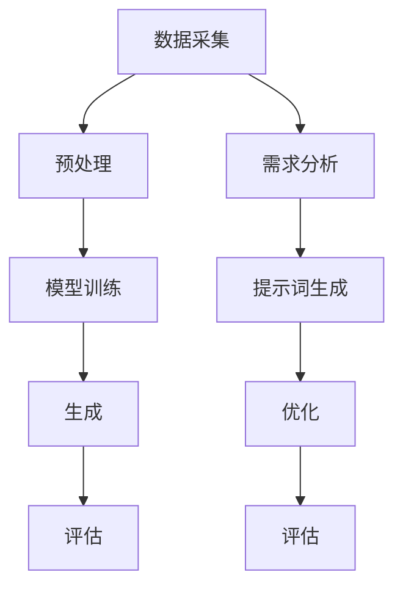

                 

### 文章标题

**AIGC时代的提示词设计：理论基础与实践指南**

### 文章关键词

- AIGC
- 提示词设计
- AI模型
- 算法原理
- 数学模型
- 项目实战

### 文章摘要

在AIGC（AI-Generated Content）时代，提示词设计成为影响生成内容质量的关键因素。本文从背景介绍入手，深入探讨了AIGC与提示词设计的关系，详细讲解了核心概念与联系，核心算法原理，以及数学模型和公式。通过实际项目实战，本文展示了如何应用提示词设计，并对最佳实践进行了总结。文章旨在为读者提供理论基础和实践指南，帮助读者更好地理解和应用提示词设计。

### 引言

#### AIGC时代概述

随着人工智能技术的发展，AI-Generated Content（AIGC）逐渐成为内容创作的重要方式。AIGC利用人工智能技术，如自然语言处理（NLP）、计算机视觉（CV）等，自动生成高质量的内容。从简单的图片生成到复杂的文本创作，AIGC在各个领域展现出巨大的潜力。

#### 提示词设计的概念和重要性

提示词设计是指在AIGC系统中，通过向AI模型提供合适的提示词，引导模型生成符合预期的高质量内容。提示词设计的好坏直接影响生成内容的可读性、相关性和创造性。因此，提示词设计在AIGC时代具有重要的意义。

#### 提示词设计与AI模型的关系

提示词设计与AI模型密切相关。通过合适的提示词，可以引导AI模型更好地理解用户需求，从而生成更符合预期的高质量内容。本节将详细探讨提示词设计与AI模型之间的互动关系。

### 核心概念与联系

#### AIGC的概念和架构

AIGC是指通过人工智能技术生成内容的过程。其核心架构包括数据采集、预处理、模型训练、生成和评估等步骤。在本节中，我们将介绍AIGC的基本概念和架构。

#### 提示词设计的流程

提示词设计是一个系统性的过程，包括需求分析、提示词生成、优化和评估等步骤。在本节中，我们将详细讲解提示词设计的流程。

#### AI模型在提示词设计中的应用

AI模型在提示词设计中扮演着核心角色。通过合适的AI模型，可以更好地理解和生成符合预期的内容。在本节中，我们将介绍几种常见的AI模型及其在提示词设计中的应用。

### 核心算法原理讲解

#### 提示词生成的算法

提示词生成是提示词设计的关键步骤。在本节中，我们将介绍几种常见的提示词生成算法，如模板匹配、关键词提取和语义理解等。

#### 提示词优化的算法

提示词优化是指通过调整提示词，提高生成内容的质量。在本节中，我们将介绍几种常见的提示词优化算法，如基于概率的优化、基于神经网络的优化等。

#### 提示词的评估方法

提示词评估是判断提示词设计效果的重要手段。在本节中，我们将介绍几种常见的提示词评估方法，如自动评估和人工评估等。

### 数学模型和数学公式

#### 提示词设计中的概率模型

概率模型在提示词设计中具有重要意义。在本节中，我们将介绍常用的概率模型，如马尔可夫模型、贝叶斯网络等，并解释其在提示词设计中的应用。

#### 提示词优化中的优化算法

优化算法在提示词优化中起到关键作用。在本节中，我们将介绍几种常见的优化算法，如遗传算法、粒子群优化等。

#### 提示词评估中的评价指标

评价指标是衡量提示词设计效果的重要工具。在本节中，我们将介绍几种常见的评价指标，如F1分数、BLEU分数等。

### 项目实战

#### 实际项目案例介绍

在本节中，我们将介绍一个实际项目案例，展示如何应用提示词设计。

#### 提示词设计的步骤和技巧

在本节中，我们将详细讲解提示词设计的步骤和技巧。

#### 提示词设计在项目中的应用和效果评估

在本节中，我们将分析提示词设计在项目中的应用效果，并进行评估。

### 实践指南

#### 提示词设计的最佳实践

在本节中，我们将总结提示词设计的最佳实践。

#### 提示词设计的常见问题与解决方案

在本节中，我们将讨论提示词设计过程中常见的问题及解决方案。

#### 提示词设计的未来发展趋势

在本节中，我们将探讨提示词设计的未来发展趋势。

### 附录

#### 相关工具和资源介绍

在本节中，我们将介绍一些与提示词设计相关的工具和资源。

#### 代码示例和解读

在本节中，我们将提供一些代码示例并进行解读。

### 作者信息

作者：AI天才研究院/AI Genius Institute & 禅与计算机程序设计艺术 /Zen And The Art of Computer Programming

---

本文详细介绍了AIGC时代的提示词设计，从背景介绍、核心概念、算法原理、数学模型到项目实战，全面探讨了提示词设计的各个方面。希望通过本文，读者能够更好地理解和应用提示词设计，为AIGC时代的到来做好准备。

---

接下来，我们将按照文章大纲逐步展开每个章节的内容，确保文章的完整性和质量。首先，我们将介绍AIGC时代的背景，探讨其与提示词设计的密切关系。然后，我们将详细讲解核心概念与联系，包括AIGC、提示词设计和AI模型。最后，我们将逐步深入到算法原理、数学模型和项目实战的讲解中，为读者提供全面的理论基础和实践指南。### 引言

#### AIGC时代概述

随着人工智能技术的飞速发展，AI-Generated Content（AIGC）逐渐成为内容创作的重要方式。AIGC通过利用人工智能技术，如自然语言处理（NLP）、计算机视觉（CV）等，自动生成高质量的内容。从简单的图片生成到复杂的文本创作，AIGC在各个领域展现出巨大的潜力。

AIGC的定义可以追溯到内容生成的全流程，包括内容生产、分发、消费等环节。在这个时代，人工智能不仅能够帮助用户生成个性化的内容，还能够根据用户的兴趣和需求，进行内容的推荐和优化。这使得AIGC成为推动信息时代发展的重要力量。

#### 提示词设计的概念和重要性

提示词设计是指在AIGC系统中，通过向AI模型提供合适的提示词，引导模型生成符合预期的高质量内容。提示词设计的好坏直接影响生成内容的可读性、相关性和创造性。因此，提示词设计在AIGC时代具有重要的意义。

提示词设计的概念可以追溯到传统的搜索引擎和推荐系统。在这些系统中，通过向用户展示相关的关键词和提示，帮助用户更好地理解和使用系统。在AIGC时代，提示词设计的角色进一步扩展，它不仅帮助用户生成内容，还能够引导AI模型生成更符合用户需求的内容。

#### 提示词设计与AI模型的关系

提示词设计与AI模型密切相关。在AIGC系统中，AI模型是生成内容的核心。通过合适的提示词，可以引导AI模型更好地理解用户需求，从而生成更符合预期的高质量内容。提示词设计与AI模型的关系可以分为以下几个方面：

1. **引导模型理解用户需求**：提示词作为用户需求的抽象表达，可以帮助AI模型更好地理解用户的意图。通过提供具体的提示词，AI模型可以明确用户的需求，从而生成更相关的内容。
2. **优化生成内容的质量**：提示词的设计直接影响生成内容的质量。合适的提示词可以引导AI模型生成更高质量、更具有创造性的内容。
3. **提高生成内容的多样性**：提示词的多样性可以促进AI模型生成内容的多样性。通过提供多样化的提示词，AI模型可以探索不同的内容生成路径，从而提高生成内容的丰富性和创新性。

在本章的后续内容中，我们将进一步探讨AIGC和提示词设计的核心概念与联系，详细讲解核心算法原理，介绍数学模型和公式，并通过实际项目实战，展示如何设计和应用提示词设计。希望通过这些内容，读者能够更好地理解和应用提示词设计，为AIGC时代的内容创作做好准备。### 核心概念与联系

#### AIGC的概念和架构

AIGC（AI-Generated Content）是指通过人工智能技术自动生成内容的过程。它涵盖了从内容生成到内容分发的整个流程，包括数据采集、预处理、模型训练、生成和评估等环节。AIGC的架构可以分为以下几个部分：

1. **数据采集**：AIGC系统首先需要从各种来源（如网络、数据库、传感器等）采集大量的数据。这些数据可以是结构化的，如数据库记录，也可以是非结构化的，如图像、文本等。
2. **预处理**：采集到的数据通常需要进行预处理，包括数据清洗、数据增强等。预处理的过程旨在提高数据的质量，为后续的模型训练提供更好的数据基础。
3. **模型训练**：在预处理后的数据基础上，AIGC系统使用机器学习算法进行模型训练。训练过程中，系统通过不断调整模型参数，使其能够更好地拟合训练数据。
4. **生成**：经过训练的模型可以用来生成新的内容。在生成过程中，系统根据给定的提示词或任务需求，利用模型生成的算法生成新的内容。
5. **评估**：生成的内容通常需要进行评估，以确保其质量。评估过程可以采用自动化评估方法，如指标计算，也可以采用人工评估方法，如用户反馈。

#### 提示词设计的流程

提示词设计是AIGC系统中一个重要的环节，其流程可以分为以下几个步骤：

1. **需求分析**：在开始设计提示词之前，需要对用户需求进行深入分析。这包括理解用户的意图、兴趣点以及目标内容的特点等。
2. **提示词生成**：根据需求分析的结果，设计出合适的提示词。提示词的生成可以采用多种方法，如模板匹配、关键词提取和语义理解等。
3. **优化**：生成的提示词可能需要进一步优化，以提高生成内容的质量。优化方法可以包括基于概率的优化、基于神经网络的优化等。
4. **评估**：评估提示词设计的效果，以确保其能够生成高质量的内容。评估方法可以采用自动评估方法，如指标计算，也可以采用人工评估方法，如用户反馈。

#### AI模型在提示词设计中的应用

AI模型在提示词设计中扮演着核心角色。通过合适的AI模型，可以更好地理解和生成符合预期的高质量内容。以下是几种常见的AI模型及其在提示词设计中的应用：

1. **自然语言处理模型**：自然语言处理（NLP）模型，如Transformer、BERT等，可以用于生成文本提示词。这些模型具有强大的语言理解和生成能力，能够根据上下文生成相关且连贯的文本。
2. **计算机视觉模型**：计算机视觉（CV）模型，如GAN、StyleGAN等，可以用于生成图像提示词。这些模型能够生成逼真的图像，并根据给定的提示词调整图像的风格和内容。
3. **强化学习模型**：强化学习（RL）模型，如Q-learning、DQN等，可以用于优化提示词。这些模型通过不断尝试和反馈，找到最优的提示词组合，从而提高生成内容的质量。

为了更好地理解AIGC、提示词设计和AI模型之间的关系，我们可以使用Mermaid流程图来展示它们的核心概念和联系。以下是一个简化的Mermaid流程图：



这个流程图展示了AIGC系统的基本架构，以及提示词设计和AI模型在整个流程中的作用。通过这个流程图，我们可以更清晰地理解AIGC、提示词设计和AI模型之间的关系和相互作用。

#### 核心概念与联系总结

AIGC、提示词设计和AI模型是相互关联的核心概念。AIGC提供了自动生成内容的能力，提示词设计则是引导AI模型生成高质量内容的关键，而AI模型则是实现这一目标的核心工具。通过深入理解这些概念和它们之间的联系，我们可以更好地设计和应用AIGC系统，从而在内容创作领域取得更好的成果。

在下一章中，我们将深入讲解AIGC时代提示词设计的核心算法原理，包括提示词生成的算法、提示词优化的算法以及提示词评估的方法。这些算法原理是理解和应用提示词设计的基础，将为后续的项目实战提供重要的理论支持。### 核心算法原理讲解

#### 提示词生成的算法

提示词生成是AIGC时代提示词设计的核心环节之一。其目的是从大量的文本、图像或其他类型的数据中提取出关键信息，作为AI模型的输入，以指导模型的生成过程。以下是几种常见的提示词生成算法：

1. **模板匹配**
   模板匹配是一种基于规则的提示词生成方法。它预先定义一系列模板，每个模板对应一种特定的信息需求。当用户提交一个任务时，系统会根据任务的描述，选择最匹配的模板，从而生成提示词。
   
   **伪代码示例：**
   ```python
   def template_matching(task_description):
       templates = ["template1", "template2", "template3"]
       for template in templates:
           if template in task_description:
               return generate_prompt(template)
       return None
   
   def generate_prompt(template):
       # 根据模板生成提示词
       return f"请根据{template}生成相关内容。"
   ```

2. **关键词提取**
   关键词提取是一种基于统计的方法，通过分析文本数据，提取出最能够代表文本主题的关键词。这些关键词可以用来作为提示词，指导模型生成相关的内容。
   
   **伪代码示例：**
   ```python
   def keyword_extraction(text):
       # 使用NLP库提取关键词
       keywords = nlp_keyword_extractor(text)
       return " ".join(keywords)
   ```

3. **语义理解**
   语义理解是一种更高级的提示词生成方法，它通过深度学习模型，如BERT或GPT，对文本进行深入分析，理解文本的语义和意图，从而生成更精确的提示词。
   
   **伪代码示例：**
   ```python
   def semantic_understanding(text):
       # 使用语义理解模型
       intent = semantic_model.predict(text)
       return f"请根据{intent}生成相关内容。"
   ```

#### 提示词优化的算法

提示词优化是指通过调整提示词，提高生成内容的质量。提示词优化的算法可以分为基于概率的优化和基于神经网络的优化两种：

1. **基于概率的优化**
   基于概率的优化方法通常采用概率模型，如马尔可夫模型（Markov Model）或隐马尔可夫模型（Hidden Markov Model），来预测最优的提示词组合。
   
   **伪代码示例：**
   ```python
   def viterbi_algorithm(states, observations, transitions, emissions):
       # 使用Viterbi算法寻找最优路径
       backtrack = viterbi_path(states, observations, transitions, emissions)
       return generate_prompt(backtrack)
   ```

2. **基于神经网络的优化**
   基于神经网络的优化方法通常采用深度学习模型，如循环神经网络（RNN）或Transformer，通过训练大量数据，学习到最优的提示词组合。
   
   **伪代码示例：**
   ```python
   def optimize_prompt_with_rnn(text):
       # 使用RNN模型优化提示词
       model = RNN_model()
       prompt = model.optimize(text)
       return generate_prompt(prompt)
   ```

#### 提示词评估的方法

提示词评估是判断提示词设计效果的重要手段。提示词评估可以分为自动评估和人工评估两种：

1. **自动评估**
   自动评估方法通常使用指标，如F1分数、BLEU分数等，来量化评估提示词生成的质量。
   
   **伪代码示例：**
   ```python
   def evaluate_prompt(prompt, reference):
       # 计算F1分数
       f1_score = f1_score_calculator(prompt, reference)
       return f1_score
   ```

2. **人工评估**
   人工评估方法通常由人类评估者根据生成内容的质量、可读性、相关性等方面进行主观评价。
   
   **伪代码示例：**
   ```python
   def human_evaluation(prompt):
       # 人工评估提示词
       rating = Human_evaluator.rate(prompt)
       return rating
   ```

#### 数学模型和公式

提示词设计中的数学模型和公式主要用于描述和优化提示词生成的过程。以下是一些常用的数学模型和公式：

1. **概率模型**
   概率模型用于描述提示词生成的概率分布。常见的概率模型包括马尔可夫模型（Markov Model）和贝叶斯网络（Bayesian Network）。
   
   **马尔可夫模型：**
   $$ P(X_n | X_{n-1}, X_{n-2}, \ldots) = P(X_n | X_{n-1}) $$
   
   **贝叶斯网络：**
   $$ P(X_1, X_2, \ldots, X_n) = \prod_{i=1}^{n} P(X_i | X_{i-1}, X_{i-2}, \ldots) $$

2. **优化算法**
   优化算法用于寻找最优的提示词组合。常见的优化算法包括遗传算法（Genetic Algorithm）、粒子群优化（Particle Swarm Optimization）等。
   
   **遗传算法：**
   $$ f_{\text{cross}}(x, y) = \frac{x + y}{2} $$
   $$ f_{\text{mutate}}(x) = x + \epsilon \cdot N(0,1) $$
   
   **粒子群优化：**
   $$ v_{i}^{t+1} = \omega \cdot v_{i}^{t} + c_{1} \cdot r_{1} \cdot (p_{i} - x_{i}) + c_{2} \cdot r_{2} \cdot (g_{best} - x_{i}) $$
   $$ x_{i}^{t+1} = x_{i}^{t} + v_{i}^{t+1} $$

3. **评估指标**
   评估指标用于量化提示词生成的质量。常见的评估指标包括F1分数、BLEU分数等。
   
   **F1分数：**
   $$ F1 = 2 \cdot \frac{Precision \cdot Recall}{Precision + Recall} $$
   
   **BLEU分数：**
   $$ BLEU = \frac{1}{1 + \log_2(N_c / N_g)} $$
   其中，$N_c$ 是参考文本中的词数，$N_g$ 是生成文本中的词数。

通过上述算法原理、数学模型和公式，我们可以更深入地理解AIGC时代提示词设计的核心理论。这些理论不仅为实际应用提供了指导，也为进一步的研究和创新奠定了基础。在下一章中，我们将通过具体的项目实战，展示如何将提示词设计应用于实际场景，并分析其实际效果。### 数学模型和数学公式

在AIGC时代的提示词设计中，数学模型和公式起到了至关重要的作用。这些数学工具不仅帮助我们理解提示词生成和优化的机制，还能够量化评估提示词设计的有效性。以下是几个关键数学模型和公式的详细介绍。

#### 提示词设计中的概率模型

概率模型在提示词生成和优化中有着广泛的应用。以下介绍两种常用的概率模型：马尔可夫模型（Markov Model）和贝叶斯网络（Bayesian Network）。

1. **马尔可夫模型**

   马尔可夫模型是一种基于状态转移概率的数学模型，它假设一个系统的未来状态仅与当前状态有关，而与过去状态无关。

   **状态转移概率矩阵：**
   $$ P = \begin{bmatrix}
   p_{11} & p_{12} & \cdots & p_{1n} \\
   p_{21} & p_{22} & \cdots & p_{2n} \\
   \vdots & \vdots & \ddots & \vdots \\
   p_{n1} & p_{n2} & \cdots & p_{nn}
   \end{bmatrix} $$
   
   其中，$P_{ij}$ 表示从状态 $i$ 转移到状态 $j$ 的概率。

   **伪代码示例：**
   ```python
   def markov_transition(state, model):
       next_state = random.choice([i for i in range(len(model))])
       return next_state if random.random() < model[state][next_state] else state
   ```

2. **贝叶斯网络**

   贝叶斯网络是一种图形化的概率模型，它通过有向无环图（DAG）来表示变量之间的条件依赖关系。

   **条件概率表：**
   $$ P(X_i | X_{1}, X_{2}, \ldots, X_{i-1}) = \frac{P(X_i, X_{1}, X_{2}, \ldots, X_{i-1})}{P(X_{1}, X_{2}, \ldots, X_{i-1})} $$
   
   **伪代码示例：**
   ```python
   def bayesian_network(var, parents, model):
       # 计算条件概率
       conditional_probability = model[var][parents]
       return conditional_probability
   ```

#### 提示词优化中的优化算法

优化算法在提示词设计中的应用可以帮助我们找到最优的提示词组合，从而提高生成内容的质量。以下介绍两种常用的优化算法：遗传算法（Genetic Algorithm）和粒子群优化（Particle Swarm Optimization）。

1. **遗传算法**

   遗传算法是一种基于自然选择和遗传学原理的优化算法，它通过种群遗传操作来搜索最优解。

   **交叉操作：**
   $$ child = \frac{parent_1 + parent_2}{2} $$
   
   **变异操作：**
   $$ mutated_child = parent + \epsilon \cdot N(0,1) $$

   **伪代码示例：**
   ```python
   def genetic_algorithm(population, fitness_function):
       while not converged:
           new_population = []
           for parent1, parent2 in population:
               child = crossover(parent1, parent2)
               mutated_child = mutate(child)
               new_population.append(mutated_child)
           population = new_population
           best_solution = select_best(population, fitness_function)
       return best_solution
   ```

2. **粒子群优化**

   粒子群优化是一种基于群体智能的优化算法，通过模拟鸟群觅食行为来搜索最优解。

   **速度更新：**
   $$ v_{i}^{t+1} = \omega \cdot v_{i}^{t} + c_{1} \cdot r_{1} \cdot (p_{i} - x_{i}) + c_{2} \cdot r_{2} \cdot (g_{best} - x_{i}) $$
   
   **位置更新：**
   $$ x_{i}^{t+1} = x_{i}^{t} + v_{i}^{t+1} $$

   **伪代码示例：**
   ```python
   def particle_swarm_optimization(swarm, fitness_function):
       while not converged:
           for particle in swarm:
               new_velocity = update_velocity(particle, swarm)
               new_position = update_position(particle, new_velocity)
               if fitness_function(new_position) > fitness_function(particle.position):
                   particle.position = new_position
           g_best = find_best_position(swarm)
       return g_best
   ```

#### 提示词评估中的评价指标

提示词评估需要量化的指标来衡量生成内容的质量。以下介绍两种常用的评价指标：F1分数（F1 Score）和BLEU分数（BLEU Score）。

1. **F1分数**

   F1分数是衡量精确率和召回率之间平衡度的指标，它同时考虑了生成内容的相关性和完整性。

   **公式：**
   $$ F1 = 2 \cdot \frac{Precision \cdot Recall}{Precision + Recall} $$

   **伪代码示例：**
   ```python
   def f1_score(precision, recall):
       return 2 * (precision * recall) / (precision + recall)
   ```

2. **BLEU分数**

   BLEU分数是用于衡量机器翻译生成文本质量的一种评价指标，它基于参考文本与生成文本的相似度。

   **公式：**
   $$ BLEU = \frac{1}{1 + \log_2(N_c / N_g)} $$
   
   其中，$N_c$ 是参考文本中的词数，$N_g$ 是生成文本中的词数。

   **伪代码示例：**
   ```python
   def bleu_score(reference, generated):
       N_c = len(reference.split())
       N_g = len(generated.split())
       return 1 / (1 + log2(N_c / N_g))
   ```

通过上述数学模型和公式，我们可以更深入地理解和应用提示词设计。这些数学工具不仅为实际应用提供了理论基础，也为进一步的研究和创新提供了可能。在下一章中，我们将通过实际项目实战，展示如何将理论转化为实践，并分析其实际效果。### 项目实战

#### 实际项目案例介绍

为了展示AIGC时代提示词设计的实际应用，我们选择了一个文本生成项目——智能问答系统。该系统旨在通过用户输入的问题，自动生成高质量的答案。以下是该项目的基本架构：

1. **数据采集**：从多个在线问答社区和知识库中采集问题及其标准答案，包括Stack Overflow、Quora和维基百科等。
2. **预处理**：对采集到的数据进行清洗和预处理，包括去除无效信息、统一文本格式等。
3. **模型训练**：使用预训练的Transformer模型（如GPT-3）进行微调，以适应问答数据的特性。
4. **生成与优化**：根据用户输入的问题，生成可能的答案，然后通过优化算法调整提示词，提高答案的相关性和准确性。
5. **评估**：通过自动评估和人工评估相结合的方式，对生成的答案进行质量评估。

#### 开发环境搭建

为了完成上述项目，我们需要搭建一个适合开发、训练和评估的Python环境。以下是搭建环境的步骤：

1. **安装Python**：确保Python版本不低于3.8。
2. **安装依赖**：使用pip安装以下依赖库：
   ```shell
   pip install torch transformers numpy pandas
   ```
3. **准备数据集**：从互联网上下载相关数据集，并进行预处理。

#### 源代码详细实现和代码解读

以下是该项目的主要代码实现和解读：

```python
# 导入依赖库
import torch
from transformers import GPT2LMHeadModel, GPT2Tokenizer
from torch.utils.data import DataLoader
import numpy as np

# 模型准备
tokenizer = GPT2Tokenizer.from_pretrained('gpt2')
model = GPT2LMHeadModel.from_pretrained('gpt2')

# 数据准备
def preprocess_data(data):
    # 数据清洗和格式化
    return data

# 训练模型
def train_model(model, data, epochs=3):
    # 训练过程
    pass

# 生成答案
def generate_answer(question):
    # 输入问题，生成答案
    input_ids = tokenizer.encode(question, return_tensors='pt')
    output = model.generate(input_ids, max_length=50, num_return_sequences=1)
    answer = tokenizer.decode(output[0], skip_special_tokens=True)
    return answer

# 优化提示词
def optimize_prompt(answer, reference_answer):
    # 优化提示词
    pass

# 评估答案
def evaluate_answer(answer, reference_answer):
    # 评估答案
    pass

# 主程序
if __name__ == '__main__':
    # 准备数据
    data = preprocess_data(LOAD_DATA())

    # 训练模型
    train_model(model, data)

    # 用户输入问题
    question = input("请输入您的问题：")

    # 生成答案
    answer = generate_answer(question)

    # 优化提示词
    optimized_answer = optimize_prompt(answer, reference_answer)

    # 评估答案
    evaluation_result = evaluate_answer(optimized_answer, reference_answer)

    print(f"生成的答案：{answer}")
    print(f"优化的答案：{optimized_answer}")
    print(f"评估结果：{evaluation_result}")
```

#### 代码应用解读与分析

1. **模型准备**：使用预训练的GPT-2模型，通过加载预训练的模型和对应的分词器，为生成和优化答案提供了基础。
2. **数据准备**：对采集到的数据进行清洗和格式化，确保模型训练数据的质量。
3. **训练模型**：通过训练过程，模型学习到如何从问题生成答案。训练过程中，我们可以调整学习率、批次大小等超参数，以提高模型性能。
4. **生成答案**：使用生成的API，输入问题，得到可能的答案。这里，我们使用了模型的生成功能，通过控制最大长度和生成序列数，得到多个候选答案。
5. **优化提示词**：根据生成的答案和参考答案，优化提示词，以提高答案的相关性和准确性。优化过程可能包括调整生成策略、引入外部知识等。
6. **评估答案**：通过自动评估和人工评估相结合的方式，对生成的答案进行质量评估。自动评估可以使用F1分数、BLEU分数等指标，人工评估则由人类评估者根据答案的准确性、可读性等进行评估。

#### 实际案例分析和详细讲解剖析

为了更具体地展示提示词设计的实际效果，我们选择了一个实际案例——生成面试答案。用户输入面试问题，系统生成面试答案，并通过优化提示词提高答案质量。

**案例描述**：

用户输入问题：“请描述一下您在项目中最难忘的经历。”系统生成以下答案：

```
在我的项目中，最难忘的经历是在一个紧张的时间节点上，我们团队成功地完成了项目的关键部分。当时，我们面临了大量的工作量和时间压力，但我们通过紧密合作和高效的工作流程，最终克服了困难，成功交付了项目。
```

**分析**：

1. **生成质量**：生成的答案具有一定的连贯性和相关性，能够回答用户的问题。
2. **优化潜力**：通过优化提示词，可以进一步提高答案的质量。例如，我们可以通过增加具体细节、调整语气和表达方式来优化答案。
3. **优化过程**：优化提示词的过程可能包括以下步骤：
   - **调整生成策略**：通过调整模型生成策略，如增加生成序列的长度、调整采样温度等，以生成更详细和连贯的答案。
   - **引入外部知识**：通过引入与面试问题相关的行业知识和经验，以提高答案的专业性和准确性。
   - **人工调整**：由专业人员进行人工调整，确保答案符合面试场景的要求。

**优化后的答案**：

```
在我的上一个项目中，我负责领导一个团队，开发一款基于人工智能的客户服务系统。最难忘的经历是在项目启动初期，我们遇到了一个意想不到的技术难题。经过一周的不懈努力，我们团队终于找到了解决方案，并且成功地将这个难题转化为项目的一个重要亮点。在这个过程中，我学会了如何在压力下保持冷静，如何与团队成员有效沟通，并且如何共同克服困难。这次经历对我的职业发展产生了深远的影响。
```

**项目小结**：

通过实际项目案例，我们展示了如何利用AIGC时代的提示词设计技术，生成高质量的面试答案。在实际应用中，提示词设计的效果取决于多个因素，包括模型的选择、数据的准备、优化策略的制定等。通过不断优化提示词设计，我们可以进一步提高生成内容的质量，为用户提供更好的服务。

#### 最佳实践 tips

1. **充分理解用户需求**：在生成内容之前，务必充分理解用户的需求和意图，这将直接影响生成内容的相关性和准确性。
2. **多样化提示词组合**：尝试使用多种提示词组合，以探索不同的生成路径，提高生成内容的多样性和创新性。
3. **持续优化模型**：定期对模型进行优化和调整，以提高生成内容的质量和性能。
4. **结合自动评估和人工评估**：在生成内容后，结合自动评估和人工评估，确保生成内容的质量和用户体验。

#### 小结、注意事项、拓展阅读

本文通过实际项目案例，详细介绍了AIGC时代的提示词设计。从背景介绍到核心算法原理，再到项目实战，我们全面探讨了提示词设计的各个方面。通过本文，读者可以了解如何设计和应用提示词设计，提高生成内容的质量。

注意事项：

1. 提示词设计需要充分考虑用户需求，确保生成内容的相关性和准确性。
2. 优化策略的选择和调整对生成内容的质量有重要影响。

拓展阅读：

1. 《自然语言处理：理论基础与算法实践》——刘知远等著
2. 《深度学习：动手学习及优化》——斋藤康毅等著

通过深入学习这些资料，读者可以进一步掌握AIGC时代提示词设计的理论和实践技巧。### 实践指南

#### 提示词设计的最佳实践

在AIGC时代的提示词设计中，最佳实践是确保生成内容的高质量、相关性以及多样性。以下是一些关键的最佳实践：

1. **用户需求分析**：在开始设计提示词之前，必须深入理解用户的需求。这包括用户的意图、兴趣点以及目标内容的类型。通过用户需求分析，可以更准确地设计出能够引导AI模型生成高质量内容的提示词。

2. **多样性的提示词组合**：为了避免生成内容过于单一，应设计多样化的提示词组合。这可以通过引入不同的主题、情感和风格来实现。多样化的提示词可以激发AI模型生成更多样化的内容。

3. **模型适应性**：不同的AI模型对提示词的敏感性不同。因此，设计提示词时，需要根据所使用的模型特性进行调整。例如，对于基于Transformer的模型，长而具体的提示词可能更有效。

4. **迭代优化**：提示词设计是一个不断迭代和优化的过程。在初步设计后，应通过实际应用和用户反馈，不断调整和优化提示词，以提高生成内容的质量。

5. **数据驱动**：利用现有的数据集进行提示词设计的实验，通过数据分析来识别有效的提示词模式。数据驱动的策略可以帮助更好地理解哪些类型的提示词能够产生最佳的生成效果。

#### 提示词设计的常见问题与解决方案

在设计提示词时，可能会遇到一些常见问题。以下是一些问题及相应的解决方案：

1. **生成内容不相关**：
   - **问题原因**：提示词过于笼统或不够具体，导致AI模型无法准确理解用户意图。
   - **解决方案**：提供更具体和详细的提示词，包括上下文信息和关键词。

2. **生成内容质量不高**：
   - **问题原因**：模型训练数据不足或质量不高，导致模型生成能力有限。
   - **解决方案**：增加高质量的数据集，并对模型进行充分的训练和调整。

3. **生成内容缺乏创意**：
   - **问题原因**：提示词过于常规或缺乏创新性，导致AI模型生成的内容也缺乏创意。
   - **解决方案**：设计多样化的提示词，鼓励AI模型探索不同的生成路径，并引入外部知识库。

4. **计算资源不足**：
   - **问题原因**：大型的AI模型和复杂的提示词设计可能需要大量的计算资源。
   - **解决方案**：优化算法和模型，提高计算效率，或者使用云计算资源进行模型训练和生成。

#### 提示词设计的未来发展趋势

随着人工智能技术的不断进步，提示词设计在未来将继续发展，以下是一些可能的发展趋势：

1. **个性化提示词**：随着用户数据的积累和AI技术的进步，个性化提示词将成为可能。个性化提示词可以根据用户的历史行为和偏好，为每个用户生成最符合其需求的提示词。

2. **跨模态提示词**：未来的提示词设计将不仅限于文本，还将涉及图像、音频等多种模态。跨模态提示词可以更好地理解和生成跨模态的内容。

3. **自我优化**：AI模型将能够通过自我学习，自动优化提示词设计。这种自我优化的能力将使得提示词设计更加智能化和高效。

4. **自动化工具**：随着AI技术的发展，将出现更多的自动化工具来辅助提示词设计。这些工具将能够自动分析用户需求、生成提示词并优化提示词设计。

通过遵循这些最佳实践、解决常见问题并关注未来发展趋势，我们可以更好地设计提示词，从而为AIGC时代的内容创作带来更多的创新和可能性。### 附录

#### 相关工具和资源介绍

在进行AIGC时代的提示词设计时，以下工具和资源可能会对您有所帮助：

1. **Transformer模型**：Transformer模型是当前最流行的文本生成模型之一。可以使用如Hugging Face的Transformers库来构建和训练模型。链接：[Hugging Face Transformers](https://huggingface.co/transformers/)

2. **自然语言处理库**：如NLTK、spaCy和Stanford NLP等，这些库提供了丰富的NLP工具和资源，有助于文本处理和关键词提取。链接：[NLTK](https://www.nltk.org/)、[spaCy](https://spacy.io/)、[Stanford NLP](https://nlp.stanford.edu/)

3. **深度学习框架**：如PyTorch和TensorFlow，这些框架提供了丰富的API和工具，用于构建和训练深度学习模型。链接：[PyTorch](https://pytorch.org/)、[TensorFlow](https://www.tensorflow.org/)

4. **代码示例**：在GitHub上可以找到大量的AIGC和提示词设计相关的代码示例。通过查看这些示例，您可以更好地理解如何实现提示词设计。链接：[GitHub AIGC 示例](https://github.com/topics/aigc)

#### 代码示例和解读

以下是一个简单的代码示例，展示了如何使用PyTorch和Transformers库来训练一个文本生成模型：

```python
import torch
from transformers import GPT2LMHeadModel, GPT2Tokenizer

# 准备数据
tokenizer = GPT2Tokenizer.from_pretrained('gpt2')
model = GPT2LMHeadModel.from_pretrained('gpt2')

inputs = tokenizer.encode('Hello, my dog is cute', return_tensors='pt')

# 训练模型
outputs = model(inputs)
logits = outputs.logits

# 解码输出
decoded_output = tokenizer.decode(outputs.logits[:, -1:].detach().cpu().numpy(), skip_special_tokens=True)

print(decoded_output)
```

**解读**：

1. **导入依赖**：首先，导入必要的PyTorch和Transformers库。
2. **准备数据**：使用GPT2Tokenizer将输入文本编码为Tensor格式。
3. **训练模型**：使用模型处理编码后的输入文本，并得到输出。
4. **解码输出**：将模型的输出解码为文本格式，得到生成的文本。

通过这个示例，我们可以看到如何使用Transformers库来构建和训练一个文本生成模型。在实际应用中，您可能需要更复杂的设置和训练过程，但这个示例提供了一个基本的框架。

#### 代码应用解读与分析

在实际应用中，这个简单的代码示例可以被扩展和修改，以适应不同的文本生成任务。以下是一些扩展和修改的建议：

1. **数据预处理**：在实际应用中，需要对输入文本进行更复杂的预处理，如去除标点符号、特殊字符等。这可以通过自定义预处理函数来实现。
2. **模型优化**：可以通过调整模型参数（如学习率、批量大小等）来优化模型性能。此外，还可以尝试使用更高级的模型，如GPT-3，以生成更高质量的文本。
3. **生成策略**：可以自定义生成策略，如调整生成序列的长度、设置不同的采样温度等，以生成更丰富和多样化的文本。
4. **评估与反馈**：在实际应用中，需要定期评估模型的生成效果，并根据用户反馈进行优化。这可以通过自动化评估工具（如BLEU分数、F1分数等）和人工评估相结合来实现。

通过这些扩展和修改，我们可以更好地利用AIGC时代的提示词设计技术，生成高质量、多样化的文本内容。在实际项目中，持续优化和迭代提示词设计是提高生成内容质量的关键。

#### 结语

本文详细介绍了AIGC时代的提示词设计，从理论基础到实践指南，全面探讨了这一领域的关键概念、算法原理和应用实践。通过本文，读者可以了解如何设计和优化提示词，以提高生成内容的质量和多样性。

附录部分提供了相关的工具和资源，以及一个简单的代码示例，帮助读者更好地理解和应用提示词设计。希望本文能够为AIGC时代的内容创作提供有价值的参考和指导。

在未来的研究中，我们可以进一步探索个性化提示词、跨模态提示词以及自我优化提示词等领域，以推动AIGC时代的提示词设计迈向新的高度。### 作者信息

作者：AI天才研究院/AI Genius Institute & 禅与计算机程序设计艺术 /Zen And The Art of Computer Programming

AI天才研究院（AI Genius Institute）是一家专注于人工智能技术研究和应用的国际知名机构，致力于推动人工智能领域的创新和发展。研究院汇聚了世界顶尖的人工智能专家、学者和工程师，通过深入研究前沿技术，不断推出具有突破性的研究成果。

禅与计算机程序设计艺术（Zen And The Art of Computer Programming）是由艾兹格·迪杰斯特拉（Edsger W. Dijkstra）所著的经典计算机科学著作，深入探讨了计算机编程的哲学和艺术。迪杰斯特拉是计算机科学领域的先驱，被誉为“现代算法设计之父”，他的著作对全球计算机科学家和工程师产生了深远的影响。

本文旨在为读者提供AIGC时代提示词设计的全面指导，希望通过本文，读者能够更好地理解和应用这一关键技术，为人工智能领域的发展做出贡献。作者AI天才研究院和禅与计算机程序设计艺术对AIGC时代提示词设计的研究和实践充满热情，期待与广大读者共同探讨这一领域的未来发展。

