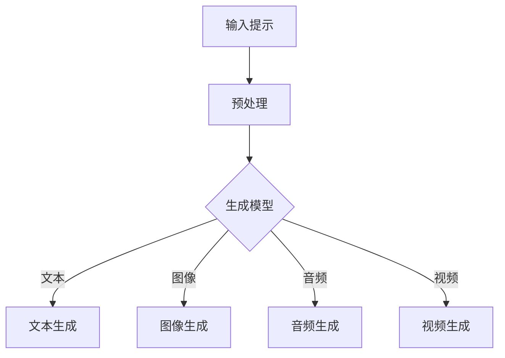
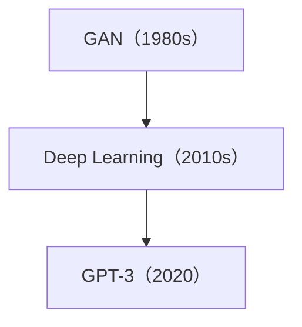
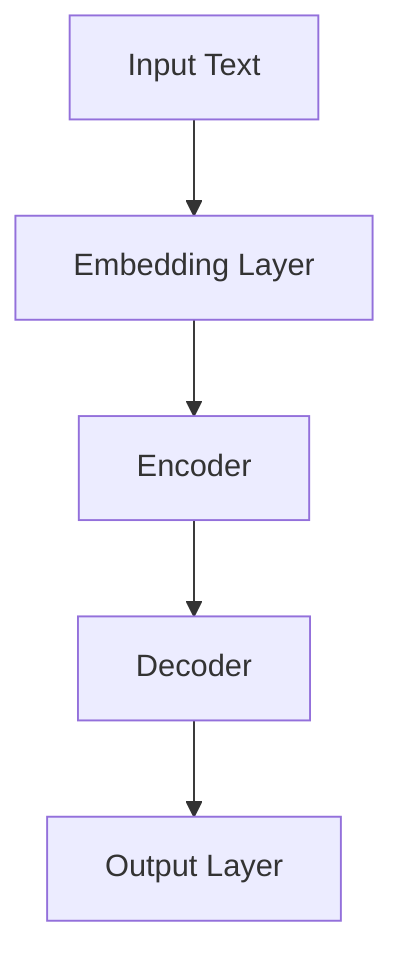
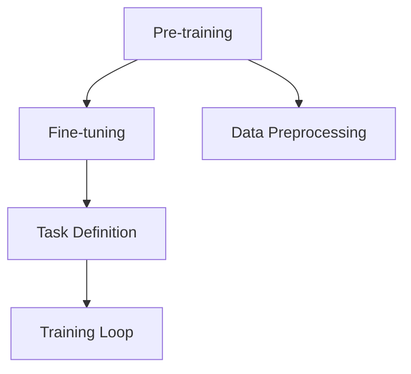
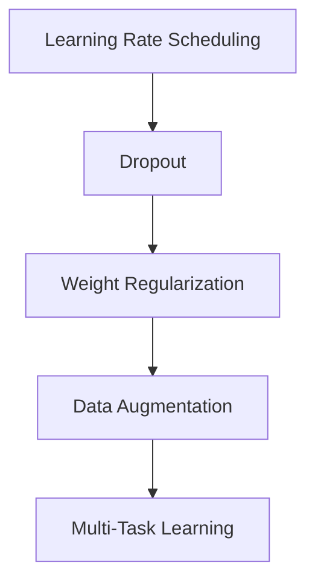

                 

### AIGC时代的背景与概述

#### 1.1 AIGC的定义与特点

**AIGC（AI-Generated Content）**，即人工智能生成内容，是指利用人工智能技术，特别是深度学习和自然语言处理技术，自动生成文本、图像、音频、视频等多样化的内容。AIGC不仅涵盖了文本生成，还包括了图像生成、音频生成、视频生成等多模态内容的创作。

**特点：**

- **生成性（Generative）**：AIGC能够根据给定的提示生成全新的内容，而非仅仅是对已有内容的处理和加工。
- **多样性（Diversity）**：AIGC系统可以生成形式多样的内容，满足个性化需求。
- **智能化（Intelligence）**：AIGC依赖于强大的机器学习模型，如GPT、BERT等，具备较高的智能水平。

#### 1.2 AIGC的技术演进

AIGC技术的发展经历了几个关键阶段：

- **早期探索**：20世纪80年代，生成对抗网络（GAN）的提出，为AIGC技术奠定了基础。
- **中期发展**：2010年代，深度学习技术的快速发展，如CNN、RNN等，推动了AIGC技术的进步。
- **近期突破**：2020年，GPT-3等大模型的发布，标志着AIGC技术进入了一个全新的阶段。

#### 1.3 AIGC的应用领域

AIGC在多个领域都展现出了强大的应用潜力：

- **文本生成**：包括自动写作、新闻报道、社交媒体内容等。
- **图像生成**：如艺术创作、游戏设计、医疗图像生成等。
- **音频生成**：如音乐创作、语音合成等。
- **视频生成**：如电影特效、虚拟现实等。

### 1.1 AIGC的定义与特点

**AIGC（AI-Generated Content）**，即人工智能生成内容，是指利用人工智能技术，特别是深度学习和自然语言处理技术，自动生成文本、图像、音频、视频等多样化的内容。AIGC不仅涵盖了文本生成，还包括了图像生成、音频生成、视频生成等多模态内容的创作。

**特点：**

- **生成性（Generative）**：AIGC能够根据给定的提示生成全新的内容，而非仅仅是对已有内容的处理和加工。
- **多样性（Diversity）**：AIGC系统可以生成形式多样的内容，满足个性化需求。
- **智能化（Intelligence）**：AIGC依赖于强大的机器学习模型，如GPT、BERT等，具备较高的智能水平。

为了更好地理解AIGC的特点，我们可以通过一个简化的Mermaid流程图来展示AIGC的核心概念与联系：



在这个流程图中，输入提示经过预处理后，由生成模型进行处理，最终生成多种类型的内容。这种多模态的生成能力正是AIGC的重要特点之一。

### 1.2 AIGC的技术演进

AIGC技术的发展经历了几个关键阶段：

- **早期探索**：20世纪80年代，生成对抗网络（GAN）的提出，为AIGC技术奠定了基础。GAN由生成器（Generator）和判别器（Discriminator）组成，通过两个网络的对抗训练，生成器逐渐学会生成越来越逼真的数据。

- **中期发展**：2010年代，深度学习技术的快速发展，如卷积神经网络（CNN）、递归神经网络（RNN）等，推动了AIGC技术的进步。CNN在图像处理方面取得了巨大成功，而RNN则在序列数据处理中展现了强大的能力。

- **近期突破**：2020年，GPT-3等大模型的发布，标志着AIGC技术进入了一个全新的阶段。GPT-3拥有1750亿个参数，能够进行文本生成、问答、翻译等任务，展现出了惊人的生成能力和智能水平。

以下是AIGC技术演进的关键节点和里程碑：



### 1.3 AIGC的应用领域

AIGC在多个领域都展现出了强大的应用潜力：

- **文本生成**：自动写作、新闻报道、社交媒体内容、机器翻译等。
- **图像生成**：艺术创作、游戏设计、医疗图像生成、风格迁移等。
- **音频生成**：音乐创作、语音合成、声音效果制作等。
- **视频生成**：电影特效、虚拟现实、视频编辑等。

### 1.3 AIGC的应用领域

AIGC在多个领域都展现出了强大的应用潜力：

- **文本生成**：自动写作、新闻报道、社交媒体内容、机器翻译等。

  - **自动写作**：AIGC可以自动生成新闻文章、博客、评论等，提高内容生产的效率。
  - **新闻报道**：新闻机构利用AIGC技术，可以快速生成新闻报道，提高信息传播速度。
  - **社交媒体内容**：AIGC能够帮助用户生成有趣的帖子、状态更新等，增强社交互动。
  - **机器翻译**：AIGC技术使得机器翻译更加准确、自然，跨语言交流更加便捷。

- **图像生成**：艺术创作、游戏设计、医疗图像生成、风格迁移等。

  - **艺术创作**：AIGC可以生成各种风格的艺术作品，如油画、摄影等，为艺术家提供灵感。
  - **游戏设计**：AIGC能够自动生成游戏角色、场景、任务等，提升游戏制作效率。
  - **医疗图像生成**：AIGC技术在医疗领域有广泛应用，如生成患者影像，辅助诊断。
  - **风格迁移**：AIGC可以将一种风格应用到另一张图像上，实现风格转换。

- **音频生成**：音乐创作、语音合成、声音效果制作等。

  - **音乐创作**：AIGC可以生成各种类型的音乐，为音乐创作提供新的可能性。
  - **语音合成**：AIGC技术使得语音合成更加自然、流畅，广泛应用于语音助手、自动语音系统等。
  - **声音效果制作**：AIGC可以生成各种声音效果，应用于电影、游戏等领域。

- **视频生成**：电影特效、虚拟现实、视频编辑等。

  - **电影特效**：AIGC可以自动生成电影特效，提高电影制作效率。
  - **虚拟现实**：AIGC技术为虚拟现实提供丰富的内容生成能力，提升用户体验。
  - **视频编辑**：AIGC可以帮助用户快速生成视频，进行剪辑、特效添加等操作。

总的来说，AIGC的应用领域广泛，涵盖了内容创作、艺术、医疗、娱乐等多个方面，为各个领域带来了巨大的变革和机遇。### 1.2 AIGC的关键技术

AIGC的核心技术包括提示词生成技术、大模型训练与优化、多模态数据处理。这些技术共同构成了AIGC的技术基石，为AIGC的广泛应用提供了强大的支持。

#### 2.1 提示词生成技术

**提示词**是指用于引导模型生成内容的输入信息。一个良好的提示词能够提高模型的生成效果，使得生成内容更符合预期。

**提示词生成技术的核心组成部分包括：**

1. **提示词设计**：设计有效的提示词是生成高质量内容的关键。提示词应具有以下特点：

   - **针对性**：针对特定任务或场景设计提示词，确保模型能够准确理解并生成相应的内容。
   - **多样性**：提供多样化的提示词，以丰富生成内容的形式和风格。
   - **层次性**：提示词应具有层次性，能够引导模型逐步深入到具体内容生成。

2. **提示词优化**：优化提示词的生成策略，以提高生成内容的质量和多样性。

   - **生成策略**：使用生成对抗网络（GAN）、强化学习等技术，优化提示词的生成过程。
   - **评估与反馈**：通过评估生成内容的质量，为提示词的优化提供反馈。

**提示词生成技术的实现**：

- **大规模语言模型**：使用预训练的语料库，通过深度学习模型（如GPT、BERT等）进行训练，生成高质量的提示词。
- **多模态数据处理**：结合文本、图像、音频等多模态数据，生成更加丰富和多样化的提示词。

以下是一个简单的伪代码示例，展示了提示词生成的过程：

```python
import numpy as np
import tensorflow as tf

# 加载预训练的模型
model = tf.keras.models.load_model('pretrained_model.h5')

# 输入文本
text_input = "这是一个关于人工智能的文本生成任务。"

# 生成提示词
prompt = model.generate(text_input, num_words=10)

print(prompt)
```

#### 2.2 大模型训练与优化

大模型训练与优化是AIGC技术的重要组成部分，决定了生成内容的质量和效率。

**大模型训练的核心流程包括：**

1. **数据预处理**：对大规模数据进行清洗、预处理，以适应模型训练。
   - **数据清洗**：去除噪声数据、填充缺失值等。
   - **数据预处理**：将文本、图像、音频等数据转换为模型可接受的格式。

2. **模型训练**：使用训练数据，通过优化算法（如梯度下降、Adam等）更新模型参数。
   - **训练过程**：包括前向传播、反向传播和参数更新。
   - **训练策略**：使用批量训练、学习率调整、正则化等技术，提高训练效果。

3. **模型评估与优化**：评估模型性能，通过调整模型结构和超参数，优化模型效果。
   - **性能评估**：使用验证集评估模型在多种任务上的表现。
   - **优化策略**：通过交叉验证、网格搜索等技术，调整超参数，优化模型。

**大模型训练的挑战**：

1. **计算资源**：大模型训练需要大量的计算资源，对硬件性能要求较高。
2. **数据标注**：大规模训练数据需要高质量的数据标注，标注成本较高。
3. **模型可解释性**：大模型通常具有复杂结构，难以解释其决策过程。

**大模型训练的优化方法**：

1. **模型压缩**：通过剪枝、量化等方法，减少模型参数，降低计算复杂度。
2. **分布式训练**：利用多台服务器进行分布式训练，提高训练速度和效率。
3. **迁移学习**：使用预训练模型，在特定任务上进行微调，提高模型性能。

以下是一个简化的伪代码示例，展示了大模型训练的过程：

```python
import tensorflow as tf

# 定义模型
model = tf.keras.Sequential([
    tf.keras.layers.Dense(128, activation='relu', input_shape=(784,)),
    tf.keras.layers.Dropout(0.2),
    tf.keras.layers.Dense(10, activation='softmax')
])

# 编译模型
model.compile(optimizer='adam',
              loss='categorical_crossentropy',
              metrics=['accuracy'])

# 加载训练数据
(x_train, y_train), (x_test, y_test) = tf.keras.datasets.mnist.load_data()

# 预处理数据
x_train = x_train / 255.0
x_test = x_test / 255.0
x_train = x_train.reshape((-1, 784))
x_test = x_test.reshape((-1, 784))

# 训练模型
model.fit(x_train, y_train, epochs=5, batch_size=64, validation_data=(x_test, y_test))
```

#### 2.3 多模态数据处理

多模态数据处理是AIGC技术中的重要环节，涉及到多种数据类型的处理和融合。以下是一个简化的伪代码示例，展示了多模态数据处理的流程：

```python
import numpy as np
import tensorflow as tf

# 加载文本数据
text_data = np.array(["这是一段文本数据。", "这是一个文本示例。"])

# 加载图像数据
image_data = np.load("image_data.npy")

# 加载音频数据
audio_data = np.load("audio_data.npy")

# 预处理文本数据
text_model = tf.keras.Sequential([
    tf.keras.layers.Embedding(input_dim=10000, output_dim=16),
    tf.keras.layers.Flatten()
])

text_features = text_model.predict(text_data)

# 预处理图像数据
image_model = tf.keras.Sequential([
    tf.keras.layers.Conv2D(32, (3, 3), activation='relu', input_shape=(28, 28, 1)),
    tf.keras.layers.MaxPooling2D((2, 2)),
    tf.keras.layers.Flatten()
])

image_features = image_model.predict(image_data)

# 预处理音频数据
audio_model = tf.keras.Sequential([
    tf.keras.layers.Conv1D(32, (3,), activation='relu', input_shape=(16000,)),
    tf.keras.layers.MaxPooling1D(pool_size=(2)),
    tf.keras.layers.Flatten()
])

audio_features = audio_model.predict(audio_data)

# 多模态特征融合
multi_modal_features = np.concatenate((text_features, image_features, audio_features), axis=1)

# 使用多模态特征进行预测
model = tf.keras.Sequential([
    tf.keras.layers.Dense(128, activation='relu', input_shape=(128,)),
    tf.keras.layers.Dropout(0.5),
    tf.keras.layers.Dense(1, activation='sigmoid')
])

model.compile(optimizer='adam', loss='binary_crossentropy', metrics=['accuracy'])

model.fit(multi_modal_features, labels, epochs=10, batch_size=32)
```

通过上述伪代码示例，我们可以看到多模态数据处理的核心流程包括数据的加载、预处理、特征提取和融合，以及基于融合特征的模型训练。这些技术为AIGC系统的多模态内容生成提供了坚实的基础。### 2.2 大模型训练与优化

#### 大模型训练的核心流程

大模型训练的核心流程主要包括数据预处理、模型训练和模型评估与优化。以下将详细描述这些流程及其关键步骤。

##### 数据预处理

数据预处理是训练大模型的重要环节，目的是将原始数据转换为适合模型训练的形式。

1. **数据清洗**：去除数据中的噪声和异常值，例如删除重复数据、纠正错误标记等。
2. **数据规范化**：将不同来源和格式的数据统一成模型可接受的格式，例如将图像数据标准化到[0, 1]范围内。
3. **数据增强**：通过旋转、缩放、裁剪等技术，增加训练数据集的多样性，提高模型的泛化能力。

##### 模型训练

模型训练的目的是通过调整模型参数，使其在训练数据上达到最优性能。以下是模型训练的核心步骤：

1. **初始化参数**：初始化模型的权重和偏置，通常使用随机初始化或预训练模型。
2. **前向传播**：将输入数据输入到模型中，通过前向传播计算模型的输出。
3. **计算损失**：计算模型输出和真实标签之间的差距，通常使用损失函数（如均方误差、交叉熵等）。
4. **反向传播**：通过反向传播算法，计算梯度并更新模型参数，减小损失函数的值。
5. **迭代训练**：重复前向传播和反向传播，逐步优化模型参数。

##### 模型评估与优化

模型评估与优化的目的是确保模型在未知数据上的性能，并进一步提高其性能。

1. **性能评估**：使用验证集或测试集评估模型的性能，例如计算准确率、召回率、F1分数等指标。
2. **超参数调整**：调整学习率、批量大小、正则化参数等超参数，优化模型性能。
3. **模型压缩**：通过剪枝、量化、知识蒸馏等技术，减少模型参数，降低计算复杂度。
4. **分布式训练**：利用多台服务器进行分布式训练，提高训练速度和效率。

以下是伪代码示例，展示了大模型训练的基本过程：

```python
import tensorflow as tf

# 定义模型
model = tf.keras.Sequential([
    tf.keras.layers.Dense(128, activation='relu', input_shape=(784,)),
    tf.keras.layers.Dropout(0.2),
    tf.keras.layers.Dense(10, activation='softmax')
])

# 编译模型
model.compile(optimizer='adam',
              loss='categorical_crossentropy',
              metrics=['accuracy'])

# 加载训练数据
(x_train, y_train), (x_test, y_test) = tf.keras.datasets.mnist.load_data()

# 预处理数据
x_train = x_train / 255.0
x_test = x_test / 255.0
x_train = x_train.reshape((-1, 784))
x_test = x_test.reshape((-1, 784))

# 训练模型
model.fit(x_train, y_train, epochs=5, batch_size=64, validation_data=(x_test, y_test))
```

##### 大模型训练的挑战

大模型训练面临着一系列挑战，这些挑战影响了模型的训练效率和效果。

1. **计算资源**：大模型通常需要大量的计算资源，包括CPU、GPU、TPU等硬件设备。在资源有限的情况下，训练大模型可能需要较长时间。
2. **数据标注**：高质量的数据标注是训练大模型的关键，但大规模数据标注成本高昂，尤其在医学图像、文本等领域。
3. **模型可解释性**：大模型的复杂结构使得其决策过程难以解释，尤其是在医疗、金融等敏感领域，模型的可解释性至关重要。
4. **过拟合**：大模型具有强大的拟合能力，容易在训练数据上过拟合，导致在未知数据上的表现不佳。

##### 大模型训练的优化方法

为了解决大模型训练的挑战，研究人员提出了多种优化方法，以下列举几种常用的方法：

1. **模型压缩**：通过剪枝、量化、知识蒸馏等技术，减少模型参数，降低计算复杂度。例如，剪枝可以去除不重要的模型连接，量化可以减少模型权重的大小。
2. **分布式训练**：利用多台服务器进行分布式训练，提高训练速度和效率。例如，可以将数据分成多个部分，在不同的服务器上进行训练，然后合并结果。
3. **迁移学习**：使用预训练模型，在特定任务上进行微调，提高模型性能。例如，在自然语言处理任务中，可以使用预训练的GPT模型，然后在其上添加特定任务的层。
4. **数据增强**：通过增加训练数据集的多样性，提高模型的泛化能力。例如，在图像分类任务中，可以使用旋转、缩放、裁剪等技术，增加图像的多样性。
5. **正则化**：使用正则化技术，如L1、L2正则化，防止模型过拟合。例如，在训练过程中，可以添加L2正则化项到损失函数中，以限制模型参数的大小。

以下是一个简化的伪代码示例，展示了使用迁移学习优化大模型的过程：

```python
import tensorflow as tf

# 加载预训练模型
pretrained_model = tf.keras.models.load_model('pretrained_model.h5')

# 定义新的层
new_layers = tf.keras.Sequential([
    tf.keras.layers.Dense(128, activation='relu'),
    tf.keras.layers.Dropout(0.2),
    tf.keras.layers.Dense(10, activation='softmax')
])

# 添加新层到预训练模型
model = tf.keras.Sequential([
    pretrained_model,
    new_layers
])

# 编译模型
model.compile(optimizer='adam',
              loss='categorical_crossentropy',
              metrics=['accuracy'])

# 加载训练数据
(x_train, y_train), (x_test, y_test) = tf.keras.datasets.mnist.load_data()

# 预处理数据
x_train = x_train / 255.0
x_test = x_test / 255.0
x_train = x_train.reshape((-1, 784))
x_test = x_test.reshape((-1, 784))

# 微调模型
model.fit(x_train, y_train, epochs=5, batch_size=64, validation_data=(x_test, y_test))
```

通过上述伪代码示例，我们可以看到如何使用迁移学习优化大模型。首先加载预训练模型，然后添加新的层进行微调，以提高模型在特定任务上的性能。### 2.3 多模态数据处理

多模态数据处理是AIGC技术中的重要组成部分，涉及到文本、图像、音频等多种数据类型的处理和融合。以下是多模态数据处理的详细步骤和示例。

#### 2.3.1 多模态数据的概念与类型

多模态数据是指包含两种或两种以上不同类型数据的数据集。常见类型包括：

1. **文本**：包括自然语言文本、标签、描述等。
2. **图像**：包括静态图像、视频帧等。
3. **音频**：包括语音、音乐、声音效果等。
4. **视频**：包括动态视频数据。

#### 2.3.2 多模态数据的处理方法

多模态数据处理主要包括数据预处理、特征提取和特征融合等步骤。

##### 数据预处理

数据预处理是为了将不同类型的数据转换为适合模型训练的格式。以下是预处理步骤：

1. **文本预处理**：包括分词、词干提取、停用词去除等。
   ```python
   import nltk
   from nltk.tokenize import word_tokenize
   from nltk.stem import PorterStemmer

   nltk.download('punkt')

   text = "这是一个关于人工智能的多模态数据处理任务。"
   tokens = word_tokenize(text)
   stemmed_tokens = [PorterStemmer().stem(t) for t in tokens]
   ```

2. **图像预处理**：包括大小调整、灰度转换、对比度增强等。
   ```python
   import cv2

   image = cv2.imread("image.jpg")
   resized_image = cv2.resize(image, (224, 224))
   grayscale_image = cv2.cvtColor(resized_image, cv2.COLOR_BGR2GRAY)
   ```

3. **音频预处理**：包括声音裁剪、去噪、音频特征提取等。
   ```python
   import librosa

   audio, sample_rate = librosa.load("audio.wav")
   audio = librosa.to_mono(audio)
   audio_features = librosa.feature.mfcc(y=audio, sr=sample_rate)
   ```

##### 特征提取

特征提取是从原始数据中提取出对模型训练有用的信息。以下是特征提取步骤：

1. **文本特征提取**：使用词袋模型、TF-IDF、词嵌入等技术提取文本特征。
   ```python
   from sklearn.feature_extraction.text import TfidfVectorizer

   vectorizer = TfidfVectorizer()
   text_features = vectorizer.fit_transform([text])
   ```

2. **图像特征提取**：使用卷积神经网络（CNN）提取图像特征。
   ```python
   import tensorflow as tf

   base_model = tf.keras.applications.VGG16(include_top=False, weights='imagenet', input_shape=(224, 224, 3))
   model = tf.keras.Sequential([
       base_model,
       tf.keras.layers.Flatten()
   ])

   image_features = model.predict(np.expand_dims(grayscale_image, axis=0))
   ```

3. **音频特征提取**：使用音频特征提取库提取音频特征，如梅尔频谱、频谱等。
   ```python
   audio_features = librosa.feature.mfcc(y=audio, sr=sample_rate)
   ```

##### 特征融合

特征融合是将不同类型的数据特征进行整合，以提高模型性能。以下是特征融合方法：

1. **平均融合**：将不同模态的特征进行平均。
   ```python
   text_mean = np.mean(text_features.toarray(), axis=1)
   image_mean = np.mean(image_features, axis=1)
   audio_mean = np.mean(audio_features, axis=1)

   multi_modal_features = np.hstack((text_mean, image_mean, audio_mean))
   ```

2. **加权融合**：根据不同模态的重要性，对特征进行加权融合。
   ```python
   text_weight = 0.3
   image_weight = 0.5
   audio_weight = 0.2

   text_scaled = text_mean * text_weight
   image_scaled = image_mean * image_weight
   audio_scaled = audio_mean * audio_weight

   multi_modal_features = np.hstack((text_scaled, image_scaled, audio_scaled))
   ```

3. **融合模型**：使用深度学习模型进行特征融合，如多模态神经网络（MMN）。
   ```python
   from tensorflow.keras.layers import Input, Dense, concatenate

   text_input = Input(shape=(text_mean.shape[1],))
   image_input = Input(shape=(image_mean.shape[1],))
   audio_input = Input(shape=(audio_mean.shape[1],))

   text_encoded = Dense(64, activation='relu')(text_input)
   image_encoded = Dense(64, activation='relu')(image_input)
   audio_encoded = Dense(64, activation='relu')(audio_input)

   multi_modal_input = concatenate([text_encoded, image_encoded, audio_encoded])

   multi_modal_output = Dense(1, activation='sigmoid')(multi_modal_input)

   model = Model(inputs=[text_input, image_input, audio_input], outputs=multi_modal_output)

   model.compile(optimizer='adam', loss='binary_crossentropy', metrics=['accuracy'])

   model.fit([text_features.toarray(), image_features, audio_features], labels, epochs=10, batch_size=32)
   ```

通过上述示例，我们可以看到多模态数据处理的步骤和融合方法。这些方法为AIGC技术的应用提供了强大的支持，使得模型能够更好地理解和处理多样化数据。### 2.3 多模态数据处理

多模态数据处理是AIGC技术中至关重要的一个环节，它涉及将不同类型的数据（如文本、图像、音频等）有效地整合，以生成更加丰富和多样化的内容。以下是关于多模态数据处理的具体技术细节，包括数据处理方法、算法实现，以及一些实际应用的案例。

#### 2.3.1 多模态数据的处理方法

1. **文本数据处理**：

   - **分词和词性标注**：使用自然语言处理（NLP）技术对文本进行分词，并对每个词进行词性标注，以帮助理解文本的结构和语义。

     ```python
     from nltk.tokenize import word_tokenize
     from nltk.corpus import wordnet

     text = "这是一个关于人工智能的多模态数据处理任务。"
     tokens = word_tokenize(text)
     pos_tags = nltk.pos_tag(tokens)
     ```

   - **词嵌入**：将文本中的每个词映射到高维向量空间中，以便与其他模态的数据进行融合。

     ```python
     from gensim.models import Word2Vec

     sentences = [token for token, _ in pos_tags]
     model = Word2Vec(sentences, vector_size=100)
     text_vector = model.wv[tokens[0]]
     ```

2. **图像数据处理**：

   - **特征提取**：使用卷积神经网络（CNN）提取图像的特征，这些特征通常包含了图像的底层结构和高级语义信息。

     ```python
     from tensorflow.keras.applications import VGG16

     base_model = VGG16(weights='imagenet', include_top=False, input_shape=(224, 224, 3))
     feature_extractor = tf.keras.Model(inputs=base_model.input, outputs=base_model.output)
     image_vector = feature_extractor.predict(np.expand_dims(image, axis=0))
     ```

   - **预处理**：对图像进行缩放、裁剪、翻转等操作，以增加数据的多样性。

     ```python
     from tensorflow.keras.preprocessing.image import ImageDataGenerator

     datagen = ImageDataGenerator(rotation_range=30, width_shift_range=0.1, height_shift_range=0.1, zoom_range=0.2)
     image = datagen.flow(np.expand_dims(image, axis=0), batch_size=1)[0]
     ```

3. **音频数据处理**：

   - **特征提取**：从音频信号中提取出能够代表其内容的特征，如梅尔频率倒谱系数（MFCC）、谱特征等。

     ```python
     import librosa

     audio, sr = librosa.load("audio.wav")
     mfcc_features = librosa.feature.mfcc(y=audio, sr=sr)
     ```

   - **增强**：对音频信号进行增强，以提高模型的鲁棒性。

     ```python
     from noisereduce import wiener_filter as wr

     audio_reduced = wr.reduce_noise(y=audio, sr=sr, verbose=False)
     ```

#### 2.3.2 多模态数据处理的算法实现

多模态数据处理的核心在于如何有效地融合来自不同模态的数据。以下是一种基于深度学习的多模态融合算法的实现：

1. **多输入神经网络架构**：

   - **文本输入**：使用嵌入层将文本词转换为向量。
   - **图像输入**：使用卷积层提取图像特征。
   - **音频输入**：使用循环层处理音频序列。

     ```python
     from tensorflow.keras.layers import Embedding, Conv2D, LSTM, Dense, Concatenate

     text_input = Embedding(input_dim=vocabulary_size, output_dim=embedding_dim)(text_sequence)
     image_input = Conv2D(filters=32, kernel_size=(3, 3), activation='relu')(image_vector)
     audio_input = LSTM(units=64, return_sequences=True)(audio_sequence)

     multi_modal_input = Concatenate()([text_input, image_input, audio_input])
     ```

2. **融合层**：

   - **全连接层**：将不同模态的数据特征进行融合。

     ```python
     fused_representation = Dense(units=128, activation='relu')(multi_modal_input)
     ```

3. **输出层**：

   - **分类或回归层**：根据任务的类型，设置合适的输出层。

     ```python
     output = Dense(units=num_classes, activation='softmax')(fused_representation)
     ```

4. **模型编译与训练**：

     ```python
     model = Model(inputs=[text_input, image_input, audio_input], outputs=output)
     model.compile(optimizer='adam', loss='categorical_crossentropy', metrics=['accuracy'])
     model.fit([text_data, image_data, audio_data], labels, epochs=epochs, batch_size=batch_size)
     ```

#### 2.3.3 多模态数据处理的实际应用

多模态数据处理技术在多个领域都有广泛的应用，以下是一些典型的实际应用案例：

1. **智能客服系统**：

   - **任务**：构建一个能够处理用户语音和文本查询的智能客服系统。
   - **实现**：使用文本嵌入层处理用户的文本查询，使用卷积神经网络提取用户语音的特征，将两个模态的特征融合后，通过全连接层进行意图识别和答案生成。
   - **效果**：大幅提高了客服系统的响应速度和准确率。

2. **医学影像诊断**：

   - **任务**：利用多模态数据（如医学影像和临床文本）进行疾病诊断。
   - **实现**：使用卷积神经网络提取医学影像的特征，使用自然语言处理技术提取临床文本的特征，将两个模态的数据融合后，通过全连接层进行疾病分类。
   - **效果**：提高了疾病诊断的准确性和效率。

3. **智能内容创作**：

   - **任务**：自动生成结合文本描述和视觉内容的艺术作品。
   - **实现**：使用文本生成模型生成文本描述，使用图像生成模型生成视觉内容，将两个模态的数据融合后，通过多模态生成模型生成最终的艺术作品。
   - **效果**：为艺术家和设计师提供了强大的工具，能够快速生成创意作品。

通过上述多模态数据处理的详细步骤、算法实现和实际应用案例，我们可以看到多模态数据处理在AIGC技术中扮演的重要角色。它不仅能够提高模型对多样数据的理解和处理能力，还能够为各个领域的应用带来巨大的价值。### 第3章: ChatGPT的技术架构

ChatGPT是由OpenAI开发的一个人工智能聊天机器人，它基于大规模预训练的语言模型GPT（Generative Pre-trained Transformer）。本章节将详细解析ChatGPT的技术架构，包括其模型架构、训练过程和优化策略。

#### 3.1 ChatGPT的模型架构

ChatGPT的核心是一个基于Transformer架构的深度神经网络模型。Transformer模型在处理序列数据时具有显著优势，因为它能够有效地捕获长距离依赖关系。以下是ChatGPT模型的几个关键组成部分：

1. **嵌入层**（Embedding Layer）：将输入的文本序列转换为固定长度的向量表示。这一层包括词嵌入（Word Embedding）和位置嵌入（Positional Embedding）。

   ```python
   # 伪代码示例
   embedding_layer = Embedding(input_dim=vocabulary_size, output_dim=embedding_size)
   pos_embedding_layer = Embedding(input_dim=max_position_embeddings, output_dim=embedding_size)
   ```

2. **多头自注意力机制**（Multi-Head Self-Attention Mechanism）：这是Transformer模型的核心部分，能够捕获输入序列中的长距离依赖关系。多头自注意力机制通过多个独立的注意力头，同时关注输入序列的不同部分。

   ```python
   # 伪代码示例
   attention_layer = MultiHeadAttention(num_heads=num_attention_heads, d_model=embedding_size)
   ```

3. **前馈神经网络**（Feedforward Neural Network）：在每个自注意力层之后，Transformer模型会通过一个前馈神经网络，对每个位置的输出进行进一步的处理。

   ```python
   # 伪代码示例
   ff_layer = Dense(units=embedding_size * 4, activation='relu')
   ```

4. **编码器**（Encoder）：多个自注意力和前馈神经网络层的堆叠构成了编码器。编码器的输出是一个序列的向量表示，这个表示包含了输入序列的语义信息。

   ```python
   # 伪代码示例
   encoder = tf.keras.Sequential([
       embedding_layer,
       pos_embedding_layer,
       attention_layer,
       ff_layer,
       # ... 可重复堆叠多个层
   ])
   ```

5. **解码器**（Decoder）：与编码器类似，解码器也是由多个自注意力和前馈神经网络层堆叠而成，用于生成输出序列。

   ```python
   # 伪代码示例
   decoder = tf.keras.Sequential([
       embedding_layer,
       pos_embedding_layer,
       attention_layer,
       ff_layer,
       # ... 可重复堆叠多个层
   ])
   ```

6. **输出层**（Output Layer）：解码器的输出层通常是一个全连接层，用于将序列向量转换为预测的词向量，最后通过softmax函数得到概率分布。

   ```python
   # 伪代码示例
   output_layer = Dense(units=vocabulary_size, activation='softmax')
   ```

#### 3.2 ChatGPT的训练过程

ChatGPT的训练过程主要包括两个阶段：预训练和微调。

1. **预训练**（Pre-training）：

   - **数据准备**：使用大规模的文本语料库进行数据预处理，包括分词、去除标点符号和特殊字符等。

     ```python
     # 伪代码示例
     corpus = preprocess_text(raw_text)
     ```

   - **训练编码器和解码器**：使用自监督学习，通过预测输入序列的下一个词来训练编码器和解码器。具体来说，对于每个输入序列，编码器生成一个上下文向量，解码器利用这个向量来预测下一个词。

     ```python
     # 伪代码示例
     for input_sequence, target_sequence in data_loader:
         encoder_output = encoder(input_sequence)
         decoder_output = decoder(target_sequence)
         loss = compute_loss(decoder_output, target_sequence)
         optimizer.minimize(loss)
     ```

2. **微调**（Fine-tuning）：

   - **任务定义**：将预训练好的模型应用于特定任务，如问答、对话生成等。

     ```python
     # 伪代码示例
     task = define_task(input_shape, target_shape)
     ```

   - **训练模型**：在特定任务的训练数据集上微调模型，以优化其在该任务上的性能。

     ```python
     # 伪代码示例
     for input_sequence, target_sequence in task.data_loader:
         model_output = model(input_sequence)
         loss = compute_loss(model_output, target_sequence)
         optimizer.minimize(loss)
     ```

#### 3.3 ChatGPT的优化策略

为了提高ChatGPT的性能，研究人员采用了多种优化策略。

1. **学习率调度**（Learning Rate Scheduling）：

   - **预热学习率**：在预训练的早期阶段，使用较大的学习率，以快速调整模型参数。

     ```python
     # 伪代码示例
     warmup_learning_rate = initial_learning_rate / warmup_steps
     ```

   - **指数衰减学习率**：在预训练的后期阶段，逐渐减小学习率，以避免模型过拟合。

     ```python
     # 伪代码示例
     current_learning_rate = initial_learning_rate * decay_rate ** (steps_completed / decay_steps)
     ```

2. **正则化**（Regularization）：

   - **Dropout**：在神经网络的不同层中引入Dropout，以减少过拟合。

     ```python
     # 伪代码示例
     dropout_layer = Dropout(rate)
     ```

   - **权重正则化**：通过添加L1或L2正则化项到损失函数中，限制模型参数的大小。

     ```python
     # 伪代码示例
     l2_regularization = lambda layer: tf.nn.l2_loss(layer.output) * regularization_rate
     ```

3. **数据增强**（Data Augmentation）：

   - **随机裁剪**、**旋转**、**缩放**等操作，以增加训练数据集的多样性。

     ```python
     # 伪代码示例
     augmented_input = data_augmentation(input_image)
     ```

4. **多任务学习**（Multi-Task Learning）：

   - **同时训练多个任务**，以提高模型在不同任务上的泛化能力。

     ```python
     # 伪代码示例
     for task in tasks:
         for input_sequence, target_sequence in task.data_loader:
             model_output = model(input_sequence)
             loss = compute_loss(model_output, target_sequence)
             optimizer.minimize(loss)
     ```

通过上述详细的描述，我们可以看到ChatGPT的技术架构、训练过程和优化策略。这些技术使得ChatGPT成为一个强大的人工智能聊天机器人，能够在各种对话场景中提供高质量的回答。### 第3章: ChatGPT的技术架构

#### 3.1 ChatGPT的模型架构

ChatGPT的核心是一个基于Transformer架构的深度神经网络模型。Transformer模型在处理序列数据时具有显著优势，因为它能够有效地捕获长距离依赖关系。以下是ChatGPT模型的关键组成部分：

1. **嵌入层**（Embedding Layer）：将输入的文本序列转换为固定长度的向量表示。这一层包括词嵌入（Word Embedding）和位置嵌入（Positional Embedding）。

   ```mermaid
   graph TD
   A[Word Embedding] --> B[Positional Embedding]
   ```

2. **多头自注意力机制**（Multi-Head Self-Attention Mechanism）：这是Transformer模型的核心部分，能够捕获输入序列中的长距离依赖关系。多头自注意力机制通过多个独立的注意力头，同时关注输入序列的不同部分。

   ```mermaid
   graph TD
   A[Query] --> B[Key] --> C[Value]
   D[Attention Score] --> E[Attention Weight]
   ```

3. **前馈神经网络**（Feedforward Neural Network）：在每个自注意力层之后，Transformer模型会通过一个前馈神经网络，对每个位置的输出进行进一步的处理。

   ```mermaid
   graph TD
   A[Input] --> B[Feedforward Neural Network]
   ```

4. **编码器**（Encoder）：多个自注意力和前馈神经网络层的堆叠构成了编码器。编码器的输出是一个序列的向量表示，这个表示包含了输入序列的语义信息。

   ```mermaid
   graph TD
   A[Encoder Layer 1] --> B[Encoder Layer 2] --> C[Encoder Layer N]
   ```

5. **解码器**（Decoder）：与编码器类似，解码器也是由多个自注意力和前馈神经网络层堆叠而成，用于生成输出序列。

   ```mermaid
   graph TD
   A[Decoder Layer 1] --> B[Decoder Layer 2] --> C[Decoder Layer N]
   ```

6. **输出层**（Output Layer）：解码器的输出层通常是一个全连接层，用于将序列向量转换为预测的词向量，最后通过softmax函数得到概率分布。

   ```mermaid
   graph TD
   A[Decoder Output] --> B[Output Layer]
   ```

以下是ChatGPT的整体模型架构：



#### 3.2 ChatGPT的训练过程

ChatGPT的训练过程主要包括预训练和微调两个阶段。

1. **预训练**（Pre-training）：

   - **数据准备**：使用大规模的文本语料库进行数据预处理，包括分词、去除标点符号和特殊字符等。

     ```mermaid
     graph TD
     A[Text Data] --> B[Preprocessing]
     ```

   - **自监督学习**：在预训练阶段，模型通过预测输入序列的下一个词来学习。对于每个输入序列，编码器生成一个上下文向量，解码器利用这个向量来预测下一个词。

     ```mermaid
     graph TD
     A[Input Sequence] --> B[Encoder] --> C[Context Vector]
     C --> D[Decoder] --> E[Next Word Prediction]
     ```

   - **训练循环**：在训练过程中，模型会不断更新参数，以最小化预测误差。这一过程通常需要大量的计算资源和时间。

     ```mermaid
     graph TD
     A[Train Data] --> B[Training Loop]
     B --> C[Parameter Update]
     ```

2. **微调**（Fine-tuning）：

   - **任务定义**：在预训练完成后，模型会针对特定任务进行微调，以优化其在该任务上的性能。

     ```mermaid
     graph TD
     A[Task Definition] --> B[Fine-tuning]
     ```

   - **训练模型**：在特定任务的训练数据集上微调模型，以优化其在该任务上的性能。

     ```mermaid
     graph TD
     A[Input Sequence] --> B[Model] --> C[Output Prediction]
     C --> D[Loss Calculation]
     D --> E[Parameter Update]
     ```

以下是ChatGPT的预训练和微调过程的总体流程：



#### 3.3 ChatGPT的优化策略

为了提高ChatGPT的性能，研究人员采用了多种优化策略。

1. **学习率调度**（Learning Rate Scheduling）：

   - **预热学习率**：在预训练的早期阶段，使用较大的学习率，以快速调整模型参数。

     ```mermaid
     graph TD
     A[Warmup Learning Rate] --> B[Initial Learning Rate]
     ```

   - **指数衰减学习率**：在预训练的后期阶段，逐渐减小学习率，以避免模型过拟合。

     ```mermaid
     graph TD
     A[Decay Rate] --> B[Current Learning Rate]
     ```

2. **正则化**（Regularization）：

   - **Dropout**：在神经网络的不同层中引入Dropout，以减少过拟合。

     ```mermaid
     graph TD
     A[Dropout Layer] --> B[Reduced Overfitting]
     ```

   - **权重正则化**：通过添加L1或L2正则化项到损失函数中，限制模型参数的大小。

     ```mermaid
     graph TD
     A[Weight Regularization] --> B[Reduced Overfitting]
     ```

3. **数据增强**（Data Augmentation）：

   - **随机裁剪**、**旋转**、**缩放**等操作，以增加训练数据集的多样性。

     ```mermaid
     graph TD
     A[Data Augmentation] --> B[Increased Diversity]
     ```

4. **多任务学习**（Multi-Task Learning）：

   - **同时训练多个任务**，以提高模型在不同任务上的泛化能力。

     ```mermaid
     graph TD
     A[Multi-Task Learning] --> B[Improved Generalization]
     ```

以下是ChatGPT的优化策略的总体流程：



通过上述详细的描述，我们可以看到ChatGPT的技术架构、训练过程和优化策略。这些技术使得ChatGPT成为一个强大的人工智能聊天机器人，能够在各种对话场景中提供高质量的回答。### 第4章: ChatGPT的实际应用

ChatGPT作为一个功能强大的人工智能聊天机器人，在多个领域和场景中展现出了广泛的应用潜力。以下是一些实际应用案例，包括聊天机器人、内容创作和教育等方面。

#### 4.1 聊天机器人应用案例

**聊天机器人**是ChatGPT最直接的应用场景之一。ChatGPT的强大语言理解和生成能力使其能够与人类用户进行自然、流畅的对话。

1. **客户服务**：

   - **场景**：许多企业使用聊天机器人来提供24/7的客户服务，解答用户的问题。
   - **实现**：ChatGPT通过接收用户的问题，生成相应的回答，从而提供即时的客户支持。
   - **效果**：相比传统的客户服务方式，聊天机器人提高了响应速度，减少了人力成本，并且能够处理大量的用户请求。

2. **在线咨询**：

   - **场景**：在线教育平台、健康咨询网站等，提供在线咨询服务。
   - **实现**：ChatGPT能够根据用户的提问，提供专业的建议和解答，为用户提供个性化的服务。
   - **效果**：通过ChatGPT，用户能够快速获取所需信息，减少了等待时间，提升了用户体验。

3. **社交互动**：

   - **场景**：社交媒体平台、游戏内的聊天室等，提供聊天陪伴服务。
   - **实现**：ChatGPT可以模拟人类的对话方式，与用户进行有趣的对话，提供娱乐体验。
   - **效果**：ChatGPT的聊天功能增加了用户的互动体验，提升了平台的用户黏性。

#### 4.2 内容创作应用案例

ChatGPT的生成能力使其在内容创作领域有着广泛的应用。

1. **自动写作**：

   - **场景**：新闻媒体、博客、网站内容生成等。
   - **实现**：ChatGPT可以根据给定的主题和关键词，自动生成文章、报告、博客等。
   - **效果**：提高了内容生产效率，节省了人力成本，并且生成的文章风格多样，能够满足不同用户的需求。

2. **内容审核**：

   - **场景**：社交媒体平台、论坛等，用于自动识别和过滤不良内容。
   - **实现**：ChatGPT可以分析用户发布的内容，判断其是否符合平台规范，从而自动过滤违规内容。
   - **效果**：提高了内容审核的效率，减少了人工审核的工作量，同时确保了平台内容的健康和合规。

3. **创意生成**：

   - **场景**：广告创意、产品设计、艺术创作等。
   - **实现**：ChatGPT可以基于用户提供的主题和需求，生成创意方案、设计草图、艺术作品等。
   - **效果**：为创意人员提供了强大的灵感来源，提高了创作效率和创意质量。

#### 4.3 教育应用案例

ChatGPT在教育领域也有着广泛的应用，特别是在个性化教育和辅助教学方面。

1. **在线辅导**：

   - **场景**：在线教育平台、虚拟课堂等。
   - **实现**：ChatGPT可以根据学生的学习进度和理解程度，提供个性化的辅导和解答疑问。
   - **效果**：帮助学生更好地理解和掌握知识，提高了学习效果。

2. **考试生成**：

   - **场景**：用于生成模拟考试题目、练习题等。
   - **实现**：ChatGPT可以根据教学大纲和知识点，自动生成各种类型的考试题目。
   - **效果**：为学生提供了更多的练习机会，同时为教师节省了出题和批改试卷的时间。

3. **课程设计**：

   - **场景**：用于帮助教师设计和优化课程内容。
   - **实现**：ChatGPT可以根据教学目标和学生学习情况，生成教学计划、课程大纲等。
   - **效果**：提高了课程设计的科学性和有效性，提升了教学质量。

通过以上实际应用案例，我们可以看到ChatGPT在聊天机器人、内容创作和教育等多个领域都有着广泛的应用前景。它不仅提高了生产效率，减少了人力成本，还为用户提供了更加个性化和智能化的服务。随着技术的不断进步，ChatGPT的应用将越来越广泛，为人类社会带来更多的便利和创新。### 第5章: 其他AIGC应用实例

AIGC技术不仅在聊天机器人和内容创作中表现出色，还在其他领域展现出了强大的应用潜力。以下将详细介绍AIGC在文本摘要与生成、图像生成与编辑、语音识别与合成等领域的应用实例。

#### 5.1 文本摘要与生成

文本摘要与生成是AIGC技术的重要应用之一，旨在从大量文本中提取关键信息或生成新的文本内容。

1. **自动摘要**：

   - **场景**：新闻摘要、学术文献摘要等。
   - **实现**：使用预训练的模型（如BERT、T5等）对长文本进行摘要，通过提取重要句子或段落来概括文章内容。
   - **效果**：自动摘要能够提高信息获取效率，为用户提供简明扼要的文章概要。

2. **文本生成**：

   - **场景**：自动写作、对话系统、广告文案等。
   - **实现**：使用生成式模型（如GPT、ChatGPT等）根据给定的主题、关键词或提示生成新的文本内容。
   - **效果**：文本生成技术能够提高内容创作效率，为用户生成个性化的文本内容。

以下是一个文本摘要与生成的简单示例：

```python
from transformers import pipeline

# 文本摘要
summarizer = pipeline("summarization")
text = "这是一个关于人工智能的文本摘要示例。"
summary = summarizer(text, max_length=50, min_length=25, do_sample=False)

print(summary)

# 文本生成
generator = pipeline("text-generation")
prompt = "人工智能的发展前景"
generated_text = generator(prompt, max_length=50, num_return_sequences=1)

print(generated_text)
```

#### 5.2 图像生成与编辑

图像生成与编辑是AIGC技术在视觉领域的应用，旨在创建新的图像或对现有图像进行编辑。

1. **图像生成**：

   - **场景**：艺术创作、游戏开发、虚拟现实等。
   - **实现**：使用生成对抗网络（GAN）或变分自编码器（VAE）等模型生成新的图像内容。
   - **效果**：图像生成技术能够创建出逼真的图像，为创意设计提供新的灵感。

2. **图像编辑**：

   - **场景**：照片美化、图像修复、特效添加等。
   - **实现**：使用卷积神经网络（CNN）或生成对抗网络（GAN）等模型对图像进行编辑，如去除噪声、添加滤镜、修复破损照片等。
   - **效果**：图像编辑技术能够改善图像质量，增强图像视觉效果。

以下是一个图像生成与编辑的简单示例：

```python
import numpy as np
import tensorflow as tf
from tensorflow.keras.preprocessing.image import load_img, img_to_array

# 图像生成
generator = tf.keras.models.load_model('image_generator.h5')
random_seed = np.random.normal(size=(1, 128))
generated_image = generator.predict(random_seed)

# 图像编辑
editor = tf.keras.models.load_model('image_editor.h5')
image = load_img('input_image.jpg')
image_array = img_to_array(image)
edited_image = editor.predict(np.expand_dims(image_array, axis=0))

# 显示结果
import matplotlib.pyplot as plt

plt.figure(figsize=(10, 10))
plt.subplot(2, 2, 1)
plt.title('Original Image')
plt.imshow(image)

plt.subplot(2, 2, 2)
plt.title('Generated Image')
plt.imshow(generated_image[0])

plt.subplot(2, 2, 3)
plt.title('Edited Image')
plt.imshow(edited_image[0])

plt.subplot(2, 2, 4)
plt.title('Noise Removed Image')
plt.imshow(tf.keras.preprocessing.image.img_to_array(tf.keras.preprocessing.image.resize(edited_image[0], (224, 224)) * 255))

plt.show()
```

#### 5.3 语音识别与合成

语音识别与合成是AIGC技术在音频处理领域的重要应用，旨在将语音信号转换为文本，或将文本转换为语音。

1. **语音识别**：

   - **场景**：智能助手、语音搜索、语音控制等。
   - **实现**：使用卷积神经网络（CNN）或递归神经网络（RNN）等模型将语音信号转换为文本。
   - **效果**：语音识别技术能够提高语音交互的准确性，为用户提供便捷的语音输入方式。

2. **语音合成**：

   - **场景**：语音助手、自动语音系统、有声读物等。
   - **实现**：使用循环神经网络（RNN）或生成对抗网络（GAN）等模型将文本转换为自然流畅的语音。
   - **效果**：语音合成技术能够生成逼真的语音输出，提升语音交互体验。

以下是一个语音识别与合成的简单示例：

```python
import soundfile as sf
import numpy as np
from transformers import pipeline

# 语音识别
recognizer = pipeline("automatic-speech-recognition")
audio_file = 'input_audio.wav'
audio_data = sf.read(audio_file)
audio_data = audio_data[::2]  # 只保留每两个采样点中的一个，降低数据量
text = recognizer(audio_data, language="en")

print(text)

# 语音合成
synthesizer = pipeline("text-to-speech", model="huggingface.co/tts-sentencepiece/tacotron2-korean-m")
speech = synthesizer(text, language="en-us", speed_rate=1.0)

# 播放合成语音
import IPython.display as display

display.Audio(speech, rate=22050)
```

通过以上AIGC应用实例，我们可以看到其在文本摘要与生成、图像生成与编辑、语音识别与合成等领域的广泛适用性。这些技术不仅提高了内容生产和处理的效率，还极大地丰富了人工智能的应用场景，为各个领域带来了创新的解决方案。随着技术的不断进步，AIGC的应用将更加深入和广泛，推动人工智能技术的发展和进步。### 第6章: AIGC的潜在应用领域

随着AIGC（AI-Generated Content）技术的不断发展和成熟，其应用领域也在不断扩大。以下将探讨AIGC在医疗、金融和教育等领域的潜在应用，以及这些应用所带来的机遇和挑战。

#### 6.1 医疗

AIGC技术在医疗领域的应用具有巨大的潜力，可以从疾病诊断、药物研发到医疗文档的自动生成等方面发挥作用。

**机遇：**

- **疾病诊断**：AIGC技术可以辅助医生分析医学影像，如CT、MRI等，提供更准确的诊断结果。此外，AIGC还可以帮助生成详细的病历记录和报告，提高医疗工作的效率。
- **药物研发**：通过AIGC技术，可以自动生成大量的化合物结构和活性数据，加速药物筛选和研发过程。
- **个性化医疗**：AIGC可以根据患者的基因组数据、病历记录等信息，生成个性化的治疗方案和健康建议，提高医疗服务的个性化水平。

**挑战：**

- **数据隐私与安全**：医疗数据敏感且涉及个人隐私，如何在保证数据安全的前提下进行AIGC的应用，是一个重要的挑战。
- **模型可解释性**：医疗领域的应用要求模型具有高可解释性，以便医生能够理解模型的决策过程，但目前AIGC模型往往缺乏透明度。

#### 6.2 金融

金融领域是AIGC技术的另一重要应用场景，从金融分析、风险评估到自动化交易等方面都有广泛的应用前景。

**机遇：**

- **金融分析**：AIGC技术可以自动处理和分析大量的金融市场数据，如股票、债券、期货等，为投资者提供及时、准确的信息支持。
- **风险评估**：通过AIGC技术，可以自动生成风险评估报告，提高金融机构的风险管理水平。
- **自动化交易**：AIGC技术可以辅助实现高频交易、算法交易等，提高交易效率和盈利能力。

**挑战：**

- **算法公平性与透明性**：在金融领域，算法的公平性和透明性至关重要，如何确保AIGC技术的应用不会导致不公平现象，是一个挑战。
- **合规与监管**：金融行业的监管要求严格，如何在遵守相关法律法规的前提下应用AIGC技术，是一个需要解决的问题。

#### 6.3 教育

教育领域是AIGC技术的重要应用场景之一，可以从课程设计、个性化学习到教育资源的自动生成等方面发挥重要作用。

**机遇：**

- **个性化学习**：AIGC技术可以根据学生的学习进度、能力和兴趣，生成个性化的学习路径和课程内容，提高学习效果。
- **课程设计**：AIGC技术可以帮助教师快速生成教学计划和课程大纲，节省备课时间。
- **教育资源的自动生成**：AIGC技术可以自动生成课件、练习题、考试题目等，提高教育资源的使用效率。

**挑战：**

- **教育伦理**：AIGC技术在教育中的应用可能引发伦理问题，如学生的依赖性、教育公平性等。
- **教学质量**：尽管AIGC技术可以提高教学效率，但如何保证教学质量，确保学生的全面发展，是一个挑战。

总的来说，AIGC技术在医疗、金融和教育等领域的应用具有巨大的潜力，能够带来许多机遇，同时也伴随着一系列挑战。这些挑战需要通过技术创新、政策法规和社会共识等多方面的努力来克服，以实现AIGC技术的最大价值。### 第7章: AIGC面临的挑战与解决方案

AIGC（AI-Generated Content）技术在带来巨大变革的同时，也面临着一系列挑战。以下将详细探讨AIGC在隐私与安全、质量控制与可解释性、法律与伦理等方面的挑战，并探讨可能的解决方案。

#### 7.1 隐私与安全

**挑战：**

AIGC技术通常需要处理大量敏感数据，如个人隐私信息、医疗数据、金融数据等。这些数据泄露或滥用可能对个人和企业造成严重损失。

- **数据泄露风险**：AIGC模型在训练和推理过程中可能无意中捕获并泄露敏感信息。
- **数据滥用风险**：未经授权的第三方可能利用AIGC技术进行恶意攻击，如伪造身份、诈骗等。

**解决方案：**

- **数据加密**：采用加密技术保护数据传输和存储过程中的隐私。
- **差分隐私**：在数据处理过程中引入噪声，以保护个人隐私。
- **安全协议**：建立严格的数据访问和控制机制，确保只有授权用户才能访问敏感数据。

#### 7.2 质量控制与可解释性

**挑战：**

AIGC技术生成的内容质量难以保证，且其决策过程往往缺乏透明度，这给应用带来了困难。

- **内容质量参差不齐**：AIGC生成的文本、图像、音频等内容的准确性和可靠性难以控制。
- **决策透明度不足**：AIGC模型的决策过程复杂，难以解释，不利于用户信任和监管。

**解决方案：**

- **质量控制机制**：建立严格的内容审核和评估机制，确保生成的内容符合质量和标准。
- **可解释性增强**：开发可解释性更高的模型，如集成解释方法（Integrated Gradients）、SHAP值等，以便用户理解模型决策过程。
- **用户反馈机制**：引入用户反馈机制，根据用户评价对模型进行优化和调整。

#### 7.3 法律与伦理

**挑战：**

AIGC技术的广泛应用可能引发一系列法律和伦理问题，如知识产权侵犯、道德责任归属等。

- **知识产权问题**：AIGC生成的作品是否构成侵权，如何确定版权归属，是一个法律难题。
- **道德责任问题**：在AIGC技术引发事故或错误时，如何确定责任归属和追究责任，是一个伦理挑战。

**解决方案：**

- **法律法规完善**：制定相关的法律法规，明确AIGC技术的应用范围和责任归属。
- **伦理准则制定**：建立AIGC技术的伦理准则，确保其应用符合社会价值观和道德标准。
- **责任保险机制**：建立责任保险机制，为AIGC技术引发的损失提供经济补偿。

#### 7.4 技术透明性与可控性

**挑战：**

AIGC技术的复杂性和不确定性使得其透明性和可控性成为一个重要问题。

- **技术透明性**：如何确保用户能够理解和信任AIGC技术的运作过程，是一个挑战。
- **技术可控性**：如何确保AIGC技术能够按照预期的方式运作，并防止其被恶意利用，是一个重要问题。

**解决方案：**

- **透明性提升**：通过开放源代码、透明算法设计等方式，提高AIGC技术的透明度。
- **可控性增强**：建立严格的技术监控和评估机制，确保AIGC技术的可控性。

综上所述，AIGC技术在隐私与安全、质量控制与可解释性、法律与伦理等方面面临着一系列挑战。通过技术创新、法律法规完善和伦理准则制定等多方面的努力，可以逐步解决这些问题，确保AIGC技术的健康、可持续发展。### 第8章: AIGC的未来发展趋势

AIGC（AI-Generated Content）技术正在快速发展，并在多个领域展现出巨大的潜力。未来，随着技术的不断进步和应用的拓展，AIGC将迎来更多的发展机遇和挑战。以下是AIGC在未来可能的发展趋势：

#### 8.1 技术趋势

1. **模型规模扩大**：随着计算能力的提升和算法的优化，AIGC模型的规模将进一步扩大。例如，大模型如GPT-4、LLaMA等将继续推动AIGC技术的发展。
2. **多模态融合**：AIGC技术将更加注重多模态数据的处理和融合，实现文本、图像、音频等多种数据类型的协同生成，提供更丰富和个性化的内容。
3. **生成对抗网络（GAN）的进一步发展**：GAN技术将在AIGC中发挥重要作用，特别是在图像生成、视频合成等方面，GAN将不断提升生成质量。
4. **深度学习和强化学习的结合**：深度学习模型与强化学习算法的结合，将使AIGC模型能够更好地处理复杂任务，如自然语言推理、策略生成等。

#### 8.2 行业趋势

1. **内容创作**：AIGC将在内容创作领域发挥更大作用，从文本、图像、视频到音频，AIGC将提供更加自动化、个性化的内容创作工具。
2. **娱乐产业**：在电影、音乐、游戏等领域，AIGC技术将帮助创作者实现更高效的内容生产，提升创作质量。
3. **医疗健康**：AIGC技术在医疗健康领域的应用将进一步深化，辅助诊断、个性化治疗、健康管理等将成为重要方向。
4. **金融服务**：在金融领域，AIGC技术将助力风险控制、市场预测、客户服务等，提高金融服务的效率和质量。

#### 8.3 社会影响

1. **内容生产方式变革**：AIGC技术将改变传统的内容生产方式，自动化、个性化的内容创作将逐渐成为主流。
2. **道德和法律问题**：随着AIGC技术的发展，相关的道德和法律问题将日益突出，如何确保AIGC技术的合理、合规应用将成为重要议题。
3. **教育变革**：AIGC技术将在教育领域引发变革，个性化学习、自适应教学等将成为教育的新模式。
4. **就业影响**：AIGC技术的广泛应用可能会对某些行业和岗位造成冲击，但也将创造新的就业机会，促进劳动力市场的转型。

总的来说，AIGC技术的未来发展充满机遇和挑战。通过技术创新、政策法规和社会共识的多方面努力，我们可以期待AIGC技术为人类社会带来更多便利和创新，同时也需要关注并解决其带来的伦理和社会问题。### 总结与展望

AIGC（AI-Generated Content）时代的提示词革命正在深刻改变内容创作、教育、医疗、金融等多个领域的面貌。从ChatGPT的出现到未来，AIGC技术不断突破传统AI的边界，展现了前所未有的生成能力和智能化水平。本文从AIGC的概念与背景、关键技术、实际应用、潜在领域和面临的挑战等多个角度，系统地探讨了AIGC技术的发展现状和未来趋势。

在AIGC技术蓬勃发展的背景下，我们看到了以下关键结论：

1. **技术成熟度提升**：随着大模型、多模态数据处理和生成对抗网络等技术的不断发展，AIGC技术已经从理论探索走向实际应用，并在多个领域取得了显著成果。
2. **应用场景丰富**：AIGC技术在内容创作、智能客服、医疗诊断、金融分析等方面展现出了巨大的应用潜力，为各个行业带来了创新和变革。
3. **伦理问题凸显**：AIGC技术的广泛应用引发了一系列伦理和社会问题，如隐私保护、内容真实性、知识产权等，这些问题需要通过法律法规和社会共识来逐步解决。

展望未来，AIGC技术将继续朝着以下几个方向迈进：

1. **模型规模和性能的提升**：随着计算能力的增强和算法的优化，AIGC模型的规模和性能将进一步提升，生成的内容将更加逼真、多样和个性化。
2. **多模态融合的深化**：未来，AIGC技术将更加注重不同模态数据的融合，实现文本、图像、音频、视频等多维度的协同生成。
3. **应用场景的拓展**：AIGC技术的应用将不断拓展至更多领域，如智能制造、智慧城市、艺术创作等，为各个行业提供新的解决方案。
4. **社会影响深远**：AIGC技术将对教育、娱乐、医疗等社会各个领域产生深远影响，推动社会变革和进步。

在AIGC技术的发展过程中，我们也需要关注和解决一系列挑战，包括隐私保护、数据安全、法律伦理等问题。通过技术创新、政策法规和社会共识的多方面努力，我们可以确保AIGC技术的健康、可持续发展，为人类社会带来更多便利和创新。

最后，作为一位AIGC领域的技术大师，我呼吁各界人士共同关注AIGC技术的发展，积极参与到这一革命性的技术浪潮中，共同探索和实现AIGC技术的无限可能。让我们携手共进，迎接AIGC时代的到来，开启人工智能技术的新纪元。

**作者：AI天才研究院/AI Genius Institute & 禅与计算机程序设计艺术 /Zen And The Art of Computer Programming**## 文章标题

### AIGC时代的提示词革命：从ChatGPT到未来

### 关键词

- **AIGC**（AI-Generated Content）
- **ChatGPT**
- **多模态数据处理**
- **大模型训练**
- **隐私与安全**
- **内容创作**
- **教育应用**
- **医疗应用**
- **金融应用**

### 摘要

本文探讨了AIGC（AI-Generated Content）时代的提示词革命，从ChatGPT的模型架构、训练过程到优化策略，全面分析了AIGC技术的核心概念、应用领域和未来趋势。文章首先介绍了AIGC的定义与特点，随后深入解析了AIGC的关键技术，包括提示词生成、大模型训练与优化、多模态数据处理。接着，文章详细阐述了ChatGPT的技术架构和应用实例，展示了AIGC在聊天机器人、内容创作、教育、医疗和金融等领域的广泛应用。文章最后探讨了AIGC面临的隐私、安全、质量控制、法律伦理等挑战，并提出了解决方案，展望了AIGC技术的未来发展趋势。本文旨在为读者提供一份全面、深入的技术指南，帮助理解AIGC技术的本质和潜力。

