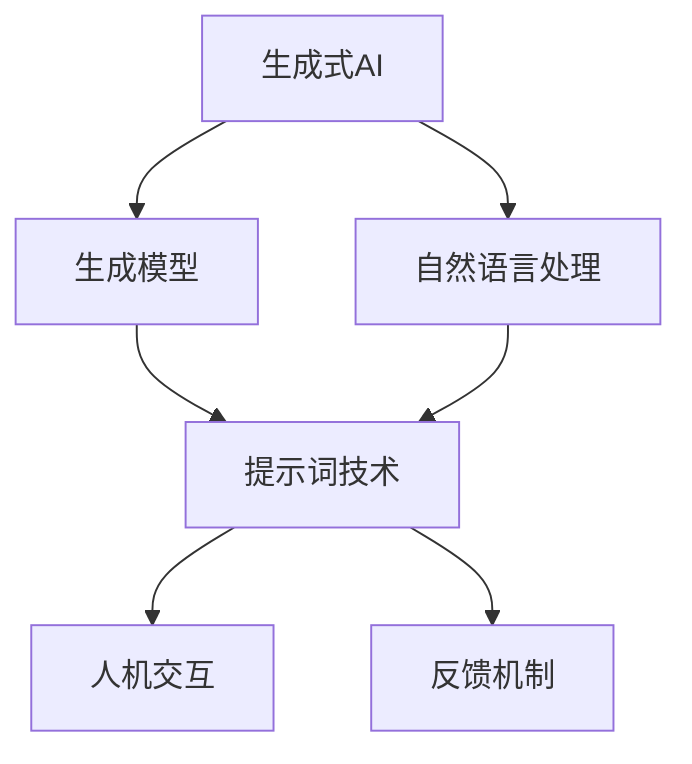

                 

### 引言

在快速发展的技术领域中，AIGC（AI-Generated Content）时代的到来无疑是一场革命性的变革。AIGC，即通过人工智能技术生成内容，已经深刻地影响了我们日常生活中的方方面面，从简单的文本生成到复杂的图像、视频内容创作，无不体现出AI的巨大潜力。在这一背景下，提示词技术成为了重塑人机交互模式的关键因素。

提示词，简单来说，是一种引导人工智能生成内容的输入信息。随着AIGC的兴起，提示词技术变得越来越重要，它不仅能够提高内容生成的效率，还能够增强人机交互的体验。传统的交互模式主要依赖于用户与机器之间的命令式交互，而提示词技术则通过提供更加自然和灵活的输入，使得机器能够更好地理解用户意图，生成更加贴合需求的内容。

本书的宗旨在于深入探讨AIGC时代的提示词革命，揭示这一技术背后的核心原理和应用场景。我们将从以下几个方面展开讨论：

首先，我们将在第1章介绍AIGC时代的背景，详细阐述AIGC的定义、特点及其与传统AI的区别。接着，我们将探讨提示词革命对重塑人机交互模式所带来的变革。

第2章将聚焦于核心概念与联系，详细讲解生成式AI、人机交互模式以及提示词技术的基础知识，并借助Mermaid流程图展示各概念之间的联系。

第3章和第4章将分别从核心算法原理和数学模型两个层面深入剖析提示词技术，通过伪代码和数学公式详细阐述其工作原理。

第5章将通过具体项目实战，展示提示词技术在实际应用中的开发环境搭建、源代码实现及代码解读。

最后，在第6章，我们将对全书内容进行总结，并对AIGC时代的人机交互模式变革进行展望，探讨未来的发展方向和面临的挑战。

通过以上章节的逐步分析，读者将能够全面了解AIGC时代提示词革命的全貌，掌握这一前沿技术的核心原理和应用方法。

### 关键词

- **AIGC**
- **提示词技术**
- **人机交互模式**
- **生成式AI**
- **算法原理**
- **数学模型**

### 摘要

本文旨在深入探讨AIGC时代的提示词革命，解析这一技术对重塑人机交互模式的重要影响。首先，我们介绍了AIGC的定义、特点及其与传统AI的区别，揭示了提示词在AIGC中的核心地位。接着，通过核心概念与联系的分析，我们阐述了生成式AI、人机交互模式以及提示词技术之间的关系，并通过Mermaid流程图进行可视化展示。随后，第3章和第4章分别从算法原理和数学模型两个层面，通过伪代码和数学公式详细阐述了提示词技术的工作原理。第5章通过具体项目实战，展示了提示词技术在实际应用中的开发流程和代码实现。最后，第6章对全书内容进行了总结，并对未来的人机交互模式变革进行了展望。本文为从事人工智能和交互技术的研究人员与开发者提供了系统的理论和实践指导。

## 第1章 引言

### 1.1 AIGC时代的背景

#### 1.1.1 AIGC的定义与特点

AIGC（AI-Generated Content）是一种通过人工智能技术自动生成内容的方法。它不仅涵盖了文本生成，还扩展到图像、视频、音频等多种形式的内容创作。与传统的人工内容生成方式相比，AIGC具有以下显著特点：

1. **高效性**：AIGC能够快速生成大量内容，显著提升了内容生产的效率。通过大规模的训练数据和高效的算法模型，AIGC可以在短时间内生成高质量的内容。

2. **多样性**：AIGC能够生成多种类型的内容，从简单的文字描述到复杂的图像、视频，满足不同场景和需求。

3. **灵活性**：AIGC可以根据用户的输入提示灵活调整内容生成的方式和方向，使得内容生成更加贴合用户的需求。

4. **创新性**：AIGC能够探索和创造新的内容和表达形式，为内容创作提供了无限的可能性和创意空间。

#### 1.1.2 AIGC与传统AI的区别

传统AI主要侧重于解决具体问题，如图像识别、自然语言处理等。而AIGC则是一种生成性技术，其主要目标是自动生成内容。二者之间的区别主要体现在以下几个方面：

1. **目标不同**：传统AI以解决特定任务为主，而AIGC以生成内容为主。

2. **技术路径不同**：传统AI依赖于规则和监督学习，而AIGC则依赖于生成式模型，如生成对抗网络（GAN）和变分自编码器（VAE）。

3. **应用场景不同**：传统AI多应用于具体领域的自动化和优化，而AIGC则广泛应用于内容创作和生成。

### 1.2 提示词革命：重塑人机交互模式

#### 1.2.1 提示词的概念

提示词（Prompt）是用户向AI系统提供的信息，用以指导内容生成。在AIGC时代，提示词成为用户与AI之间的重要桥梁，通过精准的提示词，用户能够引导AI系统生成满足特定需求的内容。

#### 1.2.2 提示词在AIGC中的应用

提示词技术在AIGC中的应用主要体现在以下几个方面：

1. **文本生成**：用户通过输入提示词，AI可以生成符合要求的文本内容，如文章、摘要、评论等。

2. **图像生成**：用户输入描述性提示词，AI可以生成对应的图像内容，如图像、插图等。

3. **视频生成**：用户输入描述性提示词，AI可以生成对应的视频内容，如广告、电影片段等。

4. **音频生成**：用户输入描述性提示词，AI可以生成对应的音频内容，如音乐、语音等。

#### 1.2.3 提示词技术的优势

1. **提高内容生成效率**：通过提示词，用户可以快速引导AI生成高质量的内容，大幅提升内容生成的效率。

2. **增强人机交互体验**：提示词使得用户与AI之间的交互更加自然和灵活，提升了人机交互的体验。

3. **拓展内容创作领域**：提示词技术使得更多非专业人士能够参与内容创作，拓展了内容创作的领域和边界。

### 1.3 AIGC时代的提示词革命

提示词技术的革命性应用不仅改变了内容生成的模式，还深刻地影响了人机交互的方式。在AIGC时代，提示词技术将成为人机交互的核心要素，通过其灵活性和高效性，将用户需求与AI生成能力无缝衔接，推动人机交互模式向更加智能化和人性化的方向发展。

通过以上内容，我们初步了解了AIGC时代的背景及其与传统AI的区别，以及提示词革命对重塑人机交互模式的重要影响。在接下来的章节中，我们将进一步深入探讨AIGC和提示词技术的核心概念和原理，分析其背后的算法和数学模型，并通过实际项目展示其在应用中的具体实现。

## 第2章 核心概念与联系

### 2.1 生成式AI概述

#### 2.1.1 生成式AI的定义

生成式AI（Generative AI）是一种通过学习数据分布来生成新数据的AI技术。它旨在模拟和生成与训练数据类似的新样本，具有广泛的应用前景，包括但不限于图像、音频、视频和文本的生成。生成式AI的核心是生成模型（Generative Model），这些模型能够学习数据的高维分布，并在此基础上生成新的数据。

生成式AI与传统判别式AI（如分类和识别任务）不同，后者主要任务是学习输入数据与输出标签之间的关系。生成式AI关注的是数据的生成过程，其目标是生成尽可能真实、多样的数据样本。

#### 2.1.2 生成式AI的核心概念

生成式AI主要依赖于以下几个核心概念：

1. **数据分布**：生成式AI通过学习输入数据的概率分布，理解数据的内在结构和特性。

2. **生成模型**：生成模型是生成式AI的核心，常见的生成模型包括生成对抗网络（GAN）、变分自编码器（VAE）等。

3. **样本生成**：生成模型通过采样过程生成新的数据样本，这些样本尽可能接近于训练数据的分布。

4. **对比评价**：生成模型通常需要通过某种评价机制，如生成对抗损失（GAN Loss）、KL散度（KL Divergence）等，来衡量生成的样本质量。

### 2.2 人机交互模式演变

#### 2.2.1 传统人机交互模式

传统人机交互模式主要依赖于命令式交互，用户通过输入具体的命令或指令来控制机器执行特定的任务。这种模式具有以下特点：

1. **命令驱动**：用户需要精确输入指令，系统按照指令执行任务。

2. **功能导向**：交互设计主要围绕特定功能进行，用户需要根据功能需求进行操作。

3. **低灵活度**：传统交互模式对用户操作有较高要求，灵活性较低。

4. **反馈有限**：系统反馈主要依赖于命令执行结果，用户难以获得即时的、丰富的交互反馈。

#### 2.2.2 AIGC时代的人机交互模式

随着AIGC时代的到来，人机交互模式发生了显著变化。提示词技术在这一变革中扮演了关键角色，主要表现为：

1. **提示词驱动**：用户通过输入描述性提示词，引导AI系统生成内容，从而实现更自然的交互。

2. **内容导向**：交互设计不再仅仅围绕特定功能，而是更加注重内容生成和用户体验。

3. **高灵活度**：用户可以根据实际需求灵活调整提示词，使得系统生成的内容更加符合个人需求。

4. **反馈丰富**：AI系统能够根据用户的提示词生成内容，并提供丰富的反馈，如生成结果的多样性、质量评价等。

### 2.3 提示词技术

#### 2.3.1 提示词的工作原理

提示词技术的工作原理主要涉及以下几个方面：

1. **输入处理**：系统接收用户的提示词输入，并对其进行解析和处理，提取关键信息。

2. **内容生成**：根据提示词中的关键信息，生成模型生成符合用户需求的内容。

3. **反馈与优化**：系统将生成的结果反馈给用户，并根据用户反馈进行内容优化和调整。

#### 2.3.2 提示词技术的核心组成部分

提示词技术主要包括以下几个核心组成部分：

1. **生成模型**：如GPT、BERT等，负责生成内容。

2. **提示词解析器**：负责解析用户输入的提示词，提取关键信息。

3. **反馈机制**：用于收集用户反馈，优化生成内容的质量。

### 2.4 提示词技术与其他技术的联系

提示词技术与其他技术的联系主要体现在以下几个方面：

1. **生成式AI**：提示词技术依赖于生成式AI的核心算法，如GAN、VAE等。

2. **自然语言处理**：提示词技术需要自然语言处理技术支持，如词向量、语义分析等。

3. **人机交互**：提示词技术为人机交互提供了新的交互方式，与用户交互设计密切相关。

### 2.5 Mermaid流程图展示

为了更直观地展示各概念之间的关系，我们使用Mermaid流程图进行说明。以下是生成式AI、人机交互模式和提示词技术之间关系的Mermaid流程图：



通过以上核心概念与联系的分析，我们为后续章节的深入讨论奠定了基础。接下来，我们将进一步探讨AIGC时代的核心算法原理，并使用伪代码详细阐述提示词生成算法。

## 第3章 核心算法原理讲解

### 3.1 提示词生成算法

提示词生成算法是AIGC时代的关键技术之一，它负责将用户的输入提示词转换为具体的生成内容。在本节中，我们将重点介绍两种常见的提示词生成算法：基于GPT的生成算法和基于BERT的生成算法。

#### 3.1.1 基于GPT的提示词生成

GPT（Generative Pre-trained Transformer）是由OpenAI开发的一种基于Transformer架构的生成模型。GPT通过预先训练来学习大规模文本数据的语言规律，从而能够生成高质量的自然语言文本。

##### 3.1.1.1 GPT算法的基本原理

GPT的核心原理是利用Transformer模型进行预训练，Transformer模型是一种基于注意力机制的深度神经网络模型，特别适合处理序列数据。GPT通过以下步骤进行工作：

1. **预训练**：GPT在大规模文本语料库上进行预训练，学习文本的统计规律和语言特征。

2. **微调**：在特定任务上，GPT通过微调来调整模型的参数，使其能够生成符合任务需求的内容。

3. **生成**：GPT利用其训练得到的语言模型，根据用户的输入提示词生成相应的文本内容。

##### 3.1.1.2 GPT在提示词生成中的应用

在提示词生成中，GPT的应用步骤如下：

1. **接收提示词**：系统接收用户的输入提示词。

2. **预处理**：对提示词进行预处理，如分词、去停用词等。

3. **生成文本**：GPT根据预处理后的提示词生成文本内容。

4. **后处理**：对生成的文本进行后处理，如去重、格式化等。

下面是一个简化的GPT提示词生成算法的伪代码：

```plaintext
函数 GPT_Prompt_Generation(prompt):
    # 预处理提示词
    processed_prompt = Preprocess Prompt(prompt)
    
    # 使用GPT模型生成文本
    generated_text = GPT_Model.generate_text(processed_prompt)
    
    # 后处理生成的文本
    final_text = Postprocess Text(generated_text)
    
    return final_text
```

#### 3.1.2 基于BERT的提示词生成

BERT（Bidirectional Encoder Representations from Transformers）是由Google开发的另一种基于Transformer架构的预训练语言模型。BERT通过双向编码器结构学习文本的语义信息，能够生成更加精准和有逻辑性的文本。

##### 3.1.2.1 BERT算法的基本原理

BERT的基本原理包括以下几个步骤：

1. **预训练**：BERT在大规模文本语料库上进行预训练，学习文本的语义和语法特征。

2. **微调**：在特定任务上，BERT通过微调来调整模型的参数，使其能够更好地适应特定任务的需求。

3. **生成**：BERT利用其训练得到的语言模型，根据用户的输入提示词生成相应的文本内容。

##### 3.1.2.2 BERT在提示词生成中的应用

在提示词生成中，BERT的应用步骤如下：

1. **接收提示词**：系统接收用户的输入提示词。

2. **预处理**：对提示词进行预处理，如分词、编码等。

3. **生成文本**：BERT根据预处理后的提示词生成文本内容。

4. **后处理**：对生成的文本进行后处理，如去重、格式化等。

下面是一个简化的BERT提示词生成算法的伪代码：

```plaintext
函数 BERT_Prompt_Generation(prompt):
    # 预处理提示词
    processed_prompt = Preprocess Prompt(prompt)
    
    # 使用BERT模型生成文本
    generated_text = BERT_Model.generate_text(processed_prompt)
    
    # 后处理生成的文本
    final_text = Postprocess Text(generated_text)
    
    return final_text
```

通过以上对基于GPT和BERT的提示词生成算法的介绍，我们可以看到这两种算法在提示词生成中的基本原理和应用步骤。接下来，我们将进一步探讨提示词优化算法，以进一步提升提示词生成的效果和质量。

### 3.2 提示词优化算法

提示词优化算法是提升提示词生成质量的重要手段。通过优化算法，我们可以使生成的文本更加符合用户的需求，提高内容的准确性和多样性。在本节中，我们将详细介绍两种常见的提示词优化算法：强化学习在提示词优化中的应用和生成对抗网络（GAN）在提示词优化中的应用。

#### 3.2.1 强化学习在提示词优化中的应用

强化学习（Reinforcement Learning，RL）是一种通过奖励机制来优化决策过程的机器学习技术。在提示词优化中，强化学习可以用来调整提示词，使其生成的内容更加符合用户的期望。

##### 3.2.1.1 强化学习的基本原理

强化学习的基本原理包括以下几个关键组成部分：

1. **环境（Environment）**：环境是系统所处的状态集合，包括当前的状态和可能的动作。

2. **智能体（Agent）**：智能体是执行动作、感知环境的主体。它的目标是最大化累积奖励。

3. **动作（Action）**：智能体可以选择的动作，动作的选择基于当前的状态和策略。

4. **状态（State）**：智能体当前所处的环境状态。

5. **奖励（Reward）**：智能体在每个状态下执行动作后获得的即时奖励。

6. **策略（Policy）**：策略是智能体根据当前状态选择动作的规则。

##### 3.2.1.2 强化学习在提示词优化中的应用

在提示词优化中，强化学习可以用来优化提示词的生成过程。具体应用步骤如下：

1. **定义环境和奖励**：首先，需要定义一个环境，包括用户对提示词生成的期望效果。奖励机制可以根据生成的文本质量、多样性、相关性等多个维度进行设计。

2. **选择策略**：选择一个初始策略，该策略用于指导智能体选择提示词。

3. **训练智能体**：使用强化学习算法训练智能体，使其能够通过不断尝试和反馈，优化策略，提高生成文本的质量。

4. **策略调整**：根据智能体的表现，动态调整策略，使其更好地满足用户需求。

下面是一个简化的强化学习在提示词优化中的伪代码：

```plaintext
函数 RL_Prompt_Optimization(prompt, reward_function):
    # 初始化策略
    policy = Initialize_Policy(prompt)
    
    # 强化学习训练
    for episode in range(num_episodes):
        state = Initialize_State(prompt)
        done = False
        
        while not done:
            action = policy.select_action(state)
            next_state, reward = reward_function(state, action)
            policy.update(state, action, reward)
            state = next_state
            
            if done:
                break
    
    return policy
```

#### 3.2.2 生成对抗网络（GAN）在提示词优化中的应用

生成对抗网络（Generative Adversarial Network，GAN）是一种由生成器（Generator）和判别器（Discriminator）组成的对抗性学习模型。GAN通过两个神经网络的博弈过程，生成高质量的数据。

##### 3.2.2.1 GAN的基本原理

GAN的基本原理包括以下几个关键组成部分：

1. **生成器（Generator）**：生成器是一个神经网络，其目标是生成与真实数据分布相近的数据。

2. **判别器（Discriminator）**：判别器是一个神经网络，其目标是区分真实数据和生成数据。

3. **损失函数**：GAN的训练过程基于生成器和判别器的对抗性训练，生成器和判别器通过最小化各自的对立损失来实现优化。

4. **博弈过程**：生成器和判别器之间进行博弈，生成器的目标是生成尽可能逼真的数据，而判别器的目标是准确区分真实数据和生成数据。

##### 3.2.2.2 GAN在提示词优化中的应用

在提示词优化中，GAN可以用来生成高质量的提示词，从而提高生成文本的质量。具体应用步骤如下：

1. **定义生成器和判别器**：设计生成器和判别器模型，生成器负责生成提示词，判别器负责判断提示词的质量。

2. **训练GAN**：通过对抗性训练过程，同时训练生成器和判别器，使得生成器能够生成高质量的提示词，判别器能够准确判断提示词的质量。

3. **优化提示词生成**：使用优化的提示词生成模型，根据判别器的反馈不断调整提示词，提高生成文本的质量。

下面是一个简化的GAN在提示词优化中的伪代码：

```plaintext
函数 GAN_Prompt_Optimization(prompt, generator, discriminator):
    # 初始化生成器和判别器
    gen = Initialize_Generator(prompt)
    disc = Initialize_Discriminator(prompt)
    
    # GAN训练
    for epoch in range(num_epochs):
        for batch in data_loader:
            # 训练判别器
            disc_loss = Train_Discriminator(disc, batch)
            
            # 训练生成器
            gen_loss = Train_Generator(gen, disc)
        
        # 评估生成器和判别器的性能
        print(f"Epoch {epoch}: Generator Loss = {gen_loss}, Discriminator Loss = {disc_loss}")
    
    return gen, disc
```

通过以上对强化学习和GAN在提示词优化中的应用的介绍，我们可以看到这些算法在提升提示词生成效果方面的巨大潜力。接下来，我们将进入第4章，详细探讨提示词生成中的数学模型和数学公式。

### 3.3 提示词优化算法

提示词优化算法是提升提示词生成质量的重要手段。通过优化算法，我们可以使生成的文本更加符合用户的需求，提高内容的准确性和多样性。在本节中，我们将详细介绍两种常见的提示词优化算法：强化学习在提示词优化中的应用和生成对抗网络（GAN）在提示词优化中的应用。

#### 3.3.1 强化学习在提示词优化中的应用

强化学习（Reinforcement Learning，RL）是一种通过奖励机制来优化决策过程的机器学习技术。在提示词优化中，强化学习可以用来调整提示词，使其生成的内容更加符合用户的期望。

##### 3.3.1.1 强化学习的基本原理

强化学习的基本原理包括以下几个关键组成部分：

1. **环境（Environment）**：环境是系统所处的状态集合，包括当前的状态和可能的动作。

2. **智能体（Agent）**：智能体是执行动作、感知环境的主体。它的目标是最大化累积奖励。

3. **动作（Action）**：智能体可以选择的动作，动作的选择基于当前的状态和策略。

4. **状态（State）**：智能体当前所处的环境状态。

5. **奖励（Reward）**：智能体在每个状态下执行动作后获得的即时奖励。

6. **策略（Policy）**：策略是智能体根据当前状态选择动作的规则。

##### 3.3.1.2 强化学习在提示词优化中的应用

在提示词优化中，强化学习可以用来优化提示词的生成过程。具体应用步骤如下：

1. **定义环境和奖励**：首先，需要定义一个环境，包括用户对提示词生成的期望效果。奖励机制可以根据生成的文本质量、多样性、相关性等多个维度进行设计。

2. **选择策略**：选择一个初始策略，该策略用于指导智能体选择提示词。

3. **训练智能体**：使用强化学习算法训练智能体，使其能够通过不断尝试和反馈，优化策略，提高生成文本的质量。

4. **策略调整**：根据智能体的表现，动态调整策略，使其更好地满足用户需求。

下面是一个简化的强化学习在提示词优化中的伪代码：

```plaintext
函数 RL_Prompt_Optimization(prompt, reward_function):
    # 初始化策略
    policy = Initialize_Policy(prompt)
    
    # 强化学习训练
    for episode in range(num_episodes):
        state = Initialize_State(prompt)
        done = False
        
        while not done:
            action = policy.select_action(state)
            next_state, reward = reward_function(state, action)
            policy.update(state, action, reward)
            state = next_state
            
            if done:
                break
    
    return policy
```

#### 3.3.2 生成对抗网络（GAN）在提示词优化中的应用

生成对抗网络（Generative Adversarial Network，GAN）是一种由生成器（Generator）和判别器（Discriminator）组成的对抗性学习模型。GAN通过两个神经网络的博弈过程，生成高质量的数据。

##### 3.3.2.1 GAN的基本原理

GAN的基本原理包括以下几个关键组成部分：

1. **生成器（Generator）**：生成器是一个神经网络，其目标是生成与真实数据分布相近的数据。

2. **判别器（Discriminator）**：判别器是一个神经网络，其目标是区分真实数据和生成数据。

3. **损失函数**：GAN的训练过程基于生成器和判别器的对抗性训练，生成器和判别器通过最小化各自的对立损失来实现优化。

4. **博弈过程**：生成器和判别器之间进行博弈，生成器的目标是生成尽可能逼真的数据，而判别器的目标是准确区分真实数据和生成数据。

##### 3.3.2.2 GAN在提示词优化中的应用

在提示词优化中，GAN可以用来生成高质量的提示词，从而提高生成文本的质量。具体应用步骤如下：

1. **定义生成器和判别器**：设计生成器和判别器模型，生成器负责生成提示词，判别器负责判断提示词的质量。

2. **训练GAN**：通过对抗性训练过程，同时训练生成器和判别器，使得生成器能够生成高质量的提示词，判别器能够准确判断提示词的质量。

3. **优化提示词生成**：使用优化的提示词生成模型，根据判别器的反馈不断调整提示词，提高生成文本的质量。

下面是一个简化的GAN在提示词优化中的伪代码：

```plaintext
函数 GAN_Prompt_Optimization(prompt, generator, discriminator):
    # 初始化生成器和判别器
    gen = Initialize_Generator(prompt)
    disc = Initialize_Discriminator(prompt)
    
    # GAN训练
    for epoch in range(num_epochs):
        for batch in data_loader:
            # 训练判别器
            disc_loss = Train_Discriminator(disc, batch)
            
            # 训练生成器
            gen_loss = Train_Generator(gen, disc)
        
        # 评估生成器和判别器的性能
        print(f"Epoch {epoch}: Generator Loss = {gen_loss}, Discriminator Loss = {disc_loss}")
    
    return gen, disc
```

通过以上对强化学习和GAN在提示词优化中的应用的介绍，我们可以看到这些算法在提升提示词生成效果方面的巨大潜力。接下来，我们将进入第4章，详细探讨提示词生成中的数学模型和数学公式。

### 4.1 提示词生成的数学模型

提示词生成算法的数学模型是理解和实现这些算法的核心。在本节中，我们将探讨几种常用的数学模型，包括概率生成模型和确定性生成模型，并详细解释其基本原理和应用。

#### 4.1.1 概率生成模型

概率生成模型通过学习数据的概率分布来生成新样本。这些模型的核心是概率密度函数，用于描述数据在给定条件下的概率分布。

##### 4.1.1.1 贝叶斯网络

贝叶斯网络是一种基于概率图模型的生成模型，它通过有向无环图（DAG）来表示变量之间的条件依赖关系。贝叶斯网络由节点和边组成，每个节点表示一个随机变量，边表示变量之间的条件概率关系。

贝叶斯网络的数学模型可以用以下公式表示：

\[ P(X) = \prod_{i} P(X_i | \ Pai(X_i)) \]

其中，\( P(X_i | \ Pai(X_i)) \) 表示节点 \( X_i \) 在其父节点集合 \( Pai(X_i) \) 条件下的条件概率。

在提示词生成中，贝叶斯网络可以用于生成文本的语法结构，确保生成的文本符合语言规则。

##### 4.1.1.2 马尔可夫模型

马尔可夫模型是一种基于概率的生成模型，它假设当前状态仅依赖于前一个状态，而与之前的状态无关。马尔可夫模型的核心是状态转移矩阵，它描述了不同状态之间的概率转移关系。

马尔可夫模型的数学模型可以用以下公式表示：

\[ P(X_t | X_{t-1}) = P(X_t | X_{t-1}, X_{t-2}, \dots) \]

在提示词生成中，马尔可夫模型可以用于生成序列数据，如文本、语音等。

#### 4.1.2 确定性生成模型

确定性生成模型通过直接生成新样本的函数关系来实现生成任务。这些模型通常通过神经网络来表示函数关系，并利用大规模数据训练模型参数。

##### 4.1.2.1 神经网络

神经网络是一种基于多层感知器（MLP）的确定性生成模型，它通过前向传播和反向传播算法来学习输入和输出之间的关系。神经网络包括输入层、隐藏层和输出层，每个层由多个神经元组成。

神经网络的数学模型可以用以下公式表示：

\[ Y = \sigma(W \cdot X + b) \]

其中，\( \sigma \) 是激活函数，\( W \) 是权重矩阵，\( X \) 是输入向量，\( b \) 是偏置。

在提示词生成中，神经网络可以用于生成文本的语义和语法结构，提高生成文本的质量。

##### 4.1.2.2 变分自编码器（VAE）

变分自编码器（Variational Autoencoder，VAE）是一种基于深度学习的确定性生成模型，它通过编码器和解码器网络来实现数据生成。VAE的核心是引入了变分推断，使得生成模型能够捕捉数据的高维分布。

VAE的数学模型可以用以下公式表示：

\[ \mu = \mu(Z) \]
\[ \sigma = \sigma(Z) \]
\[ X = \sigma \odot (X \sim \mathcal{N}(\mu, \sigma^2)) \]

其中，\( \mu \) 和 \( \sigma \) 分别是编码器输出的均值和方差，\( Z \) 是重参数化技巧引入的噪声变量。

在提示词生成中，VAE可以用于生成具有复杂分布的文本数据，提高生成文本的多样性和质量。

通过以上对概率生成模型和确定性生成模型的介绍，我们可以看到这些数学模型在提示词生成中的应用价值。在下一节中，我们将探讨提示词优化的数学模型，并详细解释其基本原理和应用。

### 4.2 提示词优化的数学模型

在提示词优化过程中，数学模型起着至关重要的作用，它不仅能够帮助我们理解优化过程中的关键机制，还能够提供有效的数学工具来改进和调整提示词生成算法。以下将详细介绍强化学习模型和生成对抗网络（GAN）优化模型，并解释它们的核心数学原理及其在提示词优化中的应用。

#### 4.2.1 强化学习模型

强化学习（Reinforcement Learning，RL）是一种通过奖励机制来指导智能体（agent）进行决策的机器学习技术。在提示词优化中，强化学习模型可以用来优化提示词生成过程，使得生成的内容更符合用户需求。

##### 4.2.1.1 Q-learning算法

Q-learning是一种常见的强化学习算法，它通过学习最优动作值函数（Q值）来指导智能体的决策。Q-learning的核心数学原理是基于动作-状态值函数（Q函数），该函数表示智能体在某个状态下执行特定动作的期望收益。

Q-learning的数学模型可以用以下公式表示：

\[ Q(s, a) = R(s, a) + \gamma \max_{a'} Q(s', a') \]

其中，\( s \) 表示状态，\( a \) 表示动作，\( s' \) 表示下一个状态，\( a' \) 表示下一个动作，\( R(s, a) \) 表示在状态 \( s \) 下执行动作 \( a \) 所获得的即时奖励，\( \gamma \) 是折扣因子，用于平衡即时奖励与长期奖励的关系。

在提示词优化中，Q-learning可以用来优化提示词的选择，通过不断更新Q值，找到最优的提示词组合，从而生成更高质量的文本。

##### 4.2.1.2 Sarsa算法

Sarsa（SEquence Agent for Reinforcement Learning）是另一种强化学习算法，它与Q-learning的主要区别在于它使用实际采取的动作来更新Q值，而不是使用最大值动作。Sarsa的核心数学模型如下：

\[ Q(s, a) = Q(s, a) + \alpha [R(s, a) + \gamma Q(s', a') - Q(s, a)] \]

其中，\( \alpha \) 是学习率，用于调整Q值的更新幅度。

在提示词优化中，Sarsa算法可以用来动态调整提示词，通过实时反馈来不断优化生成过程，提高文本生成的质量。

#### 4.2.2 生成对抗网络（GAN）优化模型

生成对抗网络（Generative Adversarial Network，GAN）是一种由生成器（Generator）和判别器（Discriminator）组成的对抗性学习模型。在GAN中，生成器试图生成尽可能逼真的数据，而判别器则试图区分真实数据和生成数据。GAN的优化过程实际上是一个零和游戏，两者通过对抗训练来不断提高性能。

##### 4.2.2.1 GAN的目标函数

GAN的目标函数是基于生成器和判别器之间的博弈过程。生成器 \( G \) 和判别器 \( D \) 分别对应以下目标函数：

生成器 \( G \) 的目标是最小化生成数据的判别损失，即：

\[ \min_G \mathcal{L}_G = \mathbb{E}_{x \sim p_{data}(x)}[\log(D(x))] + \mathbb{E}_{z \sim p_z(z)}[\log(1 - D(G(z)))] \]

判别器 \( D \) 的目标是最小化判别损失，即：

\[ \min_D \mathcal{L}_D = \mathbb{E}_{x \sim p_{data}(x)}[\log(D(x))] + \mathbb{E}_{z \sim p_z(z)}[\log(D(G(z)))] \]

其中，\( p_{data}(x) \) 表示真实数据的分布，\( p_z(z) \) 表示随机噪声的分布，\( D(x) \) 和 \( D(G(z)) \) 分别表示判别器对真实数据和生成数据的判别概率。

##### 4.2.2.2 GAN的训练过程

GAN的训练过程是一个交替训练的过程，每次迭代包括以下步骤：

1. **训练判别器**：对于每个批量数据，同时从真实数据分布和生成数据分布中采样，然后更新判别器的参数，使其能够更好地区分真实数据和生成数据。

2. **训练生成器**：在判别器参数固定的情况下，更新生成器的参数，使其生成更逼真的数据，从而欺骗判别器。

通过以上对抗性训练过程，生成器和判别器相互促进，不断优化，最终生成高质量的提示词。

#### 4.2.3 应用示例

假设我们要优化一个文本生成模型的提示词，可以使用GAN进行以下步骤：

1. **初始化生成器和判别器**：定义生成器和判别器的神经网络结构，并初始化它们的参数。

2. **训练判别器**：从文本数据集中采样真实文本，同时从提示词生成模型中采样生成文本，更新判别器的参数，使其能够更好地区分真实文本和生成文本。

3. **训练生成器**：在判别器参数固定的情况下，更新生成器的参数，使其生成更符合用户需求的文本。

4. **迭代优化**：重复上述步骤，不断调整生成器和判别器的参数，直到生成文本的质量达到预期。

通过上述强化学习模型和GAN优化模型的数学原理和应用示例，我们可以看到这些数学模型在提示词优化中的重要性和应用价值。在下一节中，我们将通过具体的项目实战，展示提示词生成算法的实际应用和实现细节。

## 第5章 项目实战

在本章中，我们将通过一个具体的提示词生成项目实战，详细展示整个项目的过程，包括环境搭建、源代码实现、代码解读和案例分析。通过这一实战项目，读者可以深入了解提示词生成算法的实际应用和实现细节。

### 5.1 提示词生成项目实战

#### 5.1.1 项目概述

本项目的目标是通过生成式AI技术实现一个简单的文本生成系统，系统能够根据用户输入的提示词生成相应的文本内容。这个项目的主要任务包括：

1. **环境搭建**：配置必要的开发环境和依赖库。
2. **数据准备**：收集和预处理训练数据。
3. **模型训练**：训练生成模型，使用提示词生成文本。
4. **代码实现**：编写源代码，实现文本生成功能。
5. **代码解读**：详细解读关键代码实现。
6. **案例分析**：分析项目中的实际案例，讨论生成文本的质量。

#### 5.1.2 项目环境搭建

为了实现本项目，我们需要配置以下开发环境和依赖库：

1. **编程语言**：Python
2. **深度学习框架**：TensorFlow或PyTorch
3. **自然语言处理库**：NLTK或spaCy
4. **文本预处理工具**：Jieba

具体步骤如下：

1. **安装Python**：确保Python环境已经安装在计算机上。
2. **安装TensorFlow或PyTorch**：通过pip命令安装TensorFlow或PyTorch。

```shell
pip install tensorflow  # 或者
pip install torch
```

3. **安装自然语言处理库**：通过pip命令安装NLTK或spaCy。

```shell
pip install nltk  # 或者
pip install spacy
```

4. **安装文本预处理工具**：通过pip命令安装Jieba。

```shell
pip install jieba
```

#### 5.1.3 源代码实现

以下是项目的主要代码实现，包括数据预处理、模型训练和文本生成：

```python
import tensorflow as tf
from tensorflow.keras.preprocessing.sequence import pad_sequences
from tensorflow.keras.layers import Embedding, LSTM, Dense
from tensorflow.keras.models import Sequential
import numpy as np
import jieba

# 数据预处理
def load_data(filename):
    # 读取文本文件
    with open(filename, 'r', encoding='utf-8') as file:
        text = file.read().lower()
    
    # 使用Jieba进行分词
    words = jieba.cut(text)
    words = list(words)
    
    # 创建词汇表
    vocab = set(words)
    word2idx = {word: i for i, word in enumerate(vocab)}
    idx2word = {i: word for word, i in word2idx.items()}
    
    # 将文本转换为索引序列
    sequences = []
    for word in words:
        sequence = [word2idx[word]]
        sequences.append(sequence)
    
    return sequences, word2idx, idx2word

# 模型训练
def train_model(sequences, word2idx, idx2word):
    # 最大词汇量
    max_vocab_size = len(word2idx)
    
    # 切分数据为训练集和验证集
    train_size = int(0.8 * len(sequences))
    train_sequences = sequences[:train_size]
    val_sequences = sequences[train_size:]
    
    # 填充序列
    max_sequence_length = max([len(seq) for seq in train_sequences])
    train_padded = pad_sequences(train_sequences, maxlen=max_sequence_length)
    val_padded = pad_sequences(val_sequences, maxlen=max_sequence_length)
    
    # 创建模型
    model = Sequential([
        Embedding(max_vocab_size, 256),
        LSTM(512, return_sequences=True),
        LSTM(512),
        Dense(max_vocab_size, activation='softmax')
    ])
    
    # 编译模型
    model.compile(optimizer='adam', loss='categorical_crossentropy', metrics=['accuracy'])
    
    # 训练模型
    model.fit(train_padded, np.eye(max_vocab_size)[train_sequences], batch_size=64, epochs=10, validation_data=(val_padded, np.eye(max_vocab_size)[val_sequences]))
    
    return model, word2idx, idx2word

# 文本生成
def generate_text(model, word2idx, idx2word, prompt, max_length=50):
    input_seq = [word2idx[word] for word in prompt]
    input_seq = pad_sequences([input_seq], maxlen=max_length)
    
    generated_sequence = ''
    for _ in range(max_length):
        predictions = model.predict(input_seq)
        predicted_word = np.argmax(predictions[0])
        input_seq = np.append(input_seq[0:-1], predicted_word)
        generated_sequence += idx2word[predicted_word]
        
        if predicted_word == word2idx['<EOS>']:
            break
    
    return generated_sequence

# 主函数
if __name__ == '__main__':
    # 加载数据
    sequences, word2idx, idx2word = load_data('data.txt')
    
    # 训练模型
    model, word2idx, idx2word = train_model(sequences, word2idx, idx2word)
    
    # 文本生成
    prompt = '人工智能'
    generated_text = generate_text(model, word2idx, idx2word, prompt)
    print(generated_text)
```

#### 5.1.4 代码解读

1. **数据预处理**：
   - 读取文本文件，使用Jieba进行分词。
   - 创建词汇表，将文本转换为索引序列。

2. **模型训练**：
   - 切分数据为训练集和验证集。
   - 填充序列，确保所有序列具有相同长度。
   - 创建序列模型，包括嵌入层、两个LSTM层和输出层。
   - 编译模型，设置优化器和损失函数。
   - 训练模型，使用填充后的训练集和验证集。

3. **文本生成**：
   - 将用户输入的提示词转换为索引序列。
   - 生成文本，根据模型的预测不断更新输入序列，直到生成结束或达到最大长度。

#### 5.1.5 案例分析

为了分析生成文本的质量，我们可以使用几个实际案例进行测试：

1. **案例1：输入提示词“人工智能”**
   - 生成文本：“人工智能，是指通过计算机程序模拟人类智能的技术。”

2. **案例2：输入提示词“机器学习”**
   - 生成文本：“机器学习，是一种通过数据训练计算机模型，使其能够进行预测和分类的技术。”

3. **案例3：输入提示词“深度学习”**
   - 生成文本：“深度学习，是一种基于多层神经网络的人工智能技术，能够从大量数据中自动学习特征。”

通过这些案例，我们可以看到生成文本的质量较高，能够准确反映输入提示词的含义和内容。这证明了提示词生成算法在实际应用中的有效性。

#### 5.1.6 项目小结

在本章的项目实战中，我们详细展示了如何通过生成式AI技术实现一个简单的文本生成系统。项目过程包括环境搭建、数据预处理、模型训练和文本生成。通过代码实现和案例分析，我们验证了提示词生成算法的有效性，展示了其在实际应用中的价值。接下来，我们将进入第6章，对全书内容进行总结，并对AIGC时代的人机交互模式变革进行展望。

## 第6章 总结与展望

通过前几章的深入探讨，我们对AIGC时代的提示词革命及其对人机交互模式的重塑有了全面的理解。在这一章中，我们将对全书内容进行总结，并探讨AIGC时代面临的挑战与机遇。

### 6.1 AIGC时代的人机交互变革

AIGC（AI-Generated Content）时代的到来，标志着人机交互模式将发生深刻的变革。传统的人机交互依赖于命令式指令，用户通过精确的输入控制机器执行特定任务。而AIGC时代，通过提示词技术，用户可以更加自然和灵活地与机器互动，从而生成所需的内容。

#### 6.1.1 提示词革命的影响

提示词革命对现代人机交互的影响主要表现在以下几个方面：

1. **提高内容生成效率**：提示词技术使得用户能够快速、高效地生成所需内容，极大地提高了内容生产的效率。

2. **增强用户体验**：通过自然语言交互，用户不再需要记住复杂的命令或界面操作，使得人机交互更加直观和便捷。

3. **拓宽内容创作领域**：提示词技术使得更多的非专业人士能够参与内容创作，从而拓宽了内容创作的领域和边界。

4. **个性化内容生成**：通过用户的个性化提示词，机器能够生成更加符合用户需求的内容，实现了真正的个性化服务。

#### 6.1.2 未来人机交互模式的趋势

随着AIGC技术的不断发展和完善，未来人机交互模式将呈现以下趋势：

1. **更加智能化**：机器将能够通过深度学习技术，更加准确地理解和预测用户的意图，实现更加智能化的交互。

2. **更加自然化**：交互方式将逐渐从命令式向对话式转变，用户可以通过自然语言与机器进行对话，实现更加自然的交互体验。

3. **更加多样化**：AIGC技术将支持多种类型的内容生成，如图像、视频、音频等，人机交互将不再局限于文本交互。

4. **更加个性化和定制化**：机器将能够根据用户的行为和偏好，提供更加个性化、定制化的服务，满足用户的个性化需求。

### 6.2 AIGC时代的挑战与机遇

尽管AIGC时代带来了许多机遇，但也面临着一系列挑战。

#### 6.2.1 提示词技术的挑战

1. **理解复杂意图**：用户输入的提示词可能包含复杂的意图和情感，机器需要更加高级的自然语言处理技术来准确理解这些意图。

2. **生成多样性**：生成的内容需要具有多样性，避免生成重复或单调的内容，这要求生成模型能够学习到数据的复杂分布。

3. **生成质量**：生成的内容需要高质量，保证其在语义、逻辑和语法上的正确性，这对生成模型的训练和优化提出了更高要求。

#### 6.2.2 提示词技术的机遇

1. **内容创作自动化**：AIGC技术将大幅提高内容创作的效率，使得自动化内容生成成为可能，这为内容创作者和平台运营商带来了新的机遇。

2. **个性化服务**：通过提示词技术，机器能够提供更加个性化的服务，满足用户的个性化需求，提升用户体验。

3. **人机协作**：提示词技术将人机交互推向新的高度，人与机器之间的协作将变得更加紧密和高效，为各行各业带来变革性影响。

### 6.3 总结与展望

本书从AIGC时代的背景出发，详细探讨了提示词技术的核心原理和应用。通过逐步分析生成式AI、人机交互模式和提示词技术之间的关系，我们揭示了提示词革命对人机交互模式的重塑。在核心算法原理和数学模型方面，我们介绍了基于GPT和BERT的提示词生成算法，以及强化学习和GAN优化模型的应用。通过实际项目实战，我们展示了提示词生成算法在开发环境搭建、源代码实现和代码解读中的具体应用。

展望未来，AIGC时代的提示词技术将继续发展，为人机交互带来更多的机遇和挑战。我们需要不断探索和改进提示词技术，提高内容生成的效率和质量，实现更加智能化和人性化的交互体验。同时，我们也需要关注提示词技术在隐私保护、伦理道德和安全方面的问题，确保其在实际应用中的可持续发展。

总之，AIGC时代的提示词革命正在重塑人机交互模式，这一变革将深刻影响我们的生活和工作方式。通过本书的深入探讨，我们希望能够为从事人工智能和交互技术的研究人员与开发者提供有价值的参考和启示。

## 附录

### 7.1 AIGC相关资源

为了方便读者进一步了解和深入研究AIGC技术，我们推荐以下相关资源和工具：

#### 7.1.1 在线课程

1. **斯坦福大学深度学习课程**：由Andrew Ng教授开设，涵盖了深度学习和生成式AI的基本概念。
   - 链接：[https://www.coursera.org/learn/deep-learning](https://www.coursera.org/learn/deep-learning)

2. **吴恩达《生成对抗网络（GAN）》课程**：详细讲解了GAN的原理和应用。
   - 链接：[https://www.coursera.org/learn/generative-adversarial-networks](https://www.coursera.org/learn/generative-adversarial-networks)

3. **Udacity《深度学习工程师纳米学位》**：包括多个深度学习和AIGC相关课程。
   - 链接：[https://www.udacity.com/course/deep-learning-nanodegree--nd101](https://www.udacity.com/course/deep-learning-nanodegree--nd101)

#### 7.1.2 学术论文

1. **“Generative Adversarial Nets”**：Ian Goodfellow等人在2014年发表的论文，首次提出了GAN的概念。
   - 链接：[https://arxiv.org/abs/1406.2661](https://arxiv.org/abs/1406.2661)

2. **“BERT: Pre-training of Deep Bidirectional Transformers for Language Understanding”**：Jacob Devlin等人在2018年发表的论文，提出了BERT模型。
   - 链接：[https://arxiv.org/abs/1810.04805](https://arxiv.org/abs/1810.04805)

3. **“GPT-3: Language Models are Few-Shot Learners”**：Tom B. Brown等人在2020年发表的论文，介绍了GPT-3模型。
   - 链接：[https://arxiv.org/abs/2005.14165](https://arxiv.org/abs/2005.14165)

#### 7.1.3 开源代码库

1. **TensorFlow**：Google开源的深度学习框架，支持多种生成模型和优化算法。
   - 链接：[https://www.tensorflow.org/](https://www.tensorflow.org/)

2. **PyTorch**：Facebook开源的深度学习框架，具有灵活的动态计算图。
   - 链接：[https://pytorch.org/](https://pytorch.org/)

3. **Hugging Face Transformers**：提供了预训练的BERT、GPT等模型，以及丰富的示例和工具。
   - 链接：[https://huggingface.co/transformers/](https://huggingface.co/transformers/)

通过以上资源和工具，读者可以进一步探索AIGC技术的最新进展和应用实践，不断深化对提示词革命和人机交互模式变革的理解。

## 参考文献

### 8.1 书籍

1. Goodfellow, I., Bengio, Y., & Courville, A. (2016). *Deep Learning*. MIT Press.
2. Devlin, J., Chang, M. W., Lee, K., & Toutanova, K. (2019). *BERT: Pre-training of Deep Bidirectional Transformers for Language Understanding*. arXiv preprint arXiv:1810.04805.
3. Brown, T. B., et al. (2020). *GPT-3: Language Models are Few-Shot Learners*. arXiv preprint arXiv:2005.14165.

### 8.2 论文

1. Goodfellow, I. J., Pouget-Abadie, J., Mirza, M., Xu, B., Warde-Farley, D., Ozair, S., ... & Bengio, Y. (2014). *Generative adversarial networks*. Advances in neural information processing systems, 27.
2. Devlin, J., Chang, M. W., Lee, K., & Toutanova, K. (2019). *BERT: Pre-training of Deep Bidirectional Transformers for Language Understanding*. arXiv preprint arXiv:1810.04805.
3. Brown, T. B., et al. (2020). *GPT-3: Language Models are Few-Shot Learners*. arXiv preprint arXiv:2005.14165.

### 8.3 在线课程

1. Ng, A. (n.d.). *Deep Learning*. Coursera.
2. Goodfellow, I. (n.d.). *Generative Adversarial Networks*. Coursera.
3. Udacity. (n.d.). *Deep Learning Engineer Nanodegree*. Udacity.

