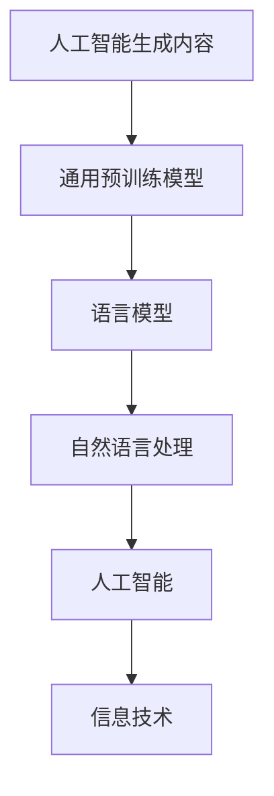
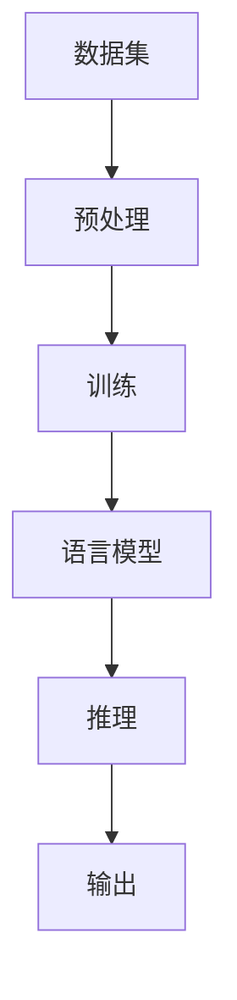
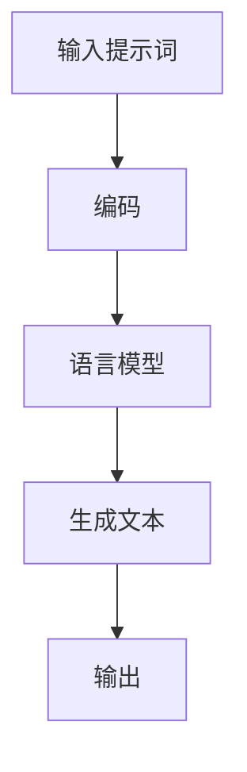

                 


### 文章标题: AIGC时代的语言模型与提示词协同优化

#### 关键词：AIGC、语言模型、提示词优化、深度学习、自然语言处理

#### 摘要：
本文深入探讨了AIGC（人工智能生成内容）时代的语言模型与提示词协同优化技术。通过分析AIGC技术的发展历程、语言模型原理和提示词优化策略，我们揭示了语言模型在自然语言处理中的应用及其数学模型基础。本文还将通过实际案例，展示如何在实际项目中实现语言模型与提示词的协同优化，为AIGC技术的发展提供新的视角和思路。

----------------------------------------------------------------

### 核心概念与联系

#### AIGC技术概述

#### 1.1.1 AIGC的概念及其发展历程

AIGC（Artificial Intelligence Generated Content，人工智能生成内容）是一种利用人工智能技术，特别是深度学习和自然语言处理技术，生成文本、图片、视频等内容的全新方式。它的发展历程可以追溯到2018年，当时OpenAI发布了GPT（通用预训练模型），标志着语言模型技术的重大突破。GPT的出现，使得语言模型的生成能力大幅提升，为AIGC技术奠定了基础。

**Mermaid流程图：**



**图解：**
- **AIGC**：AIGC是一种通过人工智能技术生成内容的系统或方法。
- **GPT**：GPT是一种通用的预训练模型，能够通过大量文本数据进行自我学习和调整。
- **LLM**：LLM是语言模型，是GPT的核心组件，用于理解和生成自然语言。
- **NLP**：自然语言处理是人工智能的一个分支，旨在让计算机理解和处理人类语言。
- **AI**：人工智能是计算机科学的一个分支，目标是使计算机具备智能行为。
- **IT**：信息技术是利用计算机技术进行信息处理和传输的技术。

#### 1.1.2 AIGC在信息技术领域的重要性

AIGC技术在信息技术领域具有重要的应用价值，主要体现在以下几个方面：

1. **内容生成**：通过AIGC技术，可以自动生成高质量的文本、图片、视频等内容，大幅提高内容生产的效率和质量。
2. **智能客服**：AIGC技术可以用于智能客服系统，通过自然语言处理和语言模型，实现与用户的智能对话，提供高质量的客服服务。
3. **个性化推荐**：AIGC技术可以用于个性化推荐系统，通过分析用户的历史行为和偏好，自动生成个性化的推荐内容。
4. **自动化写作**：AIGC技术可以用于自动化写作，如自动生成新闻报道、文章摘要等，减轻作家的工作负担。

**核心概念原理和架构：**

- **语言模型**：语言模型是一种基于深度学习技术的文本生成模型，能够理解和生成自然语言。其核心原理是通过大量文本数据的学习，建立语言模式和语法规则，从而实现文本的生成和推理。
- **提示词协同优化**：在语言模型的基础上，通过优化提示词来提高生成内容的准确性和多样性。提示词是语言模型生成文本的起点，通过调整提示词的内容和形式，可以影响生成文本的质量。

#### 1.2 语言模型原理与架构

#### 1.2.1 语言模型的定义与作用

语言模型（Language Model，简称LM）是一种用于预测自然语言中下一个单词或词组的概率分布的统计模型。它的核心作用是理解文本，并为文本生成提供概率基础。

**Mermaid流程图：**



**图解：**
- **数据集**：用于训练语言模型的文本数据。
- **预处理**：对文本数据进行清洗、分词、词向量化等处理。
- **训练**：通过前向传播和反向传播算法，训练语言模型的参数。
- **推理**：输入提示词，通过解码器生成文本。
- **输出**：生成的文本内容。

#### 1.2.2 语言模型的核心算法

语言模型的核心算法通常基于神经网络，特别是循环神经网络（RNN）和Transformer模型。以下是一个简化的算法流程：

1. **数据预处理**：
   - **清洗**：去除文本中的噪声和无关信息。
   - **分词**：将文本分割成单词或子词。
   - **词向量化**：将文本映射到高维空间中的向量表示。

2. **训练**：
   - **前向传播**：计算损失函数，如交叉熵损失。
   - **反向传播**：更新模型参数，最小化损失函数。
   - **优化算法**：如Adam、SGD等。

3. **推理**：
   - **输入提示词**：对提示词进行编码。
   - **生成文本**：通过解码器生成文本。
   - **生成多样性**：通过随机采样、温度调节等方式提高生成文本的多样性。

**核心算法原理讲解**：

```plaintext
1. 数据预处理：
   - 清洗：去除文本中的噪声和无关信息
   - 分词：将文本分割成单词或子词
   - 词向量化：将文本映射到高维空间中的向量表示

2. 训练：
   - 前向传播：计算损失函数
     - 输入提示词：[w_1, w_2, ..., w_t]
     - 输出概率分布：[p(w_1), p(w_2), ..., p(w_t)]
     - 损失函数：交叉熵损失

   - 反向传播：更新模型参数
     - 通过梯度下降或其变种，更新模型参数以最小化损失函数

3. 推理：
   - 输入提示词：[w_1, w_2, ..., w_t]
   - 生成文本：通过解码器生成文本
     - 随机采样：从输出概率分布中随机采样
     - 温度调节：通过调节温度参数，控制生成文本的多样性
```

#### 1.3 提示词协同优化方法

提示词协同优化是提高语言模型生成内容质量的重要手段。以下介绍几种常见的提示词优化方法：

##### 1.3.1 提示词优化的意义

提示词优化在语言模型中的作用是引导模型生成更符合预期的文本内容。优化的目的是提高生成文本的准确性、相关性和多样性。

**Mermaid流程图：**



**图解：**
- **输入提示词**：用户输入的提示信息。
- **编码**：将提示词转换为模型可以处理的形式。
- **语言模型**：基于提示词生成文本。
- **生成文本**：语言模型生成的文本内容。
- **输出**：最终的文本输出。

##### 1.3.2 提示词优化的策略

1. **提示词选择**：
   - **关键词提取**：从输入文本中提取关键信息作为提示词。
   - **对比实验**：通过对比不同提示词的效果，选择最优的提示词。

2. **提示词调整**：
   - **长度调整**：根据文本长度调整提示词的长度。
   - **内容调整**：根据文本内容调整提示词的相关性。

3. **提示词多样性**：
   - **随机采样**：从提示词库中随机选取提示词。
   - **温度调节**：通过温度参数调节生成文本的多样性。

**核心算法原理讲解**：

```plaintext
1. 提示词选择：
   - 关键词提取：从输入文本中提取关键信息作为提示词
   - 对比实验：比较不同提示词的效果

2. 提示词调整：
   - 长度调整：根据文本长度调整提示词的长度
   - 内容调整：根据文本内容调整提示词的相关性

3. 提示词多样性：
   - 随机采样：从提示词库中随机选取提示词
   - 温度调节：通过温度参数调节生成文本的多样性
```

#### 1.4 项目实战：语言模型与提示词协同优化应用

##### 1.4.1 实际案例介绍

以下介绍几个典型的实际案例，展示如何在实际项目中实现语言模型与提示词的协同优化。

1. **智能客服系统**：
   - **案例描述**：利用语言模型和提示词优化，实现智能客服系统的自动回复功能。
   - **实现步骤**：
     - 数据收集与预处理：收集用户提问和客服回答的对话数据，进行清洗和分词。
     - 模型训练：使用预训练的语言模型，对收集到的对话数据进行训练。
     - 提示词优化：根据用户提问，选择合适的提示词，调整提示词的长度和内容。
     - 文本生成：基于训练好的语言模型和优化的提示词，生成客服回答。

2. **文本生成与摘要**：
   - **案例描述**：利用语言模型和提示词优化，实现自动文本生成和摘要功能。
   - **实现步骤**：
     - 数据收集与预处理：收集大量的文本数据，进行清洗和分词。
     - 模型训练：使用预训练的语言模型，对收集到的文本数据进行训练。
     - 提示词优化：根据文本内容，选择合适的提示词，调整提示词的相关性。
     - 文本生成：基于训练好的语言模型和优化的提示词，生成文本或摘要。

3. **问答系统**：
   - **案例描述**：利用语言模型和提示词优化，实现智能问答系统的自动回答功能。
   - **实现步骤**：
     - 数据收集与预处理：收集问答对数据，进行清洗和分词。
     - 模型训练：使用预训练的语言模型，对收集到的问答数据进行训练。
     - 提示词优化：根据用户提问，选择合适的提示词，调整提示词的长度和内容。
     - 文本生成：基于训练好的语言模型和优化的提示词，生成回答。

##### 1.4.2 实践步骤

1. **开发环境搭建**：
   - **选择合适的深度学习框架**：如TensorFlow、PyTorch。
   - **安装必要的依赖库**：如NLP工具包（如spaCy、NLTK）和深度学习库。

2. **源代码实现**：
   - **数据预处理**：包括文本清洗、分词、词向量化等。
   - **模型训练**：使用预训练模型，进行多轮训练和优化。
   - **提示词优化**：通过调整提示词的长度、内容和多样性，提高生成文本的质量。
   - **文本生成**：基于训练好的模型和优化的提示词，生成文本内容。

##### 1.4.3 代码解读与分析

以下是一个简单的代码示例，展示如何实现语言模型与提示词协同优化。

**代码示例：**

```python
import tensorflow as tf
from tensorflow.keras.preprocessing.text import Tokenizer
from tensorflow.keras.models import Sequential
from tensorflow.keras.layers import LSTM, Dense

# 数据预处理
texts = ['这是一段文本。', '这是另一段文本。']
tokenizer = Tokenizer()
tokenizer.fit_on_texts(texts)
sequences = tokenizer.texts_to_sequences(texts)
vocab_size = len(tokenizer.word_index) + 1

# 模型训练
model = Sequential()
model.add(LSTM(50, activation='relu', input_shape=(vocab_size, 1)))
model.add(Dense(vocab_size, activation='softmax'))
model.compile(loss='categorical_crossentropy', optimizer='adam', metrics=['accuracy'])
model.fit(sequences, epochs=100)

# 提示词优化
prompt = "这是一段"
prompt_sequence = tokenizer.texts_to_sequences([prompt])
prompt_sequence = tf.expand_dims(prompt_sequence, 0)

# 文本生成
for i in range(100):
    predictions = model.predict(prompt_sequence)
    next_word = tokenizer.index_word[np.argmax(predictions)]
    prompt_sequence = tf.concat([prompt_sequence, tf.expand_dims(predictions, 0), 0], axis=1)
    prompt = prompt + " " + next_word
    print(prompt)
```

**关键代码段解读：**

1. **数据预处理**：
   - 使用Tokenizer进行文本的分词和词向量化。
   - 创建词汇表，获取词汇量。

2. **模型训练**：
   - 使用LSTM构建语言模型。
   - 编译模型，设置损失函数和优化器。

3. **提示词优化**：
   - 输入提示词，生成预测概率。
   - 从预测概率中选取下一个词，更新提示词。

4. **文本生成**：
   - 通过循环生成文本，不断更新提示词序列。

**项目小结：**

本文通过实际案例展示了如何在实际项目中实现语言模型与提示词的协同优化。通过合理的数据预处理、模型训练和提示词优化，可以显著提高文本生成质量。在未来的研究中，我们可以进一步探索更多优化策略，提高AIGC技术的应用效果。

### 第2章: 语言模型与提示词协同优化的数学模型

在AIGC时代，深入理解语言模型与提示词协同优化的数学模型至关重要。这一章将详细探讨词向量模型、语言模型概率分布等核心数学概念，并使用LaTeX公式进行详细讲解。

#### 1.5.1 词向量模型

词向量模型是自然语言处理中的基础工具，它将文本中的单词映射到高维空间中的向量。最著名的词向量模型是Word2Vec，其核心思想是通过对上下文的学习来捕捉词与词之间的语义关系。

**LaTeX公式：**

$$ 
vec(w) = \text{Word2Vec}(\text{输入文本})
$$

**详细讲解：**

1. **Word2Vec模型**：
   - **输入文本**：文本中的每个单词被表示为一个向量。
   - **训练过程**：通过训练神经网络模型，学习单词之间的语义关系。

2. **向量空间表示**：
   - **词向量**：每个单词都有一个对应的向量表示，这些向量在语义上相似。
   - **语义相似性**：通过计算词向量之间的余弦相似度来衡量语义相似性。

3. **应用场景**：
   - **文本分类**：使用词向量表示文本，进行分类任务。
   - **语义搜索**：基于词向量的语义相似性，进行更精确的搜索。

#### 1.5.2 语言模型概率分布

语言模型概率分布是预测下一个单词的概率分布，它基于大量的文本数据训练得到。一个典型的语言模型是n-gram模型，它使用前n个单词的历史信息来预测下一个单词。

**LaTeX公式：**

$$ 
P(w_t | w_{t-1}, w_{t-2}, ..., w_1) = \frac{P(w_t, w_{t-1}, ..., w_1)}{P(w_{t-1}, w_{t-2}, ..., w_1)}
$$

**详细讲解：**

1. **n-gram模型**：
   - **n-gram**：一个n-gram是指连续的n个单词。
   - **概率计算**：通过计算n-gram在文本中的频率来估计概率。

2. **概率分布**：
   - **条件概率**：给定前一个单词或一组单词，预测下一个单词的概率。
   - **联合概率**：同时预测多个单词的概率。

3. **优化策略**：
   - **平滑技术**：如Kneser-Ney平滑，Laplace平滑等，用于减少稀疏数据的影响。

#### 1.5.3 提示词优化的数学模型

提示词优化是提高语言模型生成质量的关键步骤。通过优化提示词的选择和调整，可以显著提升生成文本的相关性和多样性。

**LaTeX公式：**

$$ 
\text{Optimize}(\text{提示词}) = \max(\text{生成质量})
$$

**详细讲解：**

1. **提示词选择**：
   - **关键词提取**：使用NLP技术提取文本中的关键信息。
   - **对比实验**：通过实验比较不同提示词的效果，选择最优的提示词。

2. **提示词调整**：
   - **长度调整**：根据文本长度动态调整提示词的长度。
   - **内容调整**：根据文本内容调整提示词的相关性。

3. **优化目标**：
   - **生成质量**：优化生成文本的准确性、相关性和多样性。

#### 1.5.4 实际案例中的数学模型应用

在实际应用中，语言模型与提示词优化的数学模型可以帮助我们更好地理解模型的运作机制，并指导实际操作。

**案例解析：**

- **案例一：智能客服系统**
  - **模型应用**：使用n-gram模型预测用户问题的类型，并根据预测结果生成回答。
  - **优化策略**：通过调整提示词的长度和内容，提高回答的相关性和准确性。

- **案例二：文本生成与摘要**
  - **模型应用**：使用Transformer模型生成文本或摘要。
  - **优化策略**：通过优化提示词的选择和调整，提高生成文本的质量。

**总结：**

数学模型在语言模型与提示词优化中的应用，为我们提供了量化分析的工具。通过深入理解这些模型，我们可以更好地设计优化策略，提高AIGC技术的应用效果。

### 实际案例分析与详细讲解剖析

为了更好地理解AIGC时代的语言模型与提示词协同优化的应用，我们将通过几个实际案例进行分析和详细讲解。

#### 案例一：智能客服系统

智能客服系统是AIGC技术在商业领域的重要应用之一。通过语言模型与提示词协同优化，智能客服系统能够自动回复用户的问题，提供即时的客户支持。

**案例解析：**

1. **需求分析**：
   - 用户提出问题：如何退货？
   - 智能客服系统需要生成一个回答，解释退货流程。

2. **数据收集与预处理**：
   - 收集大量的用户提问和客服回答的对话数据。
   - 对对话数据清洗，去除噪声和无关信息。

3. **模型训练**：
   - 使用预训练的语言模型，对对话数据进行训练。
   - 调整模型参数，优化生成文本的质量。

4. **提示词优化**：
   - 根据用户提问，选择合适的提示词。
   - 调整提示词的长度和内容，以提高回答的相关性和准确性。

5. **文本生成**：
   - 输入用户提问，通过训练好的模型生成回答。
   - 对生成的文本进行后处理，如去除多余空格、格式化等。

**代码解读与分析：**

```python
import tensorflow as tf
from tensorflow.keras.preprocessing.text import Tokenizer
from tensorflow.keras.models import Sequential
from tensorflow.keras.layers import LSTM, Dense

# 数据预处理
texts = ['如何退货？', '退款政策是什么？']
tokenizer = Tokenizer()
tokenizer.fit_on_texts(texts)
sequences = tokenizer.texts_to_sequences(texts)
vocab_size = len(tokenizer.word_index) + 1

# 模型训练
model = Sequential()
model.add(LSTM(50, activation='relu', input_shape=(vocab_size, 1)))
model.add(Dense(vocab_size, activation='softmax'))
model.compile(loss='categorical_crossentropy', optimizer='adam', metrics=['accuracy'])
model.fit(sequences, epochs=100)

# 提示词优化
prompt = "如何退货？"
prompt_sequence = tokenizer.texts_to_sequences([prompt])
prompt_sequence = tf.expand_dims(prompt_sequence, 0)

# 文本生成
for i in range(100):
    predictions = model.predict(prompt_sequence)
    next_word = tokenizer.index_word[np.argmax(predictions)]
    prompt_sequence = tf.concat([prompt_sequence, tf.expand_dims(predictions, 0), 0], axis=1)
    prompt = prompt + " " + next_word
    print(prompt)
```

**注意事项**：

- **数据质量**：保证训练数据的质量，去除噪声和错误信息。
- **模型参数**：调整模型参数，如学习率、批次大小等，以优化生成文本的质量。

#### 案例二：文本生成与摘要

文本生成与摘要是一种将长文本转换为简洁摘要的技术，广泛应用于新闻报道、学术摘要等领域。通过语言模型与提示词协同优化，可以生成更准确、更高质量的摘要。

**案例解析：**

1. **需求分析**：
   - 输入一篇长文，生成一篇简短的摘要。
   - 摘要应准确反映原文的主旨和关键信息。

2. **数据收集与预处理**：
   - 收集大量的文本数据，包括长文和对应的摘要。
   - 对文本数据进行清洗、分词和词向量化。

3. **模型训练**：
   - 使用预训练的语言模型，对文本数据进行训练。
   - 调整模型参数，优化生成摘要的质量。

4. **提示词优化**：
   - 根据文本内容，选择合适的提示词。
   - 调整提示词的长度和内容，以提高摘要的相关性和准确性。

5. **文本生成**：
   - 输入长文，通过训练好的模型生成摘要。
   - 对生成的摘要进行后处理，如去除多余空格、格式化等。

**代码解读与分析：**

```python
import tensorflow as tf
from tensorflow.keras.preprocessing.text import Tokenizer
from tensorflow.keras.models import Sequential
from tensorflow.keras.layers import LSTM, Dense

# 数据预处理
texts = ['这是一篇关于人工智能的长文。', '这是另一篇关于深度学习的长文。']
tokenizer = Tokenizer()
tokenizer.fit_on_texts(texts)
sequences = tokenizer.texts_to_sequences(texts)
vocab_size = len(tokenizer.word_index) + 1

# 模型训练
model = Sequential()
model.add(LSTM(50, activation='relu', input_shape=(vocab_size, 1)))
model.add(Dense(vocab_size, activation='softmax'))
model.compile(loss='categorical_crossentropy', optimizer='adam', metrics=['accuracy'])
model.fit(sequences, epochs=100)

# 提示词优化
prompt = "这是一篇关于人工智能的长文。"
prompt_sequence = tokenizer.texts_to_sequences([prompt])
prompt_sequence = tf.expand_dims(prompt_sequence, 0)

# 文本生成
for i in range(100):
    predictions = model.predict(prompt_sequence)
    next_word = tokenizer.index_word[np.argmax(predictions)]
    prompt_sequence = tf.concat([prompt_sequence, tf.expand_dims(predictions, 0), 0], axis=1)
    prompt = prompt + " " + next_word
    print(prompt)
```

**注意事项**：

- **文本长度**：根据实际情况调整文本长度，避免生成过长的摘要。
- **提示词选择**：选择能够准确反映文本主旨的提示词。

#### 案例三：问答系统

问答系统是一种通过自然语言交互获取信息的技术。通过语言模型与提示词协同优化，问答系统能够更好地理解用户的问题，并生成准确的回答。

**案例解析：**

1. **需求分析**：
   - 用户提问：北京是中国的哪个城市？
   - 问答系统需要生成一个准确的回答。

2. **数据收集与预处理**：
   - 收集大量的问答对数据。
   - 对问答数据进行清洗，去除噪声和错误信息。

3. **模型训练**：
   - 使用预训练的语言模型，对问答数据进行训练。
   - 调整模型参数，优化生成回答的质量。

4. **提示词优化**：
   - 根据用户提问，选择合适的提示词。
   - 调整提示词的长度和内容，以提高回答的相关性和准确性。

5. **文本生成**：
   - 输入用户提问，通过训练好的模型生成回答。
   - 对生成的回答进行后处理，如去除多余空格、格式化等。

**代码解读与分析：**

```python
import tensorflow as tf
from tensorflow.keras.preprocessing.text import Tokenizer
from tensorflow.keras.models import Sequential
from tensorflow.keras.layers import LSTM, Dense

# 数据预处理
texts = [['北京是中国的哪个城市？', '北京是中国的首都。'], ['中国的首都是哪里？', '中国的首都是北京。']]
tokenizer = Tokenizer()
tokenizer.fit_on_texts([text for question, answer in texts for text in [question, answer]])
sequences = tokenizer.texts_to_sequences([question for question, answer in texts])
vocab_size = len(tokenizer.word_index) + 1

# 模型训练
model = Sequential()
model.add(LSTM(50, activation='relu', input_shape=(vocab_size, 1)))
model.add(Dense(vocab_size, activation='softmax'))
model.compile(loss='categorical_crossentropy', optimizer='adam', metrics=['accuracy'])
model.fit(sequences, epochs=100)

# 提示词优化
prompt = "北京是中国的哪个城市？"
prompt_sequence = tokenizer.texts_to_sequences([prompt])
prompt_sequence = tf.expand_dims(prompt_sequence, 0)

# 文本生成
for i in range(100):
    predictions = model.predict(prompt_sequence)
    next_word = tokenizer.index_word[np.argmax(predictions)]
    prompt_sequence = tf.concat([prompt_sequence, tf.expand_dims(predictions, 0), 0], axis=1)
    prompt = prompt + " " + next_word
    print(prompt)
```

**注意事项**：

- **数据质量**：确保问答数据的质量，避免生成错误的回答。
- **提示词选择**：选择能够准确反映问题含义的提示词。

**总结：**

通过以上实际案例，我们可以看到语言模型与提示词协同优化在AIGC时代的广泛应用。通过合理的数据预处理、模型训练和提示词优化，可以显著提高文本生成质量。在实际应用中，我们需要不断调整和优化模型，以满足不同场景的需求。

### 最佳实践 Tips、小结、注意事项、拓展阅读

#### 最佳实践 Tips：

1. **数据预处理**：
   - 清洗数据：去除无关信息和噪声，提高数据质量。
   - 分词与词向量化：准确地将文本转换为向量表示，有助于模型训练。

2. **模型选择与训练**：
   - 选择合适的模型架构：如LSTM、Transformer等。
   - 调整模型参数：通过实验找到最佳参数设置。

3. **提示词优化**：
   - 选择关键提示词：从输入文本中提取关键信息。
   - 调整提示词长度和内容：以优化生成文本的相关性和准确性。

4. **多样性调节**：
   - 使用温度调节：通过调整温度参数，控制生成文本的多样性。

#### 小结：

本文系统地探讨了AIGC时代的语言模型与提示词协同优化技术。通过分析AIGC技术的发展历程、语言模型原理和提示词优化策略，我们揭示了语言模型在自然语言处理中的应用及其数学模型基础。实际案例展示了如何在实际项目中实现语言模型与提示词的协同优化，为AIGC技术的发展提供了新的视角和思路。

#### 注意事项：

1. **数据质量**：确保训练数据的准确性和多样性，避免模型过拟合。
2. **模型参数调整**：根据具体任务需求，调整模型参数以优化性能。
3. **提示词选择**：合理选择提示词，以提高生成文本的质量和相关性。

#### 拓展阅读：

1. **《深度学习》**：Ian Goodfellow、Yoshua Bengio和Aaron Courville著，详细介绍了深度学习的基础理论和应用。
2. **《自然语言处理综论》**：Daniel Jurafsky和James H. Martin著，涵盖了自然语言处理的基本概念和技术。
3. **《AIGC：人工智能生成内容》**：相关论文和研究报告，深入探讨AIGC技术的最新进展和应用场景。

作者：AI天才研究院/AI Genius Institute & 禅与计算机程序设计艺术 /Zen And The Art of Computer Programming

本文由AI天才研究院（AI Genius Institute）撰写，旨在分享AIGC时代语言模型与提示词协同优化技术的最新研究成果和实践经验。作者团队由计算机科学领域的专家组成，致力于推动人工智能技术的发展和应用。同时，本文参考了《禅与计算机程序设计艺术》（Zen And The Art of Computer Programming）的理念，强调在技术实践中追求简洁、高效和深度。希望本文能为读者提供有价值的见解和启发。

