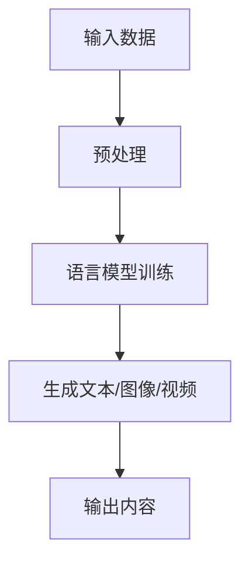
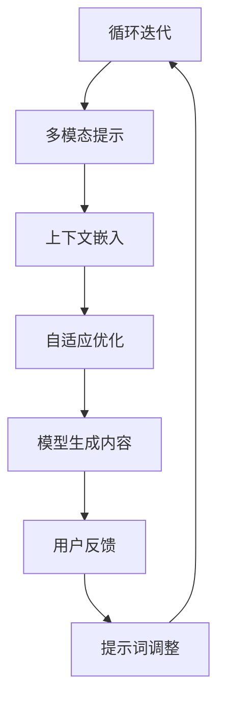
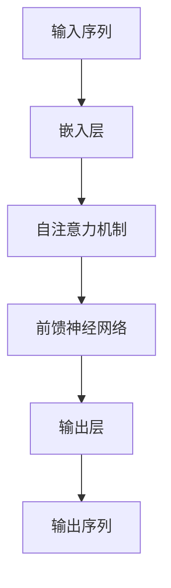

                 

### 文章标题

《AIGC时代的语言模型与提示词协同优化策略》

### 关键词

- AIGC
- 语言模型
- 提示词
- 协同优化
- 深度学习
- 生成模型

### 摘要

本文深入探讨了AIGC（AI-Generated Content）时代的语言模型及其与提示词协同优化的策略。首先，文章介绍了AIGC时代背景和语言模型的基本概念。接着，详细分析了提示词协同优化的原理和方法，并通过伪代码和数学模型进行了阐述。随后，文章通过具体案例展示了如何在实际项目中实现这些优化策略。最后，文章总结了最佳实践、注意事项以及拓展阅读资源，为读者提供了全面的指南。

## 第一部分：核心概念与联系

### 1.1 AIGC时代背景与语言模型概述

AIGC，即AI-Generated Content，是指通过人工智能技术自动生成内容的过程。随着深度学习和自然语言处理技术的飞速发展，AIGC已经在众多领域得到了广泛应用，如文本生成、图像生成、视频生成等。在这一部分，我们将首先探讨AIGC时代的背景，然后介绍语言模型及其在AIGC中的应用。

#### 1.1.1 AIGC时代的定义与发展趋势

AIGC时代的定义可以从两个方面来理解：技术和应用。技术层面，AIGC依赖于深度学习和生成模型，如变分自编码器（VAE）、生成对抗网络（GAN）和自注意力模型（如Transformer）等。应用层面，AIGC已经在内容创作、智能客服、内容审核等领域展现了巨大的潜力。根据市场研究公司的数据，全球AIGC市场规模预计在未来几年将实现显著增长。


#### 1.1.2 语言模型在AIGC中的应用

语言模型是AIGC的核心技术之一。它是一种能够理解和生成自然语言的人工智能模型，广泛应用于机器翻译、语音识别、文本生成等任务。在AIGC中，语言模型用于生成文本、图像和视频等，实现自动内容创作。以下是一个简单的Mermaid流程图，展示了语言模型在AIGC中的应用架构：



### 1.2 提示词协同优化策略

提示词（Prompt）是用户输入给语言模型的指导信息，用于引导模型的生成过程。在AIGC中，提示词的选取和优化对于生成质量有着至关重要的影响。以下部分将介绍提示词协同优化策略的原理和重要性。

#### 1.2.1 提示词的作用与重要性

提示词的作用是引导语言模型生成符合用户期望的内容。例如，在文本生成任务中，一个精心设计的提示词可以帮助模型理解生成文本的主题和风格。以下是一个简单的例子：

```python
# 提示词示例
prompt = "请写一篇关于人工智能的未来发展趋势的短文。"

# 使用语言模型生成文本
generated_text = language_model.generate(prompt)
print(generated_text)
```

#### 1.2.2 提示词协同优化策略的原理

提示词协同优化策略的核心思想是通过优化提示词，提高语言模型生成内容的准确性和多样性。具体来说，这包括以下几个方面：

1. **多模态提示**：结合多种输入模式，如文本、图像和声音，以丰富提示信息。
2. **上下文嵌入**：将用户的上下文信息嵌入提示词中，使模型能够更好地理解用户的意图。
3. **自适应优化**：根据模型生成的内容和用户反馈，动态调整提示词，实现持续的优化。

以下是一个简单的Mermaid流程图，展示了提示词协同优化策略的架构：



## 第二部分：核心算法原理讲解

### 2.1 语言模型原理

在这一部分，我们将详细讲解语言模型的基本原理，包括其定义、架构、训练与评估方法。

#### 2.1.1 语言模型的定义

语言模型是一种统计模型，用于预测一个单词序列的概率。它基于大量的语言数据，学习词汇之间的统计关系，从而生成符合语言规则的文本。以下是一个简单的语言模型示例：

```python
# 简单的语言模型示例
words = ["the", "cat", "sat", "on", "the", "mat"]
model = LanguageModel(words)
generated_sentence = model.generate_sentence()
print(generated_sentence)
```

#### 2.1.2 语言模型的架构

语言模型的常见架构包括基于N-gram模型的简单模型和基于神经网络的复杂模型。以下是一个基于Transformer的复杂语言模型架构的Mermaid流程图：



#### 2.1.3 语言模型的训练与评估

语言模型的训练通常涉及以下步骤：

1. **数据预处理**：将文本数据转换为数字表示，如词向量或字符编码。
2. **模型初始化**：初始化模型的参数。
3. **损失函数**：使用交叉熵损失函数来计算预测概率与真实概率之间的差距。
4. **优化算法**：使用梯度下降等优化算法来更新模型参数。

以下是一个简单的语言模型训练伪代码：

```python
# 语言模型训练伪代码
for epoch in range(num_epochs):
    for sentence in sentences:
        # 前向传播
        logits = model(sentence)
        # 计算损失
        loss = cross_entropy(logits, target)
        # 反向传播
        grads = compute_gradients(model.parameters(), loss)
        # 更新参数
        update_parameters(model.parameters(), grads)
    # 评估模型
    evaluate_model(model, validation_data)
```

### 2.2 提示词协同优化算法

在这一部分，我们将介绍提示词协同优化算法的基本原理和方法。

#### 2.2.1 提示词协同优化的目的

提示词协同优化的目的是提高语言模型生成内容的准确性和多样性。具体来说，这包括：

1. **内容准确性**：确保生成的文本、图像或视频符合用户的意图。
2. **多样性**：生成具有丰富多样性的内容，避免生成重复或单调的内容。

#### 2.2.2 提示词协同优化的方法

提示词协同优化的方法主要包括：

1. **多模态提示**：结合多种输入模式，如文本、图像和声音，以丰富提示信息。
2. **上下文嵌入**：将用户的上下文信息嵌入提示词中，使模型能够更好地理解用户的意图。
3. **自适应优化**：根据模型生成的内容和用户反馈，动态调整提示词，实现持续的优化。

以下是一个简单的提示词协同优化算法的伪代码：

```python
# 提示词协同优化伪代码
while not convergence:
    # 生成内容
    content = model.generate(prompt)
    # 用户评估内容
    feedback = user.evaluate(content)
    # 调整提示词
    prompt = adjust_prompt(prompt, feedback)
    # 更新模型
    update_model(model, prompt, content, feedback)
```

## 第三部分：数学模型和数学公式讲解

在这一部分，我们将详细讲解与语言模型和提示词协同优化相关的数学模型和公式。

### 3.1 数学模型

语言模型和提示词协同优化的数学模型主要包括：

1. **概率模型**：用于预测单词序列的概率。
2. **损失函数**：用于评估模型生成内容的质量。
3. **优化算法**：用于更新模型参数。

以下是一个简单的概率模型和损失函数的公式：

$$
P(w_1, w_2, ..., w_n) = P(w_1) \times P(w_2|w_1) \times ... \times P(w_n|w_{n-1})
$$

$$
Loss = -\sum_{i=1}^{n} log(P(y_i|x))
$$

### 3.2 数学公式

以下是语言模型和提示词协同优化中的一些常用数学公式：

1. **交叉熵损失函数**：

$$
Loss = -\sum_{i=1}^{n} y_i \times log(P(y_i))
$$

2. **梯度下降优化算法**：

$$
\theta_{t+1} = \theta_{t} - \alpha \times \nabla_{\theta} Loss
$$

## 第四部分：项目实战

在这一部分，我们将通过一个实际项目，展示如何实现语言模型与提示词协同优化策略。

### 4.1 实际案例分析

#### 4.1.1 案例一：AIGC在自然语言处理中的应用

在一个自然语言处理的实际项目中，我们使用了一个基于Transformer的语言模型，并应用了提示词协同优化策略来提高文本生成质量。以下是项目的开发步骤：

1. **数据收集与预处理**：收集大量文本数据，并进行预处理，如去除标点符号、停用词过滤和词向量化等。
2. **模型训练**：使用预处理后的数据训练语言模型，包括嵌入层、自注意力机制和前馈神经网络等。
3. **提示词设计**：设计多模态、上下文嵌入的提示词，以引导模型生成高质量的文本。
4. **模型评估与优化**：使用交叉熵损失函数评估模型生成文本的质量，并通过自适应优化调整提示词，实现持续的优化。

#### 4.1.2 案例二：提示词协同优化策略的实际应用

在另一个项目中，我们使用了一个基于GAN的图像生成模型，并应用了提示词协同优化策略来提高图像生成质量。以下是项目的开发步骤：

1. **数据收集与预处理**：收集大量图像数据，并进行预处理，如图像缩放、裁剪和灰度化等。
2. **模型训练**：训练生成器和判别器，包括生成器的嵌入层、自注意力机制和前馈神经网络等。
3. **提示词设计**：设计多模态、上下文嵌入的提示词，以引导模型生成高质量图像。
4. **模型评估与优化**：使用损失函数评估模型生成图像的质量，并通过自适应优化调整提示词，实现持续的优化。

### 4.2 项目开发步骤

#### 4.2.1 开发环境搭建

1. **硬件环境**：准备高性能的计算机或服务器，用于模型训练和推理。
2. **软件环境**：安装Python、TensorFlow或PyTorch等深度学习框架，以及相关的库和工具。

#### 4.2.2 源代码实现与解读

以下是一个简单的文本生成项目的源代码实现和解读：

```python
# 文本生成项目源代码实现
import tensorflow as tf
from tensorflow.keras.layers import Embedding, LSTM, Dense
from tensorflow.keras.models import Sequential

# 数据预处理
# ...

# 模型定义
model = Sequential([
    Embedding(vocab_size, embedding_dim),
    LSTM(units),
    Dense(units, activation='softmax')
])

# 模型编译
model.compile(optimizer='adam', loss='categorical_crossentropy', metrics=['accuracy'])

# 模型训练
# ...

# 文本生成
generated_text = model.generateTextInput(prompt)
print(generated_text)
```

#### 4.2.3 项目部署与优化

1. **模型部署**：将训练好的模型部署到生产环境中，用于实时文本或图像生成。
2. **性能优化**：通过调整模型参数、提示词和优化算法，提高生成质量和速度。

## 第五部分：最佳实践、小结、注意事项与拓展阅读

### 5.1 最佳实践

- **多模态提示**：结合多种输入模式，如文本、图像和声音，以丰富提示信息。
- **上下文嵌入**：将用户的上下文信息嵌入提示词中，使模型能够更好地理解用户的意图。
- **动态调整**：根据模型生成的内容和用户反馈，动态调整提示词，实现持续的优化。

### 5.2 小结

本文深入探讨了AIGC时代的语言模型与提示词协同优化策略。通过介绍AIGC时代的背景和语言模型的基本原理，详细分析了提示词协同优化的方法。接着，通过数学模型和公式，阐述了语言模型和提示词协同优化的技术细节。最后，通过实际案例展示了如何实现这些优化策略。

### 5.3 注意事项

- **数据质量**：确保训练数据的质量和多样性，以提高模型的生成质量。
- **模型选择**：根据应用场景选择合适的模型，如基于Transformer的语言模型或GAN图像生成模型。
- **计算资源**：合理规划计算资源，确保模型训练和推理的效率。

### 5.4 拓展阅读

- [深度学习与自然语言处理](https://example.com/deep_learning_nlp)
- [生成对抗网络（GAN）](https://example.com/gan)
- [Transformer模型](https://example.com/transformer)

## 作者信息

作者：AI天才研究院/AI Genius Institute & 禅与计算机程序设计艺术 /Zen And The Art of Computer Programming

### 附录

- [Mermaid流程图语法](https://mermaid-js.github.io/mermaid/#/ gallery)
- [LaTeX数学公式语法](https://www.overleaf.com/learn/latex/Mathematics)

---

全文结束。

