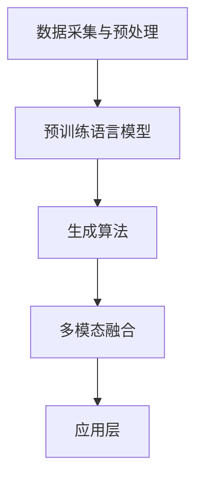
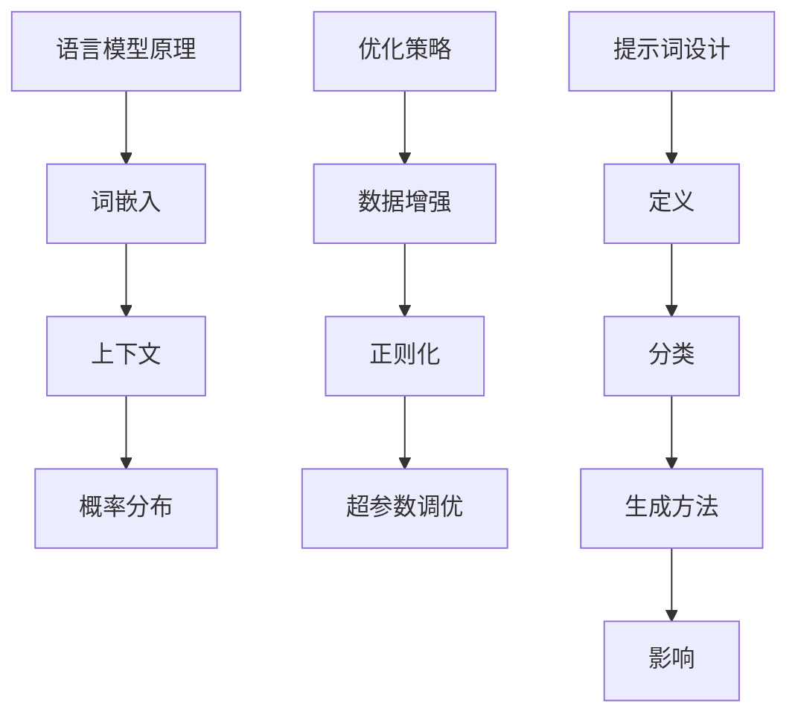
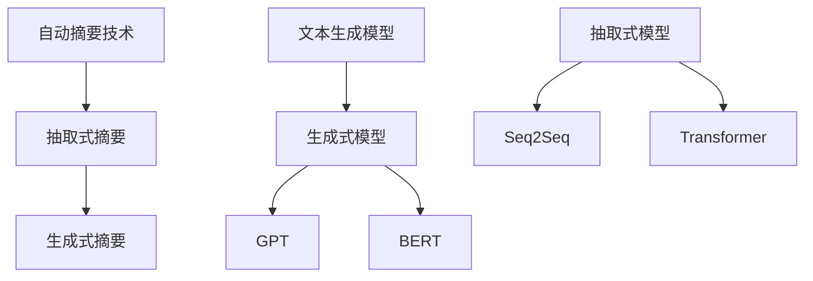
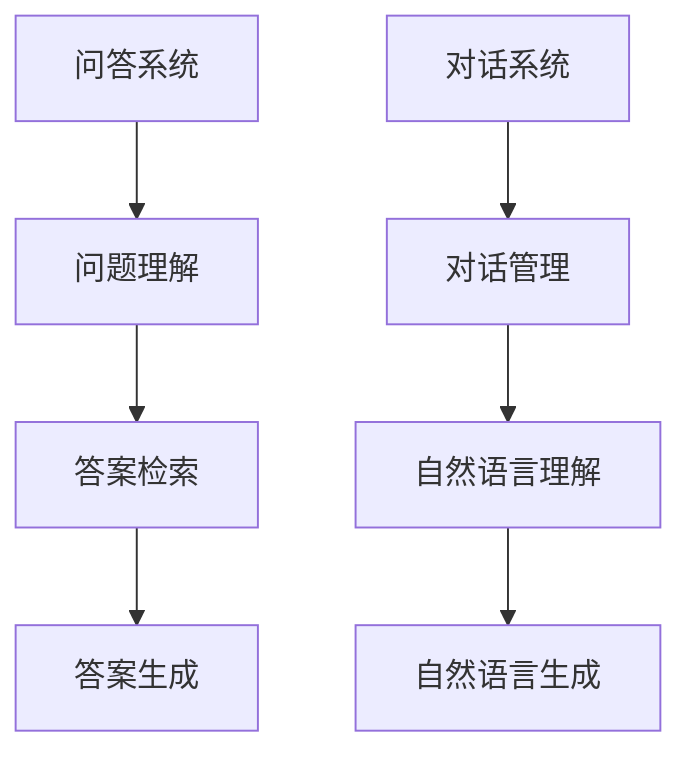
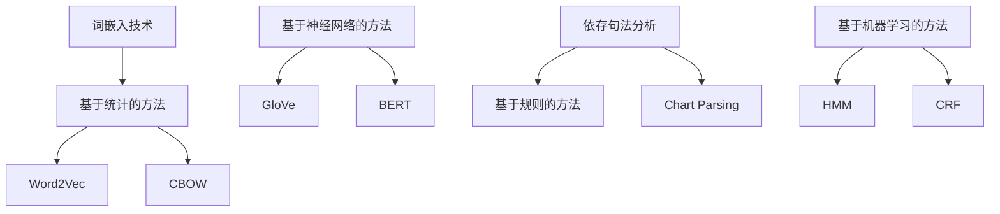
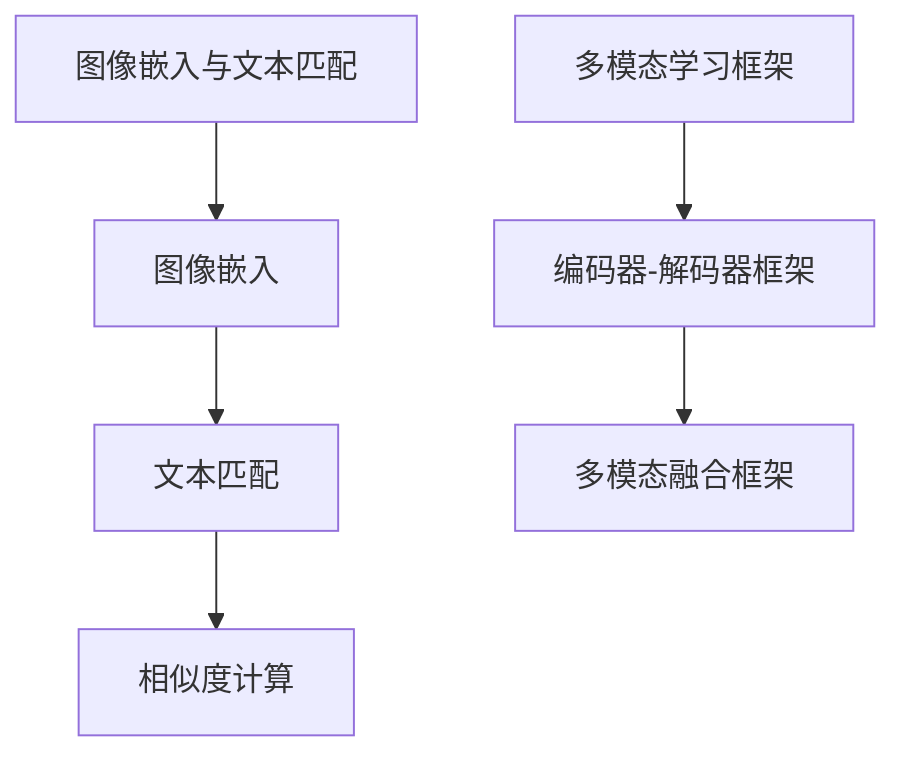
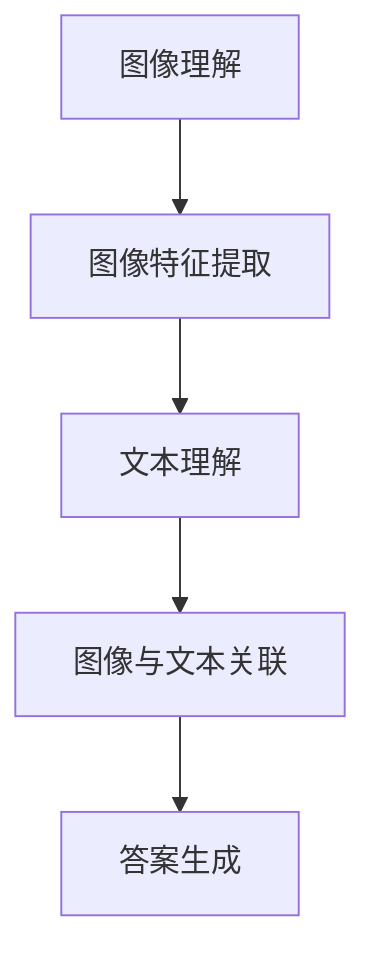

                 

### 文章标题

《AIGC时代的语言模型与提示词协同设计》

关键词：AIGC、语言模型、提示词、协同设计、文本生成、问答系统

摘要：随着人工智能技术的飞速发展，AIGC（AI-Generated Content）时代正逐渐成为主流。本文将深入探讨AIGC时代中语言模型与提示词的协同设计，分析其背景、核心概念、应用实例以及未来发展趋势。通过逐步分析推理，本文旨在为读者提供一个全面、系统的理解框架，帮助其在实际应用中取得更好的效果。

### 第一部分：AIGC时代概述

#### 第1章：AIGC时代背景与未来趋势

##### 1.1 AIGC的定义与核心特性

AIGC（AI-Generated Content），即人工智能生成内容，指的是利用人工智能技术自动生成文本、图像、视频等多种类型的内容。与传统的手动创作相比，AIGC具有高度自动化、个性化、高效化和低成本等特性。

**核心特性**：

1. **自动化**：AIGC通过预训练的语言模型和深度学习算法，可以实现内容的自动化生成，减少人工干预。
2. **个性化**：根据用户需求和场景，AIGC能够生成个性化的内容，提高用户体验。
3. **高效化**：AIGC在生成内容时，可以大幅提高生产效率，降低创作成本。
4. **低成本**：自动化生成内容的成本相对较低，尤其在大规模应用场景中，优势更加明显。

##### 1.2 AIGC的发展历程

AIGC的发展可以分为以下几个阶段：

1. **初识阶段**（2010年代初期）：深度学习技术取得突破，预训练语言模型开始出现。
2. **技术积累阶段**（2010年代中期至2010年代末期）：大量数据集和模型架构积累，技术逐渐趋于成熟。
3. **应用探索阶段**（2020年代初期）：AIGC在多个领域得到应用，如文本生成、图像生成、视频生成等。
4. **产业变革阶段**（2020年代中期至今）：AIGC技术逐渐成为主流，改变传统创作方式，引领产业变革。

##### 1.3 AIGC的技术架构

AIGC的技术架构主要包括以下几个关键组成部分：

1. **数据采集与预处理**：收集大量高质量的文本、图像、音频等数据，并进行数据预处理，如去噪、去重、分词、图像增强等。
2. **预训练语言模型**：使用大规模数据集对语言模型进行预训练，如GPT、BERT等。
3. **生成算法**：根据需求，利用预训练的语言模型生成文本、图像、视频等内容。
4. **多模态融合**：将文本、图像、音频等多模态数据进行融合，生成更加丰富、多样化的内容。
5. **应用层**：将生成的AIGC内容应用于各种实际场景，如文本生成、问答系统、图像生成等。

### Mermaid 流程图



### 第二部分：AIGC核心技术解读

#### 第2章：AIGC核心技术解读

##### 2.1 语言模型的原理与架构

##### 2.1.1 语言模型的基本概念

语言模型（Language Model）是一种用于预测下一个单词或字符的概率分布的统计模型。其核心目标是根据已知的文本序列，预测下一个单词或字符。

**核心概念**：

1. **词嵌入（Word Embedding）**：将单词映射到高维空间中的向量表示，以捕捉单词的语义信息。
2. **上下文（Context）**：语言模型需要考虑上下文信息，以预测下一个单词或字符。
3. **概率分布（Probability Distribution）**：语言模型输出一个概率分布，表示下一个单词或字符的可能性。

##### 2.1.2 语言模型的常见算法

1. **n-gram模型**：基于历史n个单词的统计信息，预测下一个单词。  
2. **神经网络模型**：使用神经网络对文本序列进行建模，如RNN、LSTM、GRU等。
3. **深度学习模型**：基于大规模数据集，使用深度神经网络进行预训练，如GPT、BERT等。

##### 2.1.3 语言模型的优化策略

1. **数据增强**：通过增加训练数据、数据清洗、数据变换等方式，提高模型的泛化能力。
2. **正则化**：使用正则化技术，防止模型过拟合。
3. **超参数调优**：通过调整学习率、批量大小、正则化参数等超参数，优化模型性能。

##### 2.2 提示词设计的理论与实践

##### 2.2.1 提示词的定义与分类

提示词（Prompt）是指导语言模型生成内容的输入信息，用于指定生成任务的类型、主题、风格等。

**定义**：提示词是指导语言模型生成内容的输入信息，通常包括任务描述、关键词、上下文等信息。

**分类**：

1. **静态提示词**：固定的、不变的提示词，适用于通用任务。
2. **动态提示词**：根据具体任务和上下文动态生成的提示词，提高生成内容的个性化程度。

##### 2.2.2 提示词的生成方法

1. **基于规则的方法**：根据任务需求，设计特定的规则生成提示词。
2. **基于机器学习的方法**：使用预训练的语言模型，根据输入文本生成提示词。

##### 2.2.3 提示词对模型效果的影响

提示词对模型效果有重要影响，具体体现在：

1. **生成质量**：合理的提示词可以提高生成内容的准确性和连贯性。
2. **泛化能力**：丰富的提示词可以增强模型的泛化能力，应对不同的生成任务。
3. **计算效率**：简短的提示词可以降低模型计算复杂度，提高生成速度。

### Mermaid 流程图



### 第三部分：AIGC在语言处理中的应用

#### 第3章：AIGC在语言处理中的应用

##### 3.1 文本生成与摘要

##### 3.1.1 自动摘要技术

自动摘要技术（Automatic Summarization）是指利用自然语言处理技术，从原始文本中自动提取关键信息，生成摘要文本。其核心目的是简化阅读内容，提高信息获取效率。

**基本原理**：

1. **抽取式摘要**：从原始文本中抽取关键句子或段落，形成摘要。
2. **生成式摘要**：利用生成式模型，生成新的摘要文本。

**应用场景**：

1. **新闻摘要**：自动生成新闻摘要，提高信息传播效率。
2. **文档摘要**：自动摘要文档内容，方便用户快速了解文档主旨。

##### 3.1.2 文本生成模型

文本生成模型（Text Generation Model）是一种用于生成自然语言文本的模型。其核心目标是根据输入的文本或提示词，生成具有可读性和连贯性的文本。

**常见模型**：

1. **生成式模型**：如GPT、BERT等。
2. **抽取式模型**：如Seq2Seq、Transformer等。

**应用场景**：

1. **问答系统**：生成回答文本，提供智能客服服务。
2. **文本创作**：自动生成文章、新闻、小说等。

### Mermaid 流�程图



##### 3.2 问答系统与对话生成

##### 3.2.1 问答系统的基本架构

问答系统（Question Answering System）是一种自动回答用户问题的系统。其基本架构包括以下几个关键组成部分：

1. **问题理解**：将用户问题转化为模型可理解的输入格式。
2. **答案检索**：从大规模文本数据中检索出与问题相关的答案。
3. **答案生成**：根据检索结果，生成具有可读性和连贯性的答案。

**常见算法**：

1. **基于规则的算法**：使用预定义的规则，将问题映射到答案。
2. **基于机器学习的算法**：使用预训练的语言模型，进行问答任务。

**应用场景**：

1. **智能客服**：自动回答用户咨询，提供高效服务。
2. **教育辅导**：自动回答学生问题，提供学习支持。

##### 3.2.2 对话系统的设计与实现

对话系统（Dialogue System）是一种能够与用户进行自然语言交互的系统。其核心目标是实现人机对话，提供个性化的服务。

**基本架构**：

1. **对话管理**：管理对话流程，包括会话状态、上下文信息等。
2. **自然语言理解**：理解用户输入的自然语言，提取意图和信息。
3. **自然语言生成**：生成自然语言回答，实现人机对话。

**常见算法**：

1. **基于规则的算法**：使用预定义的规则，生成对话回答。
2. **基于机器学习的算法**：使用预训练的语言模型，进行对话任务。

**应用场景**：

1. **智能助手**：与用户进行自然语言交互，提供个性化服务。
2. **智能客服**：与用户进行对话，解决用户问题。

### Mermaid 流程图



##### 3.3 自然语言理解与语义分析

##### 3.3.1 词嵌入技术

词嵌入（Word Embedding）是一种将单词映射到高维空间中的向量表示的方法，以捕捉单词的语义信息。其核心目的是将文本数据转化为向量形式，便于模型处理。

**常见方法**：

1. **基于统计的方法**：如Word2Vec、CBOW等。
2. **基于神经网络的方法**：如GloVe、BERT等。

**应用场景**：

1. **文本分类**：将文本转化为向量，进行分类任务。
2. **文本相似度计算**：计算文本之间的相似度，用于推荐、搜索等任务。

##### 3.3.2 依存句法分析

依存句法分析（Dependency Parsing）是一种分析句子中单词之间依存关系的自然语言处理技术。其核心目的是理解句子的结构，提取关键信息。

**常见算法**：

1. **基于规则的方法**：如LGP、 Chart Parsing等。
2. **基于机器学习的方法**：如HMM、CRF等。

**应用场景**：

1. **信息提取**：从文本中提取关键信息，如实体、关系等。
2. **语义理解**：理解句子的语义，进行语义分析。

### Mermaid 流程图



### 第四部分：AIGC在多模态任务中的应用

#### 第4章：AIGC在多模态任务中的应用

##### 4.1 文本与图像的融合

##### 4.1.1 图像嵌入与文本匹配

图像嵌入与文本匹配（Image Embedding and Text Matching）是将文本和图像转化为向量表示，并进行相似度计算的方法。其核心目的是将文本和图像语义进行融合，提高生成内容的多样性和准确性。

**基本原理**：

1. **图像嵌入**：将图像转化为向量表示，使用预训练的图像嵌入模型，如Inception、ResNet等。
2. **文本匹配**：将文本转化为向量表示，使用预训练的语言模型，如BERT、GPT等。
3. **相似度计算**：计算图像嵌入向量和文本嵌入向量之间的相似度，以衡量图像和文本的关联性。

**应用场景**：

1. **图像描述生成**：根据图像内容生成文本描述。
2. **文本分类**：将图像和文本进行融合，进行文本分类任务。

##### 4.1.2 多模态学习框架

多模态学习框架（Multimodal Learning Framework）是一种将文本、图像、音频等多种模态数据进行融合，生成统一表示的方法。其核心目的是提高模型对多模态数据的处理能力，实现多种模态任务的协同优化。

**常见框架**：

1. **编码器-解码器框架**：将不同模态的数据编码为统一表示，然后解码生成目标模态数据。
2. **多模态融合框架**：将不同模态的数据进行融合，生成多模态特征表示。

**应用场景**：

1. **多模态问答系统**：结合文本和图像信息，提供更准确的答案。
2. **多模态推荐系统**：根据用户文本评论和图像内容，推荐相关商品。

### Mermaid 流程图



##### 4.2 视觉问答系统

##### 4.2.1 视觉问答的挑战与解决方案

视觉问答系统（Visual Question Answering, VQA）是一种结合图像和文本问题的系统，其目标是回答用户关于图像的问题。视觉问答系统面临的主要挑战包括：

1. **图像理解**：从图像中提取有用的信息，理解图像内容。
2. **文本理解**：理解文本问题的语义，提取关键信息。
3. **图像与文本关联**：将图像和文本问题进行关联，找到合适的答案。

**解决方案**：

1. **多模态融合**：将图像和文本信息进行融合，生成多模态特征表示。
2. **预训练模型**：使用预训练的语言模型和图像嵌入模型，提高图像和文本理解能力。
3. **迁移学习**：利用大规模预训练模型，进行迁移学习，适应特定任务。

**应用场景**：

1. **智能教育**：通过图像和文本问题，帮助学生理解和掌握知识。
2. **智能搜索**：根据图像和文本问题，搜索相关图片和信息。

##### 4.2.2 视觉问答系统实例

**实例**：用户输入文本问题“图片中有多少个篮球？”和图片，视觉问答系统需要从图片中找出篮球，并给出数量。

**流程**：

1. **图像理解**：使用预训练的图像嵌入模型，提取图像特征。
2. **文本理解**：使用预训练的语言模型，提取文本特征。
3. **图像与文本关联**：计算图像特征和文本特征之间的相似度，找到相关区域。
4. **答案生成**：根据关联结果，生成答案。

### Mermaid 流程图



### 第五部分：AIGC时代的提示词协同设计实践

#### 第5章：AIGC时代的提示词协同设计实践

##### 5.1 提示词设计原则

提示词设计是AIGC应用中的一个关键环节，合理的提示词设计能够显著提高生成内容的质量和效果。以下是提示词设计的一些关键原则：

1. **明确任务目标**：明确生成任务的目标和要求，确保提示词能够准确传达任务意图。
2. **简洁明了**：提示词应简洁明了，避免冗长和复杂的描述，以降低模型的解析难度。
3. **具体性**：提示词应具体、精确，避免模糊和泛泛而谈的描述，以指导模型生成更具体的内容。
4. **上下文关联**：提示词应与上下文紧密关联，确保生成的文本或图像与上下文内容相匹配。
5. **多样性**：提示词应具有多样性，以适应不同场景和任务需求，提高生成内容的丰富度。

##### 5.1.1 提示词设计的关键要素

提示词设计的关键要素包括：

1. **任务描述**：清晰描述任务目标、场景和需求，确保模型理解任务意图。
2. **关键词**：选取与任务相关的关键词，帮助模型捕捉关键信息。
3. **上下文信息**：提供与任务相关的上下文信息，如背景、相关数据等，以丰富模型输入。
4. **生成要求**：明确生成内容的格式、风格、长度等要求，指导模型生成符合预期的内容。

##### 5.1.2 提示词的优化策略

提示词的优化策略主要包括：

1. **数据增强**：通过增加训练数据、数据变换等方式，丰富提示词的数据来源，提高模型泛化能力。
2. **上下文扩展**：在提示词中增加上下文信息，帮助模型更好地理解任务需求。
3. **多模态融合**：将文本、图像、音频等多模态信息融入提示词中，提高模型对多模态数据的理解能力。
4. **反馈调整**：根据模型生成的结果，不断调整和优化提示词，提高生成内容的质量。

##### 5.2 提示词协同设计案例

以下是一些具体的提示词协同设计案例，以展示如何在实际应用中优化提示词设计：

**案例一：文本生成与摘要**

**任务描述**：生成一篇关于人工智能技术的摘要，内容应包括人工智能的发展历程、核心技术和未来趋势。

**关键词**：人工智能、发展历程、核心技术、未来趋势

**上下文信息**：人工智能是一种模拟人类智能的技术，自20世纪50年代诞生以来，经历了多个发展阶段。当前，人工智能技术已经取得显著突破，包括深度学习、自然语言处理、计算机视觉等。未来，人工智能将继续快速发展，推动社会变革。

**生成要求**：摘要长度为200-300字，简洁明了，突出关键信息。

**提示词设计**：

- **任务描述**：“生成一篇关于人工智能技术的摘要，内容应包括人工智能的发展历程、核心技术和未来趋势。”
- **关键词**：“人工智能、发展历程、核心技术、未来趋势”
- **上下文信息**：“人工智能是一种模拟人类智能的技术，自20世纪50年代诞生以来，经历了多个发展阶段。当前，人工智能技术已经取得显著突破，包括深度学习、自然语言处理、计算机视觉等。未来，人工智能将继续快速发展，推动社会变革。”
- **生成要求**：“摘要长度为200-300字，简洁明了，突出关键信息。”

**案例二：问答系统与对话生成**

**任务描述**：根据用户输入的问题，生成合适的回答，并保持对话的连贯性。

**关键词**：问题、回答、对话、连贯性

**上下文信息**：用户输入问题：“人工智能有什么应用场景？”系统需要生成回答，并保持对话的连贯性。

**生成要求**：回答长度为100-150字，简洁明了，突出关键信息。

**提示词设计**：

- **任务描述**：“根据用户输入的问题，生成合适的回答，并保持对话的连贯性。”
- **关键词**：“问题、回答、对话、连贯性”
- **上下文信息**：“用户输入问题：‘人工智能有什么应用场景？’”
- **生成要求**：“回答长度为100-150字，简洁明了，突出关键信息。”

**案例三：多模态任务中的提示词设计**

**任务描述**：根据图像和用户输入的文本问题，生成合适的回答。

**关键词**：图像、文本、问题、回答

**上下文信息**：用户输入文本问题：“这个图片中的建筑是什么？”系统需要根据图像和文本问题生成回答。

**生成要求**：回答长度为100-150字，简洁明了，突出关键信息。

**提示词设计**：

- **任务描述**：“根据图像和用户输入的文本问题，生成合适的回答。”
- **关键词**：“图像、文本、问题、回答”
- **上下文信息**：“用户输入文本问题：‘这个图片中的建筑是什么？’”
- **生成要求**：“回答长度为100-150字，简洁明了，突出关键信息。”

### 第六部分：AIGC技术展望与挑战

#### 第6章：AIGC技术展望与挑战

##### 6.1 AIGC的发展趋势

AIGC技术正逐渐成为人工智能领域的一个热点，其发展趋势主要体现在以下几个方面：

1. **技术成熟度**：随着深度学习、自然语言处理等技术的不断发展，AIGC的技术成熟度不断提高，应用场景不断扩展。
2. **多模态融合**：多模态融合是AIGC的一个重要方向，未来将实现更加高效、准确的多模态内容生成。
3. **个性化定制**：AIGC技术将更加注重个性化定制，根据用户需求和场景，生成个性化的内容。
4. **产业应用**：AIGC技术将在更多产业中得到应用，如内容创作、教育、医疗、金融等。

##### 6.1.1 AIGC技术的未来方向

AIGC技术的未来方向主要包括：

1. **更高层次的智能化**：AIGC技术将朝着更高层次的智能化发展，实现更加复杂、多样化的内容生成。
2. **跨领域融合**：AIGC技术将与其他领域（如计算机视觉、语音识别、推荐系统等）进行融合，实现跨领域应用。
3. **实时性**：随着硬件性能的提升，AIGC技术的实时性将得到显著提高，为实时应用提供支持。
4. **伦理与法规**：随着AIGC技术的广泛应用，伦理和法规问题将得到更多关注，未来将制定相应的伦理规范和法律法规。

##### 6.1.2 技术创新与产业变革

AIGC技术的创新将带来产业变革，主要体现在以下几个方面：

1. **内容创作**：AIGC技术将改变传统的内容创作方式，实现更加高效、低成本的内容生成。
2. **教育**：AIGC技术将用于个性化教育，提供定制化的学习内容和辅导。
3. **医疗**：AIGC技术将用于医疗诊断、治疗方案制定等，提高医疗服务的质量和效率。
4. **金融**：AIGC技术将用于金融产品设计、风险评估等，提高金融市场的透明度和稳定性。

##### 6.2 AIGC面临的挑战

AIGC技术在发展过程中面临着一些挑战，主要包括：

1. **计算资源**：AIGC技术需要大量的计算资源，随着模型复杂度的增加，计算资源的需求将进一步提高。
2. **数据隐私**：AIGC技术需要处理大量用户数据，数据隐私问题成为重要的挑战。
3. **伦理问题**：AIGC技术可能引发伦理问题，如模型歧视、虚假信息传播等。
4. **模型可解释性**：AIGC技术生成的结果可能难以解释，影响用户对模型的可信度。

##### 6.2.1 模型复杂性与计算资源

随着AIGC技术的不断发展，模型的复杂度不断增加，这对计算资源提出了更高的要求。具体挑战包括：

1. **硬件需求**：高性能的硬件设备（如GPU、TPU等）成为必要条件，以支持大规模模型的训练和推理。
2. **能耗问题**：大规模的模型训练和推理过程消耗大量的能源，如何降低能耗成为重要问题。
3. **分布式计算**：通过分布式计算技术，将计算任务分布在多个节点上，提高计算效率和资源利用率。

##### 6.2.2 数据隐私与伦理问题

AIGC技术在处理大量用户数据时，面临数据隐私和伦理问题，主要包括：

1. **用户隐私保护**：如何保护用户的隐私信息，防止数据泄露和滥用，成为重要问题。
2. **数据伦理**：如何确保AIGC技术公平、公正、透明，避免歧视和偏见。
3. **法律法规**：如何制定相应的法律法规，规范AIGC技术的应用和发展。

##### 6.2.3 模型可解释性与可靠性

AIGC技术生成的结果可能难以解释，影响用户对模型的可信度，主要包括：

1. **模型可解释性**：如何提高模型的可解释性，帮助用户理解模型的工作原理和决策过程。
2. **模型可靠性**：如何确保AIGC技术生成的结果准确、可靠，避免错误和误导。

### 第七部分：附录

#### 第7章：附录

##### 7.1 开发环境搭建与工具使用

AIGC技术的开发需要一定的环境配置和工具支持，以下是一个基本的开发环境搭建步骤：

1. **硬件环境**：配置高性能的计算机，推荐使用GPU加速计算。
2. **操作系统**：推荐使用Linux或MacOS，以支持深度学习框架。
3. **深度学习框架**：安装常用的深度学习框架，如TensorFlow、PyTorch等。
4. **编程语言**：学习Python编程语言，掌握基本操作和常用库。

以下是一些常用的AIGC技术工具：

1. **预训练语言模型**：如GPT、BERT等，可通过开源库或在线服务获取。
2. **文本生成工具**：如T5、GPT-2等，可用于生成文本摘要、问答等。
3. **图像生成工具**：如DALL-E、StyleGAN等，可用于生成图像和视频。

##### 7.1.1 开发环境配置

以下是一个简单的开发环境配置步骤：

1. **安装操作系统**：选择Linux或MacOS，安装操作系统。
2. **安装深度学习框架**：使用pip命令，安装TensorFlow或PyTorch。
   ```bash
   pip install tensorflow
   # 或
   pip install torch torchvision
   ```
3. **安装Python库**：安装常用的Python库，如NumPy、Pandas、Matplotlib等。
   ```bash
   pip install numpy pandas matplotlib
   ```
4. **配置GPU支持**：确保深度学习框架支持GPU加速，设置相应的环境变量。
   ```bash
   export CUDA_VISIBLE_DEVICES=0
   ```

##### 7.1.2 语言模型与提示词设计工具

以下是一些常用的语言模型和提示词设计工具：

1. **预训练语言模型**：如GPT、BERT等，可通过开源库或在线服务获取。
2. **文本生成工具**：如T5、GPT-2等，可用于生成文本摘要、问答等。
3. **图像生成工具**：如DALL-E、StyleGAN等，可用于生成图像和视频。

以下是一个简单的示例代码，展示如何使用GPT-2生成文本摘要：

```python
import transformers
import torch

# 加载预训练的GPT-2模型
model = transformers.GPT2LMHeadModel.from_pretrained("gpt2")

# 准备输入文本
input_text = "本文介绍了AIGC时代的语言模型与提示词协同设计，包括AIGC概述、核心概念、应用实例等。"

# 生成文本摘要
output = model.generate(torch.tensor([input_text]).to("cuda"))

# 输出文本摘要
print(output[0].decode("utf-8"))
```

##### 7.2 相关资源与拓展阅读

以下是一些与AIGC技术相关的资源，供读者进一步学习和了解：

1. **论文和报告**：
   - "A Survey on AI-Generated Content: Challenges and Opportunities"（2021）
   - "The Annotated Transformer"（2018）
   - "BERT: Pre-training of Deep Bidirectional Transformers for Language Understanding"（2018）
2. **开源代码和工具**：
   - Hugging Face Transformers：https://huggingface.co/transformers
   - TensorFlow：https://www.tensorflow.org
   - PyTorch：https://pytorch.org
3. **在线课程和教程**：
   - "深度学习基础教程"（吴恩达，2016）
   - "自然语言处理入门"（林轩田，2018）
   - "计算机视觉基础"（汤晓鸥，2017）

### 作者信息

作者：AI天才研究院/AI Genius Institute & 禅与计算机程序设计艺术 /Zen And The Art of Computer Programming

本文旨在为读者提供一个全面、系统的AIGC技术解读，帮助其在实际应用中取得更好的效果。文章涵盖了AIGC时代的背景、核心概念、应用实例、提示词设计、多模态任务、未来趋势与挑战等内容。希望本文能够为读者在AIGC领域的研究与应用提供有益的参考。

