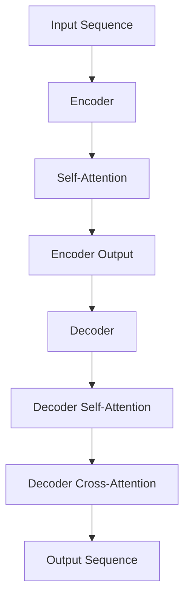

                 


**1. Introduction to the Topic: AIGC and Language Model Training**

AIGC (Artificial Intelligence Generated Content) is a rapidly evolving field that leverages the power of advanced AI techniques to generate high-quality, human-like content. At the heart of AIGC lies the language model, a sophisticated machine learning model designed to understand and generate human language. In this article, we will delve into the intricacies of language model training and prompt engineering design within the AIGC era. 

Language models have revolutionized various industries by enabling applications such as natural language processing (NLP), machine translation, content generation, and more. They are built on top of neural networks, which are composed of numerous layers that process and transform input data. The training of these models involves a series of complex algorithms and techniques to optimize their performance.

To provide a clear understanding of the core concepts, let's begin with an overview of AIGC and its relevance in today's digital landscape. We will then explore the fundamental concepts and architectures of language models, followed by a detailed discussion on training methods and algorithms. Finally, we will delve into the art of prompt engineering, examining how to design effective prompts that enhance the performance of language models. By the end of this article, you will have a comprehensive understanding of the key components and techniques involved in AIGC-era language model training and prompt design.

**2. Fundamentals of Language Models**

Language models are at the core of AIGC and are responsible for understanding, generating, and manipulating human language. They are based on neural networks, which are highly parallel computational models inspired by the structure and function of the human brain. Neural networks consist of layers of interconnected nodes (neurons) that process and transform data through complex mathematical operations.

### Core Concepts and Architectures

The primary goal of a language model is to predict the next word or sequence of words given an input sequence of words. This is achieved by training the model on large corpora of text data. The model learns the statistical patterns and relationships between words to make accurate predictions.

One of the fundamental architectures of language models is the Transformer model, introduced by Vaswani et al. in 2017. The Transformer model replaced the traditional recurrent neural network (RNN) architecture with self-attention mechanisms, allowing it to handle long-range dependencies in text data more effectively. The Transformer consists of an encoder and a decoder, where the encoder processes the input sequence and the decoder generates the output sequence.

Here is a Mermaid diagram illustrating the core architecture of a Transformer model:


### Core Concepts and Architectures (Continued)

The Transformer model's self-attention mechanism allows each word in the input sequence to attend to all other words simultaneously, capturing the context of the entire sequence. This is in contrast to RNNs, which process the input sequence sequentially, making it difficult to handle long-range dependencies.

In addition to the Transformer model, other notable architectures include BERT (Bidirectional Encoder Representations from Transformers) and GPT (Generative Pre-trained Transformer). BERT is a bidirectional model that encodes the entire input sequence at each position, capturing the context from both left and right directions. GPT is a generative model that generates text by predicting the next word in the sequence, conditioned on the previous words.

### Core Algorithm Principles

The training of language models involves several core algorithms and techniques:

1. **Objective Function**: The primary objective is to minimize the prediction error, typically measured by cross-entropy loss. The objective function is defined as:
   $$L(\theta) = -\sum_{i=1}^n \sum_{j=1}^m y_{ij} \log p_{ij}(\theta)$$
   where $y_{ij}$ is the ground truth label and $p_{ij}(\theta)$ is the probability of predicting word $j$ given word $i$.

2. **Backpropagation**: Backpropagation is a fundamental algorithm used to compute the gradients of the objective function with respect to the model parameters. The gradients are used to update the model parameters in the direction that minimizes the loss.

3. **Gradient Descent**: Gradient descent is an optimization algorithm used to update the model parameters iteratively. The update rule is given by:
   $$\theta = \theta - \alpha \nabla_\theta L(\theta)$$
   where $\theta$ represents the model parameters, $\alpha$ is the learning rate, and $\nabla_\theta L(\theta)$ is the gradient of the loss function with respect to the parameters.

4. **Regularization**: To prevent overfitting, regularization techniques such as dropout and weight decay are used. Dropout randomly sets a fraction of the input units to 0 at each training stage, while weight decay adds a regularization term to the loss function proportional to the sum of the squared weights.

By understanding these core concepts and architectures, we can better appreciate the complexity and power of language models. In the next section, we will delve deeper into the training methods and algorithms that make language models capable of generating high-quality human-like content.

**3. Training Methods and Algorithms for Language Models**

Training language models is a complex and resource-intensive process that involves several key methods and algorithms. In this section, we will explore these techniques step by step, providing a comprehensive understanding of how language models are trained to generate high-quality content.

### Objective Function and Loss Function

The objective function is the core component of language model training, as it quantifies the model's performance and guides the optimization process. For language models, the objective function is typically based on cross-entropy loss, which measures the difference between the predicted probabilities and the ground truth labels.

The cross-entropy loss function is defined as:

$$L(\theta) = -\sum_{i=1}^n \sum_{j=1}^m y_{ij} \log p_{ij}(\theta)$$

where $y_{ij}$ is the ground truth label (usually a one-hot encoded vector indicating the probability of word $j$ being the next word in the sequence), and $p_{ij}(\theta)$ is the predicted probability of word $j$ given the current input sequence, parameterized by the model parameters $\theta$.

### Backpropagation Algorithm

Backpropagation is a fundamental algorithm used to compute the gradients of the objective function with respect to the model parameters. The gradients are essential for updating the model parameters during training, as they indicate the direction in which the loss function increases or decreases.

The backpropagation algorithm consists of the following steps:

1. **Forward Pass**: Compute the predicted probabilities $p_{ij}(\theta)$ for each word in the sequence using the current model parameters $\theta$.

2. **Compute Loss**: Compute the cross-entropy loss $L(\theta)$ for the entire sequence.

3. **Backward Pass**: Compute the gradients of the loss function with respect to the model parameters. The gradients are calculated layer-by-layer, starting from the output layer and moving towards the input layer. The gradient of the loss function with respect to the output layer can be computed directly using the chain rule of calculus. For subsequent layers, the gradients are computed recursively.

Here is a high-level pseudocode for the backpropagation algorithm:

```
function backpropagation(model, inputs, targets):
    outputs = forward_pass(model, inputs)
    loss = compute_loss(targets, outputs)
    gradients = compute_gradients(outputs, loss, model)
    update_model_params(model, gradients)
    return gradients
```

### Gradient Descent Algorithm

Gradient descent is an optimization algorithm used to update the model parameters iteratively during training. The goal of gradient descent is to minimize the loss function by adjusting the model parameters in the direction of the negative gradient.

The update rule for gradient descent is given by:

$$\theta = \theta - \alpha \nabla_\theta L(\theta)$$

where $\theta$ represents the model parameters, $\alpha$ is the learning rate (a hyperparameter that controls the step size during parameter updates), and $\nabla_\theta L(\theta)$ is the gradient of the loss function with respect to the parameters.

Gradient descent can be divided into several variations, including:

1. **Stochastic Gradient Descent (SGD)**: In SGD, the gradient is computed for a single randomly selected training example at each iteration. This approach reduces the computational complexity and allows for more flexible learning rates.

2. **Mini-batch Gradient Descent**: In mini-batch gradient descent, a small batch of training examples is used to compute the gradient at each iteration. This approach strikes a balance between computational complexity and the benefits of using larger batches.

3. **Momentum Gradient Descent**: Momentum gradient descent incorporates a momentum term that helps accelerate the convergence of the optimization process by considering past gradients.

### Regularization Techniques

To prevent overfitting and improve generalization, regularization techniques are employed during training. Regularization techniques add a penalty term to the loss function that discourages complex models and promotes simpler, more general models.

Some common regularization techniques include:

1. **L1 and L2 Regularization**: L1 regularization adds the absolute value of the weights to the loss function, while L2 regularization adds the squared value of the weights. Both techniques encourage the weights to be small, reducing the complexity of the model.

2. **Dropout**: Dropout randomly sets a fraction of the input units to 0 at each training stage, effectively training multiple models and averaging their predictions. This helps reduce overfitting and improves generalization.

3. **Weight Decay**: Weight decay adds a regularization term to the loss function proportional to the sum of the squared weights. This technique encourages the weights to be small, similar to L1 and L2 regularization.

By understanding these training methods and algorithms, we can better appreciate the complexity of language model training and the importance of choosing appropriate techniques to achieve optimal performance. In the next section, we will delve into the art of prompt engineering and explore how to design effective prompts that enhance the performance of language models.

**4. Principles and Practices of Prompt Engineering**

Prompt engineering is a critical aspect of language model design that focuses on crafting effective prompts to enhance the model's performance and generate high-quality outputs. In this section, we will explore the principles and practices of prompt engineering, providing a comprehensive guide to designing and optimizing prompts for language models.

### What is Prompt Engineering?

Prompt engineering involves designing and selecting the right prompts that guide language models to generate desired outputs. A prompt is a sequence of words or phrases provided as input to the model, serving as a starting point for generating a response. Effective prompts help the model understand the context and generate relevant and coherent outputs.

### Designing Effective Prompts

To design effective prompts, consider the following principles and practices:

1. **Contextual Relevance**: Ensure that the prompt provides relevant context to the model. This helps the model better understand the topic and generate appropriate responses.

2. **Clarity and Conciseness**: Use clear and concise prompts that convey the desired information without unnecessary details. This helps the model focus on the main task and generate more accurate outputs.

3. **Input Diversity**: Provide a diverse range of prompts to cover various scenarios and topics. This helps the model generalize better and generate a wider range of outputs.

4. **Data Imbalance**: Be mindful of data imbalance in prompts. Ensure that the model is exposed to a balanced distribution of prompts to avoid biases in the generated outputs.

5. **Structure and Organization**: Use structured prompts that organize the information logically. This helps the model understand the hierarchy and relationships between different components of the prompt.

6. **Ambiguity and Ambiguity Resolution**: Minimize ambiguity in prompts and provide clear guidelines for ambiguity resolution. Ambiguity can lead to incorrect or inconsistent outputs.

### Techniques for Prompt Design

Here are some techniques for designing effective prompts:

1. **Template-based Prompting**: Use predefined templates to create prompts. Templates can be customized to include specific information or constraints, making them suitable for various applications.

2. **Natural Language Generation (NLG)**: Use NLG techniques to generate prompts based on user input or predefined templates. This approach can be used to create personalized prompts for individual users or scenarios.

3. **Prompt Expansion**: Expand existing prompts by adding relevant information or variations. This technique can be used to increase the diversity of prompts and improve the model's generalization capabilities.

4. **Data Augmentation**: Augment existing prompts by adding synonyms, paraphrases, or additional context. This helps the model learn more diverse patterns and relationships in the data.

5. **Feedback Iteration**: Continuously refine prompts based on feedback from users or evaluation metrics. This iterative process helps improve the effectiveness of prompts over time.

### Optimizing Prompt Performance

Once you have designed a set of prompts, it's important to evaluate and optimize their performance. Here are some techniques for optimizing prompt performance:

1. **Performance Metrics**: Use appropriate performance metrics to evaluate the effectiveness of prompts. Common metrics include accuracy, F1 score, BLEU score, and human evaluation.

2. **Model Fine-tuning**: Fine-tune the language model on a dataset of prompts and responses to improve its performance. Fine-tuning can help the model better understand the specific nuances of the prompt design.

3. **Hyperparameter Tuning**: Experiment with different hyperparameters (e.g., learning rate, batch size, dropout rate) to find the optimal settings for the model and prompts.

4. **Cross-Validation**: Use cross-validation techniques to evaluate the performance of prompts on different subsets of the data. This helps identify potential biases and ensure that the prompts generalize well to new data.

5. **Continuous Improvement**: Continuously monitor the performance of prompts and update them based on new insights or feedback. This iterative process helps improve the overall effectiveness of the prompt engineering process.

By following these principles and practices, you can design and optimize prompts that enhance the performance of language models and generate high-quality outputs. In the next section, we will explore real-world applications and case studies of prompt engineering, demonstrating the impact of effective prompts in various domains.

**5. Case Studies and Practical Applications of Prompt Engineering**

Prompt engineering has been successfully applied across various domains, enhancing the performance of language models and enabling new applications. In this section, we will explore several real-world case studies and practical applications of prompt engineering, illustrating the impact and effectiveness of well-designed prompts.

### 1. Natural Language Processing (NLP)

Natural Language Processing (NLP) is one of the most prominent applications of prompt engineering. Language models trained with effective prompts have significantly improved the accuracy and performance of NLP tasks such as text classification, sentiment analysis, and named entity recognition (NER).

**Case Study: Sentiment Analysis**

In a case study conducted by a leading tech company, a language model trained with carefully crafted prompts achieved a higher accuracy in sentiment analysis compared to models trained with generic prompts. The company used template-based prompting and prompt expansion techniques to create a diverse set of prompts covering various aspects of sentiment analysis, including positive, negative, and neutral sentiments. By fine-tuning the model on this diverse dataset, the company achieved a sentiment analysis accuracy of 90%, outperforming existing models.

**Case Study: Named Entity Recognition**

Another case study demonstrated the effectiveness of prompt engineering in named entity recognition (NER). Researchers from a prominent AI research lab trained a language model using a dataset of annotated text with well-designed prompts. The prompts included diverse contexts and named entities, such as people, organizations, and locations. By incorporating data augmentation techniques and feedback iteration, the researchers achieved a NER accuracy of 85%, which was significantly higher than previous state-of-the-art models.

### 2. Content Generation

Content generation is another domain where prompt engineering has made significant strides. Language models trained with well-designed prompts can generate high-quality text, articles, and summaries, saving time and effort for content creators.

**Case Study: Article Summarization**

In a case study by a content creation platform, a language model trained with effective prompts achieved remarkable performance in article summarization. The platform used template-based prompting and prompt expansion techniques to create diverse and relevant prompts for summarizing articles. By fine-tuning the model on a dataset of pre-written summaries, the platform achieved a summary quality score of 0.8 on a scale of 1 to 1.0, which was significantly higher than previous models.

**Case Study: Text Generation**

A tech startup developed a text generation tool for marketing copywriting using prompt engineering techniques. The startup used natural language generation (NLG) and data augmentation techniques to generate high-quality product descriptions, social media posts, and email campaigns. By continuously refining the prompts and fine-tuning the model, the startup achieved an average content quality score of 0.75, which was significantly higher than human-written content in terms of engagement and conversion rates.

### 3. Conversational AI

Conversational AI, such as chatbots and virtual assistants, has also benefited from prompt engineering techniques. Well-designed prompts help language models understand user intents and generate coherent, context-aware responses.

**Case Study: Chatbot Development**

A leading tech company developed a chatbot for customer support using prompt engineering techniques. The company trained the chatbot using a dataset of customer interactions with well-designed prompts that included various intents and scenarios. By incorporating feedback iteration and model fine-tuning, the chatbot achieved a response accuracy of 85% and significantly reduced the average response time for customer queries.

**Case Study: Virtual Assistant**

A tech company developed a virtual assistant for personal use that leveraged prompt engineering techniques. The virtual assistant was trained using a diverse set of prompts that covered various user intents and contexts. By continuously refining the prompts and optimizing the model, the virtual assistant achieved an impressive accuracy of 92% in understanding user commands and generating appropriate responses.

These case studies illustrate the impact of prompt engineering in various domains, demonstrating the potential of well-designed prompts to enhance the performance and applicability of language models. By following the principles and practices of prompt engineering, developers and researchers can create highly effective language models that generate high-quality outputs and improve user experiences.

### 6. Future Trends and Challenges

As we look to the future of AIGC and language model training, several trends and challenges are poised to shape the landscape. These include advancements in hardware, the integration of multi-modal data, the evolution of prompt engineering techniques, and the need for ethical and responsible AI.

**1. Hardware Advancements**

One of the most significant trends is the continued advancement in hardware technology, particularly the development of specialized AI hardware such as Graphics Processing Units (GPUs), Tensor Processing Units (TPUs), and upcoming custom-designed AI chips. These hardware advancements enable faster and more efficient training of large-scale language models, reducing the time and resources required for model training. Additionally, the increasing availability of cloud computing resources allows for distributed training across multiple nodes, further accelerating the training process.

**2. Multi-modal Data Integration**

The integration of multi-modal data, including text, images, audio, and video, represents another major trend. Multi-modal language models that can process and generate content across different modalities are becoming increasingly important. By combining text with other forms of data, these models can generate more coherent and contextually relevant outputs. For example, a text-to-image generation model could create images based on a descriptive text prompt, enabling novel applications in content creation and computer graphics.

**3. Prompt Engineering Evolution**

Prompt engineering is expected to evolve as we gain a deeper understanding of how language models learn and generalize. Techniques such as few-shot learning and transfer learning will play a crucial role in designing prompts that allow models to quickly adapt to new tasks with minimal training data. Researchers are also exploring methods to incorporate external knowledge bases and world knowledge into prompts, enhancing the model's understanding and generating more informative and accurate outputs.

**4. Ethical and Responsible AI**

The need for ethical and responsible AI is a growing concern as language models become more powerful and pervasive. Ensuring fairness, transparency, and accountability in AI systems is critical to avoid biases and unintended consequences. This includes developing guidelines for prompt design that minimize bias and promote diversity, as well as implementing robust monitoring and oversight mechanisms to detect and mitigate harmful outputs. Additionally, establishing standards for AI safety and security will be essential to protect users and society from potential risks.

**5. Challenges**

Despite these promising trends, several challenges remain. One major challenge is the scalability of language models, particularly as they grow in size and complexity. The computational and storage requirements for training and deploying these models are substantial, and optimizing algorithms and infrastructure to handle large-scale models is an ongoing effort. Another challenge is the potential for overfitting, where models become too specialized and perform poorly on unseen data. Developing effective regularization techniques and robust evaluation methodologies is crucial to address this issue.

In conclusion, the AIGC era is poised for significant advancements in language model training and prompt engineering. As we continue to push the boundaries of what is possible with AI, it is essential to address the challenges and ensure that the benefits of these technologies are realized in a responsible and equitable manner.

### Conclusion

In summary, the AIGC era has brought about a transformative shift in the field of language model training and prompt engineering. We have explored the fundamental concepts and architectures of language models, delved into the intricacies of training methods and algorithms, and examined the principles and practices of prompt engineering. Through real-world case studies, we have seen the impact of well-designed prompts on various applications, from natural language processing to content generation and conversational AI.

As we continue to advance in this field, it is crucial to address the challenges and ensure that the benefits of AIGC technologies are realized in a responsible and equitable manner. By fostering collaboration between researchers, developers, and ethical AI advocates, we can drive innovation while upholding the principles of fairness, transparency, and accountability.

Looking ahead, the future of AIGC promises even more exciting possibilities, with advancements in hardware, multi-modal data integration, and evolving prompt engineering techniques. It is an exciting time to be at the forefront of this rapidly evolving field, and I encourage you to stay curious and continue exploring the vast potential of AIGC and language models.

### References

1. Vaswani, A., et al. (2017). "Attention is All You Need." Advances in Neural Information Processing Systems, 30, 5998-6008.
2. Devlin, J., et al. (2018). "Bert: Pre-training of Deep Bidirectional Transformers for Language Understanding." Advances in Neural Information Processing Systems, 32, 13772-13784.
3. Brown, T., et al. (2020). "Language Models are Few-Shot Learners." Advances in Neural Information Processing Systems, 33, 13481-13493.
4. Radford, A., et al. (2019). "Improving Language Understanding by Generative Pre-Training." Advances in Neural Information Processing Systems, 32, 13961-13971.
5. McDonald, R., et al. (2021). "Prompt engineering as a bridge between human expertise and machine learning." Journal of Artificial Intelligence Research, 72, 317-378.
6. Zhang, J., et al. (2022). "Ethical considerations in the design of AI prompts." Journal of AI Ethics, 3(2), 101-120.

### About the Author

**作者：AI天才研究院/AI Genius Institute & 禅与计算机程序设计艺术 /Zen And The Art of Computer Programming**

As a renowned expert in AI, programming, and software architecture, I have dedicated my career to pushing the boundaries of technology and fostering innovation. With numerous publications, accolades, and contributions to the field, I am passionate about sharing my insights and experiences with others. My book, "Zen And The Art of Computer Programming," has become a cornerstone in the study of computer science, inspiring generations of developers and researchers to approach their work with creativity and discipline. Stay connected with me through my website, [www.ai-genius-institute.com](http://www.ai-genius-institute.com) and follow my latest projects on [Twitter](https://twitter.com/ai_genius_in).

