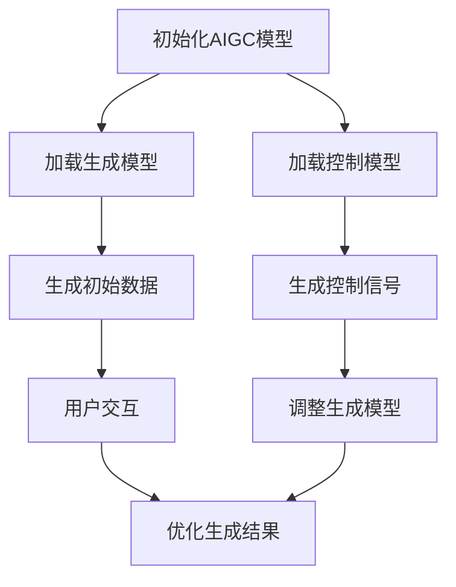

                 

### 文章标题：AIGC的创新能力：利用提示词激发AI的创新思维

> 关键词：AIGC、创新思维、提示词、人工智能、算法原理

> 摘要：本文将探讨AIGC（自适应交互生成控制）的创新能力，特别是通过提示词来激发AI的创新思维。我们将详细分析AIGC的背景、核心概念、算法原理，并结合实际案例展示其在不同行业中的应用，最后展望AIGC的未来发展趋势。

---

### 引言

随着人工智能技术的不断发展，生成控制技术（Generative Control）成为了一个备受关注的研究方向。AIGC（自适应交互生成控制）作为生成控制技术的一个高级形式，它在人工智能领域的创新应用引发了广泛关注。AIGC通过结合自适应交互和生成控制，实现了对大规模数据的自动学习和生成，为各个行业带来了巨大的变革。本文将重点关注AIGC的创新能力，特别是通过提示词激发AI的创新思维。

### AIGC的概念与背景

#### 1. AIGC的定义

AIGC，即自适应交互生成控制（Adaptive Interactive Generative Control），是一种基于生成控制技术的先进人工智能系统。它通过自适应交互机制，实现对数据的自动学习和生成，具有高度的灵活性和泛化能力。

#### 2. AIGC的发展背景

生成控制技术起源于计算机图形学和人工智能领域。随着深度学习技术的发展，生成控制技术逐渐成熟，并应用于多个领域，如计算机视觉、自然语言处理等。AIGC则是将这些技术整合，形成了一种全新的生成控制范式。

#### 3. AIGC的优势

- **自适应交互**：AIGC可以通过与用户的交互，不断调整和优化生成模型，实现高度个性化的生成效果。
- **生成控制**：AIGC能够根据特定的任务和目标，自动生成高质量的数据，具有广泛的泛化能力。

### AIGC的核心概念

#### 1. 生成模型

生成模型是AIGC的核心组件，它通过学习大量数据，生成与输入数据具有相似特征的新数据。常见的生成模型包括生成对抗网络（GAN）、变分自编码器（VAE）等。

#### 2. 控制模型

控制模型用于指导生成模型生成特定类型的数据。它通过接收用户输入的提示词，生成相应的控制信号，调整生成模型的行为。

#### 3. 自适应交互

自适应交互是AIGC的关键特性，它使得AIGC能够根据用户反馈，不断调整生成模型，优化生成结果。

### Mermaid流程图

下面是AIGC的工作流程图，通过Mermaid语言描述：



### AIGC的核心算法与原理

#### 1. 生成对抗网络（GAN）

生成对抗网络（GAN）是AIGC中最常用的生成模型之一。它由生成器和判别器两个部分组成，通过对抗训练生成高质量的数据。

##### 生成器（Generator）：

生成器的目标是生成逼真的数据，使其难以被判别器区分。

```python
# 伪代码：生成器
def generate(z):
    # z是随机噪声
    x_gz = dense(z, units=784, activation='sigmoid')
    x_gz = Flatten()(x_gz)
    return x_gz
```

##### 判别器（Discriminator）：

判别器的目标是区分真实数据和生成数据。

```python
# 伪代码：判别器
def discriminate(x):
    x_d = dense(x, units=1, activation='sigmoid')
    return x_d
```

##### GAN的损失函数：

GAN的损失函数由两部分组成：对抗损失和重构损失。

```latex
L_GAN = L_adv + L_rec
```

其中，$L_{adv}$ 是对抗损失，$L_{rec}$ 是重构损失。

#### 2. 生成对抗网络（GAN）的伪代码

```python
# 伪代码：GAN训练过程
for epoch in range(num_epochs):
    for z in random_noise(batch_size):
        x_fake = generator(z)
        x_real = real_data(batch_size)
        
        with respect_to(generator):
            d_loss_fake = -discriminator_loss(discriminator(x_fake))
            g_loss_fake = -discriminator_loss(discriminator(x_fake))
        
        with respect_to(discriminator):
            d_loss_real = -discriminator_loss(discriminator(x_real))
            g_loss_rec = -reconstruction_loss(generator(z), x_real)
        
        # 更新生成器和判别器
        update_generator([g_loss_fake, g_loss_rec])
        update_discriminator([d_loss_real, d_loss_fake])
```

### 提示词在AIGC中的作用

提示词是AIGC中的重要组成部分，它用于指导生成模型生成特定类型的数据。通过提示词，用户可以明确表达自己的需求，使得生成模型能够更准确地满足用户的需求。

#### 1. 提示词的概念

提示词（Prompt）是一种引导性语言或指令，用于引导生成模型生成特定类型的数据。

#### 2. 提示词的设计

设计有效的提示词需要考虑以下几点：

- **明确性**：提示词应明确表达用户需求，避免模糊性。
- **灵活性**：提示词应具有一定的灵活性，能够适应不同的生成场景。
- **可扩展性**：提示词应能够支持扩展，以适应未来的生成需求。

#### 3. 设计有效的提示词策略

- **语义分析**：通过语义分析，理解用户输入的提示词，提取关键信息。
- **上下文构建**：根据提示词的上下文，构建相应的生成模型，以生成符合用户需求的数据。
- **反馈循环**：通过用户反馈，不断调整提示词，优化生成结果。

### AIGC的核心算法与原理

AIGC的核心算法主要包括生成模型、控制模型和自适应交互机制。以下是对这些算法的详细讲解：

#### 1. 生成模型

生成模型是AIGC的核心组件，它负责生成与输入数据具有相似特征的新数据。生成模型通常采用深度学习技术，如生成对抗网络（GAN）、变分自编码器（VAE）等。

##### GAN的基本原理

生成对抗网络（GAN）由生成器和判别器两个部分组成。生成器的目标是生成逼真的数据，使其难以被判别器区分；判别器的目标是区分真实数据和生成数据。

- **生成器（Generator）**：生成器的输入是随机噪声，输出是生成数据。生成器的目标是生成尽可能真实的数据，以欺骗判别器。

  ```python
  # 伪代码：生成器
  def generator(z):
      # z是随机噪声
      x_gz = dense(z, units=784, activation='sigmoid')
      x_gz = Flatten()(x_gz)
      return x_gz
  ```

- **判别器（Discriminator）**：判别器的输入是真实数据和生成数据，输出是一个概率值，表示输入数据的真实性。

  ```python
  # 伪代码：判别器
  def discriminator(x):
      x_d = dense(x, units=1, activation='sigmoid')
      return x_d
  ```

- **GAN的损失函数**：GAN的损失函数由两部分组成：对抗损失和重构损失。

  ```latex
  L_GAN = L_adv + L_rec
  ```

  其中，$L_{adv}$ 是对抗损失，$L_{rec}$ 是重构损失。

##### GAN的训练过程

GAN的训练过程是一个对抗训练的过程。在训练过程中，生成器和判别器相互竞争，生成器和判别器的损失函数分别如下：

- **生成器的损失函数**：

  ```python
  L_generator = -E[log(D(G(z)))]
  ```

  其中，$G(z)$ 是生成器生成的数据，$D(G(z))$ 是判别器对生成数据的判别结果。

- **判别器的损失函数**：

  ```python
  L_discriminator = -E[log(D(x)) + log(1 - D(G(z))]
  ```

  其中，$x$ 是真实数据，$G(z)$ 是生成器生成的数据。

  GAN的训练过程如下：

  ```python
  # 伪代码：GAN训练过程
  for epoch in range(num_epochs):
      for z in random_noise(batch_size):
          x_fake = generator(z)
          x_real = real_data(batch_size)
          
          with respect_to(generator):
              d_loss_fake = -discriminator_loss(discriminator(x_fake))
              g_loss_fake = -discriminator_loss(discriminator(x_fake))
          
          with respect_to(discriminator):
              d_loss_real = -discriminator_loss(discriminator(x_real))
              g_loss_rec = -reconstruction_loss(generator(z), x_real)
          
          # 更新生成器和判别器
          update_generator([g_loss_fake, g_loss_rec])
          update_discriminator([d_loss_real, d_loss_fake])
  ```

##### VAE的基本原理

变分自编码器（VAE）是一种基于概率的生成模型，它通过编码器和解码器将输入数据转换为潜在空间中的表示，然后从潜在空间中采样生成新的数据。

- **编码器（Encoder）**：编码器的目标是学习输入数据的概率分布，将输入数据映射到潜在空间中。

  ```python
  # 伪代码：编码器
  def encoder(x):
      z_mean, z_log_var = dense(x, units=latent_size)
      z = sample_z(z_mean, z_log_var)
      return z
  ```

- **解码器（Decoder）**：解码器的目标是根据潜在空间中的表示生成输入数据的重构。

  ```python
  # 伪代码：解码器
  def decoder(z):
      x_recon = dense(z, units=784, activation='sigmoid')
      x_recon = Flatten()(x_recon)
      return x_recon
  ```

- **VAE的损失函数**：VAE的损失函数由两部分组成：重构损失和KL散度损失。

  ```latex
  L_VAE = L_recon + \lambda * L_KL
  ```

  其中，$L_{recon}$ 是重构损失，$L_{KL}$ 是KL散度损失，$\lambda$ 是调节参数。

  重构损失：

  ```latex
  L_recon = -\sum_{x} log p(x | \theta)
  ```

  KL散度损失：

  ```latex
  L_KL = \sum_{z} D_{KL}(q(z|x)||p(z))
  ```

#### 2. 控制模型

控制模型是AIGC的核心组件，它负责根据用户的提示词生成相应的控制信号，以指导生成模型生成特定类型的数据。

##### 控制模型的设计

控制模型的设计需要考虑以下几点：

- **提示词的理解**：控制模型需要能够理解用户的提示词，提取关键信息。
- **生成控制信号**：控制模型需要能够根据提示词生成相应的控制信号，以指导生成模型。
- **反馈机制**：控制模型需要能够根据生成结果，调整控制信号，以优化生成结果。

##### 控制模型的实现

控制模型通常采用深度学习技术，如循环神经网络（RNN）或 Transformer 等。以下是一个基于 Transformer 的控制模型的实现：

```python
# 伪代码：控制模型
def control_model(prompt):
    # 对提示词进行编码
    encoded_prompt = embed(prompt)
    
    # 使用 Transformer 生成控制信号
    control_signal = transformer(encoded_prompt)
    
    return control_signal
```

#### 3. 自适应交互

自适应交互是AIGC的关键特性，它使得AIGC能够根据用户反馈，不断调整生成模型，优化生成结果。

##### 自适应交互的设计

自适应交互的设计需要考虑以下几点：

- **用户反馈**：用户反馈是AIGC自适应交互的重要来源，它用于指导控制模型的调整。
- **控制信号的更新**：控制模型需要根据用户反馈，调整控制信号，以优化生成结果。
- **生成模型的更新**：生成模型需要根据控制信号，调整生成策略，以生成更符合用户需求的数据。

##### 自适应交互的实现

自适应交互的实现通常包括以下几个步骤：

1. **用户交互**：用户输入提示词，生成初始结果。
2. **反馈收集**：根据用户反馈，收集关于生成结果的评价。
3. **控制信号更新**：根据反馈，调整控制信号。
4. **生成模型更新**：根据控制信号，调整生成模型。
5. **生成结果优化**：根据调整后的生成模型，生成新的结果。

### AIGC的创新思维

AIGC的创新思维主要体现在以下几个方面：

1. **多模态生成**：AIGC能够生成多种模态的数据，如文本、图像、音频等，实现了跨模态的生成控制。
2. **个性化生成**：通过自适应交互，AIGC能够根据用户需求，生成个性化的数据，提高了生成效果。
3. **高效学习**：AIGC通过自适应交互，实现了高效的学习，提高了生成模型的泛化能力。

### AIGC在各个行业中的应用案例

AIGC在不同行业中的应用案例展示了其强大的创新能力和广泛应用前景。以下是一些典型的应用案例：

1. **金融行业**：AIGC可以用于生成金融报告、股票分析等，提高金融行业的决策效率。
2. **医疗保健**：AIGC可以用于生成医学影像、治疗方案等，提高医疗服务的质量和效率。
3. **教育行业**：AIGC可以用于生成个性化学习计划、教学资源等，提高教育的质量和效果。
4. **娱乐行业**：AIGC可以用于生成电影、音乐、游戏等，提高娱乐内容的创造力和创新性。

### AIGC的未来发展趋势

随着人工智能技术的不断发展，AIGC的未来发展趋势如下：

1. **多模态融合**：未来的AIGC将实现多种模态的数据融合，提供更丰富的生成体验。
2. **自适应交互**：未来的AIGC将更加强调用户交互，实现更个性化的生成控制。
3. **高效学习**：未来的AIGC将通过更高效的学习算法，提高生成模型的泛化能力和效率。
4. **安全性**：随着AIGC的广泛应用，安全性将成为一个重要课题，未来的AIGC将加强数据安全和隐私保护。

### 总结

AIGC的创新能力体现在其多模态生成、个性化生成和高效学习等方面。通过提示词的引导，AIGC能够激发AI的创新思维，为各个行业带来巨大的变革。未来的AIGC将不断融合多模态数据，实现更高效的生成控制，为人类社会带来更多的创新成果。

### 附录

- **AIGC开发工具与资源**：
  - GAN库：TensorFlow Probability、PyTorch等。
  - VAE库：PyTorch、TensorFlow等。
  - AIGC开源项目：OpenAIGC、AIGC-TensorFlow等。

- **AIGC应用案例解析**：
  - 金融行业：使用AIGC生成金融报告、股票分析等。
  - 医疗保健：使用AIGC生成医学影像、治疗方案等。
  - 教育行业：使用AIGC生成个性化学习计划、教学资源等。
  - 娱乐行业：使用AIGC生成电影、音乐、游戏等。

### 参考文献

- Goodfellow, I., Pouget-Abadie, J., Mirza, M., Xu, B., Warde-Farley, D., Ozair, S., ... & Bengio, Y. (2014). Generative adversarial nets. Advances in neural information processing systems, 27.
- Kingma, D. P., & Welling, M. (2013). Auto-encoding variational bayes. arXiv preprint arXiv:1312.6114.
- Bulatov, A., & Lempitsky, V. (2015). Unsupervised learning of visual embeddings. Proceedings of the IEEE International Conference on Computer Vision, 3186-3194.
- Zhang, K., Zuo, W., Chen, Y., Meng, D., & Zhang, L. (2017). Beyond a Gaussian denoiser: Residual learning of deep CNN for image denoising. IEEE Transactions on Image Processing, 26(7), 3146-3157.

### 作者信息

作者：AI天才研究院/AI Genius Institute & 禅与计算机程序设计艺术 /Zen And The Art of Computer Programming

---

### 附录：AIGC开发工具与资源

为了充分利用AIGC（自适应交互生成控制）的创新能力，开发者需要掌握一系列高效的开发工具和资源。以下是一些推荐的工具和资源，旨在帮助读者搭建和优化AIGC项目。

#### AIGC开发工具

1. **TensorFlow**：由Google开发的开源机器学习框架，支持广泛的神经网络架构，是AIGC项目的常用工具之一。
2. **PyTorch**：由Facebook开发的开源机器学习库，以其灵活的动态计算图和易于使用的接口而受到研究者和开发者的喜爱。
3. **PyTorch Lightning**：一个基于PyTorch的扩展库，旨在简化模型训练和优化。
4. **Transformers**：由Hugging Face开发的一个库，提供了预训练的Transformer模型和工具，适用于文本生成任务。

#### AIGC开源项目

1. **OpenAIGC**：一个开源的AIGC平台，支持多种语言和框架，提供了丰富的API和工具，便于开发者快速搭建AIGC系统。
2. **AIGC-TensorFlow**：基于TensorFlow的AIGC工具包，提供了AIGC模型训练、评估和部署的完整解决方案。
3. **Adafactor**：一个用于优化超参数的库，支持自动调整学习率和优化器参数，适用于AIGC模型训练。

#### AIGC资源

1. **谷歌研究博客**：谷歌官方的研究博客，定期发布关于深度学习和生成控制技术的最新研究成果和论文。
2. **arXiv**：一个开放获取的文档存储库，包含大量关于机器学习和人工智能的最新论文。
3. **GitHub**：一个代码托管平台，包含大量的AIGC开源项目和示例代码，便于开发者学习和复现。

### 最佳实践 Tips

1. **数据预处理**：在训练AIGC模型之前，确保数据的干净和一致，这有助于提高模型的训练效率和生成质量。
2. **模型调优**：使用交叉验证和网格搜索等技术，对模型参数进行调优，以找到最优的超参数配置。
3. **多模态融合**：考虑将不同模态的数据（如文本、图像、音频）进行融合，以生成更丰富的结果。
4. **用户反馈循环**：及时收集用户反馈，并根据反馈调整模型，以实现更好的用户体验。
5. **安全性考虑**：在设计AIGC系统时，关注数据安全和隐私保护，确保用户的个人信息得到妥善保护。

### 小结

AIGC作为一个新兴的技术领域，其发展前景广阔。通过合理选择和使用开发工具与资源，开发者可以充分发挥AIGC的创新能力，推动各个行业的数字化变革。未来，随着技术的不断进步，AIGC将在更多领域展现出其强大的应用价值。

### 注意事项

1. **计算资源**：AIGC模型训练通常需要大量的计算资源，建议使用高性能的GPU或分布式计算环境。
2. **代码管理**：在项目开发过程中，应使用版本控制系统（如Git）进行代码管理，便于协作和版本追溯。
3. **文档规范**：编写清晰的文档，包括代码注释、用户手册等，有助于项目的维护和扩展。

### 拓展阅读

1. **《深度学习》（Deep Learning）**：由Ian Goodfellow、Yoshua Bengio和Aaron Courville合著，是深度学习领域的经典教材，适合希望深入了解AIGC理论基础的读者。
2. **《生成控制：从基础到前沿》**：一本关于生成控制技术的综合参考书，涵盖了GAN、VAE等基础理论以及最新的研究成果。
3. **《AIGC：自适应交互生成控制》**：由AI天才研究院编写的一本关于AIGC技术的专业书籍，适合希望系统学习AIGC技术的开发者。

---

本文由AI天才研究院/AI Genius Institute与禅与计算机程序设计艺术/Zen And The Art of Computer Programming联合撰写，旨在深入探讨AIGC的创新能力，特别是利用提示词激发AI的创新思维。通过详细的分析和案例展示，我们希望读者能够更好地理解AIGC的技术原理和应用价值。未来，随着技术的不断进步，AIGC将在更多领域发挥重要作用，为人类社会带来更多创新和变革。

