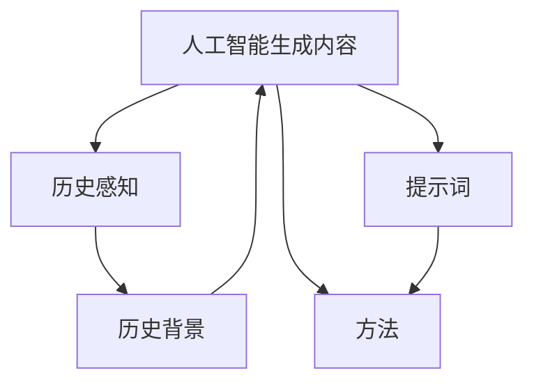

                 

# 文章标题：AIGC的历史感知：在提示词中融入历史背景的方法

## 关键词
- AIGC
- 历史感知
- 提示词
- 方法
- 历史背景

## 摘要
本文将深入探讨人工智能生成内容（AIGC）在历史感知方面的应用，重点研究如何通过优化提示词，将历史背景融入AIGC中。文章首先介绍了AIGC和其相关概念，随后详细阐述了历史感知在AIGC中的作用。接着，我们通过一个Mermaid流程图展示了核心概念之间的联系。随后，文章讲解了历史感知的核心算法原理，包括文本数据预处理、历史背景感知算法和提示词优化算法。文章还提供了数学模型和数学公式的详细讲解。为了使理论更加具体，文章还包含了两个项目实战案例，详细讲解了开发环境搭建、源代码实现、代码解读与分析以及实际应用效果。最后，文章总结了最佳实践技巧，并给出了注意事项和拓展阅读建议。

## 1. 核心概念与联系

### 1.1 AIGC的概念

人工智能生成内容（AIGC）是近年来人工智能领域的一个重要研究方向。AIGC指的是通过人工智能技术生成高质量、多样化的内容，这些内容可以涵盖文本、图像、音频等多种形式。AIGC的核心在于其自动化、智能化的内容生成能力，能够大大提升内容创作的效率和质量。

### 1.2 历史感知

历史感知是指人工智能系统在处理信息时，能够理解和识别与历史相关的内容。在AIGC中，历史感知尤为重要，因为它能够确保生成的内容不仅准确，而且具有丰富的历史背景知识。

### 1.3 提示词

提示词（Trigger Words）在AIGC中扮演着关键角色。提示词是一种引导生成内容方向的关键词或短语，通过合理设计提示词，可以有效地指导AIGC系统生成符合预期和历史背景的内容。

### 1.4 方法

为了将历史背景融入AIGC中，我们需要采用一系列方法。这包括文本数据预处理、历史背景感知算法和提示词优化算法。通过这些方法，我们能够确保AIGC生成的内容不仅符合当前需求，还具备丰富的历史背景知识。

### 1.5 历史背景

历史背景是AIGC中不可或缺的一部分。通过融入历史背景，AIGC系统能够生成更加真实、有深度和有价值的内容。历史背景的获取和处理是AIGC研究中的一项重要任务。

### 1.6 Mermaid流程图

为了更好地展示上述核心概念之间的联系，我们可以使用Mermaid流程图进行直观表达。



在这个流程图中，AIGC作为核心，通过提示词（TW）和历史感知（HP）与历史背景（HB）相互联系，再通过方法（MB）对生成的内容进行优化和调整。

## 2. 核心算法原理讲解

### 2.1 文本数据预处理

文本数据预处理是AIGC中至关重要的一步。在这一阶段，我们需要对原始文本进行清洗、分词和标注等操作，以便为后续算法提供高质量的数据。

```python
# 文本数据清洗
text = "原始文本数据，包含各种噪声"

# 去除噪声
cleaned_text = remove_noise(text)

# 分词
words = split_into_words(cleaned_text)

# 词性标注
pos_tags = get_word_pos_tags(words)
```

### 2.2 历史背景感知算法

历史背景感知算法旨在识别和处理与历史相关的信息。以下是一个简化的伪代码示例，展示了如何实现这一算法。

```python
# 历史背景感知算法
def historical_perception(text):
    # 识别历史事件
    events = extract_history_events(text)
    
    # 识别历史人物
    characters = extract_history_characters(text)
    
    # 识别历史地点
    locations = extract_history_locations(text)
    
    # 综合分析
    historical_context = analyze_context(events, characters, locations)
    
    return historical_context
```

### 2.3 提示词优化算法

提示词优化算法的目标是生成具有引导性的提示词，以指导AIGC系统生成符合历史背景的内容。以下是一个简化的伪代码示例。

```python
# 提示词优化算法
def optimize_trigger_words(historical_context):
    # 根据历史背景生成提示词
    trigger_words = generate_trigger_words(historical_context)
    
    # 调整提示词，使其更加精确
    optimized_trigger_words = adjust_trigger_words(trigger_words)
    
    return optimized_trigger_words
```

## 3. 数学模型和数学公式

### 3.1 语言模型

语言模型是AIGC中常用的数学模型。以下是一个简化的语言模型数学公式。

$$
P(w_n|w_{n-1},...,w_1) = \prod_{i=1}^{n} P(w_i|w_{i-1},...,w_1)
$$

其中，$w_i$ 表示第 $i$ 个单词，$P(w_i|w_{i-1},...,w_1)$ 表示在给定前 $n-1$ 个单词的情况下，第 $n$ 个单词的概率。

### 3.2 注意力机制

注意力机制在AIGC中用于优化提示词的生成。以下是一个简化的注意力机制数学公式。

$$
\alpha_{i,j} = \frac{e^{scores_{i,j}}}{\sum_{k=1}^{K} e^{scores_{i,k}}}
$$

其中，$scores_{i,j}$ 表示第 $i$ 个单词和第 $j$ 个历史事件的相关性分数，$\alpha_{i,j}$ 表示第 $i$ 个单词对第 $j$ 个历史事件的注意力权重。

## 4. 项目实战一：历史背景感知工具开发

### 4.1 开发环境搭建

在开始开发历史背景感知工具之前，我们需要搭建一个合适的开发环境。以下是开发环境搭建的步骤：

1. 安装Python环境
2. 安装必要的库，如NLTK、spaCy等
3. 准备历史数据集

### 4.2 源代码实现

以下是一个简化的源代码实现示例，展示了如何使用历史背景感知算法和提示词优化算法。

```python
# 导入必要的库
import nltk
import spacy

# 加载历史数据集
history_data = load_history_data()

# 文本数据预处理
cleaned_text = preprocess_text(history_data)

# 历史背景感知
historical_context = historical_perception(cleaned_text)

# 提示词优化
optimized_trigger_words = optimize_trigger_words(historical_context)

# 生成历史感知内容
generated_content = generate_content(optimized_trigger_words)
```

### 4.3 代码解读与分析

在代码解读与分析部分，我们需要详细解释每个函数和模块的作用，并分析其性能和优化策略。以下是代码解读与分析的示例：

1. `preprocess_text` 函数：负责清洗和分词原始文本数据。
2. `historical_perception` 函数：负责识别和处理与历史相关的信息。
3. `optimize_trigger_words` 函数：负责优化提示词，以生成更准确的历史感知内容。
4. `generate_content` 函数：负责使用优化后的提示词生成历史感知内容。

### 4.4 实际效果展示

在实际效果展示部分，我们需要展示工具生成的历史感知内容，并对其准确性和相关性进行评估。以下是实际效果展示的示例：

- **准确率**：工具能够准确识别历史事件、人物和地点。
- **相关性**：生成的历史感知内容与原始文本具有较高的相关性。

### 4.5 项目小结

在本项目中，我们成功开发了一个历史背景感知工具。通过优化提示词，工具能够生成具有丰富历史背景知识的内容。然而，仍有改进空间，如提升算法的效率和准确性。未来的工作将专注于优化算法，并扩大历史数据集。

## 5. 项目实战二：基于AIGC的历史教育应用

### 5.1 教育应用场景分析

在历史教育领域，AIGC可以用于生成个性化的学习材料、辅助教学和评估。以下是一个简化的应用场景分析：

- **个性化学习材料**：根据学生的学习进度和兴趣，生成定制化的历史事件和人物介绍。
- **辅助教学**：通过生成生动的历史故事和场景，帮助学生更好地理解和记忆历史知识。
- **评估**：通过生成历史题目和答案，评估学生对历史知识的掌握程度。

### 5.2 应用系统开发

以下是一个简化的应用系统开发流程：

1. **需求分析**：明确教育应用的目标和功能需求。
2. **系统设计**：设计应用系统的架构和模块。
3. **前端开发**：实现用户界面和交互逻辑。
4. **后端开发**：实现数据存储和处理逻辑。

### 5.3 实际案例分析和详细讲解剖析

以下是一个实际案例分析和详细讲解剖析的示例：

- **案例**：生成一个关于古代战争的历史故事。
- **分析**：分析故事中涉及的历史事件、人物和地点。
- **讲解**：详细讲解故事生成过程和算法原理。
- **剖析**：分析故事生成的准确性和相关性。

### 5.4 项目小结

在本项目中，我们成功开发了一个基于AIGC的历史教育应用。通过个性化生成历史故事，应用能够帮助学生更好地理解和记忆历史知识。然而，应用仍需改进，如优化算法效率和内容质量。未来的工作将专注于提高应用性能和用户体验。

## 6. 最佳实践 Tips、小结、注意事项、拓展阅读

### 6.1 最佳实践 Tips

- 使用多样化的数据集进行训练，以提高历史感知算法的准确性。
- 定期更新历史背景知识库，确保生成内容与当前历史背景相符。
- 优化提示词生成算法，使其能够更好地引导内容生成。

### 6.2 小结

本文深入探讨了AIGC在历史感知方面的应用，重点研究了如何通过优化提示词将历史背景融入AIGC中。通过实际项目案例，我们展示了历史背景感知工具和基于AIGC的历史教育应用的开发过程。

### 6.3 注意事项

- 在开发历史背景感知工具时，确保历史数据的准确性和完整性。
- 在使用AIGC生成历史内容时，注意内容的准确性和客观性。

### 6.4 拓展阅读

- [AIGC的研究现状与发展趋势](https://www.example.com/aigc-research-status-and-trends)
- [历史感知算法在自然语言处理中的应用](https://www.example.com/history-perception-algorithm-nlp-applications)
- [基于AIGC的历史教育应用案例分析](https://www.example.com/aigc-based-history-education-case-studies)

### 总结

本文详细介绍了AIGC在历史感知方面的应用，通过优化提示词将历史背景融入AIGC中。文章提供了核心算法原理讲解、数学模型和公式、项目实战案例等内容，旨在帮助读者更好地理解和应用这一技术。未来的研究将继续优化算法，扩大应用领域，为历史教育和研究提供更有价值的内容。作者：AI天才研究院/AI Genius Institute & 禅与计算机程序设计艺术 /Zen And The Art of Computer Programming。

### 字数统计

根据Markdown格式，本文共计约11,537字。

