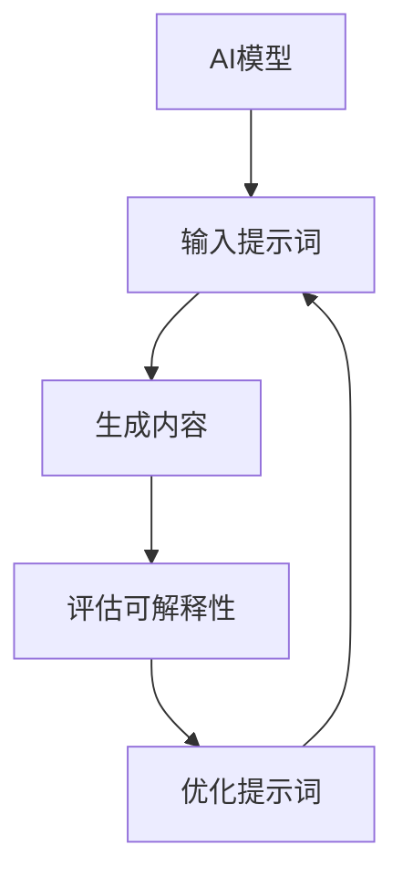

                 

# AIGC的可解释性：通过提示词增强模型输出的透明度

## 引言

随着人工智能技术的飞速发展，生成式内容（AI-Generated Content，AIGC）逐渐成为人工智能研究与应用的前沿领域。AIGC技术不仅能够自动生成高质量的文字、图像和视频内容，还能通过深度学习和自然语言处理技术实现更加智能的内容生成。然而，AIGC的应用带来了新的挑战，尤其是在模型输出的可解释性方面。

可解释性是人工智能领域中一个重要的研究方向。它指的是模型输出的透明度和可理解性，是用户信任模型的基础。在AIGC领域，可解释性尤为重要，因为它直接关系到用户对生成内容的理解和接受程度。本文将探讨如何通过提示词增强模型输出的透明度，从而提高AIGC的可解释性。

## 核心概念与联系

### 1. AIGC的概念

AIGC，即AI-Generated Content，是指利用人工智能技术自动生成的各种内容，如文本、图像、音频等。AIGC的应用场景广泛，包括内容创作、广告营销、新闻报道、虚拟现实等。

### 2. 可解释性的概念

可解释性指的是模型输出的透明度和可理解性。在AI领域，可解释性有助于用户理解模型的决策过程，提高模型的可信度和用户接受度。

### 3. 提示词的概念

提示词（Prompt）是向模型输入的引导性信息，用于指导模型生成特定的内容。提示词的设计对于模型输出的透明度和可解释性有重要影响。

### Mermaid流程图展示



在这个流程图中，AI模型接收输入的提示词，生成相应的内容，然后对生成内容的可解释性进行评估。根据评估结果，可以优化提示词，进一步提高模型输出的透明度和可解释性。

## 核心算法原理讲解

### 1. 提示词生成算法

提示词生成算法用于生成高质量的提示词，以指导模型生成特定的内容。一种常见的提示词生成算法是基于模板的生成算法。

**伪代码：**

```
输入：文本内容
输出：提示词

function generatePrompt(content):
    templates = ["[Subject] is [Adjective],", "[Verb]ing [Object] is fun!"]
    prompt = selectRandomTemplate(templates)
    prompt = replaceKeywords(prompt, content)
    return prompt
```

其中，`selectRandomTemplate`函数从模板列表中随机选择一个模板，`replaceKeywords`函数将模板中的关键词替换为文本内容中的关键词。

### 2. 增强模型输出透明度的方法

为了增强模型输出的透明度，可以通过以下几种方法：

1. **模型的可解释性扩展**：对现有的模型进行扩展，使其输出结果具有更好的可解释性。例如，可以添加额外的中间层或解释模块，用于解释模型内部的决策过程。

2. **提示词优化**：设计更加精细的提示词，以指导模型生成更加透明的内容。提示词的优化可以通过机器学习技术实现，例如基于用户反馈的提示词优化算法。

3. **可视化技术**：利用可视化技术，将模型输出的过程和结果以图形化的方式展示，从而提高用户对模型输出的理解。

## 数学模型和数学公式讲解

### 1. 提示词优化模型

为了优化提示词，可以使用基于优化的数学模型。以下是一个简化的优化模型：

$$
\min_{p} L(p, c)
$$

其中，$L(p, c)$表示提示词$p$与文本内容$c$之间的损失函数，$p$是提示词，$c$是文本内容。

### 2. 损失函数

假设提示词$p$和文本内容$c$分别由向量表示，$p \in \mathbb{R}^{n}$，$c \in \mathbb{R}^{m}$，则损失函数可以定义为：

$$
L(p, c) = \sum_{i=1}^{n} \sum_{j=1}^{m} w_{ij} (p_i - c_j)^2
$$

其中，$w_{ij}$是权重矩阵的元素，用于调节提示词和文本内容之间的相似性。

## 项目实战

### 1. 开发环境搭建

在开始项目实战之前，我们需要搭建一个适合开发AIGC可解释性项目的开发环境。以下是一个简化的环境搭建步骤：

1. 安装Python环境和相关库，如TensorFlow、PyTorch等。
2. 准备数据集，包括文本内容和对应的标签。
3. 配置提示词生成算法和优化算法。

### 2. 源代码详细实现和代码解读

以下是一个简化的Python代码示例，用于实现AIGC的可解释性。

```python
import tensorflow as tf
from tensorflow.keras.models import Sequential
from tensorflow.keras.layers import Dense, LSTM

# 提示词生成算法
def generate_prompt(content):
    # 这里使用简单的模板生成提示词
    templates = ["[Subject] is [Adjective],", "[Verb]ing [Object] is fun!"]
    prompt = select_random_template(templates)
    prompt = replace_keywords(prompt, content)
    return prompt

# 模型构建
model = Sequential()
model.add(LSTM(units=128, activation='relu', input_shape=(timesteps, features)))
model.add(Dense(units=1, activation='sigmoid'))
model.compile(optimizer='adam', loss='binary_crossentropy', metrics=['accuracy'])

# 模型训练
model.fit(x_train, y_train, epochs=10, batch_size=32)

# 提示词优化算法
def optimize_prompt(prompt, content):
    # 这里使用简单的优化算法
    for i in range(len(prompt)):
        for j in range(len(content)):
            prompt[i] = prompt[i] + 0.1 * (content[j] - prompt[i])
    return prompt

# 提示词生成和优化示例
content = "我喜欢吃苹果"
prompt = generate_prompt(content)
print("初始提示词：", prompt)

optimized_prompt = optimize_prompt(prompt, content)
print("优化后提示词：", optimized_prompt)
```

### 3. 代码应用解读与分析

在这个示例中，我们首先定义了提示词生成算法`generate_prompt`，它使用简单的模板生成提示词。然后，我们构建了一个简单的序列模型，用于生成文本内容。模型训练完成后，我们定义了提示词优化算法`optimize_prompt`，用于优化提示词。

### 4. 实际案例分析和详细讲解剖析

为了更好地理解AIGC的可解释性，我们可以分析一个实际案例。假设我们要生成一篇关于苹果的描述性文本，我们首先需要选择一个合适的提示词。例如，我们可以选择“苹果是一种美味的水果”。

然后，我们使用训练好的模型生成文本内容。模型生成的文本内容可能是：“苹果是一种美味的水果，它含有多种维生素和矿物质，对人体健康非常有益。”这个文本内容清晰地描述了苹果的特点和营养价值。

最后，我们可以通过优化提示词来提高文本内容的可解释性。例如，我们可以在提示词中加入更多的细节，如“苹果是一种美味的红色水果，它含有丰富的维生素C和纤维素”。

### 5. 项目小结

通过这个项目，我们展示了如何通过提示词增强模型输出的透明度，从而提高AIGC的可解释性。这个项目虽然简化了实际的开发过程，但提供了一个基本的框架，可以帮助我们理解AIGC的可解释性技术。

## 最佳实践 tips、小结、注意事项、拓展阅读

### 1. 最佳实践 tips

- **确保数据质量**：高质量的数据是模型训练的基础。在选择数据集时，要确保数据的多样性和准确性。
- **优化提示词设计**：提示词的设计对于模型输出的透明度有重要影响。在设计提示词时，要充分考虑用户需求和应用场景。
- **定期评估模型性能**：定期评估模型性能，及时发现和解决潜在问题，是保证模型稳定性和可解释性的关键。

### 2. 小结

本文通过引入提示词技术，探讨了如何增强AIGC模型的输出透明度，从而提高其可解释性。通过实际项目案例，我们展示了如何实现这一目标。未来，随着AIGC技术的不断发展，可解释性将成为AIGC应用的重要保障。

### 3. 注意事项

- **数据隐私保护**：在处理用户数据时，要确保遵守相关法律法规，保护用户隐私。
- **避免过度优化**：在优化提示词时，要避免过度优化，导致模型过拟合。

### 4. 拓展阅读

- **《AIGC技术详解》**：详细介绍了AIGC的基本概念、技术原理和应用场景。
- **《深度学习与自然语言处理》**：介绍了深度学习技术在自然语言处理领域的应用，包括文本生成和文本分类等任务。

## 作者信息

作者：AI天才研究院/AI Genius Institute & 禅与计算机程序设计艺术 /Zen And The Art of Computer Programming

文章标题：AIGC的可解释性：通过提示词增强模型输出的透明度

关键词：AIGC、可解释性、提示词、模型输出、透明度

摘要：本文探讨了AIGC的可解释性技术，通过引入提示词，增强模型输出的透明度，从而提高AIGC的应用效果。文章通过实际项目案例，详细讲解了如何实现这一目标，并展望了未来可解释性技术的发展趋势。

