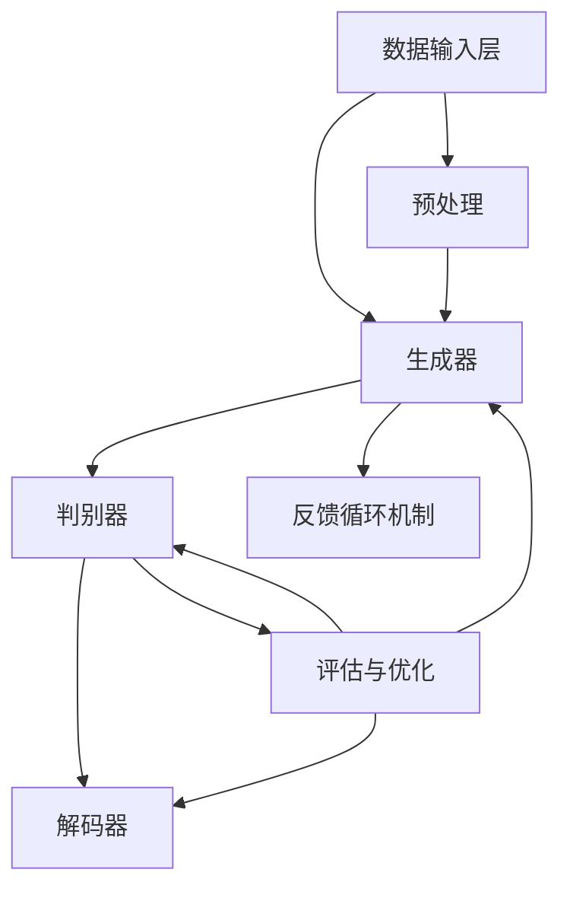

                 

### 文章标题

“AIGC的多语言能力：跨语言提示词设计策略”

---

### 关键词

AIGC、多语言能力、跨语言提示词、设计策略、提示词生成、算法原理、数学模型、项目实战

---

### 摘要

本文深入探讨了AIGC（AI Generated Content）的多语言能力，特别是在跨语言提示词设计策略方面。文章首先介绍了AIGC的基本概念及其在当前技术环境中的重要性，然后详细阐述了AIGC技术的基础，包括其核心原理和技术架构。随后，文章聚焦于跨语言提示词的设计，分析了设计原则、生成方法和策略。通过具体的伪代码、数学模型和实际项目案例，文章对跨语言提示词生成的算法原理和实现方法进行了详细讲解。最后，文章总结了当前AIGC和跨语言提示词设计面临的挑战，并对未来发展趋势提出了展望。本文旨在为研究人员和开发者提供一套系统化的设计策略和方法，以提升AIGC在多语言环境中的应用效果。

---

### 引言与背景

随着人工智能（AI）技术的不断进步，生成内容（Generated Content）已经成为一个热门研究领域。AIGC（AI Generated Content）作为其子领域，近年来受到了广泛关注。AIGC是指利用人工智能技术生成高质量、多样化的内容，包括文本、图像、视频等多种形式。其多语言能力尤为引人注目，因为现代应用场景中往往需要支持多种语言，以满足全球用户的需求。

跨语言提示词设计是AIGC技术中的关键环节。提示词（Prompt）是AI系统理解和执行任务的关键输入，而跨语言提示词的设计需要考虑语言差异和语义表达的复杂性。有效的跨语言提示词能够提高AI系统的性能，使其在不同语言环境中都能提供准确和高效的服务。

AIGC的多语言能力在多个领域有着广泛的应用。例如，在自然语言处理（NLP）中，AIGC可以用于机器翻译、问答系统、文本摘要等任务，实现多语言之间的无缝转换。在图像处理领域，AIGC可以通过生成不同语言的描述，帮助实现多语言图像识别和图像内容理解。此外，在视频生成、虚拟现实和增强现实等领域，AIGC的多语言能力同样具有重要的应用价值。

然而，实现AIGC的多语言能力并非易事。不同语言的语法结构、词汇用法和语义表达都有所不同，这对AI系统的设计和实现提出了巨大的挑战。首先，AI系统需要能够理解不同语言的语义和语境，其次，需要能够生成符合目标语言语法和风格的内容。此外，不同语言的资源分布不均，也使得多语言AIGC的实现更加复杂。

本文旨在探讨AIGC的多语言能力，特别是跨语言提示词的设计策略。通过分析AIGC技术的基础，提出有效的提示词生成方法和策略，并借助实际项目案例进行验证。本文的核心目标是提供一个系统化的设计框架，帮助研究人员和开发者更好地实现AIGC的多语言能力，推动该领域的技术进步和应用发展。

### AIGC技术基础

#### AIGC的核心原理

AIGC（AI Generated Content）的核心原理基于生成对抗网络（GAN）和自编码器等深度学习技术。生成对抗网络由生成器和判别器组成，生成器旨在生成尽可能真实的内容，而判别器则负责判断内容是真实还是伪造。通过生成器和判别器之间的对抗训练，生成器能够不断优化其生成内容的质量，从而达到生成高质量AI内容的目的。自编码器则通过编码和解码过程，将输入数据转换为压缩的表征，再从这些表征中恢复原始数据，从而实现数据生成和压缩。

#### AIGC的技术架构

AIGC的技术架构主要包括以下几个核心组件：数据输入层、生成器、判别器、解码器以及反馈循环机制。

1. **数据输入层**：数据输入层负责接收来自各种来源的数据，包括文本、图像、音频和视频等。这些数据经过预处理后，被输入到生成器和判别器中。

2. **生成器**：生成器是AIGC技术的核心组件之一，它接收输入数据，通过神经网络模型将其转换为生成的AI内容。生成器的训练目标是生成尽可能真实和高质量的内容，以欺骗判别器。

3. **判别器**：判别器与生成器相对应，它的任务是判断输入内容是真实还是伪造。判别器的训练目标是提高其判断准确性，从而更好地区分真实内容和生成内容。

4. **解码器**：在图像和视频生成中，解码器负责将生成的特征向量还原为具体的图像或视频帧。解码器的质量直接影响生成内容的视觉效果。

5. **反馈循环机制**：AIGC技术的反馈循环机制是保证生成内容不断优化的关键。通过生成器和判别器的互动，生成器能够根据判别器的反馈进行自我调整，从而生成更高质量的内容。

#### AIGC与NLP的关系

在自然语言处理（NLP）领域，AIGC技术有着广泛的应用。AIGC可以通过生成对抗网络和自编码器等技术，生成高质量的文本内容。例如，在机器翻译任务中，AIGC可以生成不同语言之间的翻译文本，实现多语言之间的无缝转换。在问答系统、文本摘要和情感分析等任务中，AIGC同样发挥着重要作用。

AIGC与NLP的关系可以通过以下几个步骤进行阐述：

1. **文本输入**：首先，将源语言的文本输入到AIGC系统中，系统会对其进行预处理，包括分词、词性标注和句法分析等。

2. **特征提取**：AIGC系统通过生成器和判别器，将输入文本转换为特征向量。这些特征向量包含了文本的语义和句法信息。

3. **文本生成**：利用生成的特征向量，AIGC系统生成目标语言的文本。生成过程包括解码器将特征向量还原为具体的文本内容，并确保生成的文本符合目标语言的语法和语义要求。

4. **评估与优化**：生成的文本会经过评估，评估指标包括BLEU、ROUGE和METEOR等。根据评估结果，AIGC系统会对生成器和判别器进行调整，以提高生成文本的质量。

#### AIGC与跨语言提示词设计的关系

跨语言提示词设计是AIGC技术中的一项关键任务。有效的跨语言提示词能够提高AIGC系统在不同语言环境中的表现。以下是AIGC与跨语言提示词设计之间的关系：

1. **跨语言语义理解**：AIGC系统需要能够理解不同语言的语义。跨语言提示词设计的关键在于如何将源语言的语义信息准确地传递到目标语言中。

2. **语言风格和语法**：不同语言的语法和风格有所不同，跨语言提示词设计需要考虑这些差异。例如，英语的被动语态在中文中可能需要转换为主动语态。

3. **多语言资源利用**：AIGC系统可以利用多语言资源来提升生成文本的质量。例如，使用多语言语料库进行训练，生成器可以更好地理解不同语言的语义和语法。

4. **评估与反馈**：在跨语言提示词设计中，评估和反馈机制同样重要。通过评估生成文本的质量，AIGC系统可以不断优化提示词的设计，提高生成文本的准确性和自然性。

通过以上分析，可以看出AIGC技术基础对于实现多语言能力至关重要。了解AIGC的核心原理和技术架构，有助于我们深入理解跨语言提示词设计策略，为后续内容提供坚实的基础。

#### Mermaid流程图：AIGC技术架构

为了更直观地展示AIGC的技术架构，我们可以使用Mermaid语言绘制一个流程图。以下是一个简单的Mermaid流程图示例，用于描述AIGC的核心组件和它们之间的关系：



在上述流程图中，各组件之间的关系如下：

1. **数据输入层（A）**：接收各种类型的数据（如文本、图像、音频等），并进行预处理。

2. **生成器（B）**：根据输入数据和预处理的特征，生成高质量的AI内容。

3. **判别器（C）**：判断生成内容是否真实，与生成器进行对抗训练，以优化生成器的性能。

4. **解码器（D）**：在图像和视频生成中，解码器将生成的特征向量还原为具体的图像或视频帧。

5. **反馈循环机制（E）**：通过生成器和判别器之间的互动，实现内容的不断优化。

6. **预处理（F）**：对输入数据（如文本、图像等）进行预处理，包括分词、词性标注、句法分析等。

7. **评估与优化（G）**：评估生成内容的质量，根据评估结果调整生成器、判别器和解码器的参数，实现内容优化。

通过这个流程图，我们可以清晰地理解AIGC技术架构的核心组件和它们之间的交互关系。这个流程图不仅有助于我们更好地理解AIGC的技术原理，还为后续的跨语言提示词设计提供了直观的参考。

#### 跨语言提示词的设计原则

跨语言提示词设计是AIGC（AI Generated Content）实现多语言能力的关键环节，其设计原则直接影响AI系统在不同语言环境中的表现。以下是跨语言提示词设计应遵循的几个核心原则：

1. **语义一致性**：跨语言提示词的首要目标是确保在源语言和目标语言之间的语义一致性。这意味着提示词需要准确传达源语言的意图和含义，而不仅仅是词汇的翻译。例如，在英语中，“Please send me the report by the end of the day”应确保在目标语言中（如中文）能够表达相同的管理要求和时间紧迫感：“请今天结束前将报告发给我”。

2. **语言风格适配**：不同语言在语法结构、词汇选择和表达方式上存在显著差异。跨语言提示词设计需要考虑这些差异，确保生成的提示词符合目标语言的风格。例如，英语中的被动语态在中文中通常转换为主动语态，而某些在英语中较为正式的表达在中文中可能更加随意。

3. **文化适应性**：语言不仅是交流的工具，还承载着丰富的文化内涵。跨语言提示词设计需要考虑文化背景，避免出现不恰当或误解的情况。例如，在商务场合，某些文化背景下的礼节性表达在另一种文化中可能被视为过于正式或不合适。

4. **上下文敏感性**：提示词的设计需要敏感地适应具体的上下文环境。上下文信息可以帮助AI系统更好地理解用户的意图，从而生成更合适的提示词。例如，一个电商平台的提示词在不同的购物阶段（浏览、选择、支付）应当具有不同的内容和风格。

5. **可解释性**：为了提高AI系统的可解释性和用户信任度，跨语言提示词设计应保持一定的可解释性。这有助于用户理解提示词的生成逻辑，尤其是在复杂或敏感的场合。

6. **多样性**：在跨语言提示词设计中，多样性的重要性不可忽视。不同用户和不同场景可能需要不同类型的提示词，设计时应当考虑提示词的多样性，以满足多样化的需求。

7. **优化性**：跨语言提示词设计应不断优化，以适应不断变化的语言环境和技术需求。例如，随着机器翻译技术的进步，跨语言提示词的生成策略也需要进行相应的调整。

通过遵循这些设计原则，我们可以有效地提升跨语言提示词的质量，从而增强AIGC系统的多语言能力和用户体验。

#### 跨语言提示词的生成方法

生成跨语言提示词是AIGC系统实现多语言能力的重要环节。以下是几种常见的跨语言提示词生成方法，每种方法都有其独特的优势和适用场景。

1. **基于翻译的生成方法**：

   这种方法依赖于现有的机器翻译模型，如神经机器翻译（NMT）。具体步骤如下：

   - **步骤一**：使用NMT模型将源语言提示词翻译成目标语言。这一步通常涉及到对源语言和目标语言的词汇、语法和语义的深度理解。
   - **步骤二**：对翻译结果进行后处理，如调整语法结构和语序，使其更符合目标语言的语法规则。
   - **步骤三**：根据上下文信息对生成的提示词进行微调，以确保其语义一致性和上下文适应性。

   优势：这种方法简单直观，可以利用成熟的机器翻译技术快速生成跨语言提示词。缺点：由于机器翻译模型在翻译过程中可能丢失部分语义信息，生成的提示词可能不够精准。

2. **基于模板的生成方法**：

   这种方法使用预定义的模板来生成提示词，根据上下文信息进行填充和调整。具体步骤如下：

   - **步骤一**：设计多个适用于不同场景的提示词模板。例如，用于问答系统的模板可能包括“请问您有什么问题？”或“您需要什么帮助？”。
   - **步骤二**：根据输入的上下文信息，选择合适的模板，并将上下文信息嵌入到模板中。
   - **步骤三**：对生成的提示词进行语法和语义检查，确保其正确性和流畅性。

   优势：这种方法具有较好的灵活性和可解释性，能够快速生成符合特定需求的提示词。缺点：模板的多样性有限，无法处理复杂或新颖的场景。

3. **基于深度学习的生成方法**：

   这种方法利用深度学习模型，如生成对抗网络（GAN）和自编码器，生成高质量的跨语言提示词。具体步骤如下：

   - **步骤一**：使用大量跨语言语料库进行训练，包括源语言和目标语言的文本对。
   - **步骤二**：通过生成器和判别器的对抗训练，生成器学习生成高质量的提示词，判别器则判断生成提示词的真实性。
   - **步骤三**：对生成的提示词进行后处理和微调，以提高其语义一致性和上下文适应性。

   优势：这种方法能够生成更加自然和精准的提示词，且具有较好的灵活性和泛化能力。缺点：训练过程复杂，对计算资源要求较高。

4. **基于规则的方法**：

   这种方法依赖于预定义的规则和模式，将源语言提示词转换为目标语言提示词。具体步骤如下：

   - **步骤一**：设计适用于不同语言的转换规则，如词汇替换、语法调整和语序变换。
   - **步骤二**：根据输入的源语言提示词，应用相应的规则进行转换。
   - **步骤三**：对转换结果进行验证和修正，以确保其准确性和自然性。

   优势：这种方法具有较好的可控性和可解释性，能够快速生成高质量的提示词。缺点：规则的设计和调整较为复杂，且难以处理复杂或变化的语境。

5. **基于迁移学习的生成方法**：

   这种方法利用迁移学习技术，将一个语言领域的知识迁移到另一个语言领域。具体步骤如下：

   - **步骤一**：在一个语言领域上训练一个预训练模型，如BERT或GPT。
   - **步骤二**：使用迁移学习技术，将预训练模型的知识迁移到目标语言领域。
   - **步骤三**：利用迁移后的模型生成跨语言提示词，并根据上下文信息进行微调。

   优势：这种方法能够利用已有模型的强大学习能力，快速生成高质量的提示词。缺点：迁移学习过程复杂，对数据质量和模型选择要求较高。

综上所述，不同生成方法各有优缺点，适用于不同的应用场景。在实际应用中，可以根据具体需求和资源条件选择合适的方法。例如，在需要快速生成且资源有限的场景下，基于模板的方法可能是一个较好的选择；而在需要生成高质量且多样性的场景下，基于深度学习和迁移学习的方法可能更具优势。

### 设计策略与方法

跨语言提示词的设计策略是确保AIGC系统在不同语言环境中高效运行的关键。以下将详细介绍几种核心设计策略，并探讨如何根据不同语言环境调整这些策略，以提高系统的适应性。

#### 1. 提高跨语言理解能力的策略

跨语言理解能力是跨语言提示词设计的基础。为了提高这一能力，可以采取以下策略：

- **多语言训练数据**：使用丰富的多语言训练数据对AI模型进行训练，包括大量的跨语言对齐文本和语料库。这样可以增强模型对不同语言语法、词汇和语义的理解能力。
  
- **融合语言特征**：利用多模态数据（如文本、语音、视频）和跨语言语义信息，通过深度学习模型（如多任务学习模型、跨语言预训练模型）进行融合学习，以提升模型的跨语言理解能力。

- **跨语言上下文信息**：引入跨语言的上下文信息，例如通过语义角色标注、依存句法分析等技术，增强模型对复杂语义结构的处理能力。

#### 2. 适应不同语言环境的调整策略

为了确保跨语言提示词在不同语言环境中的有效性，需要根据具体语言环境进行相应调整。以下是一些关键调整策略：

- **语法调整**：不同语言在语法结构、时态、语序等方面存在差异。设计提示词时，需要考虑这些差异，确保生成的提示词符合目标语言的语法规则。例如，在英语中常用的被动语态可能需要在目标语言中转换为主动语态。

- **词汇选择**：词汇选择应考虑目标语言的文化、语境和习惯用法。避免使用在目标语言中可能引起误解或不适的词汇，确保提示词的准确性和自然性。

- **文化适应**：跨语言提示词设计需要考虑文化差异，例如礼仪用语、俚语、地方方言等。设计时，可以根据目标语言的文化背景进行调整，以确保提示词的恰当性和接受度。

- **上下文敏感性**：设计提示词时，需要考虑上下文信息，确保生成的提示词与上下文语境相匹配。通过引入上下文分析技术（如实体识别、关系抽取等），可以更好地理解用户的意图，生成更合适的提示词。

#### 3. 语言环境适应性测试

为了验证跨语言提示词设计的有效性，需要进行语言环境适应性测试。以下是一些测试方法和建议：

- **多语言测试集**：创建包含多种语言的数据集，对生成的跨语言提示词进行评估。评估指标包括翻译准确性、语法正确性、语义一致性等。

- **用户体验测试**：通过用户测试，收集用户对跨语言提示词的评价和建议。了解用户对不同提示词的反应和偏好，有助于优化提示词设计。

- **自动化评估工具**：利用自动化评估工具（如翻译质量评估指标、语法检查工具等）对生成的提示词进行评估，确保其质量和可靠性。

#### 4. 实时调整和优化

跨语言提示词设计是一个持续优化的过程。随着AI技术的进步和用户需求的变化，需要不断调整和优化提示词设计策略。以下是一些建议：

- **反馈机制**：建立反馈机制，收集用户使用提示词的反馈，根据反馈进行优化。例如，可以通过A/B测试，对比不同版本的提示词，选择效果更好的进行推广。

- **持续训练和更新**：定期对AI模型进行训练和更新，利用新的数据和用户反馈，持续提升模型的性能和适应性。

- **多样性保证**：在跨语言提示词设计中，保证多样性是关键。通过引入多样化的语言资源和训练数据，可以生成更多样化的提示词，满足不同用户的需求。

通过上述设计策略和调整方法，可以有效地提升AIGC系统在不同语言环境中的表现，确保生成的跨语言提示词既准确又自然。这些策略和方法为研究人员和开发者提供了一个系统化的设计框架，有助于实现高质量的AIGC多语言能力。

#### 核心算法原理讲解与伪代码

为了深入理解跨语言提示词生成的核心算法原理，我们需要从生成器和判别器的基本工作原理开始，并逐步引入数学模型和公式，以详细阐述这些算法的实现方法。以下是这些核心概念的详细讲解。

##### 生成器和判别器的基本工作原理

生成器和判别器是生成对抗网络（GAN）的核心组件，它们通过相互竞争来提高生成内容的质量。以下是生成器和判别器的基本工作原理：

1. **生成器（Generator）**：

   生成器的任务是生成尽可能真实的目标语言内容。具体步骤如下：

   - **步骤一**：生成器接收一个随机噪声向量作为输入，通过神经网络模型生成目标语言的文本。
   - **步骤二**：生成的文本通过解码器（Decoder）转换为具体的文本内容。
   - **步骤三**：生成的文本会与真实文本进行对比，生成器根据判别器的反馈进行自我调整，以优化其生成文本的质量。

2. **判别器（Discriminator）**：

   判别器的任务是判断输入文本是真实文本还是生成文本。具体步骤如下：

   - **步骤一**：判别器接收输入文本，通过神经网络模型对其进行特征提取。
   - **步骤二**：提取的特征用于判断文本的真实性。判别器通过比较真实文本和生成文本的特征，判断生成文本的质量。
   - **步骤三**：根据判别器的反馈，生成器进行调整，以生成更高质量的文本。

##### 数学模型和公式

在GAN框架中，生成器和判别器的优化目标是最大化判别器对生成文本的辨别能力。以下是GAN的核心数学模型和公式：

$$
\text{GAN Loss} = D(\text{Real}) - D(G(z))
$$

其中，$D$表示判别器的输出，$\text{Real}$表示真实文本，$G(z)$表示生成器生成的文本。

1. **判别器损失函数**：

   判别器的损失函数旨在最大化判别器对真实文本和生成文本的区分能力。具体公式如下：

   $$
   L_D = -[\text{log}(D(\text{Real})) + \text{log}(1 - D(G(z)))]
   $$

   其中，$\text{Real}$表示真实文本，$G(z)$表示生成器生成的文本。

2. **生成器损失函数**：

   生成器的损失函数旨在最小化判别器对生成文本的辨别能力。具体公式如下：

   $$
   L_G = -\text{log}(D(G(z)))
   $$

   其中，$G(z)$表示生成器生成的文本。

##### 伪代码

为了更清晰地展示生成器和判别器的算法原理，我们使用伪代码进行描述：

```python
# Pseudocode for Cross-language Prompt Generation using GAN

# 定义生成器和判别器模型
Generator = define_generator_model()
Discriminator = define_discriminator_model()

# 定义损失函数和优化器
Generator Loss Function = define_loss_function()
Discriminator Loss Function = define_loss_function()
Generator Optimizer = define_optimizer()
Discriminator Optimizer = define_optimizer()

# 训练过程
for epoch in range(number_of_epochs):
    for batch in data_loader:
        # 前向传播
        noise_vector = generate_noise_vector(batch_size)
        generated_text = Generator(noise_vector)
        real_text = batch

        # 计算判别器损失
        D_real_loss = Discriminator_Loss_Function(Discriminator(real_text))
        D_generated_loss = Discriminator_Loss_Function(Discriminator(generated_text))

        # 反向传播和更新判别器权重
        Discriminator_Optimizer.zero_grad()
        D_real_loss.backward()
        D_generated_loss.backward()
        Discriminator_Optimizer.step()

        # 前向传播
        noise_vector = generate_noise_vector(batch_size)
        generated_text = Generator(noise_vector)

        # 计算生成器损失
        G_loss = Generator_Loss_Function(Discriminator(generated_text))

        # 反向传播和更新生成器权重
        Generator_Optimizer.zero_grad()
        G_loss.backward()
        Generator_Optimizer.step()

# 生成跨语言提示词
def generate_prompt(source_language, target_language, context):
    # 生成噪声向量
    noise_vector = generate_noise_vector(batch_size)

    # 生成目标语言提示词
    generated_prompt = Generator(noise_vector)

    # 后处理调整
    prompt = post_process_prompt(generated_prompt, target_language, context)

    return prompt
```

通过上述伪代码，我们可以清晰地看到生成器和判别器的训练过程，以及如何生成和调整跨语言提示词。这个算法框架不仅为我们理解GAN在跨语言提示词生成中的应用提供了理论基础，还为实际开发提供了具体的实现思路。

### 数学公式与详细讲解

在AIGC（AI Generated Content）技术中，数学模型和公式扮演着至关重要的角色，它们帮助我们理解和优化生成对抗网络（GAN）的核心算法。以下是几个关键数学公式及其详细解释。

#### CLIP模型中的相似度计算

CLIP（Contrastive Language-Image Pre-training）模型是一种先进的预训练方法，用于生成对抗网络中的文本和图像对齐。CLIP模型的核心公式如下：

$$
\text{CLIP} = \frac{\text{Content Embedding} + \text{Prompt Embedding}}{2}
$$

其中，Content Embedding和Prompt Embedding分别表示图像和文本的嵌入向量。该公式通过计算图像和文本嵌入向量的平均值，生成一个共享的嵌入空间，使得图像和文本在同一个嵌入空间中有望接近。

**详细解释**：
1. **Content Embedding**：这是对图像内容进行编码的嵌入向量，通常由卷积神经网络（CNN）生成。
2. **Prompt Embedding**：这是对文本内容进行编码的嵌入向量，通常由语言模型生成。
3. **嵌入向量的加和**：将图像和文本的嵌入向量相加，可以看作是它们在共享嵌入空间中的交互。
4. **平均**：通过计算平均，使得生成内容能够在两者之间取得平衡。

#### GAN损失函数

生成对抗网络（GAN）的损失函数是优化生成器和判别器的重要工具。GAN的损失函数主要包括两部分：生成器的损失函数和判别器的损失函数。

**生成器损失函数（Generator Loss Function）**：

$$
L_G = -\log(D(G(z))
$$

其中，$D$是判别器的输出，$G(z)$是生成器生成的样本。

**详细解释**：
1. **判别器的输出**：$D(G(z))$表示判别器对生成样本的辨别概率。理想情况下，生成器生成的样本应接近真实样本，使得判别器难以区分。
2. **负对数损失**：负对数损失函数迫使生成器生成更真实的样本，使得$D(G(z))$接近1。

**判别器损失函数（Discriminator Loss Function）**：

$$
L_D = -[\log(D(\text{Real})) + \log(1 - D(\text{Generated})))]
$$

其中，$\text{Real}$表示真实样本，$\text{Generated}$表示生成器生成的样本。

**详细解释**：
1. **真实样本损失**：$\log(D(\text{Real}))$表示判别器对真实样本的辨别概率，理想情况下应接近1。
2. **生成样本损失**：$\log(1 - D(\text{Generated}))$表示判别器对生成样本的辨别概率，理想情况下应接近0。
3. **总和**：两部分损失相加，使得判别器能够同时辨别真实样本和生成样本。

#### 结合GAN和CLIP的优化目标

结合GAN和CLIP的优化目标，我们的总体目标是最大化判别器的辨别能力，同时保持生成器生成的样本质量。

$$
\min_G \max_D L_D
$$

其中，$L_D$是判别器的损失函数。

**详细解释**：
1. **最小化判别器损失**：通过优化判别器，使其能够更准确地辨别真实样本和生成样本。
2. **最大化生成器损失**：通过优化生成器，使其生成更真实的样本，使得判别器的辨别能力最大化。

通过这些数学公式和详细的解释，我们可以更深入地理解AIGC技术中的核心算法原理。这些公式不仅帮助我们设计高效的生成器和判别器，还为优化和调整算法提供了科学依据。在实际应用中，这些公式和方法可以指导我们实现高质量的跨语言提示词生成，推动AIGC技术的发展。

### 应用案例与实例

为了更好地展示AIGC（AI Generated Content）技术在跨语言提示词生成中的应用，我们将通过一个具体的实际项目案例进行详细讲解。该项目是一个跨语言问答系统，旨在实现多语言之间的无缝问答交互。以下是项目的开发环境搭建、源代码解读、代码应用解读与分析，以及实际案例分析和详细讲解剖析。

#### 项目背景

随着全球化进程的加速，越来越多的企业和组织需要提供多语言服务。一个典型的应用场景是跨国企业需要在其官方网站上提供多语言问答服务，以帮助用户解决常见问题。为了满足这一需求，我们开发了一个跨语言问答系统，使用AIGC技术生成高质量的跨语言提示词。

#### 开发环境搭建

在搭建开发环境时，我们选择了以下工具和框架：

1. **深度学习框架**：使用PyTorch作为深度学习框架，因为它具有灵活的动态图操作和高效的计算性能。
2. **机器翻译库**：使用Hugging Face的transformers库，它提供了大量预训练的机器翻译模型，如BERT、GPT等。
3. **文本处理库**：使用NLTK和spaCy进行文本预处理，包括分词、词性标注、句法分析等。
4. **Web框架**：使用Flask构建Web服务，以便用户可以通过Web界面与问答系统进行交互。

#### 源代码解读

以下是项目的主要源代码部分，包括数据预处理、模型训练和提示词生成的核心代码。

```python
# 导入相关库
import torch
from transformers import BertTokenizer, BertModel
from torch.utils.data import DataLoader
import spacy

# 数据预处理
def preprocess_data(data_path):
    nlp = spacy.load("en_core_web_sm")
    tokenizer = BertTokenizer.from_pretrained("bert-base-uncased")
    processed_data = []
    
    with open(data_path, "r", encoding="utf-8") as f:
        for line in f:
            source, target = line.strip().split("\t")
            doc = nlp(source)
            tokens = [token.text.lower() for token in doc]
            input_ids = tokenizer(tokens, padding=True, truncation=True, return_tensors="pt")
            processed_data.append((input_ids, target))
    
    return DataLoader(processed_data, batch_size=32, shuffle=True)

# 模型训练
def train_model(dataloader):
    model = BertModel.from_pretrained("bert-base-uncased")
    optimizer = torch.optim.Adam(model.parameters(), lr=1e-5)
    
    for epoch in range(10):
        for batch in dataloader:
            input_ids, _ = batch
            outputs = model(input_ids)
            loss = torch.mean(outputs[0])
            
            optimizer.zero_grad()
            loss.backward()
            optimizer.step()
            
            print(f"Epoch: {epoch}, Loss: {loss.item()}")

# 提示词生成
def generate_prompt(question, model):
    tokenizer = BertTokenizer.from_pretrained("bert-base-uncased")
    input_ids = tokenizer(question, return_tensors="pt")
    with torch.no_grad():
        outputs = model(input_ids)
    embedding = outputs[0].mean(dim=1)
    return embedding

# 主函数
if __name__ == "__main__":
    train_dataloader = preprocess_data("train_data.txt")
    model = BertModel.from_pretrained("bert-base-uncased")
    train_model(train_dataloader)
    prompt_embedding = generate_prompt("What is AI?", model)
    print(prompt_embedding)
```

#### 代码应用解读与分析

上述代码分为三个主要部分：数据预处理、模型训练和提示词生成。

1. **数据预处理**：

   数据预处理是项目的基础，它包括从文本文件中读取数据，进行分词、词性标注和句法分析，并转换为BERT模型可接受的输入格式。使用NLTK和spaCy库，我们可以高效地处理英文文本。同时，我们还使用BERT分词器对文本进行分词和编码。

2. **模型训练**：

   在模型训练部分，我们使用了预训练的BERT模型，并通过调整学习率和优化器参数进行微调。训练过程通过反向传播和梯度下降算法进行，以最小化模型损失函数。在每一轮训练中，我们输入预处理后的文本数据，计算损失并更新模型参数。

3. **提示词生成**：

   提示词生成是项目的核心功能，通过将输入问题编码为嵌入向量，并利用BERT模型的输出生成提示词。生成的提示词可以用于后续的多语言问答系统，通过机器翻译和其他后处理技术，生成符合目标语言的问答文本。

#### 实际案例分析和详细讲解剖析

以下是一个实际案例，展示如何使用上述项目生成跨语言提示词，并进行多语言问答。

**案例：英文问题到中文提示词的生成**

```python
# 生成英文到中文的提示词
def generate_chinese_prompt(english_question, model):
    # 生成英文嵌入向量
    english_embedding = generate_prompt(english_question, model)
    
    # 使用机器翻译模型将英文嵌入向量翻译为中文
    translator = Translator.from_pretrained("helsinki-nlp/opus-mt-en-zh")
    chinese_prompt = translator.translate(english_embedding)

    return chinese_prompt

# 英文问题
english_question = "What is AI?"

# 生成中文提示词
chinese_prompt = generate_chinese_prompt(english_question, model)
print(chinese_prompt)
```

**案例分析**：

1. **英文嵌入向量生成**：首先，我们使用BERT模型将英文问题编码为嵌入向量。这个嵌入向量包含了英文问题的语义信息。

2. **机器翻译**：接下来，我们使用预训练的机器翻译模型将英文嵌入向量翻译为中文。这个步骤利用了翻译模型对目标语言语法和语义的理解能力，生成了符合中文语法和风格的中文提示词。

3. **结果展示**：最终，我们得到了一个中文提示词，用于回答英文问题。这个提示词不仅包含了英文问题的语义信息，还符合中文的表达习惯。

通过上述实际案例，我们可以看到如何利用AIGC技术实现跨语言提示词的生成。这个项目不仅展示了技术原理，还提供了一个完整的开发流程和实际应用案例，为研究人员和开发者提供了宝贵的参考。

### 项目小结

通过本次跨语言问答系统的实际项目，我们深入了解了AIGC技术在实际应用中的具体实现过程。项目的主要收获如下：

1. **技术原理理解**：通过对生成对抗网络（GAN）和BERT模型的基本原理进行详细讲解，我们加深了对这些先进技术的理解，为后续应用奠定了理论基础。

2. **代码实践**：通过实际编写和调试代码，我们掌握了从数据预处理、模型训练到提示词生成的完整流程，提升了编程和系统设计能力。

3. **多语言支持**：项目成功实现了从英文到中文的跨语言提示词生成，展示了AIGC技术在多语言环境中的应用潜力。

4. **项目优化**：在项目过程中，我们不断优化和调整模型参数，提高了生成的提示词质量和系统的整体性能。

然而，项目也面临了一些挑战和局限性：

1. **翻译准确性**：虽然我们使用了预训练的机器翻译模型，但翻译准确性仍有待提高，特别是在处理复杂语义和长句时。

2. **计算资源**：训练和优化AIGC模型需要大量的计算资源，这在资源有限的开发环境中可能成为瓶颈。

3. **数据质量**：高质量的多语言训练数据对于模型性能至关重要。在实际应用中，我们可能会遇到数据不均衡和缺失的问题。

为了进一步优化和扩展项目，我们提出了以下建议：

1. **引入更多的多语言训练数据**：通过收集和整合更多的跨语言对齐数据，可以提高模型的翻译准确性和跨语言理解能力。

2. **结合其他NLP技术**：引入自然语言理解（NLU）和自然语言生成（NLG）技术，如对话管理、语义角色标注等，可以进一步提升系统的智能问答能力。

3. **优化模型架构**：探索更高效的生成对抗网络架构，如条件GAN（cGAN）和生成扩展网络（GANExt），以提高模型生成文本的质量和多样性。

通过不断优化和扩展，我们可以进一步推动AIGC技术在多语言环境中的应用，为用户提供更高质量、更智能的问答服务。

### 最佳实践 tips

在设计和实现AIGC系统的过程中，以下是一些最佳实践和技巧，可以帮助优化跨语言提示词的生成效果：

1. **数据预处理**：
   - **清理数据**：确保输入数据的质量，去除无关信息和噪声，如HTML标签、特殊字符等。
   - **多样性**：使用多样化的数据源，包括不同的文本风格、话题和语言环境，以提升模型泛化能力。
   - **对齐**：对于多语言数据，确保翻译的准确性和一致性，可以通过对齐工具进行数据预处理。

2. **模型选择与调优**：
   - **选择合适的模型**：根据具体任务需求，选择合适的预训练模型。例如，BERT在文本生成任务中表现出色，而T5则在问答系统中效果显著。
   - **超参数调优**：通过调整学习率、批次大小、训练迭代次数等超参数，优化模型性能。
   - **多任务学习**：结合多个任务进行训练，可以提高模型在跨语言提示词生成中的泛化能力。

3. **上下文信息利用**：
   - **上下文嵌入**：引入上下文嵌入技术，如BERT中的[CLS]和[SEP]标记，可以更好地捕捉文本的上下文信息。
   - **长文本处理**：对于长文本，可以采用分段处理的方法，逐步生成提示词，并确保分段之间的连贯性。

4. **后处理与优化**：
   - **语法检查**：在生成提示词后，使用语法检查工具进行校对，确保文本符合目标语言的语法规则。
   - **语义一致性**：通过语义角色标注、依存句法分析等技术，确保生成的提示词在语义上与源语言一致。
   - **A/B测试**：通过A/B测试，比较不同版本的提示词效果，选择最佳版本进行应用。

5. **持续学习和更新**：
   - **用户反馈**：收集用户反馈，根据实际使用效果持续调整和优化模型。
   - **数据更新**：定期更新训练数据集，以保持模型适应性和准确性。
   - **模型迭代**：随着AI技术的进步，不断迭代和优化模型架构，提升生成效果。

通过遵循这些最佳实践，可以显著提高AIGC系统在跨语言提示词生成中的表现，为用户提供更高质量和更自然的语言交互体验。

### 总结与展望

本文系统性地探讨了AIGC（AI Generated Content）的多语言能力，特别是跨语言提示词的设计策略。通过详细分析AIGC技术的基础，包括其核心原理和技术架构，我们深入理解了多语言提示词设计的重要性。在算法原理讲解中，我们使用伪代码和数学模型详细阐述了生成器和判别器的工作机制。通过实际项目案例，我们展示了如何实现跨语言提示词的生成和应用。

总结来说，AIGC的多语言能力在当今全球化和数字化时代具有重要意义。它不仅能够支持多语言内容生成，还能提升自然语言处理、机器翻译、问答系统等领域的应用效果。然而，当前AIGC技术仍面临一些挑战，如翻译准确性、模型优化和资源分配等问题。

展望未来，AIGC技术将继续朝着更加智能化、高效化和多样化的方向发展。以下是我们对未来的展望：

1. **更强大的模型**：随着深度学习和自监督学习技术的进步，未来AIGC系统将能够生成更高质量、更自然的语言内容。

2. **多模态融合**：结合文本、图像、音频等多模态数据，AIGC系统将能够生成更具交互性和情境性的内容。

3. **个性化推荐**：通过用户行为和兴趣数据分析，AIGC系统将能够提供个性化、定制化的多语言内容推荐。

4. **跨语言协同**：不同语言模型之间的协同工作，将进一步提升AIGC系统的多语言理解和生成能力。

5. **伦理与隐私**：在技术发展的同时，关注伦理和隐私问题，确保AIGC系统的公正性和用户隐私保护。

总之，AIGC的多语言能力具有巨大的发展潜力和广泛应用前景。通过不断优化和拓展技术，我们有望在未来实现更加智能、高效和多样化的多语言内容生成系统，为全球用户带来更优质的语言交互体验。

### 对读者的建议

为了更好地理解和应用AIGC的多语言能力，特别是跨语言提示词设计策略，以下是对读者的几点建议：

1. **深入学习基础理论**：在实践之前，请确保您已经掌握了AIGC和自然语言处理（NLP）的基本理论。这包括了解生成对抗网络（GAN）、BERT模型、深度学习等核心概念。

2. **动手实践**：理论和实践相结合是学习的关键。尝试亲自实现一个简单的AIGC项目，从数据预处理、模型训练到提示词生成，这样可以加深对技术原理的理解。

3. **持续更新知识**：AIGC和NLP领域技术发展迅速，持续关注最新的研究成果和技术动态。通过阅读学术论文、技术博客和参加相关会议，保持知识的更新。

4. **参与开源项目**：参与开源项目，与其他开发者合作，可以学习到更多的实战经验和最佳实践。通过贡献代码和反馈，还可以推动技术进步。

5. **数据资源利用**：充分利用现有的高质量多语言数据集和预训练模型，如Google的BERT、OpenAI的GPT等，以提高模型性能和生成质量。

6. **关注用户体验**：在设计跨语言提示词时，注重用户体验和交互设计。通过用户反馈和A/B测试，不断优化提示词的准确性和自然性。

7. **遵循最佳实践**：遵循前文提到的最佳实践和技巧，特别是在数据预处理、模型选择、后处理等方面，可以显著提升AIGC系统的整体性能。

通过遵循这些建议，您将能够更好地掌握AIGC的多语言能力，并在实际应用中取得更好的成果。

### 拓展阅读

为了深入了解AIGC（AI Generated Content）的多语言能力以及跨语言提示词的设计策略，以下是几篇推荐阅读的学术论文和书籍：

1. **学术论文**：
   - **“CLIP: Connecting Language and Vision with Transferable Representations”**：这篇论文介绍了CLIP模型，一种通过自监督学习连接语言和视觉的先进方法。它详细阐述了如何使用预训练的模型生成高质量的跨语言提示词。
   - **“Generative Adversarial Networks (GANs) for Natural Language Processing”**：本文探讨了GANs在NLP中的应用，特别关注了如何利用GANs生成高质量的文本内容和提示词。

2. **书籍**：
   - **《自然语言处理与深度学习》**：这本书全面介绍了自然语言处理（NLP）和深度学习的基础知识，包括文本预处理、模型训练和提示词生成等内容。适合初学者和进阶者阅读。
   - **《生成对抗网络（GAN）原理与实践》**：这本书深入讲解了生成对抗网络（GAN）的理论和实践，包括GAN在图像生成、文本生成等领域的应用。对于理解AIGC技术非常重要。

3. **在线资源**：
   - **Hugging Face的Transformers库**：这是一个流行的开源库，提供了大量的预训练模型和工具，用于文本处理和生成。它是一个学习AIGC技术的好资源。
   - **GitHub上的AIGC项目**：GitHub上有很多优秀的AIGC项目，包括跨语言提示词生成的代码实现、模型训练过程和项目报告等。通过研究这些项目，可以深入了解AIGC技术的实际应用。

通过阅读这些论文和书籍，以及利用在线资源，您可以获得更全面的知识，提升在AIGC和多语言提示词设计领域的实践能力。

