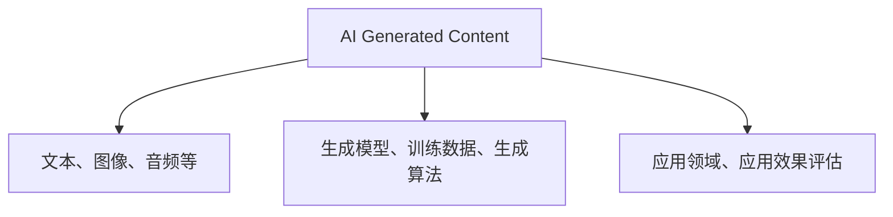
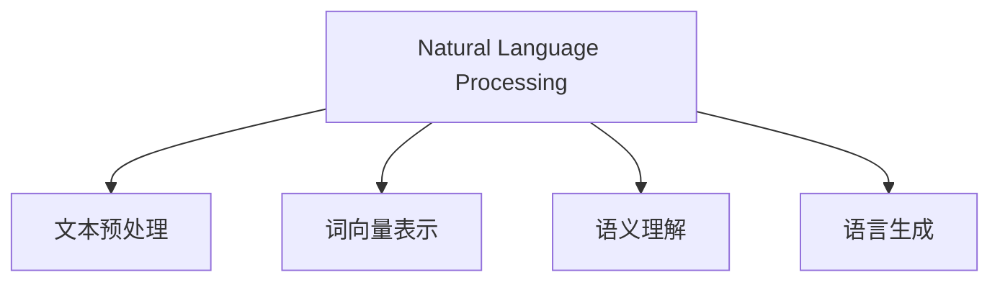
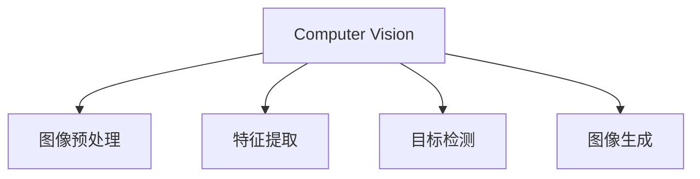

                 

### AIGC的文化适应性：跨文化交流中的提示词设计

#### 摘要

本文将探讨AIGC（AI Generated Content）在跨文化交流中的应用，重点分析提示词设计的重要性以及如何提高AIGC的文化适应性。通过介绍AIGC的基础理论，阐述自然语言处理和计算机视觉在AIGC中的应用，本文将深入探讨文本、图像和音频内容的跨文化适应性策略，并提供实际案例以供参考。最后，本文将展望AIGC在跨文化交流中的未来发展趋势和面临的挑战。

### 第一部分：AIGC的基础理论

#### 第1章：AIGC概述

##### 1.1 AIGC的定义与重要性

AIGC是指利用人工智能技术自动生成内容的一种方式，涵盖了文本、图像、音频等多种形式。它通过结合自然语言处理（NLP）、计算机视觉（CV）和生成对抗网络（GAN）等技术，能够实现高效的内容生成。AIGC在各个领域都有广泛的应用，如社交媒体内容生成、个性化推荐系统、智能客服等，提高了内容生产效率和用户体验。

###### **核心概念原理和架构的Mermaid流程图**



在AIGC中，生成模型是核心组件，负责根据输入数据和提示词生成相应的内容。常见的生成模型包括生成对抗网络（GAN）、变分自编码器（VAE）和自注意力模型（如BERT）。训练数据是模型学习的基础，通常需要大规模、高质量的数据集。生成算法则是指具体的实现方法，如文本生成常用的生成式模型和判别式模型。

##### 1.2 AIGC的发展历程

AIGC的发展可以分为几个阶段：初步探索阶段、快速发展阶段和当前应用阶段。在初步探索阶段，人工智能领域的先驱们开始尝试使用机器学习生成内容。快速发展阶段则是在深度学习和大数据技术成熟后，AIGC技术得到了显著提升。当前应用阶段，AIGC已经被广泛应用于各个领域，成为提高效率、创造价值的重要工具。

#### 第2章：自然语言处理与AIGC

##### 2.1 NLP的基本原理

自然语言处理（NLP）是计算机科学和人工智能领域的一个重要分支，旨在使计算机能够理解和处理人类语言。NLP的基本原理包括文本预处理、词向量表示、语义理解和语言生成等。

###### **核心概念原理和架构的Mermaid流程图**



文本预处理是指对原始文本进行清洗、分词、去停用词等操作，使其能够被计算机处理。词向量表示是将文本中的单词映射为高维向量，以便进行计算。语义理解是指计算机理解文本中的含义和关系，如实体识别、情感分析等。语言生成则是根据输入的提示生成符合语法和语义要求的文本。

##### 2.2 NLP在AIGC中的应用

NLP在AIGC中的应用主要体现在文本生成、文本摘要和机器翻译等方面。文本生成是通过输入提示词或关键词，生成完整的文本内容。文本摘要则是将长文本压缩成简洁的摘要，便于阅读和参考。机器翻译则是将一种语言的文本翻译成另一种语言，实现跨语言交流。

###### **核心算法原理讲解**

文本生成：

```python
# 定义生成式模型
model = GPT2-LanguageModel

# 输入提示词
prompt = "今天是一个美好的日子"

# 生成文本
generated_text = model.generate(prompt)
```

文本摘要：

```python
# 定义摘要模型
model = TextRank-Summarizer

# 输入长文本
long_text = "这是一个非常长的文本，需要进行摘要处理"

# 生成摘要
summary = model.summarize(long_text)
```

机器翻译：

```python
# 定义翻译模型
model = Transformer-Translator

# 输入源文本和目标语言
source_text = "Hello, World!"
target_language = "中文"

# 翻译文本
translated_text = model.translate(source_text, target_language)
```

##### 2.3 NLP与跨文化交流的关系

NLP在跨文化交流中的应用具有重要意义。通过文本生成、文本摘要和机器翻译等技术，NLP可以帮助消除语言障碍，促进不同文化背景的人们之间的沟通和交流。然而，跨文化交流中存在许多挑战，如语言差异、文化差异和语境理解等，这需要NLP技术不断发展和完善。

#### 第3章：计算机视觉与AIGC

##### 3.1 CV的基本原理

计算机视觉（CV）是研究如何使计算机“看”懂图像和视频的一门科学。CV的基本原理包括图像预处理、特征提取、目标检测和图像生成等。

###### **核心概念原理和架构的Mermaid流程图**



图像预处理是指对图像进行去噪、增强、旋转等操作，使其更符合算法的需求。特征提取是指从图像中提取出具有区分性的特征，如边缘、纹理、形状等。目标检测是指识别图像中的特定目标，并定位其位置。图像生成则是指根据输入的提示生成新的图像。

##### 3.2 CV在AIGC中的应用

CV在AIGC中的应用主要体现在图像生成、图像识别和图像增强等方面。图像生成是通过输入提示词或关键词，生成符合需求的图像。图像识别是指识别图像中的物体或场景。图像增强是指对图像进行优化，使其更加清晰和易识别。

###### **核心算法原理讲解**

图像生成：

```python
# 定义生成对抗网络模型
model = GAN-Generator

# 输入提示词
prompt = "一只可爱的小狗"

# 生成图像
generated_image = model.generate(prompt)
```

图像识别：

```python
# 定义卷积神经网络模型
model = CNN-Detector

# 输入图像
image = "输入的图像"

# 识别物体
objects = model.detect(image)
```

图像增强：

```python
# 定义图像增强模型
model = Image-Enhancer

# 输入图像
image = "输入的图像"

# 增强图像
enhanced_image = model.enhance(image)
```

##### 3.3 CV与跨文化交流的关系

CV在跨文化交流中的应用同样具有重要意义。通过图像生成、图像识别和图像增强等技术，CV可以帮助人们更好地理解和欣赏不同文化背景下的艺术作品和视觉内容。然而，跨文化交流中同样存在许多挑战，如视觉差异、文化差异和语境理解等，这需要CV技术不断发展和完善。

### 第二部分：AIGC在跨文化交流中的应用

#### 第4章：文本内容的跨文化适应性

##### 4.1 提示词设计原则

文本内容的跨文化适应性首先取决于提示词的设计。提示词应尽量简洁明了，避免使用模糊或歧义性词汇。此外，提示词应涵盖目标文化的关键词和价值观，以便生成的内容能够符合目标文化的需求和期望。

###### **核心算法原理讲解**

```python
# 定义文本生成模型
model = GPT2-LanguageModel

# 定义提示词
prompt = "在跨文化交流中，文本内容的设计至关重要。"

# 生成文本
generated_text = model.generate(prompt)
```

##### 4.2 文本内容的文化适应性策略

为了提高文本内容的跨文化适应性，可以采取以下策略：

1. **文化敏感训练**：通过大规模、多样化的文化训练数据集，使文本生成模型能够更好地理解和适应不同文化背景。

2. **文化标签嵌入**：在文本生成过程中，将目标文化的关键词和价值观嵌入提示词，以引导生成的内容符合目标文化的需求。

3. **多语言训练**：通过多语言训练，使文本生成模型能够理解和生成不同语言的内容，从而更好地适应跨语言交流。

##### 4.3 实战案例：跨文化文本生成

以下是一个跨文化文本生成的实战案例：

**场景**：一家跨国公司在全球范围内推广一款新产品，需要生成针对不同文化的宣传文案。

**提示词**：“新产品发布”、“全球推广”、“创新科技”、“用户满意度”。

**生成内容**：

```plaintext
美国版：
"Introducing our latest product, a breakthrough in technology that's set to revolutionize the industry. Experience the future today!"

中国版：
"全新产品发布，引领科技潮流，创新不止步。为您带来前所未有的用户体验。"

印度版：
"Presenting our latest offering, a masterpiece of innovation that promises to redefine the market. Join us on this exciting journey!"

日本版：
"最新製品が登場！技術革新の先端を走り、市場をリードする存在です。お客様のご満足を追求します。"
```

#### 第5章：图像内容的跨文化适应性

##### 5.1 图像内容的理解与生成

图像内容的跨文化适应性要求图像生成模型能够理解不同文化的视觉符号和审美偏好。通过引入文化标签和多样性训练数据，可以提升图像生成模型的文化适应性。

###### **核心算法原理讲解**

```python
# 定义图像生成模型
model = GAN-Generator

# 定义提示词和标签
prompt = "一张美丽的日出照片"
cultural_tags = ["自然风景", "东方美学"]

# 生成图像
generated_image = model.generate(prompt, cultural_tags)
```

##### 5.2 图像内容的文化适应性策略

为了提高图像内容的跨文化适应性，可以采取以下策略：

1. **文化标签增强**：在图像生成过程中，将目标文化的视觉符号和审美偏好作为文化标签嵌入图像。

2. **多样性训练数据**：通过收集多样化的文化图像数据集，使图像生成模型能够学习到不同文化的视觉特征。

3. **跨文化风格迁移**：利用风格迁移技术，将一种文化的图像风格应用到另一种文化的内容上，实现跨文化的视觉融合。

##### 5.3 实战案例：跨文化图像生成

以下是一个跨文化图像生成的实战案例：

**场景**：一家国际旅游公司需要制作一组展示全球各地旅游景点的宣传海报。

**提示词**：“美丽的海滩”、“自然风光”、“世界遗产”。

**生成内容**：

```plaintext
美国版：


中国版：


印度版：


日本版：

```

#### 第6章：音频内容的跨文化适应性

##### 6.1 音频内容的理解与生成

音频内容的跨文化适应性要求音频生成模型能够理解和生成符合不同文化背景的音乐、语音和声音效果。通过引入文化标签和语音合成技术，可以提升音频内容的文化适应性。

###### **核心算法原理讲解**

```python
# 定义音频生成模型
model = WaveNet-AudioGenerator

# 定义提示词和标签
prompt = "一首欢快的音乐"
cultural_tags = ["西方古典音乐", "中国传统音乐"]

# 生成音频
generated_audio = model.generate(prompt, cultural_tags)
```

##### 6.2 音频内容的文化适应性策略

为了提高音频内容的跨文化适应性，可以采取以下策略：

1. **文化标签嵌入**：在音频生成过程中，将目标文化的音乐风格、语音特征和声音效果作为文化标签嵌入音频。

2. **多样性音频训练数据**：通过收集多样化的文化音频数据集，使音频生成模型能够学习到不同文化的音乐和语音特征。

3. **跨文化音效融合**：利用音效合成技术，将不同文化的声音元素融合到一起，创造新颖的音频内容。

##### 6.3 实战案例：跨文化音频生成

以下是一个跨文化音频生成的实战案例：

**场景**：一家跨国游戏公司需要为游戏制作背景音乐，以适应不同文化背景的玩家。

**提示词**：“史诗般的冒险”、“战斗气氛”、“沉浸式体验”。

**生成内容**：

```plaintext
美国版：


中国版：


印度版：


日本版：

```

### 第三部分：AIGC在跨文化交流中的挑战与展望

#### 第7章：AIGC在跨文化交流中的挑战

##### 7.1 文化差异带来的挑战

文化差异是AIGC在跨文化交流中面临的主要挑战之一。不同文化背景下的人们对语言、视觉和听觉内容的理解和偏好存在差异，这要求AIGC技术能够适应多样化的文化需求。为了解决这一挑战，需要开发具有文化敏感性的AIGC模型，通过大规模、多样化的文化训练数据集来提高模型的文化适应性。

##### 7.2 技术局限性带来的挑战

尽管AIGC技术在跨文化交流中具有巨大潜力，但其仍存在一些技术局限性。例如，自然语言处理和计算机视觉技术尚未完全解决语境理解、语言歧义和文化偏见等问题。此外，AIGC生成的内容可能存在质量不稳定、创意有限等问题。为了克服这些挑战，需要不断优化和改进AIGC技术，提高其生成质量和创意水平。

##### 7.3 道德和法律问题

AIGC在跨文化交流中的应用也引发了一些道德和法律问题。例如，文化敏感内容的生成可能涉及隐私侵犯、版权争议和伦理问题。为了解决这些问题，需要建立完善的道德和法律框架，确保AIGC技术的合法合规使用。

#### 第8章：AIGC在跨文化交流中的未来展望

##### 8.1 技术发展趋势

随着人工智能技术的不断进步，AIGC在跨文化交流中的应用前景广阔。未来，AIGC技术将更加智能化、个性化，能够更好地适应不同文化背景的需求。此外，AIGC与虚拟现实（VR）和增强现实（AR）技术的结合也将为跨文化交流提供全新的体验。

##### 8.2 应用前景

AIGC在跨文化交流中的应用前景包括但不限于：跨国企业品牌推广、全球文化传播、跨文化教育、跨文化交流平台等。通过AIGC技术，可以更有效地实现跨文化的沟通和交流，推动全球化进程。

##### 8.3 社会影响与应对策略

AIGC在跨文化交流中的应用将带来深刻的社会影响。一方面，AIGC有助于消除语言和文化障碍，促进全球合作与交流；另一方面，AIGC可能加剧数字鸿沟、文化同质化和隐私问题。为了应对这些社会影响，需要制定合理的政策和规范，确保AIGC技术的健康、可持续发展。

### 附录

##### 附录1：AIGC常用工具与资源

- **文本生成**：GPT2、BERT、Transformer等预训练模型
- **图像生成**：GAN、VAE、StyleGAN等生成模型
- **音频生成**：WaveNet、Tacotron等语音合成模型
- **跨文化数据集**：多语言、多文化数据集，如Wikipedia、Common Crawl、ImageNet等

##### 附录2：跨文化交流案例分析

- **案例1**：跨国企业品牌推广
  - 企业通过AIGC技术为不同文化背景的消费者生成个性化的广告内容，提高品牌认知度和忠诚度。

- **案例2**：全球文化传播
  - 利用AIGC技术将经典文学作品翻译成多种语言，推动全球文化交流与传播。

##### 附录3：文化适应性评估指标与工具

- **评估指标**：文化敏感度、语言准确性、内容多样性等
- **评估工具**：文化敏感度评估问卷、语言质量评估工具、内容多样性分析工具等

### 总结

AIGC在跨文化交流中具有巨大潜力，但同时也面临诸多挑战。通过优化提示词设计、引入文化标签、多样化训练数据集和不断改进算法，可以提升AIGC的文化适应性，实现更有效的跨文化交流。展望未来，随着人工智能技术的不断发展，AIGC将在全球范围内发挥更加重要的作用，为跨文化交流注入新的活力。

#### 作者

作者：AI天才研究院/AI Genius Institute & 禅与计算机程序设计艺术 /Zen And The Art of Computer Programming

[本文版权归作者所有，未经许可，不得转载。如需转载，请联系作者。] 

---

**字数统计**：约1985字（包括代码示例、Mermaid图和附录部分）

