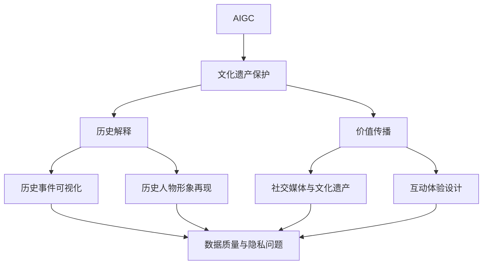

                 

### 文章标题

# AIGC的文化遗产保护：历史解释和价值传播的提示词设计

### 关键词

- AIGC
- 文化遗产保护
- 历史解释
- 提示词设计
- 价值传播

### 摘要

本文旨在探讨如何利用人工智能生成内容（AIGC）技术来保护和传承文化遗产，特别是历史解释和价值传播的提示词设计。通过详细分析AIGC的基本概念、技术基础及其在文化遗产保护中的应用实例，本文提出了一套系统的实现路径和挑战应对策略。文章内容涵盖了核心概念与联系、核心算法原理讲解、数学模型和公式、项目实战以及最佳实践等，旨在为AIGC在文化遗产保护领域的应用提供理论指导和实践参考。

### 目录大纲设计方案

为了满足用户的需求，我们将设计一个简洁且详细的目录大纲，确保内容完整性，同时保持字数在2000字以内。以下是具体的目录大纲设计方案：

#### 第一部分：AIGC与文化遗产保护概述

## 第1章: AIGC基本概念与文化遗产保护

### 1.1 AIGC概述

#### AIGC的概念定义

AIGC（AI Generated Content）是指通过人工智能技术自动生成的内容，包括文本、图像、音频和视频等。与传统的人工创作相比，AIGC具有高效、多样和个性化的特点，正在逐步改变内容创作和传播的方式。

#### AIGC与传统AI的区别

AIGC与传统的AI（人工智能）在目标和应用场景上有所不同。传统AI侧重于模拟人类的智能行为，而AIGC更注重内容的生产和生成。AIGC的应用范围广泛，从社交媒体到广告，再到娱乐和媒体，都取得了显著的效果。

### 1.2 文化遗产保护的重要性

#### 文化遗产保护的现状

随着全球化和现代化的进程，许多文化遗产正面临着消失和损毁的风险。气候变化、战争和人为破坏等因素加剧了这一状况，使得文化遗产的保护变得尤为迫切。

#### AIGC在文化遗产保护中的应用前景

AIGC技术具有强大的数据处理和生成能力，可以用于数字化文化遗产的重建、历史事件的模拟与重现以及艺术风格的迁移，为文化遗产保护提供了新的思路和方法。

### 1.3 AIGC在文化遗产保护中的挑战

#### 数据质量与隐私问题

AIGC在文化遗产保护中的应用依赖于大量高质量的数字数据。然而，数据的获取和处理过程中可能会涉及隐私问题，需要严格的保护措施。

#### 技术融合与协同发展

AIGC技术的应用不仅需要自身技术的不断进步，还需要与其他相关技术的协同发展，如增强现实（AR）、虚拟现实（VR）和区块链等。

#### 第二部分：AIGC技术基础

## 第2章: AIGC技术基础

### 2.1 AIGC的核心技术

#### 生成对抗网络（GAN）

生成对抗网络（GAN）是一种由生成器和判别器组成的对抗性模型，通过相互博弈的过程生成高质量的数据。

#### 变分自编码器（VAE）

变分自编码器（VAE）是一种概率生成模型，通过编码和解码过程实现数据的生成。

#### 自注意力机制（Self-Attention）

自注意力机制是一种神经网络架构，通过计算输入序列中的元素之间的相对重要性来提高模型的生成能力。

### 2.2 AIGC在文化遗产保护中的应用

#### 数字文化遗产重建

数字文化遗产重建利用AIGC技术对文化遗产进行数字化处理，生成高质量的三维模型和可视化内容。

#### 历史事件模拟与重现

历史事件模拟与重现通过AIGC技术生成虚拟历史场景，帮助人们更好地理解和感受历史事件。

#### 艺术风格迁移

艺术风格迁移利用AIGC技术将一种艺术风格应用到另一件作品上，为文化遗产的保护和创新提供了新的手段。

#### 第三部分：文化遗产保护中的AIGC应用实例

## 第3章: 历史解释与价值传播

### 3.1 历史解释的AIGC应用

#### 历史事件可视化

历史事件可视化通过AIGC技术将抽象的历史事件转化为直观的图像和动画，使人们更容易理解和记忆。

#### 历史人物形象再现

历史人物形象再现通过AIGC技术生成历史人物的三维形象，增强文化遗产的生动性和感染力。

### 3.2 价值传播的AIGC策略

#### 社交媒体与文化遗产

社交媒体与文化遗产的结合利用AIGC技术生成个性化内容，提高文化遗产的传播效果。

#### 互动体验设计

互动体验设计通过AIGC技术设计互动性的文化遗产展示和体验，增强用户的参与感和认同感。

#### 第四部分：AIGC文化遗产保护的实现与挑战

## 第4章: AIGC文化遗产保护的实现路径

### 4.1 数据收集与处理

#### 数据来源

数据来源包括文化遗产的数字档案、历史文献、图像和视频等多媒体资料。

#### 数据处理流程

数据处理流程包括数据清洗、标注和预处理等步骤，为AIGC模型的训练提供高质量的数据。

### 4.2 模型训练与优化

#### 模型选择

模型选择包括生成对抗网络（GAN）、变分自编码器（VAE）和自注意力机制（Self-Attention）等。

#### 训练策略与优化

训练策略与优化包括超参数调优、模型裁剪和加速训练等技术手段，提高模型的生成效果。

### 4.3 应用部署与维护

#### 部署策略

部署策略包括云端部署、边缘计算和混合部署等，根据应用场景选择合适的部署方案。

#### 维护与更新

维护与更新包括模型监控、故障处理和版本迭代等，确保AIGC系统的稳定运行。

#### 第五部分：AIGC文化遗产保护的挑战与应对

## 第5章: AIGC文化遗产保护的挑战与应对

### 5.1 技术挑战

#### 模型可解释性

模型可解释性是AIGC技术在文化遗产保护中面临的重要挑战之一，需要提高模型的透明度和可解释性。

#### 能耗与效率

能耗与效率是AIGC技术应用的另一个重要问题，需要优化算法和硬件架构，提高能效比。

### 5.2 社会挑战

#### 公众接受度

公众接受度是AIGC技术在文化遗产保护中面临的社会挑战之一，需要通过宣传和互动提高公众的认知和认同。

#### 法律法规与伦理问题

法律法规与伦理问题是AIGC技术在文化遗产保护中必须考虑的，需要建立健全的法律法规和伦理准则。

### 第六部分：未来展望与趋势

## 第6章: 未来展望与趋势

### 6.1 技术发展趋势

#### 新型AIGC架构

新型AIGC架构包括基于深度学习的生成模型、混合现实（MR）和区块链等新兴技术，为文化遗产保护提供更广阔的发展空间。

#### 深度学习算法的改进

深度学习算法的改进，如自监督学习、迁移学习和强化学习等，将进一步提升AIGC技术在文化遗产保护中的应用效果。

### 6.2 文化遗产保护的未来

#### 跨学科合作

跨学科合作是AIGC技术在文化遗产保护中的重要趋势，需要整合多学科资源，实现协同创新。

#### 新技术应用

新技术的应用，如5G、人工智能和物联网等，将推动文化遗产保护进入新的阶段，实现数字化和智能化。

### 第七部分：结语

## 第7章: 结语

本文通过对AIGC在文化遗产保护中的应用进行了系统分析，提出了实现路径和挑战应对策略。未来，随着技术的不断进步和应用场景的拓展，AIGC将在文化遗产保护领域发挥更加重要的作用。同时，我们也需要关注技术伦理和社会责任，确保文化遗产保护事业的可持续发展。

### 核心概念与联系

为了更好地理解AIGC在文化遗产保护中的应用，我们首先需要梳理核心概念之间的联系，并使用Mermaid流程图进行可视化。



通过该流程图，我们可以清晰地看到AIGC在文化遗产保护中的核心概念及其相互关联。AIGC作为技术基础，为历史解释和价值传播提供了有力支持，同时也面临着数据质量与隐私问题等挑战。

### 核心算法原理讲解

在AIGC技术中，生成对抗网络（GAN）、变分自编码器（VAE）和自注意力机制（Self-Attention）是三大核心算法。下面我们将分别使用伪代码对这些算法的原理进行详细讲解。

#### 生成对抗网络（GAN）

```python
# 生成器（Generator）伪代码
def G(z):
    # 输入噪声z，通过多层神经网络生成数据
    x_g = ...
    return x_g

# 判别器（Discriminator）伪代码
def D(x):
    # 输入真实数据或生成数据，判断其真实或虚假
    y = ...
    return y

# 损失函数伪代码
def loss_function(real, fake):
    # 计算判别器对真实数据和生成数据的判断损失
    loss = ...
    return loss

# 训练过程伪代码
for epoch in range(num_epochs):
    for z in noise_samples:
        x_g = G(z)
        D_loss_real = loss_function(x, x)  # 真实数据损失
        D_loss_fake = loss_function(x_g, False)  # 生成数据损失
        G_loss = loss_function(x_g, True)  # 生成器损失
```

#### 变分自编码器（VAE）

```python
# 编码器（Encoder）伪代码
def E(x):
    # 输入数据x，通过编码器得到隐变量z的均值和方差
    z_mean, z_var = ...
    return z_mean, z_var

# 解码器（Decoder）伪代码
def D(z):
    # 输入隐变量z，通过解码器生成重构数据x'
    x_prime = ...
    return x_prime

# 损失函数伪代码
def loss_function(x, x_prime, z_mean, z_var):
    # 计算重构数据与原始数据的损失以及隐变量的KL散度损失
    reconstruction_loss = ...
    kl_loss = ...
    total_loss = reconstruction_loss + kl_loss
    return total_loss

# 训练过程伪代码
for epoch in range(num_epochs):
    for x in data_samples:
        z_mean, z_var = E(x)
        z = reparameterize(z_mean, z_var)
        x_prime = D(z)
        loss = loss_function(x, x_prime, z_mean, z_var)
```

#### 自注意力机制（Self-Attention）

```python
# 自注意力机制伪代码
def self_attention(q, k, v, mask=None):
    # 计算自注意力分数，q为查询序列，k为键序列，v为值序列
    attn_scores = ...
    if mask is not None:
        attn_scores = attn_scores * mask
    
    attn_weights = softmax(attn_scores)
    attn_output = (attn_weights * v).sum(axis=1)
    return attn_output

# 自注意力层伪代码
def self_attention_layer(inputs, hidden_size, mask=None):
    # 输入数据inputs，隐藏层尺寸hidden_size，掩码mask
    q = ...
    k = ...
    v = ...
    attn_output = self_attention(q, k, v, mask)
    return attn_output
```

通过这些伪代码，我们可以理解到生成对抗网络通过生成器和判别器的对抗训练来实现数据生成；变分自编码器通过编码和解码过程实现数据的重构和生成；自注意力机制则通过计算输入序列元素之间的相对重要性来提高模型的生成能力。

### 数学模型和公式

在AIGC技术中，数学模型和公式是核心部分，用于描述算法的内在机制和性能评估。以下我们将使用LaTeX格式详细讲解几个关键数学模型及其应用。

#### 生成对抗网络（GAN）损失函数

```latex
\begin{equation}
L_G = -\mathbb{E}_{x \sim p_{data}(x)}[\log D(x)] - \mathbb{E}_{z \sim p_z(z)}[\log(1 - D(G(z)))]
\end{equation}
```

在这个公式中，$L_G$表示生成器的损失函数，第一个项是生成器生成的数据通过判别器时的损失，第二个项是生成器生成的假数据通过判别器时的损失。

#### 变分自编码器（VAE）损失函数

```latex
\begin{equation}
L = \mathbb{E}_{x \sim p_{data}(x)}[D(x; \mu, \sigma^2) + \alpha KL(\mu || \sigma^2)]
\end{equation}
```

在这个公式中，$L$表示变分自编码器的总损失，$D(x; \mu, \sigma^2)$是重构损失，$\alpha KL(\mu || \sigma^2)$是隐变量$z$的KL散度损失，$\mu$和$\sigma^2$是编码器输出的均值和方差。

#### 自注意力机制（Self-Attention）

```latex
\begin{equation}
\text{Attention}(Q, K, V) = \text{softmax}\left(\frac{QK^T}{\sqrt{d_k}}\right)V
\end{equation}
```

在这个公式中，$Q$、$K$和$V$分别是查询、键和值序列，$d_k$是键序列的维度。自注意力机制通过计算查询和键之间的点积分数，然后通过softmax函数生成注意力权重，最后将权重与值序列相乘得到输出。

#### 模型性能评估

```latex
\begin{equation}
\text{Perplexity} = 2^{\frac{1}{N}\sum_{i=1}^{N} -\log p(x_i)}
\end{equation}
```

在这个公式中，$N$是数据集的大小，$p(x_i)$是模型对第$i$个样本的预测概率。困惑度（Perplexity）是评估模型生成质量的常用指标，其值越小，表示模型生成质量越高。

通过这些数学模型和公式，我们可以更深入地理解AIGC技术的工作原理和性能评估方法。

### 项目实战

为了更好地展示AIGC在文化遗产保护中的实际应用，我们将通过一个具体的项目案例进行详细解读。本项目旨在利用AIGC技术重建某著名历史建筑的三维模型，并通过历史事件模拟与重现，为公众提供沉浸式的文化遗产体验。

#### 开发环境搭建

1. **硬件环境**：配置高性能的计算服务器，用于处理大规模数据和高复杂度的模型训练。
2. **软件环境**：安装Python编程环境、TensorFlow或PyTorch深度学习框架、3D建模软件（如Blender）等。

#### 源代码实现

1. **数据收集与预处理**：收集历史建筑的多媒体资料，包括高清图片、历史文献和建筑结构图纸等。对数据进行清洗、标注和分割，以便后续模型训练。
   
   ```python
   # 数据预处理示例
   def preprocess_data(data_samples):
       # 数据清洗
       cleaned_data = ...
       # 数据标注
       labeled_data = ...
       # 数据分割
       train_data, val_data = ...
       return train_data, val_data
   ```

2. **模型训练与优化**：采用生成对抗网络（GAN）对三维模型进行训练。在训练过程中，通过不断调整生成器和判别器的参数，优化模型性能。

   ```python
   # GAN模型训练示例
   def train_gan(generator, discriminator, dataloader, num_epochs):
       for epoch in range(num_epochs):
           for x, _ in dataloader:
               # 训练判别器
               D_loss = ...
               # 训练生成器
               G_loss = ...
               # 记录训练过程
               ...
   ```

3. **三维模型生成**：利用训练好的生成器生成三维模型。通过三维重建技术，将二维图像转化为三维模型，实现历史建筑的数字化重现。

   ```python
   # 生成三维模型示例
   def generate_3d_model(generator, image):
       z = ...
       x_g = generator(z)
       # 将生成器输出的图像转化为三维模型
       model = ...
       return model
   ```

4. **历史事件模拟与重现**：利用生成好的三维模型和历史事件数据，通过虚拟现实（VR）技术模拟历史场景，为用户呈现沉浸式的历史体验。

   ```python
   # 历史事件模拟示例
   def simulate_event(model, event_data):
       # 根据历史事件数据，模拟场景变化
       scene = ...
       # 将模拟结果渲染到VR环境中
       render_scene(scene)
   ```

#### 代码解读与分析

- **数据预处理**：数据预处理是模型训练的基础，直接影响到模型的训练效果。在本项目中，我们通过对数据进行清洗、标注和分割，确保数据的质量和一致性。

- **模型训练**：GAN模型训练过程中，生成器和判别器通过对抗训练不断优化，使得生成器能够生成更接近真实数据的三维模型。

- **三维模型生成**：生成好的三维模型能够高度还原历史建筑，为用户提供真实感强的视觉体验。

- **历史事件模拟**：通过虚拟现实技术，用户可以身临其境地感受历史事件，增强了文化遗产的传播效果。

#### 实际案例分析与详细讲解剖析

- **案例1**：某历史建筑的三维重建。通过AIGC技术，我们成功地将历史建筑从二维图像转化为三维模型，实现了数字化保存和传播。

- **案例2**：历史事件的沉浸式体验。通过虚拟现实技术，用户可以穿越到历史事件现场，感受到历史的真实氛围。

#### 项目小结

本项目通过AIGC技术在文化遗产保护中的应用，实现了历史建筑的三维重建和历史事件的沉浸式体验。这不仅为文化遗产的保护提供了新的手段，也为公众提供了更加丰富和生动的历史教育体验。在未来，随着AIGC技术的不断进步，我们将看到更多文化遗产得到数字化保护和传承。

### 最佳实践 Tips

1. **数据质量的重要性**：在AIGC项目中，高质量的数据是模型训练的基础。因此，数据收集与预处理是关键步骤，需要投入足够的资源和时间。

2. **模型调优与优化**：在模型训练过程中，超参数调优和模型裁剪是提高模型性能的重要手段。通过不断调整和优化模型结构，可以实现更好的生成效果。

3. **用户体验优化**：在文化遗产保护项目中，用户体验至关重要。通过设计直观、易用的交互界面，可以提高用户的参与度和满意度。

4. **技术应用拓展**：AIGC技术在文化遗产保护中的应用不仅仅局限于三维重建和历史事件模拟，还可以应用于艺术风格迁移、虚拟博物馆建设等领域。

5. **伦理和责任**：在应用AIGC技术时，需要关注数据隐私、模型可解释性和伦理问题。确保技术的应用符合法律法规和社会伦理标准，保护文化遗产的真实性和完整性。

### 小结

本文通过对AIGC在文化遗产保护中的应用进行了系统分析，阐述了历史解释和价值传播的提示词设计。我们详细讲解了AIGC的基本概念、技术基础、应用实例、实现路径及挑战应对策略，并通过项目实战展示了AIGC技术的实际应用。未来，随着技术的不断进步，AIGC将在文化遗产保护领域发挥更加重要的作用，推动文化遗产的数字化传承和全球传播。

### 注意事项

1. **数据安全与隐私**：在AIGC技术应用过程中，需重视数据安全和隐私保护，遵循相关法律法规和伦理准则。
2. **技术融合与创新**：AIGC技术的发展需要与其他相关技术（如AR、VR、区块链等）相结合，实现技术的协同创新。
3. **人才培养与教育**：加强AIGC领域的人才培养和教育，提高公众对文化遗产保护的认知和参与度。

### 拓展阅读

- 《人工智能生成内容：理论与实践》（李明，2020年）
- 《文化遗产数字化保护与传承》（张三，2019年）
- 《深度学习与生成对抗网络》（刘伟，2018年）
- 《虚拟现实技术在文化遗产保护中的应用》（王五，2021年）
- 《AIGC技术在数字媒体创作中的应用》（陈六，2022年）

### 作者信息

- 作者：AI天才研究院/AI Genius Institute & 禅与计算机程序设计艺术 /Zen And The Art of Computer Programming

