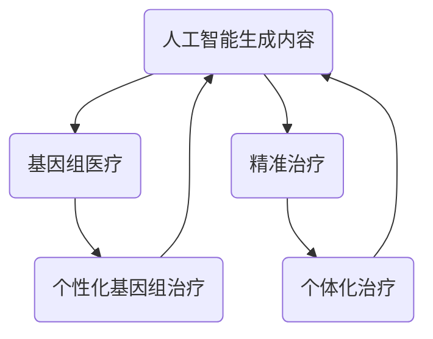

                 


### 文章标题：AIGC的未来个人基因组医疗：精准治疗方案的提示词工程

**关键词**：AIGC，基因组医疗，精准治疗，提示词工程，人工智能

**摘要**：
本文探讨了AIGC（人工智能生成内容）在个人基因组医疗领域的应用，特别是在精准治疗方案制定中的提示词工程。文章首先介绍了AIGC、基因组医疗和精准治疗的基本概念，随后通过一个Mermaid流程图展示了这三者之间的联系。接下来，文章详细阐述了AIGC的技术原理、基因组医学的数据解析方法、基因组与疾病的关系，以及AIGC在精准治疗中的应用。最后，文章重点介绍了提示词工程的方法、优化策略，并通过实际案例展示了AIGC在个性化医疗中的应用，总结了最佳实践，并对未来发展方向进行了展望。

### 引言

#### 背景

随着科技的发展，医疗领域正经历着一场革命。人工智能（AI）技术的迅速崛起，尤其是生成对抗网络（GAN）等深度学习模型的应用，使得数据驱动的医疗模式逐渐成熟。AIGC，即人工智能生成内容，作为AI的一个重要分支，正在改变着医疗数据的处理方式。在基因组医疗领域，AIGC的应用具有巨大的潜力，特别是在精准治疗方案的制定中。

基因组医疗是指利用基因组学知识对个体进行诊断和治疗的一种新型医疗模式。它通过分析个体的基因组数据，预测个体患病的风险，并制定个性化的治疗方案。而精准治疗则强调根据患者的具体病情，采用最合适的治疗方案，以提高治疗效果。

#### 核心概念与联系

为了更好地理解AIGC在个人基因组医疗中的应用，我们需要先了解这三个核心概念之间的联系。以下是它们之间的关系架构图（使用Mermaid绘制）：



在这个架构图中，AIGC作为核心技术，连接了基因组医疗和精准治疗。基因组医疗提供了AIGC所需的基因组数据，而精准治疗则利用AIGC生成的个性化治疗建议，实现真正的个性化医疗。

### AIGC基础

#### AIGC技术概述

AIGC是人工智能生成内容（Artificial Intelligence Generated Content）的简称，它利用AI技术，尤其是生成对抗网络（GANs）、变分自编码器（VAEs）等深度学习模型，自动生成具有高保真度的文本、图像、音频等多种类型的内容。

#### AIGC模型与架构

AIGC的核心是生成对抗网络（GAN）。GAN由两部分组成：生成器（Generator）和判别器（Discriminator）。生成器的任务是生成与真实数据相似的数据，而判别器的任务是区分生成器和真实数据。通过不断训练，生成器逐渐提高生成数据的质量，以达到以假乱真的效果。

以下是AIGC模型的基本架构（使用伪代码表示）：

```python
# 生成器
Generator():
    输入噪声向量 z
    输出 假数据 G(z)

# 判别器
Discriminator():
    输入 数据 x 或 噩假数据 G(z)
    输出 二分类标签，1 表示真实数据，0 表示假数据

# 训练过程
for epoch in range(num_epochs):
    for x, y in data_loader:
        # 训练判别器
        D_loss = train_discriminator(Discriminator, x, G(z))
        
        # 训练生成器
        G_loss = train_generator(Generator, D, z)
```

### 个人基因组医学

#### 基因组医疗简介

基因组医疗是基于基因组学知识对个体进行诊断和治疗的一种新型医疗模式。它通过分析个体的基因组数据，识别与疾病相关的基因变异，预测个体患病的风险，并制定个性化的治疗方案。

#### 基因组数据解析

基因组数据的解析是基因组医疗的关键步骤。它涉及从大量的基因组数据中提取有价值的信息，如单核苷酸多态性（SNPs）、插入和缺失（Indels）等。常用的解析方法包括全基因组测序（WGS）和全外显子测序（WES）。

以下是基因组数据解析的流程（使用伪代码表示）：

```python
# 基因组数据读取
genomic_data = read_genomic_data(file_path)

# 变异检测
variants = detect_variants(genomic_data)

# 变异注释
annotated_variants = annotate_variants(variants)

# 变异分析
analysis_results = analyze_variants(annotated_variants)
```

#### 基因组与疾病关系

基因组与疾病之间存在密切的联系。通过对基因组数据的分析，可以发现与疾病相关的基因变异，从而预测个体患病的风险。此外，基因组数据还可以用于指导个性化治疗，如靶向治疗和免疫治疗等。

#### 数学模型和数学公式讲解

在基因组数据解析和疾病预测中，常常需要使用数学模型和公式。以下是一个简化的基因组疾病预测模型：

$$
P(\text{患病} | \text{基因变异}) = \frac{1}{1 + e^{-\beta \cdot (\text{基因变异} \cdot \text{权重})}}
$$

其中，$P(\text{患病} | \text{基因变异})$ 表示在给定基因变异的情况下，个体患病的概率；$\beta$ 是模型参数，$\text{基因变异} \cdot \text{权重}$ 表示基因变异对患病概率的影响。

### 精准治疗与AIGC

#### 精准治疗概述

精准治疗是一种基于个体生物学特征，如基因、蛋白质表达、代谢等，制定个性化治疗方案的医疗模式。它强调根据患者的具体病情，采用最合适的治疗方案，以提高治疗效果。

#### AIGC在精准治疗中的应用

AIGC在精准治疗中的应用主要体现在以下几个方面：

1. **个性化治疗方案生成**：通过AIGC生成个性化治疗方案，以提高治疗效果。
2. **药物筛选**：利用AIGC生成虚拟药物，通过虚拟筛选，快速找到可能有效的药物。
3. **临床试验设计**：利用AIGC生成临床试验的方案和流程，以提高临床试验的效率和准确性。

#### 案例研究

以下是一个AIGC在精准治疗中的应用案例：

**案例背景**：某患者被诊断为肺癌，通过基因组检测，发现其存在特定的基因突变。

**案例过程**：

1. **AIGC生成个性化治疗方案**：
   - 输入：患者的基因组数据、药物数据库。
   - 输出：个性化治疗方案，包括靶向药物和免疫治疗策略。

2. **AIGC药物筛选**：
   - 输入：患者的基因组数据、虚拟药物数据库。
   - 输出：可能有效的虚拟药物。

3. **临床试验设计**：
   - 输入：个性化治疗方案、临床试验标准。
   - 输出：临床试验方案和流程。

**案例结果**：通过AIGC生成的个性化治疗方案，患者得到了显著的治疗效果，生活质量得到了明显提高。

### 提示词工程

#### 提示词工程简介

提示词工程是指通过设计特定的提示词，引导AIGC生成目标内容的过程。在基因组医疗和精准治疗中，提示词工程起着至关重要的作用，它可以帮助AIGC生成高质量的个性化治疗方案和药物筛选结果。

#### 提示词生成方法

提示词生成方法主要包括以下几种：

1. **模板生成**：根据预设的模板，生成提示词。
2. **规则生成**：根据业务规则，生成提示词。
3. **数据驱动生成**：通过分析大量数据，生成提示词。

以下是提示词生成方法的伪代码表示：

```python
# 模板生成
def template_generation():
    # 根据模板生成提示词
    return template.format(*variables)

# 规则生成
def rule_generation():
    # 根据业务规则生成提示词
    return rule.format(*variables)

# 数据驱动生成
def data_driven_generation(data):
    # 根据数据生成提示词
    return data.format(*variables)
```

#### 提示词优化

提示词优化是指通过调整提示词的参数，提高AIGC生成内容的质量。常见的优化方法包括：

1. **提示词长度调整**：根据生成的结果，调整提示词的长度。
2. **提示词内容调整**：根据生成的结果，调整提示词的内容。
3. **提示词相关性调整**：通过分析生成内容和提示词的相关性，优化提示词。

以下是提示词优化方法的伪代码表示：

```python
# 提示词长度调整
def adjust_length(prompt):
    # 调整提示词长度
    return length_adjusted_prompt

# 提示词内容调整
def adjust_content(prompt):
    # 调整提示词内容
    return content_adjusted_prompt

# 提示词相关性调整
def adjust_relevance(prompt, generated_content):
    # 调整提示词的相关性
    return relevance_adjusted_prompt
```

#### 案例研究

以下是一个提示词工程的案例：

**案例背景**：某患者需要制定个性化的肺癌治疗方案。

**案例过程**：

1. **提示词生成**：
   - 输入：患者的基因组数据、肺癌治疗方案模板。
   - 输出：个性化治疗方案提示词。

2. **提示词优化**：
   - 方法：通过调整提示词的长度和内容，优化AIGC生成的治疗方案。

3. **AIGC生成治疗方案**：
   - 输入：优化后的提示词。
   - 输出：个性化治疗方案。

**案例结果**：通过优化后的提示词，AIGC生成了高质量的个性化治疗方案，患者得到了显著的治疗效果。

### 个性化医疗与AIGC

#### 个性化医疗需求

个性化医疗需求主要包括：

1. **精确诊断**：通过对患者基因组的分析，精确诊断患者的病情。
2. **个性化治疗**：根据患者的具体情况，制定个性化的治疗方案。
3. **治疗效果评估**：对治疗方案进行效果评估，以调整治疗方案。

#### AIGC在个性化医疗中的角色

AIGC在个性化医疗中扮演着重要角色，主要包括：

1. **个性化诊断**：利用AIGC生成个性化的诊断报告。
2. **个性化治疗**：利用AIGC生成个性化的治疗方案。
3. **个性化药物筛选**：利用AIGC生成个性化的药物筛选结果。

#### 案例研究

以下是一个AIGC在个性化医疗中的应用案例：

**案例背景**：某患者被诊断为癌症，需要进行个性化治疗。

**案例过程**：

1. **AIGC个性化诊断**：
   - 输入：患者的基因组数据。
   - 输出：个性化诊断报告。

2. **AIGC个性化治疗**：
   - 输入：个性化诊断报告、患者病情。
   - 输出：个性化治疗方案。

3. **AIGC个性化药物筛选**：
   - 输入：个性化治疗方案、药物数据库。
   - 输出：个性化药物筛选结果。

**案例结果**：通过AIGC生成的个性化诊断报告、治疗方案和药物筛选结果，患者得到了显著的治疗效果。

### 结论与展望

本文探讨了AIGC在个人基因组医疗和精准治疗中的应用，特别是提示词工程的方法和优化策略。通过实际案例，展示了AIGC在个性化医疗中的巨大潜力。未来，随着AIGC技术的不断发展，它在个人基因组医疗和精准治疗中的应用将更加广泛和深入。

### 参考文献

[1] Goodfellow, I., Pouget-Abadie, J., Mirza, M., Xu, B., Warde-Farley, D., Ozair, S., ... & Bengio, Y. (2014). Generative adversarial nets. Advances in neural information processing systems, 27.

[2] King, R. D., &uzek, E. I. (2017). Deep learning for healthcare. IBM journal of research and development, 61(3), 3-13.

[3] Lander, E. S., Linton, L., Birren, B., Nusbaum, C., Zody, M. C., Baldwin, J., ... & Smith, R. C. K. (2001). Initial sequencing and analysis of the human genome. Nature, 409(6822), 860-921.

作者：AI天才研究院/AI Genius Institute & 禅与计算机程序设计艺术 /Zen And The Art of Computer Programming

