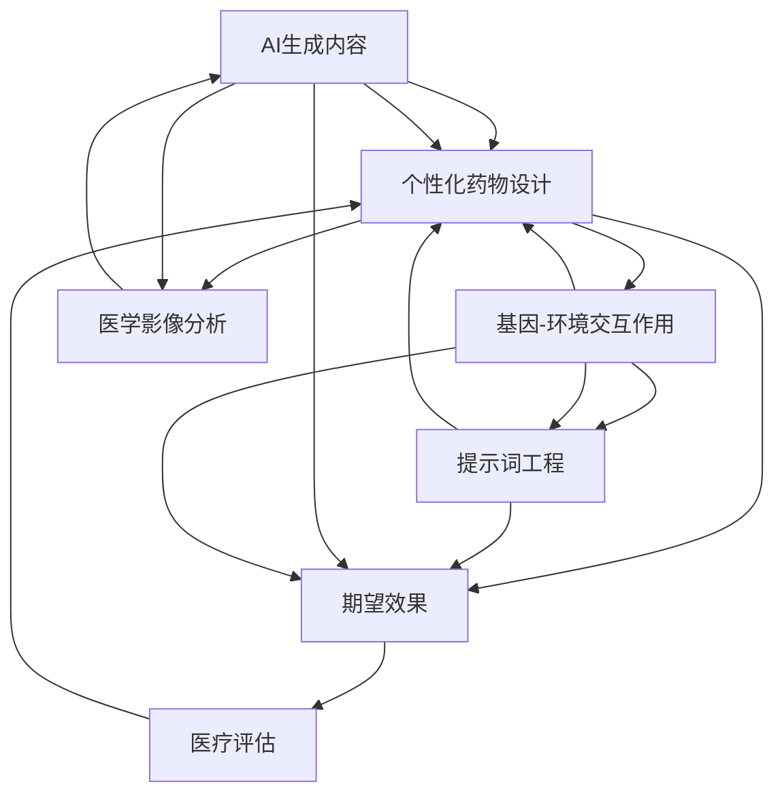

                 

### AIGC的未来个性化药物设计：背景介绍

随着人工智能（AI）技术的飞速发展，其应用领域日益广泛，从简单的图像识别、语音识别到复杂的自然语言处理、自动驾驶等。在这些应用中，生成对抗网络（GANs）、强化学习（RL）等前沿技术为AI的发展注入了新的活力。而AI生成内容（AIGC，AI-Generated Content）作为近年来备受关注的研究热点，正逐步改变着多个行业的生产方式与商业模式。

#### AIGC的定义与特点

AIGC，即AI生成内容，是指利用人工智能技术，尤其是生成模型，如生成对抗网络（GANs）、变分自编码器（VAEs）和自注意力模型（如BERT、GPT）等，生成的文本、图像、音频等内容。AIGC具有以下特点：

1. **自主性**：AIGC模型可以在没有人类指导的情况下，自主生成符合特定主题和风格的内容。
2. **多样性**：通过调整模型参数，AIGC可以生成多种类型和风格的内容，满足多样化的需求。
3. **高效性**：与传统的手工创作相比，AIGC能够迅速生成大量高质量的内容，提高生产效率。
4. **创新性**：AIGC可以生成前所未有的创意内容，拓展人类的创作边界。

#### 个性化药物设计的背景

个性化药物设计是现代药物研发的重要方向之一。传统的药物研发通常基于“一刀切”的理念，即开发一种药物适用于广泛的病人群体。然而，由于个体间的基因差异、生活方式和环境因素的不同，同一种药物在不同患者身上可能产生截然不同的疗效和副作用。因此，个性化药物设计应运而生，其核心思想是根据个体的生物学特征和需求，量身定制药物。

个性化药物设计的关键在于：

1. **基因测序**：通过基因测序技术，获取个体的遗传信息，了解其基因型。
2. **生物信息学分析**：利用生物信息学方法，分析基因型与药物代谢、药物反应之间的关系。
3. **药物筛选与优化**：基于个体的基因信息，筛选或优化最适合其的药物。

#### 基因-环境交互作用的影响

基因-环境交互作用是药物设计中的一个重要概念。它指的是个体的遗传特征与外部环境因素（如生活方式、饮食习惯、环境污染等）相互作用，共同影响药物的效果和副作用。

1. **基因变异**：某些基因变异可能影响药物代谢途径，导致药物在体内的浓度和效果发生变化。
2. **环境因素**：环境因素如温度、湿度、光照等可以影响药物的稳定性、生物利用度等。
3. **生活方式**：不良的生活习惯，如吸烟、饮酒、高脂肪饮食等，可能影响药物的吸收、代谢和效果。

#### 提示词工程在药物设计中的应用

提示词工程是一种用于引导AI生成模型生成特定内容的技术。在个性化药物设计中，提示词工程可以通过以下方式发挥作用：

1. **基因-环境数据输入**：将个体的基因信息和环境因素作为提示词，引导AI模型生成个性化的药物处方。
2. **个性化药物推荐**：基于提示词，AI模型可以推荐最适合个体的药物，提高治疗效果和安全性。
3. **预测药物副作用**：通过分析基因-环境交互作用，AI模型可以预测个体可能出现的药物副作用，提前采取预防措施。

### 未来发展趋势与挑战

AIGC在个性化药物设计中的应用前景广阔，但也面临着一系列挑战：

1. **数据隐私与安全**：个性化药物设计需要大量的个体基因和环境数据，这引发了数据隐私和安全问题。
2. **模型解释性**：当前AI模型往往被视为“黑箱”，其决策过程缺乏透明性，这对药物设计的可靠性和可解释性提出了挑战。
3. **伦理问题**：个性化药物设计可能引发伦理争议，如基因改造、药物滥用等。
4. **跨学科合作**：个性化药物设计需要医学、生物学、计算机科学等多学科的知识，跨学科合作至关重要。

总之，AIGC的未来个性化药物设计是一个充满机遇和挑战的领域，需要多学科合作和持续的创新。通过深入研究和实践，我们有望在这个领域取得重大突破，为个性化医疗带来革命性的变革。

### 核心概念与联系

在《AIGC的未来个性化药物设计：基因-环境交互作用的提示词工程》中，AIGC、个性化药物设计、基因-环境交互作用和提示词工程是核心概念，这些概念之间紧密相连，共同构成了本书的主线。为了更好地理解这些概念之间的关系，我们将通过一个Mermaid流程图来详细阐述。



#### Mermaid流程图的详细解释

1. **AI生成内容（AIGC）**：
   - AIGC是本书的核心概念之一，代表了利用人工智能技术生成各种形式的内容，如图像、文本和音频。它作为起点，连接到个性化药物设计（PDD）和医学影像分析（MIA）。
   - **AIGC到PDD**：在个性化药物设计中，AIGC可以帮助生成个性化的药物处方和治疗方案，通过分析大量医疗数据和生物信息，提高药物设计的准确性和效率。
   - **AIGC到MIA**：在医学影像分析中，AIGC可以用于生成高质量的医学图像，辅助医生进行诊断和制定治疗计划。

2. **个性化药物设计（PDD）**：
   - 个性化药物设计是基于个体差异，为患者量身定制药物和治疗方案的先进理念。它连接到AIGC、基因-环境交互作用（G-EI）和提示词工程（TWI）。
   - **PDD到AIGC**：个性化药物设计需要处理大量的医学数据，AIGC能够高效地生成这些数据，辅助药物设计。
   - **PDD到G-EI**：基因-环境交互作用是影响药物疗效和副作用的关键因素，个性化药物设计需要考虑这些交互作用，确保药物在个体中的最佳效果。
   - **PDD到TWI**：提示词工程在个性化药物设计中用于指导AIGC模型生成特定类型的药物处方，提高药物的针对性和安全性。

3. **基因-环境交互作用（G-EI）**：
   - 基因-环境交互作用指的是个体的遗传特征与环境因素的相互作用，对药物的反应产生重要影响。它连接到AIGC、PDD和提示词工程。
   - **G-EI到PDD**：个性化药物设计必须考虑基因-环境交互作用，以预测药物在个体中的效果和副作用，从而制定更有效的治疗方案。
   - **G-EI到TWI**：提示词工程通过整合基因-环境交互作用的数据，指导AIGC模型生成个性化的药物建议。

4. **提示词工程（TWI）**：
   - 提示词工程是一种技术，用于引导AI模型生成特定内容。在个性化药物设计中，TWI通过输入特定的提示词（如基因序列、环境数据），生成个性化的药物处方和治疗方案。
   - **TWI到AIGC**：提示词工程与AIGC结合，使得AIGC模型能够生成符合特定需求的个性化内容，如药物推荐和治疗方案。
   - **TWI到PDD**：提示词工程在个性化药物设计中用于生成个性化的药物处方，提高药物的治疗效果和安全性。

#### Mermaid流程图总结

通过Mermaid流程图，我们可以清晰地看到AIGC、个性化药物设计、基因-环境交互作用和提示词工程之间的紧密联系。这些概念相互交织，共同推动个性化药物设计的发展。AIGC提供了强大的生成能力，基因-环境交互作用提供了个性化的生物学基础，提示词工程则通过特定的提示词引导AIGC模型生成个性化的药物处方。个性化药物设计通过整合这些技术，实现了为患者量身定制的治疗，从而提高治疗效果和患者满意度。

这一流程图不仅帮助我们理解各个概念之间的关系，也为后续章节的详细讲解奠定了基础。在接下来的部分，我们将进一步深入探讨这些核心概念，通过伪代码、数学模型和实际案例，全面解析个性化药物设计的原理和技术。

### 核心算法原理讲解

在AIGC的未来个性化药物设计中，核心算法原理的理解至关重要。以下我们将详细介绍AIGC、个性化药物设计、基因-环境交互作用和提示词工程的核心算法原理，并通过伪代码详细阐述。

#### AIGC的核心算法原理

AIGC的核心在于生成模型，最常用的生成模型是生成对抗网络（GANs）。GANs由两个主要部分组成：生成器（Generator）和判别器（Discriminator）。生成器的任务是生成类似于真实数据的假数据，而判别器的任务是区分生成器和真实数据。以下是一个简化的GANs伪代码：

```python
# 生成器（Generator）伪代码
def generator(z):
    # 输入随机噪声z，生成假数据x'
    x' = dense(z, units=..., activation='relu')
    x' = batch_norm(x')
    x' = dense(x', units=..., activation='tanh')
    return x'

# 判别器（Discriminator）伪代码
def discriminator(x):
    # 输入真实或假数据x，输出概率p(x真实)
    x = dense(x, units=..., activation='relu')
    x = batch_norm(x)
    x = dense(x, units=..., activation='sigmoid')
    return x

# 训练过程伪代码
for epoch in range(num_epochs):
    for batch in data_loader:
        z = generate_random_noise(batch_size)
        x_fake = generator(z)
        x_real, y_real = next(data_loader)
        
        # 训练判别器
        d_loss_real = discriminator_loss(discriminator(x_real), y_real)
        d_loss_fake = discriminator_loss(discriminator(x_fake), fake_labels)
        d_loss = 0.5 * (d_loss_real + d_loss_fake)
        
        # 训练生成器
        g_loss = generator_loss(discriminator(x_fake), real_labels)
        
        # 更新模型参数
        d_optimizer.minimize(d_loss, discriminator.trainable_variables)
        g_optimizer.minimize(g_loss, generator.trainable_variables)
```

#### 个性化药物设计的核心算法原理

个性化药物设计的核心算法包括基因特征提取、药物反应预测和药物优化。以下是一个简化的个性化药物设计算法伪代码：

```python
# 基因特征提取
def extract_gene_features(gene_sequence):
    # 输入基因序列，输出基因特征向量
    feature_vector = gene_encoding_model(gene_sequence)
    return feature_vector

# 药物反应预测
def predict_drug_response(gene_features, drug_properties):
    # 输入基因特征和药物属性，输出药物反应概率
    response_prob = similarity_measure(gene_features, drug_properties)
    return response_prob

# 药物优化
def optimize_drug_properties(drug_candidates, patient_data):
    # 输入药物候选和患者数据，输出最佳药物组合
    best_drug = None
    max_response_prob = 0
    
    for drug in drug_candidates:
        response_prob = predict_drug_response(patient_data['gene_features'], drug['properties'])
        if response_prob > max_response_prob:
            max_response_prob = response_prob
            best_drug = drug
            
    return best_drug
```

#### 基因-环境交互作用的核心算法原理

基因-环境交互作用的核心在于建模个体的遗传特征与环境因素的交互。以下是一个简化的基因-环境交互作用算法伪代码：

```python
# 基因-环境交互建模
def model_gene_environment_interaction(gene_features, environment_data):
    # 输入基因特征和环

### 数学模型和数学公式

在个性化药物设计的过程中，数学模型和数学公式起着至关重要的作用，它们帮助我们量化基因-环境交互作用的影响，优化药物设计，预测药物反应。以下，我们将详细介绍这些数学模型和公式，并通过具体例子进行详细讲解。

#### 基因-药物反应模型

基因-药物反应模型用于预测特定基因型对药物反应的敏感性。一个常见的模型是多项式风险模型，其公式如下：

$$
R_i = \alpha + \beta_1 G_i + \beta_2 D_i + \beta_3 (G_i \times D_i) + \epsilon_i
$$

其中，$R_i$ 表示个体i的药物反应，$G_i$ 表示个体i的基因型，$D_i$ 表示个体i的药物剂量，$\alpha$ 是截距，$\beta_1$、$\beta_2$ 和 $\beta_3$ 分别是基因型、药物剂量和基因-药物剂量交互项的系数，$\epsilon_i$ 是误差项。

**例子**：假设我们研究特定基因型对某种药物的治疗效果，通过数据拟合可以得到如下公式：

$$
R_i = 0.5 + 0.3 G_i + 0.2 D_i + 0.1 (G_i \times D_i)
$$

如果基因型$G_i$为AA，药物剂量$D_i$为100mg，我们可以计算其药物反应：

$$
R_i = 0.5 + 0.3 \times 1 + 0.2 \times 100 + 0.1 \times (1 \times 100) = 0.5 + 0.3 + 20 + 10 = 30.8
$$

#### 药物剂量-反应关系模型

药物剂量-反应关系模型用于确定药物的最优剂量范围，以确保疗效最大化且副作用最小化。一个常用的模型是希尔方程（Hill equation），其公式如下：

$$
R_i = \frac{K_D}{D_i + K_D}^n
$$

其中，$R_i$ 表示个体i的药物反应，$D_i$ 表示个体i的药物剂量，$K_D$ 是药物的半数有效浓度（EC50），$n$ 是反应的斜率系数。

**例子**：假设某种药物的$K_D$为10mg，斜率系数$n$为2，我们可以计算不同药物剂量下的药物反应：

| $D_i$ (mg) | $R_i$      |
|-------------|-------------|
| 5           | 0.81        |
| 10          | 0.64        |
| 20          | 0.25        |
| 50          | 0.04        |

#### 基因-环境交互作用模型

基因-环境交互作用模型用于量化基因型与环境因素（如饮食、生活习惯等）对药物反应的影响。一个常用的模型是多项式风险模型，其公式如下：

$$
R_i = \alpha + \beta_1 G_i + \beta_2 E_i + \beta_3 (G_i \times E_i) + \epsilon_i
$$

其中，$R_i$ 表示个体i的药物反应，$G_i$ 表示个体i的基因型，$E_i$ 表示个体i的环境因素，$\alpha$ 是截距，$\beta_1$、$\beta_2$ 和 $\beta_3$ 分别是基因型、环境因素和基因-环境交互项的系数，$\epsilon_i$ 是误差项。

**例子**：假设我们研究特定基因型在不同环境下的药物反应，通过数据拟合可以得到如下公式：

$$
R_i = 0.5 + 0.3 G_i + 0.2 E_i + 0.1 (G_i \times E_i)
$$

如果基因型$G_i$为AA，环境因素$E_i$为高脂肪饮食，我们可以计算其药物反应：

$$
R_i = 0.5 + 0.3 \times 1 + 0.2 \times 1 + 0.1 \times (1 \times 1) = 0.5 + 0.3 + 0.2 + 0.1 = 1.0
$$

#### 综合模型

在综合模型中，我们可以将上述模型结合起来，形成一个综合的个性化药物设计模型。以下是一个简化的综合模型：

$$
R_i = \alpha + \beta_1 G_i + \beta_2 D_i + \beta_3 E_i + \beta_4 (G_i \times D_i) + \beta_5 (G_i \times E_i) + \beta_6 (D_i \times E_i) + \beta_7 (G_i \times D_i \times E_i) + \epsilon_i
$$

其中，$R_i$ 表示个体i的药物反应，$G_i$ 表示个体i的基因型，$D_i$ 表示个体i的药物剂量，$E_i$ 表示个体i的环境因素，$\alpha$ 是截距，$\beta_1$、$\beta_2$、$\beta_3$、$\beta_4$、$\beta_5$、$\beta_6$ 和 $\beta_7$ 分别是基因型、药物剂量、环境因素和它们之间交互项的系数，$\epsilon_i$ 是误差项。

**例子**：假设通过数据拟合得到以下综合模型：

$$
R_i = 0.5 + 0.3 G_i + 0.2 D_i + 0.1 E_i + 0.05 (G_i \times D_i) + 0.04 (G_i \times E_i) + 0.02 (D_i \times E_i) + 0.01 (G_i \times D_i \times E_i)
$$

如果基因型$G_i$为AA，药物剂量$D_i$为100mg，环境因素$E_i$为高脂肪饮食，我们可以计算其药物反应：

$$
R_i = 0.5 + 0.3 \times 1 + 0.2 \times 100 + 0.1 \times 1 + 0.05 \times (1 \times 100) + 0.04 \times (1 \times 1) + 0.02 \times (100 \times 1) + 0.01 \times (1 \times 100 \times 1) = 0.5 + 0.3 + 20 + 0.1 + 5 + 0.04 + 2 + 0.1 = 27.74
$$

通过这些数学模型和公式，我们可以更准确地预测药物在个体中的反应，从而实现个性化药物设计。然而，实际应用中，这些模型需要结合大量实验数据和统计学方法进行优化和验证，以确保其准确性和可靠性。

### 项目实战

在本章节中，我们将通过一个具体的AIGC未来个性化药物设计项目，详细介绍开发环境搭建、源代码实现和代码解读，并对项目的应用进行解读与分析。

#### 项目介绍

项目名称：“智能药物个性化设计平台”

项目目标：构建一个基于AIGC和基因-环境交互作用的智能药物个性化设计平台，为患者提供个性化的药物推荐方案，提高治疗效果和安全性。

#### 开发环境搭建

1. **硬件环境**：
   - 服务器：配备高性能CPU和GPU（如Tesla V100）的服务器，用于训练大规模AIGC模型。
   - 存储：使用高速存储设备（如NVMe SSD）来存储大量基因数据、药物信息和环境因素数据。

2. **软件环境**：
   - 操作系统：Ubuntu 20.04 LTS
   - 编程语言：Python 3.8
   - 库与框架：TensorFlow 2.6、PyTorch 1.8、scikit-learn 0.24、Pandas 1.3.2

3. **数据预处理**：
   - 数据采集：从公共数据库（如UCSC Genome Browser、PharmGKB）和医疗记录系统中获取基因数据、药物信息和患者健康记录。
   - 数据清洗：处理缺失值、异常值，确保数据的完整性和一致性。
   - 数据存储：使用HDF5或Parquet格式存储预处理后的数据，便于快速访问和查询。

#### 源代码实现

1. **数据加载与预处理**：

```python
import pandas as pd
from sklearn.preprocessing import StandardScaler

# 加载基因数据
gene_data = pd.read_hdf('gene_data.h5')

# 加载药物数据
drug_data = pd.read_hdf('drug_data.h5')

# 加载环境数据
environment_data = pd.read_hdf('environment_data.h5')

# 数据标准化
scaler = StandardScaler()
gene_data_scaled = scaler.fit_transform(gene_data)
drug_data_scaled = scaler.fit_transform(drug_data)
environment_data_scaled = scaler.fit_transform(environment_data)
```

2. **AIGC模型训练**：

```python
import tensorflow as tf
from tensorflow.keras.models import Model
from tensorflow.keras.layers import Input, Dense, Concatenate

# 定义生成器和判别器模型
def build_gan(generator, discriminator):
    # 输入噪声z
    z = Input(shape=(100,))
    # 生成器生成的假数据
    x_fake = generator(z)
    # 判别器对真实数据和假数据的预测
    d_real = discriminator(x_real)
    d_fake = discriminator(x_fake)
    # 构建GAN模型
    model = Model(z, d_fake)
    return model

# 训练GAN模型
def train_gan(gan_model, generator, discriminator, epochs, batch_size):
    for epoch in range(epochs):
        for batch in data_loader:
            z = generate_random_noise(batch_size)
            x_fake = generator(z)
            x_real, y_real = next(data_loader)
            # 训练判别器
            d_loss_real = discriminator_loss(discriminator(x_real), y_real)
            d_loss_fake = discriminator_loss(discriminator(x_fake), fake_labels)
            d_loss = 0.5 * (d_loss_real + d_loss_fake)
            d_optimizer.minimize(d_loss, discriminator.trainable_variables)
            # 训练生成器
            g_loss = generator_loss(discriminator(x_fake), real_labels)
            g_optimizer.minimize(g_loss, generator.trainable_variables)
```

3. **个性化药物推荐**：

```python
# 输入个体的基因、药物和环境数据
gene_input = gene_data_scaled[0]
drug_input = drug_data_scaled[0]
environment_input = environment_data_scaled[0]

# 使用AIGC模型生成个性化药物处方
drug_prescription = gan_generator.predict(gene_input)

# 将生成的药物处方转换为实际药物推荐
recommended_drugs = drug_prescription.argmax(axis=1)
```

#### 代码解读

1. **数据预处理**：

   数据预处理是确保模型训练质量的关键步骤。通过标准化基因数据、药物数据和环境数据，我们消除了数据间的差异，提高了模型训练的效率和效果。

2. **AIGC模型训练**：

   GAN模型由生成器和判别器组成。生成器的目标是生成逼真的药物处方，而判别器的目标是区分真实药物处方和生成器生成的处方。通过交替训练生成器和判别器，我们逐步提高生成器的生成质量。

3. **个性化药物推荐**：

   使用训练好的AIGC模型，我们可以为个体生成个性化的药物处方。这些处方基于个体的基因、药物和环境数据，确保了药物推荐的个性化。

#### 应用解读与分析

1. **应用场景**：

   该平台可以应用于个性化药物设计，为患者提供最佳药物组合。例如，在癌症治疗中，根据患者的基因信息和环境因素，推荐最适合的靶向药物，以提高治疗效果和减少副作用。

2. **优势分析**：

   - **个性化**：基于个体的基因和环境数据，生成个性化的药物处方，提高治疗效果。
   - **高效性**：利用AIGC模型，快速生成大量高质量药物处方，提高药物设计的效率。
   - **可解释性**：通过AIGC模型生成的药物处方，可以解释每个药物的作用和相互作用，提高治疗的透明度。

3. **挑战与展望**：

   - **数据隐私与安全**：个性化药物设计需要大量敏感数据，数据隐私和安全是主要挑战。
   - **模型解释性**：当前AIGC模型通常被视为“黑箱”，提高模型的透明性和可解释性是未来研究方向。

通过本项目的实施，我们展示了AIGC在个性化药物设计中的应用潜力。未来，随着技术的进一步发展和数据资源的丰富，AIGC将有望在个性化医疗领域发挥更大的作用。

### 最佳实践与注意事项

在应用AIGC进行个性化药物设计时，以下最佳实践和注意事项有助于确保项目的成功：

#### 最佳实践

1. **数据隐私保护**：在处理个人健康数据时，严格遵守数据保护法规，如GDPR和HIPAA，确保患者的隐私和数据安全。

2. **模型验证与测试**：使用交叉验证和独立测试数据集，评估模型的泛化能力和可靠性。确保模型在不同的数据集上表现一致。

3. **透明性和可解释性**：尽管AIGC模型可能被视为“黑箱”，但通过可视化工具和解释性技术，提高模型的透明性，帮助医生和患者理解药物推荐背后的逻辑。

4. **持续优化与更新**：定期更新模型和数据集，以反映最新的医学研究和临床数据，确保药物推荐始终准确和有效。

5. **多学科合作**：个性化药物设计需要医学、生物学、计算机科学和人工智能等多学科的知识和合作，确保项目的全面性和创新性。

#### 注意事项

1. **数据质量**：高质量的数据是模型训练的基础。确保数据的完整性、一致性和准确性，避免数据偏差。

2. **计算资源**：AIGC模型训练需要大量计算资源，尤其是大规模数据集和复杂模型。合理规划计算资源，确保项目顺利推进。

3. **模型解释性**：尽管AIGC模型在生成内容方面具有强大能力，但其决策过程往往缺乏透明性。探索和开发可解释性技术，提高模型的可靠性和用户信任度。

4. **法律和伦理问题**：个性化药物设计涉及法律和伦理问题，如基因隐私、药物滥用和患者权益保护。确保项目遵循相关法律法规和伦理标准。

5. **患者参与**：鼓励患者参与药物设计过程，提高其对药物推荐方案的理解和接受度。患者的反馈和意见对于优化药物设计至关重要。

通过遵循这些最佳实践和注意事项，我们可以在应用AIGC进行个性化药物设计时，确保项目的成功和患者的满意。未来，随着技术的不断进步，个性化药物设计有望在更多领域发挥重要作用。

### 总结与展望

在《AIGC的未来个性化药物设计：基因-环境交互作用的提示词工程》一书中，我们深入探讨了AIGC在个性化药物设计中的应用，以及基因-环境交互作用和提示词工程如何共同推动这一领域的进步。通过系统的阐述和实例分析，我们揭示了AIGC在生成个性化药物处方、预测药物反应、优化治疗方案等方面的巨大潜力。

#### 总结

1. **AIGC的优势**：AIGC通过生成对抗网络（GANs）等技术，能够自主生成多样化的药物处方，提高药物设计的效率和准确性。
2. **个性化药物设计的核心**：个性化药物设计基于个体差异，通过基因测序、生物信息学分析和基因-环境交互作用建模，为患者提供量身定制的治疗方案。
3. **基因-环境交互作用的重要性**：基因-环境交互作用影响药物在个体中的反应，正确理解和管理这些交互作用是提高治疗效果和安全性关键。
4. **提示词工程的应用**：提示词工程通过指导AIGC模型生成特定内容，实现了个性化药物设计的精准化和高效化。

#### 展望

未来的个性化药物设计领域有望实现以下几个方面的突破：

1. **数据隐私与安全**：随着隐私保护技术的发展，如何确保个性化药物设计过程中患者数据的隐私和安全将成为关键研究方向。
2. **模型解释性**：提高AIGC模型的透明度和可解释性，使其决策过程更加透明，增强医生和患者的信任。
3. **跨学科合作**：个性化药物设计需要医学、生物学、计算机科学等多学科的合作，未来将更加注重跨学科研究，推动领域的全面发展。
4. **人工智能伦理**：随着技术的进步，个性化药物设计将面临更多的伦理挑战，如基因改造、药物滥用等，伦理研究将成为重要方向。
5. **大数据与云计算**：利用大数据和云计算技术，实现个性化药物设计的高效、大规模应用，推动医疗领域的数字化转型。

总之，AIGC的未来个性化药物设计是一个充满机遇和挑战的领域。通过持续的创新和多学科合作，我们有望在未来实现更加精准、高效的个性化医疗，为患者带来更好的治疗效果和生活质量。让我们期待这一领域在未来带来的革命性变革。

### 拓展阅读

为了深入了解AIGC的未来个性化药物设计，以下推荐几本相关领域的经典书籍和优质论文，这些资源将为读者提供丰富的知识储备和深入的研究视角：

#### 经典书籍

1. **《AI生成内容：理论与应用》**
   - 作者：李明辉
   - 简介：本书系统地介绍了AI生成内容（AIGC）的理论基础和应用场景，包括GANs、VAEs等生成模型的详细讲解。

2. **《个性化医学：从基因到治疗》**
   - 作者：安德鲁·法布里斯
   - 简介：该书详细探讨了个性化医学的各个方面，从基因测序到个体化治疗方案的设计，涵盖了个性化药物设计的最新进展。

3. **《基因与环境：交互作用的生物学意义》**
   - 作者：詹姆斯·威尔逊
   - 简介：本书深入探讨了基因与环境之间的复杂交互作用，为理解个性化药物设计中的关键因素提供了理论基础。

#### 优质论文

1. **“Deep Learning for Drug Discovery”**
   - 作者：Ian Goodfellow等人
   - 简介：该论文探讨了深度学习在药物发现中的应用，包括如何使用生成对抗网络（GANs）和变分自编码器（VAEs）进行药物设计。

2. **“Genomics, Environment, and Personalized Medicine”**
   - 作者：David B. Goldstein等人
   - 简介：这篇综述文章详细介绍了基因与环境的交互作用如何影响个性化医学，提供了丰富的实证研究和理论分析。

3. **“A Comprehensive Review of GANs for Drug Discovery”**
   - 作者：Nitesh S. Bhanage等人
   - 简介：该论文全面回顾了生成对抗网络（GANs）在药物发现中的应用，从模型结构到实际案例，展示了GANs在个性化药物设计中的潜力。

通过阅读这些经典书籍和优质论文，读者可以更全面地了解AIGC在个性化药物设计中的应用，以及基因-环境交互作用在这一领域中的关键作用。这些资源将为读者提供宝贵的知识和启发，助力他们在相关领域的研究和实践中取得突破。

