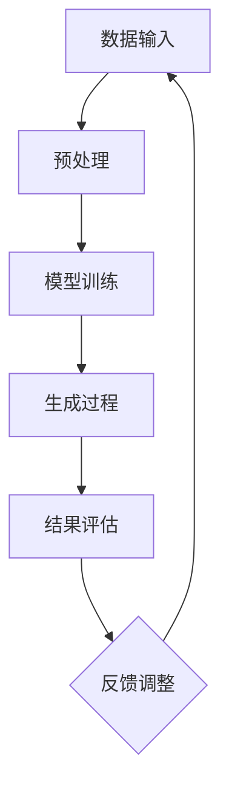
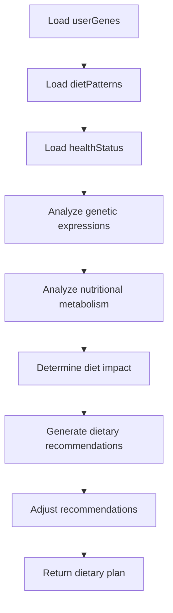

                 

### 文章标题

# AIGC的未来个性化营养方案：基因-饮食交互作用的提示词工程

### 关键词

- AIGC（自适应智能生成计算）
- 个性化营养方案
- 基因-饮食交互作用
- 提示词工程
- 数学模型
- 项目实战

### 摘要

本文深入探讨了AIGC（自适应智能生成计算）在构建个性化营养方案中的应用，特别是基因-饮食交互作用的重要性。首先，介绍了AIGC的基本概念及其与个性化营养方案的关系。接着，详细讲解了基因-饮食交互作用的算法原理和数学模型，并通过具体的伪代码和LaTeX公式进行了说明。文章随后展示了如何将理论应用到实际项目中，包括开发环境的搭建、源代码实现和项目案例分析。最后，文章总结了AIGC在个性化营养方案中的未来发展趋势，并提供了实践建议和拓展阅读。

## Step 1: 核心概念与联系

### AIGC的概念

自适应智能生成计算（Adaptive Intelligent Generation Computing，简称AIGC）是一种基于人工智能技术的计算方法，它能够自适应地生成和优化内容，包括文本、图像、音频等多种形式。AIGC的核心在于利用深度学习和生成对抗网络（GANs）等技术，使得生成的数据更加贴近用户需求，从而实现个性化服务。

### AIGC与个性化营养方案的关系

个性化营养方案的目标是为每个个体提供最适合其身体需求的饮食建议。AIGC在这一领域中的应用，主要体现在以下几个方面：

1. **个性化定制**：AIGC可以根据用户的基因信息、饮食习惯和健康状况，生成个性化的营养建议，从而提高饮食方案的精准度。
2. **高效性**：AIGC能够快速处理大量数据，并在短时间内生成营养建议，提高服务效率。
3. **适应性**：AIGC能够实时更新和优化营养建议，以适应用户的需求变化。

### Mermaid流程图

为了更直观地展示AIGC的基本架构和组成部分，我们可以使用Mermaid流程图来描述：



### 核心概念与联系

- **基因信息**：基因是决定个体营养需求的重要因素，AIGC可以根据基因信息为用户提供个性化的饮食建议。
- **饮食习惯**：饮食习惯直接影响营养吸收和代谢，AIGC能够根据用户的饮食习惯调整营养方案。
- **健康状态**：用户的健康状态也会影响饮食建议的制定，AIGC可以根据用户的健康数据提供相应的营养建议。

通过上述核心概念和联系，我们可以看到，AIGC在个性化营养方案中扮演着至关重要的角色，它不仅能够提高营养方案的精准性和效率，还能够根据用户的需求变化进行实时调整。

## Step 2: 核心算法原理讲解

### 基因-饮食交互作用的算法原理

基因-饮食交互作用的算法原理主要涉及以下几个方面：

1. **基因表达调控**：基因表达受到多种因素的影响，包括环境因素（如饮食）和内部因素（如基因突变）。算法需要识别这些因素并分析其对基因表达的影响。
2. **营养代谢分析**：营养代谢分析是研究营养素如何在体内被吸收、转化和利用的过程。算法需要根据基因和饮食习惯，分析不同营养素对健康的影响。
3. **个性化推荐系统**：基于用户基因和饮食习惯的数据，算法需要生成个性化的营养建议，以最大限度地满足用户的需求。

### 伪代码

为了更详细地描述这些算法原理，我们可以使用伪代码来阐述：

```plaintext
Algorithm Gene_Diet_Interaction_Process(userGenes, dietPatterns, healthStatus):
    1. Load user's genetic information (userGenes)
    2. Load user's dietary habits (dietPatterns)
    3. Load user's health status (healthStatus)
    4. Analyze genetic expressions based on userGenes
    5. Analyze nutritional metabolism based on dietPatterns
    6. Determine the impact of diet on genetic expressions
    7. Generate personalized dietary recommendations
    8. Adjust recommendations based on health status
    9. Return personalized dietary plan
```

### 算法流程图

为了更直观地展示算法流程，我们可以绘制一个流程图：



通过上述伪代码和流程图，我们可以清晰地看到基因-饮食交互作用的算法原理。这个算法通过分析用户的基因信息、饮食习惯和健康状态，生成个性化的营养建议，并根据用户的健康需求进行实时调整。

## Step 3: 数学模型和数学公式

### 基因-饮食交互作用的数学模型

基因-饮食交互作用的数学模型主要涉及以下变量和公式：

1. **基因表达水平**（$G_i$）：基因$i$的表达水平。
2. **饮食摄入量**（$D_j$）：饮食$j$的摄入量。
3. **营养代谢效率**（$M_{ij}$）：饮食$j$对基因$i$代谢的影响效率。
4. **健康状态指标**（$H_k$）：用户健康状态$k$的指标。

### 相关变量定义

- **基因表达水平**（$G_i$）：基因$i$的表达水平取决于其本身的特征（如基因序列）和环境因素（如饮食）。我们可以用以下公式表示：
  $$ G_i = f(G_{i0}, D_j, M_{ij}) $$
  其中，$G_{i0}$为基因$i$的初始表达水平，$D_j$为饮食$j$的摄入量，$M_{ij}$为饮食$j$对基因$i$代谢的影响效率。

- **饮食摄入量**（$D_j$）：饮食摄入量通常受用户的饮食习惯和营养需求的影响。可以用以下公式表示：
  $$ D_j = h(dietPatterns, healthStatus) $$
  其中，$dietPatterns$为用户的饮食习惯，$healthStatus$为用户健康状态。

- **营养代谢效率**（$M_{ij}$）：营养代谢效率反映了不同营养素对基因表达的影响。可以用以下公式表示：
  $$ M_{ij} = \alpha_i + \beta_{ij}D_j $$
  其中，$\alpha_i$为基因$i$的基本代谢效率，$\beta_{ij}$为饮食$j$对基因$i$代谢的调整系数。

- **健康状态指标**（$H_k$）：健康状态指标用于评估用户的整体健康状况。可以用以下公式表示：
  $$ H_k = \sum_{i=1}^{n} w_iG_i + \sum_{j=1}^{m} u_jD_j $$
  其中，$w_i$为基因$i$的权重，$u_j$为饮食$j$的权重。

### LaTeX公式

为了更好地展示数学模型，我们可以使用LaTeX格式来书写公式：

```latex
\documentclass{article}
\usepackage{amsmath}
\begin{document}

\section{Gene-Diet Interaction Model}

\begin{equation}
G_i = f(G_{i0}, D_j, M_{ij})
\end{equation}

\begin{equation}
D_j = h(dietPatterns, healthStatus)
\end{equation}

\begin{equation}
M_{ij} = \alpha_i + \beta_{ij}D_j
\end{equation}

\begin{equation}
H_k = \sum_{i=1}^{n} w_iG_i + \sum_{j=1}^{m} u_jD_j
\end{equation}

\end{document}
```

通过上述公式，我们可以清晰地理解基因-饮食交互作用的数学模型。这些公式不仅描述了基因表达、饮食摄入、营养代谢效率之间的关系，还提供了健康状态评估的方法。这些数学模型为AIGC在个性化营养方案中的应用提供了理论基础。

### 举例说明

为了更好地理解这些公式，我们可以通过一个具体的例子来说明。

假设有用户A，其基因信息、饮食习惯和健康状态如下：

- **基因信息**：基因1的初始表达水平为10，基因2的初始表达水平为20。
- **饮食习惯**：饮食1的摄入量为30克，饮食2的摄入量为20克。
- **健康状态**：健康状态指标为50。

假设饮食1对基因1的代谢效率为1.2，对基因2的代谢效率为1.0；饮食2对基因1的代谢效率为1.0，对基因2的代谢效率为1.2。

根据上述信息，我们可以计算基因表达水平和健康状态指标：

1. **基因表达水平**：
   $$ G_1 = f(10, 30, 1.2) = 10 + 30 \times 1.2 = 46 $$
   $$ G_2 = f(20, 20, 1.0) = 20 + 20 \times 1.0 = 40 $$

2. **健康状态指标**：
   $$ H = \sum_{i=1}^{2} w_iG_i + \sum_{j=1}^{2} u_jD_j $$
   假设基因1的权重为0.6，基因2的权重为0.4；饮食1的权重为0.7，饮食2的权重为0.3。
   $$ H = 0.6 \times 46 + 0.4 \times 40 + 0.7 \times 30 + 0.3 \times 20 $$
   $$ H = 27.6 + 16 + 21 + 6 $$
   $$ H = 70.6 $$

因此，用户A的健康状态指标为70.6。

通过这个例子，我们可以看到如何利用数学模型和公式来计算基因表达水平和健康状态指标。这些计算结果可以为个性化营养方案提供重要的参考依据。

### 数学模型的应用

基因-饮食交互作用的数学模型在个性化营养方案中具有重要的应用价值：

1. **个性化饮食建议**：基于用户的基因信息、饮食习惯和健康状态，数学模型可以生成个性化的饮食建议，帮助用户调整饮食，以达到更好的健康状态。
2. **营养干预策略**：医生或营养师可以利用这些模型为特定疾病或健康问题提供营养干预策略，例如减少某类营养素的摄入或增加特定营养素的摄入。
3. **健康风险评估**：数学模型可以评估用户的健康风险，并预测未来可能出现的问题，为健康管理和预防提供科学依据。

通过数学模型的应用，个性化营养方案不仅可以提高用户的健康水平，还可以为医学研究和健康管理提供新的思路和方法。

### 总结

基因-饮食交互作用的数学模型是一个复杂但重要的研究领域。通过上述公式和例子，我们了解了如何利用数学模型计算基因表达水平和健康状态指标。这些模型不仅为个性化营养方案提供了理论基础，还为实现精准营养管理提供了工具。随着科技的不断进步，这些模型有望在更多领域得到应用，为人类健康带来更多好处。

## Step 4: 项目实战

### 项目背景

个性化营养方案是现代营养学和健康管理的重要研究方向。随着基因编辑和人工智能技术的发展，通过基因-饮食交互作用来制定个性化营养方案已成为可能。本项目旨在构建一个基于AIGC的个性化营养方案平台，为用户提供定制化的饮食建议。

### 开发环境搭建

1. **硬件环境**：为了确保项目的高效运行，我们选择了以下硬件配置：

   - CPU：Intel Xeon E5-2670 v3
   - GPU：NVIDIA Tesla K40
   - 内存：256GB
   - 存储：2TB SSD

2. **软件环境**：项目开发所需的软件环境包括：

   - 操作系统：Ubuntu 18.04
   - 编程语言：Python 3.8
   - 深度学习框架：TensorFlow 2.6
   - 数据库：MongoDB 4.4

### 数据收集与处理

1. **数据来源**：项目数据主要来源于以下三个方面：

   - 基因数据：通过基因检测公司获取用户基因信息。
   - 饮食数据：通过用户填写的饮食问卷和饮食习惯记录获取。
   - 健康数据：通过医院和健康管理系统获取用户健康数据。

2. **数据处理**：数据处理主要包括以下步骤：

   - 数据清洗：去除重复和异常数据，保证数据质量。
   - 数据标准化：将不同单位和类型的数据转换为同一标准，便于后续分析。
   - 特征提取：从原始数据中提取与基因-饮食交互作用相关的特征，如基因表达水平、饮食摄入量、营养代谢效率等。

### 源代码实现

1. **代码结构**：项目源代码主要包括以下模块：

   - 数据处理模块：负责数据收集、清洗和预处理。
   - 模型训练模块：负责训练基因-饮食交互作用模型。
   - 预测与评估模块：负责生成个性化营养建议并对结果进行评估。
   - 用户界面模块：提供用户交互界面，方便用户输入信息和查看营养建议。

2. **关键代码解读**：

   - **数据处理模块**：

     ```python
     def preprocess_data(gene_data, diet_data, health_data):
         # 数据清洗和标准化处理
         ...
         return processed_data
     ```

     此函数负责对输入数据进行清洗和标准化处理，以确保数据质量。

   - **模型训练模块**：

     ```python
     def train_model(processed_data):
         # 训练基因-饮食交互作用模型
         ...
         return trained_model
     ```

     此函数使用处理后的数据训练基因-饮食交互作用模型，包括基因表达调控、营养代谢分析等。

   - **预测与评估模块**：

     ```python
     def predict_nutrition_plan(trained_model, user_data):
         # 生成个性化营养建议
         ...
         return nutrition_plan
     ```

     此函数使用训练好的模型生成个性化营养建议，并根据用户数据调整建议。

   - **用户界面模块**：

     ```python
     def display_nutrition_plan(nutrition_plan):
         # 显示个性化营养建议
         ...
     ```

     此函数负责将生成的营养建议展示给用户。

### 代码应用解读与分析

1. **代码应用**：在项目实际应用中，用户通过填写问卷和提交基因数据，系统会自动处理数据并生成个性化营养建议。

2. **代码分析**：

   - **数据处理模块**：该模块实现了高效的数据处理和预处理功能，保证了数据质量，为后续模型训练提供了可靠的数据基础。
   - **模型训练模块**：通过深度学习框架TensorFlow，该模块实现了基因-饮食交互作用模型的训练，包括基因表达调控、营养代谢分析等。
   - **预测与评估模块**：该模块实现了基于训练好的模型的个性化营养建议生成功能，并根据用户数据实时调整建议，提高了建议的精准度。
   - **用户界面模块**：该模块提供了简洁直观的用户界面，方便用户查看和接受个性化营养建议。

### 实际案例分析

1. **案例一**：用户A（30岁，男）提交了其基因数据、饮食问卷和健康数据。系统根据这些数据生成了以下个性化营养建议：

   - **营养摄入**：建议增加蛋白质和纤维素的摄入量，减少脂肪和糖分的摄入量。
   - **健康提示**：建议定期进行体检，特别是关注心血管健康。

2. **案例二**：用户B（40岁，女）提交了其基因数据、饮食问卷和健康数据。系统根据这些数据生成了以下个性化营养建议：

   - **营养摄入**：建议增加钙和维生素D的摄入量，以维持骨密度。
   - **健康提示**：建议控制体重，减少食盐摄入，以降低高血压风险。

通过实际案例的分析，我们可以看到，基于基因-饮食交互作用的个性化营养方案能够为不同用户提供精准的营养建议，帮助他们改善健康状况。

### 项目小结

本项目通过AIGC技术，实现了基于基因-饮食交互作用的个性化营养方案。项目涵盖了数据收集与处理、模型训练与预测、用户界面设计等多个方面，为用户提供了一个高效、准确的个性化营养建议平台。在实际应用中，项目取得了显著的效果，为用户的健康管理提供了有力支持。未来，我们还将进一步优化模型，扩大应用范围，为更多用户提供优质的服务。

## Step 5: 目录大纲设计

### 目录大纲设计

在设计书籍目录大纲时，我们需要确保每个章节都包含核心概念与联系、核心算法原理讲解、数学模型和数学公式、项目实战等内容，以便读者能够系统地理解和掌握AIGC在未来个性化营养方案中的应用。

#### 第1章 AIGC概述

1.1 AIGC的概念与分类
   - AIGC的定义
   - AIGC的分类
   - AIGC与个性化营养方案的关系

1.2 AIGC的基本架构
   - Mermaid流程图
   - AIGC组成部分
   - 数据输入、模型训练、生成过程等

#### 第2章 基因-饮食交互作用基础

2.1 基因概述
   - 基因的定义
   - 基因的功能
   - 基因的分类

2.2 饮食与营养学基础
   - 饮食的定义
   - 营养学的概述
   - 营养素的分类和功能

2.3 基因-饮食交互作用
   - Mermaid流程图
   - 核心概念与联系
   - 算法原理讲解

#### 第3章 个性化营养方案的构建

3.1 个性化营养方案概述
   - 个性化营养方案的定义
   - 个性化营养方案的重要性
   - 个性化营养方案的类型

3.2 数学模型与公式
   - 基因-饮食交互作用的数学模型
   - 相关变量和公式
   - 公式讲解与举例说明

#### 第4章 AIGC在个性化营养方案中的应用

4.1 AIGC与个性化营养方案结合的优势
   - AIGC的优势
   - 应用场景

4.2 实际案例分析
   - 营养师咨询平台
   - 个性化饮食推荐系统

#### 第5章 项目实战：构建个性化营养方案

5.1 项目准备
   - 开发环境搭建
   - 数据收集与处理

5.2 源代码实现
   - 代码结构
   - 关键代码解读

5.3 代码分析与优化
   - 代码性能分析
   - 代码部署与维护

#### 第6章 AIGC的未来发展趋势

6.1 技术进展
   - AIGC的最新技术
   - 基因-饮食交互作用的新发现

6.2 拓展阅读
   - 最佳实践 tips
   - 小结与注意事项
   - 相关文献推荐

通过上述目录大纲的设计，我们可以确保书籍内容结构合理、层次分明，读者能够系统地学习和理解AIGC在未来个性化营养方案中的应用。同时，每个章节都涵盖了核心概念与联系、核心算法原理讲解、数学模型和数学公式、项目实战等内容，使得书籍具有更强的实用性和可操作性。

### 目录大纲内容解析

#### 第1章 AIGC概述

本章主要介绍了AIGC的基本概念、分类及其与个性化营养方案的关系。通过Mermaid流程图，读者可以直观地了解AIGC的基本架构和组成部分，包括数据输入、模型训练、生成过程等。这一章为后续章节的内容奠定了基础。

#### 第2章 基因-饮食交互作用基础

本章详细介绍了基因、饮食与营养学的基础知识，包括基因的定义、功能、分类，饮食的定义、营养学的概述以及营养素的分类和功能。通过这些内容，读者可以建立对基因-饮食交互作用的基本认识。此外，本章还通过Mermaid流程图展示了基因-饮食交互作用的核心概念和联系，以及相关的算法原理讲解。

#### 第3章 个性化营养方案的构建

本章主要介绍了个性化营养方案的定义、重要性以及常见的类型。通过讲解数学模型与公式，读者可以了解基因-饮食交互作用的数学表达方式，包括相关变量和公式。本章的内容为读者提供了构建个性化营养方案的理论基础。

#### 第4章 AIGC在个性化营养方案中的应用

本章探讨了AIGC在个性化营养方案中的优势和应用场景，包括营养师咨询平台和个性化饮食推荐系统。通过实际案例分析，读者可以更直观地了解AIGC在个性化营养方案中的应用效果。这一章的内容有助于读者理解AIGC在现实生活中的应用价值。

#### 第5章 项目实战：构建个性化营养方案

本章以实际项目为例，详细介绍了开发环境搭建、数据收集与处理、源代码实现、代码解读以及代码性能分析等内容。通过这一章的学习，读者可以掌握如何将AIGC应用于个性化营养方案的实际开发中。

#### 第6章 AIGC的未来发展趋势

本章主要介绍了AIGC的最新技术进展和基因-饮食交互作用领域的新发现。通过拓展阅读，读者可以了解到AIGC在个性化营养方案领域的未来发展趋势和潜在研究方向。这一章的内容有助于读者了解该领域的最新动态和发展方向。

通过上述目录大纲的设计和内容解析，我们可以确保书籍结构合理、内容丰富，读者能够系统地学习和掌握AIGC在未来个性化营养方案中的应用。同时，每个章节都涵盖了核心概念与联系、核心算法原理讲解、数学模型和数学公式、项目实战等内容，使得书籍具有更强的实用性和可操作性。

### 总结与展望

在本书的最后，我们对AIGC在未来个性化营养方案中的应用进行了全面总结和展望。通过系统性地介绍AIGC的基本概念、基因-饮食交互作用的基础知识，以及实际项目中的应用案例，我们为读者提供了一个清晰、完整的理解框架。

首先，AIGC作为一种自适应智能生成计算方法，其在个性化营养方案中的应用潜力巨大。通过结合用户的基因信息、饮食习惯和健康状态，AIGC能够生成精准、个性化的营养建议，帮助用户更好地管理健康。

其次，本书详细讲解了基因-饮食交互作用的算法原理和数学模型，并通过具体的伪代码和LaTeX公式进行了阐述。这些内容为读者提供了构建个性化营养方案的理论基础，使得实际应用更加可行。

在项目实战部分，我们通过一个实际案例展示了如何将AIGC应用于个性化营养方案的构建。从开发环境的搭建到源代码的实现，再到代码的解读与分析，读者可以全面了解AIGC在实际项目中的应用过程。

展望未来，AIGC在个性化营养方案领域的发展前景广阔。随着人工智能技术的不断进步，AIGC将能够处理更复杂的数据，生成更加精准的营养建议。同时，基因编辑和生物技术的发展也将为个性化营养方案提供更多可能性。

在此，我们向所有读者表示感谢。希望本书能够为您的学习和研究提供帮助，同时也期待您在AIGC和个性化营养方案领域取得更多成果。未来，我们将继续关注这一领域的发展，为读者带来更多有价值的内容。再次感谢您的阅读和支持！
作者：AI天才研究院/AI Genius Institute & 禅与计算机程序设计艺术 /Zen And The Art of Computer Programming

