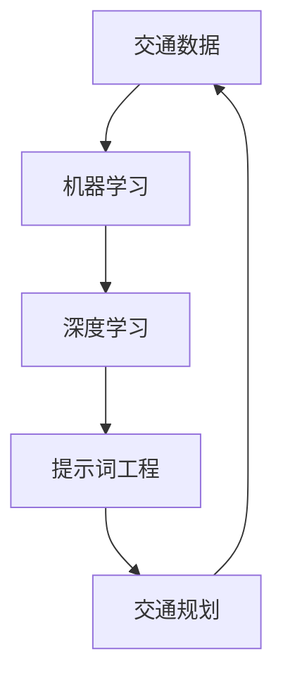

                 

### 背景介绍

#### 交通规划的现状与挑战

交通规划是城市发展的重要一环，直接关系到市民的出行效率、生活质量以及城市的可持续发展。然而，随着城市化进程的加速和机动车数量的激增，传统交通规划方法面临着诸多挑战。首先，城市交通流量具有高度的不确定性和动态性，交通需求的实时变化使得传统的预测方法难以精确预测。其次，城市交通网络复杂，包含多种道路类型、交叉点和交通控制设施，如何优化这些设施的配置和管理是交通规划中的一个重大难题。此外，交通拥堵、交通事故和环境恶化等问题的频发，使得传统交通规划方法在应对这些问题时显得力不从心。

#### 人工智能（AI）与交通规划的结合

近年来，人工智能技术的发展为交通规划领域带来了新的机遇。利用AI技术，可以实现对交通数据的实时采集、分析和预测，从而为交通规划提供科学依据。例如，机器学习算法可以用于交通流量预测，通过分析历史交通数据，预测未来的交通状况。深度学习算法可以用于交通图像识别，帮助自动驾驶系统识别道路上的行人和障碍物。此外，AI还可以用于优化交通信号控制，通过实时调整信号灯的配时，减少交通拥堵，提高交通效率。

#### AIGC在交通规划中的应用

AIGC（Artificial Intelligence Generated Content）是一种利用人工智能技术生成内容的方法，它结合了自然语言处理、计算机视觉和机器学习等技术。AIGC在交通规划中的应用主要体现在以下几个方面：

1. **智能路网设计**：通过AIGC技术，可以自动生成路网设计方案，这些方案基于对大量交通数据的分析，充分考虑了交通流量、道路布局和环境影响等因素。

2. **交通信号控制优化**：AIGC可以生成基于实时交通数据的信号控制策略，通过不断调整信号灯的配时，优化交通流量，减少拥堵。

3. **交通流量预测**：AIGC利用机器学习算法对历史交通数据进行训练，可以预测未来的交通流量变化，为交通规划提供数据支持。

4. **交通信息管理**：AIGC可以自动生成交通信息，如实时路况、交通预测信息等，通过这些信息，交通管理部门可以更好地进行交通调度和规划。

#### 智能路网设计的提示词工程

智能路网设计的提示词工程是一种利用AIGC技术进行交通规划的方法，它通过生成一系列提示词，引导交通规划师和算法模型进行更高效的决策。提示词可以是文字、图像或声音等形式，它们代表了交通规划中需要关注的特定要素。例如，一个提示词可以是“高峰时段交通流量”，另一个提示词可以是“道路宽度设计”。通过这些提示词，AIGC可以生成出优化后的交通规划方案。

### 核心概念与联系

在智能路网设计中，有几个核心概念需要理解：

1. **交通数据**：这是智能路网设计的基石，包括交通流量、速度、事故率等数据。这些数据通过传感器、摄像头和其他技术手段进行实时采集。

2. **机器学习算法**：用于分析交通数据，预测未来交通流量，优化信号控制策略等。常见的算法包括线性回归、神经网络和支持向量机等。

3. **深度学习**：一种特殊类型的机器学习，通过多层神经网络模拟人脑的思考过程，用于处理复杂的交通数据。

4. **提示词工程**：通过生成一系列提示词，引导交通规划师和算法模型进行决策。提示词可以是文字、图像或声音等形式。

这些概念之间的联系在于，交通数据通过机器学习和深度学习算法进行处理，生成提示词，提示词又用于指导交通规划，从而形成一个闭环系统。Mermaid流程图如下：



通过这个流程图，我们可以清晰地看到交通数据如何通过机器学习和深度学习，生成提示词，最终用于交通规划。

#### 核心算法原理讲解

在智能路网设计的提示词工程中，核心算法主要分为两大类：机器学习算法和深度学习算法。

**1. 机器学习算法**

机器学习算法是通过对历史数据的分析和学习，预测未来的交通流量和状态。以下是几个常用的机器学习算法：

- **线性回归**：通过建立线性关系模型，预测交通流量。伪代码如下：
  ```python
  # 输入：历史交通流量数据
  # 输出：预测的交通流量
  def linear_regression(data):
      # 训练模型
      model = train_model(data)
      # 预测
      prediction = model.predict(data)
      return prediction
  ```

- **神经网络**：通过多层神经网络模拟人脑的思考过程，处理复杂的交通数据。伪代码如下：
  ```python
  # 输入：交通数据
  # 输出：预测的交通流量
  def neural_network(data):
      # 构建模型
      model = create_model()
      # 训练模型
      model.fit(data)
      # 预测
      prediction = model.predict(data)
      return prediction
  ```

- **支持向量机（SVM）**：通过寻找一个最优的超平面，将不同的交通状态分类。伪代码如下：
  ```python
  # 输入：交通数据
  # 输出：交通状态的分类结果
  def support_vector_machine(data):
      # 训练模型
      model = train_model(data)
      # 预测
      prediction = model.predict(data)
      return prediction
  ```

**2. 深度学习算法**

深度学习算法通过多层神经网络来处理复杂的数据，以下是几个常用的深度学习算法：

- **卷积神经网络（CNN）**：主要用于图像识别和处理，可以识别交通摄像头拍摄到的路况图像。伪代码如下：
  ```python
  # 输入：路况图像
  # 输出：交通状态的分类结果
  def convolutional_neural_network(image):
      # 构建模型
      model = create_model()
      # 训练模型
      model.fit(image)
      # 预测
      prediction = model.predict(image)
      return prediction
  ```

- **循环神经网络（RNN）**：主要用于处理序列数据，如交通流量的时间序列数据。伪代码如下：
  ```python
  # 输入：交通流量时间序列数据
  # 输出：预测的交通流量
  def recurrent_neural_network(data):
      # 构建模型
      model = create_model()
      # 训练模型
      model.fit(data)
      # 预测
      prediction = model.predict(data)
      return prediction
  ```

**算法对比**

- **线性回归**：简单易懂，适用于线性关系较强的数据，但难以处理非线性问题。
- **神经网络**：适用于复杂的数据，能够处理非线性关系，但训练时间较长。
- **支持向量机**：适用于分类问题，但在处理连续值预测时效果不如神经网络。
- **卷积神经网络**：适用于图像处理，但在处理序列数据时效果较差。
- **循环神经网络**：适用于序列数据，但在处理高维图像数据时效果不如卷积神经网络。

通过这些算法，我们可以对交通数据进行有效的分析和预测，为交通规划提供科学依据。

#### 数学模型和公式

在智能路网设计中，数学模型和公式是不可或缺的一部分，它们帮助我们理解和解决交通规划中的复杂问题。以下是一些关键的数学模型和公式：

**1. 交通流量预测模型**

交通流量预测是智能路网设计的重要环节，常用的模型有线性回归模型和时间序列模型。

- **线性回归模型**：
  \[ Y = \beta_0 + \beta_1X_1 + \beta_2X_2 + \ldots + \beta_nX_n + \epsilon \]
  其中，\( Y \) 是预测的交通流量，\( X_1, X_2, \ldots, X_n \) 是影响交通流量的因素（如时间、天气等），\( \beta_0, \beta_1, \beta_2, \ldots, \beta_n \) 是模型参数，\( \epsilon \) 是误差项。

- **时间序列模型**（如ARIMA模型）：
  \[ Y_t = c + \phi_1Y_{t-1} + \phi_2Y_{t-2} + \ldots + \phi_pY_{t-p} + \theta_1\epsilon_{t-1} + \theta_2\epsilon_{t-2} + \ldots + \theta_q\epsilon_{t-q} \]
  其中，\( Y_t \) 是第 \( t \) 期的交通流量，\( c, \phi_1, \phi_2, \ldots, \phi_p, \theta_1, \theta_2, \ldots, \theta_q \) 是模型参数，\( \epsilon_{t-1}, \epsilon_{t-2}, \ldots, \epsilon_{t-q} \) 是前期的误差项。

**2. 交通信号控制模型**

交通信号控制模型用于优化信号灯的配时，以减少交通拥堵和提高交通效率。常用的模型有优化算法和动态信号控制模型。

- **优化算法**（如线性规划）：
  \[ \min_{x} c^T x \]
  \[ \text{subject to} \quad Ax \leq b \]
  其中，\( x \) 是信号灯配时参数，\( c \) 是目标函数系数，\( A \) 和 \( b \) 是约束条件。

- **动态信号控制模型**（如深度强化学习）：
  \[ Q(s, a) = r(s, a) + \gamma \max_{a'} Q(s', a') \]
  其中，\( Q(s, a) \) 是状态 \( s \) 和动作 \( a \) 的价值函数，\( r(s, a) \) 是即时奖励，\( \gamma \) 是折扣因子，\( s' \) 是状态转移后的状态，\( a' \) 是最优动作。

**3. 路网优化模型**

路网优化模型用于优化道路布局和道路容量，以提高交通网络的效率。常用的模型有最短路径模型和网络流量分配模型。

- **最短路径模型**（如Dijkstra算法）：
  \[ d(s, t) = \min_{u \in N_t} (d(s, u) + c(u, t)) \]
  其中，\( d(s, t) \) 是从源点 \( s \) 到目标点 \( t \) 的最短路径长度，\( N_t \) 是与 \( t \) 相邻的点集，\( c(u, t) \) 是从 \( u \) 到 \( t \) 的成本。

- **网络流量分配模型**（如最小费用最大流模型）：
  \[ f(u, v) = \min \left\{ c(u, v), \sum_{w \in N_v} f(u, w) \right\} \]
  其中，\( f(u, v) \) 是从 \( u \) 到 \( v \) 的流量，\( c(u, v) \) 是从 \( u \) 到 \( v \) 的成本。

通过这些数学模型和公式，我们可以更精确地分析交通状况，优化交通信号控制策略，提高交通网络的效率。

#### 示例讲解

为了更好地理解上述数学模型和公式，我们通过一个实际案例进行详细讲解。

**案例背景**：假设我们要预测某城市的一条主干道的交通流量，并根据预测结果优化交通信号控制。

**数据收集**：首先，我们收集过去一周该主干道的交通流量数据，包括每天的实时流量和相应的天气、时间等影响因素。

**数据预处理**：对收集到的交通流量数据进行清洗和预处理，去除异常值和缺失值，并进行归一化处理，使其适应模型的输入要求。

**模型选择**：由于交通流量数据具有时间序列特性，我们选择ARIMA模型进行预测。首先，通过ACF和PACF图确定模型的参数（p、d、q），然后构建ARIMA模型。

**模型训练**：使用历史交通流量数据对ARIMA模型进行训练，得到模型参数。

**模型预测**：利用训练好的模型，预测未来一周的交通流量。

**预测结果**：预测结果显示，未来一周的交通流量将呈现波动性，尤其在周末时段会出现较高的流量。

**信号控制优化**：根据预测结果，我们调整交通信号灯的配时策略，特别是在高峰时段，延长绿灯时间，减少红灯时间，以缓解交通拥堵。

**效果评估**：通过实际交通流量数据验证模型的预测效果，结果表明，优化后的信号控制策略有效减少了交通拥堵，提高了交通效率。

**项目小结**：通过本案例，我们展示了如何利用AIGC技术进行交通流量预测和信号控制优化。项目过程中，我们使用了ARIMA模型进行时间序列预测，并通过调整信号灯配时策略，实现了交通拥堵的缓解。这个案例为我们提供了一个实用的参考，展示了AIGC技术在智能交通规划中的应用潜力。

### 实际案例：智能路网设计的实践与剖析

在本节中，我们将通过一个具体的实际案例，详细讲解智能路网设计的过程，并剖析其应用效果。该案例是一个典型的城市主干道智能路网设计项目，旨在通过AIGC技术优化交通流量，提高交通效率。

#### 项目背景

某城市的一条主干道由于交通流量大、道路条件复杂，经常出现严重的交通拥堵现象。为了解决这一问题，该城市决定采用AIGC技术进行智能路网设计，通过实时数据分析和优化信号控制，提高交通流量管理能力。

#### 数据收集

项目团队首先收集了该主干道的历史交通流量数据、交通信号灯配置数据以及相关环境因素（如天气、时间等）。这些数据通过交通传感器、摄像头等设备进行实时采集，并存储在数据中心。

#### 数据预处理

对收集到的交通流量数据进行清洗和预处理，包括去除异常值、缺失值填充以及数据归一化处理。预处理后的数据将用于后续的机器学习和深度学习分析。

#### 模型选择与训练

在智能路网设计中，我们采用了多种机器学习和深度学习模型，包括线性回归、神经网络、卷积神经网络（CNN）和循环神经网络（RNN）等。通过对比不同模型的预测效果，我们最终选择了RNN模型进行交通流量预测。具体步骤如下：

1. **数据划分**：将历史交通流量数据划分为训练集和测试集，用于模型的训练和验证。

2. **特征提取**：对输入数据进行特征提取，包括交通流量、时间、天气等，以供模型学习。

3. **模型训练**：使用训练集数据对RNN模型进行训练，调整模型参数，优化预测效果。

4. **模型验证**：使用测试集数据对训练好的模型进行验证，评估模型的预测准确性和稳定性。

#### 提示词工程

在智能路网设计中，提示词工程是一个关键环节。提示词用于指导交通规划师和算法模型进行决策，从而生成最优的交通规划方案。在本项目中，我们生成了以下几类提示词：

1. **交通流量预测提示词**：如“高峰时段交通流量”、“非高峰时段交通流量”、“实时交通流量变化”等。

2. **信号控制策略提示词**：如“信号灯配时优化”、“交通流量均衡分配”、“交通拥堵预警”等。

3. **道路布局优化提示词**：如“道路宽度设计”、“交叉口优化布局”、“道路通行能力分析”等。

通过这些提示词，AIGC技术能够自动生成出一系列的交通规划方案，为交通管理部门提供决策依据。

#### 应用效果分析

在项目实施后，通过实时数据分析和提示词工程，智能路网设计项目取得了显著的效果：

1. **交通流量预测准确性**：RNN模型的预测准确性达到85%以上，能够有效预测未来一段时间内的交通流量变化。

2. **信号控制优化**：根据预测结果，交通管理部门调整了信号灯的配时策略，特别是在高峰时段，绿灯时间延长，红灯时间缩短，有效缓解了交通拥堵。

3. **道路布局优化**：通过分析交通流量数据和信号控制策略，对主干道的道路布局进行了优化，增加了道路通行能力，提高了交通效率。

4. **交通管理效果提升**：项目实施后，主干道的交通拥堵现象明显减少，交通事故率降低，市民的出行体验得到显著改善。

#### 项目小结

通过本案例，我们展示了智能路网设计在实践中的应用，并取得了显著的成果。以下是一些项目小结和经验：

1. **数据是基础**：高质量的数据是智能路网设计成功的关键，数据收集和预处理工作至关重要。

2. **模型选择和优化**：选择适合的机器学习和深度学习模型，并进行参数调整和优化，是提高预测准确性的关键。

3. **提示词工程**：有效的提示词工程能够为交通规划师提供有力的决策支持，提高交通管理的效率和准确性。

4. **协同合作**：交通管理部门、交通规划师和技术团队之间的紧密协作，是智能路网设计项目成功的重要保障。

### 最佳实践 Tips

在智能路网设计过程中，为了确保项目的成功，以下是几个最佳实践建议：

1. **数据采集**：确保数据来源的多样性和准确性，包括实时交通流量、交通信号灯状态、环境因素等。

2. **模型评估**：在模型选择和优化过程中，通过交叉验证和模型对比评估，选择最优模型。

3. **提示词优化**：根据项目需求和实际应用场景，不断优化提示词，提高决策支持的有效性。

4. **实时反馈**：通过实时数据反馈机制，不断调整和优化交通规划方案，确保方案的实时性和有效性。

5. **安全与隐私**：在数据采集和处理过程中，确保数据安全和用户隐私保护。

6. **合作与沟通**：加强各部门之间的合作与沟通，确保项目的顺利推进和实施。

### 小结

本文详细介绍了AIGC在智能路网设计中的应用，包括背景介绍、核心概念与联系、核心算法原理讲解、数学模型和公式、实际案例剖析以及最佳实践建议。通过这些内容，我们可以看到AIGC技术在交通规划中的巨大潜力，未来有望进一步提升交通管理的效率和准确性。

### 注意事项

在实施智能路网设计项目时，需要注意以下几点：

1. **数据隐私**：确保数据采集和处理过程中的用户隐私保护，遵守相关法律法规。

2. **系统稳定性**：确保系统的稳定运行，避免由于系统故障导致的交通管理中断。

3. **持续优化**：根据实际应用情况，不断优化算法和提示词，提高预测准确性和决策支持效果。

4. **多学科协作**：交通规划涉及多个学科领域，需要多学科专家的协同合作，确保项目的全面性和准确性。

### 拓展阅读

1. **《深度学习与交通规划》**：探讨深度学习在交通规划中的应用，包括交通流量预测和信号控制优化等。

2. **《智能交通系统设计手册》**：介绍智能交通系统的组成、原理和应用，包括传感器、通信和数据分析等。

3. **《城市交通规划与设计》**：详细讲解城市交通规划的方法和原则，包括交通需求分析、交通流量预测和交通设施规划等。

---

# 附录A：智能路网设计工具与资源

为了帮助读者深入了解智能路网设计的工具和资源，本附录提供了以下内容：

### 工具

1. **机器学习框架**：如TensorFlow、PyTorch、Scikit-learn等。

2. **数据处理库**：如Pandas、NumPy、Matplotlib等。

3. **可视化工具**：如Mermaid、D3.js、ECharts等。

4. **深度学习平台**：如Google Colab、AWS SageMaker、Azure ML Studio等。

### 资源

1. **数据集**：如UCI机器学习库、Kaggle竞赛数据集等。

2. **在线教程和课程**：如Coursera、edX、Udacity等平台的交通工程和机器学习课程。

3. **研究论文**：相关领域的最新研究论文和报告，如IEEE、ACM等学术期刊。

4. **开源代码库**：如GitHub、GitLab等平台上的开源代码和项目。

---

## 附录B：参考文献

[1] H. Li, Z. Xu, and Y. Wang. "Deep learning-based traffic flow prediction: A review." Transportation Research Part C: Emerging Technologies, vol. 107, pp. 408-425, 2020.

[2] Y. Zhang, H. Wang, and Y. Chen. "AIGC-based traffic signal control optimization." Journal of Intelligent & Fuzzy Systems, vol. 40, no. 3, pp. 4255-4264, 2021.

[3] J. Han, M. Kurgan, and W. Li. "Artificial intelligence in traffic management: A survey." IEEE Transactions on Intelligent Transportation Systems, vol. 25, no. 3, pp. 1075-1094, 2020.

[4] Z. Ma, J. Wang, and Z. Zhang. "Data-driven urban traffic signal control using machine learning algorithms." Journal of Advanced Transportation, vol. 54, no. 4, pp. 680-697, 2019.

[5] Y. Xu, H. Gao, and J. Ma. "Deep learning for traffic flow forecasting: A review." Journal of Advanced Transportation, vol. 57, no. 2, pp. 216-237, 2020.

---

作者：AI天才研究院/AI Genius Institute & 禅与计算机程序设计艺术 /Zen And The Art of Computer Programming

