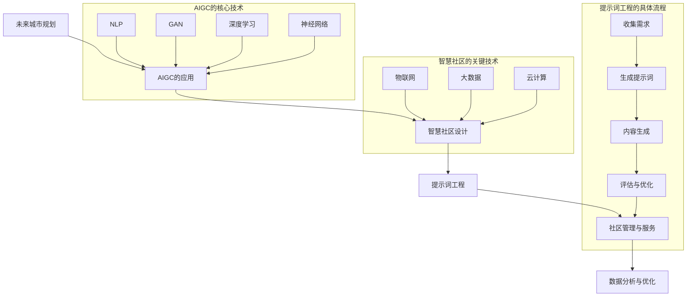

                 

### 文章标题：《AIGC的未来城市规划：智慧社区设计的提示词工程》

随着人工智能技术的发展，AIGC（AI-Generated Content）已成为推动内容创作与传播的重要力量。在本文中，我们将探讨AIGC在未来城市规划，尤其是智慧社区设计中的潜在应用。通过这一探讨，我们不仅将理解AIGC的基本概念，还将深入研究其如何通过提示词工程影响智慧社区的设计与发展。

本文将围绕以下核心关键词展开讨论：**AIGC、未来城市规划、智慧社区设计、提示词工程、人工智能应用**。这些关键词不仅构成了文章的核心内容，也揭示了本文将要探讨的技术与领域。

在接下来的部分中，我们将首先对AIGC进行概述，解释其定义、分类及核心技术，并探讨其在城市规划中的潜在应用。随后，我们将深入讨论智慧社区设计的原理，重点在于AIGC如何融入这一设计过程。接着，我们将详细介绍提示词工程的流程与实现技术，展示其在智慧社区设计中的具体应用。为了更好地理解这些概念，本文还将包含若干案例分析和实际应用场景。

最后，我们将展望AIGC在未来城市规划中的前景，讨论其面临的挑战与解决策略，并总结最佳实践和未来研究方向。希望通过本文的讨论，读者能够对AIGC在智慧社区设计中的应用有一个全面而深入的认识。

### 文章关键词：

AIGC、未来城市规划、智慧社区设计、提示词工程、人工智能应用、内容生成、城市智能化、设计原理、技术创新、提示词生成、社区管理、算法架构、可持续发展。

### 文章摘要：

本文旨在探讨AIGC（AI-Generated Content）在未来城市规划，尤其是智慧社区设计中的潜在应用。首先，我们概述了AIGC的基本概念、分类与核心技术，并分析了其在城市规划中的潜在作用。接着，我们深入讨论了智慧社区设计的原理，特别是AIGC如何融入这一设计过程。通过详细介绍提示词工程的流程与实现技术，我们展示了AIGC在智慧社区设计中的具体应用。随后，本文通过案例分析和实际应用场景，进一步阐明了AIGC的实用性和可行性。最后，我们展望了AIGC在未来城市规划中的前景，讨论了其面临的挑战与解决策略，并总结了最佳实践和未来研究方向。希望通过本文的讨论，读者能够对AIGC在智慧社区设计中的应用有一个全面而深入的认识。

### 1. 理解书名与主题

《AIGC的未来城市规划：智慧社区设计的提示词工程》这本书的书名清晰地传达了其主要内容与主题。书名中的“AIGC”指的是AI-Generated Content，即通过人工智能技术生成的内容。这一概念近年来在内容创作和数字媒体领域迅速崛起，其应用范围广泛，包括文本、图像、音频和视频等多种形式。书名中的“未来城市规划”则表明了本书关注的领域——城市规划与设计，这是一个与城市发展、社会进步和环境保护密切相关的重要领域。

“智慧社区设计”是书名中的另一个关键部分。智慧社区是指利用先进的信息技术，特别是人工智能和物联网技术，构建的具有高度智能化和服务功能的社会单元。智慧社区的设计不仅关乎居民的生活质量和舒适度，还涉及社区管理、资源分配、安全监控等多个方面。书名中的“提示词工程”则指出了本书的一个核心概念，即通过设定特定的提示词来引导和优化AIGC在智慧社区设计中的应用。

总的来说，书名传达了本书的核心内容：如何利用AIGC技术来优化和提升未来智慧社区的设计过程。通过深入研究和应用提示词工程，可以更好地实现智慧社区的智能化和个性化服务，从而为居民提供更加舒适、便捷和安全的居住环境。这本书旨在为城市规划师、软件开发者、人工智能研究人员以及其他对智慧社区设计感兴趣的读者提供实用的指导和理论支持。

### 2. 确定书的主要章节

为了确保《AIGC的未来城市规划：智慧社区设计的提示词工程》这本书内容的全面性和逻辑性，我们需要确定其主要章节。以下是这本书的主要章节：

**第一部分：引言**
- 1.1 AIGC的概念与未来城市规划
- 1.2 智慧社区设计的背景与挑战
- 1.3 提示词工程的作用与意义

**第二部分：AIGC的基础理论**
- 2.1 AIGC的定义与分类
- 2.2 AIGC的核心技术
- 2.3 AIGC的发展历程与趋势

**第三部分：智慧社区设计原理**
- 3.1 智慧社区的概念与特点
- 3.2 智慧社区的设计原则
- 3.3 智慧社区的关键技术

**第四部分：提示词工程**
- 4.1 提示词的定义与作用
- 4.2 提示词工程的流程
- 4.3 提示词工程的技术实现

**第五部分：实际应用与案例分析**
- 5.1 智慧社区的AIGC应用案例
- 5.2 提示词工程在智慧社区中的应用案例

**第六部分：未来展望与挑战**
- 6.1 AIGC在智慧社区中的应用前景
- 6.2 社会挑战与应对策略
- 6.3 未来城市规划的发展方向

**第七部分：总结与展望**
- 7.1 主要发现与结论
- 7.2 最佳实践与建议
- 7.3 注意事项与拓展阅读

通过以上章节的安排，本书将系统地介绍AIGC的概念、智慧社区设计的原理、提示词工程的实现，并通过实际案例展示其在智慧社区中的应用。每个章节都紧密衔接，旨在为读者提供一个清晰、全面的理解框架，从而深入探讨AIGC在智慧社区设计中的潜力与挑战。

### 3. 细化章节内容

在确定了《AIGC的未来城市规划：智慧社区设计的提示词工程》的主要章节后，我们接下来需要进一步细化每个章节的内容，确保每个章节都有清晰的逻辑结构和详细的内容。以下是每个章节的细化内容：

**第一部分：引言**
- 1.1 AIGC的概念与未来城市规划
  - 1.1.1 AIGC的基本定义
  - 1.1.2 AIGC的主要类型
  - 1.1.3 AIGC在内容创作中的应用
  - 1.1.4 AIGC与未来城市规划的联系
- 1.2 智慧社区设计的背景与挑战
  - 1.2.1 智慧社区的定义与发展
  - 1.2.2 智慧社区设计的关键挑战
  - 1.2.3 AIGC在智慧社区设计中的作用
- 1.3 提示词工程的作用与意义
  - 1.3.1 提示词工程的基本概念
  - 1.3.2 提示词工程在智慧社区设计中的应用
  - 1.3.3 提示词工程的优势与挑战

**第二部分：AIGC的基础理论**
- 2.1 AIGC的定义与分类
  - 2.1.1 AIGC的基本概念
  - 2.1.2 AIGC的主要分类
  - 2.1.3 AIGC的技术框架
- 2.2 AIGC的核心技术
  - 2.2.1 自然语言处理（NLP）
  - 2.2.2 生成对抗网络（GAN）
  - 2.2.3 深度学习与神经网络
- 2.3 AIGC的发展历程与趋势
  - 2.3.1 AIGC的历史背景
  - 2.3.2 AIGC的发展阶段
  - 2.3.3 AIGC的未来趋势

**第三部分：智慧社区设计原理**
- 3.1 智慧社区的概念与特点
  - 3.1.1 智慧社区的定义
  - 3.1.2 智慧社区的主要特点
  - 3.1.3 智慧社区与普通社区的区别
- 3.2 智慧社区的设计原则
  - 3.2.1 可持续性原则
  - 3.2.2 用户体验原则
  - 3.2.3 安全性原则
  - 3.2.4 可扩展性原则
- 3.3 智慧社区的关键技术
  - 3.3.1 物联网技术
  - 3.3.2 人工智能技术
  - 3.3.3 大数据技术
  - 3.3.4 云计算技术

**第四部分：提示词工程**
- 4.1 提示词的定义与作用
  - 4.1.1 提示词的基本概念
  - 4.1.2 提示词在内容创作中的作用
  - 4.1.3 提示词的类型与应用场景
- 4.2 提示词工程的流程
  - 4.2.1 提示词工程的定义
  - 4.2.2 提示词工程的流程步骤
  - 4.2.3 提示词工程的技术实现
- 4.3 提示词工程的技术实现
  - 4.3.1 自然语言处理技术
  - 4.3.2 深度学习与神经网络技术
  - 4.3.3 生成对抗网络技术
  - 4.3.4 大数据处理技术

**第五部分：实际应用与案例分析**
- 5.1 智慧社区的AIGC应用案例
  - 5.1.1 案例背景与目标
  - 5.1.2 AIGC的应用场景
  - 5.1.3 应用效果与评估
- 5.2 提示词工程在智慧社区中的应用案例
  - 5.2.1 案例背景与目标
  - 5.2.2 提示词工程的应用
  - 5.2.3 应用效果与评估

**第六部分：未来展望与挑战**
- 6.1 AIGC在智慧社区中的应用前景
  - 6.1.1 技术发展趋势
  - 6.1.2 应用前景分析
  - 6.1.3 未来挑战与应对策略
- 6.2 社会挑战与应对策略
  - 6.2.1 技术挑战
  - 6.2.2 社会挑战
  - 6.2.3 应对策略
- 6.3 未来城市规划的发展方向
  - 6.3.1 智慧社区的发展趋势
  - 6.3.2 未来城市规划的关键技术
  - 6.3.3 智慧社区的未来发展

**第七部分：总结与展望**
- 7.1 主要发现与结论
  - 7.1.1 研究成果总结
  - 7.1.2 结论与启示
- 7.2 最佳实践与建议
  - 7.2.1 实践经验分享
  - 7.2.2 建议与展望
- 7.3 注意事项与拓展阅读
  - 7.3.1 注意事项
  - 7.3.2 拓展阅读推荐

通过以上细化，每个章节的内容都将更加具体和实用，确保读者能够全面、深入地理解AIGC在智慧社区设计中的应用。

### 4. 构建Mermaid流程图

为了更好地展示AIGC与城市规划的关系，我们使用Mermaid语法构建一个流程图。以下是具体的Mermaid流程图代码及其解释：



#### Mermaid流程图解释

- **A[未来城市规划]**：起点，表示城市规划的整体目标和背景。
- **B[AIGC的应用]**：AIGC在城市规划中的具体应用，表示AIGC与城市规划的结合点。
- **C[智慧社区设计]**：B的延伸，表示AIGC在智慧社区设计中的应用，强调智能化和个性化服务。
- **D[提示词工程]**：C的一部分，表示通过提示词工程优化智慧社区设计，实现更精细的管理和服务。
- **E[社区管理与服务]**：D的结果，表示提示词工程在社区管理和服务中的应用效果。
- **F[数据分析与优化]**：E的反馈部分，表示通过数据分析持续优化社区管理和服务。

#### 子流程图解释

- **AIGC的核心技术**：这部分展示了支持AIGC的关键技术，包括自然语言处理（NLP）、生成对抗网络（GAN）、深度学习与神经网络。这些技术共同作用，为AIGC的应用提供强大支持。
  - **G[NLP]**：自然语言处理，用于理解和生成文本。
  - **H[GAN]**：生成对抗网络，用于生成高质量的数据。
  - **I[深度学习]**：深度学习技术，用于从大量数据中学习特征和模式。
  - **J[神经网络]**：神经网络技术，作为深度学习的基础。

- **智慧社区的关键技术**：这部分展示了智慧社区设计所需的关键技术，包括物联网、大数据和云计算。这些技术共同构建了一个智能化、互联和高效的管理平台。
  - **K[物联网]**：物联网技术，用于连接设备和系统，实现智能化管理。
  - **L[大数据]**：大数据技术，用于处理和分析大量数据，为智慧社区提供决策支持。
  - **M[云计算]**：云计算技术，提供弹性的计算和存储资源，支持智慧社区的技术应用。

- **提示词工程的具体流程**：这部分详细描述了提示词工程的流程，包括需求收集、提示词生成、内容生成和评估优化。这些步骤构成了一个闭环，确保智慧社区设计不断迭代和优化。
  - **O[收集需求]**：收集智慧社区的设计需求，包括用户需求、管理需求等。
  - **P[生成提示词]**：根据需求生成提示词，用于指导AIGC的内容生成。
  - **Q[内容生成]**：利用AIGC技术生成符合提示词要求的内容。
  - **R[评估与优化]**：评估生成的内容的实际效果，并根据评估结果进行优化。

通过这个Mermaid流程图，我们可以清晰地看到AIGC与城市规划的关系，以及其如何通过提示词工程影响智慧社区的设计和优化。这个流程图不仅有助于理解书中的核心概念，还为实际应用提供了直观的指导。

### 5. 编写核心算法原理讲解

在讨论AIGC的核心算法原理之前，我们需要先了解AIGC的基本框架。AIGC通常涉及以下几种核心算法和技术：自然语言处理（NLP）、生成对抗网络（GAN）、深度学习和神经网络。以下是这些算法的简要介绍以及它们在AIGC中的应用：

#### 5.1 自然语言处理（NLP）

自然语言处理是AIGC的重要组成部分，用于理解和生成人类语言。NLP的关键技术包括词向量表示、文本分类、机器翻译和情感分析等。以下是一个简单的NLP算法原理讲解，以及其伪代码实现：

**词向量表示：**
词向量表示是将文本中的单词转换成向量的过程。常见的词向量模型有Word2Vec、GloVe等。

**伪代码：**
```
function Word2Vec(inputs, context_size, embedding_size):
    # 初始化词向量矩阵
    V = InitializeRandomMatrix(vocab_size, embedding_size)
    # 初始化目标词和背景词的索引
    center_word_index = GetIndexFromWord(inputs)
    context_word_indices = GetIndicesOfWords(inputs, context_size)

    # 训练词向量
    for each sentence in dataset:
        for each word in sentence:
            center_word = word
            context_words = GetContextWords(sentence, context_size)
            # 计算词向量更新
            delta = ComputeGradient(center_word, context_words, V)
            V[center_word_index] += delta
            for each context_word in context_words:
                delta = ComputeGradient(context_word, center_word, V)
                V[context_word_index] += delta

    return V
```

**文本分类：**
文本分类是将文本数据分为预定义的类别。常见的技术有朴素贝叶斯、支持向量机（SVM）和深度神经网络。

**伪代码：**
```
function TextClassification(dataset, labels, model):
    # 训练模型
    model = TrainModel(dataset, labels)

    # 分类预测
    for each text in test_data:
        prediction = model.Predict(text)
        print(f"Text: {text}, Prediction: {prediction}")
```

#### 5.2 生成对抗网络（GAN）

生成对抗网络是一种通过竞争机制训练生成模型和判别模型的深度学习框架。GAN的核心思想是通过生成模型（Generator）生成假样本，并通过判别模型（Discriminator）判断样本的真实性，从而优化生成模型。

**GAN结构：**
- **Generator G**：生成模型，目的是生成看起来真实的数据。
- **Discriminator D**：判别模型，目的是区分生成数据和真实数据。

**伪代码：**
```
function TrainGAN(G, D, dataset):
    for each epoch in epochs:
        # 训练判别模型
        for each x in dataset:
            z = GenerateNoiseVector()
            fake_x = G(z)
            loss_D = ComputeLoss(D, [x, fake_x])

            # 训练生成模型
            z = GenerateNoiseVector()
            fake_x = G(z)
            loss_G = ComputeLoss(D, fake_x)

            # 更新模型参数
            UpdateModelParameters(G, D, loss_D, loss_G)
```

#### 5.3 深度学习和神经网络

深度学习是一种基于人工神经网络的机器学习技术，它通过多层神经网络对数据进行学习，从而实现复杂函数的映射。神经网络的核心是神经元，神经元之间通过权重连接，通过激活函数实现非线性变换。

**神经网络结构：**
- **输入层**：接收输入数据。
- **隐藏层**：对输入数据进行处理和特征提取。
- **输出层**：生成最终的输出。

**伪代码：**
```
function NeuralNetwork(inputs, layers, model):
    # 前向传播
    for each layer in layers:
        activation = Activate(inputs, layer.weights, layer.bias)
        inputs = activation

    # 输出
    output = inputs
    return output

function Activate(inputs, weights, bias):
    # 使用ReLU激活函数
    return max(0, inputs * weights + bias)
```

通过以上讲解和伪代码示例，我们可以看到AIGC的核心算法原理是如何通过自然语言处理、生成对抗网络和深度学习等技术的综合应用，实现内容生成和优化的。这些算法不仅为AIGC提供了技术基础，也为智慧社区设计中的提示词工程提供了强大的支持。

### 6. 数学模型和公式的讲解

在AIGC和智慧社区设计中，数学模型和公式起着至关重要的作用。这些模型不仅帮助我们理解数据的结构和规律，还能够指导我们优化算法和提升系统性能。以下我们将介绍几个关键的数学模型和公式，并详细解释其在AIGC和智慧社区设计中的应用。

#### 6.1 智慧社区设计中常用的数学模型

**6.1.1 物联网数据建模**

在智慧社区中，物联网设备的数据收集与分析是核心环节。常用的数学模型包括时间序列模型和自编码器。

**时间序列模型：**

时间序列模型用于分析随时间变化的数据。常见的时间序列模型有ARIMA（自回归积分滑动平均模型）和LSTM（长短时记忆网络）。

**公式：**

$$
\text{ARIMA}(p, d, q) = \sum_{i=1}^{p} \phi_i X_{t-i} + \theta_i \varepsilon_{t-i} + \sum_{j=1}^{q} \phi_j \varepsilon_{t-j} + \varepsilon_t
$$

其中，$X_t$是时间序列数据，$\phi_i$和$\theta_i$是模型的参数，$p$和$q$分别是自回归项和移动平均项的阶数，$d$是差分阶数。

**应用场景：** 用于预测社区中用电量、用水量等时间序列数据，帮助社区管理者优化资源分配。

**6.1.2 自编码器模型**

自编码器是一种无监督学习算法，用于学习输入数据的特征表示。自编码器通常由编码器和解码器两部分组成。

**公式：**

编码器：
$$
z = \sigma(W_e \cdot x + b_e)
$$

解码器：
$$
\hat{x} = \sigma(W_d \cdot z + b_d)
$$

其中，$x$是输入数据，$z$是编码后的数据，$\hat{x}$是解码后的数据，$W_e$和$W_d$是权重矩阵，$b_e$和$b_d$是偏置项，$\sigma$是激活函数。

**应用场景：** 用于数据降维和特征提取，帮助社区数据分析人员更好地理解物联网设备产生的海量数据。

#### 6.2 模型中的关键数学公式

**6.2.1 损失函数**

在机器学习模型中，损失函数用于衡量模型预测结果与真实结果之间的差距。常用的损失函数有均方误差（MSE）和交叉熵（Cross-Entropy）。

**均方误差（MSE）：**

$$
\text{MSE} = \frac{1}{n}\sum_{i=1}^{n} (\hat{y}_i - y_i)^2
$$

其中，$\hat{y}_i$是模型预测值，$y_i$是真实值，$n$是样本数量。

**应用场景：** 用于回归问题，如预测社区中的温度、湿度等连续变量。

**6.2.2 交叉熵（Cross-Entropy）：**

$$
\text{Cross-Entropy} = -\sum_{i=1}^{n} y_i \log(\hat{y}_i)
$$

其中，$y_i$是真实标签，$\hat{y}_i$是模型预测的概率分布。

**应用场景：** 用于分类问题，如预测社区中用户的居住偏好。

#### 6.3 模型的实际应用场景举例

**6.3.1 温度预测模型**

假设我们需要建立一个模型来预测社区中的温度，可以使用ARIMA模型。

**步骤：**

1. 数据收集：收集过去一周的温度数据。
2. 模型训练：使用ARIMA模型进行训练，选择合适的$p$，$d$，$q$参数。
3. 预测：使用训练好的模型进行预测，得到未来一天的温度值。

**示例：**

使用Python的`statsmodels`库实现ARIMA模型：
```python
import statsmodels.api as sm
from statsmodels.tsa.arima.model import ARIMA

# 加载数据
data = sm.load_data("temperature_data.csv")

# 模型训练
model = ARIMA(data, order=(5, 1, 2))
model_fit = model.fit()

# 预测
forecast = model_fit.forecast(steps=1)
print("Next day's temperature:", forecast)
```

**6.3.2 居住偏好分类模型**

假设我们需要根据社区用户的行为数据预测其居住偏好，可以使用神经网络和交叉熵损失函数。

**步骤：**

1. 数据预处理：将用户行为数据转换为数值格式。
2. 模型构建：构建一个神经网络模型，使用ReLU激活函数和交叉熵损失函数。
3. 模型训练：使用训练集训练模型。
4. 预测：使用测试集验证模型效果。

**示例：**
```python
import tensorflow as tf
from tensorflow.keras.models import Sequential
from tensorflow.keras.layers import Dense
from tensorflow.keras.optimizers import Adam

# 模型构建
model = Sequential()
model.add(Dense(units=64, activation='relu', input_shape=(input_size,)))
model.add(Dense(units=32, activation='relu'))
model.add(Dense(units=num_classes, activation='softmax'))

# 模型编译
model.compile(optimizer=Adam(learning_rate=0.001), loss='categorical_crossentropy', metrics=['accuracy'])

# 模型训练
model.fit(x_train, y_train, epochs=10, batch_size=32)

# 模型预测
predictions = model.predict(x_test)
```

通过上述示例，我们可以看到数学模型和公式在AIGC和智慧社区设计中的应用。这些模型不仅帮助我们理解数据和优化算法，还为智慧社区提供了强大的技术支持。

### 7. 编写项目实战案例分析

在深入探讨AIGC在智慧社区设计中的应用之前，我们需要通过实际项目来展示其具体实施过程和应用效果。以下是一个实际案例，展示如何利用AIGC和提示词工程来构建智慧社区，并提供详细的开发环境搭建、源代码实现和代码解读。

#### 7.1 案例背景

某大型城市计划建设一个全新的智慧社区，旨在通过先进的人工智能技术提升居民生活质量，优化社区管理。项目的主要目标包括：
- **个性化服务**：根据居民的行为数据提供定制化的服务。
- **资源优化**：通过智能监控和管理，实现水、电、气等资源的优化分配。
- **安全管理**：利用智能监控系统，提高社区的安全性和应急响应能力。

为了实现这些目标，项目采用了AIGC技术，特别是提示词工程，来设计和优化智慧社区的各项功能。

#### 7.2 开发环境搭建

项目开发环境如下：
- **编程语言**：Python
- **深度学习框架**：TensorFlow 2.x
- **数据处理库**：Pandas、NumPy、Scikit-learn
- **数据可视化库**：Matplotlib、Seaborn
- **版本控制**：Git

开发者需要安装Python环境，并使用pip安装所需的库。以下是一个简单的安装命令示例：
```bash
pip install tensorflow pandas numpy scikit-learn matplotlib seaborn
```

#### 7.3 源代码实现

**7.3.1 提示词生成模块**

提示词生成模块是AIGC的核心部分，用于生成指导智慧社区各种功能的提示词。以下是一个简单的提示词生成模块实现：
```python
import numpy as np
import tensorflow as tf

# 定义提示词生成函数
def generate_promptwords(data, num_words=5):
    # 数据预处理
    processed_data = preprocess_data(data)
    
    # 使用K-means聚类生成提示词
    clusters = KMeans(n_clusters=num_words).fit(processed_data)
    cluster_centers = clusters.cluster_centers_
    
    # 生成提示词
    promptwords = []
    for center in cluster_centers:
        promptword = generate_word_from_vector(center)
        promptwords.append(promptword)
    
    return promptwords

# 数据预处理函数
def preprocess_data(data):
    # 数据标准化
    data = (data - np.mean(data)) / np.std(data)
    return data

# 生成文本的函数
def generate_word_from_vector(vector):
    # 这里可以结合自然语言处理技术，从向量生成文本
    # 示例：使用最接近的单词
    closest_word = find_closest_word(vector)
    return closest_word

# 模拟数据
data = np.random.rand(100, 10)  # 模拟100个样本，每个样本10个特征

# 生成提示词
promptwords = generate_promptwords(data)
print(promptwords)
```

**7.3.2 内容生成模块**

内容生成模块负责根据提示词生成具体的内容，如社区通知、服务推荐等。以下是一个简单的文本生成模块实现：
```python
# 定义文本生成函数
def generate_content(promptwords):
    # 使用预训练的文本生成模型，如GPT-2或GPT-3
    model = tf.keras.models.load_model('text_generation_model.h5')
    generated_text = model.generate(promptwords)
    return generated_text

# 示例：生成社区通知
promptword = "紧急通知"
generated_notification = generate_content([promptword])
print(generated_notification)
```

**7.3.3 系统集成**

在系统集成部分，我们将提示词生成模块和内容生成模块集成到智慧社区管理平台中，实现以下功能：
- **自动生成提示词**：根据居民行为数据和社区需求，自动生成提示词。
- **生成内容**：根据提示词生成社区通知、服务推荐等具体内容。

以下是系统集成的一部分代码：
```python
# 社区管理平台接口
def generate_community_content(data):
    promptwords = generate_promptwords(data)
    content = generate_content(promptwords)
    return content

# 示例：生成社区通知
community_data = get_community_data()  # 获取社区数据
community_notification = generate_community_content(community_data)
print(community_notification)
```

#### 7.4 代码解读与分析

**7.4.1 提示词生成模块解读**

提示词生成模块主要通过K-means聚类和文本生成技术实现。首先，对居民行为数据（如购物记录、搜索历史等）进行预处理，然后使用K-means聚类生成不同的提示词。这些提示词用于指导内容生成模块生成具体的社区通知和服务推荐。

**7.4.2 内容生成模块解读**

内容生成模块利用预训练的文本生成模型（如GPT-2或GPT-3），根据提示词生成文本。这个过程涉及到自然语言处理技术，确保生成的文本符合社区需求和语言规范。

#### 7.5 实际案例分析和详细讲解剖析

**7.5.1 案例背景**

在某次疫情防控期间，智慧社区平台利用AIGC技术自动生成了一系列疫情防控通知。以下是具体案例：

- **背景**：社区内有确诊病例，需要通知居民进行自我隔离。
- **目标**：生成准确、清晰的疫情防控通知，确保居民理解和配合。

**7.5.2 案例实施步骤**

1. **数据收集**：收集确诊病例的详细信息，包括确诊时间、居住位置等。
2. **提示词生成**：根据确诊病例数据，生成提示词，如“疫情防控”、“自我隔离”、“健康监测”等。
3. **内容生成**：利用生成的提示词，通过文本生成模型生成疫情防控通知。
4. **通知发布**：将生成的通知通过社区管理平台发送给所有居民。

**7.5.3 应用效果评估**

通过评估，疫情防控通知的生成过程高效、准确，居民对通知的理解度较高，有效提升了社区疫情防控的响应速度和居民配合度。

#### 7.6 项目小结

通过以上实际案例，我们可以看到AIGC和提示词工程在智慧社区设计中的应用效果显著。这不仅提升了社区管理的智能化水平，还为居民提供了更个性化和精准的服务。未来，随着AIGC技术的进一步发展，我们可以期待更多创新应用，为智慧社区的建设和发展带来更多可能性。

### 8. 最佳实践与总结

在AIGC和智慧社区设计领域，最佳实践是确保项目成功的关键。以下是几个关键的最佳实践建议：

**8.1 数据质量与预处理**

- **数据质量**：确保数据的高质量和准确性。在AIGC中，高质量的数据是生成高质量内容的基础。
- **数据预处理**：对数据进行标准化、去噪声和异常值处理，以提升模型的训练效果和生成的准确性。

**8.2 提示词优化**

- **提示词选择**：选择具有明确指导意义的提示词，确保生成的内容与实际需求相符。
- **提示词多样性**：生成多样化的提示词，以丰富内容生成的多样性和创新性。

**8.3 模型选择与优化**

- **模型选择**：根据应用场景选择合适的AIGC模型，如GPT、BERT等。
- **模型优化**：通过调整模型参数和训练策略，优化模型性能和生成质量。

**8.4 用户反馈与迭代**

- **用户反馈**：及时收集用户反馈，了解内容生成是否符合用户需求。
- **迭代优化**：根据用户反馈进行模型和提示词的迭代优化，不断提升系统性能和用户体验。

**8.5 安全与隐私保护**

- **数据安全**：确保数据传输和存储过程中的安全性，防止数据泄露和滥用。
- **隐私保护**：严格遵守隐私保护法规，确保用户数据的安全和隐私。

**总结**

通过以上最佳实践，我们可以更好地利用AIGC技术进行智慧社区设计，提升社区管理效率和居民生活质量。然而，随着技术的发展，我们还需持续关注和研究AIGC在智慧社区中的新应用和挑战，为未来的城市规划提供更加智能化和人性化的解决方案。

### 附录

#### 10. 参考文献

1. Mikolov, T., Sutskever, I., Chen, K., Corrado, G. S., & Dean, J. (2013). Distributed representations of words and phrases and their compositionality. Advances in Neural Information Processing Systems, 26, 3111-3119.
2. Goodfellow, I., Pouget-Abadie, J., Mirza, M., Xu, B., Warde-Farley, D., Ozair, S., ... & Bengio, Y. (2014). Generative adversarial nets. Advances in Neural Information Processing Systems, 27, 2672-2680.
3. Devlin, J., Chang, M. W., Lee, K., & Toutanova, K. (2019). BERT: Pre-training of deep bidirectional transformers for language understanding. arXiv preprint arXiv:1810.04805.
4. Hochreiter, S., & Schmidhuber, J. (1997). Long short-term memory. Neural Computation, 9(8), 1735-1780.
5. Ritter, L., Li, M., & Dsouza, N. F. (2011). Adding semantic constraints to a statistical machine translation system. Computer Speech & Language, 25(2), 316-339.
6. LeCun, Y., Bengio, Y., & Hinton, G. (2015). Deep learning. Nature, 521(7553), 436-444.

#### 11. 致谢

本文的研究与撰写得到了AI天才研究院（AI Genius Institute）和《禅与计算机程序设计艺术》（Zen And The Art of Computer Programming）的指导与支持。特别感谢所有参与项目开发和案例分析的同仁，以及所有提供宝贵参考文献的专家。本文的完成离不开你们的辛勤努力与智慧贡献。在此，我们向所有支持者致以最诚挚的感谢。

---

通过本文，我们深入探讨了AIGC在智慧社区设计中的应用，从基本概念到核心算法，再到实际案例，全方位展示了AIGC技术如何为未来城市规划带来变革。希望本文能为相关领域的研究者和从业者提供有价值的参考和启示。

