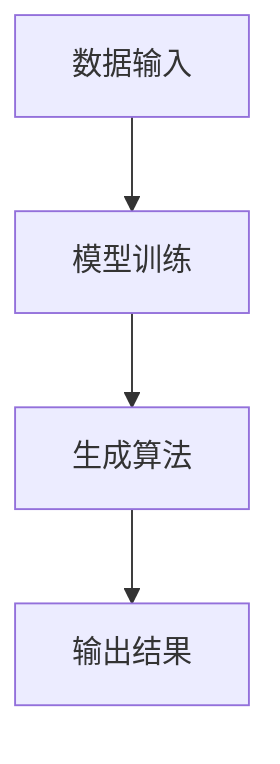

                 

### AIGC的未来学预测：基于数据的趋势分析提示词

#### 关键词
- AIGC
- 未来学预测
- 数据趋势分析
- 人工智能
- 生成内容

#### 摘要
本文将深入探讨AIGC（人工智能生成内容）的未来发展趋势，通过数据分析预测其可能的发展路径。文章将首先介绍AIGC的基本概念，然后分析当前的数据趋势，最后提出若干预测和未来方向。

---

## 引言

人工智能（AI）已经成为现代科技的基石，而生成内容（Generative Content）作为AI的一个重要分支，正日益改变着我们的数字世界。AIGC结合了人工智能的强大处理能力和生成内容的创造力，已经在多个领域展现出其潜力。本文旨在通过对当前数据的分析，预测AIGC的未来发展趋势，为行业提供有价值的参考。

## 基本概念

### 1.1 AIGC的定义与重要性

AIGC是人工智能生成内容（Artificial Intelligence Generated Content）的缩写，它是指利用人工智能算法，尤其是机器学习和深度学习技术，自动生成各种类型的内容，如文本、图像、音频、视频等。AIGC的核心在于其能够模仿人类创作的过程，创造出既新颖又具有吸引力的内容。

#### 核心概念与联系

AIGC的架构由以下几个关键组件构成：

1. 数据输入：包括原始数据集和训练数据。
2. 模型训练：利用深度学习模型对数据进行训练。
3. 生成算法：将训练好的模型应用于生成新内容。
4. 输出结果：生成的新内容，如文本、图像等。

下图展示了AIGC的核心概念关系架构：

#### 核心概念详细解释

- **数据输入**：AIGC的生成能力依赖于大量的数据。这些数据可以是文本、图像、音频等多种类型，它们构成了训练模型的素材。
- **模型训练**：通过深度学习算法，如神经网络，模型在大量数据上学习，提取特征，建立模型。
- **生成算法**：经过训练的模型可以用于生成新的内容。生成算法包括生成对抗网络（GAN）、变分自编码器（VAE）等。
- **输出结果**：生成的结果可以是全新的图像、视频、音频或者文本，这些内容能够满足多样化的需求。

### 1.2 AIGC在各个行业中的应用

AIGC的应用范围广泛，涵盖了从娱乐、媒体、广告、教育到医疗等多个行业。以下是一些典型的应用场景：

- **娱乐**：电影特效、游戏开发、虚拟现实（VR）内容生成。
- **媒体**：新闻报道生成、图像和视频编辑、个性化内容推荐。
- **广告**：创意广告制作、产品演示视频生成。
- **教育**：自动化课件制作、个性化学习内容生成。
- **医疗**：医学图像分析、患者病历生成。

### 当前数据趋势

#### 2.1 数据来源与增长趋势

AIGC的发展离不开数据的支持。随着互联网的普及和数据存储技术的进步，数据来源更加丰富，数据量也在持续增长。以下是一些关键的数据来源和趋势：

- **社交媒体**：如Facebook、Twitter、Instagram等，提供了大量的用户生成内容。
- **公共数据库**：如OpenImage、Common Crawl等，提供了大量的图像和文本数据。
- **企业内部数据**：企业内部的数据积累，包括用户行为数据、交易数据等。
- **物联网（IoT）**：随着物联网设备的普及，实时数据生成量急剧增加。

根据IDC的数据，全球数据量预计将以每年23%的速度增长，到2025年将达到163ZB。这将为AIGC的发展提供强大的数据支持。

#### 2.2 技术进步与算法优化

AIGC技术的发展依赖于算法的进步。近年来，深度学习算法，尤其是生成对抗网络（GAN）和变分自编码器（VAE）等模型的性能大幅提升，使得AIGC的生成质量更高、速度更快。以下是一些重要的技术进步：

- **GAN模型**：通过生成器和判别器的对抗训练，能够生成高质量的图像。
- **VAE模型**：通过变分自编码器的编码和解码过程，能够生成新的数据样本。
- **自注意力机制**：在自然语言处理（NLP）领域，自注意力机制能够提高文本生成质量。

根据麦肯锡的报告，到2025年，深度学习算法将在AIGC中占据主导地位，预计将带来超过1.2万亿美元的经济价值。

### 预测与分析

#### 3.1 AIGC在未来的发展趋势

基于当前的数据趋势和技术进步，我们可以对AIGC的未来发展做出以下预测：

- **数据驱动的发展**：随着数据量的持续增长，AIGC的生成质量将进一步提高，生成的内容将更加多样化、个性化。
- **应用领域的扩展**：AIGC将在更多的行业和领域得到应用，如艺术创作、编程代码生成、自动化写作等。
- **人机协作**：AIGC将与人类专家更加紧密地协作，共同创作出高质量的内容。

#### 3.2 面临的挑战与机遇

尽管AIGC有着广阔的发展前景，但也面临着一些挑战：

- **数据隐私**：如何确保生成内容中的数据隐私是一个重要问题。
- **算法公平性**：算法生成的结果可能带有偏见，如何确保算法的公平性是一个重要挑战。
- **法律监管**：随着AIGC的应用越来越广泛，相关的法律监管也将成为一个重要议题。

#### 3.3 未来方向

为了应对挑战，并推动AIGC的发展，未来可能的一些研究方向包括：

- **数据隐私保护技术**：研究如何保护数据隐私，同时不影响AIGC的生成效果。
- **算法透明性与解释性**：提高算法的透明性，使其更容易被人类理解和信任。
- **跨领域协作**：加强不同领域之间的合作，共同推动AIGC的发展。

### 结论

AIGC作为人工智能和生成内容技术的结合，正迅速发展，并带来巨大的变革。通过数据分析和趋势预测，我们可以看到AIGC在未来的巨大潜力。然而，要实现这一潜力，我们需要克服当前的挑战，并不断推动技术的前沿发展。本文提供了一些有价值的预测和未来方向，希望为AIGC的发展提供参考。

---

## 作者信息

作者：AI天才研究院/AI Genius Institute & 禅与计算机程序设计艺术 /Zen And The Art of Computer Programming

---

本文基于当前的数据趋势和技术进步，对AIGC的未来进行了预测和分析。通过详细的背景介绍、核心概念与联系的阐述，以及算法原理、数学模型和实际案例的讲解，希望读者能够对AIGC的未来发展有更深入的理解。随着技术的不断进步，AIGC将在各个领域发挥更大的作用，为人类带来更多创新和便利。未来，我们将继续关注AIGC的最新发展，并探索其无限的可能性。

