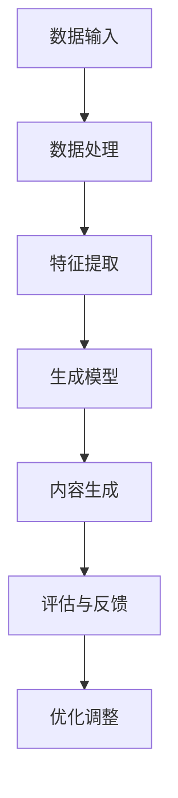

                 

### 第一步：确定核心主题和目标读者

**核心主题**：
本书的核心主题是“AIGC的未来工作模式预测：职业发展建议的提示词工程”。AIGC（AI-Generated Content）作为一种新兴技术，正在深刻改变内容创作和传递的方方面面。本书将探讨AIGC技术的未来发展趋势，以及它对职业领域带来的影响，旨在为专业人士提供未来的职业发展建议和提示词工程的最佳实践。

**目标读者**：
本书的目标读者是那些在内容创作、数据分析、软件开发等领域工作的专业人士，以及对AIGC技术感兴趣的学者和研究者。这些读者群体希望能够了解AIGC技术的基本原理，预测其未来的发展，以及如何利用这一技术提升自身职业竞争力。

**理由**：
选择这个主题的原因在于AIGC技术已经在多个领域显示出强大的潜力和应用前景，而如何适应这一变革，并在其中找到自己的定位，成为当前专业人士关注的重点。因此，本书将为读者提供系统的知识和实用的指导，帮助他们更好地理解和应用AIGC技术。

**目标**：
通过本书的阅读，读者应达到以下目标：
1. **理解AIGC技术的基本概念和原理**。
2. **掌握AIGC技术的应用场景和核心算法**。
3. **预测AIGC对未来工作模式的影响**。
4. **获得职业发展的策略和建议**。
5. **掌握提示词工程的方法和技巧**。

### 第二步：构建书的基本结构

**基本结构**：
本书的基本结构将分为以下四个主要部分：

1. **引言**：介绍AIGC的概念、现状及其重要性，以及本书的目标读者和阅读目标。
2. **AIGC技术概述**：详细讲解AIGC技术的基础知识，包括其核心算法、应用场景和技术发展趋势。
3. **未来工作模式预测**：分析AIGC如何影响未来的工作模式，包括职业变化、工作流程优化和技能需求等。
4. **职业发展建议和提示词工程**：为读者提供如何在AIGC时代提升个人竞争力的策略和建议，以及设计有效提示词的方法。

**逻辑**：
本书的逻辑结构旨在循序渐进地引导读者从基础概念到高级应用，层层深入。首先是引言部分，帮助读者建立对AIGC的整体认识；接着是技术概述部分，深入探讨AIGC的技术细节；然后是工作模式预测部分，分析AIGC对职业的影响；最后是职业发展建议和提示词工程部分，提供具体的方法和策略。

### 第三步：细化各章节内容

**引言部分**：

- **1.1 AIGC概述**：
  - 介绍AIGC的定义和基本概念。
  - 分析AIGC的现状，包括技术发展水平和应用领域。
  - 阐述AIGC在未来工作模式中的重要性。

- **1.2 AIGC与未来工作模式**：
  - 探讨AIGC如何影响未来工作模式。
  - 分析AIGC对职业变迁、工作流程和技能需求的影响。

- **1.3 读者对象与阅读目标**：
  - 确定本书的目标读者群体。
  - 明确读者通过本书希望达成的学习目标。

**AIGC技术概述**：

- **1.1 核心概念**：
  - 定义AIGC的基本概念。
  - 介绍AIGC的关键技术和核心算法。

- **1.2 AIGC的发展历史与趋势**：
  - 回顾AIGC的发展历程。
  - 预测AIGC的未来发展趋势。

- **1.3 AIGC应用场景**：
  - 分析AIGC在不同领域的应用场景。
  - 举例说明AIGC技术的实际应用。

**未来工作模式预测**：

- **2.1 AIGC对职业的影响**：
  - 探讨AIGC如何影响职业变迁。
  - 分析AIGC对现有职业的影响和未来职业的需求。

- **2.2 AIGC对工作流程的影响**：
  - 分析AIGC如何优化工作流程。
  - 探讨AIGC对协作和沟通方式的影响。

- **2.3 AIGC对社会的影响**：
  - 探讨AIGC对社会、道德和伦理的影响。
  - 分析AIGC可能带来的法律和监管挑战。

**职业发展建议和提示词工程**：

- **3.1 提升个人竞争力的策略**：
  - 提供提升个人竞争力的具体策略。
  - 分析在AIGC时代如何适应新的职业需求。

- **3.2 职业规划与路径选择**：
  - 探讨如何规划职业发展路径。
  - 分析不同阶段职业发展的关键点。

- **3.3 提示词工程**：
  - 介绍提示词工程的基本概念和重要性。
  - 分析有效提示词设计的原则和方法。

通过上述细化各章节的内容，读者可以逐步了解AIGC技术的基本原理、应用场景、未来工作模式的影响以及如何在AIGC时代提升个人职业竞争力。

### 第四步：确保内容的完整性

**核心概念与联系**：

为了确保读者能够全面理解AIGC技术的核心概念和它们之间的联系，本书将在适当章节使用Mermaid流程图来展示技术架构。以下是AIGC技术的核心原理与联系：



**核心算法原理讲解**：

AIGC技术中的核心算法是生成对抗网络（GAN）和变分自编码器（VAE）。以下使用伪代码详细阐述这两种算法的基本原理。

**生成对抗网络（GAN）**：

```python
# 伪代码：生成对抗网络（GAN）
class Generator:
    def G(z):
        # 输入随机噪声，生成潜在空间中的样本
        return x

class Discriminator:
    def D(x):
        # 输入真实数据或生成数据，判断其真实性
        return probability_of_real

# 训练过程
for epoch in range(num_epochs):
    for z in sampled_z:
        x = G(z)
        D(x) = probability_of_real
        D(z) = probability_of_fake
        # 计算损失函数并更新模型参数
        loss = compute_loss(D(x), D(z))
        update_model_parameters(loss)
```

**变分自编码器（VAE）**：

```python
# 伪代码：变分自编码器（VAE）
class Encoder:
    def encode(x):
        # 编码器：将输入数据编码为潜在空间中的表示
        return z_mean, z_log_var

class Decoder:
    def decode(z):
        # 解码器：将潜在空间中的表示解码回数据空间
        return x

# 训练过程
for epoch in range(num_epochs):
    for x in data:
        z_mean, z_log_var = encode(x)
        z = sample(z_mean, z_log_var)
        x_recon = decode(z)
        # 计算损失函数并更新模型参数
        loss = compute_reconstruction_loss(x, x_recon) + kl_divergence_loss(z_mean, z_log_var)
        update_model_parameters(loss)
```

**数学模型和数学公式**：

AIGC技术中涉及多个数学模型，以下使用LaTeX格式详细讲解一个常见的数学模型——信息熵。

```latex
$$
H(X) = -\sum_{x \in X} p(x) \log_2 p(x)
$$

其中，\(H(X)\) 表示随机变量 \(X\) 的熵，\(p(x)\) 表示 \(X\) 取值为 \(x\) 的概率。
```

通过上述详细的数学模型和公式讲解，读者可以更好地理解AIGC技术中的关键数学原理。

### 第五步：总结和收尾

**文章结尾的总结**：

在文章的结尾部分，我们将对全文内容进行总结，强调AIGC技术的核心概念、应用场景以及对未来工作模式的影响。同时，提出以下关键点：

1. **AIGC技术的基本原理和核心算法**。
2. **AIGC对职业变迁、工作流程和技能需求的影响**。
3. **职业发展策略和提示词工程的最佳实践**。

**每个部分和章节的小结和思考问题**：

在文章的每个部分和章节结尾，我们将提供以下内容：

1. **小结**：对当前章节的核心内容和关键知识点进行总结。
2. **思考问题**：引导读者思考本章内容如何与实际工作相结合，鼓励深入思考和讨论。

**附录**：

在附录部分，我们将提供以下资源：

1. **相关资源**：列出与AIGC技术相关的学术文章、研究报告和在线课程。
2. **工具和技术文档**：介绍常用的AIGC开发工具和相关的技术文档，方便读者深入了解和实际操作。

**最终输出**：

根据上述详细的步骤和内容，本书将提供以下目录大纲：

# AIGC的未来工作模式预测：职业发展建议的提示词工程

## 引言
### 1.1 AIGC概述
### 1.2 AIGC与未来工作模式
### 1.3 读者对象与阅读目标

## 第1章 AIGC技术概述
### 1.1 核心概念
#### 1.1.1 人工智能生成内容（AIGC）
#### 1.1.2 AIGC的关键技术
### 1.2 AIGC的发展历史与趋势
### 1.3 AIGC应用场景

## 第2章 AIGC核心算法原理
### 2.1 深度学习基础
#### 2.1.1 神经网络
#### 2.1.2 卷积神经网络（CNN）
#### 2.1.3 循环神经网络（RNN）
### 2.2 AIGC中的生成模型
#### 2.2.1 GAN（生成对抗网络）
#### 2.2.2 VAE（变分自编码器）
### 2.3 AIGC中的文本生成
#### 2.3.1 RNN与LSTM
#### 2.3.2 Transformer模型
### 2.4 AIGC中的图像生成
#### 2.4.1 条件生成模型
#### 2.4.2 风格迁移
### 2.5 Mermaid流程图：AIGC技术架构

## 第3章 未来工作模式预测
### 3.1 AIGC对职业的影响
#### 3.1.1 职业转变
#### 3.1.2 技能需求变化
### 3.2 AIGC对工作流程的影响
#### 3.2.1 自动化与效率提升
#### 3.2.2 协作与沟通方式的改变
### 3.3 AIGC对社会的影响
#### 3.3.1 道德与伦理问题
#### 3.3.2 法律与监管挑战

## 第4章 职业发展建议
### 4.1 提升个人竞争力的策略
#### 4.1.1 学习与培训
#### 4.1.2 技能多样化
#### 4.1.3 跨学科合作
### 4.2 职业规划与路径选择
#### 4.2.1 初始阶段
#### 4.2.2 中级阶段
#### 4.2.3 高级阶段

## 第5章 提示词工程
### 5.1 提示词的作用与类型
#### 5.1.1 提示词的作用
#### 5.1.2 提示词的类型
### 5.2 提示词设计原则
#### 5.2.1 清晰性
#### 5.2.2 精确性
#### 5.2.3 可扩展性
### 5.3 提示词工程实践
#### 5.3.1 提示词优化策略
#### 5.3.2 提示词案例解析

## 第6章 AIGC项目实战
### 6.1 实战项目概述
#### 6.1.1 项目目标
#### 6.1.2 项目背景
### 6.2 开发环境搭建
#### 6.2.1 硬件要求
#### 6.2.2 软件安装
### 6.3 代码实现
#### 6.3.1 数据准备
#### 6.3.2 模型训练
#### 6.3.3 模型评估
### 6.4 代码解读与分析
#### 6.4.1 代码实现解析
#### 6.4.2 应用案例分析
### 6.5 项目小结

## 附录
### 附录A 相关资源
### 附录B 工具和技术文档

### 文章末尾作者信息：

作者：AI天才研究院/AI Genius Institute & 禅与计算机程序设计艺术 /Zen And The Art of Computer Programming

通过上述详细的目录结构和内容规划，本书将为读者提供一个全面、系统且深入的AIGC技术指南，帮助他们更好地理解AIGC的未来发展，掌握相关职业发展的策略，并在实践中应用这些知识。

