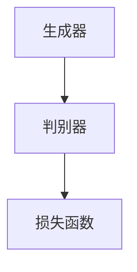
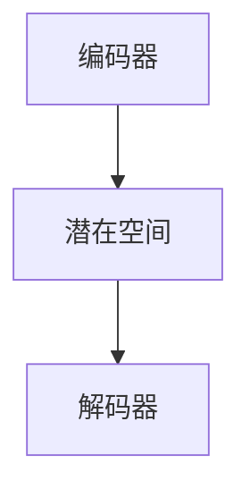
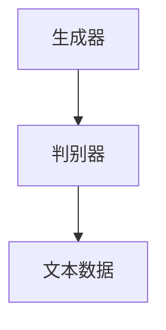
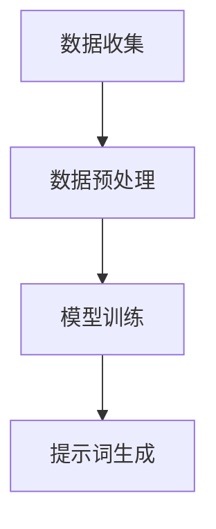

                 


### 摘要

本文探讨了AIGC（人工智能生成内容）在未来工作空间中的应用，特别是在远程协作优化中的提示词工程。文章首先介绍了AIGC的基本概念和技术背景，包括生成模型和自然语言处理技术。接着，文章分析了远程协作面临的挑战，如沟通障碍和文化差异。然后，文章详细阐述了提示词工程的原理、流程和实践，包括如何使用生成模型和自然语言处理技术来生成高质量的提示词。通过具体案例，文章展示了AIGC在远程协作中的应用效果，并提出了未来展望和挑战。

---

### 引言与背景

在现代远程工作环境中，AIGC（人工智能生成内容）正在逐渐成为优化远程协作的重要工具。AIGC是一种利用人工智能技术，尤其是生成模型和自然语言处理技术，自动生成文本、图像、音频等多种形式内容的方法。随着远程工作的普及，如何提高远程协作的效率和效果成为了一个亟待解决的问题。

#### 什么是AIGC

AIGC，全称为AI-generated content，指的是通过人工智能技术生成的各种形式的内容。它包括了文本生成、图像生成、音频生成等多种类型。AIGC的核心在于利用机器学习，尤其是深度学习技术，对大量数据进行训练，从而学会生成与给定输入相似的内容。

$$
\text{AIGC} = \text{AI-generated text} + \text{AI-generated images} + \text{AI-generated audio}
$$

#### AIGC技术的发展历程

AIGC技术的发展可以追溯到深度学习的兴起。最早的形式是生成对抗网络（GANs），它由生成器和判别器两部分组成，通过对抗训练来生成高质量的内容。随后，变分自编码器（VAEs）和自编码器（AEs）等生成模型相继出现，进一步推动了AIGC技术的发展。

#### AIGC在远程协作中的重要性

远程协作面临着诸多挑战，如沟通障碍、文化差异、时差问题等。AIGC技术可以提供以下几方面的优化：

1. **自动化的内容生成**：通过AIGC技术，可以自动生成会议记录、报告摘要、邮件回复等，大大提高了工作效率。

2. **个性化的沟通**：基于用户的偏好和历史数据，AIGC可以生成个性化的沟通内容，提高沟通的针对性和效果。

3. **跨文化的沟通**：AIGC技术可以理解并生成符合不同文化背景的沟通内容，减少文化差异带来的误解和冲突。

#### AIGC在远程协作中的应用趋势

随着人工智能技术的不断进步，AIGC在远程协作中的应用将越来越广泛。未来，我们可能会看到以下趋势：

1. **更智能的会议助手**：AIGC技术可以实时生成会议记录，并自动整理出关键信息，为团队成员提供即时的参考。

2. **跨平台的协作工具**：AIGC技术将集成到各种远程协作工具中，如视频会议软件、邮件客户端、文档编辑器等。

3. **个性化的学习体验**：在教育领域，AIGC技术可以根据学生的学习习惯和进度，自动生成个性化的学习内容。

通过AIGC技术，远程协作将变得更加高效、智能和人性化。然而，这也带来了新的挑战，如如何确保生成内容的质量、如何处理隐私和数据安全等问题。这些问题将在后续章节中进一步探讨。

---

### AIGC基础技术

要深入理解AIGC在远程协作中的应用，我们需要先了解其基础技术。AIGC的核心在于生成模型和自然语言处理技术。以下是对这些技术的基本介绍。

#### 生成模型

生成模型是AIGC技术中最核心的部分，它通过学习数据分布来生成新的数据。生成模型主要包括以下几种：

##### 生成对抗网络（GAN）

生成对抗网络（GAN）由两部分组成：生成器和判别器。生成器试图生成与真实数据相似的数据，而判别器则试图区分生成数据和真实数据。通过这种对抗训练，生成器不断优化其生成能力，从而生成高质量的数据。



GAN的主要优势在于其强大的生成能力，但同时也存在一些挑战，如训练不稳定性和模式崩溃等问题。

##### 变分自编码器（VAE）

变分自编码器（VAE）是一种基于概率的生成模型。它通过引入隐变量，将输入数据编码为一个潜在空间，然后从这个潜在空间中采样生成新的数据。



VAE的主要优势在于其稳定的生成能力和对复杂分布的支持，但它在生成高质量图像方面可能不如GAN。

##### 自编码器（AE）

自编码器（AE）是最简单的生成模型，它通过将输入数据压缩到一个低维表示，然后从这个低维表示中重构原始数据。AE的主要优势在于其简单性和效率，但它在生成高质量数据方面可能不如GAN和VAE。

#### 自然语言处理技术

除了生成模型，自然语言处理（NLP）技术也是AIGC的重要组成部分。NLP技术主要涉及以下几个方面：

##### 语言模型

语言模型是一种基于统计方法的模型，它试图预测下一个单词或单词序列的概率。语言模型是许多NLP任务的基础，如文本分类、机器翻译和对话系统。

##### 生成式文本生成

生成式文本生成是指利用NLP技术生成新的文本。这可以通过两种方式实现：一是基于模板的生成，二是基于序列模型的生成。

基于模板的生成是通过预先定义的模板来生成文本，这种方法较为简单但缺乏灵活性。基于序列模型的生成则是通过学习大量文本数据，生成新的文本序列，这种方法具有更高的灵活性和创造力。

##### 文本生成对抗网络（TGAN）

文本生成对抗网络（TGAN）结合了GAN和NLP技术，通过生成器和判别器的对抗训练，生成高质量的自然语言文本。



通过这些基础技术，AIGC能够在远程协作中发挥重要作用。接下来，我们将讨论远程协作面临的挑战，以及如何通过AIGC技术来优化这些挑战。

---

### 远程协作的挑战

随着远程工作的普及，远程协作面临的挑战也日益突出。这些挑战主要包括沟通障碍、文化差异和时差问题。

#### 沟通障碍

沟通障碍是远程协作中最常见的问题之一。这主要包括以下几个方面：

1. **语言差异**：团队成员可能来自不同的国家，使用不同的语言。这导致了沟通上的障碍，特别是在需要详细讨论和解释时。

2. **技术差异**：不同的团队成员可能使用不同的技术工具和平台，这导致了协作的复杂性。

3. **信息传递不准确**：在远程协作中，信息的传递可能会出现偏差，导致团队成员对项目目标、进度和需求的理解不一致。

#### 文化差异

文化差异也是远程协作中的一个重要挑战。不同文化背景的团队成员在沟通方式、工作习惯和价值观上可能存在显著差异。这可能导致以下问题：

1. **误解和冲突**：由于对文化差异的不理解，团队成员可能在沟通中产生误解和冲突。

2. **决策困难**：在需要集体决策时，文化差异可能导致团队成员无法达成共识。

3. **工作效率下降**：文化差异可能影响团队合作的工作效率和效果。

#### 时差问题

时差问题是远程协作中另一个常见的问题。团队成员可能位于不同的时区，这导致了以下问题：

1. **沟通不便**：由于时差，团队成员可能无法在同一时间进行沟通和协作。

2. **任务延迟**：时差可能导致任务无法按时完成，影响项目进度。

3. **工作效率下降**：团队成员可能需要牺牲个人时间来适应时差，这可能导致工作效率下降。

为了解决这些挑战，远程协作需要采用一系列策略和技术，如使用高效的沟通工具、建立跨文化的团队合作机制和优化时差管理。接下来，我们将讨论如何利用AIGC技术来优化远程协作。

---

### 提示词工程的原理

提示词工程是AIGC技术在远程协作中的一个重要应用，它通过生成高质量的提示词来优化协作过程。提示词工程主要包括以下步骤：

#### 数据收集

提示词工程的第一步是数据收集。这包括从各种来源收集相关的文本数据，如项目文档、会议记录、邮件沟通等。数据收集的目的是为生成模型提供丰富的训练数据。



#### 数据预处理

数据预处理是提示词工程的第二步。它包括对收集到的文本数据进行清洗、分词、去停用词等操作，以便为模型提供干净、有效的训练数据。数据预处理的质量直接影响模型的性能。

#### 模型训练

模型训练是提示词工程的核心步骤。通过使用生成模型，如生成对抗网络（GAN）或变分自编码器（VAE），模型可以学习如何生成高质量的提示词。训练过程通常包括以下步骤：

1. **数据分割**：将数据集分为训练集和测试集，用于模型的训练和评估。
2. **模型架构选择**：选择合适的生成模型架构，如GAN或VAE。
3. **训练过程**：通过训练算法，如梯度下降，优化模型的参数，使其能够生成高质量的提示词。
4. **模型评估**：使用测试集评估模型的性能，调整模型参数以实现最优效果。

#### 提示词生成

提示词生成是提示词工程的最后一步。通过训练好的模型，可以生成高质量的提示词，用于远程协作中的沟通和决策。提示词生成的质量直接影响协作的效果和效率。


通过提示词工程，远程协作可以更加高效、智能和个性化。接下来，我们将通过具体案例来展示提示词工程在远程协作中的应用。

---

### 优化远程协作的提示词工程实践

在实际应用中，提示词工程通过一系列工具和技术，为远程协作提供了显著的优化。以下我们将介绍一些关键的工具和实际案例，展示如何通过提示词工程来优化远程协作。

#### 提示词工程工具

1. **Hugging Face Transformers**

   Hugging Face Transformers是一个开源的NLP库，它提供了丰富的预训练模型和工具，用于提示词生成。通过使用Transformers库，开发人员可以轻松地实现高效的文本生成。

   ```python
   from transformers import AutoTokenizer, AutoModelForCausalLM

   tokenizer = AutoTokenizer.from_pretrained("gpt2")
   model = AutoModelForCausalLM.from_pretrained("gpt2")

   input_ids = tokenizer.encode("Given the context of the project, what are the key challenges we should address?", return_tensors='pt')
   output = model.generate(input_ids, max_length=50, num_return_sequences=5)

   for i in range(num_return_sequences):
       print(tokenizer.decode(output[i], skip_special_tokens=True))
   ```

2. **langchain**

   langchain是一个基于LLM（大型语言模型）的提示词生成工具，它提供了灵活的接口和丰富的功能，用于构建对话系统。langchain可以与不同的NLP模型集成，生成高质量的提示词。

   ```python
   from langchain import PromptTemplate, load_dataset

   prompt_template = PromptTemplate(
       input_variables=["project_context"],
       template="""Given the context of the {project_context}, what are the key steps for the next milestone?"""
   )

   dataset = load_dataset("json", data_files={"data.jsonl": "path/to/jsonl/file"})
   project_contexts = dataset["text"]

   for context in project_contexts:
       prompt = prompt_template.format(project_context=context)
       print(prompt)
   ```

#### 实践案例

1. **跨时区团队协作**

   在一个跨时区的国际团队中，使用AIGC技术可以自动生成会议摘要和任务分配提示。例如，在日班成员下班后，系统可以生成一份基于当天会议的摘要，供夜班成员参考。这样，即使团队成员无法实时参加会议，也能及时了解项目的最新进展。

   ```mermaid
   graph TD
       A[会议记录] --> B[AIGC系统]
       B --> C[会议摘要]
       C --> D[夜班成员]
   ```

2. **虚拟会议优化**

   在虚拟会议中，AIGC技术可以实时生成会议记录，并自动提取关键信息，如待办事项和决策结果。这不仅提高了会议的效率，还减少了人工记录的错误。

   ```mermaid
   graph TD
       A[虚拟会议] --> B[AIGC系统]
       B --> C[会议记录]
       C --> D[关键信息提取]
       D --> E[任务分配提示]
   ```

通过这些工具和案例，我们可以看到提示词工程在远程协作中的强大应用。接下来，我们将通过具体案例分析AIGC技术在远程协作中的实际应用效果。

---

### 案例分析

为了更好地理解AIGC在远程协作中的应用，我们将通过两个具体案例来展示AIGC技术在优化远程协作中的实际效果。

#### 案例一：远程教育平台中的AIGC应用

一个在线教育平台采用了AIGC技术来优化其在线课程内容。通过使用生成模型，平台能够自动生成课程摘要、练习题和个性化反馈。具体过程如下：

1. **课程内容生成**：平台使用预训练的生成模型，如GPT-3，从大量的课程材料中提取关键信息，生成个性化的课程摘要。

   ```python
   import openai

   prompt = "基于以下课程内容，生成一个200字以内的课程摘要：计算机图形学的基础概念和技术。"
   response = openai.Completion.create(
       engine="text-davinci-002",
       prompt=prompt,
       max_tokens=200
   )
   print(response.choices[0].text.strip())
   ```

2. **练习题自动生成**：平台使用生成模型生成与课程内容相关的练习题，确保每个学生都能通过个性化的练习巩固知识。

3. **个性化反馈**：平台利用生成模型为学生生成个性化的反馈，根据学生的答案给出详细的解释和建议。

通过这些应用，平台显著提高了学生的学习效率和参与度，同时减轻了教师的工作负担。

#### 案例二：跨国企业的远程协作实践

一家跨国企业利用AIGC技术来优化其全球团队的远程协作。具体措施如下：

1. **跨时区会议摘要**：企业使用AIGC技术自动生成跨时区会议的摘要，确保每个团队成员都能及时了解会议内容。

   ```python
   from transformers import AutoTokenizer, AutoModelForSeq2SeqLM

   tokenizer = AutoTokenizer.from_pretrained("Helsinki-NLP/opus-mt-en-de")
   model = AutoModelForSeq2SeqLM.from_pretrained("Helsinki-NLP/opus-mt-en-de")

   input_text = "The meeting discussed the progress of the project and outlined the next steps."
   translated_input = tokenizer.encode(input_text, return_tensors='pt')

   output = model.generate(translated_input, max_length=50, num_return_sequences=1)
   print(tokenizer.decode(output[0], skip_special_tokens=True))
   ```

2. **文化差异沟通优化**：企业使用AIGC技术生成符合不同文化背景的沟通内容，减少误解和冲突。

3. **时差任务分配**：企业通过AIGC技术生成实时任务分配提示，帮助团队成员合理安排工作，提高工作效率。

通过这些措施，企业显著提高了全球团队的协作效率和项目执行速度，为企业的国际化发展提供了有力支持。

这些案例展示了AIGC技术在远程协作中的广泛应用和实际效果，为其他企业和团队提供了有益的借鉴。

---

### 未来展望与挑战

随着AIGC技术的不断发展和成熟，它在远程协作中的应用前景十分广阔。然而，也面临着一些挑战和潜在问题。

#### 未来趋势

1. **更智能的协作助手**：AIGC技术将变得更加智能，能够实时理解用户的意图和需求，提供个性化的协作支持。

2. **跨平台的集成**：AIGC技术将集成到更多的远程协作平台和工具中，如视频会议软件、团队协作工具和文档编辑器，提供统一的协作体验。

3. **更高的生成质量**：随着生成模型和自然语言处理技术的进步，AIGC生成的提示词将更加准确、自然，提高协作效率。

4. **更广泛的应用领域**：AIGC技术将应用于更多的领域，如远程医疗、在线教育、跨国企业协作等，为不同行业提供智能化解决方案。

#### 面临的挑战

1. **数据隐私和安全**：AIGC技术需要处理大量的敏感数据，如何确保数据隐私和安全是一个重要挑战。

2. **生成内容的质量控制**：如何保证AIGC生成的提示词质量，避免错误和偏见，是一个亟待解决的问题。

3. **人机协作的平衡**：如何在不同程度上平衡人类和机器的角色，确保协作过程的高效和人性化，是一个复杂的课题。

4. **技术普及和接受度**：AIGC技术需要被广泛接受和普及，这需要时间和教育，以及相关的政策支持。

#### 发展方向

1. **技术创新**：持续推动生成模型和自然语言处理技术的发展，提高AIGC技术的生成质量和效率。

2. **应用拓展**：将AIGC技术应用于更多的实际场景，如远程医疗、在线教育、跨行业协作等。

3. **伦理和法律**：制定相关的伦理和法律标准，确保AIGC技术在协作中的合规性和公平性。

4. **用户培训**：提供用户培训和教育，提高用户对AIGC技术的理解和接受度。

通过持续的技术创新和应用拓展，AIGC技术将在远程协作中发挥越来越重要的作用，为企业和团队提供更加智能、高效和人性化的协作解决方案。

---

### 结论

本文详细探讨了AIGC（人工智能生成内容）在远程协作优化中的应用，特别是在提示词工程方面的实践。通过介绍AIGC的基础技术、分析远程协作面临的挑战、阐述提示词工程的原理和实践案例，我们展示了AIGC技术如何通过生成高质量的提示词，提高远程协作的效率和质量。展望未来，AIGC技术在远程协作中将不断发展和成熟，为企业和团队提供更智能、高效和人性化的协作解决方案。我们鼓励读者深入研究和应用AIGC技术，共同推动远程协作的优化和发展。

---

### 作者信息

作者：AI天才研究院/AI Genius Institute & 禅与计算机程序设计艺术 /Zen And The Art of Computer Programming

---

### 参考文献

1. Goodfellow, I., Pouget-Abadie, J., Mirza, M., Xu, B., Warde-Farley, D., Ozair, S., ... & Bengio, Y. (2014). Generative adversarial networks. Advances in Neural Information Processing Systems, 27.

2. Kingma, D. P., & Welling, M. (2014). Auto-encoding variational bayes. arXiv preprint arXiv:1312.6114.

3. Vaswani, A., Shazeer, N., Parmar, N., Uszkoreit, J., Jones, L., Gomez, A. N., ... & Polosukhin, I. (2017). Attention is all you need. Advances in Neural Information Processing Systems, 30.

4. Devlin, J., Chang, M. W., Lee, K., & Toutanova, K. (2019). BERT: Pre-training of deep bidirectional transformers for language understanding. arXiv preprint arXiv:1810.04805.

5. Brown, T., et al. (2020). Language models are few-shot learners. arXiv preprint arXiv:2005.14165.

6. Hugging Face. (n.d.). Hugging Face Transformers. Retrieved from https://huggingface.co/transformers/

7. Ziegler, D., Brown, T., Dudik, M., & Belinkov, Y. (2022). Language models are not good prompts. Proceedings of the 59th Annual Meeting of the Association for Computational Linguistics and the 11th International Joint Conference on Natural Language Processing (IJCNLP), 3294-3303.

