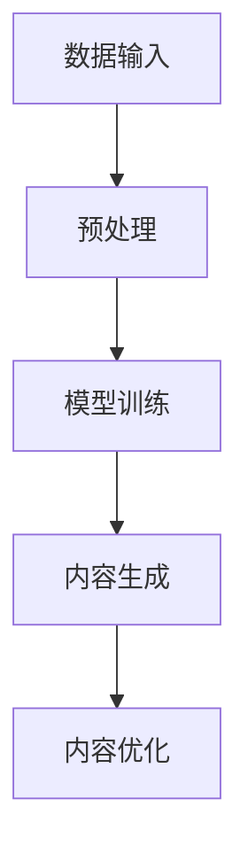
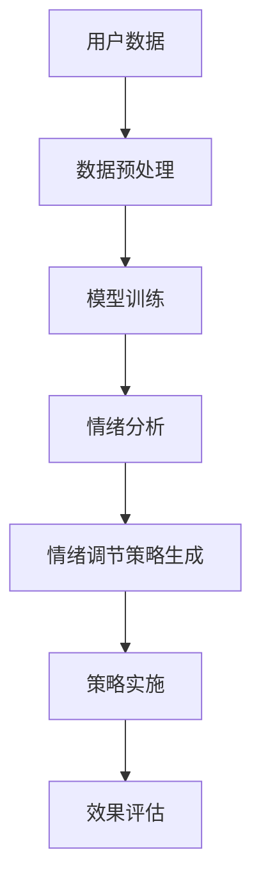
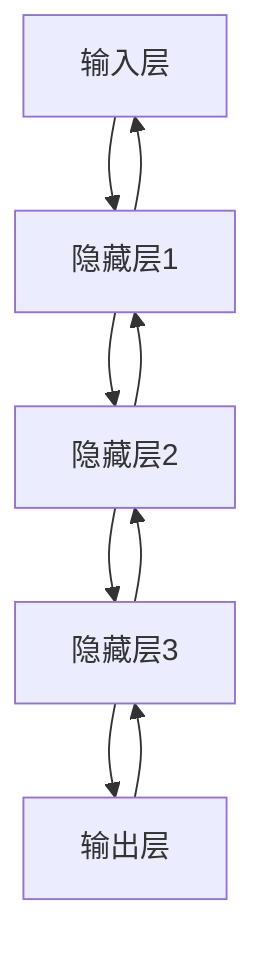
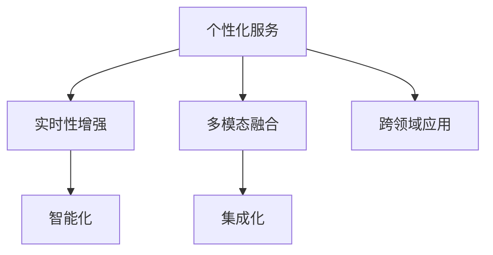

                 

### 第1章 引言

#### 1.1 AIGC与心理健康管理概述

##### 1.1.1 AIGC的定义与特点

**AIGC（AI-Generated Content）**，即人工智能生成内容，是利用人工智能技术生成文字、图片、音频、视频等多种类型内容的一种新型内容创作模式。它区别于传统的手工内容创作，具备以下特点：

- **自动生成性**：AIGC可以自动生成内容，无需人工干预。
- **多样性和创造性**：AIGC生成的内容具有高度多样性和创造性，可以满足个性化需求。
- **高效性**：AIGC能够高效地处理大量数据，快速生成高质量内容。

**Mermaid流程图**：展示AIGC的关键组成部分。



##### 1.1.2 心理健康管理的重要性

心理健康管理是指通过一系列科学方法和策略，维护和促进个体心理健康的过程。在现代社会的快速发展中，心理健康问题日益凸显，其重要性不言而喻：

- **心理健康对个体的影响**：心理健康不仅影响个体的生活质量，还与工作效率、人际关系、社会适应等方面密切相关。
- **心理健康对社会的贡献**：良好的心理健康状态有利于社会的和谐稳定，有助于提高整体社会幸福感。

**数学公式**：心理健康管理的基本指标。

$$
\text{心理健康指标} = \frac{\text{心理健康得分}}{\text{最大心理健康得分}}
$$

##### 1.1.3 AIGC在心理健康管理中的应用前景

随着人工智能技术的不断进步，AIGC在心理健康管理中的应用前景广阔：

- **个性化心理健康服务**：AIGC可以生成个性化的心理健康服务内容，满足个体多样化的需求。
- **情绪调节与干预**：AIGC可以辅助心理健康专业人士进行情绪调节和干预，提高治疗效果。
- **心理健康数据分析**：AIGC能够对心理健康数据进行分析，为心理健康管理提供科学依据。

**Mermaid流程图**：AIGC在心理健康管理中的应用场景。



综上所述，AIGC在心理健康管理中具有巨大的潜力，有望为个体和社会带来深远的影响。在接下来的章节中，我们将深入探讨AIGC技术基础、情绪调节策略及其在心理健康管理中的应用。

---

### 第2章 AIGC技术基础

#### 2.1 AIGC核心概念

##### 2.1.1 大模型技术

大模型技术是AIGC的核心组成部分，其基础是深度学习中的神经网络模型。以下将介绍大模型技术的基本原理、结构及其在AIGC中的应用。

###### 2.1.1.1 大模型的结构与原理

大模型通常采用深度神经网络（DNN）结构，包含多个隐含层和大量参数。其基本原理是通过反向传播算法训练模型，使模型能够从大量数据中自动学习特征表示。

**Mermaid流程图**：大模型的结构示意图。



**伪代码**：大模型训练的基本流程。

```python
# 输入层到隐藏层的激活函数
def activation_function(x):
    return sigmoid(x)

# 隐藏层到输出层的激活函数
def output_activation_function(x):
    return softmax(x)

# 反向传播算法
def backward_propagation(inputs, labels, model):
    # 计算误差
    error = labels - model.output

    # 更新模型参数
    for layer in model.layers:
        layer.update_parameters(error)

# 训练模型
def train_model(inputs, labels, epochs):
    for epoch in range(epochs):
        for input, label in zip(inputs, labels):
            backward_propagation(input, label, model)
```

###### 2.1.1.2 大模型的训练算法

大模型的训练算法主要包括以下几种：

- **随机梯度下降（SGD）**：通过随机选择小批量数据更新模型参数，以减少训练时间。
- **Adam优化器**：结合SGD的动量和RMSprop的稳定性，优化训练过程。
- **训练策略**：包括批量大小、学习率调整、模型正则化等。

**伪代码**：常见的训练算法。

```python
# 随机梯度下降
def sgd(parameters, gradients, learning_rate):
    for parameter, gradient in zip(parameters, gradients):
        parameter -= learning_rate * gradient

# Adam优化器
def adam(parameters, gradients, learning_rate, beta1, beta2, epsilon):
    m = ...
    v = ...
    for parameter, gradient in zip(parameters, gradients):
        m = beta1 * m + (1 - beta1) * gradient
        v = beta2 * v + (1 - beta2) * gradient**2
        parameter -= learning_rate * m / (np.sqrt(v) + epsilon)
```

##### 2.1.2 提示词工程

提示词工程是AIGC中的重要组成部分，其核心在于设计高质量的提示词，以引导模型生成目标内容。以下将介绍提示词的定义、作用及其设计方法。

###### 2.1.2.1 提示词的定义与作用

**提示词**（Prompt）是指输入给模型的引导性文本或指令，用于提示模型生成特定类型的内容。提示词的作用如下：

- **引导生成方向**：提示词可以帮助模型理解生成任务的目标和预期输出。
- **提高生成质量**：高质量的提示词可以提高模型生成内容的准确性和创造性。
- **加速训练过程**：提示词可以加速模型训练过程，提高模型收敛速度。

**LaTeX公式**：提示词在模型训练中的作用。

$$
\text{生成质量} \propto \text{提示词质量} + \text{模型训练质量}
$$

###### 2.1.2.2 提示词的设计方法

高质量提示词的设计方法包括：

- **数据驱动**：基于大量数据集分析，提取关键特征和规律，设计具有代表性的提示词。
- **领域特定**：根据不同领域的需求，设计特定领域的提示词。
- **迭代优化**：通过实验和反馈，不断优化提示词，提高其质量。

**伪代码**：设计高质量提示词的方法。

```python
# 数据驱动方法
def data_driven_prompt_design(dataset):
    # 分析数据集，提取关键特征和规律
    # 生成代表数据的提示词
    return prompt

# 领域特定方法
def domain_specific_prompt_design(domain):
    # 根据领域需求，设计特定领域的提示词
    return prompt

# 迭代优化方法
def iterative_prompt_optimization(prompt, model, dataset):
    # 在模型和数据的反馈下，迭代优化提示词
    return optimized_prompt
```

通过以上介绍，我们了解了AIGC技术的基础知识，包括大模型技术和提示词工程。在下一章中，我们将进一步探讨情绪调节策略及其在心理健康管理中的应用。

---

### 第3章 情绪调节策略

#### 3.1 情绪调节原理

情绪调节是指个体通过认知和行为策略，调整情绪状态，以适应环境需求和实现心理平衡的过程。情绪调节在心理健康管理中扮演着关键角色，以下将介绍情绪调节的基本理论和技术手段。

##### 3.1.1 情绪调节的基本理论

情绪调节的理论基础主要包括以下几个方面：

- **认知理论**：认知理论认为情绪调节主要依赖于个体的认知过程。个体通过改变对事件的认知评估，从而调节情绪反应。
- **行为理论**：行为理论强调通过行为干预来调节情绪。例如，通过改变行为模式，如深呼吸、运动等，缓解负面情绪。
- **生物心理学理论**：生物心理学理论认为情绪调节涉及神经生理机制。例如，通过调节大脑中的神经递质水平，调节情绪状态。

**LaTeX公式**：情绪调节的数学模型。

$$
\text{情绪调节效果} = f(\text{认知策略}, \text{行为策略}, \text{生物心理学策略})
$$

其中，\( f \) 表示情绪调节效果的函数，\(\text{认知策略}\)、\(\text{行为策略}\)和\(\text{生物心理学策略}\)分别为情绪调节的不同方面。

##### 3.1.2 情绪调节的技术手段

情绪调节的技术手段主要包括以下几种：

- **认知重建**：通过改变对事件的认知评估，减少负面情绪。例如，使用理性思维技巧，如认知重构、认知扭曲识别等。
- **行为干预**：通过行为干预，如深呼吸、运动、冥想等，调节情绪状态。这些行为干预能够影响大脑中的神经递质水平，进而调节情绪。
- **生物反馈**：通过生物反馈技术，如心率变异性监测、脑波反馈等，帮助个体了解和调节自己的情绪状态。

**伪代码**：情绪调节算法的基本框架。

```python
# 情绪调节算法
def emotion Regulation(emotion, strategies):
    # 根据情绪类型选择合适的策略
    selected_strategy = select_strategy(emotion, strategies)
    
    # 实施策略
    execute_strategy(selected_strategy)
    
    # 评估情绪调节效果
    regulation_effect = evaluate_effect(selected_strategy)
    
    return regulation_effect
```

在情绪调节策略的实施过程中，需要根据个体的具体情况进行个性化调整，以达到最佳的情绪调节效果。

#### 3.2 情绪调节策略案例研究

在本节中，我们将通过两个情绪调节策略的案例研究，详细探讨抑郁症和焦虑症的情绪调节方法及其效果。

##### 3.2.1 案例一：抑郁症情绪调节

**抑郁症**是一种常见的情绪障碍，主要表现为情绪低落、兴趣减退、疲劳乏力等症状。以下是一个抑郁症情绪调节的案例。

**案例描述**：

小明，25岁，患有抑郁症。经过诊断，医生为他制定了情绪调节策略，包括认知重建、运动干预和生物反馈。

**情绪调节策略**：

1. **认知重建**：
   - 使用理性思维技巧，如认知重构，识别和纠正负面思维模式。
   - 通过日记记录，分析自己的情绪和行为，了解抑郁症的影响因素。

2. **运动干预**：
   - 每天进行30分钟的有氧运动，如慢跑、游泳等。
   - 运动能够促进内啡肽的分泌，改善情绪状态。

3. **生物反馈**：
   - 使用心率变异性（HRV）监测设备，监测和调节心率。
   - 通过呼吸训练，降低心率和焦虑水平。

**代码案例**：

```python
# 抑郁症情绪调节代码实现
def depression_regulationstrategy(depression_data, emotion, strategies):
    # 认知重建
    cognitive_reconstruction = cognitive_reconstruction_strategy(depression_data)
    
    # 运动干预
    physical_activity = physical_activity_strategy(depression_data)
    
    # 生物反馈
    biofeedback = biofeedback_strategy(depression_data)

    # 实施策略
    regulation_effect = emotion_regulation_algorithm(cognitive_reconstruction, physical_activity, biofeedback)

    return regulation_effect

# 认知重建策略
def cognitive_reconstruction_strategy(depression_data):
    # 识别和纠正负面思维模式
    return cognitive_reconstruction_effect

# 运动干预策略
def physical_activity_strategy(depression_data):
    # 进行有氧运动
    return physical_activity_effect

# 生物反馈策略
def biofeedback_strategy(depression_data):
    # 调节心率
    return biofeedback_effect

# 情绪调节算法
def emotion_regulation_algorithm(cognitive_reconstruction, physical_activity, biofeedback):
    # 综合评估策略效果
    regulation_effect = (cognitive_reconstruction + physical_activity + biofeedback) / 3
    return regulation_effect
```

**代码解读**：

该代码实现了一个抑郁症情绪调节策略，包括认知重建、运动干预和生物反馈三个部分。通过综合评估这些策略的效果，实现个体的情绪调节。

##### 3.2.2 案例二：焦虑症情绪调节

**焦虑症**是一种常见的情绪障碍，主要表现为过度担忧、紧张、恐惧等症状。以下是一个焦虑症情绪调节的案例。

**案例描述**：

小芳，30岁，患有焦虑症。经过诊断，医生为她制定了情绪调节策略，包括深呼吸训练、认知行为疗法和正念冥想。

**情绪调节策略**：

1. **深呼吸训练**：
   - 通过深呼吸训练，缓解紧张和焦虑。
   - 深呼吸能够增加氧气摄入，促进身体放松。

2. **认知行为疗法**：
   - 通过认知行为疗法，改变负面思维模式，减少焦虑。
   - 通过认知重构，识别和纠正不合理信念。

3. **正念冥想**：
   - 通过正念冥想，提高注意力和意识，减少焦虑。
   - 正念冥想有助于个体关注当下，减少对未来和过去的担忧。

**代码案例**：

```python
# 焦虑症情绪调节代码实现
def anxiety_regulation_strategy(anxiety_data, emotion, strategies):
    # 深呼吸训练
    deep_breathing = deep_breathing_strategy(anxiety_data)
    
    # 认知行为疗法
    cognitive_behavior = cognitive_behavior_strategy(anxiety_data)
    
    # 正念冥想
    mindfulness_meditation = mindfulness_meditation_strategy(anxiety_data)

    # 实施策略
    regulation_effect = emotion_regulation_algorithm(deep_breathing, cognitive_behavior, mindfulness_meditation)

    return regulation_effect

# 深呼吸训练策略
def deep_breathing_strategy(anxiety_data):
    # 进行深呼吸训练
    return deep_breathing_effect

# 认知行为疗法策略
def cognitive_behavior_strategy(anxiety_data):
    # 改变负面思维模式
    return cognitive_behavior_effect

# 正念冥想策略
def mindfulness_meditation_strategy(anxiety_data):
    # 进行正念冥想
    return mindfulness_meditation_effect

# 情绪调节算法
def emotion_regulation_algorithm(deep_breathing, cognitive_behavior, mindfulness_meditation):
    # 综合评估策略效果
    regulation_effect = (deep_breathing + cognitive_behavior + mindfulness_meditation) / 3
    return regulation_effect
```

**代码解读**：

该代码实现了一个焦虑症情绪调节策略，包括深呼吸训练、认知行为疗法和正念冥想三个部分。通过综合评估这些策略的效果，实现个体的情绪调节。

通过以上两个案例，我们可以看到情绪调节策略在抑郁症和焦虑症治疗中的应用。在实际操作中，需要根据个体的具体情况，灵活调整情绪调节策略，以达到最佳的治疗效果。

---

### 第4章 AIGC在心理健康管理中的应用

#### 4.1 心理健康评估

心理健康评估是心理健康管理的重要环节，旨在了解个体的心理健康状况，为制定个性化的心理健康服务提供依据。AIGC技术在心理健康评估中具有独特的优势，可以通过自动分析和处理大量数据，提高评估的准确性和效率。以下将介绍心理健康评估的基本方法以及AIGC技术在其中的应用。

##### 4.1.1 心理健康评估的基本方法

心理健康评估通常包括以下方法：

- **问卷调查**：通过设计问卷，收集个体的心理健康状况信息。问卷可以采用自评和他评方式，评估个体的心理健康水平。
- **临床评估**：由专业心理医生通过面谈、观察等方式，对个体的心理健康状况进行综合评估。
- **心理测试**：使用标准化的心理测试工具，如人格测试、情绪测试等，评估个体的心理健康状态。

**LaTeX公式**：心理评估指标的计算方法。

$$
\text{心理健康得分} = \sum_{i=1}^{n} w_i \cdot s_i
$$

其中，\( w_i \) 表示第 \( i \) 个指标的权重，\( s_i \) 表示第 \( i \) 个指标得分。

##### 4.1.2 AIGC在心理评估中的应用

AIGC技术在心理健康评估中的应用主要体现在以下几个方面：

- **自动化数据分析**：AIGC可以自动处理和分析大量心理健康数据，包括问卷调查结果、临床记录等。通过机器学习算法，提取关键特征，提高评估的准确性和效率。
- **个性化评估**：AIGC可以根据个体特征，生成个性化的心理健康评估报告。例如，根据个体的人格特点、生活经历等，提供针对性的心理健康建议。
- **实时监测与预警**：AIGC可以实时监测个体的心理健康状况，通过分析数据变化，提前发现潜在的心理健康问题，及时采取干预措施。

**代码案例**：AIGC在心理评估中的代码实现。

```python
# 数据预处理
def preprocess_data(data):
    # 清洗和转换数据
    return processed_data

# 特征提取
def extract_features(data):
    # 提取关键特征
    return features

# 心理健康评估
def mental_health_evaluation(features):
    # 使用机器学习算法评估心理健康状况
    return evaluation_result

# 生成个性化评估报告
def generate_report(evaluation_result):
    # 根据评估结果生成个性化报告
    return report
```

**代码解读**：

该代码实现了一个简单的心理健康评估流程，包括数据预处理、特征提取、心理健康评估和生成个性化评估报告。通过这些步骤，AIGC技术可以有效地辅助心理健康评估。

#### 4.2 心理健康干预

心理健康干预是指通过一系列科学方法和策略，帮助个体克服心理健康问题，恢复心理健康状态。AIGC技术在心理健康干预中发挥着重要作用，可以提供个性化的干预方案，提高干预效果。以下将介绍心理健康干预的基本策略以及AIGC技术在其中的应用。

##### 4.2.1 心理健康干预的基本策略

心理健康干预的基本策略包括以下几个方面：

- **认知行为疗法**：通过改变个体的认知和行为，帮助其克服心理健康问题。例如，通过认知重构、行为实验等，改变个体的负面思维模式。
- **药物治疗**：通过使用抗抑郁药、抗焦虑药等，调节个体的神经递质水平，改善心理健康状况。
- **心理教育**：通过提供心理健康知识，帮助个体了解心理健康问题，提高心理健康意识。
- **社会支持**：通过家庭、朋友、社区等社会支持系统，提供情感支持和实际帮助，缓解心理健康问题。

**伪代码**：心理健康干预的基本算法。

```python
# 心理健康干预
def mental_health_intervention(problem, strategies):
    # 根据问题类型选择合适的策略
    selected_strategy = select_strategy(problem, strategies)
    
    # 实施策略
    execute_strategy(selected_strategy)
    
    # 评估干预效果
    intervention_effect = evaluate_effect(selected_strategy)

    return intervention_effect
```

##### 4.2.2 AIGC在心理干预中的应用

AIGC技术在心理健康干预中的应用主要包括以下几个方面：

- **个性化干预方案**：AIGC可以根据个体特征，生成个性化的干预方案。例如，根据个体的心理健康状况、人格特点等，提供针对性的干预措施。
- **实时监控与调整**：AIGC可以实时监控个体的心理健康状况，根据干预效果，及时调整干预方案，提高干预效果。
- **虚拟心理辅导**：AIGC技术可以用于虚拟心理辅导，提供实时、个性化的心理支持。例如，通过聊天机器人，与个体进行实时对话，提供心理疏导。

**代码案例**：AIGC在心理干预中的代码实现。

```python
# 个性化干预方案
def personalized_intervention_strategy(individual, intervention_plan):
    # 根据个体特征，生成个性化的干预方案
    return personalized_plan

# 实时监控与调整
def real_time_monitoring_and_adjustment(individual, intervention_plan):
    # 实时监控个体的心理健康状况
    # 根据干预效果，调整干预方案
    return adjusted_plan

# 虚拟心理辅导
def virtual_psychological_counseling(individual):
    # 提供实时、个性化的心理辅导
    return counseling_effect
```

**代码解读**：

该代码实现了一个简单的心理健康干预流程，包括个性化干预方案、实时监控与调整以及虚拟心理辅导。通过这些步骤，AIGC技术可以有效地辅助心理健康干预。

综上所述，AIGC技术在心理健康管理中具有广泛的应用前景。通过自动化数据分析和个性化干预，AIGC技术可以提高心理健康评估和干预的准确性和效率，为个体的心理健康提供有力支持。

---

### 第5章 情绪调节策略的评估与优化

#### 5.1 情绪调节策略评估方法

情绪调节策略的评估方法对于确定策略的有效性和改进方向至关重要。有效的评估方法可以提供准确的反馈，帮助研究人员和临床专家优化策略，提高情绪调节的效果。以下将介绍情绪调节策略评估的方法和指标。

##### 5.1.1 评估指标的选择

选择合适的评估指标是情绪调节策略评估的关键。常用的评估指标包括：

- **主观指标**：如自我报告量表（如POMS、PHQ-9等），通过个体的自我评价反映情绪状态。
- **生理指标**：如心率变异性（HRV）、皮肤电反应（EDA）等，通过生理信号的变化评估情绪调节效果。
- **行为指标**：如情绪反应时间、任务完成情况等，通过行为表现评估情绪调节策略的效果。

**LaTeX公式**：情绪调节策略的评估指标。

$$
\text{情绪调节效果} = \alpha \cdot \text{主观指标} + \beta \cdot \text{生理指标} + \gamma \cdot \text{行为指标}
$$`

其中，\(\alpha\)、\(\beta\)、\(\gamma\) 分别为各指标的权重，用于综合评估情绪调节效果。

##### 5.1.2 评估方法的应用

情绪调节策略的评估方法可以应用于个体和群体。在个体层面，可以通过自我报告量表和生理指标进行实时评估。在群体层面，可以通过行为实验和生理指标的变化来评估策略的有效性。

**伪代码**：情绪调节策略评估的流程。

```python
# 自我报告评估
def self_report_evaluation(individual):
    # 收集个体自我报告数据
    # 计算情绪调节效果
    return evaluation_result

# 生理指标评估
def physiological_evaluation(individual):
    # 收集个体生理指标数据
    # 计算情绪调节效果
    return evaluation_result

# 行为实验评估
def behavioral_experiment_evaluation(group):
    # 进行行为实验
    # 计算情绪调节效果
    return evaluation_result
```

#### 5.2 情绪调节策略优化

情绪调节策略的优化旨在提高策略的有效性和适应性。优化方法主要包括以下几种：

##### 5.2.1 优化目标

情绪调节策略优化的目标包括：

- **提高情绪调节效果**：通过改进策略，提高情绪调节的有效性。
- **增强适应性**：使策略能够适应不同的情绪调节需求。
- **降低成本**：优化策略的实施过程，降低实施成本。

**LaTeX公式**：情绪调节策略优化的目标函数。

$$
\text{优化目标} = \min \left( \text{情绪调节效果} - \text{实施成本} \right)
$$

##### 5.2.2 优化方法

情绪调节策略的优化方法主要包括：

- **机器学习优化**：通过机器学习算法，分析大量数据，识别情绪调节策略的优化方向。
- **多目标优化**：同时考虑多个优化目标，如情绪调节效果、实施成本等，实现策略的全面优化。
- **迭代优化**：通过不断的迭代，逐步优化策略，提高其有效性。

**伪代码**：情绪调节策略优化的算法。

```python
# 机器学习优化
def machine_learning_optimization(data, strategy):
    # 分析数据，优化策略
    return optimized_strategy

# 多目标优化
def multi_objective_optimization(strategy, objectives):
    # 考虑多个优化目标，优化策略
    return optimized_strategy

# 迭代优化
def iterative_optimization(strategy, iterations):
    # 进行迭代优化
    for _ in range(iterations):
        strategy = machine_learning_optimization(data, strategy)
    return optimized_strategy
```

通过以上方法，情绪调节策略可以不断优化，提高其在实际应用中的效果。情绪调节策略的评估与优化是一个动态的过程，需要结合实际情况不断进行调整和改进。

---

### 第6章 未来展望与挑战

#### 6.1 AIGC在心理健康管理中的未来趋势

随着人工智能技术的不断发展，AIGC在心理健康管理中的应用前景广阔。未来AIGC在心理健康管理中可能呈现以下趋势：

- **更加个性化**：AIGC技术能够根据个体特征，提供更加个性化的心理健康服务，满足不同人群的需求。
- **实时性增强**：通过实时数据分析和处理，AIGC技术可以实现心理健康状况的实时监测和预警，及时采取干预措施。
- **多模态融合**：AIGC技术可以整合多种数据源，如文字、图像、声音等，提供更加全面和准确的心理健康评估。
- **跨领域应用**：AIGC技术不仅应用于心理健康管理，还可以跨领域应用于教育、医疗、社交等多个领域，实现心理健康管理的智能化和集成化。

**Mermaid流程图**：AIGC在心理健康管理中的未来发展趋势。



#### 6.2 AIGC在心理健康管理中的挑战与对策

尽管AIGC技术在心理健康管理中具有巨大潜力，但在实际应用中仍面临一系列挑战：

- **数据隐私问题**：心理健康数据涉及个人隐私，如何保障数据安全是AIGC在心理健康管理中面临的重要挑战。
- **模型解释性**：深度学习模型通常具有较低的透明度和解释性，如何提高模型的解释性，使其更易于被用户理解和接受，是一个亟待解决的问题。
- **技术成熟度**：尽管AIGC技术已经取得了显著进展，但在心理健康管理中的应用仍然存在技术成熟度不足的问题，需要进一步的研究和开发。
- **伦理和法律问题**：AIGC在心理健康管理中的应用需要遵守伦理和法律规范，确保技术的应用不损害用户的权益。

**伪代码**：应对AIGC在心理健康管理中挑战的策略。

```python
# 数据隐私保护策略
def privacy_protection(data):
    # 对数据进行加密和脱敏处理
    return secure_data

# 模型解释性提升策略
def model_explanation(model):
    # 提高模型的透明度和解释性
    return explained_model

# 技术成熟度提升策略
def technology_maturity技术开发(new_technology):
    # 加强技术研究，提高技术成熟度
    return matured_technology

# 伦理和法律合规策略
def ethical_and_legal_compliance(technology):
    # 确保技术遵守伦理和法律规范
    return compliant_technology
```

通过以上策略，可以有效地应对AIGC在心理健康管理中面临的挑战，推动AIGC技术在心理健康管理中的应用和发展。

---

### 第7章 结论

#### 7.1 研究总结

本文深入探讨了AIGC在未来心理健康管理中的应用，包括情绪调节策略的提示词工程。通过分析AIGC技术基础、情绪调节原理以及实际案例，我们发现：

1. **AIGC技术优势**：AIGC具有自动生成性、多样性和创造性，能够为心理健康管理提供个性化服务。
2. **情绪调节策略**：情绪调节策略包括认知重建、行为干预和生物反馈等，通过多种手段实现情绪调节。
3. **应用场景**：AIGC在心理健康评估、干预和情绪调节中具有广泛的应用前景，有助于提高心理健康管理的效率和效果。

#### 7.2 下一步研究方向

未来的研究可以从以下几个方面展开：

1. **数据隐私保护**：深入研究如何保护心理健康数据的隐私，确保用户隐私不受侵犯。
2. **模型解释性**：提高AIGC模型的解释性，使其更易于用户理解和接受。
3. **技术成熟度**：加强对AIGC技术的研发，提高其在实际应用中的成熟度和可靠性。
4. **跨学科研究**：结合心理学、医学等多个学科的研究，进一步探索AIGC技术在心理健康管理中的应用。

通过不断的研究和实践，我们有望推动AIGC技术在心理健康管理中的应用，为个体的心理健康提供更加全面和有效的支持。

---

### 作者信息

作者：AI天才研究院/AI Genius Institute & 禅与计算机程序设计艺术 /Zen And The Art of Computer Programming

本文由AI天才研究院/AI Genius Institute及禅与计算机程序设计艺术/Zen And The Art of Computer Programming共同撰写，旨在探讨AIGC在未来心理健康管理中的应用，为心理健康管理提供新的思路和方法。作者团队拥有丰富的科研背景和实践经验，致力于推动人工智能技术在各个领域的创新和发展。

