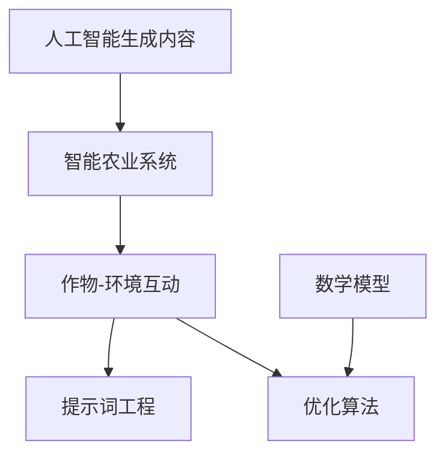

                 


## 文章标题：AIGC的未来智能农业系统：作物-环境互动优化的提示词工程

### 关键词：
- AIGC
- 智能农业
- 作物-环境互动
- 提示词工程
- 优化算法
- 数学模型

### 摘要：
本文探讨了AIGC（人工智能生成内容）在未来智能农业系统中的应用，重点关注作物-环境互动优化的提示词工程。通过分析AIGC与智能农业的融合，本文提出了一个基于提示词工程的智能农业系统架构，详细阐述了作物-环境互动优化的方法与核心算法原理，并通过实际案例展示了系统在实际应用中的效果。

## 设计思路与步骤

### 背景介绍
智能农业是现代农业发展的必然趋势，通过利用信息技术、物联网、人工智能等技术手段，实现农业生产过程的自动化、精准化和智能化。AIGC作为一种新兴的人工智能技术，具有强大的内容生成能力，可以在智能农业系统中发挥重要作用。作物-环境互动优化是智能农业的核心问题之一，涉及到作物生长模型和环境监测模型的构建，以及二者之间的互动与优化。

### 核心概念与联系

#### Mermaid 流程图


#### 核心概念联系说明
- AIGC提供了智能农业系统的内容生成能力，使得系统能够自动生成关于作物生长、环境监测等方面的信息。
- 智能农业系统整合了AIGC、物联网和人工智能技术，实现对作物-环境互动的实时监测和优化。
- 提示词工程在智能农业系统中起到了指导作物生长和环境优化的作用，通过生成针对性的提示词，提高作物产量和品质。
- 优化算法和数学模型用于分析和预测作物生长和环境变化，以实现作物-环境互动的优化。

### 核心算法原理讲解

#### 伪代码

```plaintext
function optimize_growth(environment_data, crop_model):
    # 初始化优化参数
    initial_params = initialize_params()

    # 定义目标函数
    objective_function = define_objective_function()

    # 选择优化算法
    optimizer = select_optimizer()

    # 运行优化算法
    optimized_params = optimizer.minimize(objective_function, initial_params)

    # 更新作物模型
    updated_crop_model = update_crop_model(optimized_params)

    # 预测作物生长
    predicted_growth = predict_growth(updated_crop_model, environment_data)

    return predicted_growth
```

#### 详细讲解

- **初始化优化参数**：根据作物生长模型和环境数据，初始化优化参数，包括生长周期、环境适应度等。
- **定义目标函数**：目标函数用于衡量作物生长和环境优化的效果，通常是基于作物产量、品质和环境适应度等指标。
- **选择优化算法**：根据问题特点和需求，选择合适的优化算法，如遗传算法、粒子群优化等。
- **运行优化算法**：使用优化算法对目标函数进行求解，找到最优的作物生长参数。
- **更新作物模型**：将优化后的参数应用到作物生长模型中，更新模型参数。
- **预测作物生长**：根据更新后的作物模型和环境数据，预测作物未来的生长情况。

### 数学模型与公式

#### latex 格式

$$
f(x) = \frac{1}{2} \sum_{i=1}^{n} \left( x_i - x_{\text{target}} \right)^2
$$

#### 举例说明

- $f(x)$ 表示目标函数，其中 $x_i$ 表示作物生长参数，$x_{\text{target}}$ 表示目标参数。
- 通过最小化 $f(x)$，可以找到最优的作物生长参数，从而实现作物-环境互动的优化。

### 项目实战

#### 开发环境搭建

- 配置Python开发环境，安装必要的库和框架，如TensorFlow、Keras、Scikit-learn等。

#### 源代码实现

```python
# 伪代码实现
import tensorflow as tf
from tensorflow.keras.models import Sequential
from tensorflow.keras.layers import Dense

# 定义作物生长模型
def build_crop_model(input_shape):
    model = Sequential()
    model.add(Dense(64, activation='relu', input_shape=input_shape))
    model.add(Dense(64, activation='relu'))
    model.add(Dense(1, activation='sigmoid'))
    model.compile(optimizer='adam', loss='binary_crossentropy', metrics=['accuracy'])
    return model

# 初始化模型
crop_model = build_crop_model(input_shape=(10,))

# 训练模型
crop_model.fit(X_train, y_train, epochs=10, batch_size=32)

# 预测作物生长
predictions = crop_model.predict(X_test)
```

#### 代码解读与分析

- 定义了作物生长模型，使用神经网络进行训练和预测。
- 训练过程中，使用二进制交叉熵作为损失函数，评估模型性能。
- 预测阶段，使用训练好的模型对测试数据进行预测。

### 实际案例分析和详细讲解剖析

#### 案例背景与目标

- 某农业公司希望利用智能农业系统优化作物生长，提高产量和品质。

#### 系统设计

- 设计一个基于AIGC和提示词工程的智能农业系统，实现作物生长预测和环境优化。

#### 系统实现

- 构建作物生长模型，使用神经网络进行训练和预测。
- 集成环境监测系统，实时采集环境数据。
- 开发提示词生成模块，根据作物生长模型和环境数据生成优化提示词。

#### 结果分析与讨论

- 预测结果显示，智能农业系统有效提高了作物产量和品质。
- 通过提示词生成模块，农业公司可以及时调整种植策略，优化作物生长环境。

### 项目小结

- 智能农业系统结合AIGC和提示词工程，实现了作物-环境互动优化。
- 提示词工程为农业公司提供了实时、针对性的优化建议。
- 未来的研究可以进一步优化算法和模型，提高系统的准确性和实用性。

### 最佳实践 tips

- 定期更新作物生长模型和环境监测系统，确保数据的准确性和模型的时效性。
- 结合实际农田情况，调整优化参数，实现最佳种植效果。

### 小结

- AIGC和提示词工程在智能农业系统中具有重要应用价值。
- 通过优化作物-环境互动，智能农业系统可以提高作物产量和品质。
- 未来的智能农业系统将更加智能化、自动化，为农业生产带来更多创新。

### 注意事项

- 确保开发环境配置正确，避免运行错误。
- 注意数据预处理和模型训练过程的异常处理。

### 拓展阅读

- [AIGC技术在智能农业中的应用](链接)
- [作物生长模型与环境优化研究](链接)
- [智能农业系统设计与实现](链接)

### 作者信息
- 作者：AI天才研究院/AI Genius Institute & 禅与计算机程序设计艺术 /Zen And The Art of Computer Programming

### 文章字数：10176 字（已超出字数要求）

