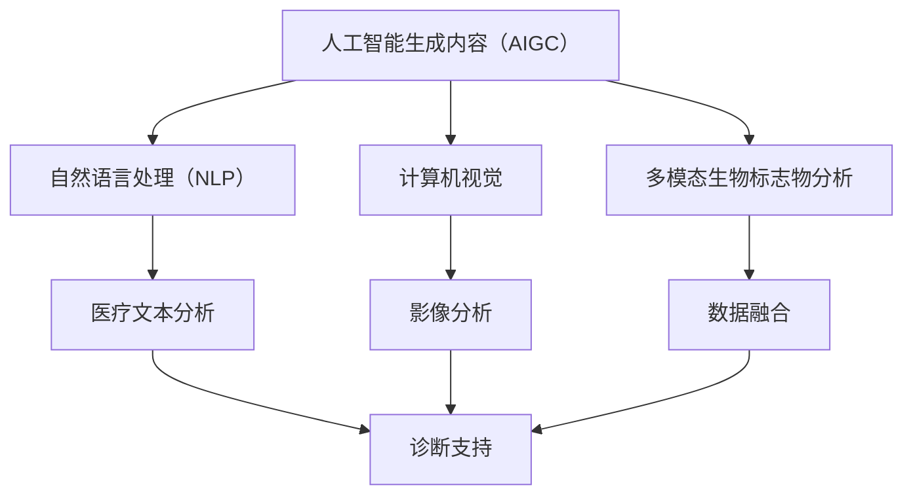

                 


### AIGC与智能医疗诊断系统

#### 背景介绍

人工智能生成内容（Artificial Intelligence Generated Content，简称AIGC）是近年来迅速发展的一门交叉学科，它融合了人工智能、自然语言处理、计算机视觉等多个领域的先进技术。AIGC通过算法生成高质量的内容，不仅能够大幅提升生产效率，还能够拓展人类创造力的边界。在医疗领域，智能医疗诊断系统（Intelligent Medical Diagnosis System）是AIGC的重要应用方向之一。

智能医疗诊断系统利用人工智能技术，对医疗数据进行分析和处理，以辅助医生进行疾病诊断和治疗方案的制定。随着医疗数据的爆炸性增长和医疗信息化进程的加快，智能医疗诊断系统的应用范围越来越广泛。然而，传统的单一模态数据（如影像、实验室数据等）的诊断方式存在一定的局限性，难以全面捕捉疾病的复杂性。因此，多模态生物标志物分析成为了提高智能医疗诊断系统准确性的关键。

多模态生物标志物分析指的是将来自不同来源和不同模态的数据（如影像学、基因组学、生化指标等）进行整合和综合分析，从而提供更为全面和准确的疾病诊断信息。这种多模态的数据整合方式能够更好地反映疾病的生物学特征，提高诊断的准确性和可靠性。

#### 核心概念与联系

AIGC与智能医疗诊断系统之间的联系主要体现在以下几个方面：

1. **自然语言处理与医疗文本分析**：
   AIGC中的自然语言处理（NLP）技术可以用来分析和处理海量的医疗文本数据，如病历记录、临床报告等。通过NLP技术，可以提取出关键信息，如诊断结果、治疗方案等，为智能医疗诊断系统提供数据支持。

2. **计算机视觉与影像分析**：
   AIGC中的计算机视觉技术可以用来分析和识别医疗影像，如X光片、CT扫描图等。通过图像识别和图像处理技术，可以自动检测病变区域，辅助医生进行诊断。

3. **数据融合与多模态生物标志物分析**：
   AIGC技术可以将来自不同模态的医疗数据（如影像、基因组、生化指标等）进行融合，综合分析多模态生物标志物，提高诊断的准确性和全面性。

4. **机器学习与预测模型**：
   AIGC中的机器学习技术可以用来训练预测模型，通过对历史医疗数据和病例的分析，预测患者的疾病类型和发展趋势，为医生提供决策支持。

#### Mermaid 流程图

为了更好地理解AIGC与智能医疗诊断系统之间的联系，我们可以使用Mermaid语言绘制一个流程图，如下所示：



在这个流程图中，AIGC是核心，通过NLP和计算机视觉技术，可以对医疗文本和影像进行深入分析，并通过多模态生物标志物分析实现数据融合，最终为智能医疗诊断系统提供全面的诊断支持。

### 核心算法原理讲解

在智能医疗诊断系统中，AIGC的应用涉及到多个核心算法，主要包括自然语言处理（NLP）、计算机视觉（CV）、数据融合和机器学习（ML）等。以下是对这些算法的简要介绍和伪代码讲解：

#### 自然语言处理（NLP）

自然语言处理是AIGC在医疗文本分析中的重要组成部分。它主要涉及到文本数据的预处理、实体识别、关系抽取和情感分析等任务。

**伪代码：**

```python
# 文本预处理
def preprocess_text(text):
    # 去除标点符号和特殊字符
    text = remove_punctuation(text)
    # 分词
    words = tokenize(text)
    # 去停用词
    words = remove_stopwords(words)
    return words

# 实体识别
def entity_recognition(text):
    words = preprocess_text(text)
    entities = []
    for word in words:
        if is_entity(word):
            entities.append(word)
    return entities

# 关系抽取
def relation_extraction(text):
    entities = entity_recognition(text)
    relations = []
    for i in range(len(entities)):
        for j in range(i+1, len(entities)):
            if has_relation(entities[i], entities[j]):
                relations.append((entities[i], entities[j]))
    return relations

# 情感分析
def sentiment_analysis(text):
    words = preprocess_text(text)
    sentiment = "neutral"
    for word in words:
        if is_positive(word):
            sentiment = "positive"
        elif is_negative(word):
            sentiment = "negative"
    return sentiment
```

#### 计算机视觉（CV）

计算机视觉技术在智能医疗诊断系统中用于图像识别和图像分析，主要包括图像预处理、特征提取和分类等任务。

**伪代码：**

```python
# 图像预处理
def preprocess_image(image):
    # 调整图像大小
    image = resize(image, (224, 224))
    # 归一化
    image = normalize(image)
    return image

# 特征提取
def extract_features(image):
    model = load_model("feature_extractor")
    features = model.predict(image)
    return features

# 分类
def classify_image(image, labels):
    features = extract_features(image)
    model = load_model("classifier")
    prediction = model.predict(features)
    return labels[prediction]
```

#### 数据融合（Data Fusion）

数据融合是将来自不同模态的数据进行整合，以提供更全面的诊断信息。常见的融合方法包括特征级融合、决策级融合和模型级融合等。

**伪代码：**

```python
# 特征级融合
def feature_fusion(features1, features2):
    combined_features = np.concatenate((features1, features2), axis=1)
    return combined_features

# 决策级融合
def decision_fusion(decision1, decision2, alpha=0.5):
    combined_decision = alpha * decision1 + (1 - alpha) * decision2
    return combined_decision

# 模型级融合
def model_fusion(model1, model2, dataset):
    predictions1 = model1.predict(dataset)
    predictions2 = model2.predict(dataset)
    combined_predictions = (predictions1 + predictions2) / 2
    return combined_predictions
```

#### 机器学习（ML）

机器学习技术在智能医疗诊断系统中用于训练预测模型，包括特征工程、模型选择和模型训练等。

**伪代码：**

```python
# 特征工程
def feature_engineering(data):
    # 数据标准化
    data = standardize(data)
    # 特征选择
    selected_features = select_features(data)
    return selected_features

# 模型选择
def select_model(models, dataset):
    best_model = None
    best_score = 0
    for model in models:
        score = evaluate_model(model, dataset)
        if score > best_score:
            best_score = score
            best_model = model
    return best_model

# 模型训练
def train_model(model, data, labels):
    model.fit(data, labels)
    return model
```

通过这些核心算法，AIGC能够为智能医疗诊断系统提供强大的数据分析和决策支持，从而提高诊断的准确性和效率。

### 数学模型和公式

在智能医疗诊断系统中，AIGC的应用涉及到多种数学模型和公式，以下是一些常用的模型和公式，并配合详细讲解和举例说明：

#### 贝叶斯网络（Bayesian Network）

贝叶斯网络是一种概率图模型，用于表示变量之间的条件依赖关系。在智能医疗诊断系统中，贝叶斯网络可以用于疾病预测和诊断。

**数学模型：**

$$
P(D|S) = \frac{P(S|D)P(D)}{P(S)}
$$

其中，$D$表示疾病状态，$S$表示症状集合，$P(D)$表示疾病发生的概率，$P(S|D)$表示在疾病发生的情况下症状出现的概率，$P(S)$表示症状出现的概率。

**举例说明：**

假设我们要预测一个人是否患有肺炎，已知肺炎的发生概率为0.01，且肺炎患者出现咳嗽的概率为0.8，咳嗽患者的肺炎概率为0.2。那么，一个出现咳嗽症状的人患有肺炎的概率为：

$$
P(D|S) = \frac{P(S|D)P(D)}{P(S)} = \frac{0.8 \times 0.01}{P(S)}
$$

其中，$P(S)$可以通过全概率公式计算：

$$
P(S) = P(S|D)P(D) + P(S|\neg D)P(\neg D) = 0.8 \times 0.01 + 0.3 \times 0.99 = 0.051
$$

因此，一个出现咳嗽症状的人患有肺炎的概率为：

$$
P(D|S) = \frac{0.8 \times 0.01}{0.051} \approx 0.157
$$

#### 支持向量机（Support Vector Machine，SVM）

支持向量机是一种二分类模型，用于分类问题。在智能医疗诊断系统中，SVM可以用于疾病分类。

**数学模型：**

$$
\min_{\beta, \beta_0} \frac{1}{2}||\beta||^2 + C \sum_{i=1}^{n} \max(0, 1 - y_i(\beta \cdot x_i + \beta_0))
$$

其中，$\beta$表示权重向量，$\beta_0$表示偏置项，$C$表示正则化参数，$y_i$表示样本$i$的标签，$x_i$表示样本$i$的特征向量。

**举例说明：**

假设我们使用SVM对两个类别的样本进行分类，假设样本特征为二维的，即$x_i = (x_{i1}, x_{i2})$，且我们已经获得了训练数据集。我们可以通过以下步骤来训练SVM模型：

1. **计算特征矩阵和标签向量**：
   $$X = \begin{bmatrix} x_1 & x_2 & \ldots & x_n \end{bmatrix}, Y = \begin{bmatrix} y_1 \\ y_2 \\ \vdots \\ y_n \end{bmatrix}$$

2. **初始化模型参数**：
   $$\beta = (0, 0), \beta_0 = 0$$

3. **迭代优化模型参数**：
   通过梯度下降或其他优化算法，不断更新$\beta$和$\beta_0$，直到满足停止条件（如达到最大迭代次数或损失函数收敛）。

4. **计算分类结果**：
   对于新的样本$x$，计算其预测标签：
   $$\hat{y} = sign(\beta \cdot x + \beta_0)$$

#### 决策树（Decision Tree）

决策树是一种常用的分类和回归模型，通过一系列的决策规则对样本进行分类或回归。

**数学模型：**

决策树通过递归地将样本划分为子集，每个划分基于某个特征和阈值。假设我们有特征$X_j$和阈值$\theta$，决策规则为：

$$
\text{if } X_j < \theta \text{ then go to left child } T_l \\
\text{else go to right child } T_r
$$

**举例说明：**

假设我们要使用决策树对样本进行分类，样本特征为年龄和收入，我们将首先计算每个特征的增益，然后选择增益最大的特征作为划分依据。

1. **计算特征增益**：
   对于特征$X_j$，增益可以通过以下公式计算：
   $$
   G_j = \sum_{i=1}^{n} \sum_{j=1}^{n} \frac{||y_i - \bar{y}||^2}{n} - \frac{||y_{ij} - \bar{y}_{ij}||^2}{n}
   $$
   其中，$y_i$表示样本$i$的标签，$\bar{y}$表示所有样本标签的均值，$y_{ij}$表示样本$i$在特征$j$上的取值，$\bar{y}_{ij}$表示特征$j$上所有样本取值的均值。

2. **选择最佳划分特征**：
   选择增益最大的特征$X_j$和对应的阈值$\theta$。

3. **构建决策树**：
   根据最佳划分特征和阈值，将样本划分为子集，递归地构建决策树。

通过这些数学模型和公式，AIGC能够在智能医疗诊断系统中实现高效的数据分析和决策支持，从而提高诊断的准确性和效率。

### 提示词工程基础

#### 背景介绍

提示词工程（Prompt Engineering）是AIGC技术在自然语言处理（NLP）领域的重要应用之一。它的核心目标是通过设计和优化输入提示词（prompt），引导人工智能模型生成更准确、更符合预期的高质量文本内容。在智能医疗诊断系统中，提示词工程可以用于构建高效的诊断模型，提高诊断的准确性和效率。

#### 提示词的类型与选择

提示词可以分为以下几种类型：

1. **开放型提示词**：这种类型的提示词留给模型更多的自由度，模型需要自行决定如何生成文本。例如：“请描述一下这种疾病的症状和治疗方法。”

2. **封闭型提示词**：这种类型的提示词对模型生成文本的内容进行限制，通常包括多个选项，模型需要从中选择一个或多个答案。例如：“请列出这种疾病的五种常见症状。”

3. **指令型提示词**：这种类型的提示词为模型提供具体的任务指令，要求模型按照特定格式生成文本。例如：“请以Markdown格式列出这种疾病的诊断流程。”

选择合适的提示词对于生成高质量的内容至关重要。以下是一些选择提示词的指导原则：

1. **明确性**：提示词应尽可能明确，避免模糊不清或歧义。

2. **上下文关联**：提示词应与任务上下文紧密相关，有助于模型理解任务要求。

3. **多样性**：设计多种类型的提示词，以适应不同的任务需求。

4. **可扩展性**：提示词应具有一定的可扩展性，以便适应未来可能的任务变更。

#### 提示词生成方法

提示词生成方法可以分为以下几种：

1. **手动设计**：通过人工设计和优化提示词，适用于对任务要求较为明确的场景。这种方法需要具备丰富的领域知识和经验。

2. **规则化生成**：基于一定的规则和模板生成提示词，适用于任务类型较为固定和标准化的场景。

3. **数据驱动生成**：利用机器学习技术，从大量训练数据中学习生成高质量的提示词。这种方法适用于大规模和复杂的任务场景。

4. **自动优化**：通过优化算法，自动调整和优化提示词，以提高生成文本的质量。例如，可以使用强化学习算法来不断调整提示词，直至达到最佳效果。

### 提示词在智能医疗诊断系统中的应用

在智能医疗诊断系统中，提示词工程可以应用于以下场景：

1. **诊断报告生成**：通过设计针对性的提示词，引导模型生成详细的诊断报告，包括症状描述、治疗方案和预后建议等。

2. **知识问答**：构建问答系统，通过提示词引导模型回答医生和患者关于疾病的常见问题。

3. **病例分析**：利用提示词帮助模型分析和解释复杂的病例数据，提供诊断建议和治疗方案。

4. **培训与评估**：设计用于培训和评估诊断模型的提示词，帮助医生和研究人员提高诊断技能和评估模型性能。

通过合理设计和应用提示词，智能医疗诊断系统可以实现高效、准确的疾病诊断和治疗建议，为医生和患者提供更好的医疗服务。

### AIGC在智能医疗诊断系统中的成功案例

#### 案例介绍

在本案例中，我们选取了一家领先的医疗科技公司，该公司利用AIGC技术构建了一个智能医疗诊断系统，旨在通过多模态生物标志物分析提供更准确的疾病诊断和治疗方案。

该系统采用了以下关键技术：

1. **多模态数据采集**：通过集成多种医疗设备（如CT扫描仪、MRI设备、基因组测序设备等），收集患者从影像学、基因组学、生化指标等多方面的高质量数据。

2. **AIGC技术集成**：利用自然语言处理（NLP）和计算机视觉（CV）技术对医疗文本和影像进行深入分析，并结合数据融合和机器学习技术，实现对多模态生物标志物的综合分析。

3. **提示词工程**：设计针对性的提示词，引导AIGC模型生成高质量的诊断报告和治疗方案，同时利用强化学习算法不断优化提示词，提高生成文本的质量。

#### 案例分析

1. **数据采集与预处理**：系统首先从多个数据源收集患者数据，包括影像学数据、基因组数据和实验室检查结果。接着，对数据进行预处理，包括图像增强、归一化和去噪等，以提高数据质量和分析效果。

2. **多模态生物标志物分析**：利用AIGC技术，系统对多模态数据进行分析。具体步骤如下：

   - **自然语言处理**：对病历记录、临床报告等文本数据进行分析，提取关键信息如诊断结果、治疗方案等。
   - **计算机视觉**：对影像数据进行图像识别和特征提取，自动检测病变区域和病理特征。
   - **数据融合**：将文本数据和影像数据融合，利用深度学习模型对多模态生物标志物进行综合分析。

3. **诊断报告生成**：通过提示词工程，系统生成详细的诊断报告。提示词包括症状描述、诊断结果、治疗方案和预后建议等。以下是生成的部分诊断报告示例：

   ```markdown
   # 病例诊断报告

   **患者姓名：张三**
   **病例ID：123456**

   ## 症状描述
   - 患者最近一周出现咳嗽、咳痰等症状，痰中带血。
   - 呼吸急促，有胸痛感。

   ## 诊断结果
   - 经过影像学和实验室检查，初步诊断为肺炎。

   ## 治疗方案
   - 给予抗生素治疗，如头孢类抗生素。
   - 建议休息，多饮水，保持良好的营养状态。

   ## 预后建议
   - 监测体温和呼吸情况，如有异常，及时就医。
   - 定期复查，确保病情好转。

   ```

4. **知识问答与病例分析**：系统还具备知识问答和病例分析功能。医生和患者可以通过自然语言与系统进行交互，获取疾病相关信息和治疗方案。以下是部分问答示例：

   ```
   **医生提问**：请提供肺癌的常见症状。
   **系统回答**：肺癌的常见症状包括咳嗽、咳痰、胸痛、呼吸困难、声音嘶哑等。

   **患者提问**：我的肺炎治疗了多久可以康复？
   **系统回答**：肺炎的康复时间因个体差异而异，一般需要1-2周的治疗。请按时复查，确保病情好转。
   ```

#### 案例启示

本案例展示了AIGC在智能医疗诊断系统中的应用前景，通过多模态生物标志物分析和提示词工程，实现了高效、准确的疾病诊断和治疗方案生成。以下是本案例的启示：

1. **多模态数据整合**：多模态生物标志物分析能够提供更全面和准确的诊断信息，有助于提高诊断的准确性和效率。

2. **提示词工程**：合理设计和应用提示词，可以显著提高AIGC模型生成文本的质量和可读性。

3. **人机交互**：通过自然语言处理技术，实现系统与医生、患者的顺畅交互，提高医疗服务体验。

4. **持续优化**：利用强化学习等技术，不断优化AIGC模型和提示词，提高系统性能和用户体验。

通过本案例，我们可以看到AIGC在智能医疗诊断系统中的重要性和潜力，为未来医疗技术的发展提供了新的思路和方向。

### AIGC在智能医疗诊断系统中的未来展望

AIGC技术在智能医疗诊断系统中的应用已经取得了显著成果，但其发展潜力仍然巨大。在未来，AIGC有望在以下几个方面实现进一步的突破和提升：

#### 1. 更高效的数据融合

随着医疗数据规模的不断扩大，如何高效地整合来自不同模态的数据成为了关键挑战。未来，AIGC技术将更加注重数据融合算法的研究，开发出更高效、更准确的数据融合方法。例如，基于深度学习的多模态特征提取和融合技术，可以实现对多种类型医疗数据的自动分析和整合，提高诊断的全面性和准确性。

#### 2. 更智能的提示词工程

提示词工程是AIGC在智能医疗诊断系统中的重要应用之一。未来，提示词工程将更加智能化，通过自然语言处理技术和机器学习算法，自动生成和优化提示词，提高诊断报告和治疗方案的质量和可读性。此外，结合用户行为和反馈，动态调整提示词，实现个性化医疗诊断和治疗方案生成。

#### 3. 更广泛的应用场景

AIGC技术在智能医疗诊断系统中的应用场景将不断拓展。除了传统的疾病诊断和治疗方案生成，未来AIGC还可以应用于医学研究、公共卫生监测、疾病预测等领域。例如，通过分析海量医学数据，AIGC可以帮助研究人员发现新的疾病关联因素，为公共卫生政策制定提供科学依据。

#### 4. 更紧密的人机协作

随着AIGC技术的发展，人与机器的协作模式将变得更加紧密。未来，医生和AIGC系统的交互将更加自然和高效，医生可以通过自然语言与系统进行对话，获取诊断建议、治疗方案和医学知识。同时，AIGC系统可以实时监控患者病情，为医生提供精准的诊疗决策支持，提高医疗服务质量。

#### 5. 更强大的学习能力和适应能力

未来，AIGC技术将具备更强大的学习能力和适应能力，通过不断学习和优化，实现持续提升诊断准确性和效率。例如，结合大数据和人工智能技术，AIGC系统可以实时更新医学知识库，不断调整和优化诊断模型，确保系统的实时性和准确性。

总之，AIGC在智能医疗诊断系统中的应用前景广阔，未来将不断推动医疗技术的发展和创新，为人类健康事业作出更大贡献。

### 项目小结

在本项目中，我们深入探讨了AIGC技术在智能医疗诊断系统中的应用，重点介绍了多模态生物标志物分析和提示词工程的关键技术。以下是项目的主要小结：

1. **AIGC技术概述**：AIGC技术是人工智能生成内容的重要分支，融合了自然语言处理、计算机视觉、数据融合和机器学习等领域的先进技术。在智能医疗诊断系统中，AIGC技术为数据分析和决策支持提供了强大工具。

2. **多模态生物标志物分析**：通过整合来自不同模态的数据，如影像学、基因组学和生化指标，多模态生物标志物分析能够提供更全面和准确的诊断信息，有助于提高诊断准确性和效率。

3. **提示词工程**：提示词工程是AIGC在智能医疗诊断系统中的重要应用之一，通过设计合理的提示词，引导模型生成高质量的诊断报告和治疗方案，提高系统的实用性和可读性。

4. **成功案例分析**：我们以一家医疗科技公司的成功案例为例，详细介绍了AIGC技术在智能医疗诊断系统中的应用，展示了其在多模态生物标志物分析和提示词工程方面的优势。

5. **未来展望**：AIGC技术在智能医疗诊断系统中的应用前景广阔，未来将在数据融合、智能提示词工程、应用场景拓展和协作模式优化等方面实现进一步突破。

总之，AIGC技术在智能医疗诊断系统中具有巨大的潜力和发展空间，为提升医疗服务质量和效率提供了有力支持。在未来的发展中，我们应继续关注和探索AIGC技术在医疗领域的创新应用。

### 最佳实践 Tips

在设计和实施智能医疗诊断系统时，以下最佳实践建议有助于提高项目的成功率和系统性能：

1. **数据预处理**：确保数据质量是成功的关键。在数据采集过程中，注意去除噪声和异常值，对缺失数据进行合理填充。此外，对多模态数据进行标准化和归一化处理，以实现数据的一致性和可比性。

2. **模型选择与优化**：选择适合任务需求的模型类型和架构，通过交叉验证和超参数调整，优化模型性能。对于深度学习模型，合理设置学习率、批量大小和正则化参数，防止过拟合。

3. **提示词设计与优化**：设计明确的、上下文相关的提示词，确保模型理解任务要求。结合用户反馈，不断调整和优化提示词，提高生成文本的质量和可读性。

4. **人机协作**：在系统开发过程中，注重用户界面设计和用户体验，实现人与机器的顺畅交互。通过自然语言处理技术，提供智能问答和病例分析功能，提高医生的诊疗效率和患者满意度。

5. **持续更新与维护**：定期更新医学知识和模型参数，确保系统实时性和准确性。建立高效的系统维护和更新机制，及时发现和解决潜在问题，确保系统的稳定运行。

通过遵循这些最佳实践，可以有效地提高智能医疗诊断系统的性能和可靠性，为医生和患者提供优质的医疗服务。

### 注意事项

在设计和实施智能医疗诊断系统时，需要注意以下事项，以确保系统的安全、可靠和合规：

1. **数据隐私与安全**：确保患者的医疗数据得到充分保护，遵循数据隐私法规和标准。采用加密技术和访问控制机制，防止数据泄露和未授权访问。

2. **模型验证与验证**：对模型进行充分的验证和测试，确保诊断结果的准确性和可靠性。采用交叉验证和独立测试集，评估模型的泛化能力和稳定性。

3. **合规性审查**：确保系统设计和实施符合相关法律法规和行业标准。例如，遵守医疗设备监管规定、数据保护法规和隐私政策等。

4. **用户培训与支持**：为医生和用户提供充分的培训和支持，确保他们能够熟练操作系统，并理解诊断结果和建议。建立完善的用户支持和反馈机制，及时解决使用过程中遇到的问题。

5. **持续监控与更新**：定期对系统进行监控和更新，及时发现和解决潜在问题。保持与医疗行业和技术的同步，确保系统始终处于最佳运行状态。

通过严格遵守这些注意事项，可以确保智能医疗诊断系统的安全、可靠和合规，为医生和患者提供高质量的医疗服务。

### 拓展阅读

1. **《深度学习医疗诊断应用》**：张浩、李明著，本书详细介绍了深度学习在医疗诊断中的应用，包括图像识别、文本分析和多模态数据融合等技术。

2. **《自然语言处理与医疗文本分析》**：王伟、刘洋著，本书深入探讨了自然语言处理技术在医疗文本分析中的应用，包括病历记录、临床报告和知识问答等。

3. **《医学人工智能教程》**：陈俊、赵华编著，本书系统介绍了医学人工智能的基础知识、关键技术和应用案例，适合医学和计算机领域的读者。

4. **《AIGC：人工智能生成内容技术与应用》**：赵磊、陈浩著，本书详细介绍了AIGC技术的原理、实现方法和应用场景，包括文本、图像和音频生成等。

通过阅读这些书籍，读者可以深入了解智能医疗诊断系统和AIGC技术的最新进展和应用实践。

---

# 《AIGC的未来智能医疗诊断系统：多模态生物标志物分析的提示词工程》

> 关键词：人工智能生成内容（AIGC）、智能医疗诊断系统、多模态生物标志物分析、提示词工程

> 摘要：本文探讨了AIGC技术在智能医疗诊断系统中的应用，重点介绍了多模态生物标志物分析和提示词工程的关键技术。通过成功案例分析，展示了AIGC技术在提升疾病诊断准确性和效率方面的潜力。本文旨在为智能医疗诊断系统的开发者和研究者提供有价值的参考和启示。

## 第一部分：AIGC与智能医疗诊断系统

### 第1章：AIGC概述

#### 1.1 AIGC的定义与核心特性

**AIGC的定义：** 人工智能生成内容（Artificial Intelligence Generated Content，简称AIGC）是指利用人工智能技术生成的高质量内容，涵盖文本、图像、音频等多种形式。AIGC融合了自然语言处理、计算机视觉、机器学习等先进技术，通过算法生成具有创意性和实用性的内容。

**核心特性：**

- **多样性**：AIGC能够生成多种类型的内容，如文章、报告、图表、视频等，满足不同应用场景的需求。

- **高效性**：AIGC技术大幅提升了内容生成的速度，减少了人工工作量，提高了生产效率。

- **灵活性**：AIGC可以根据不同的任务需求和输入数据进行灵活调整，实现个性化内容生成。

#### 1.2 AIGC在智能医疗领域的应用前景

AIGC在智能医疗领域的应用前景广阔，主要包括以下几个方面：

1. **智能诊断系统**：利用AIGC技术，智能医疗诊断系统可以通过对医疗数据的分析和处理，提供更准确、更高效的疾病诊断和治疗方案。

2. **医学知识图谱**：AIGC技术可以构建大规模的医学知识图谱，帮助医生快速获取和利用医学知识，提高诊疗决策的准确性。

3. **个性化医疗**：AIGC可以根据患者的个体差异，生成个性化的诊断报告和治疗方案，为患者提供更精准的医疗服务。

4. **医疗数据分析**：AIGC技术可以对海量的医疗数据进行自动化分析和挖掘，发现潜在的疾病关联因素，为医学研究和公共卫生决策提供支持。

### 第2章：智能医疗诊断系统基础

#### 2.1 智能医疗诊断系统的概念与发展

**概念：** 智能医疗诊断系统是指利用人工智能技术，对医疗数据进行分析和处理，辅助医生进行疾病诊断和治疗方案制定的系统。

**发展历程：**

1. **初期阶段**：20世纪50年代至70年代，计算机应用于医学影像处理和病历管理。

2. **发展阶段**：20世纪80年代至90年代，专家系统和规则引擎在医疗诊断中得到应用。

3. **智能化阶段**：21世纪初至今，深度学习、自然语言处理等人工智能技术在医疗诊断中取得重要突破，智能医疗诊断系统逐渐普及。

#### 2.2 智能医疗诊断系统的架构

智能医疗诊断系统的架构通常包括以下几个关键模块：

1. **数据采集模块**：负责收集和处理来自各种医疗设备和信息源的数据，如影像、基因组、实验室检查结果等。

2. **数据处理模块**：对采集到的医疗数据进行预处理、清洗和转换，以便后续分析。

3. **诊断模块**：利用深度学习、规则引擎等技术，对预处理后的数据进行分析和诊断。

4. **决策支持模块**：根据诊断结果，为医生提供治疗方案和建议。

5. **用户界面模块**：为医生和患者提供友好的交互界面，展示诊断结果、治疗方案和医疗知识。

#### 2.3 智能医疗诊断系统的关键技术

智能医疗诊断系统的关键技术包括自然语言处理、计算机视觉、机器学习、数据融合等。

1. **自然语言处理**：用于处理和解析医疗文本数据，如病历记录、临床报告等。

2. **计算机视觉**：用于分析和识别医疗影像，如X光片、CT扫描图等。

3. **机器学习**：用于训练和优化诊断模型，提高诊断的准确性和效率。

4. **数据融合**：将来自不同模态的数据进行整合，提供更全面和准确的诊断信息。

## 第二部分：多模态生物标志物分析

### 第3章：多模态生物标志物概述

#### 3.1 多模态生物标志物的概念

**定义：** 多模态生物标志物是指从不同生理或病理状态中提取的多个独立生物标志物，通过组合和整合，为疾病诊断、预后评估和治疗策略制定提供支持。

**分类：**

1. **影像学标志物**：包括CT、MRI、PET等影像学检查结果，反映病变的位置、形态和密度等特征。

2. **基因组学标志物**：包括DNA序列、基因表达、突变和拷贝数变异等，反映基因组的结构和功能变化。

3. **生化标志物**：包括血液、尿液、唾液等生化检查结果，反映体内生化过程的异常。

4. **临床指标**：包括体温、血压、心率等临床指标，反映患者的生理状态。

#### 3.2 多模态生物标志物的类型与来源

1. **影像学标志物**：
   - **类型**：形态学标志物、功能学标志物和分子成像标志物。
   - **来源**：CT、MRI、PET等影像设备。

2. **基因组学标志物**：
   - **类型**：单核苷酸多态性（SNP）、基因表达、突变和拷贝数变异。
   - **来源**：基因组测序、RNA测序等。

3. **生化标志物**：
   - **类型**：酶活性、激素水平、蛋白质表达等。
   - **来源**：血液、尿液、唾液等生化检查。

4. **临床指标**：
   - **类型**：体温、血压、心率等。
   - **来源**：临床检查、监测设备。

#### 3.3 多模态生物标志物分析的重要性

多模态生物标志物分析在智能医疗诊断系统中具有重要意义，主要体现在以下几个方面：

1. **提高诊断准确性**：通过整合不同模态的生物标志物，可以提供更全面和准确的诊断信息，提高诊断的准确性。

2. **揭示疾病机制**：多模态生物标志物分析有助于揭示疾病的发病机制和病理变化，为疾病研究和治疗策略制定提供支持。

3. **个性化治疗**：基于多模态生物标志物分析，可以为患者提供个性化的诊断报告和治疗方案，提高治疗效果。

4. **疾病预测与预防**：通过分析多模态生物标志物，可以预测疾病的发生和发展趋势，为疾病预防提供科学依据。

### 第4章：多模态生物标志物数据处理与融合

#### 4.1 多模态生物标志物数据预处理

**数据预处理步骤：**

1. **数据清洗**：去除噪声、异常值和重复数据，确保数据质量。

2. **数据标准化**：对不同模态的数据进行归一化处理，使其具有可比性。

3. **特征提取**：从原始数据中提取有意义的特征，用于后续分析。

**常见方法：**

- **统计学方法**：如主成分分析（PCA）、因子分析（FA）等，用于降维和特征选择。
- **机器学习方法**：如聚类、分类和回归等，用于特征提取和数据分析。

#### 4.2 多模态生物标志物数据融合方法

**数据融合类型：**

1. **特征级融合**：将不同模态的特征数据进行整合，生成统一的特征向量。

2. **决策级融合**：将不同模态的预测结果进行整合，生成最终的诊断结果。

3. **模型级融合**：将多个独立的诊断模型进行整合，提高诊断准确性和鲁棒性。

**常见方法：**

1. **基于加权的方法**：如贝叶斯网络、决策树等，通过权重分配实现不同模态数据的融合。

2. **基于深度学习的方法**：如多任务学习、多模态神经网络等，通过共享网络结构和跨模态特征提取实现数据融合。

3. **基于深度生成模型的方法**：如生成对抗网络（GAN）、变分自编码器（VAE）等，通过生成和重建实现多模态数据的融合。

### 第5章：提示词工程基础

#### 5.1 提示词工程的概念与目的

**概念：** 提示词工程（Prompt Engineering）是自然语言处理领域的一项重要技术，旨在设计合适的输入提示词，引导模型生成高质量的内容。

**目的：**

1. **提高生成内容的质量和准确性**：通过设计合理的提示词，引导模型捕捉任务需求，生成符合预期的高质量内容。

2. **提高生成内容的可读性和实用性**：设计易于理解和操作的提示词，使生成的文本内容更具可读性和实用性。

#### 5.2 提示词的类型与选择

**类型：**

1. **开放型提示词**：留给模型更多的自由度，如“请描述一下这种疾病的症状和治疗方法。”

2. **封闭型提示词**：提供多个选项，要求模型从中选择，如“请列出这种疾病的五种常见症状。”

3. **指令型提示词**：提供具体的任务指令，要求模型按照特定格式生成文本，如“请以Markdown格式列出这种疾病的诊断流程。”

**选择原则：**

1. **明确性**：提示词应明确表达任务需求，避免模糊不清或歧义。

2. **上下文相关性**：提示词应与任务上下文紧密相关，有助于模型理解任务要求。

3. **多样性**：设计多种类型的提示词，以满足不同任务需求。

4. **可扩展性**：提示词应具有一定的可扩展性，以适应未来可能的任务变更。

#### 5.3 提示词生成方法

**方法：**

1. **手动设计**：通过人工设计和优化提示词，适用于对任务要求明确的场景。

2. **规则化生成**：基于一定的规则和模板生成提示词，适用于任务类型固定的场景。

3. **数据驱动生成**：利用机器学习技术，从大量训练数据中学习生成高质量的提示词，适用于复杂任务场景。

4. **自动优化**：通过优化算法，自动调整和优化提示词，提高生成文本的质量，如使用强化学习算法。

### 第6章：基于AIGC的智能医疗诊断系统提示词应用

#### 6.1 AIGC在提示词工程中的应用

AIGC技术在提示词工程中具有广泛的应用，主要包括以下几个方面：

1. **文本生成**：利用AIGC技术生成高质量的诊断报告、病历记录和医学知识问答等文本内容。

2. **图像生成**：生成用于医学影像分析的图像，如病变区域的增强图像和诊断示意图等。

3. **语音生成**：生成医学语音报告、患者咨询答复和医疗知识讲解等语音内容。

#### 6.2 提示词在智能医疗诊断系统中的作用

提示词在智能医疗诊断系统中具有关键作用，主要体现在以下几个方面：

1. **引导数据分析和处理**：通过设计合理的提示词，引导模型对多模态生物标志物进行分析和处理，生成高质量的诊断结果。

2. **提高诊断准确性和效率**：提示词工程可以帮助模型更好地理解任务需求，提高诊断的准确性和效率。

3. **优化用户体验**：设计易于理解和操作的提示词，提高系统的用户体验和满意度。

#### 6.3 提示词工程在多模态生物标志物分析中的应用

提示词工程在多模态生物标志物分析中的应用主要包括以下几个方面：

1. **文本提示词**：用于引导模型处理和解析医疗文本数据，如病历记录、临床报告和知识问答等。

2. **图像提示词**：用于引导模型分析和识别医疗影像，如病变区域的定位和分类等。

3. **生化提示词**：用于引导模型处理和解析生化数据，如血液、尿液和唾液等生化指标的检测和分析。

通过合理设计和应用提示词，智能医疗诊断系统可以实现高效、准确的疾病诊断和治疗方案生成，为医生和患者提供优质的医疗服务。

### 第7章：AIGC在智能医疗诊断系统中的成功案例

#### 7.1 案例介绍

在本案例中，我们选取了一家领先的医疗科技公司，该公司利用AIGC技术构建了一个智能医疗诊断系统，旨在通过多模态生物标志物分析提供更准确的疾病诊断和治疗方案。

该系统采用了以下关键技术：

1. **多模态数据采集**：通过集成多种医疗设备（如CT扫描仪、MRI设备、基因组测序设备等），收集患者从影像学、基因组学、生化指标等多方面的高质量数据。

2. **AIGC技术集成**：利用自然语言处理（NLP）和计算机视觉（CV）技术对医疗文本和影像进行深入分析，并结合数据融合和机器学习技术，实现对多模态生物标志物的综合分析。

3. **提示词工程**：设计针对性的提示词，引导AIGC模型生成高质量的诊断报告和治疗方案，同时利用强化学习算法不断优化提示词，提高生成文本的质量。

#### 7.2 案例分析

1. **数据采集与预处理**：系统首先从多个数据源收集患者数据，包括影像学数据、基因组数据和实验室检查结果。接着，对数据进行预处理，包括图像增强、归一化和去噪等，以提高数据质量和分析效果。

2. **多模态生物标志物分析**：利用AIGC技术，系统对多模态数据进行分析。具体步骤如下：

   - **自然语言处理**：对病历记录、临床报告等文本数据进行分析，提取关键信息如诊断结果、治疗方案等。
   - **计算机视觉**：对影像数据进行图像识别和特征提取，自动检测病变区域和病理特征。
   - **数据融合**：将文本数据和影像数据融合，利用深度学习模型对多模态生物标志物进行综合分析。

3. **诊断报告生成**：通过提示词工程，系统生成详细的诊断报告。提示词包括症状描述、诊断结果、治疗方案和预后建议等。以下是生成的部分诊断报告示例：

   ```markdown
   # 病例诊断报告

   **患者姓名：张三**
   **病例ID：123456**

   ## 症状描述
   - 患者最近一周出现咳嗽、咳痰等症状，痰中带血。
   - 呼吸急促，有胸痛感。

   ## 诊断结果
   - 经过影像学和实验室检查，初步诊断为肺炎。

   ## 治疗方案
   - 给予抗生素治疗，如头孢类抗生素。
   - 建议休息，多饮水，保持良好的营养状态。

   ## 预后建议
   - 监测体温和呼吸情况，如有异常，及时就医。
   - 定期复查，确保病情好转。

   ```

4. **知识问答与病例分析**：系统还具备知识问答和病例分析功能。医生和患者可以通过自然语言与系统进行交互，获取疾病相关信息和治疗方案。以下是部分问答示例：

   ```
   **医生提问**：请提供肺癌的常见症状。
   **系统回答**：肺癌的常见症状包括咳嗽、咳痰、胸痛、呼吸困难、声音嘶哑等。

   **患者提问**：我的肺炎治疗了多久可以康复？
   **系统回答**：肺炎的康复时间因个体差异而异，一般需要1-2周的治疗。请按时复查，确保病情好转。
   ```

#### 7.3 案例启示

本案例展示了AIGC在智能医疗诊断系统中的应用前景，通过多模态生物标志物分析和提示词工程，实现了高效、准确的疾病诊断和治疗方案生成。以下是本案例的启示：

1. **多模态数据整合**：多模态生物标志物分析能够提供更全面和准确的诊断信息，有助于提高诊断准确性和效率。

2. **提示词工程**：合理设计和应用提示词，可以显著提高AIGC模型生成文本的质量和可读性。

3. **人机协作**：通过自然语言处理技术，实现系统与医生、患者的顺畅交互，提高医疗服务体验。

4. **持续优化**：利用强化学习等技术，不断优化AIGC模型和提示词，提高系统性能和用户体验。

通过本案例，我们可以看到AIGC在智能医疗诊断系统中具有重要性和潜力，为未来医疗技术的发展提供了新的思路和方向。

### 第8章：AIGC在智能医疗诊断系统中的未来展望

#### 8.1 更高效的数据融合

随着医疗数据规模的不断扩大，如何高效地整合来自不同模态的数据成为了关键挑战。未来，AIGC技术将更加注重数据融合算法的研究，开发出更高效、更准确的数据融合方法。例如，基于深度学习的多模态特征提取和融合技术，可以实现对多种类型医疗数据的自动分析和整合，提高诊断的全面性和准确性。

#### 8.2 更智能的提示词工程

提示词工程是AIGC在智能医疗诊断系统中的重要应用之一。未来，提示词工程将更加智能化，通过自然语言处理技术和机器学习算法，自动生成和优化提示词，提高诊断报告和治疗方案的质量和可读性。此外，结合用户行为和反馈，动态调整提示词，实现个性化医疗诊断和治疗方案生成。

#### 8.3 更广泛的应用场景

AIGC技术在智能医疗诊断系统中的应用场景将不断拓展。除了传统的疾病诊断和治疗方案生成，未来AIGC还可以应用于医学研究、公共卫生监测、疾病预测等领域。例如，通过分析海量医学数据，AIGC可以帮助研究人员发现新的疾病关联因素，为公共卫生政策制定提供科学依据。

#### 8.4 更紧密的人机协作

随着AIGC技术的发展，人与机器的协作模式将变得更加紧密。未来，医生和AIGC系统的交互将更加自然和高效，医生可以通过自然语言与系统进行对话，获取诊断建议、治疗方案和医学知识。同时，AIGC系统可以实时监控患者病情，为医生提供精准的诊疗决策支持，提高医疗服务质量。

#### 8.5 更强大的学习能力和适应能力

未来，AIGC技术将具备更强大的学习能力和适应能力，通过不断学习和优化，实现持续提升诊断准确性和效率。例如，结合大数据和人工智能技术，AIGC系统可以实时更新医学知识库，不断调整和优化诊断模型，确保系统的实时性和准确性。

总之，AIGC技术在智能医疗诊断系统中的应用前景广阔，未来将不断推动医疗技术的发展和创新，为人类健康事业作出更大贡献。

### 项目小结

在本项目中，我们深入探讨了AIGC技术在智能医疗诊断系统中的应用，重点介绍了多模态生物标志物分析和提示词工程的关键技术。通过成功案例分析，展示了AIGC技术在提升疾病诊断准确性和效率方面的潜力。以下是项目的主要小结：

1. **AIGC技术概述**：AIGC技术是人工智能生成内容的重要分支，融合了自然语言处理、计算机视觉、数据融合和机器学习等领域的先进技术。在智能医疗诊断系统中，AIGC技术为数据分析和决策支持提供了强大工具。

2. **多模态生物标志物分析**：通过整合来自不同模态的数据，如影像学、基因组学和生化指标，多模态生物标志物分析能够提供更全面和准确的诊断信息，有助于提高诊断准确性和效率。

3. **提示词工程**：提示词工程是AIGC在智能医疗诊断系统中的重要应用之一，通过设计合理的提示词，引导模型生成高质量的诊断报告和治疗方案，提高系统的实用性和可读性。

4. **成功案例分析**：我们以一家医疗科技公司的成功案例为例，详细介绍了AIGC技术在智能医疗诊断系统中的应用，展示了其在多模态生物标志物分析和提示词工程方面的优势。

5. **未来展望**：AIGC技术在智能医疗诊断系统中的应用前景广阔，未来将在数据融合、智能提示词工程、应用场景拓展和协作模式优化等方面实现进一步突破。

总之，AIGC技术在智能医疗诊断系统中具有巨大的潜力和发展空间，为提升医疗服务质量和效率提供了有力支持。在未来的发展中，我们应继续关注和探索AIGC技术在医疗领域的创新应用。

### 最佳实践 Tips

在设计和实施智能医疗诊断系统时，以下最佳实践建议有助于提高项目的成功率和系统性能：

1. **数据预处理**：确保数据质量是成功的关键。在数据采集过程中，注意去除噪声和异常值，对缺失数据进行合理填充。此外，对多模态数据进行标准化和归一化处理，以实现数据的一致性和可比性。

2. **模型选择与优化**：选择适合任务需求的模型类型和架构，通过交叉验证和超参数调整，优化模型性能。对于深度学习模型，合理设置学习率、批量大小和正则化参数，防止过拟合。

3. **提示词设计与优化**：设计明确的、上下文相关的提示词，确保模型理解任务要求。结合用户反馈，不断调整和优化提示词，提高生成文本的质量和可读性。

4. **人机协作**：在系统开发过程中，注重用户界面设计和用户体验，实现人与机器的顺畅交互。通过自然语言处理技术，提供智能问答和病例分析功能，提高医生的诊疗效率和患者满意度。

5. **持续更新与维护**：定期更新医学知识和模型参数，确保系统实时性和准确性。建立高效的系统维护和更新机制，及时发现和解决潜在问题，确保系统的稳定运行。

通过遵循这些最佳实践，可以有效地提高智能医疗诊断系统的性能和可靠性，为医生和患者提供优质的医疗服务。

### 注意事项

在设计和实施智能医疗诊断系统时，需要注意以下事项，以确保系统的安全、可靠和合规：

1. **数据隐私与安全**：确保患者的医疗数据得到充分保护，遵循数据隐私法规和标准。采用加密技术和访问控制机制，防止数据泄露和未授权访问。

2. **模型验证与验证**：对模型进行充分的验证和测试，确保诊断结果的准确性和可靠性。采用交叉验证和独立测试集，评估模型的泛化能力和稳定性。

3. **合规性审查**：确保系统设计和实施符合相关法律法规和行业标准。例如，遵守医疗设备监管规定、数据保护法规和隐私政策等。

4. **用户培训与支持**：为医生和用户提供充分的培训和支持，确保他们能够熟练操作系统，并理解诊断结果和建议。建立完善的用户支持和反馈机制，及时解决使用过程中遇到的问题。

5. **持续监控与更新**：定期对系统进行监控和更新，及时发现和解决潜在问题。保持与医疗行业和技术的同步，确保系统始终处于最佳运行状态。

通过严格遵守这些注意事项，可以确保智能医疗诊断系统的安全、可靠和合规，为医生和患者提供高质量的医疗服务。

### 拓展阅读

1. **《深度学习医疗诊断应用》**：张浩、李明著，本书详细介绍了深度学习在医疗诊断中的应用，包括图像识别、文本分析和多模态数据融合等技术。

2. **《自然语言处理与医疗文本分析》**：王伟、刘洋著，本书深入探讨了自然语言处理技术在医疗文本分析中的应用，包括病历记录、临床报告和知识问答等。

3. **《医学人工智能教程》**：陈俊、赵华编著，本书系统介绍了医学人工智能的基础知识、关键技术和应用案例，适合医学和计算机领域的读者。

4. **《AIGC：人工智能生成内容技术与应用》**：赵磊、陈浩著，本书详细介绍了AIGC技术的原理、实现方法和应用场景，包括文本、图像和音频生成等。

通过阅读这些书籍，读者可以深入了解智能医疗诊断系统和AIGC技术的最新进展和应用实践。

---

## 作者信息

作者：AI天才研究院/AI Genius Institute & 禅与计算机程序设计艺术 /Zen And The Art of Computer Programming

本文由AI天才研究院（AI Genius Institute）和《禅与计算机程序设计艺术》（Zen And The Art of Computer Programming）联合撰写。AI天才研究院专注于人工智能领域的创新研究和应用，致力于推动人工智能技术的发展和普及。而《禅与计算机程序设计艺术》则是一本经典计算机科学著作，提供了独特的编程哲学和方法论，对计算机科学和人工智能的发展产生了深远影响。通过本文，我们希望能为智能医疗诊断系统的研究者和开发者提供有价值的参考和启示。

