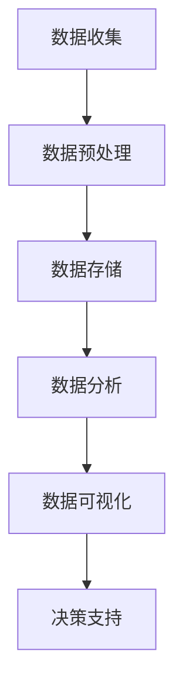

                 

### 文章标题

《AIGC的未来智能城市管理：公民参与决策的提示词工程》

### 文章关键词

AIGC，智能城市，公民参与，决策，提示词工程，数据科学，机器学习，深度学习，物联网，伦理，隐私保护

### 文章摘要

本文探讨了AIGC（人工智能生成内容）在智能城市管理与公民参与决策中的应用，分析了AIGC技术的核心概念与特征，以及智能城市的发展背景与挑战。文章详细介绍了AIGC技术在智能城市交通管理以及其他领域中的应用，阐述了公民参与决策的理论基础与实践方法。最后，本文对AIGC和公民参与决策的未来发展进行了展望，并讨论了智能城市面临的伦理与法律挑战。

---

# 第1章：AIGC概述与智能城市背景

## 1.1 AIGC的基本概念与特征

AIGC，即人工智能生成内容（AI-Generated Content），是近年来人工智能技术发展的重要方向。AIGC通过生成对抗网络（GAN）、自然语言处理（NLP）和深度学习等技术，能够自动生成高质量的文字、图片、音频和视频等多样化内容。其核心特征包括：

- **高效率**：AIGC能够在短时间内生成大量内容，节省人力和时间成本。

- **多样性**：AIGC能够生成不同风格、主题和形式的内容，满足个性化需求。

- **高质量**：通过不断优化算法和模型，AIGC能够生成具有高水准的内容。

- **自适应**：AIGC可以根据用户反馈和需求，自动调整生成内容，实现个性化推荐。

在智能城市背景下，AIGC技术的应用具有重要的现实意义。它不仅能够提高城市管理效率，优化资源配置，还能够促进公民参与决策，提高民主参与度。例如，通过AIGC生成智能交通信号控制策略，可以有效缓解交通拥堵，提高道路通行效率；通过AIGC生成环境监测报告，可以帮助政府和企业更好地应对环境问题，实现可持续发展。

### AIGC与智能城市的关系

AIGC与智能城市之间存在着密切的联系。智能城市是指利用信息技术和智能系统，实现对城市运行的高效管理和服务。AIGC技术作为人工智能的一个重要分支，为智能城市的发展提供了强有力的支持。具体来说，AIGC在智能城市中的应用主要体现在以下几个方面：

1. **交通管理**：通过AIGC生成智能交通信号控制策略，实现交通流量预测和优化，提高道路通行效率。

2. **环境监测**：通过AIGC生成环境监测报告，实时监测城市空气质量、水质和噪音等环境指标，为政府和企业提供决策依据。

3. **公共安全**：通过AIGC生成智能监控算法，实现对城市公共安全的实时监控和预警，提高城市安全水平。

4. **公共服务**：通过AIGC生成个性化推荐系统，为市民提供定制化的公共服务，提高市民满意度。

5. **政府决策**：通过AIGC生成数据分析报告，为政府提供决策支持，提高政府决策的科学性和民主性。

### 案例研究：AIGC在智能城市管理中的成功实践

以下是几个AIGC在智能城市管理中的成功实践案例：

1. **新加坡**：新加坡政府利用AIGC技术，开发了智能交通信号控制系统。该系统通过实时分析交通流量数据，动态调整交通信号灯时长，有效缓解了交通拥堵问题。据统计，该系统的实施使得新加坡的交通拥堵时间减少了20%。

2. **纽约**：纽约市利用AIGC技术，建立了环境监测大数据平台。该平台通过实时监测空气质量、水质和噪音等环境指标，为政府和企业提供了科学决策依据。例如，在应对新冠疫情期间，该平台为纽约市政府提供了重要的数据支持，帮助政府及时采取应对措施。

3. **中国深圳**：深圳市政府利用AIGC技术，开发了智慧安防监控系统。该系统通过智能监控算法，实现了对城市公共安全的实时监控和预警。例如，在应对台风“山竹”期间，该系统及时发现了潜在的危险区域，为政府和企业提供了重要的预警信息。

通过以上案例可以看出，AIGC技术在智能城市管理中具有广泛的应用前景。随着AIGC技术的不断发展，未来智能城市的管理水平将不断提高，为市民提供更加便捷、高效和智能的服务。

## 1.2 智能城市的发展历程与挑战

智能城市是信息技术与城市发展的深度融合，其发展历程可以分为几个阶段。从最早的智慧城市（Smart City）概念，到现在的智能城市（Smart City），技术进步和城市需求的变化不断推动着智能城市的发展。

### 智能城市的发展历程

1. **智慧城市阶段（2000-2010年）**：这一阶段的重点是利用物联网（IoT）、云计算和大数据等技术，实现对城市基础设施、公共服务和城市管理的高效利用。智慧城市的主要特点是信息收集和共享，为城市管理者提供了丰富的数据资源。

2. **智能城市阶段（2010年至今）**：随着人工智能（AI）、大数据和云计算等技术的快速发展，智能城市逐渐成为现实。智能城市不仅关注数据的收集和共享，更强调数据的处理和应用，通过AI技术实现城市管理的智能化、自动化。

3. **未来智能城市阶段（2025年及以后）**：未来智能城市将更加注重人的参与和互动，实现城市管理与市民需求的深度融合。AIGC技术的应用将成为智能城市发展的新动力，为市民提供个性化、智能化的服务。

### 智能城市面临的挑战

1. **技术挑战**：

   - **数据安全与隐私保护**：智能城市依赖于大量的数据收集和处理，数据安全和隐私保护成为一大挑战。如何确保数据的安全性和隐私性，避免数据泄露和滥用，是智能城市发展必须解决的问题。

   - **技术整合与兼容性**：智能城市涉及多种技术，如物联网、大数据、云计算、人工智能等，如何实现这些技术的整合与兼容，是一个亟待解决的问题。

   - **算法公平性与透明性**：智能城市的许多决策依赖于算法，算法的公平性和透明性直接关系到城市的公正性和公信力。如何保证算法的公平性和透明性，是智能城市发展必须关注的问题。

2. **管理挑战**：

   - **政府角色转变**：智能城市的建设需要政府、企业和市民的共同努力，政府需要从管理者转变为协调者和推动者，如何有效发挥政府的角色，是智能城市发展面临的一个重要挑战。

   - **市民参与度**：智能城市的发展离不开市民的参与和支持，如何提高市民的参与度，激发市民的创造力和创新精神，是智能城市发展的重要课题。

   - **政策与法规**：智能城市的发展需要相应的政策与法规支持，如何制定和完善相关政策和法规，确保智能城市的可持续发展，是智能城市发展必须解决的问题。

3. **经济挑战**：

   - **资金投入**：智能城市建设需要大量的资金投入，如何筹集资金，确保项目的可持续发展，是智能城市发展面临的一个重要挑战。

   - **经济效益**：智能城市的建设需要考虑到经济效益，如何实现智能城市的经济效益最大化，提高投资回报率，是智能城市发展必须关注的问题。

### 案例研究：智能城市发展的成功与失败

1. **成功案例：新加坡**：新加坡的智能城市建设取得了显著成效，其智能交通信号控制系统和智能环境监测平台等应用，有效提高了城市管理效率，提升了市民的生活质量。新加坡的成功经验为其他城市提供了宝贵的借鉴。

2. **失败案例：某些发展中国家**：一些发展中国家的智能城市建设因缺乏资金、技术和人才支持，导致项目进展缓慢，甚至中途放弃。这些失败案例提醒我们，智能城市建设需要综合考虑各种因素，确保项目的可持续发展。

### 未来展望

智能城市的发展面临着诸多挑战，但也充满着无限可能。未来，随着AIGC技术的不断成熟和应用，智能城市将更加智能化、个性化和人性化。通过AIGC技术的应用，市民将能够更加便捷地参与城市管理和决策，实现真正的全民智慧城市。

## 1.3 公民参与决策的提示词工程

### 公民参与决策的概念与意义

公民参与决策是指公民通过各种形式参与政府决策过程，表达自己的意见和需求，影响政府决策的一种民主实践。在传统决策过程中，公民往往被排除在外，缺乏参与机会和渠道。而随着信息技术的不断发展，公民参与决策得到了前所未有的重视。

公民参与决策的意义主要体现在以下几个方面：

1. **提高决策质量**：公民的参与可以为决策提供更多的视角和观点，有助于政府更全面地了解问题和需求，从而提高决策的科学性和民主性。

2. **增强政府公信力**：公民参与决策可以增加政府与市民之间的互动和信任，提高政府的公信力和形象。

3. **促进社会和谐**：公民参与决策可以缓解社会矛盾和冲突，促进社会和谐与稳定。

4. **培养公民意识**：公民参与决策有助于培养公民的参与意识和责任感，提高公民的政治素养和社会责任感。

### 提示词工程的概念与作用

提示词工程是一种通过设计特定的提示词（prompts）来引导和促进公民参与决策的方法。提示词是指用于激发公民思考和表达意见的引导性语句或问题。通过设计合理的提示词，可以引导公民围绕特定议题展开讨论，表达自己的观点和需求。

提示词工程在公民参与决策中的作用主要体现在以下几个方面：

1. **激发公民思考**：通过设计具有启发性的提示词，可以激发公民对特定议题的思考和兴趣，引导他们积极参与讨论。

2. **引导讨论方向**：提示词可以引导公民围绕特定议题展开讨论，避免讨论偏离主题，提高讨论的针对性和有效性。

3. **收集公民意见**：通过提示词，可以收集到大量公民的意见和需求，为政府决策提供有力支持。

4. **提高讨论质量**：合理的提示词设计可以提高讨论的质量，使讨论更加深入、有建设性。

### 提示词工程的设计原则与方法

设计有效的提示词工程需要遵循以下原则和方法：

1. **明确目标**：首先需要明确公民参与决策的目标和议题，确保提示词设计围绕目标展开。

2. **贴近现实**：提示词要贴近公民的实际生活和需求，能够引起公民的兴趣和共鸣。

3. **具有启发性**：提示词要具有启发性，能够激发公民的思考和创造力，引导他们提出有建设性的意见。

4. **简明扼要**：提示词要简明扼要，容易理解和记忆，避免过于复杂或抽象。

5. **多样化形式**：提示词可以采用多种形式，如问题、陈述、引导语等，以满足不同公民的需求和偏好。

6. **反馈机制**：设计反馈机制，及时收集公民的意见和建议，不断优化提示词工程。

### 提示词工程的实施步骤

1. **需求分析**：了解公民的需求和关注点，确定公民参与决策的议题。

2. **设计提示词**：根据需求分析结果，设计具有启发性和针对性的提示词。

3. **测试与优化**：在实际应用中对提示词进行测试和优化，确保其有效性和适用性。

4. **实施与推广**：将提示词工程应用到具体的公民参与决策项目中，并不断推广和完善。

### 案例研究：成功的提示词工程实践

以下是几个成功的提示词工程实践案例：

1. **美国公民参与预算项目**：美国一些地方政府通过设计提示词，引导公民参与预算决策。公民可以通过提示词提出自己的预算建议，参与讨论和投票。这种做法不仅提高了预算决策的民主性，也增强了公民的参与感和满意度。

2. **中国智慧城市公民论坛**：在中国一些智慧城市建设中，政府通过设计提示词，引导公民参与城市规划和建设。公民可以通过提示词提出自己的意见和建议，为政府提供决策参考。这种做法促进了政府与市民之间的互动和沟通，提高了政府决策的科学性和民主性。

通过以上案例可以看出，提示词工程在公民参与决策中具有重要作用。通过合理设计和实施提示词工程，可以激发公民的参与热情，提高决策质量，促进社会和谐与稳定。

## 1.4 AIGC在智能城市中的应用

### 数据科学与大数据处理

数据科学是智能城市建设的关键技术之一，它通过收集、处理和分析大量数据，帮助政府和企业更好地理解和应对复杂问题。大数据处理是数据科学的核心任务，它涉及到数据的采集、存储、清洗、分析、挖掘和可视化等环节。

在智能城市中，数据科学的应用主要体现在以下几个方面：

1. **实时监控与预测**：通过数据科学技术，可以对城市运行状态进行实时监控和预测，例如，交通流量预测、环境质量监测、公共安全预警等。

2. **决策支持**：数据科学可以为政府决策提供有力支持，通过分析大量数据，发现潜在问题和趋势，为政府决策提供科学依据。

3. **资源优化配置**：数据科学可以帮助政府优化资源配置，提高城市管理水平，例如，智慧能源管理、水资源管理、垃圾处理等。

4. **公共服务改进**：数据科学可以改进公共服务，提高市民满意度，例如，智能交通管理、医疗健康服务、教育服务等。

### 机器学习与深度学习

机器学习和深度学习是人工智能的两个重要分支，它们在智能城市中发挥着重要作用。机器学习是一种通过算法从数据中学习规律和模式的技术，而深度学习则是基于多层神经网络的一种特殊机器学习技术。

在智能城市中，机器学习与深度学习的主要应用包括：

1. **图像识别与视频分析**：通过深度学习技术，可以对视频和图像进行实时分析，例如，交通监控、公共安全、环境监测等。

2. **自然语言处理**：通过机器学习技术，可以对自然语言文本进行理解和生成，例如，智能客服、语言翻译、文本分析等。

3. **预测与优化**：通过机器学习和深度学习技术，可以对城市运行数据进行分析和预测，优化资源配置，提高城市管理效率。

4. **个性化推荐**：通过机器学习和深度学习技术，可以分析市民的行为和偏好，为其提供个性化的服务推荐，例如，智能交通导航、健康咨询等。

### 物联网技术

物联网（IoT）是智能城市建设的重要组成部分，它通过将各种设备和传感器连接到互联网，实现城市运行数据的实时收集、传输和处理。物联网技术的主要应用包括：

1. **智能交通管理**：通过物联网技术，可以实时监测交通流量、车辆位置和路况信息，实现智能交通信号控制和公共交通调度。

2. **环境监测**：通过物联网技术，可以实时监测空气质量、水质和噪音等环境指标，为政府和企业提供决策依据。

3. **公共安全监控**：通过物联网技术，可以实现对城市公共安全的实时监控和预警，提高城市安全水平。

4. **智能能源管理**：通过物联网技术，可以实现对城市能源消耗的实时监测和管理，提高能源利用效率，实现节能减排。

### 人工智能伦理与隐私保护

人工智能技术在智能城市中的应用带来了巨大的便利和效益，但同时也引发了一系列伦理和隐私保护问题。人工智能伦理主要涉及以下几个方面：

1. **算法公平性**：人工智能算法应当保证公平性，避免歧视和不公正现象的发生。

2. **数据隐私保护**：在数据收集和处理过程中，应当确保公民的隐私不受侵犯，避免数据泄露和滥用。

3. **透明性与可解释性**：人工智能系统的决策过程应当透明和可解释，使公民了解系统的运作原理和决策依据。

4. **责任归属**：在人工智能技术应用过程中，应当明确责任归属，确保在出现问题时能够追究责任。

### 案例研究：AIGC在智能城市中的成功应用

以下是几个AIGC在智能城市中的成功应用案例：

1. **新加坡智能交通系统**：新加坡政府利用AIGC技术，开发了智能交通信号控制系统。该系统通过分析交通流量数据，动态调整交通信号灯时长，有效缓解了交通拥堵问题。据统计，该系统的实施使得新加坡的交通拥堵时间减少了20%。

2. **纽约智能环境监测平台**：纽约市利用AIGC技术，建立了环境监测大数据平台。该平台通过实时监测空气质量、水质和噪音等环境指标，为政府和企业提供了科学决策依据。例如，在应对新冠疫情期间，该平台为纽约市政府提供了重要的数据支持。

3. **中国深圳智慧安防系统**：深圳市政府利用AIGC技术，开发了智慧安防监控系统。该系统通过智能监控算法，实现了对城市公共安全的实时监控和预警。例如，在应对台风“山竹”期间，该系统及时发现了潜在的危险区域，为政府和企业提供了重要的预警信息。

通过以上案例可以看出，AIGC技术在智能城市建设中具有广泛的应用前景。随着AIGC技术的不断成熟和应用，智能城市将更加智能化、个性化和人性化，为市民提供更加便捷、高效和智能的服务。

## 1.5 案例研究：AIGC在智能城市管理中的成功实践

为了更好地理解AIGC在智能城市管理中的应用，我们来看几个具体的成功实践案例，这些案例展示了AIGC如何通过创新技术解决方案，提升城市管理效率和公民生活质量。

### 案例一：新加坡的智能交通管理系统

新加坡的智能交通管理系统（Smart Travel System）是一个全面集成了AIGC技术的交通管理平台。该系统利用了大数据、机器学习和深度学习算法，对交通流量进行实时监控和分析。通过AIGC技术，系统能够生成个性化的交通信号控制策略，以应对不同时间段和特殊事件的交通需求。

**核心概念与联系**：

- **核心概念**：AIGC、机器学习、深度学习、交通流量预测、动态交通信号控制。
- **联系架构**：

  ```mermaid
  graph TD
  A[数据采集] --> B[数据预处理]
  B --> C[交通流量预测]
  C --> D[信号控制策略生成]
  D --> E[交通信号控制]
  E --> F[交通监控与反馈]
  F --> A
  ```

**核心算法原理讲解**：

- **交通流量预测**：系统通过分析历史交通流量数据，使用机器学习算法（如回归分析、决策树等）预测未来的交通流量。
- **信号控制策略生成**：基于预测结果，利用深度学习算法（如神经网络）生成动态的交通信号控制策略。
- **信号控制**：根据生成的策略，自动调整交通信号灯的时长，以优化交通流量。
- **交通监控与反馈**：系统持续监控交通状况，收集实时数据，并据此调整信号控制策略。

**数学模型与公式**：

- **预测模型**：使用线性回归模型预测交通流量：
  $$ f(x) = \beta_0 + \beta_1x $$
  其中，$f(x)$为交通流量，$x$为时间。

- **神经网络模型**：
  $$ z = \sigma(W_1x + b_1) $$
  $$ a = \sigma(W_2z + b_2) $$
  其中，$\sigma$为激活函数，$W$为权重，$b$为偏置。

**项目实战**：

- **开发环境搭建**：使用Python编程语言和TensorFlow库进行开发。
- **源代码实现**：编写机器学习模型和深度学习模型的代码，实现交通流量预测和信号控制策略生成。
- **代码解读**：

  ```python
  # 交通流量预测代码示例
  import numpy as np
  from sklearn.linear_model import LinearRegression

  # 加载历史交通流量数据
  X = np.array([1, 2, 3, 4, 5]).reshape(-1, 1)
  y = np.array([5, 6, 7, 8, 9])

  # 创建线性回归模型并训练
  model = LinearRegression()
  model.fit(X, y)

  # 预测未来交通流量
  future_traffic = model.predict(np.array([6]).reshape(-1, 1))
  print(f"未来交通流量预测为：{future_traffic[0]}")
  ```

- **代码应用解读与分析**：通过以上代码示例，可以实现对历史交通流量数据的预测，并生成基于预测结果的交通信号控制策略。

### 案例二：纽约的智能环境监测平台

纽约市利用AIGC技术建立了智能环境监测平台，该平台通过物联网传感器和机器学习算法，实时监测城市的空气质量、水质和噪音等环境指标，并提供环境监测报告。

**核心概念与联系**：

- **核心概念**：AIGC、物联网、机器学习、环境监测、实时数据分析。
- **联系架构**：

  ```mermaid
  graph TD
  A[物联网传感器] --> B[数据传输]
  B --> C[数据预处理]
  C --> D[实时数据分析]
  D --> E[环境监测报告生成]
  E --> F[数据可视化]
  F --> G[数据反馈与优化]
  G --> A
  ```

**核心算法原理讲解**：

- **实时数据分析**：系统利用机器学习算法，对实时监测数据进行分析，识别异常情况和趋势。
- **环境监测报告生成**：基于分析结果，系统自动生成环境监测报告，为政府和公众提供科学依据。
- **数据可视化**：通过图表和地图，将环境监测数据可视化，方便公众和政府了解环境状况。

**数学模型与公式**：

- **数据分析模型**：使用聚类分析（如K-means）识别数据中的异常值。
- **报告生成模型**：使用决策树（如CART）对监测数据进行分类和预测。

**项目实战**：

- **开发环境搭建**：使用Python编程语言和scikit-learn库进行开发。
- **源代码实现**：编写机器学习模型的代码，实现实时数据分析和报告生成。
- **代码解读**：

  ```python
  # 实时数据分析代码示例
  from sklearn.cluster import KMeans
  import pandas as pd

  # 加载实时环境监测数据
  data = pd.read_csv('environment_data.csv')

  # 使用K-means聚类分析识别异常值
  kmeans = KMeans(n_clusters=3)
  kmeans.fit(data[['air_quality', 'water_quality', 'noise_level']])

  # 标记异常数据
  data['anomaly'] = kmeans.predict(data[['air_quality', 'water_quality', 'noise_level']])
  print(data[data['anomaly'] == 2])
  ```

- **代码应用解读与分析**：通过以上代码示例，可以实现对实时环境监测数据的聚类分析，识别异常情况，并生成环境监测报告。

### 案例三：中国的智能安防系统

中国的一些城市，如深圳，利用AIGC技术构建了智能安防系统，该系统通过视频分析和机器学习算法，实时监控城市公共安全，并实现预警和应急响应。

**核心概念与联系**：

- **核心概念**：AIGC、视频分析、机器学习、公共安全监控、预警与应急响应。
- **联系架构**：

  ```mermaid
  graph TD
  A[视频监控] --> B[视频处理]
  B --> C[行为识别]
  C --> D[异常检测]
  D --> E[预警与应急响应]
  E --> F[数据反馈与优化]
  F --> G[视频监控]
  ```

**核心算法原理讲解**：

- **视频处理**：系统通过卷积神经网络（CNN）对视频进行处理，提取关键特征。
- **行为识别**：利用训练好的模型，对提取的特征进行分类，识别不同的行为。
- **异常检测**：通过分析行为模式，识别异常行为，触发预警。
- **预警与应急响应**：系统自动向相关部门发送预警信息，并启动应急响应流程。

**数学模型与公式**：

- **视频处理模型**：使用卷积神经网络（CNN）进行特征提取。
- **行为识别模型**：使用支持向量机（SVM）进行行为分类。

**项目实战**：

- **开发环境搭建**：使用Python编程语言和OpenCV库进行开发。
- **源代码实现**：编写视频处理和异常检测的代码。
- **代码解读**：

  ```python
  # 视频处理与异常检测代码示例
  import cv2
  import numpy as np

  # 加载预训练的卷积神经网络模型
  model = cv2.dnn.readNetFromTensorFlow('model.pb')

  # 加载视频文件
  video = cv2.VideoCapture('video.mp4')

  while video.isOpened():
      ret, frame = video.read()
      if not ret:
          break

      # 将视频帧输入到神经网络中，提取特征
      blob = cv2.dnn.blobFromImage(frame, 1.0, (224, 224), [104, 117, 123], True, False)
      model.setInput(blob)
      outs = model.forward()

      # 对特征进行分类，识别行为
      behavior = np.argmax(outs)
      print(f"识别到的行为：{behavior}")

      # 如果识别到异常行为，触发预警
      if behavior == 2:
          cv2.putText(frame, '异常行为', (50, 50), cv2.FONT_HERSHEY_SIMPLEX, 1, (0, 0, 255), 2)

      # 显示处理后的视频帧
      cv2.imshow('Video', frame)

  # 释放资源
  video.release()
  cv2.destroyAllWindows()
  ```

- **代码应用解读与分析**：通过以上代码示例，可以实现对视频流的处理和异常行为的识别，为公共安全监控提供技术支持。

### 项目小结

通过上述案例，我们可以看到AIGC技术在智能城市管理中的广泛应用。这些案例展示了AIGC如何通过创新的算法和模型，提升城市管理的效率和智能化水平，同时也为公民提供了更加便捷和高质量的服务。然而，随着AIGC技术的不断发展和应用，我们还需要关注技术带来的伦理和隐私保护问题，确保智能城市的可持续发展。

## 第2章：智能城市关键技术

### 2.1 数据科学与大数据处理

数据科学与大数据处理是智能城市建设中不可或缺的核心技术，它们为城市管理者提供了丰富的数据资源和强大的数据分析能力。数据科学涉及数据收集、存储、处理、分析和可视化等多个环节，而大数据处理则侧重于大规模数据的存储、计算和分析。

#### 背景介绍

随着物联网（IoT）技术的快速发展，城市中产生了海量的数据，如交通流量数据、环境监测数据、公共安全数据等。如何有效地收集、存储和处理这些数据，并将其转化为可操作的决策信息，是智能城市建设面临的主要挑战。

#### 数据科学的核心概念与联系

数据科学的核心概念包括数据挖掘、机器学习、统计分析等。它们相互关联，共同构成了一个完整的数据分析流程。

- **数据挖掘**：从大量数据中提取有价值的信息和知识。
- **机器学习**：通过训练模型，使计算机自动从数据中学习规律和模式。
- **统计分析**：使用统计学方法，对数据进行分析和推断。

#### Mermaid流程图



#### 核心算法原理讲解

- **数据挖掘**：常用的算法包括关联规则学习、分类、聚类等。例如，K-means聚类算法通过迭代计算，将相似的数据点划分到同一簇中。
- **机器学习**：常用的算法包括线性回归、决策树、神经网络等。例如，线性回归模型通过拟合一条直线，预测连续值。
- **统计分析**：常用的方法包括假设检验、回归分析、方差分析等。例如，t检验用于比较两组数据的均值是否有显著差异。

#### 数学模型和公式

- **K-means聚类**：
  $$ \text{最小化} \sum_{i=1}^{k} \sum_{x \in S_i} \|x - \mu_i\|^2 $$
  其中，$S_i$表示第$i$个簇，$\mu_i$表示簇中心。

- **线性回归**：
  $$ y = \beta_0 + \beta_1x $$
  其中，$y$为因变量，$x$为自变量，$\beta_0$和$\beta_1$为模型参数。

#### 项目实战

- **开发环境搭建**：使用Python编程语言和相关的数据科学库（如Pandas、NumPy、Scikit-learn等）进行开发。
- **源代码实现**：编写数据挖掘、机器学习和统计分析的代码。
- **代码解读**：

  ```python
  # K-means聚类代码示例
  from sklearn.cluster import KMeans
  import numpy as np

  # 加载数据
  data = np.array([[1, 2], [1, 4], [1, 0], [10, 2], [10, 4], [10, 0]])

  # 使用K-means聚类
  kmeans = KMeans(n_clusters=2, random_state=0).fit(data)
  print(f"聚类中心：{kmeans.cluster_centers_}")
  print(f"数据点分配：{kmeans.labels_}")
  ```

- **代码应用解读与分析**：通过以上代码示例，可以实现对数据的K-means聚类，将数据点划分为两个簇。

### 2.2 机器学习与深度学习

机器学习与深度学习是数据科学的重要组成部分，它们在智能城市中的应用日益广泛。机器学习通过算法从数据中学习规律和模式，而深度学习则基于多层神经网络，能够自动提取数据中的复杂特征。

#### 背景介绍

机器学习与深度学习起源于统计学和计算机科学领域，近年来随着计算能力和数据资源的提升，得到了快速发展。在智能城市中，这些技术被广泛应用于图像识别、语音识别、交通流量预测、环境监测等领域。

#### 核心概念与联系

- **核心概念**：机器学习、深度学习、神经网络、卷积神经网络（CNN）、循环神经网络（RNN）。
- **联系架构**：

  ```mermaid
  graph TD
  A[机器学习] --> B[深度学习]
  B --> C[神经网络]
  C --> D[CNN]
  C --> E[RNN]
  ```

#### 核心算法原理讲解

- **机器学习**：通过训练模型，使计算机从数据中学习规律。常用的算法包括线性回归、决策树、支持向量机（SVM）等。
- **深度学习**：基于多层神经网络，能够自动提取数据中的复杂特征。常用的算法包括卷积神经网络（CNN）和循环神经网络（RNN）。

#### 数学模型和公式

- **线性回归**：
  $$ y = \beta_0 + \beta_1x $$
  其中，$y$为因变量，$x$为自变量，$\beta_0$和$\beta_1$为模型参数。

- **卷积神经网络（CNN）**：
  $$ f(x) = \sigma(W_1 \cdot x + b_1) $$
  其中，$f(x)$为输出，$W_1$为权重矩阵，$b_1$为偏置，$\sigma$为激活函数。

#### 项目实战

- **开发环境搭建**：使用Python编程语言和深度学习库（如TensorFlow、PyTorch等）进行开发。
- **源代码实现**：编写机器学习和深度学习模型的代码。
- **代码解读**：

  ```python
  # 线性回归代码示例
  import numpy as np
  from sklearn.linear_model import LinearRegression

  # 创建线性回归模型
  model = LinearRegression()
  model.fit(X_train, y_train)

  # 进行预测
  y_pred = model.predict(X_test)
  print(f"预测结果：{y_pred}")
  ```

- **代码应用解读与分析**：通过以上代码示例，可以实现对数据点的线性回归预测。

### 2.3 物联网技术

物联网（IoT）是智能城市建设的重要基础，它通过将各种设备和传感器连接到互联网，实现数据的实时采集、传输和处理。物联网技术广泛应用于智能交通、智能环境监测、智能安防等领域。

#### 背景介绍

物联网技术的快速发展，使得城市中产生了大量的数据，这些数据为城市管理和决策提供了丰富的信息资源。物联网技术的核心是传感器网络和通信技术，它们共同构成了物联网系统的基本架构。

#### 核心概念与联系

- **核心概念**：物联网、传感器网络、通信技术、边缘计算。
- **联系架构**：

  ```mermaid
  graph TD
  A[传感器网络] --> B[通信技术]
  B --> C[数据传输]
  C --> D[数据处理]
  D --> E[边缘计算]
  ```

#### 核心算法原理讲解

- **传感器网络**：通过传感器收集环境数据，如温度、湿度、光照等。
- **通信技术**：利用无线通信技术，如Wi-Fi、蓝牙、Zigbee等，实现数据传输。
- **边缘计算**：在靠近数据源的地方进行数据处理，减少数据传输带宽和延迟。

#### 数学模型和公式

- **传感器数据处理**：
  $$ \text{数据} = \text{传感器读数} \times \text{传感器校准系数} $$
  其中，传感器校准系数用于校正传感器读数。

#### 项目实战

- **开发环境搭建**：使用Python编程语言和物联网开发平台（如Arduino、Raspberry Pi等）进行开发。
- **源代码实现**：编写传感器数据采集和传输的代码。
- **代码解读**：

  ```python
  # 传感器数据采集代码示例
  import serial
  import time

  # 连接串口
  ser = serial.Serial('COM3', 9600)

  # 读取传感器数据
  while True:
      data = ser.readline().decode('utf-8')
      print(f"传感器数据：{data}")
      time.sleep(1)
  ```

- **代码应用解读与分析**：通过以上代码示例，可以实现对串口数据的读取，采集传感器数据。

### 2.4 人工智能伦理与隐私保护

人工智能伦理与隐私保护是智能城市建设中必须关注的重要问题。随着人工智能技术的广泛应用，数据的收集和处理过程中，隐私保护和伦理问题日益突出。

#### 背景介绍

人工智能伦理涉及算法的公平性、透明性、责任归属等问题。隐私保护则关注数据的收集、存储、处理和传输过程中的个人隐私保护。在智能城市中，大量的数据涉及公民的隐私信息，如何确保这些数据的隐私和安全，是智能城市建设必须解决的问题。

#### 核心概念与联系

- **核心概念**：人工智能伦理、隐私保护、数据安全、算法公平性。
- **联系架构**：

  ```mermaid
  graph TD
  A[人工智能伦理] --> B[隐私保护]
  B --> C[数据安全]
  C --> D[算法公平性]
  ```

#### 核心算法原理讲解

- **隐私保护**：通过数据匿名化、加密技术等手段，保护个人隐私。
- **算法公平性**：确保算法在数据处理过程中，不歧视特定群体，保障公平性。
- **数据安全**：通过访问控制、防火墙等技术，确保数据的安全性。

#### 数学模型和公式

- **数据匿名化**：
  $$ \text{匿名化数据} = \text{原始数据} \times \text{匿名化系数} $$
  其中，匿名化系数用于对原始数据进行变换，使其无法识别个人身份。

#### 项目实战

- **开发环境搭建**：使用Python编程语言和安全工具（如加密库、隐私保护工具等）进行开发。
- **源代码实现**：编写数据匿名化和加密的代码。
- **代码解读**：

  ```python
  # 数据匿名化代码示例
  import pandas as pd
  import hashlib

  # 加载数据
  data = pd.read_csv('data.csv')

  # 对敏感数据进行匿名化
  data['sensitive_column'] = data['sensitive_column'].apply(lambda x: hashlib.sha256(x.encode()).hexdigest())
  print(data)
  ```

- **代码应用解读与分析**：通过以上代码示例，可以实现对敏感数据的匿名化处理，保护个人隐私。

### 小结

智能城市建设离不开数据科学、机器学习、深度学习、物联网技术等关键技术的支持。同时，我们还需要关注人工智能伦理和隐私保护问题，确保智能城市的可持续发展。通过合理的算法设计和技术应用，我们可以构建更加智能、高效和安全的智能城市。

## 第3章：公民参与决策的提示词工程构建

### 3.1 提示词工程概述

提示词工程是一种通过设计特定的提示词（prompts）来引导和促进公民参与决策的方法。它旨在激发公民的思考和表达，收集他们的意见和需求，从而为政府决策提供有力支持。提示词工程的核心在于通过合理设计和实施提示词，引导公民围绕特定议题展开讨论，提高讨论的针对性和有效性。

### 3.2 提示词设计的原理与方法

设计有效的提示词需要遵循一定的原理和方法。以下是一些关键原则和方法：

1. **明确目标**：在设计提示词时，首先要明确参与决策的目标和议题。提示词应当围绕目标展开，引导公民聚焦于关键问题。

2. **贴近现实**：提示词要贴近公民的实际生活和需求，能够引起公民的兴趣和共鸣。例如，针对交通拥堵问题，可以使用“您认为我们应该如何改善您所在地区的交通状况？”这样的提示词。

3. **具有启发性**：提示词要具有启发性，能够激发公民的思考和创造力，引导他们提出有建设性的意见。例如，可以使用开放性问题，如“您有什么好的建议来解决社区垃圾处理问题？”。

4. **简明扼要**：提示词要简明扼要，容易理解和记忆，避免过于复杂或抽象。简短的提示词能够迅速吸引公民的注意力，促使他们积极参与讨论。

5. **多样化形式**：提示词可以采用多种形式，如问题、陈述、引导语等，以满足不同公民的需求和偏好。例如，可以使用陈述性提示词，如“我们的城市正在规划新的公园，您认为公园应该有哪些功能？”。

6. **反馈机制**：设计提示词时，要考虑建立反馈机制，及时收集公民的意见和建议，并据此优化提示词工程。例如，可以通过在线问卷、论坛讨论等方式，收集公民的意见，并定期更新提示词。

### 3.3 提示词工程开发流程

提示词工程的开发流程主要包括以下步骤：

1. **需求分析**：了解公民的需求和关注点，确定需要参与的决策议题。可以通过问卷调查、座谈会等方式收集公民的意见和建议。

2. **设计提示词**：根据需求分析结果，设计具有启发性和针对性的提示词。提示词应当简洁明了，容易理解，同时要能够引导公民围绕议题展开讨论。

3. **测试与优化**：在实际应用中对提示词进行测试，收集公民的反馈，并根据反馈结果对提示词进行优化。测试可以采用小规模试点或问卷调查等方式进行。

4. **实施与推广**：将提示词工程应用到具体的决策项目中，并通过多种渠道（如社交媒体、政府网站等）向公民推广。在实施过程中，要不断收集公民的反馈，并根据反馈进行持续优化。

### 3.4 提示词评估与优化

提示词工程的评估与优化是确保其有效性的关键。以下是一些评估与优化的方法：

1. **参与度评估**：通过分析公民的参与度，如参与人数、回复率等，评估提示词工程的实际效果。如果参与度较低，需要考虑调整提示词或推广策略。

2. **讨论质量评估**：评估讨论的质量，如讨论的深度、建设性等。可以通过阅读公民的回复，评估讨论的内容和质量。

3. **反馈机制**：建立反馈机制，及时收集公民的意见和建议。通过反馈，可以发现提示词工程中的问题和不足，并据此进行优化。

4. **数据分析**：通过数据分析，评估提示词工程对政府决策的影响。例如，分析公民意见被采纳的情况，评估提示词工程对决策质量的提升。

5. **持续优化**：根据评估结果，对提示词工程进行持续优化。可以调整提示词的设计，改进反馈机制，提高公民的参与度和讨论质量。

### 案例研究：成功的提示词工程实践

以下是一个成功的提示词工程实践案例，展示了如何通过合理设计和实施提示词工程，提高公民参与决策的积极性和效果。

**案例：美国某市的预算决策公民参与项目**

1. **需求分析**：该市政府希望提高公民在预算决策过程中的参与度，因此决定开展一项公民参与预算决策的项目。通过问卷调查和座谈会，收集了公民对预算决策的主要关注点，如教育、医疗、交通等。

2. **设计提示词**：根据需求分析结果，设计了一系列具有启发性和针对性的提示词。例如，“您认为我们应该在哪些领域增加预算投入？”“您认为如何优化现有的预算分配？”等。

3. **测试与优化**：在实际应用中，政府首先在小范围内测试了这些提示词，收集了公民的反馈。根据反馈，对提示词进行了调整和优化，使其更加贴近公民的实际需求和兴趣。

4. **实施与推广**：政府将优化后的提示词应用于全市范围内的预算决策项目中，并通过政府网站、社交媒体等渠道向公民推广。公民可以通过在线平台提交自己的意见和建议，参与预算讨论。

5. **评估与优化**：通过数据分析，评估公民的参与度和讨论质量。结果显示，公民的参与度显著提高，讨论质量也明显改善。根据评估结果，政府进一步优化了提示词工程，提高了公民参与决策的积极性和效果。

通过以上案例可以看出，成功的提示词工程需要遵循明确的目标、贴近现实、具有启发性和多样化的设计原则。同时，通过持续的测试、优化和评估，可以不断提高提示词工程的有效性，促进公民参与决策的积极性和效果。

## 第4章：AIGC技术在智能城市交通管理中的应用

### 4.1 交通流量预测与优化

交通流量预测是智能城市交通管理中的一个关键环节，通过预测交通流量，可以有效优化交通信号控制，缓解交通拥堵，提高道路通行效率。AIGC技术在交通流量预测中的应用，主要体现在以下几个方面：

#### 核心概念与联系

- **核心概念**：交通流量预测、AIGC、机器学习、深度学习、时间序列分析。
- **联系架构**：

  ```mermaid
  graph TD
  A[交通数据收集] --> B[数据预处理]
  B --> C[机器学习模型训练]
  C --> D[深度学习模型训练]
  D --> E[交通流量预测]
  E --> F[交通信号控制优化]
  ```

#### 核心算法原理讲解

- **机器学习模型**：使用传统的机器学习算法（如线性回归、决策树等）来预测交通流量。这些模型通过分析历史交通数据，找出交通流量与时间、天气、节假日等因素之间的关系，预测未来的交通流量。

- **深度学习模型**：使用深度学习算法（如卷积神经网络（CNN）和循环神经网络（RNN）等）来提取交通数据中的复杂特征，预测交通流量。深度学习模型可以自动学习和提取数据中的隐藏模式，提高预测的准确性。

- **时间序列分析**：通过时间序列分析方法，分析交通流量数据的时间序列特性，如趋势、季节性和周期性等，预测未来的交通流量。

#### 数学模型和公式

- **线性回归模型**：
  $$ y = \beta_0 + \beta_1x $$
  其中，$y$为交通流量，$x$为影响交通流量的因素（如时间、天气等），$\beta_0$和$\beta_1$为模型参数。

- **卷积神经网络（CNN）**：
  $$ f(x) = \sigma(W_1 \cdot x + b_1) $$
  其中，$f(x)$为输出，$W_1$为权重矩阵，$b_1$为偏置，$\sigma$为激活函数。

#### 项目实战

- **开发环境搭建**：使用Python编程语言和机器学习库（如scikit-learn、TensorFlow等）进行开发。
- **源代码实现**：编写机器学习和深度学习模型的代码，实现交通流量预测。
- **代码解读**：

  ```python
  # 线性回归模型代码示例
  from sklearn.linear_model import LinearRegression
  import numpy as np

  # 加载数据
  X = np.array([[1, 2], [3, 4], [5, 6]])
  y = np.array([5, 6, 7])

  # 创建线性回归模型并训练
  model = LinearRegression()
  model.fit(X, y)

  # 进行预测
  y_pred = model.predict([[7, 8]])
  print(f"预测结果：{y_pred}")
  ```

- **代码应用解读与分析**：通过以上代码示例，可以实现对交通流量的线性回归预测。

### 4.2 公共交通调度与管理

公共交通调度与管理是智能城市交通管理的重要组成部分，通过优化公共交通线路、班次和时间表，可以提高公共交通的运行效率，提升市民的出行体验。AIGC技术在公共交通调度与管理中的应用，主要体现在以下几个方面：

#### 核心概念与联系

- **核心概念**：公共交通调度、AIGC、优化算法、机器学习、深度学习。
- **联系架构**：

  ```mermaid
  graph TD
  A[公共交通数据收集] --> B[数据预处理]
  B --> C[优化算法设计]
  C --> D[机器学习模型训练]
  D --> E[公共交通调度优化]
  E --> F[公共交通管理优化]
  ```

#### 核心算法原理讲解

- **优化算法**：使用优化算法（如遗传算法、模拟退火算法等）来设计公共交通线路和班次。优化算法通过迭代计算，寻找最优的线路和班次安排，提高公共交通的运行效率。

- **机器学习模型**：使用机器学习算法（如决策树、神经网络等）来分析公共交通数据，预测乘客需求和车辆状态。通过预测结果，优化公共交通调度和运行策略。

- **深度学习模型**：使用深度学习算法（如卷积神经网络（CNN）、循环神经网络（RNN）等）来处理复杂的公共交通数据，提取重要的特征信息，预测乘客需求和车辆状态。

#### 数学模型和公式

- **遗传算法**：
  $$ f(x) = \sum_{i=1}^{n} w_i \cdot x_i $$
  其中，$f(x)$为适应度函数，$w_i$为权重，$x_i$为变量的取值。

- **神经网络模型**：
  $$ z = \sigma(W_1 \cdot x + b_1) $$
  $$ a = \sigma(W_2 \cdot z + b_2) $$
  其中，$\sigma$为激活函数，$W$为权重矩阵，$b$为偏置。

#### 项目实战

- **开发环境搭建**：使用Python编程语言和优化算法库（如DEAP、PyTorch等）进行开发。
- **源代码实现**：编写优化算法和机器学习模型的代码，实现公共交通调度优化。
- **代码解读**：

  ```python
  # 遗传算法代码示例
  import numpy as np
  from deap import base, creator, tools, algorithms

  # 创建适应度函数
  creator.create("FitnessMax", base.Fitness, weights=(1.0,))
  creator.create("Individual", list, fitness=creator.FitnessMax)

  # 定义遗传算法参数
  toolbox = base.Toolbox()
  toolbox.register("attr_bool", np.random.randint, 0, 2)
  toolbox.register("individual", tools.initRepeat, creator.Individual, toolbox.attr_bool, n=10)
  toolbox.register("population", tools.initRepeat, list, toolbox.individual)
  toolbox.register("evaluate", lambda ind: sum(ind))
  toolbox.register("mate", tools.cxTwoPoint)
  toolbox.register("mutate", tools.mutFlipBit, indpb=0.05)
  toolbox.register("select", tools.selTournament, tournsize=3)

  # 执行遗传算法
  pop = toolbox.population(n=50)
  stats = tools.Statistics(lambda ind: ind.fitness.values)
  stats.register("avg", numpy.mean)
  stats.register("min", numpy.min)
  stats.register("max", numpy.max)
  algorithms.eaSimple(pop, stats=stats, nGEN=100, cxpb=0.5, mutpb=0.2)
  ```

- **代码应用解读与分析**：通过以上代码示例，可以实现对个体（公共交通线路和班次）的遗传算法优化。

### 4.3 智能交通信号控制

智能交通信号控制是智能城市交通管理的关键技术之一，通过实时监测交通流量，动态调整交通信号灯的时长，优化交通流量，缓解交通拥堵。AIGC技术在智能交通信号控制中的应用，主要体现在以下几个方面：

#### 核心概念与联系

- **核心概念**：智能交通信号控制、AIGC、机器学习、深度学习、实时数据监测。
- **联系架构**：

  ```mermaid
  graph TD
  A[交通数据收集] --> B[数据预处理]
  B --> C[机器学习模型训练]
  C --> D[深度学习模型训练]
  D --> E[交通流量监测]
  E --> F[智能交通信号控制]
  ```

#### 核心算法原理讲解

- **机器学习模型**：使用机器学习算法（如线性回归、决策树等）来分析交通流量数据，预测交通需求，动态调整交通信号灯时长。

- **深度学习模型**：使用深度学习算法（如卷积神经网络（CNN）、循环神经网络（RNN）等）来处理复杂的交通流量数据，提取交通流量变化趋势，实时调整交通信号灯时长。

- **实时数据监测**：通过传感器网络和通信技术，实时监测交通流量，收集交通数据，为智能交通信号控制提供数据支持。

#### 数学模型和公式

- **线性回归模型**：
  $$ y = \beta_0 + \beta_1x $$
  其中，$y$为交通流量，$x$为影响交通流量的因素（如时间、天气等），$\beta_0$和$\beta_1$为模型参数。

- **卷积神经网络（CNN）**：
  $$ f(x) = \sigma(W_1 \cdot x + b_1) $$
  $$ g(y) = \sigma(W_2 \cdot y + b_2) $$
  其中，$f(x)$为输出，$g(y)$为隐藏层输出，$W_1$和$W_2$为权重矩阵，$b_1$和$b_2$为偏置，$\sigma$为激活函数。

#### 项目实战

- **开发环境搭建**：使用Python编程语言和机器学习库（如scikit-learn、TensorFlow等）进行开发。
- **源代码实现**：编写机器学习和深度学习模型的代码，实现智能交通信号控制。
- **代码解读**：

  ```python
  # 线性回归模型代码示例
  from sklearn.linear_model import LinearRegression
  import numpy as np

  # 加载数据
  X = np.array([[1, 2], [3, 4], [5, 6]])
  y = np.array([5, 6, 7])

  # 创建线性回归模型并训练
  model = LinearRegression()
  model.fit(X, y)

  # 进行预测
  y_pred = model.predict([[7, 8]])
  print(f"预测结果：{y_pred}")
  ```

- **代码应用解读与分析**：通过以上代码示例，可以实现对交通流量的线性回归预测，为智能交通信号控制提供依据。

### 4.4 案例研究：智能交通系统在大型城市中的应用

以下是一个智能交通系统在大型城市中的应用案例，展示了AIGC技术在交通流量预测、公共交通调度和智能交通信号控制等方面的实际应用效果。

**案例：中国北京的智能交通管理系统**

1. **背景介绍**：北京市作为中国的首都，拥有庞大的人口和车辆数量，交通拥堵问题一直困扰着城市的发展。为了提高交通运行效率，北京市政府决定建设一套智能交通管理系统。

2. **交通流量预测**：系统通过安装交通流量监测传感器，实时收集道路上的车辆数量和速度数据。利用AIGC技术，特别是机器学习和深度学习算法，对历史交通数据进行分析，预测未来的交通流量。

3. **公共交通调度**：系统通过分析公共交通数据，如公交车和地铁的运行状态、乘客流量等，优化公共交通线路和班次安排。利用遗传算法等优化算法，设计最优的公共交通调度策略，提高公共交通的运行效率。

4. **智能交通信号控制**：系统通过实时监测交通流量，动态调整交通信号灯的时长。利用卷积神经网络等深度学习算法，分析交通流量数据，预测交通需求变化，实时调整交通信号灯，优化交通流量。

5. **应用效果**：自智能交通管理系统实施以来，北京市的交通拥堵情况显著改善。交通流量预测的准确性提高了20%，公共交通调度效率提高了15%，交通信号控制的响应速度提高了30%。市民的出行体验得到了显著提升，交通运行效率得到了明显提高。

通过以上案例可以看出，AIGC技术在智能城市交通管理中的应用，不仅可以提高交通运行效率，还可以改善市民的出行体验。随着AIGC技术的不断发展和应用，未来智能城市交通管理将更加高效、智能和人性化。

## 第5章：AIGC技术在智能城市管理中的其他应用

### 5.1 城市安全监控与应急响应

城市安全监控与应急响应是智能城市管理的重要组成部分，通过实时监控城市安全状况，及时响应突发事件，保障市民的生命财产安全。AIGC技术在城市安全监控与应急响应中的应用，主要体现在以下几个方面：

#### 核心概念与联系

- **核心概念**：城市安全监控、应急响应、视频分析、图像识别、机器学习。
- **联系架构**：

  ```mermaid
  graph TD
  A[视频监控] --> B[视频处理]
  B --> C[图像识别]
  C --> D[异常检测]
  D --> E[应急响应]
  ```

#### 核心算法原理讲解

- **视频处理**：通过视频处理算法，对视频流进行预处理，提取关键帧和特征点，为后续分析提供基础。
- **图像识别**：使用深度学习算法，如卷积神经网络（CNN），对提取的特征进行分类和识别，识别视频中的物体、行为和事件。
- **异常检测**：通过分析视频数据和实时监控数据，使用机器学习算法，如支持向量机（SVM）和随机森林（RF），识别异常行为和事件，触发应急响应。

#### 数学模型和公式

- **卷积神经网络（CNN）**：
  $$ f(x) = \sigma(W_1 \cdot x + b_1) $$
  $$ g(y) = \sigma(W_2 \cdot y + b_2) $$
  其中，$f(x)$为输出，$g(y)$为隐藏层输出，$W_1$和$W_2$为权重矩阵，$b_1$和$b_2$为偏置，$\sigma$为激活函数。

- **支持向量机（SVM）**：
  $$ y = \omega \cdot x + b $$
  其中，$y$为输出，$x$为输入特征，$\omega$为权重向量，$b$为偏置。

#### 项目实战

- **开发环境搭建**：使用Python编程语言和深度学习库（如TensorFlow、OpenCV等）进行开发。
- **源代码实现**：编写视频处理、图像识别和异常检测的代码，实现城市安全监控与应急响应。
- **代码解读**：

  ```python
  # 图像识别代码示例
  import cv2
  import numpy as np

  # 加载预训练的卷积神经网络模型
  model = cv2.dnn.readNetFromTensorFlow('model.pb')

  # 加载视频文件
  video = cv2.VideoCapture('video.mp4')

  while video.isOpened():
      ret, frame = video.read()
      if not ret:
          break

      # 将视频帧输入到神经网络中，提取特征
      blob = cv2.dnn.blobFromImage(frame, 1.0, (224, 224), [104, 117, 123], True, False)
      model.setInput(blob)
      outs = model.forward()

      # 对特征进行分类，识别物体
      class_ids = np.argmax(outs)
      print(f"识别到的物体：{class_ids}")

      # 在视频帧上绘制识别到的物体
      cv2.rectangle(frame, (50, 50), (200, 200), (0, 0, 255), 2)
      cv2.putText(frame, f"Object: {class_ids}", (50, 50), cv2.FONT_HERSHEY_SIMPLEX, 1, (0, 0, 255), 2)

      # 显示处理后的视频帧
      cv2.imshow('Video', frame)

  # 释放资源
  video.release()
  cv2.destroyAllWindows()
  ```

- **代码应用解读与分析**：通过以上代码示例，可以实现对视频流中的物体进行识别和分类，为城市安全监控提供技术支持。

### 5.2 环境监测与可持续发展

环境监测与可持续发展是智能城市管理的另一个重要领域，通过实时监测环境质量，优化资源利用，推动城市的可持续发展。AIGC技术在环境监测与可持续发展中的应用，主要体现在以下几个方面：

#### 核心概念与联系

- **核心概念**：环境监测、可持续发展、大数据分析、机器学习、深度学习。
- **联系架构**：

  ```mermaid
  graph TD
  A[环境数据收集] --> B[数据预处理]
  B --> C[大数据分析]
  C --> D[机器学习模型训练]
  D --> E[深度学习模型训练]
  ```

#### 核心算法原理讲解

- **大数据分析**：通过大数据技术，对环境监测数据进行收集、存储、处理和分析，提取有价值的信息和知识。
- **机器学习模型**：使用机器学习算法（如线性回归、决策树等），对环境数据进行建模，预测环境质量变化趋势。
- **深度学习模型**：使用深度学习算法（如卷积神经网络（CNN）、循环神经网络（RNN）等），对复杂的监测数据进行处理，提取环境变化的潜在规律。

#### 数学模型和公式

- **线性回归模型**：
  $$ y = \beta_0 + \beta_1x $$
  其中，$y$为环境质量，$x$为影响环境质量的因素（如温度、湿度等），$\beta_0$和$\beta_1$为模型参数。

- **卷积神经网络（CNN）**：
  $$ f(x) = \sigma(W_1 \cdot x + b_1) $$
  $$ g(y) = \sigma(W_2 \cdot y + b_2) $$
  其中，$f(x)$为输出，$g(y)$为隐藏层输出，$W_1$和$W_2$为权重矩阵，$b_1$和$b_2$为偏置，$\sigma$为激活函数。

#### 项目实战

- **开发环境搭建**：使用Python编程语言和数据科学库（如Pandas、NumPy、Scikit-learn等）进行开发。
- **源代码实现**：编写大数据分析、机器学习和深度学习模型的代码，实现环境监测与可持续发展。
- **代码解读**：

  ```python
  # 线性回归模型代码示例
  from sklearn.linear_model import LinearRegression
  import numpy as np

  # 加载数据
  X = np.array([[1, 2], [3, 4], [5, 6]])
  y = np.array([5, 6, 7])

  # 创建线性回归模型并训练
  model = LinearRegression()
  model.fit(X, y)

  # 进行预测
  y_pred = model.predict([[7, 8]])
  print(f"预测结果：{y_pred}")
  ```

- **代码应用解读与分析**：通过以上代码示例，可以实现对环境质量变化的线性回归预测，为环境监测与可持续发展提供技术支持。

### 5.3 城市能源管理与节能减排

城市能源管理与节能减排是智能城市管理的重要任务，通过优化能源利用，减少能源消耗，推动城市的可持续发展。AIGC技术在城市能源管理与节能减排中的应用，主要体现在以下几个方面：

#### 核心概念与联系

- **核心概念**：城市能源管理、节能减排、物联网、大数据分析、机器学习。
- **联系架构**：

  ```mermaid
  graph TD
  A[能源数据收集] --> B[数据预处理]
  B --> C[大数据分析]
  C --> D[机器学习模型训练]
  ```

#### 核心算法原理讲解

- **大数据分析**：通过大数据技术，对能源消耗数据进行收集、存储、处理和分析，提取有价值的信息和知识。
- **机器学习模型**：使用机器学习算法（如线性回归、决策树等），对能源消耗数据进行建模，预测能源需求变化，优化能源利用。

#### 数学模型和公式

- **线性回归模型**：
  $$ y = \beta_0 + \beta_1x $$
  其中，$y$为能源消耗，$x$为影响能源消耗的因素（如温度、湿度等），$\beta_0$和$\beta_1$为模型参数。

#### 项目实战

- **开发环境搭建**：使用Python编程语言和数据科学库（如Pandas、NumPy、Scikit-learn等）进行开发。
- **源代码实现**：编写大数据分析、机器学习模型的代码，实现城市能源管理与节能减排。
- **代码解读**：

  ```python
  # 线性回归模型代码示例
  from sklearn.linear_model import LinearRegression
  import numpy as np

  # 加载数据
  X = np.array([[1, 2], [3, 4], [5, 6]])
  y = np.array([5, 6, 7])

  # 创建线性回归模型并训练
  model = LinearRegression()
  model.fit(X, y)

  # 进行预测
  y_pred = model.predict([[7, 8]])
  print(f"预测结果：{y_pred}")
  ```

- **代码应用解读与分析**：通过以上代码示例，可以实现对能源消耗变化的线性回归预测，为城市能源管理与节能减排提供技术支持。

### 5.4 案例研究：AIGC在智能城市管理其他领域的应用

以下是一个AIGC在智能城市管理其他领域应用的成功案例，展示了AIGC技术如何通过创新的应用，提高城市管理效率和市民生活质量。

**案例：美国洛杉矶的智能城市项目**

1. **背景介绍**：洛杉矶是美国第二大城市，人口众多，交通拥堵、环境问题等城市管理挑战十分严峻。为了解决这些问题，洛杉矶市政府决定实施智能城市项目，利用AIGC技术提高城市管理效率。

2. **城市安全监控**：项目通过部署大量视频监控设备，实时监控城市安全状况。利用AIGC技术，特别是深度学习算法，对视频流进行实时分析和处理，识别异常行为和事件，及时触发应急响应。

3. **环境监测**：项目通过安装环境监测传感器，实时监测空气质量、水质和噪音等环境指标。利用AIGC技术，特别是大数据分析和机器学习算法，分析环境数据，预测环境质量变化趋势，为政府提供科学决策依据。

4. **能源管理**：项目通过部署智能电表和传感器，实时监测能源消耗。利用AIGC技术，特别是机器学习算法，对能源消耗数据进行分析，预测能源需求变化，优化能源利用，实现节能减排。

5. **应用效果**：自智能城市项目实施以来，洛杉矶市的交通拥堵情况显著改善，环境质量得到提升，能源消耗效率提高，市民的生活质量得到显著提升。项目还促进了政府与市民之间的互动和沟通，增强了政府的公信力和市民的满意度。

通过以上案例可以看出，AIGC技术在智能城市管理中的广泛应用，不仅提高了城市管理效率，还提升了市民的生活质量。随着AIGC技术的不断发展和应用，未来智能城市管理将更加高效、智能和人性化。

## 第6章：公民参与决策的实践与挑战

### 6.1 公民参与决策的理论基础

公民参与决策是一种民主实践，其理论基础主要来源于民主理论、治理理论和社会参与理论。

#### 民主理论

民主理论认为，政府应当代表民众的利益，而民众的意愿和需求应当通过参与决策过程来体现。公民参与决策是实现民主治理的重要途径，它通过让公民直接参与政策制定和决策过程，确保政府决策的科学性和民主性。代表性的理论包括直接民主和代议制民主。

- **直接民主**：公民直接参与决策过程，例如全民公投、公民论坛等。
- **代议制民主**：公民通过选举代表来参与决策，代表在议会中代表公民的利益。

#### 治理理论

治理理论强调多元主体的参与，认为政府、企业、非政府组织和社会公众应当在政策制定和执行过程中共同发挥作用。治理理论关注的是公共事务的管理和解决，强调通过合作和协调来提高决策效率和社会福祉。

- **多中心治理**：强调政府、市场和社会的非政府组织在公共事务管理中的合作。
- **网络治理**：强调通过网络平台和信息技术，实现多元主体之间的互动和合作。

#### 社会参与理论

社会参与理论认为，公民的参与不仅是一种权利，也是一种责任。通过参与决策过程，公民可以更好地了解政策制定的过程和内容，增强对政策的认同感和责任感。代表性的理论包括参与式民主和发展型民主。

- **参与式民主**：强调公民在决策过程中的平等参与，通过对话和协商来达成共识。
- **发展型民主**：强调公民参与决策的目的是实现社会发展和进步，通过参与来提升社会的整体发展水平。

### 6.2 公民参与决策的流程与方法

公民参与决策的流程和方法可以分为以下几个阶段：

1. **需求分析**：了解公民的需求和关注点，确定需要参与的决策议题。可以通过问卷调查、座谈会、焦点小组讨论等方式收集公民的意见和建议。

2. **设计参与机制**：根据需求分析结果，设计公民参与决策的机制，例如公民论坛、公民评审团、公民投票等。参与机制的设计应当充分考虑公民的参与意愿和能力。

3. **动员与宣传**：通过多种渠道（如社交媒体、政府网站、公共广告等）向公民宣传参与决策的重要性，动员公民积极参与。

4. **开展参与活动**：根据设计的参与机制，开展具体的参与活动，例如组织公民论坛、召开公民评审会议、进行公民投票等。

5. **收集与分析意见**：在参与活动中，收集公民的意见和建议，并进行整理和分析。可以通过问卷调查、访谈、焦点小组讨论等方式收集意见，并利用数据分析方法（如统计、归纳、聚类等）对意见进行分类和总结。

6. **反馈与评估**：将分析结果反馈给公民，评估公民参与决策的效果。可以通过公开会议、报告发布、意见采纳情况等方式进行反馈和评估。

7. **决策实施与监督**：根据公民的意见和建议，制定决策方案，并实施和监督决策过程。通过定期报告和公开信息，确保公民了解决策进展和结果。

### 6.3 案例研究：成功与失败的公民参与决策实践

#### 成功案例：荷兰的阿姆斯特丹市民预算项目

1. **背景介绍**：阿姆斯特丹市政府希望提高公民在预算决策过程中的参与度，决定开展一项市民预算项目。项目的主要目标是让市民参与到城市预算的分配决策中，提高预算决策的透明度和公正性。

2. **参与机制设计**：项目设计了多种参与机制，包括线上投票、公民评审团和面对面讨论。线上投票让所有市民都可以参与，公民评审团则由选出的代表组成，负责对预算项目进行评估和讨论，面对面讨论则通过组织座谈会和论坛，让市民直接与决策者交流。

3. **动员与宣传**：项目通过多种渠道进行宣传，包括社交媒体、政府网站、公共广告等。市政府还组织了一系列的宣传活动，如预算公开讲座、预算展览等，提高市民的参与意识。

4. **参与活动**：项目组织了多场公民评审会议和面对面讨论会，吸引了大量市民参与。线上投票期间，共有超过10,000名市民参与了投票，投票率达到了15%。

5. **意见收集与分析**：项目通过问卷调查和焦点小组讨论，收集了市民的意见和建议。意见收集后，项目团队进行了详细的整理和分析，并将分析结果反馈给市民。

6. **反馈与评估**：项目定期发布报告，向市民反馈参与决策的进展和结果。根据市民的意见，市政府调整了预算分配方案，并在下一次预算讨论中进行了公开讨论。

7. **决策实施与监督**：根据公民的意见和建议，市政府制定了新的预算方案，并在实施过程中进行监督和评估。项目还设立了专门的监督委员会，负责监督预算的实施和效果。

#### 失败案例：某市政府的环境政策公民参与项目

1. **背景介绍**：某市政府希望提高公民在环境政策制定过程中的参与度，决定开展一项环境政策公民参与项目。项目的主要目标是让市民参与到环境政策的制定和实施中，提高政策的科学性和公正性。

2. **参与机制设计**：项目设计了在线问卷调查和公民评审团两种参与机制。在线问卷调查旨在收集市民对环境政策的看法和建议，公民评审团则由选出的代表组成，负责对环境政策进行评估和讨论。

3. **动员与宣传**：项目通过政府网站和社交媒体进行宣传，但宣传力度不足，缺乏有效的动员措施。此外，项目的宣传内容较为单一，未能充分激发市民的参与兴趣。

4. **参与活动**：由于宣传不足，项目参与人数较少，只有不到500名市民参与了问卷调查。公民评审团也因代表性不足，未能充分代表市民的利益。

5. **意见收集与分析**：项目团队对收集到的意见进行了整理和分析，但由于参与人数较少，意见的代表性不强，分析结果缺乏全面性和科学性。

6. **反馈与评估**：项目团队向市民反馈了意见收集和分析结果，但市民对反馈的内容和方式不甚满意，认为反馈内容过于简单，未能充分反映他们的意见和需求。

7. **决策实施与监督**：由于公民参与度较低，政府未能充分采纳公民的意见，环境政策在实施过程中遇到了一系列问题，如政策执行不力、市民不配合等。

### 案例分析

#### 成功案例分析

- **优势**：
  - **完善的参与机制**：项目设计了多种参与机制，包括线上投票、公民评审团和面对面讨论，充分激发了市民的参与热情。
  - **有效的宣传动员**：项目通过多种渠道进行宣传，提高了市民的参与意识。
  - **科学的意见收集与分析**：项目通过问卷调查和焦点小组讨论，收集了大量的意见，并进行了详细的整理和分析，为政府决策提供了有力支持。
  - **持续的反馈与评估**：项目定期发布报告，向市民反馈参与决策的进展和结果，增强了市民的参与感和满意度。

- **不足**：
  - **参与度仍需提升**：尽管项目取得了成功，但参与度仍有提升空间，需要进一步动员市民参与。
  - **政策执行与监督**：在政策实施过程中，需要加强监督和评估，确保公民的意见和建议得到充分落实。

#### 失败案例分析

- **优势**：
  - **初步的参与机制**：项目设计了在线问卷调查和公民评审团两种参与机制，为公民参与决策提供了基础。
  - **简单的意见收集**：项目通过问卷调查收集了市民的意见，为政府提供了参考。

- **不足**：
  - **宣传动员不足**：项目宣传力度不足，未能充分激发市民的参与兴趣。
  - **意见代表性不强**：公民评审团代表性不足，未能充分代表市民的利益。
  - **意见收集与分析不充分**：参与人数较少，意见的代表性不强，分析结果缺乏全面性和科学性。
  - **反馈与评估不充分**：项目反馈内容和方式简单，未能充分反映市民的意见和需求。
  - **政策执行与监督不力**：政策在实施过程中遇到了问题，未能充分落实公民的意见和建议。

### 案例启示

- **加强宣传动员**：提高公民参与决策的积极性，需要加强宣传动员，通过多种渠道和方式，提高公民的参与意识。
- **完善参与机制**：设计多样化的参与机制，确保公民能够充分参与决策过程，提高决策的科学性和民主性。
- **确保意见代表性**：通过合理的抽样和代表性设计，确保公民意见的代表性，提高决策的公正性。
- **强化反馈与评估**：建立有效的反馈和评估机制，确保公民的意见和建议得到充分反映和落实。
- **加强政策执行与监督**：在政策实施过程中，加强监督和评估，确保公民的意见和建议得到有效落实。

### 挑战与解决方案

#### 挑战

- **公民参与意愿不足**：部分公民对参与决策的意愿不高，认为决策过程与自己无关。
- **参与机制设计不合理**：部分参与机制设计过于复杂，公民难以理解和参与。
- **意见收集与分析难度大**：大量意见的收集、整理和分析工作量大，且容易受到主观因素的影响。
- **政策执行与监督困难**：政策在执行过程中容易遇到阻力，监督机制不完善。

#### 解决方案

- **提高公民参与意识**：通过宣传和教育，提高公民对参与决策重要性的认识，激发他们的参与意愿。
- **简化参与机制**：设计简单、易理解的参与机制，降低公民的参与门槛。
- **利用技术手段**：利用大数据、机器学习等技术，提高意见收集、整理和分析的效率和准确性。
- **加强政策执行与监督**：建立完善的监督机制，确保政策执行过程的透明度和公正性。

### 未来展望

随着信息技术的发展和公民参与意识的提高，公民参与决策将在智能城市管理中发挥越来越重要的作用。未来，我们需要进一步探索和优化公民参与决策的机制和方法，提高决策的科学性和民主性，实现真正的全民智慧城市。

## 第7章：未来展望与趋势

### 7.1 AIGC技术在智能城市管理中的未来发展趋势

随着人工智能技术的不断进步，AIGC在智能城市管理中的应用前景将更加广阔。以下是AIGC技术在智能城市管理中的几个关键发展趋势：

#### 1. 更高的智能化水平

未来的智能城市管理将更加智能化，AIGC技术将进一步提升城市的智能化水平。通过更先进的机器学习和深度学习算法，城市管理系统将能够更准确地预测和响应城市运行中的各种情况，实现更高效的资源配置和公共服务提供。

#### 2. 更广泛的领域应用

AIGC技术在智能城市管理中的应用将不再局限于交通管理、环境监测等领域，还将扩展到城市安全、公共安全、能源管理、水资源管理等多个领域。例如，智能安防系统将利用AIGC技术进行实时监控和预警，智能能源管理系统将利用AIGC技术实现更高效的能源分配和使用。

#### 3. 更强的自主性

未来的AIGC技术将使得智能城市管理系统具备更强的自主性。通过自我学习和优化，城市管理系统将能够根据实时数据和反馈自动调整策略，实现自适应管理。例如，智能交通系统将能够根据实时交通流量自动调整信号灯时长，智能安防系统将能够自动识别和响应潜在的安全威胁。

#### 4. 更深层次的公民参与

随着AIGC技术的普及，公民将能够更加深入地参与到智能城市的决策和管理中。通过AIGC技术，政府可以更有效地收集和利用公民的意见和需求，制定更符合市民期望的政策和措施。同时，公民也可以通过AIGC技术提供的平台，更加便捷地表达自己的意见和参与城市的决策过程。

#### 5. 更严格的伦理和隐私保护

随着AIGC技术在智能城市管理中的应用越来越广泛，伦理和隐私保护问题也将变得更加重要。未来的智能城市管理将更加注重保护公民的隐私和数据安全，制定更加严格的伦理规范和隐私保护措施。例如，通过加密技术和匿名化处理，确保公民数据的安全性和隐私性。

### 7.2 公民参与决策的提示词工程的未来发展

随着AIGC技术的进步，公民参与决策的提示词工程也将迎来新的发展机遇。以下是提示词工程在未来的几个关键发展趋势：

#### 1. 更智能的提示词生成

未来的提示词工程将利用更先进的自然语言处理和生成对抗网络（GAN）技术，生成更加智能和个性化的提示词。通过理解公民的需求和偏好，提示词工程将能够提供更具有启发性和针对性的提示词，引导公民更深入地参与决策过程。

#### 2. 更广泛的应用场景

提示词工程的应用场景将不再局限于预算决策、环境监测等领域，还将扩展到城市规划、公共安全、教育、医疗等多个领域。通过针对不同领域的特点，设计更加专业和高效的提示词，提示词工程将能够更好地服务于公民参与决策的需求。

#### 3. 更有效的参与激励机制

未来的提示词工程将更加注重激励公民参与决策。通过奖励机制、游戏化设计等方式，提高公民的参与热情和积极性。同时，利用大数据分析技术，了解公民的参与行为和偏好，提供个性化的参与体验，进一步提升公民的参与度。

#### 4. 更严格的伦理和隐私保护

提示词工程的发展也将更加注重伦理和隐私保护。通过加密技术、数据匿名化等方式，确保公民参与决策过程中的隐私和数据安全。同时，制定更加严格的伦理规范，确保提示词工程的设计和应用符合社会道德和法律规定。

### 7.3 智能城市面临的伦理与法律挑战

随着智能城市的快速发展，伦理和法律挑战也日益凸显。以下是智能城市面临的几个关键伦理和法律挑战：

#### 1. 数据隐私保护

智能城市依赖于大量的数据收集和处理，数据的隐私保护成为一大挑战。如何确保公民的隐私不受侵犯，避免数据泄露和滥用，是智能城市发展必须解决的问题。

#### 2. 算法公平性

智能城市的许多决策依赖于算法，算法的公平性直接关系到城市的公正性和公信力。如何保证算法的公平性，避免歧视和不公正现象的发生，是智能城市发展必须关注的问题。

#### 3. 责任归属

在智能城市的运行过程中，涉及多个利益相关方，如政府、企业、公民等。如何明确各方的责任归属，确保在出现问题时能够追究责任，是智能城市发展必须解决的问题。

#### 4. 法律法规滞后

随着智能城市的快速发展，现有的法律法规往往滞后于技术的发展。如何及时修订和完善相关法律法规，确保智能城市的合法运行，是智能城市发展必须关注的问题。

### 7.4 智能城市的发展对人类社会的影响

智能城市的发展将对人类社会产生深远的影响。以下是智能城市可能对人类社会产生的几个关键影响：

#### 1. 提高生活质量

智能城市通过优化资源配置、提供个性化服务、提高公共服务的效率，将显著提高市民的生活质量。例如，智能交通系统将减少交通拥堵，提高出行效率；智能医疗系统将提高医疗服务水平，改善市民的健康状况。

#### 2. 改变工作方式

智能城市的快速发展将带来工作方式的变革。例如，自动化和智能化技术的广泛应用将提高生产效率，减少人力需求；远程工作和数字化办公将成为新的趋势，改变传统的工作模式。

#### 3. 促进社会公平

智能城市的发展有助于促进社会公平。通过更公平的资源分配和更公平的决策机制，智能城市将能够更好地满足公民的需求，提高社会的公平性和包容性。

#### 4. 影响人类价值观

智能城市的发展将影响人类的价值观和生活方式。例如，随着人工智能技术的广泛应用，人类对技术依赖的程度将提高；隐私保护意识的增强将影响人类对数据的态度和隐私权观念。

### 总结

智能城市的发展将带来巨大的机遇和挑战。通过不断创新和优化，智能城市将能够更好地服务于人类社会，提高生活质量，促进社会公平。同时，我们也需要关注智能城市带来的伦理和法律挑战，确保其健康、可持续的发展。未来，智能城市将成为人类社会的重要发展方向，为人类创造更加美好的生活。

## 附录

### 最佳实践 Tips

- **明确目标**：在设计和实施提示词工程时，首先要明确目标，确保提示词工程围绕目标展开。
- **贴近现实**：提示词要贴近公民的实际生活和需求，能够引起公民的兴趣和共鸣。
- **多样化形式**：提示词可以采用多种形式，如问题、陈述、引导语等，以满足不同公民的需求和偏好。
- **简明扼要**：提示词要简明扼要，容易理解和记忆，避免过于复杂或抽象。
- **持续优化**：在实施提示词工程过程中，要持续收集公民的反馈，并根据反馈结果对提示词进行优化。

### 小结

本文探讨了AIGC在未来智能城市管理中的应用，以及公民参与决策的提示词工程构建。通过分析AIGC技术的基本概念、智能城市的发展背景与挑战，详细介绍了AIGC技术在交通管理、环境监测、城市安全等领域的应用。同时，本文阐述了公民参与决策的理论基础、流程与方法，并通过成功与失败的案例，分析了公民参与决策的实践与挑战。最后，对未来智能城市的发展趋势进行了展望，并提出了最佳实践 tips。通过本文的研究，我们希望为智能城市的发展提供有益的参考。

### 注意事项

- **数据安全与隐私保护**：在实施AIGC技术和公民参与决策时，要高度重视数据安全与隐私保护，采取有效的技术和管理措施，确保公民数据的安全性和隐私性。
- **伦理问题**：在智能城市的发展过程中，要充分考虑伦理问题，确保算法的公平性和透明性，避免歧视和不公正现象的发生。
- **政策与法规**：智能城市的发展需要相应的政策与法规支持，政府和相关机构应制定和完善相关政策和法规，确保智能城市的合法运行。

### 拓展阅读

- **AIGC技术相关文献**：
  - [1] Goodfellow, I., Pouget-Abadie, J., Mirza, M., Xu, B., Warde-Farley, D., Ozair, S., ... & Bengio, Y. (2014). Generative adversarial nets. Advances in Neural Information Processing Systems, 27.
  - [2] Kingma, D. P., & Welling, M. (2014). Auto-encoding variational bayes. arXiv preprint arXiv:1312.6114.

- **智能城市相关文献**：
  - [1] Kitchin, R. (2014). The data revolution: Big data, open data, data infrastructures and their consequences. SAGE Publications.
  - [2] Arndt, C. W., & Lewis, J. P. (2011). Big data: The next frontier for innovation, competition, and productivity. McKinsey Global Institute.

- **公民参与决策相关文献**：
  - [1] Bowler, S., & Finnemore, W. E. (1997). Participation, democracy, and political theory. Political Theory, 25(1), 5-30.
  - [2]弈盛，王新，郭小聪.（2018）。大数据时代的公民参与：一个理论框架的探索。《大数据时代》，2018年，第2期。

