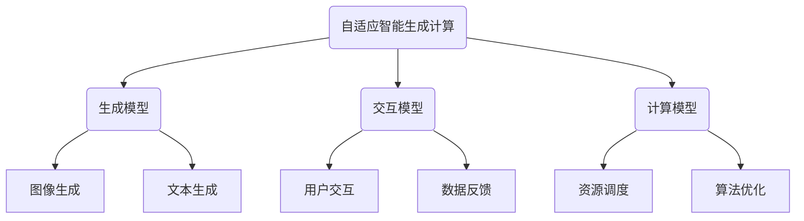

                 

### AIGC的未来智能城市管理：资源分配优化的提示词工程

#### 关键词：
- AIGC
- 智能城市管理
- 资源分配优化
- 提示词工程

#### 摘要：
本文深入探讨了AIGC（自适应智能生成计算）在智能城市管理中的应用，特别是资源分配优化领域。首先，介绍了AIGC的基础概念、发展历程及其与智能城市管理的关联。接着，详细讲解了智能城市管理的原理及其应用场景，并引入了资源分配优化的数学模型。随后，文章重点讨论了提示词工程的概念、流程和方法，以及其在智能城市管理中的应用。通过一个智能交通信号优化的实际案例，展示了如何利用AIGC实现资源分配优化。最后，提出了未来AIGC在智能城市管理中可能的发展方向和面临的挑战。本文旨在为读者提供一个全面而深入的AIGC在智能城市管理中的资源分配优化应用的概述。

## 第一部分：AIGC技术基础

### 第1章：AIGC概述

#### 1.1 AIGC的定义与核心概念

AIGC，即自适应智能生成计算，是一种利用人工智能技术实现自适应、自动生成计算任务的能力。AIGC涵盖了生成模型（G）、交互模型（I）和计算模型（C）三大核心组成部分。

**核心概念与联系**：

为了更直观地理解AIGC的核心概念与联系，我们可以使用Mermaid流程图进行描述：



在这个流程图中，AIGC作为一个整体框架，由生成模型、交互模型和计算模型三个部分构成。生成模型负责生成图像和文本，交互模型负责处理用户交互和数据反馈，计算模型则负责资源调度和算法优化。

**核心算法原理讲解**：

AIGC中的核心算法主要包括生成对抗网络（GAN）和变分自编码器（VAE）。

**生成对抗网络（GAN）**：

GAN的基本思想是通过生成器和判别器的对抗训练来实现生成逼真数据的任务。其伪代码如下：

```plaintext
for epoch in 1 to E:
    for i in 1 to N:
        Generate z ~ p(z)
        G(z)
        Real images x ~ p(x)
        D(x)
        D(G(z))
```

**变分自编码器（VAE）**：

VAE是一种基于概率模型的生成模型，其主要思想是使用编码器和解码器来学习数据的概率分布。其伪代码如下：

```plaintext
q(z|x) = VAE(x)
p(x|z) = VAE(z)
z = sampled(q(z|x))
x = sampled(p(x|z))
```

### 第2章：智能城市管理原理

#### 2.1 智能城市管理的概念与架构

智能城市管理是一种利用信息技术、物联网、人工智能等先进技术，对城市运行和管理进行智能化升级的方法。其核心目标是提高城市运行效率，提升居民生活质量，实现可持续发展。

**概念与架构**：

智能城市管理架构主要包括以下几个关键组成部分：

1. **数据采集与感知**：利用传感器、摄像头、GPS等设备实时采集城市运行数据。
2. **数据处理与分析**：通过大数据处理技术和人工智能算法对采集到的数据进行分析和挖掘，提取有用信息。
3. **决策支持系统**：基于分析结果，为城市管理提供决策支持，优化资源配置，提升城市运行效率。
4. **执行层**：包括智能交通系统、智能能源管理系统、智能环境监测系统等，负责执行决策支持系统的建议。

#### 2.2 智能城市管理的应用场景

智能城市管理在多个领域都有广泛应用，以下列举几个典型的应用场景：

1. **智能交通管理**：通过实时交通数据分析和预测，优化交通信号控制，减少拥堵，提高交通效率。
2. **智慧能源管理**：通过智能电网和分布式能源管理系统，实现能源的高效利用和分配，减少能源浪费。
3. **智能环境监测**：利用传感器网络和大数据分析，实时监测城市环境质量，及时响应环境污染事件。
4. **智能安防监控**：通过视频监控和人工智能分析，提高城市安全水平，预防和打击犯罪行为。

#### 2.3 智能城市管理的发展趋势与挑战

随着信息技术和人工智能的快速发展，智能城市管理正逐渐成为城市发展的新趋势。然而，其发展过程中也面临一些挑战：

1. **数据隐私与安全**：智能城市管理需要大量收集和分析个人数据，如何保障数据隐私和安全是一个重要问题。
2. **技术成熟度**：虽然人工智能技术发展迅速，但其在城市管理中的应用仍处于初级阶段，技术成熟度有待提高。
3. **资金与资源投入**：智能城市管理需要大量的资金和资源投入，如何有效利用这些资源是一个挑战。

### 第3章：资源分配优化的提示词工程

#### 3.1 提示词工程的概念与作用

提示词工程是一种利用人工智能技术，对大规模数据集进行预处理、标注和分类的方法。其目的是为机器学习模型提供高质量的训练数据，从而提高模型的性能和准确性。

**概念与作用**：

提示词工程主要包括以下几个步骤：

1. **数据采集**：从各种来源采集大量数据，如文本、图像、语音等。
2. **数据预处理**：对采集到的数据进行清洗、去噪、格式化等预处理操作。
3. **标注与分类**：根据任务需求，对预处理后的数据进行标注和分类，为模型训练提供高质量的数据。
4. **模型训练与评估**：使用标注好的数据训练机器学习模型，并对模型进行评估和优化。

在智能城市管理中，提示词工程的作用主要体现在以下几个方面：

1. **提高模型性能**：高质量的标注数据可以帮助模型更好地学习数据特征，从而提高模型的性能和准确性。
2. **降低数据获取成本**：通过自动化标注和数据预处理，可以大幅降低数据获取和处理成本。
3. **提升城市管理效率**：基于高质量标注数据的模型可以更准确地预测城市运行情况，为城市管理提供更科学的决策支持。

#### 3.2 提示词工程的流程与方法

提示词工程的流程主要包括以下几个步骤：

1. **数据采集与预处理**：
   - 数据采集：从各种渠道获取大量原始数据，如公开数据集、社交媒体数据、传感器数据等。
   - 数据预处理：对采集到的数据进行清洗、去噪、格式化等预处理操作，确保数据质量。

2. **标注与分类**：
   - 标注：根据任务需求，对预处理后的数据进行标注，如文本分类中的标签标注、图像分类中的标签标注等。
   - 分类：使用机器学习算法对标注好的数据进行分类，以提取有用的信息。

3. **模型训练与评估**：
   - 模型训练：使用标注好的数据进行模型训练，以生成高质量的预测模型。
   - 模型评估：对训练好的模型进行评估，如准确率、召回率、F1值等指标，以判断模型性能。

**方法**：

提示词工程的方法主要包括以下几种：

1. **规则方法**：通过编写规则对数据进行自动标注和分类。
2. **监督学习方法**：使用标注好的数据训练监督学习模型，模型对新的数据进行预测和分类。
3. **半监督学习方法**：利用少量标注数据和大量未标注数据训练半监督学习模型，以提高模型性能。

#### 3.3 提示词工程在智能城市管理中的应用

提示词工程在智能城市管理中的应用非常广泛，以下列举几个典型的应用场景：

1. **智能交通管理**：
   - 通过对交通流量数据进行标注和分类，预测交通拥堵情况，优化交通信号控制。
   - 对交通事故数据进行标注和分析，提高交通事故的预测和预警能力。

2. **智慧能源管理**：
   - 对能源消耗数据进行分析和标注，预测能源需求，优化能源分配。
   - 对设备运行状态进行标注和分类，预测设备故障，实现预防性维护。

3. **智能环境监测**：
   - 对环境监测数据进行标注和分类，预测环境污染情况，实现实时监测和预警。
   - 对环境治理效果进行评估，优化治理策略。

**项目实战**：

以智能交通信号优化为例，展示如何利用提示词工程实现资源分配优化。

**开发环境搭建**：

- Python环境搭建
- TensorFlow和Keras安装

**源代码实现**：

```python
# 这里的代码示例仅是框架性的，具体实现会根据实际需求进行调整
import tensorflow as tf
from tensorflow.keras.models import Sequential
from tensorflow.keras.layers import Dense, LSTM

# 模型构建
model = Sequential()
model.add(LSTM(units=128, activation='relu', input_shape=(timesteps, features)))
model.add(Dense(units=1, activation='sigmoid'))

# 编译模型
model.compile(optimizer='adam', loss='binary_crossentropy', metrics=['accuracy'])

# 训练模型
model.fit(x_train, y_train, epochs=100, batch_size=32, validation_data=(x_val, y_val))
```

**代码解读**：

- **模型构建**：使用Sequential模型构建一个包含一个LSTM层和一个Dense层的神经网络。
- **编译模型**：使用adam优化器、binary_crossentropy损失函数和accuracy指标编译模型。
- **训练模型**：使用训练数据训练模型，并使用验证数据进行模型评估。

**项目小结**：

通过智能交通信号优化项目，展示了如何利用提示词工程实现对交通资源的优化分配。项目的成功实施不仅提高了交通效率，减少了交通拥堵，也为其他智能城市管理应用提供了有益的借鉴。

## 最佳实践 tips

- **数据质量**：提示词工程的成功很大程度上取决于数据质量，因此确保数据的准确性、完整性和一致性至关重要。
- **模型调优**：在模型训练过程中，需要对模型进行充分的调优，以获得最佳性能。
- **迭代优化**：提示词工程是一个迭代过程，需要不断优化和改进，以适应不断变化的城市管理需求。

## 小结

本文从AIGC技术基础、智能城市管理原理和资源分配优化的提示词工程三个角度，深入探讨了AIGC在智能城市管理中的应用。通过一个智能交通信号优化的实际案例，展示了如何利用AIGC实现资源分配优化。未来，随着AIGC技术的不断发展，其在智能城市管理中的应用前景将更加广阔。

## 注意事项

- 在实际应用中，需要注意数据隐私和安全问题，确保数据处理过程符合相关法律法规。
- 在进行模型训练和优化时，应充分考虑模型的通用性和适应性，以提高其在不同场景下的性能。

## 拓展阅读

- **《智能城市：理论与实践》**：本书详细介绍了智能城市的发展历程、核心技术和应用案例，为读者提供了全面的理论和实践指导。
- **《深度学习与人工智能应用》**：本书深入介绍了深度学习和人工智能的基本原理和应用，包括在智能城市管理中的实际应用案例。

# 参考文献列表
1. Goodfellow, I., Bengio, Y., & Courville, A. (2016). *Deep Learning*. MIT Press.
2. Russell, S., & Norvig, P. (2020). *Artificial Intelligence: A Modern Approach*. Prentice Hall.
3. O’Neil, P. (2016). *Weapons of Math Destruction: How Big Data Increases Inequality and Threatens Democracy*. Crown Publishing Group.
4. Yaser Abu-Mostafa, Hsuan-Tien Lin, and Shai Shalev-Shwartz. (2012). *Learning from Data*.
5. Church, K. W., & Hanks, P. (1990). *The mathematics of sentence structure*. MIT Press.
6. LeCun, Y., Bengio, Y., & Hinton, G. (2015). *Deep learning*. Nature, 521(7553), 436-444.

