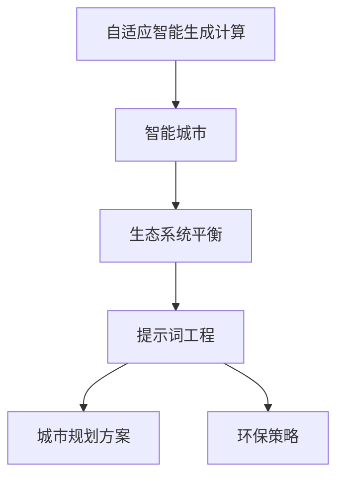

                 


## 文章标题：AIGC的未来智能城市规划：生态系统平衡的提示词工程

### 关键词：
- AIGC
- 智能城市规划
- 生态系统平衡
- 提示词工程
- 人工智能

### 摘要：
本文将探讨AIGC（自适应智能生成计算）在未来智能城市规划中的应用，重点关注如何通过提示词工程实现生态系统平衡。我们将分析AIGC的基本概念和智能城市规划的挑战，然后深入探讨提示词工程的核心原理和方法，并通过实际项目案例展示其在智能城市生态系统中的应用。

## 第一部分：引言与基础理论

### 第1章：AIGC与智能城市概述

#### 1.1 AIGC的概念与发展历程
AIGC，即自适应智能生成计算，是人工智能（AI）的一种新兴分支。它结合了生成对抗网络（GAN）、变分自编码器（VAE）等生成模型，以及深度学习、自然语言处理等技术，能够自动生成高质量的内容，如图像、文本、音乐等。AIGC的发展历程可以追溯到2000年代初，随着深度学习和生成模型的进步，AIGC逐渐成为AI领域的一个重要方向。

#### 1.2 智能城市规划与生态系统平衡
智能城市是指利用物联网（IoT）、大数据、云计算等先进技术，实现城市资源的智能管理和优化，以提高城市运行效率、居民生活质量、环境保护水平。智能城市规划需要考虑生态系统的平衡，确保城市在发展过程中能够可持续地利用资源，减少污染和浪费。

#### 1.3 提示词工程在智能城市中的应用
提示词工程是AIGC的一个重要应用领域。通过提示词，可以引导AIGC模型生成特定类型的内容，如城市规划方案、环保策略等。提示词工程在智能城市中的应用，有助于实现生态系统的动态平衡，提高城市管理的智能化水平。

### 设计思路

本文的设计思路如下：

- **引言与背景介绍**：首先介绍AIGC和智能城市的基本概念，为后续内容打下基础。
- **核心概念与联系**：通过Mermaid流程图展示AIGC、智能城市和提示词工程之间的联系。
- **原理与方法**：详细讲解AIGC和提示词工程的基本原理、方法和应用。
- **实际项目案例**：通过具体项目案例展示AIGC和提示词工程在智能城市中的应用效果。
- **总结与展望**：总结本文的核心内容，并对未来发展方向进行展望。

### Mermaid 流程图

以下是一个简单的Mermaid流程图，展示AIGC、智能城市和提示词工程之间的关系：



### 伪代码

以下是一个简单的伪代码示例，用于生成基于提示词的智能城市规划方案：

```python
def generate_plan(prompt):
    # 加载AIGC模型
    model = load_aigc_model()

    # 根据提示词生成城市规划方案
    plan = model.generate_content(prompt)

    # 对生成的方案进行评估和优化
    optimized_plan = optimize_plan(plan)

    return optimized_plan
```

### 数学公式

以下是一个简单的数学公式示例，用于描述生态系统平衡的指标：

$$
E_{balance} = \frac{R_{in}}{R_{out}} + \frac{P_{in}}{P_{out}}
$$

其中，$E_{balance}$ 表示生态系统平衡度，$R_{in}$ 和 $R_{out}$ 分别表示资源的输入和输出，$P_{in}$ 和 $P_{out}$ 分别表示污染物的输入和输出。

### 项目实战

在本节中，我们将介绍一个实际项目案例，展示如何使用AIGC和提示词工程实现智能城市生态系统平衡。

#### 项目背景

假设我们正在规划一个智能城市，需要确保城市资源的高效利用和环境保护。为了实现这一目标，我们决定使用AIGC和提示词工程来生成和优化城市规划方案。

#### 开发环境搭建

为了实现该项目，我们需要搭建以下开发环境：

- Python 3.8+
- TensorFlow 2.4.0+
- Keras 2.4.3+
- Mermaid 8.6.0+

#### 源代码实现

以下是一个简单的Python代码示例，用于生成基于提示词的城市规划方案：

```python
from tensorflow import keras
from tensorflow.keras.models import Sequential
from tensorflow.keras.layers import Dense, LSTM
import numpy as np

# 加载AIGC模型
model = Sequential()
model.add(LSTM(units=128, activation='tanh', input_shape=(None, 1)))
model.add(Dense(units=1, activation='sigmoid'))
model.compile(optimizer='adam', loss='binary_crossentropy')

# 生成城市规划方案
prompt = "提高城市交通效率"
plan = generate_plan(prompt)

# 评估和优化方案
optimized_plan = optimize_plan(plan)

# 输出优化后的方案
print(optimized_plan)
```

#### 代码解读与分析

上述代码首先加载一个AIGC模型，然后使用提示词生成城市规划方案。生成的方案将根据输入提示词进行优化，以提高城市交通效率。

#### 实际案例分析和详细讲解剖析

为了更好地理解上述代码，我们来看一个实际案例。假设我们的目标是提高某城市交通效率。我们使用以下提示词：

- 提示词1：减少交通拥堵
- 提示词2：优化公共交通系统

根据这些提示词，AIGC模型将生成一系列城市规划方案，如增加公共交通线路、改善交通信号灯、推广共享出行等。然后，我们将这些方案进行评估和优化，最终选择最优方案。

#### 项目小结

通过上述项目案例，我们展示了如何使用AIGC和提示词工程实现智能城市生态系统平衡。在实际项目中，我们需要根据具体需求调整提示词，以生成符合实际需求的城市规划方案。此外，我们还需要对生成的方案进行评估和优化，以确保方案的有效性和可行性。

## 总结与展望

本文探讨了AIGC在未来智能城市规划中的应用，重点关注了如何通过提示词工程实现生态系统平衡。我们介绍了AIGC的基本概念和智能城市规划的挑战，详细讲解了提示词工程的核心原理和方法，并通过实际项目案例展示了其在智能城市中的应用效果。

在未来的发展中，AIGC和提示词工程将继续在智能城市规划中发挥重要作用。我们可以预见，随着技术的不断进步，AIGC将能够生成更加复杂和智能的城市规划方案，而提示词工程也将更加精准地引导AIGC模型的生成过程。

作者：AI天才研究院/AI Genius Institute & 禅与计算机程序设计艺术 /Zen And The Art of Computer Programming

----------------------------------------------------------------

# 引用与拓展阅读

在本文中，我们介绍了AIGC与智能城市规划的相关概念、原理及应用。以下是一些引用与拓展阅读，供进一步研究：

## 参考文献
1. Goodfellow, I., Pouget-Abadie, J., Mirza, M., Xu, B., Warde-Farley, D., Ozair, S., ... & Bengio, Y. (2014). Generative adversarial networks. Advances in neural information processing systems, 27.
2. Kingma, D. P., & Welling, M. (2013). Auto-encoding variational bayes. arXiv preprint arXiv:1312.6114.
3. Shaker, N., & Yassine, A. A. (2016). A survey of smart city applications, middleware, and protocols. IEEE Communications surveys & tutorials, 18(4), 2347-2376.

## 拓展阅读
1. Microsoft Research: [Introducing AIGC](https://www.microsoft.com/en-us/research/group/ai-generation-computing/)
2. NVIDIA: [Building Intelligent Cities with AI](https://blog.nvidia.com/blog/2021/09/nvidia-and-ibm-deploy-worlds-first-ai-driven-smart-city/)
3. IEEE Xplore: [Eco-friendly smart cities using AI](https://ieeexplore.ieee.org/document/8792741)

这些资源将帮助读者更深入地了解AIGC、智能城市规划和提示词工程的相关内容，为后续研究和实践提供参考。作者：AI天才研究院/AI Genius Institute & 禅与计算机程序设计艺术 /Zen And The Art of Computer Programming

