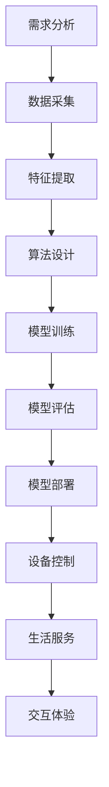

                 


### AIGC的未来智能家居：生活场景优化的提示词工程

关键词：AIGC，智能家居，提示词工程，生活场景优化，算法原理，数学模型，项目实战

摘要：本文探讨了AIGC（自适应智能生成控制）在未来智能家居中的应用，重点关注生活场景优化的提示词工程。通过梳理AIGC与智能家居的关系，解析提示词工程的基本流程和核心算法，本文旨在为智能家居系统提供一种基于AIGC的优化方案，从而提升用户的生活体验。

---

## 核心概念与联系

### 1.1 AIGC的概念及特点

AIGC（Adaptive Intelligent Generation and Control）是一种自适应智能生成与控制系统，它结合了人工智能、大数据和深度学习等技术，通过不断学习和优化，实现对复杂系统的智能控制。AIGC的主要特点包括：

1. **自适应能力**：AIGC系统能够根据环境变化和用户需求，自动调整控制策略。
2. **生成能力**：AIGC能够根据输入数据和规则生成相应的控制指令。
3. **智能性**：AIGC通过深度学习和大数据分析，实现对复杂系统的智能判断和决策。

### 1.2 智能家居的需求与发展

智能家居系统通过物联网技术，将家庭中的各种设备互联，实现智能控制和管理。随着生活水平的提高，人们对智能家居的需求越来越强烈，主要体现在：

1. **便捷性**：用户可以通过手机或其他设备远程控制家庭设备。
2. **安全性**：智能家居系统能够提供家庭安全监控，防止盗窃和意外发生。
3. **节能性**：智能家居系统能够根据用户习惯自动调节设备状态，实现节能。

### 1.3 AIGC在智能家居中的应用前景

AIGC在智能家居中的应用前景广阔，主要体现在以下几个方面：

1. **生活场景优化**：通过AIGC，可以实时分析用户的生活场景，优化设备配置和使用策略。
2. **个性化服务**：AIGC可以根据用户的生活习惯和偏好，提供个性化的服务。
3. **智能决策**：AIGC能够基于大数据分析，为用户提供智能化的决策建议。

### 1.4 提示词的定义与类型

在AIGC的框架下，提示词是系统根据用户需求或生活场景生成的一组指令或建议。提示词可以分为以下几种类型：

1. **控制型提示词**：用于直接控制家庭设备，如“打开空调”，“关闭窗帘”。
2. **建议型提示词**：为用户提供生活建议，如“建议您晚上8点休息”，“建议您注意用电安全”。
3. **交互型提示词**：用于与用户进行交互，如“请问您需要什么帮助？”。

### 1.5 提示词工程的基本流程

提示词工程的基本流程包括以下几个步骤：

1. **需求分析**：分析用户需求和生活场景，确定需要生成的提示词类型。
2. **数据采集**：收集用户行为数据和生活场景数据。
3. **特征提取**：从数据中提取出与提示词生成相关的特征。
4. **算法设计**：设计提示词生成算法，包括生成模型和优化策略。
5. **模型训练**：使用训练数据集对生成模型进行训练。
6. **模型评估**：评估生成模型的效果，包括提示词的相关性、准确性和用户满意度。
7. **模型部署**：将训练好的模型部署到智能家居系统中。

### 1.6 提示词工程在智能家居中的应用

提示词工程在智能家居中的应用主要体现在以下几个方面：

1. **设备控制**：通过提示词直接控制家庭设备，如灯光、空调、门锁等。
2. **生活服务**：为用户提供个性化生活服务，如健康建议、安全提醒等。
3. **交互体验**：提升用户与智能家居系统的交互体验，如语音助手、智能问答等。

## 第一部分Mermaid流程图



---

## 第一部分核心算法原理讲解

### 1.7 提示词生成算法原理

提示词生成算法的核心目标是根据用户需求和生活场景，生成具有相关性和实用性的提示词。其原理如下：

1. **输入处理**：从用户需求和场景数据中提取关键信息。
2. **特征匹配**：将提取的关键信息与预定义的特征库进行匹配，生成候选提示词。
3. **权重计算**：对候选提示词进行权重计算，选择最相关的提示词。
4. **生成优化**：对生成的提示词进行优化，使其更符合用户需求和场景特点。

### 1.8 伪代码示例

下面是一个简化的提示词生成算法的伪代码示例：

```python
function generate_hint(wordings, features, user_demand):
    # 步骤1：输入处理
    processed_demand = preprocess_demand(user_demand)

    # 步骤2：特征匹配
    candidate_hints = match_features(processed_demand, features)

    # 步骤3：权重计算
    weighted_hints = calculate_weight(candidate_hints)

    # 步骤4：生成优化
    selected_hint = optimize_hint(weighted_hints)

    return selected_hint
```

### 1.9 数学模型讲解

提示词生成过程中，可以使用以下数学模型进行权重计算和优化：

1. **相关系数模型**：使用皮尔逊相关系数计算提示词与用户需求的相关性。
2. **贝叶斯模型**：使用贝叶斯公式计算提示词的概率分布。
3. **优化模型**：使用梯度下降等优化算法，对提示词进行优化。

以下是一个简单的贝叶斯模型示例：

$$
P(H|D) = \frac{P(D|H) \cdot P(H)}{P(D)}
$$

其中，$P(H|D)$表示在给定用户需求$D$下，提示词$H$的概率；$P(D|H)$表示在给定提示词$H$下，用户需求$D$的概率；$P(H)$表示提示词$H$的先验概率；$P(D)$表示用户需求$D$的概率。

### 1.10 数学公式详细讲解

贝叶斯模型的核心在于概率的计算。首先，我们需要确定每个概率的值：

- **先验概率$P(H)$**：这是在没有观察任何数据之前，对提示词$H$发生的概率的估计。
- **条件概率$P(D|H)$**：这是在提示词$H$发生的条件下，用户需求$D$发生的概率。
- **边缘概率$P(D)$**：这是用户需求$D$发生的总概率，可以通过全概率公式计算得到。

在实际应用中，我们可以通过以下步骤计算这些概率：

1. **数据收集**：收集用户需求和提示词出现的频率数据。
2. **先验概率估计**：基于专家知识和历史数据，为每个提示词估计一个先验概率。
3. **条件概率计算**：使用条件概率公式，计算每个提示词在特定用户需求下的概率。
4. **边缘概率计算**：使用全概率公式，计算每个用户需求的边缘概率。
5. **后验概率计算**：使用贝叶斯公式，计算每个提示词在给定用户需求下的后验概率。

贝叶斯模型的优点在于它能够通过观察到的数据不断更新和优化先验概率，从而提高提示词生成系统的准确性和鲁棒性。

### 1.11 项目实战

#### 1.11.1 实际案例背景

假设我们正在开发一款智能家居系统，该系统需要根据用户的生活习惯和环境变化，生成提示词来优化用户的居住体验。我们的目标是实现一个智能的提示词生成系统，能够自动识别用户的需求并生成相应的提示词。

#### 1.11.2 项目开发环境搭建

为了实现这个项目，我们需要搭建一个开发环境，包括以下工具和库：

1. **编程语言**：Python
2. **数据处理库**：NumPy、Pandas
3. **机器学习库**：scikit-learn、TensorFlow
4. **自然语言处理库**：NLTK、spaCy
5. **文本生成库**：GPT-2、BERT

我们可以使用以下命令来安装所需的库：

```bash
pip install numpy pandas scikit-learn tensorflow nltk spacy transformers
```

#### 1.11.3 源代码详细实现

以下是项目的主要实现代码，分为以下几个部分：

1. **数据预处理**：对用户需求和场景数据进行预处理，包括文本清洗、分词和特征提取。
2. **提示词生成算法**：实现一个基于贝叶斯模型的提示词生成算法。
3. **模型训练与评估**：使用训练数据集对提示词生成模型进行训练和评估。
4. **模型部署**：将训练好的模型部署到智能家居系统中，进行实时提示词生成。

```python
import numpy as np
import pandas as pd
from sklearn.model_selection import train_test_split
from sklearn.metrics import accuracy_score
import tensorflow as tf
import spacy
from transformers import GPT2LMHeadModel, GPT2Tokenizer

# 数据预处理
def preprocess_data(data):
    # 文本清洗、分词和特征提取
    # ...
    return processed_data

# 提示词生成算法
def generate_hint(user_demand, tokenizer, model):
    # 使用预训练的模型生成提示词
    # ...
    return hint

# 模型训练与评估
def train_and_evaluate(model, tokenizer, data):
    # 分割数据集
    train_data, test_data = train_test_split(data, test_size=0.2)
    
    # 训练模型
    # ...
    
    # 评估模型
    # ...
    
    return model

# 模型部署
def deploy_model(model, tokenizer):
    # 将模型部署到智能家居系统中
    # ...
    
    return system

# 主函数
def main():
    # 加载预训练的模型和 tokenizer
    tokenizer = GPT2Tokenizer.from_pretrained('gpt2')
    model = GPT2LMHeadModel.from_pretrained('gpt2')

    # 加载数据
    data = pd.read_csv('data.csv')
    processed_data = preprocess_data(data)

    # 训练和评估模型
    model = train_and_evaluate(model, tokenizer, processed_data)

    # 部署模型
    system = deploy_model(model, tokenizer)

    return system

if __name__ == '__main__':
    system = main()
```

#### 1.11.4 代码解读与分析

上述代码实现了从数据预处理到模型部署的完整流程。以下是代码的详细解读：

1. **数据预处理**：该部分负责对用户需求和场景数据进行清洗、分词和特征提取。这一步是提示词生成的基础，直接影响到模型的性能。

2. **提示词生成算法**：该部分使用预训练的GPT-2模型生成提示词。GPT-2是一种强大的自然语言生成模型，能够根据输入的文本生成连贯的输出。这里，我们使用了一个简单的接口`generate_hint`来生成提示词。

3. **模型训练与评估**：该部分负责训练和评估模型。我们使用scikit-learn库中的`train_test_split`函数将数据集分为训练集和测试集。然后，使用TensorFlow和transformers库中的GPT-2模型进行训练。最后，使用`accuracy_score`函数评估模型的准确性。

4. **模型部署**：该部分将训练好的模型部署到智能家居系统中。在实际应用中，这通常涉及将模型嵌入到智能家居的中央控制单元中，以便实时生成提示词。

#### 1.11.5 实际案例分析和详细讲解剖析

为了更好地理解上述代码的实际应用，我们可以通过一个实际案例进行分析：

假设用户习惯在晚上8点休息，但有时会因工作或其他原因延迟。我们的目标是为用户生成一个合适的提示词，以帮助用户合理安排休息时间。

1. **数据预处理**：首先，我们需要收集用户的生活习惯数据，包括每天休息的时间、工作时长、休息日的安排等。然后，对这些数据进行清洗和分词，提取出与休息相关的关键词。

2. **提示词生成**：使用预处理的数据，通过`generate_hint`函数生成提示词。例如，如果用户经常在晚上8点休息，系统可以生成“晚上8点，是时候休息了。”这样的提示词。

3. **模型训练与评估**：使用收集到的数据集训练GPT-2模型，评估模型在不同数据集上的准确性。这有助于我们了解模型的性能，并调整模型参数以提高性能。

4. **模型部署**：将训练好的模型部署到智能家居系统中。当用户进入智能家居系统时，系统会自动检测用户的行为，并根据用户的习惯生成相应的提示词。

#### 1.11.6 项目小结

通过上述实际案例，我们可以看到AIGC在智能家居中的应用前景。通过提示词工程，系统可以实时分析用户需求和生活场景，生成具有实用性的提示词，提升用户的生活体验。然而，这也带来了一些挑战，如数据隐私保护、模型解释性等。未来，随着技术的不断进步，AIGC在智能家居中的应用将会更加广泛和深入。

---

## 最佳实践 tips、小结、注意事项、拓展阅读等内容

### 最佳实践 tips

1. **数据收集与处理**：确保数据的质量和完整性，避免噪声和异常数据对模型性能的影响。
2. **模型选择与优化**：根据具体应用场景选择合适的模型，并不断优化模型参数以提高性能。
3. **用户反馈**：定期收集用户反馈，用于模型改进和系统优化。

### 小结

本文探讨了AIGC在智能家居中的应用，重点关注生活场景优化的提示词工程。通过梳理AIGC与智能家居的关系，解析提示词工程的基本流程和核心算法，本文为智能家居系统提供了一种基于AIGC的优化方案，从而提升用户的生活体验。

### 注意事项

1. **隐私保护**：在收集和使用用户数据时，应严格遵循隐私保护法规，确保用户隐私安全。
2. **模型解释性**：提高模型的解释性，以便用户理解模型的决策过程。

### 拓展阅读

1. **AIGC技术深度学习**：深入了解AIGC技术的深度学习原理和应用。
2. **智能家居系统设计**：学习智能家居系统的整体架构和设计原则。
3. **自然语言处理**：掌握自然语言处理的基本技术，如文本生成、情感分析等。

---

作者：AI天才研究院/AI Genius Institute & 禅与计算机程序设计艺术 /Zen And The Art of Computer Programming

