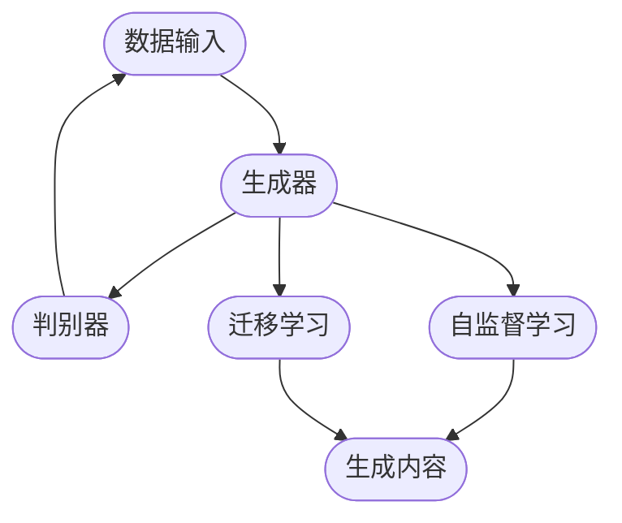

                 


### 目录大纲

在开始撰写文章之前，让我们先详细梳理一下目录大纲，以确保每个章节的内容都能充分覆盖核心概念、算法原理、数学模型、项目实战等关键部分。以下是一个更详细的目录大纲示例，包含每个章节所需的核心内容。

---

## 第一部分：AIGC概述与基础

### 第1章：AIGC的核心概念与未来趋势

#### 1.1 AIGC的定义与背景
- **背景介绍**
  - **AIGC的定义**
  - **AIGC的发展历程**

- **核心概念与联系**
  - **Mermaid流程图**：展示AIGC的基本架构和主要组成部分。

- **伪代码**
  - **AIGC的基本算法原理**

#### 1.2 AIGC的技术特点
- **核心技术特点**
  - **生成对抗网络（GAN）**
  - **自监督学习**
  - **迁移学习**

#### 1.3 AIGC的应用领域
- **应用领域介绍**
  - **智能材料**
  - **医疗影像**
  - **自动驾驶**

### 第2章：智能材料的基本原理

#### 2.1 智能材料的分类与特性
- **智能材料的分类**
  - **自修复材料**
  - **形状记忆材料**
  - **电响应材料**

- **智能材料的特性**
  - **自适应性**
  - **响应性**
  - **多功能性**

#### 2.2 自修复纳米涂层的结构与功能
- **自修复纳米涂层的结构**
  - **自修复涂层的材料组成**
  - **自修复机制**

- **自修复纳米涂层的功能**
  - **环境监测**
  - **机械修复**
  - **防腐蚀**

### 第3章：AIGC与纳米涂层优化

#### 3.1 AIGC在纳米涂层设计中的应用
- **应用场景**
  - **涂层性能预测**
  - **材料选择与优化**

#### 3.2 提示词工程在纳米涂层优化中的作用
- **提示词工程的概念**
  - **提示词的定义**
  - **提示词的设计原则**

- **应用案例**
  - **自修复涂层的优化**

### 第4章：AIGC在自修复功能提升中的应用

#### 4.1 自修复功能的原理与挑战
- **自修复原理**
  - **自修复机制的工作原理**

- **自修复挑战**
  - **自修复涂层的可靠性**
  - **自修复涂层的持久性**

#### 4.2 AIGC在自修复智能材料中的实现
- **实现方法**
  - **机器学习模型的应用**
  - **数据驱动的设计方法**

#### 4.3 提示词工程在自修复功能提升中的应用
- **应用策略**
  - **提高自修复涂层的性能**
  - **实现高效的自修复过程**

### 第5章：AIGC在智能材料性能预测中的应用

#### 5.1 智能材料性能预测的重要性
- **性能预测的挑战**
  - **数据稀缺性**
  - **复杂性**

- **性能预测的方法**
  - **机器学习模型**

#### 5.2 AIGC在智能材料性能预测中的应用
- **应用实例**
  - **涂层寿命预测**
  - **材料强度预测**

#### 5.3 提示词工程在性能预测中的优化策略
- **优化策略**
  - **提高预测准确性**
  - **减少计算成本**

### 第6章：实际案例分析

#### 6.1 案例研究一：AIGC在自修复纳米涂层优化中的应用
- **案例背景**
  - **研究目标**
  - **方法与实现**

- **案例成果**
  - **实验结果**
  - **实际应用**

#### 6.2 案例研究二：智能材料在建筑工程中的应用
- **案例背景**
  - **建筑需求**
  - **技术挑战**

- **案例实现**
  - **AIGC的应用**
  - **项目成果**

### 第7章：AIGC智能材料优化的最佳实践

#### 7.1 最佳实践 tips
- **设计建议**
  - **提高自修复性能**
  - **优化涂层材料**

#### 7.2 注意事项
- **潜在问题**
  - **数据隐私**
  - **模型解释性**

#### 7.3 拓展阅读
- **进一步学习资源**

---

通过这个详细的目录大纲，我们可以确保文章在结构上更加清晰、内容更加全面。接下来，我们将按照这个大纲逐步撰写每个章节，确保文章的逻辑性和完整性。您有任何建议或需要进一步细化的地方，请随时告诉我。现在，我们可以开始撰写第一部分的第一章《AIGC的核心概念与未来趋势》。### 第1章：AIGC的核心概念与未来趋势

#### 1.1 AIGC的定义与背景

**背景介绍**

人工智能生成内容（Artificial Intelligence Generated Content，简称AIGC）是一个新兴的领域，它结合了人工智能（AI）和生成内容（Content Generation）技术。AIGC旨在利用AI技术自动生成高质量的内容，如文章、图像、音乐、视频等。随着深度学习和自然语言处理技术的发展，AIGC逐渐成为内容创作的重要工具。

**核心概念与联系**

AIGC的核心概念包括生成对抗网络（GAN）、自监督学习和迁移学习等。

- **生成对抗网络（GAN）**：GAN由生成器和判别器组成，生成器负责生成数据，判别器则负责判断生成数据是否真实。通过不断优化，生成器能够生成越来越真实的数据。

- **自监督学习**：自监督学习是一种无需人工标注数据的学习方式，它利用未标注的数据来学习。自监督学习在AIGC中发挥着重要作用，例如在图像生成、文本生成等领域。

- **迁移学习**：迁移学习是一种将一个任务学到的知识应用于另一个任务的学习方法。在AIGC中，迁移学习可以帮助快速适应新任务，提高生成效果。

**Mermaid流程图**：展示AIGC的基本架构和主要组成部分。



**伪代码**

```python
# AIGC算法伪代码
def AIGC(input_data):
    # 初始化生成器和判别器
    generator = initialize_generator()
    discriminator = initialize_discriminator()
    
    # 自监督学习循环
    for _ in range(self_learning_epochs):
        # 生成虚假数据
        fake_data = generator.generate(input_data)
        
        # 更新判别器
        discriminator.update(fake_data)
        
        # 更新生成器
        generator.update(input_data, fake_data)
        
    # 迁移学习
    for _ in range(transfer_learning_epochs):
        # 利用自监督学习生成的数据继续训练
        generator.train(input_data)
    
    # 生成最终内容
    generated_content = generator.generate(input_data)
    return generated_content
```

**核心算法原理讲解**

AIGC的算法原理主要基于生成对抗网络（GAN）。GAN由生成器和判别器两个部分组成。生成器的目标是生成尽可能真实的数据，判别器的目标是区分生成数据与真实数据。通过不断迭代，生成器和判别器都会得到优化。

1. **生成器**：生成器的目的是生成与真实数据相似的数据。它通常是一个神经网络，通过输入随机噪声生成数据。

2. **判别器**：判别器的目的是判断输入数据是真实数据还是生成器生成的数据。它也是一个神经网络，通过训练学习如何区分真实与虚假数据。

3. **对抗训练**：在AIGC的训练过程中，生成器和判别器进行对抗训练。生成器试图生成更真实的数据，而判别器则努力提高区分真实与虚假数据的能力。通过这种对抗关系，生成器的生成能力会不断提高。

4. **自监督学习**：自监督学习在AIGC中发挥着重要作用。它利用未标注的数据进行训练，不需要人工标注。例如，在图像生成中，生成器可以生成新的图像，然后判别器判断这些图像是否真实。

5. **迁移学习**：迁移学习可以将一个任务学到的知识应用于另一个任务。例如，在文本生成中，可以先将模型在大量文本数据上进行训练，然后迁移到新的文本生成任务中。

**数学模型**

在AIGC中，常用的数学模型包括损失函数和优化算法。

1. **损失函数**：AIGC的主要目标是最小化生成器与判别器之间的差距。常用的损失函数包括交叉熵损失函数和对抗损失函数。

    - **交叉熵损失函数**：用于判别器，衡量判别器预测的真实概率与实际标签之间的差距。
    - **对抗损失函数**：用于生成器，衡量生成器生成的数据与真实数据之间的差距。

2. **优化算法**：为了最小化损失函数，通常使用梯度下降优化算法。梯度下降是一种迭代算法，通过不断更新模型的参数来优化目标函数。

    ```latex
    \text{损失函数} = -\frac{1}{N}\sum_{i=1}^{N}[\text{交叉熵损失函数} + \text{对抗损失函数}]
    \text{更新参数} = \text{参数} - \text{学习率} \times \text{梯度}
    ```

**举例说明**

假设我们要使用AIGC生成一张新的图像。首先，我们输入一张随机噪声图像作为生成器的输入。生成器将这个噪声图像转换成一张新的图像，然后判别器判断这张图像是否真实。通过不断迭代，生成器会逐渐生成越来越真实的图像，而判别器的判断能力也会不断提高。

**总结**

AIGC是一个结合了人工智能和生成内容的新兴领域。它利用生成对抗网络（GAN）、自监督学习和迁移学习等技术，可以自动生成高质量的内容。通过详细的算法原理讲解和数学模型分析，我们可以更好地理解AIGC的工作机制和应用前景。在下一节中，我们将进一步探讨AIGC的技术特点，以及它在智能材料领域的应用前景。

