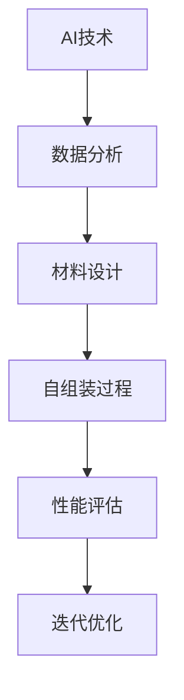

                 

## AIGC的未来智能材料：自组装纳米结构优化的提示词工程

### 文章关键词
- **AIGC**、**智能材料**、**自组装纳米结构**、**提示词工程**、**优化算法**、**数学模型**、**项目实战**

### 文章摘要

本文将深入探讨AIGC（AI-Guided Composition）在智能材料领域的应用，特别是在自组装纳米结构的优化方面。我们将首先介绍AIGC的基本概念及其与智能材料的关联，然后详细讲解自组装纳米结构的基础知识，包括其原理、类型和应用。接着，我们将探讨提示词工程在优化自组装纳米结构中的关键作用，并提供相关的核心算法原理讲解。文章还将涉及数学模型的详细解析，包括公式推导和实际案例的应用。最后，我们将通过具体的项目实战，展示如何在实际中应用AIGC进行智能材料优化，并总结最佳实践和未来的研究方向。

---

## 第一部分：引论

### 1.1 AIGC概述与未来智能材料

#### 背景介绍

人工智能 guided composition（AIGC）是一种结合了人工智能与材料科学的新型技术。它利用机器学习算法对大量数据进行处理，从而指导材料的设计和优化。在智能材料领域，AIGC展现出极大的潜力，尤其是在自组装纳米结构的优化方面。自组装纳米结构具有独特的物理和化学性质，通过智能优化可以显著提高其性能。

#### 核心概念与联系

为了更好地理解AIGC与智能材料的关联，我们可以借助Mermaid流程图来展示两者之间的核心概念和联系：

在这个流程图中，AI技术通过分析大量数据，生成优化建议，指导材料设计。设计的材料经过自组装过程，形成具有特定功能的纳米结构，并通过性能评估来验证其效果。这个过程不断迭代，直到达到理想的优化目标。

### AIGC的定义与特点

AIGC的核心在于“人工智能指导”。这意味着它利用机器学习算法，对材料设计过程中的各种参数进行优化，从而提高材料的性能。AIGC的特点包括：

- **高效性**：通过大数据分析和机器学习，快速生成优化方案。
- **灵活性**：能够适应不同类型的材料和设计需求。
- **可扩展性**：可以广泛应用于不同的材料领域。

### 应用场景

AIGC在智能材料领域的应用场景非常广泛，包括：

- **纳米电子学**：优化纳米电子器件的构造，提高其性能。
- **生物医学**：设计具有特定生物学功能的纳米材料，如药物载体和生物传感器。
- **能源领域**：优化电池材料和太阳能电池，提高能量转换效率。

### 未来的发展方向

随着人工智能技术的不断发展，AIGC在智能材料领域的应用前景将更加广阔。未来的发展方向包括：

- **更高效的算法**：开发更先进的机器学习算法，以进一步提高优化效率。
- **多尺度模拟**：结合多尺度模拟技术，实现从宏观到微观的全面优化。
- **跨学科合作**：加强人工智能与材料科学的跨学科合作，推动技术的创新。

### 总结

AIGC作为一种新兴的技术，为智能材料的设计和优化带来了全新的思路。通过本文的介绍，我们了解了AIGC的基本概念、特点和应用场景，为后续章节的深入探讨打下了基础。

---

作者：AI天才研究院/AI Genius Institute & 禅与计算机程序设计艺术 /Zen And The Art of Computer Programming

---

接下来的章节将分别深入探讨自组装纳米结构的基础知识、提示词工程的原理和应用、AIGC与智能材料优化的关系，以及数学模型与项目实战等内容。通过这些章节，我们将全面了解AIGC在自组装纳米结构优化中的应用，为未来的研究和应用提供指导。

