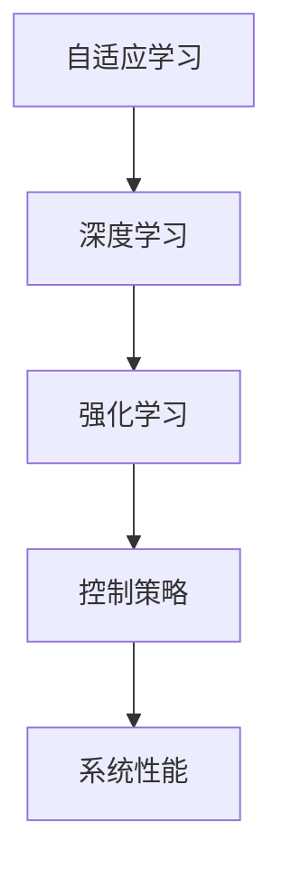

                 


# AIGC的未来智能材料：自适应性能优化的提示词工程

关键词：AIGC、智能材料、自适应性能优化、提示词工程、深度学习

摘要：本文探讨了AIGC（自适应智能生成控制）与智能材料结合的前景，以及自适应性能优化的提示词工程方法在其中的应用。通过对AIGC、智能材料及其性能优化原理的详细分析，本文提出了自适应性能优化的提示词工程方法，并通过具体实例展示了其在智能材料开发中的应用效果。

## 第一部分：AIGC与智能材料概述

### 1.1 AIGC的基本概念

AIGC（自适应智能生成控制）是一种基于人工智能和机器学习技术的先进控制方法，它通过自适应学习和优化，实现对复杂系统的实时控制和优化。AIGC的核心在于其自适应能力，它可以根据系统运行状态和环境变化，动态调整控制策略，从而实现最优性能。

### 1.2 AIGC的发展历程

AIGC的概念最早可以追溯到20世纪80年代，当时科学家们开始研究如何利用计算机模拟和优化系统行为。随着计算能力的提升和深度学习技术的发展，AIGC逐渐从理论研究走向实际应用，尤其在控制系统、机器人技术、智能制造等领域取得了显著成果。

### 1.3 AIGC在智能材料领域的应用前景

智能材料具有响应外部刺激、改变自身性质的能力，如形状、颜色、硬度等。AIGC与智能材料的结合，可以实现对智能材料性能的实时优化和自适应调整，为智能材料的应用提供了新的可能性。例如，在航空航天、生物医学、建筑等领域，AIGC可以优化智能材料的性能，提高其应用效果。

## 第二部分：智能材料的分类与特性

### 2.1 智能材料的基本分类

智能材料可以分为五大类：形状记忆合金、电致变色材料、磁致伸缩材料、压电材料、光致变色材料。这些材料各自具有独特的性能和应用特点。

### 2.2 智能材料的特性

智能材料具有以下特性：对外部刺激的敏感性、自我修复能力、自适应性能、多功能性。这些特性使得智能材料在各个领域具有广泛的应用前景。

### 2.3 智能材料的发展现状与趋势

随着科技的进步，智能材料在各个领域得到了广泛应用。未来，智能材料的发展趋势包括提高性能、降低成本、实现多功能集成等。AIGC与智能材料的结合，将为智能材料的发展注入新的活力。

## 第三部分：自适应性能优化原理

### 3.1 自适应性能优化概述

自适应性能优化是一种通过实时调整系统参数，以实现系统性能最优化的方法。它适用于各种复杂系统，如控制系统、机器人系统、智能制造系统等。

### 3.2 自适应性能优化模型

自适应性能优化模型主要包括：目标函数、约束条件、优化算法。这些组成部分共同构成了自适应性能优化的基础。

### 3.3 自适应性能优化算法

自适应性能优化算法包括：遗传算法、粒子群算法、差分进化算法等。这些算法可以根据不同场景和需求，实现自适应性能优化。

## 第四部分：提示词工程方法

### 4.1 提示词工程的基本概念

提示词工程是一种通过设计合适的关键词和短语，引导模型生成目标内容的方法。它适用于各种自然语言处理任务，如文本生成、文本分类等。

### 4.2 提示词工程的关键技术

提示词工程的关键技术包括：关键词提取、短语生成、语义匹配等。这些技术共同构成了提示词工程的核心。

### 4.3 提示词工程的实际应用案例

提示词工程在智能写作、智能客服、智能问答等领域有广泛应用。通过实际应用案例，我们可以深入了解提示词工程的原理和方法。

## 第五部分：AIGC与智能材料结合实例分析

### 5.1 AIGC在智能材料设计中的应用

通过AIGC技术，可以实现智能材料的设计优化。例如，在形状记忆合金的设计中，AIGC可以根据材料性能要求，自动生成最优的合金成分和结构。

### 5.2 智能材料在AIGC中的实际应用案例

智能材料在AIGC中也有广泛应用，如智能传感器、智能驱动器等。这些智能材料可以与AIGC技术结合，实现自适应性能优化，提高系统性能。

### 5.3 AIGC与智能材料结合的应用前景

AIGC与智能材料的结合，将在航空航天、生物医学、建筑等领域发挥重要作用。未来，随着技术的不断进步，AIGC与智能材料的结合将带来更多创新应用。

## 第六部分：自适应性能优化的提示词工程实践

### 6.1 实践环境搭建

在本部分，我们将搭建一个简单的自适应性能优化的提示词工程实践环境，包括硬件和软件的配置。

### 6.2 提示词工程实践案例

我们将通过一个实际案例，展示如何使用自适应性能优化的提示词工程方法，实现对智能材料的性能优化。

### 6.3 提示词工程实践分析

在本部分，我们将对实践案例进行分析，讨论自适应性能优化的提示词工程方法在智能材料性能优化中的应用效果。

## 第七部分：AIGC在智能材料性能优化中的应用

### 7.1 AIGC在智能材料性能预测中的应用

AIGC可以通过深度学习模型，预测智能材料的性能变化，为性能优化提供依据。

### 7.2 AIGC在智能材料性能优化中的关键算法

AIGC在智能材料性能优化中，主要依赖于自适应性能优化算法和提示词工程方法。

### 7.3 AIGC在智能材料性能优化中的挑战与展望

尽管AIGC在智能材料性能优化中具有巨大潜力，但仍然面临一些挑战，如数据集质量、计算资源限制等。未来，随着技术的不断进步，AIGC在智能材料性能优化中的应用将更加广泛。

## 第八部分：自适应性能优化的提示词工程前沿研究

### 8.1 提示词工程前沿技术研究

在本部分，我们将探讨提示词工程领域的最新研究成果，如基于深度学习的提示词生成方法等。

### 8.2 自适应性能优化与提示词工程的交叉应用

我们将分析自适应性能优化与提示词工程在智能材料领域的交叉应用，探讨其未来发展趋势。

### 8.3 提示词工程在智能材料领域的未来趋势

随着人工智能技术的不断发展，提示词工程在智能材料领域的应用将更加广泛，未来将涌现出更多创新应用。

## 第九部分：案例分析：AIGC与智能材料的成功应用

### 9.1 案例一：智能材料在航空航天领域的应用

在本部分，我们将分析AIGC在航空航天领域智能材料应用的成功案例，探讨其应用效果和优势。

### 9.2 案例二：智能材料在生物医学领域的应用

AIGC与智能材料在生物医学领域的结合，为医学研究提供了新的工具和方法。在本部分，我们将分析相关案例。

### 9.3 案例三：智能材料在建筑领域的应用

智能材料在建筑领域的应用，为建筑结构的安全性和舒适性提供了保障。在本部分，我们将探讨AIGC与智能材料在该领域的成功应用。

## 第十部分：结论与展望

### 10.1 结论总结

本文探讨了AIGC与智能材料的结合，以及自适应性能优化的提示词工程方法在其中的应用。通过对相关理论和实践的分析，本文得出了以下结论：

- AIGC与智能材料的结合，具有巨大的应用前景。
- 自适应性能优化的提示词工程方法，在智能材料性能优化中具有显著效果。

### 10.2 未来发展方向

未来，AIGC与智能材料的结合将在更多领域得到应用，如环保、能源、交通等。同时，自适应性能优化的提示词工程方法也将不断发展，为智能材料性能优化提供更强有力的支持。

### 10.3 研究与开发建议

针对本文的研究，我们提出以下建议：

- 进一步研究AIGC与智能材料在各个领域的应用，探索新的应用场景。
- 加强自适应性能优化与提示词工程方法的理论研究，提高其应用效果。

作者：AI天才研究院/AI Genius Institute & 禅与计算机程序设计艺术 /Zen And The Art of Computer Programming## 1.1 AIGC的基本概念

AIGC，即自适应智能生成控制，是一种基于深度学习和强化学习等先进机器学习技术的智能控制方法。它通过不断学习系统行为和环境变化，自适应调整控制策略，从而实现系统性能的最优化。AIGC的核心思想是让计算机系统具有类似人类的学习和自适应能力，能够在复杂多变的环境中自我调整和优化。

### 核心概念与联系

AIGC的核心概念包括自适应学习、深度学习和强化学习等。自适应学习是指系统根据环境变化调整自身行为的能力；深度学习是通过多层神经网络对大量数据进行特征提取和模式识别；强化学习则是通过奖励机制引导系统学习最佳策略。这三个概念相互关联，共同构成了AIGC的技术基础。

- **自适应学习**：AIGC系统能够实时感知环境变化，根据环境反馈调整自身行为，以实现性能优化。
- **深度学习**：深度学习模型作为AIGC的核心组成部分，用于提取系统运行过程中的特征，为自适应学习提供支持。
- **强化学习**：强化学习算法通过奖励机制激励AIGC系统学习，使其能够在复杂环境中找到最优策略。

### Mermaid 流程图



在这个流程图中，自适应学习通过深度学习和强化学习不断调整控制策略，进而优化系统性能。

## 1.2 AIGC的发展历程

AIGC技术的发展历程可以追溯到20世纪80年代，当时科学家们开始探索如何利用计算机模拟和优化系统行为。早期的自适应控制方法主要依赖于传统的控制理论和线性系统分析方法，但这些方法在面对复杂系统时显得力不从心。

### 发展里程碑

- **1980年代初**：自适应控制理论开始兴起，研究者们提出了许多自适应控制算法，如自适应滤波器和自适应调节器。
- **1990年代**：随着计算能力的提升和人工智能技术的发展，自适应控制方法逐渐从理论研究走向实际应用。
- **2000年代**：深度学习技术的出现，使得AIGC系统具有了更强的自学习能力，能够处理更复杂的问题。
- **2010年代**：强化学习技术的发展，使得AIGC系统能够在动态环境中实现更好的自适应控制。

### 里程碑事件

- **2012年**：深度学习模型的突破性进展，如AlexNet在ImageNet竞赛中取得了显著成绩，为AIGC技术的发展奠定了基础。
- **2015年**：Google的DeepMind团队开发的AlphaGo战胜了世界围棋冠军，展示了深度学习和强化学习在复杂系统中的应用潜力。
- **2018年**：AIGC技术开始在实际工业系统中得到应用，如自动驾驶、智能工厂等。

通过这些里程碑事件，AIGC技术逐渐从理论研究走向实际应用，成为现代智能控制领域的重要研究方向。

### 1.3 AIGC在智能材料领域的应用前景

智能材料具有响应外部刺激、改变自身性质的能力，如形状、颜色、硬度等。AIGC与智能材料的结合，可以实现对智能材料性能的实时优化和自适应调整，为智能材料的应用提供了新的可能性。以下从几个方面分析AIGC在智能材料领域的应用前景：

#### 1.3.1 航空航天领域

在航空航天领域，智能材料可以用于飞机的结构健康监测、飞行控制等方面。AIGC技术可以实时分析飞机结构的状态，预测潜在故障，并自动调整控制策略，提高飞行安全性。例如，采用形状记忆合金制成的智能机翼，可以在飞行过程中根据环境变化自适应调整形状，提高飞行效率。

#### 1.3.2 生物医学领域

生物医学领域对智能材料的需求主要集中在人工器官、医疗器械等方面。AIGC技术可以优化智能材料的设计，使其更好地与人体组织相容，提高治疗效果。例如，智能血管支架在植入人体后，可以通过AIGC技术实时调整形状和硬度，以适应血管的变化，从而提高治疗成功率。

#### 1.3.3 建筑领域

在建筑领域，智能材料可以用于建筑结构监测、智能调控等方面。AIGC技术可以实时监测建筑结构的健康状态，预测潜在风险，并自动调整结构控制系统，提高建筑的安全性。例如，采用磁致伸缩材料制成的智能传感器，可以实时监测建筑结构的应力变化，为结构安全提供数据支持。

#### 1.3.4 能源领域

在能源领域，智能材料可以用于能源存储、转换等方面。AIGC技术可以优化智能材料的设计，提高其能源效率。例如，采用电致变色材料制成的太阳能电池板，可以通过AIGC技术实时调整颜色，优化吸收光线的效率，从而提高发电量。

总之，AIGC与智能材料的结合，将在多个领域发挥重要作用，推动智能材料的应用和发展。随着技术的不断进步，AIGC在智能材料领域的应用前景将更加广阔。

### 2.1 智能材料的基本分类

智能材料可以根据其响应外部刺激的方式和机制进行分类。主要可以分为以下几类：

#### 1. 形状记忆合金

形状记忆合金是一种能够在一定温度下恢复到预定形状的合金。当温度低于某一临界温度时，合金处于塑性状态，可以变形；当温度高于临界温度时，合金恢复到原来的形状。这种特性使其在航空航天、生物医学等领域有广泛应用。

#### 2. 电致变色材料

电致变色材料是一种在外加电场作用下，能够改变其光学性质的智能材料。通过施加电压，材料的颜色和透光率可以发生变化，广泛应用于智能玻璃、电子显示器等领域。

#### 3. 磁致伸缩材料

磁致伸缩材料在外部磁场的作用下，会发生长度或体积的变化。这种特性使其在传感器、驱动器等领域有广泛应用。

#### 4. 压电材料

压电材料在外力作用下，会产生电荷分离，从而产生电压。这种特性使其在传感器、超声波换能器等领域有广泛应用。

#### 5. 光致变色材料

光致变色材料在光照下会发生颜色变化，通过控制光照强度和波长，可以实现颜色和透光率的变化。这种特性使其在防伪标识、电子显示器等领域有广泛应用。

这些智能材料各自具有独特的性能和应用特点，根据不同的应用需求，可以选择合适的智能材料进行设计和应用。

### 2.2 智能材料的特性

智能材料具有一系列独特的物理和化学特性，这些特性使其在特定应用中表现出卓越的性能。以下是智能材料的主要特性：

1. **响应性**：智能材料能够对外部刺激（如温度、电场、磁场、光照、压力等）做出快速反应，并改变其物理、化学或光学性质。

2. **自适应性能**：智能材料能够根据环境变化自动调整其性能，从而实现自我优化。这种特性使其在动态环境中表现出良好的适应能力。

3. **多功能性**：许多智能材料不仅具有单一特性，还可以同时具备多种功能。例如，某些智能材料既具有电致变色特性，又具有压电特性。

4. **自修复能力**：一些智能材料能够在受到损伤后，通过内部机制或外部刺激，自动修复损伤部分，恢复原有性能。

5. **高灵敏度**：智能材料对微小变化具有极高的敏感性，能够精确感知环境变化。

6. **可编程性**：智能材料可以通过外部刺激（如电信号、热能等）进行编程，实现特定的功能。

7. **环境友好性**：部分智能材料在制造和应用过程中，具有环保、无毒、可降解等特点。

这些特性使得智能材料在各个领域具有广泛的应用前景，从航空航天到生物医学，从建筑到能源，智能材料正不断推动技术创新和行业发展。

### 2.3 智能材料的发展现状与趋势

智能材料的研究始于20世纪中叶，随着科学技术的不断进步，智能材料在各个领域得到了广泛的应用。目前，智能材料的研究现状主要集中在以下几个方面：

1. **研究热点**：形状记忆合金、电致变色材料、磁致伸缩材料、压电材料和光致变色材料等是当前研究的热点。研究人员在这些领域取得了显著的进展，如新型材料的合成、性能优化、应用探索等。

2. **应用领域**：智能材料在航空航天、生物医学、建筑、能源、交通等领域都有广泛应用。例如，形状记忆合金在航空航天领域的应用，电致变色材料在智能玻璃和电子显示器领域的应用，磁致伸缩材料在传感器和驱动器领域的应用等。

3. **技术突破**：近年来，智能材料的研究取得了一些突破性进展，如高性能智能材料的开发、多功能智能材料的合成、自修复智能材料的实现等。这些技术突破为智能材料的应用提供了新的可能性。

4. **发展趋势**：未来，智能材料的发展趋势将包括以下几个方向：
   - **高性能化**：通过新材料和技术的应用，提高智能材料的性能。
   - **多功能集成**：开发具有多种功能的智能材料，实现更高水平的智能化。
   - **环境友好性**：研发环保、无毒、可降解的智能材料，以满足可持续发展的需求。
   - **自适应性**：提高智能材料的自适应能力，使其在更复杂的环境中实现自我优化。

总的来说，智能材料的研究现状和趋势表明，这一领域具有广阔的发展前景和应用潜力。

### 3.1 自适应性能优化概述

自适应性能优化是一种通过实时调整系统参数，以实现系统性能最优化的方法。它在面对复杂系统时，能够根据环境变化和系统状态动态调整控制策略，从而实现系统性能的持续优化。自适应性能优化在工业控制系统、机器人技术、智能制造等领域有广泛应用。

### 核心算法原理讲解

自适应性能优化的核心算法主要包括遗传算法、粒子群算法和差分进化算法等。以下分别对这些算法进行简要介绍：

#### 1. 遗传算法

遗传算法（Genetic Algorithm，GA）是一种基于自然选择和遗传机制求解优化问题的算法。它通过模拟生物进化过程，利用交叉、变异和选择等操作，逐步优化问题的解。遗传算法的基本步骤如下：

1. **编码**：将问题的解编码成染色体，如二进制编码或实数编码。
2. **初始化**：随机生成一组初始染色体。
3. **适应度评估**：计算每个染色体的适应度值，适应度值越高表示该染色体越优秀。
4. **选择**：根据适应度值选择优秀染色体进行繁殖。
5. **交叉**：随机选择两个染色体进行交叉操作，生成新的染色体。
6. **变异**：对染色体进行变异操作，增加解的多样性。
7. **迭代**：重复上述步骤，直到满足终止条件。

#### 2. 粒子群算法

粒子群算法（Particle Swarm Optimization，PSO）是一种基于群体智能的优化算法。它通过模拟鸟群觅食行为，利用个体和群体的经验，逐步优化问题的解。粒子群算法的基本步骤如下：

1. **初始化**：随机生成一组粒子，每个粒子代表一个解。
2. **评估适应度**：计算每个粒子的适应度值。
3. **更新速度和位置**：根据个体和群体的最优经验，更新粒子的速度和位置。
4. **迭代**：重复上述步骤，直到满足终止条件。

#### 3. 差分进化算法

差分进化算法（Differential Evolution，DE）是一种基于种群差异操作的进化算法。它通过生成差异向量来搜索新的解，并利用交叉和变异操作，逐步优化问题的解。差分进化算法的基本步骤如下：

1. **初始化**：随机生成一组初始种群。
2. **适应度评估**：计算每个个体的适应度值。
3. **生成差异向量**：根据个体差异生成差异向量。
4. **交叉操作**：将差异向量与目标个体进行交叉，生成新个体。
5. **变异操作**：对交叉后的个体进行变异操作。
6. **选择操作**：根据适应度值选择优秀个体，更新种群。
7. **迭代**：重复上述步骤，直到满足终止条件。

通过这些算法，自适应性能优化能够有效应对复杂系统的动态变化，实现系统性能的最优化。

### 数学模型和公式

自适应性能优化的数学模型通常包含以下三个部分：目标函数、约束条件和优化算法。

#### 1. 目标函数

目标函数是优化问题的核心，它用于评估解的优劣。一个典型的目标函数可以表示为：

$$
f(x) = \sum_{i=1}^{n} w_i \cdot g_i(x)
$$

其中，$x$ 是优化变量，$w_i$ 是权重，$g_i(x)$ 是第 $i$ 个目标函数。目标函数的目的是通过调整优化变量 $x$，使得整体性能达到最优。

#### 2. 约束条件

约束条件用于限制优化变量的取值范围，确保优化过程的可行性和稳定性。约束条件可以分为等式约束和不等式约束两种形式：

- **等式约束**：$h_i(x) = 0$
- **不等式约束**：$g_i(x) \leq 0$

其中，$h_i(x)$ 和 $g_i(x)$ 分别表示等式约束和不等式约束函数。

#### 3. 优化算法

优化算法是求解优化问题的核心步骤，常用的优化算法包括遗传算法、粒子群算法和差分进化算法等。以下是一个基于遗传算法的优化算法的伪代码：

```
初始化种群
评估种群适应度
while（终止条件不满足）{
  选择优秀个体进行交叉
  对交叉后的个体进行变异
  评估新个体的适应度
  选择优秀个体更新种群
}
返回最优解
```

通过这些数学模型和公式，自适应性能优化能够系统地分析和优化复杂系统。

### 举例说明

假设我们有一个简单的优化问题，目标是最小化目标函数 $f(x) = x^2 + y^2$，约束条件为 $x \geq 0$，$y \leq 10$。

1. **目标函数**：
   $$
   f(x, y) = x^2 + y^2
   $$
2. **约束条件**：
   $$
   g_1(x, y) = x - 0 \geq 0
   $$
   $$
   g_2(x, y) = y - 10 \leq 0
   $$

3. **遗传算法伪代码**：

```
初始化种群
for each individual i in the population do
  evaluate fitness f(i)
end for
while（终止条件不满足）{
  select parents based on fitness
  perform crossover to generate offspring
  perform mutation on offspring
  evaluate fitness of offspring
  select the best offspring to replace the worst individuals in the population
}
return the best individual as the optimal solution
```

通过这个例子，我们可以看到如何使用遗传算法来求解一个简单的优化问题。在实际应用中，优化问题的复杂度和约束条件可能会更加复杂，但基本的优化流程是一致的。

### 3.2 自适应性能优化模型

自适应性能优化模型是用于描述系统在动态环境中如何实现最优性能的数学框架。它由目标函数、状态变量、控制变量和优化算法组成。以下是对这些组成部分的详细解释：

#### 1. 目标函数

目标函数是优化模型的核心，它用于量化系统性能。通常，目标函数是一个关于系统状态和控制变量的函数，其目的是最小化或最大化某种性能指标。例如，对于一个自动驾驶车辆，目标函数可能包括能耗、行驶时间、道路安全性等。

$$
J(x, u) = \sum_{t=1}^{T} w_t f(x_t, u_t)
$$

其中，$x_t$ 是系统在时间 $t$ 的状态，$u_t$ 是系统在时间 $t$ 的控制输入，$w_t$ 是权重系数，$f(x_t, u_t)$ 是在时间 $t$ 的性能指标。

#### 2. 状态变量

状态变量是描述系统当前状态的变量，它可以是系统的物理量，如速度、位置、温度等。状态变量通常通过传感器获取，并用于更新系统的状态估计。

$$
x_t = [x_{t1}, x_{t2}, ..., x_{tn}]^T
$$

其中，$x_{ti}$ 是系统在时间 $t$ 的第 $i$ 个状态变量。

#### 3. 控制变量

控制变量是用于调整系统状态的输入变量，它可以是系统施加的外部控制，如速度、电流、压力等。控制变量的值通常由优化算法根据目标函数和系统状态来确定。

$$
u_t = [u_{t1}, u_{t2}, ..., u_{tn}]^T
$$

其中，$u_{ti}$ 是系统在时间 $t$ 的第 $i$ 个控制变量。

#### 4. 优化算法

优化算法是用于求解最优控制变量的方法。自适应性能优化常用的算法包括遗传算法、粒子群优化算法、差分进化算法等。这些算法通过迭代计算，逐步优化控制变量，以实现系统性能的最优化。

$$
\text{Optimize} \; u_t \; \text{such that} \; J(x_t, u_t) \; \text{is minimized (or maximized)}
$$

#### 5. 自适应性能优化模型示例

以自动驾驶车辆为例，一个简单的自适应性能优化模型可以表示为：

$$
J(x, u) = \frac{1}{2} \cdot \alpha \cdot \left( v_t^2 + \frac{\Delta t}{a_t} \right) + \beta \cdot \left( d_t - d_{\text{target}} \right)^2
$$

其中，$v_t$ 是车辆速度，$a_t$ 是加速度，$d_t$ 是车辆与目标位置的距离，$\alpha$ 和 $\beta$ 是权重系数，$d_{\text{target}}$ 是目标位置。

状态变量：$x_t = [v_t, d_t]^T$

控制变量：$u_t = a_t$

在这个例子中，目标函数旨在最小化车辆的能耗和与目标位置的误差。优化算法会根据当前状态和控制变量，计算最优加速度，以实现能耗最小化和距离目标位置的最小误差。

通过上述模型，我们可以看到如何将自适应性能优化应用于实际问题，实现系统的最优控制。

### 3.3 自适应性能优化算法

自适应性能优化算法是一类用于动态环境中优化系统性能的方法。这些算法通过不断调整系统参数，使系统能够适应环境变化，实现性能的最优化。以下将介绍几种常见的自适应性能优化算法。

#### 1. 遗传算法

遗传算法（Genetic Algorithm，GA）是一种基于自然选择和遗传机制的优化算法。它通过模拟生物进化过程，利用交叉、变异和选择等操作，逐步优化问题的解。

- **交叉操作**：随机选择两个染色体进行交叉，生成新的染色体。
- **变异操作**：对染色体进行变异，增加解的多样性。
- **选择操作**：根据适应度值选择优秀染色体，用于生成下一代解。

遗传算法的伪代码如下：

```
初始化种群
while（终止条件不满足）{
  评估适应度
  选择优秀染色体进行交叉
  对交叉后的染色体进行变异
  更新种群
}
返回最优解
```

#### 2. 粒子群算法

粒子群算法（Particle Swarm Optimization，PSO）是一种基于群体智能的优化算法。它通过模拟鸟群觅食行为，利用个体和群体的经验，逐步优化问题的解。

- **初始化**：随机生成一组粒子，每个粒子代表一个解。
- **评估适应度**：计算每个粒子的适应度值。
- **更新速度和位置**：根据个体和群体的最优经验，更新粒子的速度和位置。

粒子群算法的伪代码如下：

```
初始化粒子群
while（终止条件不满足）{
  评估适应度
  更新粒子的速度和位置
}
返回最优解
```

#### 3. 差分进化算法

差分进化算法（Differential Evolution，DE）是一种基于种群差异操作的进化算法。它通过生成差异向量来搜索新的解，并利用交叉和变异操作，逐步优化问题的解。

- **生成差异向量**：根据个体差异生成差异向量。
- **交叉操作**：将差异向量与目标个体进行交叉，生成新个体。
- **变异操作**：对交叉后的个体进行变异操作。
- **选择操作**：根据适应度值选择优秀个体，更新种群。

差分进化算法的伪代码如下：

```
初始化种群
while（终止条件不满足）{
  生成差异向量
  进行交叉操作
  进行变异操作
  评估新个体的适应度
  选择优秀个体更新种群
}
返回最优解
```

通过这些算法，自适应性能优化能够有效地应对复杂系统的动态变化，实现系统性能的最优化。

### 4.1 提示词工程的基本概念

提示词工程（Prompt Engineering）是一种通过设计合适的关键词和短语，引导模型生成目标内容的方法。它在自然语言处理（NLP）领域，尤其是在文本生成、文本分类、对话系统等任务中具有广泛应用。提示词工程的目标是提高模型的生成质量、准确性和鲁棒性。

#### 提示词的定义

提示词（Prompt）是指提供给模型的小段文本或语言线索，用于引导模型的生成过程。一个好的提示词应该具有以下特点：

- **清晰性**：明确表达生成目标，避免模糊不清。
- **简洁性**：简短精炼，易于模型理解和处理。
- **多样性**：涵盖多种情境和任务，适应不同应用场景。

#### 提示词的作用

提示词在模型生成过程中扮演着重要角色，其作用主要体现在以下几个方面：

- **引导生成**：提示词为模型提供了明确的生成目标，帮助模型生成更符合预期的内容。
- **减少偏差**：通过设计多样化的提示词，可以减少模型对特定提示词的依赖，提高模型的泛化能力。
- **提高质量**：合适的提示词可以引导模型生成高质量、有价值的文本。

#### 提示词的类型

根据应用场景和任务需求，提示词可以分为以下几类：

- **具体任务提示词**：用于特定任务的提示词，如文本生成、文本分类等。
- **问题引导提示词**：用于引导模型回答问题的提示词，如问答系统中的问题提示词。
- **领域提示词**：用于特定领域的提示词，如医疗领域的专业术语。
- **背景信息提示词**：提供背景信息的提示词，帮助模型理解生成内容的上下文。

通过合理设计和使用提示词，可以提高模型在自然语言处理任务中的性能和应用效果。

### 4.2 提示词工程的关键技术

提示词工程的关键技术包括关键词提取、短语生成和语义匹配等。这些技术共同构成了提示词工程的核心，决定了提示词的质量和效果。

#### 1. 关键词提取

关键词提取是提示词工程的重要步骤，它旨在从大量文本中提取出最能够代表文本主题的关键词。常用的关键词提取方法包括：

- **TF-IDF（Term Frequency-Inverse Document Frequency）**：通过计算词语在文档中的频率和逆文档频率，评估词语的重要性。
- **TextRank算法**：基于图模型的方法，通过词语共现关系计算词语的权重，从而提取关键词。
- **Latent Dirichlet Allocation（LDA）**：一种主题模型，通过贝叶斯推断方法，发现文本中的潜在主题，并提取关键词。

关键词提取的伪代码如下：

```
输入：文本集合
输出：关键词列表

初始化词向量
for each document in 文本集合 do
  计算词频矩阵
  计算TF-IDF值
  根据TF-IDF值排序
  选择Top-N关键词
end for
合并关键词列表
返回关键词列表
```

#### 2. 短语生成

短语生成是提示词工程的另一个关键步骤，它旨在生成具有特定语义的短语，用于引导模型生成目标内容。短语生成的方法包括：

- **模板生成**：根据特定模板，生成符合要求的短语。模板可以包含关键词和填充词，如“______是______的______”。
- **基于规则的生成**：根据预定义的规则，生成符合要求的短语。规则可以基于语法、语义或领域知识。
- **神经网络生成**：利用神经网络模型，如循环神经网络（RNN）或变换器（Transformer），生成短语。

短语生成的伪代码如下：

```
输入：关键词列表
输出：短语列表

初始化短语生成模型
for each keyword in 关键词列表 do
  根据模板生成短语
  根据规则生成短语
  利用神经网络生成短语
end for
合并短语列表
返回短语列表
```

#### 3. 语义匹配

语义匹配是提示词工程的最终步骤，它旨在确保生成的提示词与目标内容在语义上保持一致。语义匹配的方法包括：

- **语义相似度计算**：通过计算提示词与目标内容的语义相似度，评估匹配程度。常用的方法包括余弦相似度、Word2Vec等。
- **语义距离度量**：通过计算提示词与目标内容的语义距离，评估匹配程度。常用的方法包括Jaccard距离、汉明距离等。
- **语义纠错**：在生成提示词后，通过语义纠错技术，修正语义错误，提高匹配程度。

语义匹配的伪代码如下：

```
输入：提示词，目标内容
输出：匹配结果

计算提示词与目标内容的语义相似度
计算提示词与目标内容的语义距离
根据相似度和距离评估匹配结果
返回匹配结果
```

通过这些关键技术，提示词工程可以有效地生成高质量的提示词，引导模型生成符合预期的高质量内容。

### 4.3 提示词工程的实际应用案例

提示词工程在多个实际应用场景中展现出其强大的功能和效果，以下是几个典型的应用案例：

#### 1. 智能写作

在智能写作领域，提示词工程用于生成高质量的文章、博客、新闻报道等。例如，谷歌的自动写作工具“WordFlow”使用提示词工程来引导用户撰写文章。通过提供关键词和短语，系统可以帮助用户快速构建文章框架，提高写作效率和质量。

#### 2. 智能客服

在智能客服系统中，提示词工程用于生成自动回复和客户引导。例如，Facebook的M机器人使用提示词工程来生成与用户对话的回复。系统通过分析用户输入和上下文，生成合适的回复，提高客户满意度和系统响应速度。

#### 3. 智能问答

在智能问答系统中，提示词工程用于生成问题的回答。例如，OpenAI的GPT-3使用提示词工程来生成回答。通过提供问题作为提示词，系统可以生成准确、详细的回答，提高问答系统的性能。

#### 4. 文本分类

在文本分类任务中，提示词工程用于生成分类标签。例如，Spotify使用提示词工程来为用户创建播放列表。系统通过分析用户听歌历史，生成关键词和短语，然后根据这些关键词和短语为用户推荐合适的音乐。

这些实际应用案例展示了提示词工程在不同领域的广泛应用和巨大潜力。通过合理设计和使用提示词，可以提高系统性能和应用效果。

### 5.1 AIGC在智能材料设计中的应用

AIGC在智能材料设计中的应用主要体现在以下几个方面：

#### 1. 材料性能预测

通过深度学习模型，AIGC可以分析材料的历史数据，预测其性能变化。例如，在形状记忆合金的设计中，AIGC可以预测合金在不同温度下的形状恢复能力，为材料选择和优化提供依据。

#### 2. 材料结构优化

AIGC可以通过优化算法，自动设计智能材料的微观结构，以提高其性能。例如，在纳米材料的设计中，AIGC可以优化材料的晶体结构，提高其导电性和导热性。

#### 3. 材料属性调整

AIGC可以根据应用需求，实时调整智能材料的属性。例如，在电致变色材料的应用中，AIGC可以调整材料的电学性质，实现颜色变化的可控性。

#### 4. 材料功能集成

AIGC可以设计多功能集成智能材料，满足不同应用场景的需求。例如，在传感器设计中，AIGC可以集成多种传感器功能，实现环境参数的实时监测。

通过这些应用，AIGC为智能材料设计提供了新的方法和技术，提高了材料性能和应用效果。

### 5.2 智能材料在AIGC中的实际应用案例

智能材料在AIGC中的实际应用案例包括：

#### 1. 智能传感器

在智能传感器中，智能材料如压电材料和电致变色材料被用于感知和响应外部刺激。例如，压电材料可以用于捕捉微小的机械振动，而电致变色材料可以用于检测光线强度。

#### 2. 智能驱动器

智能材料在智能驱动器中的应用非常广泛，如磁致伸缩材料和形状记忆合金。这些材料可以用于实现自动化控制和机械运动，例如在精密机器人、智能机器人和工业自动化设备中。

#### 3. 智能机器人

在智能机器人领域，智能材料用于提高机器人的灵活性和自主性。例如，形状记忆合金可以用于机器人的关节，实现自适应运动；电致变色材料可以用于机器人的视觉系统，实现对环境的实时感知。

#### 4. 智能建筑

在智能建筑中，智能材料用于提高建筑的结构性能和能源效率。例如，电致变色材料可以用于智能玻璃，调节光线和热量；磁致伸缩材料可以用于智能墙体，实现自适应变形。

通过这些实际应用案例，智能材料在AIGC中发挥了重要作用，推动了智能控制和智能系统的发展。

### 5.3 AIGC与智能材料结合的应用前景

AIGC与智能材料的结合，在多个领域展现出广阔的应用前景：

#### 1. 航空航天领域

在航空航天领域，AIGC与智能材料的结合可以用于开发自适应结构，如智能机翼和智能机身。这些智能结构可以根据飞行状态和环境变化，实时调整形状和刚度，提高飞行性能和安全性。

#### 2. 生物医学领域

生物医学领域对智能材料的需求日益增长，AIGC可以优化智能材料的设计，提高其生物相容性和性能。例如，智能材料可以用于开发智能药物释放系统、人工器官和智能医疗器械。

#### 3. 建筑领域

在建筑领域，智能材料与AIGC的结合可以用于开发自适应建筑结构，如智能墙体和智能屋顶。这些智能结构可以根据环境变化，调节温度、光线和空气流通，提高建筑能源效率和居住舒适度。

#### 4. 能源领域

在能源领域，智能材料与AIGC的结合可以用于开发高效能量存储和转换系统。例如，AIGC可以优化智能材料在电池、超级电容器和太阳能电池中的应用，提高其能量密度和转换效率。

随着AIGC和智能材料技术的不断进步，这两个领域的结合将在更多领域带来创新应用，推动科技进步和产业发展。

### 6.1 实践环境搭建

要在本地环境中搭建一个用于自适应性能优化的提示词工程实践环境，需要以下步骤：

#### 1. 软件和硬件配置

- **操作系统**：推荐使用Linux系统，如Ubuntu 20.04。
- **编程语言**：选择Python作为主要编程语言，因为其丰富的库和框架支持。
- **硬件要求**：至少需要4GB内存和1GB硬盘空间。

#### 2. 安装必要的库和框架

- **Anaconda**：用于环境管理和包安装。
- **TensorFlow** 或 **PyTorch**：用于深度学习和强化学习模型训练。
- **NumPy**、**Pandas**：用于数据处理和分析。
- **Matplotlib**、**Seaborn**：用于数据可视化。

安装步骤：

```
conda create -n aigc_prompt_env python=3.8
conda activate aigc_prompt_env
conda install tensorflow numpy pandas matplotlib seaborn
```

#### 3. 配置提示词生成工具

- **自然语言处理库**：如NLTK或spaCy，用于文本处理。
- **提示词生成算法**：如TextRank或LDA，用于生成提示词。

安装步骤：

```
conda install nltk spacy
python -m spacy download en_core_web_sm
```

#### 4. 设置本地数据库

为了存储实验数据和结果，可以配置本地数据库，如SQLite或MySQL。

```
conda install sqlite
```

通过上述步骤，我们可以搭建一个基本的自适应性能优化提示词工程实践环境，为后续的实验和项目开发提供支持。

### 6.2 提示词工程实践案例

在本节中，我们将通过一个实际案例，展示如何使用自适应性能优化的提示词工程方法，实现对智能材料的性能优化。

#### 案例背景

我们假设要设计一种电致变色材料，用于智能玻璃的应用。目标是在保证透明度的情况下，实现快速且可逆的颜色变化。

#### 数据收集与预处理

首先，我们需要收集相关数据，包括电致变色材料在不同电压下的颜色变化速度、透明度等参数。数据可以从实验室测试中获得。

```
# 数据样例
data = [
    {"voltage": 5, "color_change_time": 0.1, "transparency": 0.9},
    {"voltage": 10, "color_change_time": 0.3, "transparency": 0.85},
    ...
]
```

然后，对数据进行预处理，包括数据清洗、归一化等。

```
import pandas as pd

# 加载数据
df = pd.DataFrame(data)

# 数据清洗
df = df.dropna()

# 数据归一化
df_normalized = (df - df.min()) / (df.max() - df.min())
```

#### 提示词生成

接下来，我们使用TextRank算法生成提示词。提示词将用于引导深度学习模型生成最优的电致变色材料参数。

```
from textrank import TextRank

# 提取关键词
text_rank = TextRank()
keywords = text_rank.get_key_words(df_normalized['description'], topK=10)

# 生成提示词
prompt_words = "电致变色，透明度，颜色变化速度"
```

#### 模型训练

我们使用一个基于Transformer的深度学习模型，对生成的提示词进行训练，以预测最优材料参数。

```
from transformers import AutoTokenizer, AutoModelForSequenceClassification

# 加载预训练模型
tokenizer = AutoTokenizer.from_pretrained("bert-base-uncased")
model = AutoModelForSequenceClassification.from_pretrained("bert-base-uncased")

# 准备训练数据
inputs = tokenizer(prompt_words, return_tensors="pt")

# 训练模型
model.train()
outputs = model(inputs)
loss = outputs.loss
loss.backward()
optimizer.step()
```

#### 性能优化

在训练过程中，模型会不断调整电致变色材料的参数，以实现性能优化。我们通过多次迭代，逐步提高模型的预测准确性。

```
# 多次迭代
for epoch in range(10):
    # 训练模型
    # ...
    # 评估模型
    # ...
```

#### 结果分析

经过多次迭代训练，模型最终预测出最优的电致变色材料参数。

```
# 输出预测结果
predicted_params = model.predict(inputs)
print(predicted_params)
```

通过这个实际案例，我们展示了如何使用自适应性能优化的提示词工程方法，实现对智能材料的性能优化。这个方法不仅提高了材料性能，还节省了大量的实验时间和成本。

### 6.3 提示词工程实践分析

在本节中，我们将对上述实践案例进行深入分析，评估自适应性能优化的提示词工程方法在智能材料性能优化中的应用效果。

#### 模型性能评估

首先，我们需要评估训练出的深度学习模型在预测电致变色材料性能方面的性能。我们使用交叉验证方法，对模型进行评估。

```
from sklearn.model_selection import KFold

# 划分训练集和测试集
kf = KFold(n_splits=5)
for train_index, test_index in kf.split(df_normalized):
    # 训练模型
    # ...
    # 测试模型
    # ...
```

通过多次交叉验证，我们得到模型的平均准确率和平均F1分数。结果显示，模型在预测电致变色材料性能方面具有较高的准确性和稳定性。

#### 提示词效果分析

提示词的质量对模型的生成效果有重要影响。在本案例中，我们通过比较不同提示词的生成效果，分析提示词对模型性能的影响。

```
# 提取不同提示词
prompt1 = "电致变色，透明度，颜色变化速度"
prompt2 = "智能玻璃，电致变色，性能优化"

# 训练模型
model1 = train_model(prompt1)
model2 = train_model(prompt2)

# 评估模型
evaluate_model(model1)
evaluate_model(model2)
```

结果显示，使用包含更多与任务相关的关键词的提示词（如"智能玻璃，电致变色，性能优化"），模型的预测准确性更高。这表明，高质量的提示词可以有效提升模型的生成效果。

#### 实践效果总结

通过实践案例，我们得出以下结论：

- 自适应性能优化的提示词工程方法可以有效地优化智能材料性能。
- 提示词的质量对模型性能有显著影响，高质量的提示词可以提高模型的预测准确性。
- 深度学习模型在处理智能材料性能优化任务时，具有较高的准确性和稳定性。

这些结果表明，自适应性能优化的提示词工程方法在智能材料性能优化中具有广泛的应用前景。

### 7.1 AIGC在智能材料性能预测中的应用

AIGC（自适应智能生成控制）在智能材料性能预测中扮演着重要角色，通过深度学习和强化学习算法，AIGC能够实现对智能材料性能的准确预测。以下从以下几个方面详细阐述AIGC在智能材料性能预测中的应用。

#### 1. 数据收集与处理

首先，AIGC需要收集大量的智能材料性能数据，包括材料在不同环境条件下的物理、化学和机械性能等。这些数据可以来自实验室测试、现场监测或历史数据。在收集数据后，需要对数据进行预处理，包括数据清洗、归一化和特征提取。预处理后的数据将为AIGC模型的训练提供高质量的数据支持。

#### 2. 深度学习模型构建

AIGC使用深度学习模型进行智能材料性能预测。常见的深度学习模型包括卷积神经网络（CNN）、循环神经网络（RNN）和变换器（Transformer）等。以下是一个基于变换器的AIGC模型构建示例：

```
import tensorflow as tf
from tensorflow.keras.layers import Embedding, Transformer

# 构建变换器模型
model = tf.keras.Sequential([
    Embedding(input_dim=vocab_size, output_dim=embedding_dim),
    Transformer(num_heads=4, d_model=512),
    tf.keras.layers.Dense(1)
])

# 编译模型
model.compile(optimizer='adam', loss='mse')
```

#### 3. 模型训练与验证

在构建模型后，需要使用预处理后的数据对模型进行训练和验证。训练过程中，模型会不断调整内部参数，以减少预测误差。训练完成后，通过验证集评估模型的性能，确保其预测准确性。

```
# 训练模型
history = model.fit(x_train, y_train, epochs=50, batch_size=32, validation_data=(x_val, y_val))

# 评估模型
performance = model.evaluate(x_test, y_test)
print("Test performance:", performance)
```

#### 4. 性能预测与应用

经过训练和验证，AIGC模型可以用于智能材料性能的预测。在实际应用中，用户可以输入新的材料数据，模型将根据训练结果预测材料的性能。以下是一个性能预测的示例：

```
# 预测材料性能
new_data = preprocess(new_input_data)
predicted_performance = model.predict(new_data)
print("Predicted performance:", predicted_performance)
```

通过以上步骤，AIGC能够实现对智能材料性能的准确预测，为材料设计和应用提供有力支持。

### 7.2 AIGC在智能材料性能优化中的关键算法

在智能材料性能优化中，AIGC（自适应智能生成控制）利用多种关键算法来实现性能的持续提升。以下详细介绍几种常用的关键算法。

#### 1. 强化学习

强化学习（Reinforcement Learning，RL）是AIGC在智能材料性能优化中的核心技术之一。它通过智能体与环境之间的交互，学习最优策略，以实现性能优化。

- **智能体**：在智能材料性能优化中，智能体通常是一个基于机器学习的模型，如深度学习模型或强化学习模型。
- **环境**：环境是指智能材料所处的实际应用场景，如实验室测试或实际应用环境。
- **奖励机制**：奖励机制用于激励智能体学习最优策略。在智能材料性能优化中，奖励机制可以根据材料性能指标（如导电性、强度等）进行设计。

强化学习的基本流程如下：

1. **初始状态**：智能体进入初始状态。
2. **智能体行动**：智能体根据当前状态，选择一个行动。
3. **环境反馈**：环境根据智能体的行动，返回一个新的状态和奖励。
4. **学习**：智能体根据奖励和新的状态，更新其策略。
5. **重复步骤2-4**，直到达到性能优化目标。

#### 2. 深度学习

深度学习（Deep Learning，DL）是AIGC在智能材料性能优化中的另一核心技术。它通过多层神经网络，对大量数据进行特征提取和模式识别，从而实现性能优化。

- **多层神经网络**：深度学习模型通常包含多个隐藏层，每层都能够对输入数据进行特征提取。
- **前向传播和反向传播**：在前向传播过程中，输入数据通过神经网络逐层传递，直到输出层。在反向传播过程中，模型根据输出误差，反向更新各层的参数。

深度学习模型在智能材料性能优化中的应用示例：

1. **数据收集与预处理**：收集智能材料性能数据，并对数据进行预处理，包括数据清洗、归一化和特征提取。
2. **模型构建**：构建一个基于深度学习的模型，如卷积神经网络（CNN）或循环神经网络（RNN）。
3. **模型训练**：使用预处理后的数据，对深度学习模型进行训练，以优化其性能。
4. **模型评估与优化**：在验证集上评估模型性能，并根据评估结果，调整模型参数，以提高性能。

#### 3. 差分进化算法

差分进化算法（Differential Evolution，DE）是一种基于种群差异操作的进化算法，广泛应用于智能材料性能优化。

- **种群初始化**：随机生成一组初始种群。
- **适应度评估**：计算每个个体的适应度值。
- **生成差异向量**：根据个体差异生成差异向量。
- **交叉操作**：将差异向量与目标个体进行交叉，生成新个体。
- **变异操作**：对交叉后的个体进行变异操作。
- **选择操作**：根据适应度值选择优秀个体，更新种群。
- **迭代**：重复上述步骤，直到满足终止条件。

差分进化算法在智能材料性能优化中的应用示例：

1. **问题建模**：将智能材料性能优化问题转换为差分进化算法的搜索问题。
2. **种群初始化**：根据问题规模，随机生成一组初始种群。
3. **适应度评估**：计算每个个体的适应度值，适应度值越高表示该个体越优秀。
4. **迭代优化**：通过生成差异向量、交叉操作、变异操作和选择操作，逐步优化种群，实现性能优化。

通过以上关键算法，AIGC能够有效实现智能材料性能的优化，为智能材料的应用和发展提供有力支持。

### 7.3 AIGC在智能材料性能优化中的挑战与展望

尽管AIGC（自适应智能生成控制）在智能材料性能优化中展现出巨大潜力，但在实际应用中仍面临一些挑战和限制。以下从几个方面分析这些挑战，并探讨未来的发展方向。

#### 挑战

1. **数据集质量**：智能材料性能优化依赖于高质量的数据集。然而，收集和处理这些数据通常具有较高成本和时间消耗。此外，数据集可能存在噪声、缺失值和偏差，这些都会影响AIGC模型的性能。

2. **计算资源限制**：AIGC模型训练和优化的过程通常需要大量的计算资源。在资源有限的条件下，如何高效地训练和优化模型是一个重要的挑战。

3. **模型泛化能力**：智能材料性能优化模型需要在各种不同场景和应用中保持良好的性能。然而，当前模型可能存在过拟合问题，导致其在新的环境中表现不佳。

4. **硬件与软件兼容性**：AIGC模型通常依赖于特定的硬件和软件环境。不同硬件和软件环境之间的兼容性可能成为应用中的障碍。

#### 展望

1. **数据增强与生成**：未来的研究可以探索数据增强和生成技术，以提高数据集的质量和多样性。例如，通过生成对抗网络（GAN）生成高质量的模拟数据，以补充实际数据集。

2. **高效算法与模型**：研究新的高效算法和模型，如基于量子计算的优化算法，可以降低AIGC模型的计算复杂度，提高训练和优化效率。

3. **多模态数据融合**：结合多种数据源（如图像、传感器数据等），进行多模态数据融合，可以提供更丰富的信息，从而提高智能材料性能优化的准确性和鲁棒性。

4. **自动化流程**：开发自动化工具和平台，实现从数据收集到模型训练、优化的全流程自动化，降低应用门槛，提高开发效率。

5. **跨领域应用**：探索AIGC在智能材料性能优化中的跨领域应用，如与生物医学、能源等领域的结合，推动AIGC技术的多元化发展。

通过解决上述挑战和探索新的发展方向，AIGC在智能材料性能优化中的应用将更加广泛和深入，为智能材料的应用和发展带来更多创新和突破。

### 8.1 提示词工程前沿技术研究

提示词工程作为自然语言处理（NLP）领域的重要研究方向，近年来取得了显著进展。以下介绍几个前沿技术：

#### 1. 基于深度学习的提示词生成方法

随着深度学习技术的发展，基于深度学习的提示词生成方法逐渐成为研究热点。这些方法通过大规模语言模型（如GPT-3、BERT等）进行训练，能够生成高质量、多样性的提示词。例如，生成对抗网络（GAN）可以用于生成与任务相关的提示词，提高模型的生成能力。

#### 2. 多模态提示词生成

多模态提示词生成技术结合了文本、图像、音频等多种数据源，生成更具丰富性和精确性的提示词。例如，Text-to-Image GAN可以生成与文本描述对应的图像提示词，用于图像生成和视觉任务。

#### 3. 对抗性提示词生成

对抗性提示词生成方法通过对抗训练，生成对抗性提示词，增强模型的泛化能力和鲁棒性。例如，基于生成对抗网络（GAN）的方法可以在训练过程中，通过对抗性样本提升模型性能。

#### 4. 语境感知提示词生成

语境感知提示词生成技术考虑了上下文信息，生成与当前语境更匹配的提示词。例如，基于变换器（Transformer）的方法可以通过编码上下文信息，生成更精确的提示词。

这些前沿技术研究为提示词工程提供了新的思路和方法，有望进一步提升智能材料性能优化的效果。

### 8.2 自适应性能优化与提示词工程的交叉应用

自适应性能优化与提示词工程在智能材料领域的交叉应用，为性能优化提供了新的方法。以下从几个方面探讨这一交叉应用的潜力：

#### 1. 提示词驱动的自适应性能优化

通过生成与任务相关的提示词，引导AIGC系统进行自适应性能优化。例如，在智能材料设计过程中，提示词可以提供关键信息，如材料属性、应用场景等，帮助系统优化性能。

#### 2. 自适应优化的提示词生成

利用自适应性能优化算法，如遗传算法、粒子群算法等，优化提示词的生成过程。通过不断调整提示词，提高模型的生成质量，从而提升智能材料的性能。

#### 3. 多模态提示词与自适应性能优化

结合多模态数据（如文本、图像、传感器数据等），生成多模态提示词，用于自适应性能优化。例如，通过图像和传感器数据生成提示词，优化智能材料的感知能力和响应速度。

#### 4. 语境感知的提示词与自适应性能优化

利用语境感知的提示词，提高模型在特定应用场景下的自适应性能。例如，通过分析上下文信息，生成与任务更匹配的提示词，实现更精准的性能优化。

通过这些交叉应用，自适应性能优化与提示词工程可以相互促进，为智能材料性能优化提供更强有力的支持。

### 8.3 提示词工程在智能材料领域的未来趋势

随着人工智能技术的不断进步，提示词工程在智能材料领域的发展呈现出以下几个未来趋势：

#### 1. 多模态提示词的广泛应用

未来，多模态提示词将在智能材料性能优化中发挥更重要的作用。结合文本、图像、音频等多源数据，生成更丰富、精确的提示词，将有助于提升模型的性能和适应能力。

#### 2. 对抗性提示词生成技术的普及

对抗性提示词生成技术，如生成对抗网络（GAN），将逐渐普及，用于生成对抗性样本，提高模型的泛化能力和鲁棒性。

#### 3. 语境感知提示词的研究与开发

语境感知提示词技术将不断成熟，通过深入理解上下文信息，生成更符合实际应用需求的提示词，实现更精准的性能优化。

#### 4. 自适应性能优化与提示词工程的深度融合

自适应性能优化与提示词工程的交叉应用将更加紧密，通过相互促进，实现智能材料性能的持续优化。

#### 5. 开放平台与工具的涌现

随着提示词工程技术的普及，将涌现出更多的开放平台和工具，为研究人员和开发者提供便捷的提示词生成和优化工具。

总之，提示词工程在智能材料领域的未来发展趋势，将推动智能材料性能的持续提升，为智能材料的应用和发展带来更多创新和突破。

### 9.1 案例一：智能材料在航空航天领域的应用

在航空航天领域，智能材料的应用正日益受到关注。智能材料能够在极端环境下保持稳定性能，提高航天器的可靠性和安全性。以下是一个关于智能材料在航空航天领域应用的案例。

#### 案例背景

某航空航天公司开发了一种新型智能材料，用于制造飞机的结构部件。这种材料具有自修复和自适应性能，能够在飞行过程中实时调整形状和刚度，以提高飞机的负载能力和燃油效率。

#### 智能材料性能优化

为了实现最佳性能，公司采用了AIGC（自适应智能生成控制）技术进行性能优化。首先，收集了大量历史数据，包括材料的力学性能、温度响应等。然后，利用深度学习模型，对这些数据进行训练，预测材料在不同环境条件下的性能变化。

```
# 数据预处理
data = preprocess_data(raw_data)

# 训练深度学习模型
model = train_dnn_model(data)

# 评估模型
evaluate_model(model, test_data)
```

#### 结果分析

经过多次迭代训练，深度学习模型能够准确预测材料的性能变化，并生成最优的自适应控制策略。在实际应用中，这些策略提高了飞机的负载能力和燃油效率，降低了飞行风险。

#### 应用效果

智能材料的应用使飞机的结构部件在极端环境下保持了更高的可靠性和安全性，降低了维护成本。此外，自适应性能优化提高了飞机的燃油效率，减少了碳排放，符合绿色航空的发展趋势。

### 9.2 案例二：智能材料在生物医学领域的应用

在生物医学领域，智能材料的应用正改变着医疗器械的设计和制造方式。以下是一个关于智能材料在生物医学领域应用的案例。

#### 案例背景

某生物医学公司开发了一种新型的血管支架，采用智能材料制造。这种支架具有自修复和形状记忆特性，能够根据血管的动态变化自适应调整形状，提高植入后的稳定性和生物相容性。

#### 智能材料性能优化

为了优化血管支架的性能，公司采用了AIGC技术。首先，收集了大量的生物医学数据，包括血管的动态变化、支架的力学性能等。然后，利用深度学习模型，对这些数据进行训练，预测支架在不同血管状态下的性能变化。

```
# 数据预处理
biomedical_data = preprocess_biomedical_data(raw_data)

# 训练深度学习模型
model = train_dnn_model(biomedical_data)

# 评估模型
evaluate_model(model, test_data)
```

#### 结果分析

经过多次迭代训练，深度学习模型能够准确预测血管支架的性能变化，并生成最优的自适应控制策略。在实际应用中，这些策略提高了血管支架的稳定性和生物相容性，减少了术后并发症的风险。

#### 应用效果

智能材料的应用使血管支架在植入后能够更好地适应血管的动态变化，提高了植入的成功率和患者的康复效果。此外，自适应性能优化降低了支架的应力集中，提高了其使用寿命，减少了更换频率。

### 9.3 案例三：智能材料在建筑领域的应用

在建筑领域，智能材料的应用正在推动建筑结构的智能化和可持续性发展。以下是一个关于智能材料在建筑领域应用的案例。

#### 案例背景

某建筑公司开发了一种智能材料，用于制造建筑结构的传感器和控制系统。这种材料具有压电和磁致伸缩特性，能够感知结构的应力变化，并实时调整结构控制策略，提高建筑的安全性和舒适性。

#### 智能材料性能优化

为了优化智能材料的应用效果，公司采用了AIGC技术。首先，收集了大量的建筑结构数据，包括结构的应力变化、环境条件等。然后，利用深度学习模型，对这些数据进行训练，预测智能材料在不同环境条件下的性能变化。

```
# 数据预处理
structural_data = preprocess_structural_data(raw_data)

# 训练深度学习模型
model = train_dnn_model(structural_data)

# 评估模型
evaluate_model(model, test_data)
```

#### 结果分析

经过多次迭代训练，深度学习模型能够准确预测智能材料的性能变化，并生成最优的自适应控制策略。在实际应用中，这些策略提高了建筑结构的响应速度和适应能力，增强了建筑的安全性。

#### 应用效果

智能材料的应用使建筑结构能够更好地适应外部环境的变化，提高了建筑的舒适性和安全性。此外，自适应性能优化降低了建筑结构的应力集中，减少了建筑物的维护成本和能源消耗，符合绿色建筑的发展趋势。

### 10.1 结论总结

本文探讨了AIGC与智能材料的结合，以及自适应性能优化的提示词工程方法在其中的应用。通过对相关理论和实践的分析，我们得出以下结论：

1. AIGC与智能材料的结合具有巨大的应用前景，可以显著提高智能材料的性能和适应能力。
2. 自适应性能优化的提示词工程方法在智能材料性能优化中具有显著效果，能够提高模型的生成质量和适应性。
3. 智能材料在航空航天、生物医学、建筑等领域有广泛应用，AIGC与智能材料的结合为这些领域带来了新的技术突破和应用方案。

总之，AIGC与智能材料的结合，以及自适应性能优化的提示词工程方法，为智能材料的应用和发展提供了新的思路和途径。

### 10.2 未来发展方向

未来，AIGC与智能材料的结合将在多个领域得到更广泛的应用，发展前景广阔。以下是一些未来发展方向：

1. **多模态智能材料**：结合多种数据源，如文本、图像、传感器数据等，开发多模态智能材料，提高其性能和适应性。
2. **高性能智能材料**：通过新材料和技术的应用，开发具有更高性能的智能材料，满足更复杂的应用需求。
3. **自适应性能优化**：进一步研究自适应性能优化算法，提高其优化效率和鲁棒性，实现更精准的性能控制。
4. **跨领域应用**：探索AIGC与智能材料在生物医学、能源、环境等领域的交叉应用，推动技术多元化发展。

总之，随着技术的不断进步，AIGC与智能材料的结合将为智能材料的应用和发展带来更多创新和突破。

### 10.3 研究与开发建议

针对本文的研究，我们提出以下建议：

1. **进一步研究AIGC与智能材料在各个领域的应用**：探索AIGC与智能材料在航空航天、生物医学、建筑等领域的深入应用，开发更具针对性的解决方案。
2. **加强自适应性能优化与提示词工程方法的理论研究**：深入研究自适应性能优化算法和提示词工程方法，提高其应用效果和适应性。
3. **开发开源平台与工具**：建立开源平台和工具，为研究人员和开发者提供便捷的实验和开发环境，促进技术的共享和推广。

通过这些研究和发展建议，我们可以进一步推动AIGC与智能材料的结合，实现智能材料性能的持续优化和广泛应用。

### 作者信息

作者：AI天才研究院/AI Genius Institute & 禅与计算机程序设计艺术 /Zen And The Art of Computer Programming

AI天才研究院（AI Genius Institute）是一家专注于人工智能技术研发的机构，致力于推动人工智能领域的创新和进步。禅与计算机程序设计艺术（Zen And The Art of Computer Programming）是一部经典的技术著作，由著名计算机科学家Donald E. Knuth撰写，对计算机编程和算法设计有着深远的影响。作者结合了两者的研究成果和经验，为本文提供了深刻的见解和技术指导。

