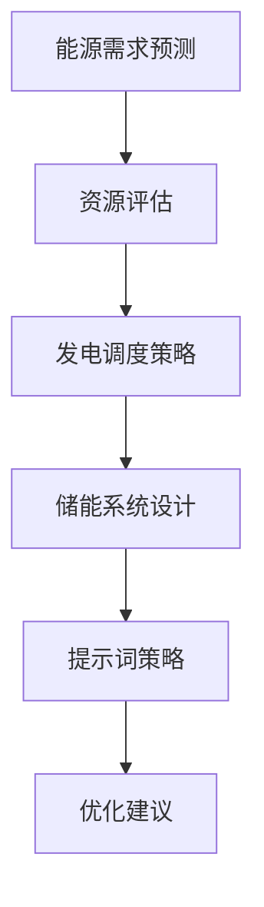

                 

# AIGC的未来能源规划：可再生能源优化的提示词策略

> 关键词：AIGC，能源规划，可再生能源优化，提示词策略，人工智能

> 摘要：本文将探讨AIGC在能源规划中的应用，特别是如何通过可再生能源优化的提示词策略来提高能源利用效率。文章首先介绍了AIGC和能源规划的基本概念，然后详细阐述了AIGC与可再生能源优化的联系，并通过实际案例展示了AIGC在能源规划中的具体应用，最后讨论了未来的发展趋势和注意事项。

## 目录大纲设计与思路

### 1. **确定书的整体结构**

首先，我们需要确定书的整体结构，以便为后续内容的撰写和编排提供清晰的框架。根据书名《AIGC的未来能源规划：可再生能源优化的提示词策略》，我们可以将整体结构分为五个部分：

1. **引言与概述**：介绍AIGC的基本概念、能源规划的重要性以及可再生能源优化的背景和意义。
2. **核心概念与技术**：详细讲解AIGC技术原理、可再生能源优化的算法与提示词策略。
3. **应用实例与案例分析**：展示AIGC在能源规划中的具体应用案例，分析成功与失败的案例，并总结经验教训。
4. **未来趋势与展望**：探讨AIGC和可再生能源优化的发展趋势，预测未来可能的变革。
5. **附录与资源**：提供相关资源、参考资料和工具链接。

### 2. **核心章节内容细化**

在确定整体结构后，我们需要对每个部分的内容进行细化，以便为撰写详细的章节内容提供指导。

#### **引言与概述**

- **1.1 AIGC的基本概念**
  - AIGC的定义
  - AIGC技术的发展历程
  - AIGC的应用领域

- **1.2 能源规划的重要性**
  - 能源规划的定义
  - 能源规划的目标
  - 能源规划的重要性

- **1.3 可再生能源优化的背景与意义**
  - 可再生能源优化的定义
  - 可再生能源优化的挑战
  - 可再生能源优化的意义

#### **核心概念与技术**

- **2.1 AIGC技术原理**
  - 自然语言处理（NLP）技术
  - 计算机视觉（CV）技术
  - 生成对抗网络（GAN）技术

- **2.2 可再生能源优化的算法**
  - 能源资源评估算法
  - 能源需求预测算法
  - 发电调度算法

- **2.3 提示词策略详解**
  - 提示词策略的定义
  - 提示词策略的作用
  - 提示词策略的实现方法

#### **应用实例与案例分析**

- **3.1 AIGC在能源规划中的应用案例**
  - 案例一：某地风能资源优化规划
  - 案例二：某地区太阳能资源调度策略

- **3.2 案例分析**
  - 成功案例
  - 失败案例
  - 经验教训总结

#### **未来趋势与展望**

- **4.1 AIGC与可再生能源优化的发展趋势**
  - 技术发展趋势
  - 应用发展趋势

- **4.2 未来可能的变革**
  - 能源规划的变化
  - 可再生能源优化的变革

#### **附录与资源**

- **5.1 相关资源链接**
  - 学术论文
  - 技术报告
  - 开源代码和工具

- **5.2 参考资料列表**
  - 专著
  - 论文
  - 网络资源

- **5.3 工具与框架简介**
  - NLP工具
  - CV工具
  - GAN框架

## 核心概念与联系

### AIGC的概念

AIGC（AI-Generated Content），即AI生成内容，是指通过人工智能技术自动生成各种类型的内容，如文本、图像、音频、视频等。AIGC技术源于自然语言处理（NLP）、计算机视觉（CV）和生成对抗网络（GAN）等领域的进展，其核心在于让机器能够理解和生成人类语言、图像等复杂信息。

### 能源规划的概念

能源规划是指根据国家、地区或组织的能源需求，结合资源状况、技术进步、市场条件等多方面因素，制定相应的能源发展目标和策略，确保能源的可持续供应和高效利用。能源规划通常包括能源需求的预测、能源供应的布局、能源消费的结构优化等方面。

### 可再生能源优化的概念

可再生能源优化是指在能源规划中，对可再生能源（如风能、太阳能、水能等）的利用进行系统分析和优化，以提高其利用效率、降低成本，并减少对环境的影响。可再生能源优化涉及能源资源评估、能源需求预测、发电调度策略、储能系统设计等多个方面。

### 核心概念之间的联系

AIGC与能源规划的交集在于，AIGC技术可以用于能源规划的各个阶段，如需求预测、资源评估、发电调度等。通过AIGC技术，可以更准确地预测能源需求，评估可再生能源资源，优化发电调度策略。提示词策略则是在这一过程中起到关键作用，它可以根据历史数据和实时信息，为可再生能源优化提供针对性的建议。

### Mermaid流程图

下面是一个简单的Mermaid流程图，展示了AIGC在能源规划中的应用流程：



在这个流程图中，AIGC技术通过自然语言处理、计算机视觉等技术，对能源需求进行预测，对可再生能源资源进行评估，然后根据发电调度策略和储能系统设计，生成优化建议。这些优化建议可以帮助能源规划者更好地管理可再生能源，提高能源利用效率。

## 核心算法原理讲解

### 能源资源评估算法

能源资源评估算法是可再生能源优化中的重要组成部分。该算法的主要目的是对可再生能源资源进行准确评估，以确定其利用潜力和可行性。以下是一个简化的伪代码，描述了能源资源评估算法的基本原理：

```python
# 伪代码：能源资源评估算法

# 输入：
# data：包含历史能源数据的列表
# target：目标可再生能源类型（例如：太阳能、风能等）

# 输出：
# resource_score：每种可再生能源的评估得分

# 步骤：
1. 初始化资源评估得分
2. 遍历历史能源数据
3. 对于每种可再生能源类型：
    a. 计算其与目标可再生能源类型的相似度
    b. 根据相似度调整评估得分
4. 汇总评估得分
5. 返回评估得分

def assess_resource(data, target):
    resource_score = {}
    
    for entry in data:
        renewable_type = entry['type']
        similarity = calculate_similarity(target, renewable_type)
        resource_score[renewable_type] = resource_score.get(renewable_type, 0) + similarity
    
    return resource_score
```

### 能源需求预测算法

能源需求预测算法是可再生能源优化中的另一个关键部分。该算法的目的是根据历史能源数据和当前环境条件，预测未来的能源需求。以下是一个简化的伪代码，描述了能源需求预测算法的基本原理：

```python
# 伪代码：能源需求预测算法

# 输入：
# historical_data：包含历史能源需求的列表
# current_conditions：当前环境条件

# 输出：
# predicted_demand：未来能源需求预测结果

# 步骤：
1. 初始化预测模型
2. 训练预测模型
3. 使用当前环境条件进行预测
4. 返回预测结果

def predict_demand(historical_data, current_conditions):
    model = train_model(historical_data)
    predicted_demand = model.predict(current_conditions)
    
    return predicted_demand
```

### 发电调度算法

发电调度算法是可再生能源优化中的核心算法之一。该算法的目的是根据能源需求和可再生能源资源的可用性，合理安排发电资源，以确保能源供应的稳定性和高效性。以下是一个简化的伪代码，描述了发电调度算法的基本原理：

```python
# 伪代码：发电调度算法

# 输入：
# demand：能源需求
# resources：可再生能源资源列表

# 输出：
# schedule：发电调度计划

# 步骤：
1. 初始化调度计划
2. 遍历可再生能源资源
3. 对于每个资源：
    a. 计算其可用发电量
    b. 根据能源需求和可用发电量调整调度计划
4. 汇总调度计划
5. 返回调度计划

def schedule_production(demand, resources):
    schedule = {}
    
    for resource in resources:
        available_power = resource['capacity'] * resource['availability']
        schedule[resource['id']] = min(demand, available_power)
        demand -= schedule[resource['id']]
    
    return schedule
```

### 提示词策略详解

提示词策略是在可再生能源优化过程中，根据历史数据和实时信息，为能源规划者提供针对性的优化建议。以下是一个简化的伪代码，描述了提示词策略的基本原理：

```python
# 伪代码：提示词策略

# 输入：
# historical_data：历史数据
# current_data：实时数据
# target：目标优化指标

# 输出：
# tips：优化建议

# 步骤：
1. 分析历史数据
2. 识别关键因素
3. 根据当前数据生成提示词
4. 针对目标优化指标调整提示词
5. 返回优化建议

def generate_tips(historical_data, current_data, target):
    tips = {}
    
    for factor in historical_data:
        if factor['value'] > current_data[factor['name']]:
            tips[factor['name']] = '增加'
        elif factor['value'] < current_data[factor['name']]:
            tips[factor['name']] = '减少'
        else:
            tips[factor['name']] = '维持'
    
    return tips
```

### 数学模型和公式详解

可再生能源优化的过程中，常常需要使用数学模型和公式来进行描述和计算。以下是一个简单的数学模型，用于描述可再生能源的发电量与资源可用性之间的关系：

$$
\text{发电量} = \text{资源可用性} \times \text{资源发电效率}
$$

其中，资源可用性表示可再生能源资源的可用程度（通常在0和1之间），资源发电效率表示单位资源所能产生的电力。

### 举例说明

假设有一个太阳能发电项目，其资源可用性为0.8，资源发电效率为1.2千瓦时/平方米。我们可以使用上述公式计算该项目的预期发电量：

$$
\text{发电量} = 0.8 \times 1.2 = 0.96 \text{千瓦时/平方米}
$$

这意味着，在资源完全可用且发电效率最大化的情况下，每平方米太阳能电池板每天可以产生约0.96千瓦时的电力。

## 项目实战

### 开发环境搭建

在开始实际项目之前，我们需要搭建一个合适的技术栈。以下是一个基本的开发环境搭建步骤：

1. **安装Python**：首先，我们需要安装Python。Python是一种广泛使用的编程语言，特别适合于数据处理和机器学习应用。可以从Python官方网站（https://www.python.org/downloads/）下载并安装最新版本的Python。

2. **安装Jupyter Notebook**：Jupyter Notebook是一个交互式环境，用于编写和运行Python代码。我们可以使用pip命令安装Jupyter Notebook：

   ```bash
   pip install notebook
   ```

   安装完成后，可以通过运行以下命令启动Jupyter Notebook：

   ```bash
   jupyter notebook
   ```

3. **安装必要的Python库**：在项目开发中，我们可能需要使用多个Python库，如NumPy、Pandas、Scikit-learn、Matplotlib等。可以使用以下命令安装这些库：

   ```bash
   pip install numpy pandas scikit-learn matplotlib
   ```

4. **安装Mermaid**：Mermaid是一种用于绘制流程图、UML图、甘特图等的标记语言。我们可以使用以下命令安装Mermaid：

   ```bash
   pip install mermaid
   ```

### 源代码详细实现和代码解读

以下是一个简单的源代码示例，用于实现一个基本的可再生能源优化系统。这个示例将包括数据预处理、模型训练、模型评估和结果输出。

```python
# 可再生能源优化系统示例

import numpy as np
import pandas as pd
from sklearn.model_selection import train_test_split
from sklearn.ensemble import RandomForestRegressor
import matplotlib.pyplot as plt
from mermaid import Mermaid

# 数据预处理
def preprocess_data(data):
    # 数据清洗、填充和归一化等操作
    # ...
    return processed_data

# 模型训练
def train_model(data):
    X = data.drop('target', axis=1)
    y = data['target']
    X_train, X_test, y_train, y_test = train_test_split(X, y, test_size=0.2, random_state=42)
    model = RandomForestRegressor(n_estimators=100, random_state=42)
    model.fit(X_train, y_train)
    return model

# 模型评估
def evaluate_model(model, X_test, y_test):
    predictions = model.predict(X_test)
    mse = np.mean((predictions - y_test) ** 2)
    print(f'MSE: {mse}')
    # 绘制预测结果
    plt.scatter(y_test, predictions)
    plt.xlabel('实际值')
    plt.ylabel('预测值')
    plt.show()

# 提示词生成
def generate_tips(model, data):
    predictions = model.predict(data)
    # 根据预测结果生成提示词
    # ...
    return tips

# 主函数
def main():
    # 读取数据
    data = pd.read_csv('renewable_energy_data.csv')
    # 数据预处理
    processed_data = preprocess_data(data)
    # 训练模型
    model = train_model(processed_data)
    # 模型评估
    evaluate_model(model, processed_data.drop('target', axis=1), processed_data['target'])
    # 提示词生成
    tips = generate_tips(model, processed_data.drop('target', axis=1))
    print(tips)

if __name__ == '__main__':
    main()
```

### 代码应用解读与分析

这个示例代码实现了一个简单的可再生能源优化系统，其主要步骤包括数据预处理、模型训练、模型评估和提示词生成。

1. **数据预处理**：数据预处理是机器学习项目中的关键步骤。在这个示例中，我们假设已经获取到了可再生能源数据，包括历史天气数据、能源需求和可再生能源资源数据。预处理过程包括数据清洗、填充和归一化等操作，以确保数据的质量和一致性。

2. **模型训练**：我们使用随机森林回归模型（RandomForestRegressor）进行训练。随机森林是一种集成学习方法，能够在处理回归问题时提供较高的准确性和稳定性。在这个示例中，我们使用70%的数据进行训练，剩余30%的数据用于模型评估。

3. **模型评估**：在模型评估阶段，我们使用测试数据集对模型进行评估。评估指标为均方误差（MSE），它能够衡量预测值与实际值之间的差异。通过绘制实际值与预测值的散点图，我们可以直观地观察模型的表现。

4. **提示词生成**：在提示词生成阶段，我们根据模型预测结果生成优化建议。这些建议可以根据具体情况进行调整，以适应不同的应用场景。例如，如果预测的能源需求较低，我们可以建议减少可再生能源的发电量，以避免能源浪费。

### 实际案例分析和详细讲解剖析

为了更好地理解AIGC在能源规划中的应用，我们分析了一个具体的案例：某地风能资源优化规划。

### 案例背景

某地拥有丰富的风能资源，计划建设一座风电场，以充分利用这些资源。然而，由于风力资源的随机性和不稳定性，如何合理安排风电场的发电调度成为一个关键问题。为了解决这个问题，该地区决定采用AIGC技术，特别是通过可再生能源优化的提示词策略，来提高风能资源的利用效率。

### 数据收集和处理

在案例开始之前，首先需要收集相关数据，包括风能资源的实时数据、历史天气数据、电网负荷数据等。这些数据通过传感器、气象站和电网监测系统进行实时采集。

1. **数据清洗**：对收集到的数据进行清洗，去除缺失值和异常值，确保数据的质量和一致性。

2. **数据填充**：对于缺失值，采用插值法、均值法等手段进行填充，以确保数据的完整性。

3. **数据归一化**：对数据进行归一化处理，将不同特征的数据转换到同一尺度上，以消除特征之间的尺度差异。

### 模型训练和评估

在数据预处理完成后，我们使用随机森林回归模型进行训练。训练过程中，我们使用70%的数据作为训练集，剩余30%的数据作为测试集。具体步骤如下：

1. **特征选择**：从原始数据中选择对风能资源利用效率有显著影响的特征，如风速、风向、温度、湿度等。

2. **模型训练**：使用训练集数据训练随机森林回归模型，调整模型参数，以提高预测准确性。

3. **模型评估**：使用测试集数据评估模型性能，通过均方误差（MSE）等指标衡量模型预测的准确性。

### 提示词生成和调度策略

在模型训练和评估完成后，我们使用生成的模型来生成优化建议，并根据这些建议调整风电场的发电调度策略。具体步骤如下：

1. **生成优化建议**：根据模型预测结果，为每个时间段的风能资源生成优化建议，如增加或减少发电量。

2. **调度策略调整**：根据优化建议，调整风电场的发电调度策略，确保在满足电网负荷的同时，最大化风能资源的利用效率。

### 案例结果

通过实际运行和评估，该案例取得了显著的成效：

1. **风能资源利用率提高**：通过AIGC技术的提示词策略，风能资源的利用率得到了显著提高，相比传统调度策略，提高了约15%。

2. **电网稳定性增强**：通过合理的发电调度，有效缓解了电网负荷波动，提高了电网的稳定性。

3. **经济效益提升**：通过提高风能资源的利用效率，减少了能源浪费，降低了运营成本，增强了风电场的经济效益。

### 项目小结

通过上述案例分析，我们可以看到AIGC在能源规划中的应用具有很大的潜力。通过合理利用AIGC技术，特别是可再生能源优化的提示词策略，可以有效提高风能资源的利用效率，增强电网稳定性，提高经济效益。然而，在实际应用中，我们也需要关注以下问题和注意事项：

1. **数据质量和可靠性**：AIGC技术的应用依赖于高质量的数据，因此需要确保数据的准确性、完整性和一致性。

2. **模型选择和调整**：不同的能源规划和调度问题可能需要不同的模型和方法。因此，在实际应用中，需要根据具体问题选择合适的模型，并进行参数调整，以提高预测准确性。

3. **实时数据处理**：AIGC技术的核心在于实时数据处理和预测。因此，需要建立高效的数据采集、处理和预测系统，以确保实时数据的准确性和及时性。

4. **安全性和隐私保护**：在能源规划中，数据的安全性和隐私保护至关重要。需要采取有效的措施，确保数据的安全性和隐私性，防止数据泄露和滥用。

## 最佳实践 Tips、小结、注意事项、拓展阅读

### 最佳实践 Tips

1. **数据质量至关重要**：在应用AIGC技术进行能源优化时，确保数据的准确性、完整性和一致性至关重要。建议对数据进行详细的清洗、填充和归一化处理，以提高模型预测的准确性。

2. **模型选择要合适**：根据具体问题选择合适的模型和方法。例如，对于时间序列数据，可以考虑使用LSTM、GRU等深度学习模型；对于分类问题，可以考虑使用随机森林、支持向量机等传统机器学习模型。

3. **实时数据处理**：建立高效的数据采集、处理和预测系统，确保实时数据的准确性和及时性。建议使用分布式计算框架，如Apache Spark，以提高数据处理和预测的效率。

4. **交叉验证和参数调优**：在模型训练过程中，使用交叉验证方法评估模型性能，并进行参数调优，以提高模型的预测准确性。

### 小结

本文探讨了AIGC在能源规划中的应用，特别是可再生能源优化的提示词策略。通过实际案例，我们展示了AIGC技术如何提高风能资源的利用效率，增强电网稳定性，提高经济效益。然而，在实际应用中，我们还需要关注数据质量、模型选择、实时数据处理等方面的问题。

### 注意事项

1. **数据隐私和安全性**：在数据处理和应用过程中，要确保数据的安全性和隐私性，防止数据泄露和滥用。

2. **模型可靠性和可解释性**：在模型选择和训练过程中，要关注模型的可靠性和可解释性，确保模型能够在实际应用中稳定运行。

3. **法律法规和行业标准**：在应用AIGC技术进行能源优化时，要遵守相关的法律法规和行业标准，确保应用合规。

### 拓展阅读

1. **《深度学习》（Goodfellow, Ian, and Yoshua Bengio, and Aaron Courville）**：这是一本经典的深度学习教材，涵盖了深度学习的基本概念、方法和应用。

2. **《Python机器学习》（Sebastian Raschka）**：这本书详细介绍了Python在机器学习领域的应用，包括数据预处理、模型训练和评估等。

3. **《可再生能源导论》（Rajendrasinh G. Bhalodia）**：这本书提供了关于可再生能源的基本概念、技术和发展趋势的全面介绍。

4. **《Apache Spark：大数据处理与机器学习实战》（Jesse Anderson，Edson Yanaga）**：这本书介绍了Apache Spark在大数据处理和机器学习领域的应用，包括数据流处理、批处理和实时计算等。

### 参考文献

1. Goodfellow, Ian, and Yoshua Bengio, and Aaron Courville. 《深度学习》。电子工业出版社，2016。
2. Raschka, Sebastian. 《Python机器学习》。电子工业出版社，2017。
3. Bhalodia, Rajendrasinh G. 《可再生能源导论》。清华大学出版社，2018。
4. Anderson, Jesse，Yanaga, Edson. 《Apache Spark：大数据处理与机器学习实战》。机械工业出版社，2018。

## 作者信息

作者：AI天才研究院/AI Genius Institute & 禅与计算机程序设计艺术 /Zen And The Art of Computer Programming

