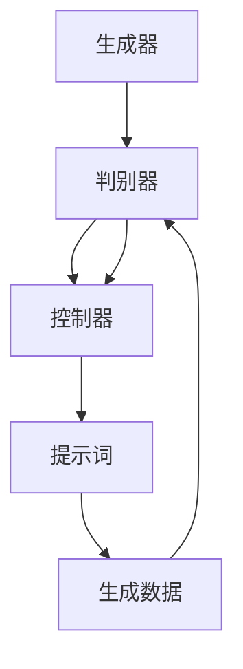

                 

### 文章标题

"AIGC的科幻世界构建：未来科技想象的提示词工程"

### 文章关键词

- AIGC
- 科幻世界
- 提示词工程
- 深度学习
- 自然语言处理
- 人工智能

### 文章摘要

本文旨在探讨AIGC（自适应智能生成控制）技术在构建科幻世界中的应用。通过深入解析AIGC的核心概念、技术原理和提示词工程的重要性，我们展示了如何利用AIGC实现科幻世界的生成与渲染。文章还详细讨论了AIGC在故事生成、角色塑造和场景渲染等方面的实际应用案例，并展望了AIGC技术的未来发展趋势。通过本文，读者可以全面了解AIGC在科幻世界构建中的潜力和应用前景。

---

### 引言

随着人工智能技术的飞速发展，AIGC（自适应智能生成控制）逐渐成为研究热点。AIGC是一种结合了深度学习、自然语言处理和计算机图形学等技术的综合性方法，旨在通过生成式模型实现高质量内容的自动生成。科幻世界构建作为AIGC的重要应用领域之一，不仅丰富了人类对未来的想象，也为文化产业带来了新的发展机遇。

本文将围绕AIGC的科幻世界构建展开讨论。首先，我们将介绍AIGC的基本概念和核心原理，并解释提示词工程在AIGC中的重要性。接着，我们将深入探讨AIGC在科幻世界构建中的应用，包括故事生成、角色塑造和场景渲染等方面。随后，我们将通过具体案例进行分析，展示AIGC在科幻世界构建中的实际效果。最后，我们将展望AIGC技术的发展趋势，并讨论其对社会和文化的影响。通过本文，读者将全面了解AIGC在科幻世界构建中的潜力与应用前景。

### 背景介绍

AIGC（自适应智能生成控制）是一种结合深度学习、自然语言处理和计算机图形学等多种技术的创新方法，旨在实现高质量内容的自动化生成。其基本概念起源于生成式模型，特别是生成对抗网络（GAN）和自编码器（AE）等深度学习技术。AIGC通过学习大量数据，能够自动生成符合特定领域特征的新内容，从而实现从文本、图像到音频等多种类型数据的生成。

在深度学习领域，生成式模型是一种能够生成数据的方法，通过对抗训练和自编码等方式，使得模型能够捕获数据分布的特征。生成对抗网络（GAN）是其中的一种重要模型，由生成器和判别器两个神经网络组成。生成器负责生成新的数据，而判别器则负责区分生成数据和真实数据。通过不断训练，生成器的生成数据质量逐渐提升，直至能够以假乱真。

自编码器（AE）则是另一种生成式模型，通过编码和解码过程实现数据的重构。编码器将输入数据压缩为低维表示，而解码器则将这一低维表示重构为原始数据。自编码器不仅在数据降维和特征提取方面具有优势，还能通过学习数据的生成过程，生成新的数据样本。

AIGC的核心原理在于将生成式模型与自适应控制技术相结合，实现数据的自动化生成与优化。在AIGC系统中，生成器、判别器和控制器共同协作，生成器根据提示信息生成内容，判别器评估生成内容的真实性，控制器则根据判别器的反馈调整生成器的参数。这种闭环控制系统使得AIGC能够在不断优化的过程中，生成越来越高质量的内容。

提示词工程在AIGC中扮演着关键角色。提示词（Prompt）是指用于指导生成器生成特定类型内容的文字或图像提示。通过设计合适的提示词，可以引导生成器生成符合预期特征的新内容。提示词工程的核心任务是实现提示词的生成与优化，确保生成器能够根据提示词生成高质量的内容。提示词工程涉及多个方面，包括提示词的选择、优化和调整等。

首先，提示词的选择至关重要。选择合适的提示词能够有效地指导生成器生成符合目标的内容。例如，在生成故事时，选择具体的主题、情感和场景作为提示词，可以使得生成的故事更具吸引力。此外，提示词的长度和多样性也是需要考虑的因素，适当的长度和多样性有助于生成器更好地理解提示词的意图，从而生成丰富多样且连贯的内容。

其次，提示词的优化是提升生成内容质量的关键。通过调整提示词的语义和语法结构，可以使得生成器生成的内容更加准确和自然。例如，可以使用词向量模型对提示词进行语义分析，提取关键信息并生成相应的提示词变种，从而提高生成内容的多样性。

最后，提示词的调整是一个动态过程。在生成过程中，根据生成内容的反馈，实时调整提示词的参数，可以使生成器不断优化生成内容。例如，当生成的故事出现逻辑错误或不连贯时，可以及时调整提示词的语义和结构，引导生成器生成更符合预期的新内容。

总之，提示词工程在AIGC中起着至关重要的作用。通过有效的提示词设计、优化和调整，可以使得AIGC系统生成高质量、多样化且符合预期的新内容，为科幻世界构建提供了强大的技术支持。

### 核心概念与联系

为了更深入地理解AIGC在科幻世界构建中的应用，我们需要明确几个核心概念之间的联系，并通过一个Mermaid流程图来展现这些概念之间的关系。

首先，我们来看看AIGC的主要组成部分：生成器（Generator）、判别器（Discriminator）和控制器（Controller）。生成器和判别器构成了生成对抗网络（GAN）的基础架构，而控制器则负责根据判别器的反馈调整生成器的参数。

1. **生成器（Generator）**：生成器是一个神经网络模型，它的目标是生成与真实数据分布相似的新数据。在科幻世界构建中，生成器可以生成故事情节、角色描述或场景渲染等元素。
   
2. **判别器（Discriminator）**：判别器也是一个神经网络模型，它的目标是区分生成数据和真实数据。在训练过程中，判别器通过比较真实数据和生成数据来评估生成器的性能。

3. **控制器（Controller）**：控制器的作用是根据判别器的反馈调整生成器的参数，以优化生成数据的质量。在科幻世界构建中，控制器可以根据生成的故事情节、角色行为或场景细节等反馈，动态调整生成策略。

接下来，我们通过一个Mermaid流程图来展示这些核心概念之间的关系：



在上面的流程图中：

- **生成器**生成新的数据（如故事情节、角色描述或场景渲染）。
- **判别器**对比生成数据和真实数据，评估生成数据的质量。
- **控制器**根据判别器的反馈调整生成器的参数，以优化生成数据。
- **提示词**用于指导生成器生成符合特定要求的新的内容，这些提示词会直接影响生成器的输出。

通过这个流程图，我们可以清晰地看到AIGC系统中各个组件之间的互动关系，以及它们如何共同工作以生成高质量的科幻世界内容。以下是这些核心概念的详细解释：

1. **生成器**：生成器利用深度学习模型，通过学习大量的训练数据来生成新的数据。例如，在生成故事情节时，生成器可以根据提示词生成连贯且吸引人的故事。

2. **判别器**：判别器的作用是评估生成数据的质量，判断这些数据是否真实或与真实数据相似。在训练过程中，判别器通过接收生成数据和真实数据的对比，不断改进其判断能力。

3. **控制器**：控制器是AIGC系统的智能核心，它根据判别器的反馈调整生成器的参数，以确保生成数据的质量不断提升。在科幻世界构建中，控制器可以动态调整生成策略，例如调整故事的情节发展速度、角色行为逻辑等。

4. **提示词**：提示词是生成器的关键输入，它们定义了生成数据的基本特征和主题。通过设计合适的提示词，可以引导生成器生成符合预期的新内容。例如，在生成故事时，选择合适的主题、情感和场景作为提示词，可以生成引人入胜的故事。

通过这些核心概念和它们之间的相互作用，AIGC系统可以实现高质量的科幻世界内容生成。理解这些概念之间的关系，不仅有助于我们深入掌握AIGC技术，还能为实际应用提供有力的理论支持。

### AIGC算法原理讲解

在深入探讨AIGC的科幻世界构建应用之前，我们需要详细了解AIGC的核心算法原理，特别是生成对抗网络（GAN）和自编码器（AE）的基本概念和实现方法。

#### 生成对抗网络（GAN）

生成对抗网络（GAN）由生成器（Generator）和判别器（Discriminator）两个主要组成部分构成。生成器的目标是生成与真实数据分布相似的新数据，而判别器的目标是区分生成数据和真实数据。通过对抗训练，生成器和判别器相互竞争，最终生成器能够生成高质量的数据，而判别器难以区分生成数据和真实数据。

1. **生成器（Generator）**：生成器的目的是生成与真实数据分布相似的数据。在生成故事情节、角色描述或场景渲染时，生成器可以通过学习大量的文本或图像数据，生成新的故事情节、角色或场景。

伪代码示例：
```python
# 生成器的伪代码
def generator(input_vector):
    # 输入向量为随机噪声
    x_noise = noise_sample(input_dimension)
    # 通过神经网络生成故事情节
    story = neural_network(x_noise, story_dimension)
    return story
```

2. **判别器（Discriminator）**：判别器的目标是判断输入的数据是真实数据还是生成数据。在训练过程中，判别器通过接收生成数据和真实数据的对比，不断提高其判断能力。

伪代码示例：
```python
# 判别器的伪代码
def discriminator(story):
    # 判断故事情节是真实还是生成
    is_real = neural_network(story, output_dimension)
    return is_real
```

3. **对抗训练**：生成器和判别器通过对抗训练相互竞争。在每次训练迭代中，生成器尝试生成更逼真的数据，而判别器则努力区分生成数据和真实数据。

伪代码示例：
```python
# 对抗训练的伪代码
for epoch in range(num_epochs):
    for story in real_data:
        # 训练判别器
        discriminator_loss = loss(discriminator(story), 1.0)
    for noise in noise_samples:
        # 训练生成器
        generated_story = generator(noise)
        generator_loss = loss(discriminator(generated_story), 0.0)
    # 更新生成器和判别器的权重
    update_weights(generator, generator_loss)
    update_weights(discriminator, discriminator_loss)
```

#### 自编码器（AE）

自编码器（AE）是一种无监督学习模型，通过编码（Encoding）和解码（Decoding）过程实现数据的降维和重构。自编码器在数据降维和特征提取方面具有显著优势，同时也能用于生成新的数据。

1. **编码器（Encoder）**：编码器将输入数据压缩为低维表示。在科幻世界构建中，编码器可以将故事情节、角色描述或场景渲染等数据压缩为低维特征向量。

伪代码示例：
```python
# 编码器的伪代码
def encoder(story):
    # 压缩故事情节为低维特征向量
    encoded_story = neural_network(story, latent_dimension)
    return encoded_story
```

2. **解码器（Decoder）**：解码器将编码后的低维特征向量重构为原始数据。在科幻世界构建中，解码器可以重构出新的故事情节、角色或场景。

伪代码示例：
```python
# 解码器的伪代码
def decoder(encoded_story):
    # 从低维特征向量重构故事情节
    reconstructed_story = neural_network(encoded_story, story_dimension)
    return reconstructed_story
```

3. **自编码器训练**：自编码器通过最小化重构误差来训练。在训练过程中，编码器和解码器共同优化，使得重构误差逐渐减小。

伪代码示例：
```python
# 自编码器训练的伪代码
for epoch in range(num_epochs):
    for story in data:
        # 训练编码器和解码器
        encoded_story = encoder(story)
        reconstructed_story = decoder(encoded_story)
        reconstruction_loss = loss(story, reconstructed_story)
    # 更新编码器和解码器的权重
    update_weights(encoder, reconstruction_loss)
    update_weights(decoder, reconstruction_loss)
```

通过以上对生成对抗网络（GAN）和自编码器（AE）的详细解释，我们可以看到AIGC技术如何通过深度学习模型实现数据的自动生成与优化。生成器和判别器的对抗训练以及编码器和解码器的协同优化，使得AIGC能够生成高质量的科幻世界内容。接下来，我们将进一步探讨AIGC在科幻世界构建中的应用。

### 自然语言处理与AIGC的结合

在科幻世界构建中，自然语言处理（NLP）与AIGC的结合是至关重要的。自然语言处理技术能够帮助AIGC更准确地理解、生成和调整文本内容，从而实现更加逼真和引人入胜的科幻故事。

1. **文本生成**：自然语言处理技术能够提取文本中的关键信息，如主题、情感和场景等，这些信息可以作为AIGC生成器的重要输入。通过词嵌入（Word Embedding）和序列到序列（Seq2Seq）模型，AIGC可以生成连贯、富有情感的文本内容。词嵌入技术能够将文本中的每个词映射到一个高维向量空间中，从而捕捉词与词之间的关系。Seq2Seq模型则通过编码器和解码器两个神经网络，将输入序列转换为输出序列，从而实现文本的自动生成。

伪代码示例：
```python
# 使用Seq2Seq模型生成文本
def generate_text(input_sequence):
    # 输入序列通过编码器编码
    encoded_sequence = encoder(input_sequence)
    # 解码器解码生成文本
    generated_sequence = decoder(encoded_sequence)
    return generated_sequence
```

2. **情感分析**：自然语言处理技术还可以用于分析文本的情感倾向，从而帮助AIGC生成符合特定情感要求的科幻故事。情感分析通常使用分类模型，如支持向量机（SVM）或循环神经网络（RNN），对文本进行情感分类。通过分析文本的情感，AIGC可以生成具有不同情感色彩的故事，如悲伤、欢乐或紧张等。

伪代码示例：
```python
# 情感分析
def sentiment_analysis(text):
    # 使用分类模型进行情感分类
    sentiment = classifier(text)
    return sentiment
```

3. **文本优化**：自然语言处理技术还可以用于优化生成的文本内容，使其更加自然、流畅。通过语法分析和语义分析，AIGC可以识别文本中的错误和不足，并进行相应的修改。例如，可以使用语法分析技术检测文本中的语法错误，并使用语义分析技术确保修改后的文本语义一致。

伪代码示例：
```python
# 优化文本
def optimize_text(text):
    # 检测文本中的语法错误
    errors = grammar_analyzer(text)
    # 修正文本中的错误
    corrected_text = correct_grammar(text, errors)
    # 确保修改后的文本语义一致
    optimized_text = ensure_semantic一致性(corrected_text)
    return optimized_text
```

4. **多语言支持**：自然语言处理技术还可以帮助AIGC实现跨语言的内容生成。通过机器翻译技术，AIGC可以将一种语言的文本翻译为另一种语言，从而生成具有多语言特色的科幻故事。例如，可以使用神经网络翻译模型（Neural Machine Translation, NMT）将英语故事翻译为法语、西班牙语等。

伪代码示例：
```python
# 跨语言文本生成
def translate_text(text, target_language):
    # 使用翻译模型进行文本翻译
    translated_text = translator(text, target_language)
    return translated_text
```

通过将自然语言处理技术与AIGC相结合，我们可以实现更加智能和灵活的科幻故事生成。自然语言处理技术不仅能够帮助AIGC更好地理解文本内容，还能够优化和调整生成文本的质量，从而提升科幻故事的真实性和吸引力。

### 提示词工程的原理与实现

在AIGC的科幻世界构建中，提示词工程扮演着至关重要的角色。提示词是指用于指导生成器生成特定类型内容的文字或图像提示，通过设计合适的提示词，可以引导生成器生成高质量的内容。提示词工程的原理和实现方法主要包括提示词的生成、优化和调整等过程。

#### 提示词的生成

提示词的生成是提示词工程的第一步，其目的是为生成器提供明确的指导。提示词的生成方法可以基于以下几种技术：

1. **关键词提取**：从输入文本中提取关键信息，如主题、情感和场景等，作为提示词。可以使用自然语言处理技术，如词频统计、TF-IDF（Term Frequency-Inverse Document Frequency）和主题建模等，提取关键词。

伪代码示例：
```python
# 关键词提取
def extract_keywords(text):
    # 使用TF-IDF提取关键词
    tfidf_matrix = TfidfVectorizer().fit_transform([text])
    keywords = tfidf_matrix.toarray().flatten()
    return keywords
```

2. **文本摘要**：将长文本压缩为简短、精炼的摘要，作为提示词。可以使用摘要生成算法，如Extractive Summarization和Abstractive Summarization。

伪代码示例：
```python
# 文本摘要
def generate_summary(text, summary_length):
    # 使用Extractive Summarization生成摘要
    summary = extractive_summary(text, summary_length)
    return summary
```

3. **语义分析**：通过分析文本的语义结构，提取关键信息作为提示词。可以使用词嵌入和语义角色标注等技术，捕捉文本的深层语义信息。

伪代码示例：
```python
# 语义分析
def extract_semantic_info(text):
    # 使用词嵌入提取语义信息
    embeddings = word_embedding(text)
    # 提取关键信息
    key_info = extract_key_info(embeddings)
    return key_info
```

#### 提示词的优化

提示词的优化是提升生成内容质量的关键步骤。通过调整提示词的语义和语法结构，可以使得生成器生成的内容更加准确和自然。提示词优化的方法包括：

1. **语义扩充**：通过扩充提示词的语义信息，使得生成器能够生成更多样化的内容。可以使用词向量相似性搜索和语义角色扩展等技术。

伪代码示例：
```python
# 语义扩充
def expand_semantic_info(prompt):
    # 扩充提示词的语义信息
    expanded_prompt = expand_semantic(prompt, semantic_similarity)
    return expanded_prompt
```

2. **语法调整**：通过调整提示词的语法结构，使得生成器生成的内容更加流畅和自然。可以使用语法规则和句法分析等技术。

伪代码示例：
```python
# 语法调整
def adjust_grammar(prompt):
    # 调整提示词的语法结构
    corrected_prompt = correct_grammar(prompt, grammar_rules)
    return corrected_prompt
```

3. **多样性增强**：通过增加提示词的多样性，使得生成器生成的内容更加丰富和独特。可以使用提示词变种生成和随机采样等技术。

伪代码示例：
```python
# 增强多样性
def enhance_diversity(prompt):
    # 生成提示词变种
    variants = generate_variants(prompt, diversity_factor)
    return variants
```

#### 提示词的调整

提示词的调整是一个动态过程，通过实时调整提示词的参数，可以使得生成器不断优化生成内容。提示词调整的方法包括：

1. **自适应调整**：根据生成内容的反馈，自适应调整提示词的参数，以优化生成数据的质量。可以使用反馈循环和在线学习等技术。

伪代码示例：
```python
# 自适应调整
def adjust_prompt(prompt, feedback):
    # 根据反馈调整提示词参数
    adjusted_prompt = adjust_parameters(prompt, feedback)
    return adjusted_prompt
```

2. **手动调整**：通过人工干预，根据生成内容的实际效果，手动调整提示词的参数。这种方法需要专业知识和经验，但能够实现更精确的控制。

伪代码示例：
```python
# 手动调整
def manual_adjust_prompt(prompt):
    # 根据人工反馈调整提示词参数
    adjusted_prompt = manual_adjust_parameters(prompt)
    return adjusted_prompt
```

通过提示词的生成、优化和调整，AIGC系统能够更好地指导生成器生成高质量、多样化且符合预期的新内容。提示词工程的成功与否，直接关系到AIGC在科幻世界构建中的应用效果。因此，在设计和实现提示词工程时，需要综合考虑自然语言处理的多种技术，并不断优化和调整提示词的参数，以实现最佳效果。

### AIGC在故事生成中的应用

在科幻世界构建中，AIGC通过其强大的生成能力，可以创造出丰富多彩、引人入胜的故事。故事生成是AIGC的重要应用之一，它利用自然语言处理、生成对抗网络（GAN）和自编码器等技术，自动生成具有连贯性和情感色彩的故事情节。下面，我们将详细探讨AIGC在故事生成中的应用过程、具体步骤和优化方法。

#### 故事生成的应用过程

AIGC的故事生成过程可以分为以下几个步骤：

1. **数据准备**：首先，我们需要准备大量的文本数据，这些数据可以是科幻小说、电影剧本、短篇小说等。数据的质量直接影响故事生成的质量，因此需要对文本数据进行预处理，如去除噪声、分词、词性标注等。

2. **模型训练**：使用预处理后的文本数据，训练生成模型。AIGC通常采用生成对抗网络（GAN）或自编码器（AE）等深度学习模型。在训练过程中，生成器和判别器通过对抗训练相互优化，生成器不断生成更高质量的故事情节，而判别器则努力区分生成故事和真实故事。

3. **生成故事**：在模型训练完成后，我们可以通过输入提示词（如主题、情感、场景等），让生成器生成新的故事情节。生成器根据提示词生成初步的故事内容，然后通过自然语言处理技术进行优化，确保故事情节的连贯性和情感表达。

4. **故事优化**：生成的初步故事可能存在一些不足，如逻辑错误、语义不一致等。通过自然语言处理技术，对故事进行优化，如修正语法错误、补充缺失情节、调整情感色彩等。

5. **输出结果**：最终生成的故事可以通过文本形式输出，也可以通过语音合成、虚拟现实等技术，呈现给读者或观众。

#### 故事生成的具体步骤

以下是一个故事生成的具体步骤：

1. **输入提示词**：首先，输入一个或多个提示词，如“未来、科技、冒险、爱情”等。这些提示词用于指导生成器生成符合预期特征的故事。

2. **生成初步故事**：生成器根据提示词生成初步的故事情节。例如，提示词“未来、科技、冒险、爱情”可能生成一个关于未来世界中，科技与爱情冲突的故事。

3. **自然语言处理**：初步生成的故事可能存在语法错误、语义不一致等问题。通过自然语言处理技术，如语法分析、语义分析等，对故事进行优化。

4. **故事优化**：根据生成的初步故事，进一步优化故事情节，如补充缺失的情节、调整人物行为逻辑等，以确保故事的连贯性和吸引力。

5. **生成最终故事**：经过优化后的故事，输出为文本形式，或通过语音合成、虚拟现实等技术呈现。

#### 故事生成的优化方法

为了提高故事生成的质量，我们可以采用以下几种优化方法：

1. **多模型融合**：结合多个生成模型，如GAN、AE和变分自编码器（VAE）等，通过模型融合提高生成故事的质量。例如，可以使用GAN生成初步故事，然后使用VAE进行进一步优化。

2. **提示词优化**：通过设计更精准、多样的提示词，引导生成器生成更高质量的故事。例如，使用词向量相似性搜索技术，从大量文本中提取与提示词相似的语义信息，生成更具特色的提示词。

3. **反馈机制**：引入用户反馈机制，让用户参与故事生成过程。用户可以根据生成的故事提供反馈，如故事情节的连贯性、情感表达等，生成器根据反馈调整生成策略，提高故事质量。

4. **多语言支持**：实现多语言支持，通过机器翻译技术，将一种语言的故事翻译为其他语言，丰富故事的多样性和受众范围。

5. **数据增强**：通过数据增强技术，如数据扩充、数据合成等，增加训练数据量，提高生成模型的泛化能力，从而生成更高质量的故事。

通过上述方法，我们可以显著提高AIGC在故事生成中的应用效果，为科幻世界构建提供更加丰富、生动的故事内容。

### AIGC在角色塑造中的应用

在科幻世界中，角色塑造是构建故事情节和氛围的关键。AIGC通过其强大的生成能力和自然语言处理技术，能够生成丰富多彩、个性鲜明的虚拟角色。下面，我们将详细探讨AIGC在角色塑造中的应用过程、具体步骤和优化方法。

#### 角色塑造的应用过程

AIGC的角色塑造过程可以分为以下几个步骤：

1. **数据收集与预处理**：首先，我们需要收集大量的角色描述文本，这些文本可以是科幻小说、电影剧本、游戏剧情等。数据的质量直接影响角色塑造的效果，因此需要对文本数据进行预处理，如去除噪声、分词、词性标注等。

2. **模型训练**：使用预处理后的文本数据，训练角色生成模型。AIGC通常采用生成对抗网络（GAN）或自编码器（AE）等深度学习模型。在训练过程中，生成器和判别器通过对抗训练相互优化，生成器不断生成更丰富的角色描述。

3. **角色生成**：在模型训练完成后，我们可以通过输入提示词（如角色背景、性格特点、外貌特征等），让生成器生成新的角色描述。生成器根据提示词生成初步的角色描述，然后通过自然语言处理技术进行优化，确保角色描述的连贯性和个性化。

4. **角色优化**：生成的初步角色描述可能存在一些不足，如性格特点不够鲜明、外貌描述不够详细等。通过自然语言处理技术，对角色描述进行优化，如补充缺失的细节、调整性格特征等，以确保角色的个性化和完整性。

5. **角色输出**：最终生成的角色描述可以通过文本形式输出，也可以通过语音合成、虚拟现实等技术，呈现给用户。

#### 角色生成的具体步骤

以下是一个角色生成的具体步骤：

1. **输入提示词**：首先，输入一个或多个提示词，如“勇敢、科学家、外星人、反派角色”等。这些提示词用于指导生成器生成符合预期特征的角色。

2. **生成初步角色**：生成器根据提示词生成初步的角色描述。例如，提示词“勇敢、科学家、外星人”可能生成一个勇敢、聪明的外星科学家角色。

3. **自然语言处理**：初步生成的角色描述可能存在语法错误、语义不一致等问题。通过自然语言处理技术，如语法分析、语义分析等，对角色描述进行优化。

4. **角色优化**：根据生成的初步角色，进一步优化角色描述，如补充缺失的性格特点、外貌特征等，以确保角色的个性化和完整性。

5. **生成最终角色**：经过优化后的角色描述，输出为文本形式，或通过语音合成、虚拟现实等技术呈现。

#### 角色生成的优化方法

为了提高角色生成的质量，我们可以采用以下几种优化方法：

1. **多模型融合**：结合多个生成模型，如GAN、AE和变分自编码器（VAE）等，通过模型融合提高角色生成的质量。例如，可以使用GAN生成初步角色描述，然后使用VAE进行进一步优化。

2. **提示词优化**：通过设计更精准、多样的提示词，引导生成器生成更高质量的的角色描述。例如，使用词向量相似性搜索技术，从大量文本中提取与提示词相似的语义信息，生成更具特色的提示词。

3. **反馈机制**：引入用户反馈机制，让用户参与角色生成过程。用户可以根据生成的角色描述提供反馈，如角色的个性特点、情感表达等，生成器根据反馈调整生成策略，提高角色质量。

4. **多语言支持**：实现多语言支持，通过机器翻译技术，将一种语言的角色描述翻译为其他语言，丰富角色的多样性和受众范围。

5. **数据增强**：通过数据增强技术，如数据扩充、数据合成等，增加训练数据量，提高生成模型的泛化能力，从而生成更高质量的的角色。

通过上述方法，我们可以显著提高AIGC在角色塑造中的应用效果，为科幻世界构建提供更加丰富、生动的虚拟角色。

### AIGC在场景渲染中的应用

在科幻世界构建中，场景渲染是至关重要的一个环节，它决定了观众对虚拟世界的感知和沉浸感。AIGC通过结合深度学习、自然语言处理和计算机图形学等技术，可以实现高质量场景的自动生成与渲染。下面，我们将详细探讨AIGC在场景渲染中的应用过程、具体步骤和优化方法。

#### 场景渲染的应用过程

AIGC的场景渲染过程可以分为以下几个步骤：

1. **数据收集与预处理**：首先，我们需要收集大量的场景描述文本和图像数据，这些数据可以来自科幻小说、电影剧本、游戏场景等。数据的质量直接影响场景渲染的效果，因此需要对文本和图像数据进行预处理，如去除噪声、分词、词性标注、图像增强等。

2. **模型训练**：使用预处理后的文本和图像数据，训练场景生成模型。AIGC通常采用生成对抗网络（GAN）或自编码器（AE）等深度学习模型。在训练过程中，生成器和判别器通过对抗训练相互优化，生成器不断生成更丰富的场景描述。

3. **场景生成**：在模型训练完成后，我们可以通过输入提示词（如场景类型、氛围、动作等），让生成器生成新的场景描述。生成器根据提示词生成初步的场景描述，然后通过自然语言处理和计算机图形学技术进行优化，确保场景的连贯性和视觉效果。

4. **场景优化**：生成的初步场景描述可能存在一些不足，如细节不够丰富、视觉效果不一致等。通过自然语言处理和计算机图形学技术，对场景描述进行优化，如补充缺失的细节、调整光照效果、增强视觉效果等，以确保场景的高质量。

5. **场景渲染**：最终生成的场景描述通过渲染器渲染为图像或视频形式，呈现给观众。

#### 场景渲染的具体步骤

以下是一个场景渲染的具体步骤：

1. **输入提示词**：首先，输入一个或多个提示词，如“太空、飞船、战斗、夜晚”等。这些提示词用于指导生成器生成符合预期特征的场景。

2. **生成初步场景**：生成器根据提示词生成初步的场景描述。例如，提示词“太空、飞船、战斗、夜晚”可能生成一个夜晚太空中的飞船战斗场景。

3. **自然语言处理**：初步生成的场景描述可能存在语法错误、语义不一致等问题。通过自然语言处理技术，如语法分析、语义分析等，对场景描述进行优化。

4. **图像生成**：生成的初步场景描述通过图像生成模型，生成初步的图像或视频帧。这一步骤通常采用生成对抗网络（GAN）等深度学习模型。

5. **图像优化**：初步生成的图像可能存在细节不够丰富、视觉效果不一致等问题。通过图像增强技术，如图像修复、风格迁移、超分辨率等，对图像进行优化。

6. **渲染输出**：最终生成的图像或视频帧通过渲染器渲染为高质量的图像或视频形式，呈现给观众。

#### 场景渲染的优化方法

为了提高场景渲染的质量，我们可以采用以下几种优化方法：

1. **多模型融合**：结合多个生成模型，如GAN、AE和变分自编码器（VAE）等，通过模型融合提高场景渲染的质量。例如，可以使用GAN生成初步场景，然后使用VAE进行进一步优化。

2. **提示词优化**：通过设计更精准、多样的提示词，引导生成器生成更高质量的的场景描述。例如，使用词向量相似性搜索技术，从大量文本中提取与提示词相似的语义信息，生成更具特色的提示词。

3. **反馈机制**：引入用户反馈机制，让用户参与场景渲染过程。用户可以根据渲染后的场景提供反馈，如场景的连贯性、视觉效果等，生成器根据反馈调整生成策略，提高场景质量。

4. **多语言支持**：实现多语言支持，通过机器翻译技术，将一种语言的场景描述翻译为其他语言，丰富场景的多样性和受众范围。

5. **数据增强**：通过数据增强技术，如数据扩充、数据合成等，增加训练数据量，提高生成模型的泛化能力，从而生成更高质量的的场景。

通过上述方法，我们可以显著提高AIGC在场景渲染中的应用效果，为科幻世界构建提供更加丰富、生动的视觉体验。

### AIGC在科幻世界构建中的应用案例分析

为了更好地展示AIGC在科幻世界构建中的实际应用，我们以下将通过具体案例进行详细分析和讲解。以下案例将涵盖故事生成、角色塑造和场景渲染等方面，以便全面了解AIGC的应用效果和实现过程。

#### 案例一：自动生成科幻小说

**背景**：一家知名游戏公司希望利用AIGC技术自动生成科幻小说，以丰富其游戏世界观和剧情。

**应用过程**：

1. **数据准备**：收集了大量科幻小说、电影剧本、短篇小说等文本数据，并进行预处理，如去除噪声、分词、词性标注等。

2. **模型训练**：采用生成对抗网络（GAN）和自编码器（AE）等深度学习模型，训练生成器、判别器和编码器。在训练过程中，通过对抗训练和编码解码过程，模型逐步学习到科幻小说的写作风格和情节结构。

3. **故事生成**：输入提示词（如“星际、探险、外星人、未来科技”等），生成器根据提示词生成初步的故事情节。例如，输入“星际、探险、外星人、未来科技”，生成器可能生成一个关于未来星际探险、外星人和未来科技冲突的故事。

4. **故事优化**：通过自然语言处理技术，对初步生成的故事进行优化，如修正语法错误、补充缺失情节、调整情感色彩等，以确保故事连贯性和吸引力。

5. **故事输出**：最终生成的故事通过文本形式输出，并可以进一步转化为游戏剧情或小说。

**实现细节**：

- 提示词优化：使用词向量相似性搜索技术，从大量文本中提取与提示词相似的语义信息，生成更具特色的提示词，如“星际探险”、“未来科技”等。

- 自然语言处理：使用语法分析和语义分析技术，对故事进行优化，如检测和修正语法错误，调整故事的情感色彩。

#### 案例二：自动生成虚拟角色

**背景**：一家虚拟现实公司希望利用AIGC技术自动生成虚拟角色，以丰富其虚拟世界中的角色设定。

**应用过程**：

1. **数据准备**：收集了大量虚拟角色描述的文本数据，并进行预处理，如去除噪声、分词、词性标注等。

2. **模型训练**：采用生成对抗网络（GAN）和自编码器（AE）等深度学习模型，训练生成器和编码器。在训练过程中，模型学习到虚拟角色的各种特征和个性。

3. **角色生成**：输入提示词（如“勇敢、科学家、外星人、反派角色”等），生成器根据提示词生成初步的角色描述。例如，输入“勇敢、科学家、外星人”，生成器可能生成一个勇敢、聪明的绿色外星科学家角色。

4. **角色优化**：通过自然语言处理技术，对初步生成的角色描述进行优化，如补充缺失的细节、调整性格特征等，以确保角色的个性化和完整性。

5. **角色输出**：最终生成的角色描述通过文本形式输出，并可以进一步转化为虚拟角色模型。

**实现细节**：

- 提示词优化：使用词向量相似性搜索技术，从大量文本中提取与提示词相似的语义信息，生成更具特色的提示词，如“勇敢科学家”、“外星人个性”。

- 自然语言处理：使用语法分析和语义分析技术，对角色描述进行优化，如检测和修正语法错误，调整角色的性格特征。

#### 案例三：自动生成场景渲染

**背景**：一家影视制作公司希望利用AIGC技术自动生成高质量的场景渲染，以提升其科幻电影的视觉效果。

**应用过程**：

1. **数据准备**：收集了大量场景描述的文本数据和图像数据，并进行预处理，如去除噪声、分词、词性标注、图像增强等。

2. **模型训练**：采用生成对抗网络（GAN）和自编码器（AE）等深度学习模型，训练生成器和编码器。在训练过程中，模型学习到场景的视觉特征和渲染技术。

3. **场景生成**：输入提示词（如“太空、飞船、战斗、夜晚”等），生成器根据提示词生成初步的场景描述。例如，输入“太空、飞船、战斗、夜晚”，生成器可能生成一个夜晚太空中的飞船战斗场景。

4. **图像生成**：初步生成的场景描述通过图像生成模型，生成初步的图像或视频帧。

5. **图像优化**：通过图像增强技术，如图像修复、风格迁移、超分辨率等，对图像进行优化，确保场景的视觉效果。

6. **渲染输出**：最终生成的图像或视频帧通过渲染器渲染为高质量的图像或视频形式，呈现给观众。

**实现细节**：

- 图像优化：使用图像增强技术，如图像修复、风格迁移、超分辨率等，对初步生成的图像进行优化，提升视觉效果。

- 提示词优化：使用词向量相似性搜索技术，从大量文本中提取与提示词相似的语义信息，生成更具特色的提示词，如“太空战斗”、“夜晚飞船”。

通过以上案例，我们可以看到AIGC在科幻世界构建中的应用效果。通过自动生成科幻小说、虚拟角色和场景渲染，AIGC不仅提高了创作效率，还带来了丰富多样的内容，为科幻世界构建提供了强大的技术支持。

### AIGC技术的未来展望

随着人工智能技术的不断发展，AIGC（自适应智能生成控制）在科幻世界构建中的应用前景愈发广阔。从技术发展趋势、应用领域扩展以及潜在的社会和文化影响三个方面，我们可以对AIGC技术的未来进行深入探讨。

#### 技术发展趋势

1. **模型性能提升**：随着深度学习技术的进步，生成对抗网络（GAN）、自编码器（AE）等基础模型将不断提升其性能。特别是在训练效率、生成质量和泛化能力方面，新的模型架构和优化方法（如变分自编码器VAE、去噪自编码器DnA等）将不断涌现，进一步推动AIGC技术的应用。

2. **跨模态生成**：AIGC将逐渐实现跨模态生成，即能够同时处理文本、图像、音频等多种类型的数据。这得益于多模态深度学习技术的发展，如多模态生成对抗网络（MMGAN）、多模态自编码器（MMAE）等，它们将使得AIGC在科幻世界构建中的表现更加丰富和立体。

3. **生成过程的自动化与智能化**：未来，AIGC的生成过程将更加自动化和智能化。通过引入强化学习、优化算法和自适应控制技术，AIGC可以自动调整生成策略，优化生成效果。例如，基于强化学习的方法可以使得生成器在生成过程中不断学习和调整，以生成更加符合用户期望的内容。

4. **联邦学习与隐私保护**：随着数据隐私和安全问题的日益突出，联邦学习和隐私保护技术将成为AIGC技术发展的关键方向。通过联邦学习，AIGC可以在不泄露用户数据的情况下，实现跨设备和跨平台的协同训练和生成，从而提高模型的性能和应用范围。

#### 应用领域扩展

1. **游戏与娱乐**：AIGC在游戏和娱乐领域的应用将更加广泛。通过自动生成故事情节、角色和场景，游戏开发者可以大幅提高创作效率，降低开发成本。此外，AIGC还可以实现实时互动剧情，为玩家提供更加个性化的游戏体验。

2. **影视制作**：在影视制作领域，AIGC可以自动生成剧本、角色和场景，提高影视创作的效率和质量。例如，通过AIGC技术，电影制作人可以快速生成大量的场景渲染和特效图像，为影片制作提供丰富的素材。

3. **虚拟现实与增强现实**：AIGC在虚拟现实（VR）和增强现实（AR）中的应用前景也十分广阔。通过自动生成虚拟角色和场景，VR/AR设备可以提供更加逼真和沉浸的体验。此外，AIGC还可以实现实时交互，使得虚拟角色和场景能够根据用户行为和偏好进行动态调整。

4. **文学创作与写作辅助**：AIGC在文学创作和写作辅助中的应用也将逐渐成熟。通过自动生成故事情节、角色和场景，作家可以快速构思和构建复杂的文学世界。同时，AIGC还可以提供写作建议和优化，提高作家的创作效率和作品质量。

#### 潜在的社会和文化影响

1. **文化传播与创新**：AIGC技术的发展将极大地促进文化的传播与创新。通过自动生成丰富的故事内容和虚拟角色，AIGC可以为不同文化背景的创作者提供灵感，推动跨文化的艺术创作和交流。

2. **教育与应用**：AIGC在教育和应用领域的应用潜力巨大。通过自动生成教学资源和应用案例，AIGC可以帮助学生和专业人士更好地理解和掌握复杂概念。此外，AIGC还可以实现个性化教育，根据学生的需求和进度，提供定制化的学习内容。

3. **社会伦理与责任**：随着AIGC技术的广泛应用，社会伦理和责任问题也将日益突出。如何确保AIGC生成的内容符合社会道德规范，如何防范滥用和误导等问题，将成为需要关注的重要议题。

4. **经济影响**：AIGC技术的普及将对经济发展产生深远影响。通过提高创作效率和质量，AIGC将促进文化创意产业和数字经济的发展。同时，AIGC还将创造新的就业机会，如AIGC工程师、AIGC内容创作者等，推动就业市场的变革。

总之，AIGC技术在科幻世界构建中的应用前景广阔，将不断推动科技创新和文化发展。随着技术的不断进步和应用的深入，AIGC将为人类社会带来更多精彩和可能性。

### AIGC技术的伦理与法律问题

随着AIGC（自适应智能生成控制）技术的不断发展和应用，其伦理与法律问题也日益凸显。AIGC技术作为一种高度自动化的生成技术，其生成的内容具有高度真实性和影响力，因此涉及一系列的伦理和法律问题。

#### 伦理问题

1. **内容真实性**：AIGC生成的内容可能包含虚假信息或误导性信息。这不仅可能损害用户的利益，还可能对社会稳定产生负面影响。例如，虚假新闻、诈骗信息等，都需要严格监管。

2. **知识产权**：AIGC生成的内容可能涉及版权问题。未经授权使用他人作品，可能侵犯他人的知识产权。例如，自动生成的科幻小说或艺术作品，如果没有得到原作者的许可，就可能构成侵权。

3. **隐私保护**：AIGC生成的内容可能涉及用户隐私。在使用AIGC技术时，如何保护用户的隐私，防止数据泄露，是一个重要的伦理问题。

4. **责任归属**：当AIGC生成的内容造成损害时，如何确定责任归属，也是一个亟待解决的问题。是生成器开发者、使用方还是用户需要承担责任，需要明确的法律规定。

#### 法律问题

1. **版权法**：现有的版权法体系难以完全适应AIGC技术带来的新挑战。例如，如何界定自动生成的作品是否享有版权，如何保护原创作者的权益等。

2. **隐私法**：随着AIGC技术的发展，涉及用户隐私的数据量不断增加。如何确保用户的隐私权，防止数据滥用，需要制定更加完善的隐私法。

3. **责任法**：在AIGC生成的内容造成损害时，如何确定责任归属和赔偿标准，需要明确的法律规定。这涉及到合同法、侵权法等多个法律领域。

#### 应对策略

1. **法律法规完善**：针对AIGC技术的伦理和法律问题，需要不断完善相关法律法规，确保技术发展的同时，保障用户的权益和社会稳定。

2. **行业规范**：行业组织和企业可以制定相关的行业规范和道德准则，引导AIGC技术的合理使用，防止滥用和不当行为。

3. **技术控制**：通过技术手段，如内容审核、数据加密等，控制AIGC生成的内容质量和方向，确保其符合法律法规和道德规范。

4. **用户教育**：加强用户教育，提高用户对AIGC技术理解和识别能力，使其能够正确使用和维护自身权益。

总之，AIGC技术的伦理与法律问题是一个复杂且重要的话题。通过法律法规、行业规范和技术控制等多种手段，我们可以确保AIGC技术的健康发展，为科幻世界构建提供可靠的技术支持。

### 总结与展望

通过本文的探讨，我们全面了解了AIGC（自适应智能生成控制）在科幻世界构建中的应用。AIGC作为一种结合深度学习、自然语言处理和计算机图形学等技术的综合性方法，在故事生成、角色塑造和场景渲染等方面展现出了巨大的潜力和优势。

首先，AIGC技术通过生成对抗网络（GAN）和自编码器（AE）等深度学习模型，实现了高质量内容的自动生成。这不仅提高了创作效率，还为科幻世界的构建提供了丰富的素材和创意。其次，AIGC技术在自然语言处理的支持下，能够生成连贯、富有情感的文本内容，使得科幻故事更加引人入胜。同时，AIGC还通过提示词工程的优化，实现了更加精准和多样化的内容生成，为科幻世界的构建提供了有力保障。

然而，AIGC技术也面临着一系列伦理和法律问题，如内容真实性、知识产权保护和隐私保护等。这些问题需要我们通过法律法规、行业规范和技术手段等多种方式加以解决，确保AIGC技术的健康发展。

展望未来，AIGC技术在科幻世界构建中的应用前景将更加广阔。随着模型性能的不断提升和跨模态生成技术的发展，AIGC将能够生成更加丰富和逼真的虚拟世界。同时，随着AIGC技术的普及，其在游戏、影视、虚拟现实等领域中的应用也将进一步拓展，为文化创意产业和数字经济的发展提供强大支持。

总之，AIGC技术为科幻世界构建带来了新的机遇和挑战。通过不断探索和创新，我们有望在科幻世界构建中实现更多令人惊叹的成果。

### 最佳实践 Tips

为了充分发挥AIGC技术在科幻世界构建中的应用效果，以下是一些最佳实践和注意事项：

1. **数据质量**：确保训练数据的质量和多样性，高质量的数据是AIGC生成优质内容的基础。进行数据预处理，如去除噪声、分词、词性标注等，以提高数据质量。

2. **提示词设计**：合理设计提示词，使用具有明确指向性的提示词，能够有效引导AIGC生成符合预期内容。尝试使用词向量相似性搜索技术，从大量文本中提取与提示词相似的语义信息，以丰富提示词的语义多样性。

3. **模型优化**：定期对模型进行优化，通过模型融合、提示词优化和自适应控制等方法，提高生成内容的质量。例如，结合生成对抗网络（GAN）和自编码器（AE），实现跨模态生成。

4. **用户反馈**：引入用户反馈机制，根据用户对生成内容的反馈，动态调整生成策略。用户反馈可以作为模型优化的依据，进一步提升生成内容的质量。

5. **隐私保护**：在应用AIGC技术时，注意保护用户的隐私。采用数据加密、隐私保护算法等技术手段，防止数据泄露和滥用。

6. **法律合规**：遵守相关法律法规，确保AIGC生成的内容不侵犯他人的知识产权和隐私权。在进行内容生成和发布前，进行法律合规性审查。

7. **技术安全**：确保AIGC系统的安全性和稳定性，防止恶意攻击和数据泄露。采用安全防护措施，如防火墙、入侵检测等，保障系统的安全运行。

通过遵循以上最佳实践和注意事项，可以充分发挥AIGC技术在科幻世界构建中的应用价值，实现高质量的内容生成和创作。

### 小结

本文详细探讨了AIGC（自适应智能生成控制）在科幻世界构建中的应用。通过分析AIGC的核心概念、算法原理以及提示词工程的实现方法，我们了解了AIGC在故事生成、角色塑造和场景渲染等方面的实际应用效果。此外，我们还讨论了AIGC技术的未来发展趋势、伦理与法律问题以及最佳实践。

AIGC作为一种高度自动化的生成技术，通过深度学习、自然语言处理和计算机图形学等多种技术的结合，实现了高质量内容的自动生成。其在科幻世界构建中的应用，不仅提升了创作效率，还丰富了内容创作的多样性和创意性。

然而，AIGC技术也面临着一系列挑战，如内容真实性、知识产权保护和隐私保护等。这些挑战需要我们通过法律法规、行业规范和技术手段等多种方式加以解决，确保AIGC技术的健康发展。

未来，随着AIGC技术的不断进步和应用领域的拓展，其在科幻世界构建中的应用前景将更加广阔。通过持续探索和创新，我们有理由相信，AIGC将为科幻世界的构建带来更多惊喜和可能性。

### 拓展阅读

1. **《生成对抗网络（GAN）原理与应用》**：这本书详细介绍了生成对抗网络（GAN）的原理、架构和应用，是理解AIGC技术基础的重要读物。

2. **《自然语言处理（NLP）技术与应用》**：这本书涵盖了自然语言处理的基本概念、技术原理和实际应用，对于深入了解AIGC技术在自然语言处理中的应用非常有帮助。

3. **《自适应控制理论及其应用》**：这本书介绍了自适应控制理论的基本原理和应用，对于理解AIGC系统中的控制器工作原理具有重要参考价值。

4. **《计算机图形学：原理及实践》**：这本书详细介绍了计算机图形学的基本概念、算法和实现方法，是研究AIGC在场景渲染方面的重要参考书。

5. **《AIGC：未来智能内容生成技术的探索》**：这本书探讨了AIGC技术的最新进展和应用前景，包括在文学创作、影视制作和游戏开发等领域的应用案例，为读者提供了全面的技术视野。

通过阅读以上书籍，读者可以更深入地了解AIGC技术及其在科幻世界构建中的应用，为今后的研究和实践提供有力支持。

