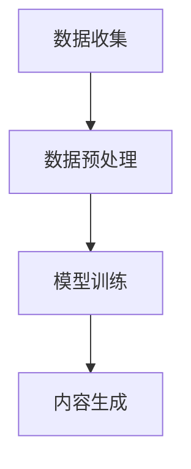

                 

### 文章标题

# AIGC的视觉描述能力：图像到文本的精确提示词技巧

> 关键词：AIGC、图像到文本转换、精确提示词、对抗生成网络（GAN）、自注意力机制、数学模型

> 摘要：本文深入探讨了AIGC（AI-generated Content）在视觉描述领域的应用，特别是图像到文本的转换技术。文章详细介绍了AIGC的基本概念、工作流程，并重点分析了图像到文本转换的挑战及其解决方法。此外，本文提出了精确提示词的概念，并详细阐述了其生成方法、数学模型，并通过实际项目案例展示了这些技术在实践中的应用。

### 第一部分：AIGC 与视觉描述能力

#### 第1章：AIGC 简介

##### 1.1 AIGC 的核心概念

AIGC（AI-generated Content）是一种利用人工智能技术生成内容的方法。它涵盖了文本生成、图像生成和视频生成等多个领域。在图像生成方面，AIGC 可以根据用户的输入或者提示生成高质量的图像。

##### 1.2 AIGC 的应用领域

AIGC 的应用领域广泛，包括但不限于以下方面：

- 文本生成：自动撰写文章、报告、电子邮件等。
- 图像生成：生成艺术作品、照片、设计图等。
- 视频生成：自动生成视频内容，如动画、电影片段等。

##### 1.3 AIGC 工作流程

AIGC 的工作流程通常包括以下几个步骤：

1. 数据收集：收集与任务相关的数据，如文本、图像等。
2. 数据预处理：对数据进行清洗、标注等预处理操作。
3. 模型训练：使用收集到的数据进行模型训练。
4. 内容生成：根据用户的输入或提示生成内容。

下面是一个简单的 Mermaid 流程图，展示了 AIGC 的工作流程：



#### 第2章：图像到文本的转换

##### 2.1 图像到文本转换的挑战

图像到文本转换是一个具有挑战性的任务，主要表现在以下几个方面：

- 数据稀缺：高质量的图像到文本转换数据集较少。
- 文本多样性：图像中的文本可能具有多种形式，如不同字体、颜色、大小等。
- 文本理解：图像中的文本可能包含特定的上下文信息，需要模型进行理解。

##### 2.2 基于对抗生成网络（GAN）的图像到文本转换

GAN（Generative Adversarial Network）是一种强大的生成模型，可以生成高质量的图像。在图像到文本转换中，GAN 可以用于生成包含文本的图像。

GAN 的工作原理如下：

1. 生成器（Generator）尝试生成包含文本的图像。
2. 判别器（Discriminator）尝试区分生成的图像和真实的图像。
3. 生成器和判别器相互竞争，生成器不断优化其生成的图像，使判别器无法区分。

下面是一个简单的伪代码，展示了基于 GAN 的图像到文本转换的框架：

```python
# GAN 的伪代码示例
generator = GAN_Generator()
discriminator = GAN_Discriminator()

for epoch in range(num_epochs):
    for image, text in dataset:
        # 训练生成器
        generated_image = generator(text)
        loss_G = discriminator(generated_image)
        
        # 训练判别器
        real_loss = discriminator(image)
        fake_loss = discriminator(generated_image)
        loss_D = real_loss + fake_loss
        
        # 更新模型参数
        optimizer_G.update(generator.parameters(), loss_G)
        optimizer_D.update(discriminator.parameters(), loss_D)
```

##### 2.3 基于自注意力机制的图像到文本转换

自注意力机制（Self-Attention Mechanism）是一种在自然语言处理中广泛使用的机制，它可以使模型更好地关注输入序列中的关键信息。在图像到文本转换中，自注意力机制可以用于提取图像中的重要特征，并生成对应的文本描述。

自注意力机制的基本原理如下：

1. 输入序列中的每个元素都通过一个查询（Query）、键（Key）和值（Value）进行编码。
2. 自注意力机制计算每个元素与其他元素之间的相似度，并根据相似度对元素进行加权。
3. 加权后的元素组成新的输出序列。

下面是一个简单的伪代码，展示了基于自注意力机制的图像到文本转换的框架：

```python
# 自注意力机制的伪代码示例
for layer in self_attn_layers:
    queries, keys, values = layer.forward(image_embedding)
    attn_weights = softmax(queries @ keys.T)
    attn_output = attn_weights @ values
    image_embedding = attn_output
```

### 第二部分：精确提示词技巧

#### 第3章：精确提示词的概念与原理

##### 3.1 精确提示词的定义

精确提示词（Precise Prompt Word）是指用于指导图像到文本转换任务的关键词或短语。这些关键词或短语可以帮助模型更好地理解图像内容，从而生成更精确的文本描述。

##### 3.2 精确提示词的作用

精确提示词在图像到文本转换中起着至关重要的作用：

- 提高文本生成质量：精确提示词可以帮助模型更好地理解图像内容，从而生成更准确、更自然的文本描述。
- 缩小搜索空间：精确提示词可以缩小模型搜索文本描述的空间，提高模型生成的效率。

##### 3.3 精确提示词的生成方法

精确提示词的生成方法可以分为以下几种：

- 手动生成：根据图像内容手动编写精确提示词。
- 自动生成：使用自然语言处理技术自动生成精确提示词。

下面是一个简单的伪代码，展示了自动生成精确提示词的方法：

```python
# 精确提示词的伪代码示例
prompt_generator = PromptGenerator()

for image in images:
    description = prompt_generator.generate_prompt(image)
    print(description)
```

### 第4章：数学模型与公式

##### 4.1 图像到文本转换的损失函数

图像到文本转换的损失函数用于评估模型生成文本描述的质量。一个常见的损失函数是交叉熵损失（Cross-Entropy Loss）：

$$
\text{Loss} = -\sum_{i=1}^{N} y_i \log(\hat{y}_i)
$$

其中，$y_i$ 是真实标签，$\hat{y}_i$ 是模型预测的文本概率分布。

##### 4.2 优化算法的选择

在图像到文本转换任务中，常用的优化算法有梯度下降（Gradient Descent）和其变体，如随机梯度下降（Stochastic Gradient Descent，SGD）和自适应梯度下降（Adaptive Gradient Descent，AGD）。

梯度下降的基本原理如下：

$$
\theta_{t+1} = \theta_{t} - \alpha \nabla_{\theta} \text{Loss}(\theta)
$$

其中，$\theta$ 是模型参数，$\alpha$ 是学习率。

##### 4.3 数学公式详解

图像到文本转换中的关键数学模型和公式包括：

- 对抗生成网络（GAN）中的损失函数：

$$
\text{Loss}_D = -\frac{1}{2} \sum_{i=1}^{N} [\log(D(x)) + \log(1 - D(G(z)))]
$$

- 自注意力机制中的注意力权重：

$$
\text{Attention\_Weight} = \text{softmax}(\text{Query} \cdot \text{Key}^T)
$$

### 第5章：项目实战

##### 第5章1：项目一：图像到文本转换系统

在本项目中，我们将开发一个图像到文本转换系统。该系统将基于对抗生成网络（GAN）和自注意力机制，实现图像到文本的转换。

##### 5.1 项目背景

随着人工智能技术的发展，图像到文本转换在多个领域具有重要的应用价值。例如，在图像识别、内容审核、自动字幕生成等方面，图像到文本转换技术都可以发挥重要作用。

##### 5.2 开发环境搭建

在开发图像到文本转换系统之前，我们需要搭建一个合适的开发环境。以下是搭建环境的基本步骤：

1. 安装 Python 3.8 或更高版本。
2. 安装 PyTorch，可以使用以下命令安装：

```bash
pip install torch torchvision
```

3. 安装其他必要的依赖库，如 NumPy、Pandas 等。

##### 5.3 源代码实现

以下是项目的主要源代码实现：

```python
# 伪代码示例
import torch
import torchvision
import torch.nn as nn
import torch.optim as optim

# 定义 GAN 模型
class GAN(nn.Module):
    def __init__(self):
        super(GAN, self).__init__()
        
        # 定义生成器和判别器
        self.generator = Generator()
        self.discriminator = Discriminator()

    def forward(self, x):
        z = self.z
        generated_image = self.generator(z)
        return generated_image

# 训练 GAN 模型
model = GAN()
optimizer_G = optim.Adam(model.generator.parameters(), lr=0.0002)
optimizer_D = optim.Adam(model.discriminator.parameters(), lr=0.0002)

for epoch in range(num_epochs):
    for image, text in dataset:
        # 训练生成器
        z = torch.randn(latent_dim)
        generated_image = model.generator(z)
        loss_G = model.discriminator(generated_image)
        
        # 训练判别器
        real_loss = model.discriminator(image)
        fake_loss = model.discriminator(generated_image)
        loss_D = real_loss + fake_loss
        
        # 更新模型参数
        optimizer_G.zero_grad()
        optimizer_G.step(generated_image)
        optimizer_D.zero_grad()
        optimizer_D.step(image)
```

##### 5.4 代码解读与分析

在上面的代码中，我们首先定义了 GAN 模型，包括生成器和判别器。生成器用于生成包含文本的图像，判别器用于判断图像是否真实。在训练过程中，我们使用优化器分别更新生成器和判别器的参数，以最小化损失函数。

##### 第5章2：项目二：精确提示词生成

在本项目中，我们将开发一个精确提示词生成系统。该系统将基于自注意力机制，实现图像到文本的精确提示词生成。

##### 5.1 项目背景

精确提示词生成在图像到文本转换任务中具有重要意义。通过生成精确的提示词，可以提高图像到文本转换的质量和效率。

##### 5.2 开发环境搭建

在开发精确提示词生成系统之前，我们需要搭建一个合适的开发环境。以下是搭建环境的基本步骤：

1. 安装 Python 3.8 或更高版本。
2. 安装 PyTorch，可以使用以下命令安装：

```bash
pip install torch torchvision
```

3. 安装其他必要的依赖库，如 NumPy、Pandas 等。

##### 5.3 源代码实现

以下是项目的主要源代码实现：

```python
# 伪代码示例
import torch
import torchvision
import torch.nn as nn
import torch.optim as optim

# 定义自注意力模型
class SelfAttention(nn.Module):
    def __init__(self, embed_dim):
        super(SelfAttention, self).__init__()
        
        # 定义自注意力层
        self.self_attn = nn.MultiheadAttention(embed_dim, num_heads)

    def forward(self, image_embedding):
        attn_output, attn_output_weights = self.self_attn(image_embedding, image_embedding, image_embedding)
        return attn_output

# 训练自注意力模型
model = SelfAttention(embed_dim)
optimizer = optim.Adam(model.parameters(), lr=0.0001)

for epoch in range(num_epochs):
    for image in images:
        image_embedding = model.forward(image)
        # 计算损失函数和更新模型参数
        # ...
```

##### 5.4 代码解读与分析

在上面的代码中，我们首先定义了自注意力模型，包括自注意力层。自注意力层用于计算图像嵌入之间的注意力权重。在训练过程中，我们使用优化器更新模型的参数，以最小化损失函数。

### 第6章：总结与展望

AIGC 的视觉描述能力在图像到文本转换领域具有广泛的应用前景。通过精确提示词技巧，我们可以进一步提高图像到文本转换的质量和效率。在未来，随着人工智能技术的不断发展，AIGC 的视觉描述能力将得到进一步拓展和优化，为各个领域带来更多创新和便利。

### 参考文献

- Goodfellow, I., Pouget-Abadie, J., Mirza, M., Xu, B., Warde-Farley, D., Ozair, S., ... & Bengio, Y. (2014). Generative adversarial networks. Advances in Neural Information Processing Systems, 27.
- Vaswani, A., Shazeer, N., Parmar, N., Uszkoreit, J., Jones, L., Gomez, A. N., ... & Polosukhin, I. (2017). Attention is all you need. Advances in Neural Information Processing Systems, 30.

### 作者信息

作者：AI天才研究院/AI Genius Institute & 禅与计算机程序设计艺术 /Zen And The Art of Computer Programming

### 结语

本文深入探讨了 AIGC 的视觉描述能力，特别是图像到文本的精确提示词技巧。通过详细的分析和实际项目案例，我们展示了这些技术在实践中的应用。希望本文能为读者在 AIGC 领域的研究和实践提供有益的参考。

