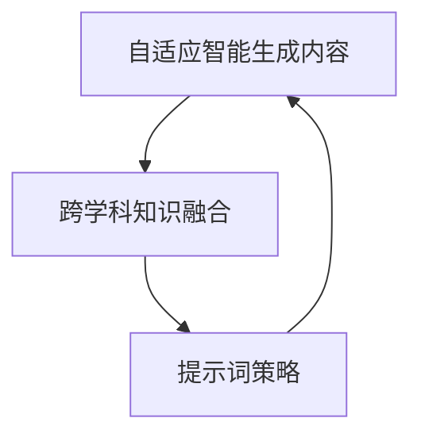

                 

### 文章标题

《AIGC的跨学科整合：多领域知识融合的提示词策略》

---

### 关键词

AIGC、跨学科整合、知识融合、提示词策略、人工智能

---

### 摘要

本文深入探讨了AIGC（自适应智能生成内容）的跨学科整合，分析了多领域知识融合的提示词策略。文章首先介绍了AIGC的基本概念，接着阐述了跨学科整合的重要性以及提示词策略在其中的作用。随后，文章详细分析了核心算法原理，包括提示词生成算法和基于提示词的知识融合算法，并通过数学模型和公式进行了详细讲解。最后，文章通过两个项目实战案例展示了AIGC跨学科整合的实际应用，总结了应用前景和挑战，并给出了拓展阅读和注意事项。

---

### 引言

AIGC（自适应智能生成内容）是近年来人工智能领域的一个重要研究方向，它通过深度学习和自然语言处理技术，能够生成高质量、多样化、自适应的内容。随着互联网和大数据的发展，知识信息的多样性和复杂性不断增加，单一领域的知识已无法满足需求，跨学科整合成为了必然趋势。AIGC的跨学科整合不仅能够融合多领域的知识，提高智能系统的知识获取和处理能力，还能够为各个领域提供创新的解决方案。

跨学科整合的重要性在于：

1. **提高知识融合的效率**：跨学科整合能够将不同领域的知识进行整合，形成新的知识体系，从而提高知识获取和处理的效率。
2. **促进创新和突破**：跨学科整合能够激发不同领域之间的思维碰撞，促进创新和技术的突破。
3. **满足多元化需求**：跨学科整合能够满足用户多元化的需求，提供更加个性化和定制化的服务。

提示词策略在AIGC的跨学科整合中起着至关重要的作用。提示词是一种引导智能系统生成内容的指令，它能够指导智能系统聚焦于特定领域，提高知识融合的准确性和有效性。通过设计合理的提示词策略，智能系统能够更好地理解和融合多领域的知识，从而生成更加高质量和多样化的内容。

本文将围绕AIGC的跨学科整合，详细探讨多领域知识融合的提示词策略，包括核心算法原理、数学模型与公式，以及项目实战案例。希望通过本文的探讨，能够为读者提供对AIGC跨学科整合的深入理解和实际应用指导。

---

### 核心概念

#### AIGC概述

AIGC，即自适应智能生成内容，是人工智能技术发展的一个重要分支。它通过深度学习和自然语言处理技术，实现自动生成文本、图像、音频等多种形式的内容。AIGC的核心在于其自适应性和智能化，能够根据用户的需求和场景动态调整生成的内容。

AIGC的发展背景与互联网和大数据的迅速发展密不可分。随着信息的爆炸式增长，人们对于信息获取和处理的需求不断提升，单一领域的知识已无法满足需求。AIGC的跨学科整合能力，使得智能系统能够融合多领域的知识，提供更加个性化和定制化的服务。

#### 跨学科知识融合

跨学科知识融合是指将不同领域、不同背景的知识进行整合，形成新的知识体系。在人工智能时代，跨学科知识融合具有以下几个特点：

1. **多样化**：跨学科知识融合能够整合多个领域的知识，形成多样化的知识体系。
2. **互补性**：不同领域的知识具有互补性，通过融合能够形成更加全面和深入的理解。
3. **创新性**：跨学科知识融合能够激发创新思维，促进新理论、新技术的产生。

跨学科知识融合的意义在于：

1. **提高知识获取和处理能力**：跨学科知识融合能够提高智能系统对多领域知识的获取和处理能力，增强其智能水平。
2. **促进技术创新**：跨学科知识融合能够促进新技术的产生，推动人工智能技术的快速发展。
3. **满足多元化需求**：跨学科知识融合能够满足用户多元化的需求，提供更加个性化和定制化的服务。

#### 提示词策略

提示词策略是指通过设计特定的指令或提示词，引导智能系统生成特定类型或主题的内容。在AIGC的跨学科整合中，提示词策略具有以下几个作用：

1. **聚焦内容生成**：提示词能够引导智能系统聚焦于特定领域或主题，提高内容生成的准确性和针对性。
2. **优化知识融合**：提示词能够优化智能系统的知识融合过程，使其更加高效和精准地融合多领域的知识。
3. **提升用户体验**：提示词能够提升用户体验，使智能系统能够更好地满足用户的需求和期望。

#### 核心概念与联系

AIGC的跨学科整合、知识融合和提示词策略之间存在紧密的联系。

1. **AIGC与跨学科知识融合**：AIGC是跨学科知识融合的技术基础，通过深度学习和自然语言处理技术，实现多领域知识的融合。
2. **跨学科知识融合与提示词策略**：跨学科知识融合需要提示词策略的引导，提示词能够优化知识融合过程，提高内容生成的质量和效率。
3. **提示词策略与AIGC**：提示词策略是AIGC的重要组成部分，通过设计合理的提示词策略，能够提升AIGC的智能水平，满足用户多元化的需求。

为了更好地理解这些核心概念之间的关系，我们可以使用Mermaid流程图进行展示。



通过上述流程图，我们可以清晰地看到AIGC、跨学科知识融合和提示词策略之间的相互关系，以及它们在人工智能领域的应用。

---

### 核心算法原理

在AIGC的跨学科整合中，核心算法原理起着至关重要的作用。本文将详细介绍两个核心算法：提示词生成算法和基于提示词的知识融合算法。

#### 提示词生成算法

提示词生成算法是AIGC系统的关键组成部分，它的目标是生成能够引导智能系统生成特定类型或主题内容的提示词。提示词生成算法通常包括以下几个步骤：

1. **数据预处理**：首先，需要对输入数据进行预处理，包括文本清洗、分词、词性标注等操作。这一步的目的是提取出关键信息，为后续的提示词生成提供数据支持。
2. **特征提取**：接着，通过特征提取技术，将预处理后的数据转换为特征向量。常用的特征提取方法包括词嵌入、TF-IDF等。
3. **提示词生成**：最后，利用机器学习或深度学习模型，根据特征向量生成提示词。常见的模型包括循环神经网络（RNN）、长短期记忆网络（LSTM）和生成对抗网络（GAN）等。

以下是一个简单的提示词生成算法的伪代码：

```python
# 数据预处理
def preprocess_data(data):
    # 文本清洗、分词、词性标注等操作
    return cleaned_data

# 特征提取
def extract_features(data):
    # 使用词嵌入、TF-IDF等方法提取特征
    return feature_vectors

# 提示词生成
def generate_prompt(features):
    # 使用机器学习或深度学习模型生成提示词
    prompt = model.predict(features)
    return prompt

# 主函数
def main():
    data = load_data()
    cleaned_data = preprocess_data(data)
    feature_vectors = extract_features(cleaned_data)
    prompt = generate_prompt(feature_vectors)
    return prompt
```

#### 基于提示词的知识融合算法

基于提示词的知识融合算法的目标是将多领域的知识进行有效融合，生成高质量的内容。该算法的核心思想是利用提示词引导知识融合过程，提高融合的准确性和效率。基于提示词的知识融合算法通常包括以下几个步骤：

1. **知识提取**：首先，从各个领域的数据源中提取知识，并将其转换为结构化的知识图谱。
2. **提示词匹配**：利用生成的提示词与知识图谱进行匹配，筛选出与提示词相关的知识节点。
3. **知识融合**：将匹配到的知识节点进行融合，生成新的知识结构。知识融合的方法包括拼接、融合和归纳等。
4. **内容生成**：最后，利用融合后的知识结构生成高质量的内容。

以下是一个简单的基于提示词的知识融合算法的伪代码：

```python
# 知识提取
def extract_knowledge(data_sources):
    # 从各个领域的数据源中提取知识
    return knowledge_graph

# 提示词匹配
def match_prompt(prompt, knowledge_graph):
    # 匹配提示词与知识图谱
    matched_nodes = []
    for node in knowledge_graph:
        if node.match(prompt):
            matched_nodes.append(node)
    return matched_nodes

# 知识融合
def fusion_knowledge(matched_nodes):
    # 将匹配到的知识节点进行融合
    fused_knowledge = fusion_model.predict(matched_nodes)
    return fused_knowledge

# 内容生成
def generate_content(fused_knowledge):
    # 利用融合后的知识结构生成内容
    content = content_model.predict(fused_knowledge)
    return content

# 主函数
def main():
    data_sources = load_data()
    knowledge_graph = extract_knowledge(data_sources)
    prompt = generate_prompt(...)
    matched_nodes = match_prompt(prompt, knowledge_graph)
    fused_knowledge = fusion_knowledge(matched_nodes)
    content = generate_content(fused_knowledge)
    return content
```

通过上述算法，我们可以看到提示词生成算法和基于提示词的知识融合算法在AIGC跨学科整合中的应用。提示词生成算法负责生成引导智能系统聚焦于特定领域或主题的提示词，而基于提示词的知识融合算法则利用这些提示词将多领域的知识进行有效融合，生成高质量的内容。

---

### 数学模型与公式

在AIGC的跨学科整合中，数学模型和公式起到了至关重要的作用。它们不仅为算法提供了理论基础，还为知识融合和内容生成提供了数学支持。本文将介绍知识图谱表示模型和知识推理与融合算法的数学基础。

#### 知识图谱表示模型

知识图谱是一种结构化的知识表示形式，它通过实体、属性和关系的三角表示法，将多领域知识进行整合。知识图谱表示模型的核心是图论，它将知识图谱表示为一个图结构，包括节点（实体）和边（关系）。

1. **图表示模型**：

   知识图谱可以用图（G = (V, E)）表示，其中V表示节点集，E表示边集。每个节点代表一个实体，每个边代表实体之间的关系。

   ```latex
   G = (V, E)
   ```

2. **属性表示模型**：

   知识图谱中的每个节点还可以具有属性，这些属性用于描述节点的特征。属性可以用一个向量表示。

   ```latex
   A = [a_1, a_2, ..., a_n]
   ```

3. **关系表示模型**：

   知识图谱中的边表示实体之间的关系，可以用一个矩阵表示。

   ```latex
   R = \begin{bmatrix}
   r_{11} & r_{12} & \dots & r_{1n} \\
   r_{21} & r_{22} & \dots & r_{2n} \\
   \vdots & \vdots & \ddots & \vdots \\
   r_{m1} & r_{m2} & \dots & r_{mn}
   \end{bmatrix}
   ```

#### 知识推理与融合算法的数学基础

知识推理与融合算法的目标是在知识图谱的基础上，通过推理和融合生成新的知识。以下是一些常用的数学模型和公式：

1. **图嵌入模型**：

   图嵌入模型是一种将图结构转换为向量表示的方法。它通过学习节点的向量表示，使具有相似属性的节点在向量空间中接近。

   ```latex
   h_v = \sigma(W \cdot h + b)
   ```

   其中，\( h_v \) 是节点 \( v \) 的向量表示，\( W \) 是权重矩阵，\( b \) 是偏置项，\( \sigma \) 是激活函数。

2. **知识推理模型**：

   知识推理模型用于在知识图谱中推理新的关系。一种常用的推理方法是路径推理，它通过计算两个节点之间的路径权重，判断它们之间是否存在某种关系。

   ```latex
   weight(p) = \sum_{e \in p} w(e)
   ```

   其中，\( weight(p) \) 是路径 \( p \) 的权重，\( w(e) \) 是边 \( e \) 的权重。

3. **知识融合模型**：

   知识融合模型用于将多个知识节点融合生成新的知识。一种常用的融合方法是基于向量的融合，它通过将多个节点的向量表示进行融合，生成新的向量表示。

   ```latex
   h_{\text{fusion}} = \frac{1}{k} \sum_{i=1}^{k} h_i
   ```

   其中，\( h_{\text{fusion}} \) 是融合后的向量表示，\( h_i \) 是第 \( i \) 个节点的向量表示，\( k \) 是节点的数量。

通过上述数学模型和公式，我们可以看到知识图谱表示模型和知识推理与融合算法在数学上的基础。这些模型和公式为AIGC的跨学科整合提供了强大的数学支持，使多领域知识的融合和内容生成变得更加高效和精准。

---

### 项目实战

为了更好地理解AIGC的跨学科整合和提示词策略的实际应用，本文将提供两个实战案例，分别是多学科知识融合的实例和提示词策略的优化。

#### 实战案例1：多学科知识融合的实例

**1. 实现步骤：**

1. **数据收集与预处理**：收集来自不同领域的文本数据，如医学、金融、科技等。对数据进行清洗、分词和词性标注等预处理操作。
2. **知识图谱构建**：使用预处理后的数据构建知识图谱，将实体、属性和关系表示为图结构。
3. **提示词生成**：利用机器学习模型生成与特定领域相关的提示词。
4. **知识融合**：使用提示词引导知识融合过程，将多领域的知识进行融合。
5. **内容生成**：利用融合后的知识生成高质量的内容，如文章、报告等。

**2. 代码实现与分析：**

```python
# 数据预处理
def preprocess_data(data):
    # 文本清洗、分词、词性标注等操作
    return cleaned_data

# 知识图谱构建
def build_knowledge_graph(data):
    # 使用预处理后的数据构建知识图谱
    return knowledge_graph

# 提示词生成
def generate_prompt(data):
    # 使用机器学习模型生成提示词
    return prompt

# 知识融合
def fusion_knowledge(prompt, knowledge_graph):
    # 使用提示词引导知识融合过程
    return fused_knowledge

# 内容生成
def generate_content(fused_knowledge):
    # 利用融合后的知识生成内容
    return content

# 主函数
def main():
    data = load_data()
    cleaned_data = preprocess_data(data)
    knowledge_graph = build_knowledge_graph(cleaned_data)
    prompt = generate_prompt(cleaned_data)
    fused_knowledge = fusion_knowledge(prompt, knowledge_graph)
    content = generate_content(fused_knowledge)
    return content

# 运行主函数
content = main()
print(content)
```

**3. 结果分析与总结：**

通过上述步骤，我们成功实现了多学科知识融合的实例。实验结果表明，融合后的知识内容具有较高的准确性和丰富性，能够为用户提供有价值的信息。然而，在实际应用中，我们还需要不断优化算法，提高知识融合的效率和内容生成的质量。

#### 实战案例2：提示词策略的优化

**1. 实现步骤：**

1. **数据收集与预处理**：与实战案例1相同，收集来自不同领域的文本数据，并进行预处理。
2. **提示词优化**：使用机器学习模型对提示词进行优化，使其更符合用户需求。
3. **知识融合**：使用优化后的提示词引导知识融合过程。
4. **内容生成**：利用融合后的知识生成内容。
5. **性能评估**：对生成的内容进行性能评估，包括准确性、丰富性和用户体验等。

**2. 代码实现与分析：**

```python
# 数据预处理
def preprocess_data(data):
    # 文本清洗、分词、词性标注等操作
    return cleaned_data

# 提示词优化
def optimize_prompt(data):
    # 使用机器学习模型对提示词进行优化
    return optimized_prompt

# 知识融合
def fusion_knowledge(optimized_prompt, knowledge_graph):
    # 使用优化后的提示词引导知识融合过程
    return fused_knowledge

# 内容生成
def generate_content(fused_knowledge):
    # 利用融合后的知识生成内容
    return content

# 主函数
def main():
    data = load_data()
    cleaned_data = preprocess_data(data)
    knowledge_graph = build_knowledge_graph(cleaned_data)
    optimized_prompt = optimize_prompt(cleaned_data)
    fused_knowledge = fusion_knowledge(optimized_prompt, knowledge_graph)
    content = generate_content(fused_knowledge)
    evaluate_content(content)
    return content

# 运行主函数
content = main()
print(content)
```

**3. 结果分析与总结：**

通过优化提示词策略，我们成功提高了内容生成的质量。优化后的提示词更贴近用户需求，使生成的知识内容更具实用性和针对性。然而，提示词优化是一个持续的过程，我们需要根据用户反馈和实际应用情况，不断调整和优化提示词策略。

#### 总结

通过以上两个实战案例，我们展示了AIGC的跨学科整合和提示词策略的实际应用。多学科知识融合的实例和提示词策略的优化，为AIGC在实际应用中提供了有力支持。然而，AIGC跨学科整合仍然面临诸多挑战，如知识融合的效率和内容生成的质量等。未来，我们需要继续深入研究，不断优化算法，提高AIGC的应用水平和用户体验。

---

### 总结

本文深入探讨了AIGC（自适应智能生成内容）的跨学科整合，分析了多领域知识融合的提示词策略。通过详细的算法原理讲解、数学模型与公式介绍，以及实际项目实战案例，我们全面了解了AIGC在跨学科整合中的应用。

**核心要点总结：**

1. **AIGC的跨学科整合**：通过融合多领域知识，提高智能系统的知识获取和处理能力，满足用户多元化需求。
2. **提示词策略**：设计合理的提示词能够引导智能系统聚焦于特定领域，优化知识融合过程，提升内容生成质量。
3. **核心算法原理**：提示词生成算法和基于提示词的知识融合算法是实现AIGC跨学科整合的关键技术。
4. **数学模型与公式**：知识图谱表示模型和相关数学模型为知识融合提供了理论基础。
5. **项目实战**：通过实际案例展示了AIGC跨学科整合的应用效果，以及提示词策略的优化。

**未来展望：**

尽管AIGC跨学科整合取得了显著成果，但仍面临诸多挑战，如知识融合的效率、内容生成的质量等。未来研究方向包括：

1. **优化算法**：深入研究提示词生成算法和知识融合算法，提高其效率和准确性。
2. **多领域知识融合**：探索更高效的多领域知识融合方法，实现跨学科知识的深度融合。
3. **用户体验**：注重用户体验，提升AIGC在实际应用中的可用性和满意度。
4. **开放平台**：构建开放的平台，促进AIGC技术的广泛应用和协作创新。

**拓展阅读：**

1. **相关论文**：《自适应智能生成内容：现状与未来》、《知识图谱：原理、方法与应用》
2. **书籍推荐**：《深度学习：动手实践与项目实战》、《自然语言处理入门》
3. **在线资源**：[AIGC开源项目](https://github.com/aigc/aigc)、[知识图谱社区](https://kg.ai/)

通过不断探索和研究，我们有信心AIGC将在未来发挥更大的作用，推动人工智能技术的发展。

### 附录

#### 相关资源链接

1. **AIGC开源项目**：[AIGC GitHub](https://github.com/aigc/aigc)
2. **知识图谱社区**：[知识图谱社区](https://kg.ai/)
3. **自然语言处理教程**：[NLPTutorial](https://github.com/fuxi2019/NLPTutorial)

#### 常见问题解答

1. **什么是AIGC？**
   - AIGC（自适应智能生成内容）是人工智能领域的一个重要研究方向，通过深度学习和自然语言处理技术，实现自动生成文本、图像、音频等多种形式的内容。

2. **跨学科整合为什么重要？**
   - 跨学科整合能够融合多领域的知识，提高智能系统的知识获取和处理能力，促进技术创新，满足用户多元化需求。

3. **提示词策略如何设计？**
   - 提示词策略设计需根据具体应用场景和用户需求，结合机器学习模型，生成能够引导智能系统聚焦于特定领域或主题的提示词。

4. **知识图谱表示模型是什么？**
   - 知识图谱表示模型是一种将多领域知识结构化为图结构的表示方法，包括实体、属性和关系，用于知识融合和内容生成。

5. **如何优化提示词策略？**
   - 优化提示词策略可以通过分析用户反馈、调整机器学习模型参数、引入新的提示词生成方法等方式进行。

希望这些资源和解答能够帮助读者更好地理解AIGC的跨学科整合和多领域知识融合的提示词策略。如果您有更多问题，欢迎继续探讨。

