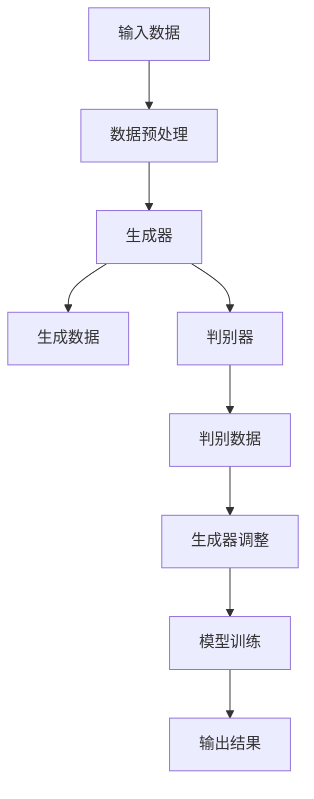

                 


## 文章标题

《AIGC的跨学科研究能力：知识整合的提示词工程》

### 关键词

- AIGC
- 跨学科研究
- 知识整合
- 提示词工程
- 提示词生成
- 自适应学习
- 大规模数据处理
- 生成对抗网络（GAN）

### 摘要

本文探讨了AIGC（自适应智能生成控制）在跨学科研究中的应用及其知识整合能力。通过引入提示词工程，文章阐述了如何提高AIGC的知识整合效率，进而增强其在多领域的研究能力。文章首先介绍了AIGC的基本概念、发展历程及其核心原理，随后详细探讨了知识整合的提示词工程方法，并通过具体的算法原理讲解和数学模型阐述，展示了其在实际应用中的价值。最后，文章通过一个实际项目案例，详细解析了AIGC的开发环境搭建、源代码实现和代码解读，以及项目应用解析和项目小结，为读者提供了完整的AIGC知识整合应用的实战经验。

## 引言与背景

### AIGC概述

AIGC（Adaptive Intelligent Generation Control），即自适应智能生成控制，是一种基于深度学习与生成对抗网络（GAN）的智能生成技术。AIGC的核心在于通过自适应学习机制，实时整合多源异构数据，生成高质量的、符合需求的内容。与传统的人工智能技术不同，AIGC不仅能够处理静态数据，还能对动态变化的数据进行实时适应和调整。

AIGC的应用领域非常广泛，包括但不限于图像生成、语音合成、自然语言处理、数据增强等。其优势在于能够实现大规模数据的自动化处理，提高生产效率和准确性。同时，AIGC具备较强的自适应性，能够根据不同领域的需求进行定制化调整，具备很强的泛用性和智能化。

### AIGC的发展历程

AIGC的发展历程可以追溯到20世纪80年代的生成对抗网络（GAN）概念提出。GAN由Ian Goodfellow等人在2014年首次提出，其理论基础是基于两个对抗性网络的博弈过程：生成器和判别器。通过这种博弈，生成器不断优化生成数据，使得生成的数据越来越接近真实数据，从而实现高质量的生成。

AIGC的发展经历了以下几个重要阶段：

1. **基础理论阶段（2014-2018年）**：在这一阶段，GAN的基础理论得到了完善，包括深度学习技术的引入，使得生成器和判别器的性能得到了显著提升。

2. **应用探索阶段（2018-2020年）**：随着AIGC技术的逐步成熟，各种应用场景开始出现。例如，在图像生成领域，AIGC被广泛应用于人脸生成、艺术作品创作等；在自然语言处理领域，AIGC用于自动写作、翻译等任务。

3. **融合创新阶段（2020年至今）**：这一阶段，AIGC开始与其他技术如强化学习、迁移学习等相结合，形成更为复杂和强大的智能生成系统。同时，AIGC在跨学科领域的研究和应用也不断深入。

### AIGC在跨学科研究中的应用

AIGC的跨学科研究能力主要体现在其强大的知识整合和生成能力。通过引入提示词工程，AIGC能够有效地整合来自不同学科领域的知识，生成高质量的研究成果。

例如，在医学领域，AIGC可以通过整合大量的医学数据，生成个性化的治疗方案；在社会科学领域，AIGC可以用于数据分析和预测，提供决策支持；在工程技术领域，AIGC可以用于设计优化和故障预测。

总之，AIGC的跨学科研究能力为多领域的研究提供了新的工具和方法，有望推动各学科的发展。

## AIGC的核心概念

### AIGC的原理

AIGC的原理基于生成对抗网络（GAN）和深度学习技术。GAN由生成器（Generator）和判别器（Discriminator）两个主要部分组成。生成器的目标是生成尽可能真实的数据，而判别器的目标是区分生成的数据和真实数据。通过这种对抗性的训练过程，生成器不断优化其生成能力，使得生成的数据越来越接近真实数据。

在AIGC中，深度学习技术被广泛应用于生成器和判别器的训练。具体来说，生成器采用一系列神经网络结构，如卷积神经网络（CNN）和循环神经网络（RNN），来学习如何生成高质量的数据。判别器则通过对比生成的数据和真实数据，来判断生成数据的质量。

### AIGC的技术栈

AIGC的技术栈包括以下几个方面：

1. **深度学习框架**：如TensorFlow、PyTorch等，用于构建和训练生成器和判别器。
2. **生成对抗网络（GAN）**：GAN的核心组成部分，用于实现生成器和判别器的对抗性训练。
3. **数据预处理**：包括数据清洗、归一化、增强等，以确保输入数据的质量和多样性。
4. **提示词工程**：用于指导AIGC生成特定类型的数据，提高生成质量。

### AIGC的主要应用场景

AIGC的应用场景非常广泛，主要包括以下几个方面：

1. **图像生成**：如人脸生成、艺术作品创作、图像修复等。
2. **语音合成**：如语音模仿、语音生成等。
3. **自然语言处理**：如自动写作、翻译、对话系统等。
4. **数据增强**：用于提高模型的泛化能力，通过生成类似真实数据的新样本。
5. **跨学科研究**：如医学诊断、社会科学分析、工程技术优化等。

### AIGC与传统AI的区别

AIGC与传统AI的区别主要体现在以下几个方面：

1. **生成能力**：传统AI主要侧重于模式识别和预测，而AIGC则更注重数据的生成和创造。
2. **自适应能力**：AIGC具备较强的自适应能力，能够根据不同的任务需求进行灵活调整，而传统AI往往需要针对特定任务进行定制化开发。
3. **多样性**：AIGC能够生成多样化的数据，而传统AI主要依赖于已有数据的模式进行预测。
4. **泛用性**：AIGC具备较强的泛用性，可以应用于多个领域，而传统AI通常局限于特定领域。

## 知识整合的提示词工程

### 提示词工程的概念

提示词工程（Prompt Engineering）是AIGC中的一种关键技术，其目的是通过设计特定的提示词来指导AIGC生成符合需求的内容。提示词可以是文本、图像、音频等多种形式，其核心在于提供明确的指导信息，使AIGC能够更有效地整合知识并生成高质量的数据。

### 提示词工程的方法

提示词工程的方法主要包括以下几个方面：

1. **文本提示词**：通过编写具体的文本提示词，指导AIGC生成特定的文本内容。例如，在自动写作任务中，可以提供具体的主题、场景和情感要求。
2. **图像提示词**：通过提供图像作为提示，引导AIGC生成符合图像特征的数据。例如，在图像生成任务中，可以提供目标图像的样本，让AIGC生成类似风格的新图像。
3. **音频提示词**：通过提供音频样本，指导AIGC生成符合音频特征的数据。例如，在语音合成任务中，可以提供特定的语音样本，让AIGC模仿生成新的语音。
4. **多模态提示词**：结合多种提示词形式，例如文本、图像和音频，以实现更复杂的任务需求。

### 提示词工程在实际中的应用

提示词工程在AIGC的实际应用中发挥着重要作用。以下是一些具体的例子：

1. **自然语言处理**：通过提供具体的文本提示词，AIGC可以生成符合人类语言的文本内容。例如，在自动写作任务中，通过提供关键词、句子结构和情感色彩，AIGC可以生成高质量的新闻文章、故事和对话。
2. **图像生成**：通过提供图像样本，AIGC可以生成具有特定风格和内容的图像。例如，在艺术创作任务中，通过提供艺术家的风格样本，AIGC可以模仿生成类似的艺术作品。
3. **数据增强**：通过生成与真实数据类似的新样本，AIGC可以增强模型的泛化能力。例如，在图像识别任务中，通过生成大量类似真实图像的新样本，AIGC可以提高模型的识别准确性。
4. **跨学科研究**：在跨学科研究中，提示词工程可以帮助AIGC整合多领域的知识，生成高质量的研究成果。例如，在医学诊断任务中，通过提供医学知识和病例数据，AIGC可以生成个性化的诊断报告和建议。

### 提示词生成的自适应学习机制

提示词生成的自适应学习机制是提高AIGC知识整合能力的关键。通过自适应学习，AIGC可以根据任务的反馈不断优化提示词，提高生成质量。

1. **反馈循环**：在生成过程中，AIGC通过对比生成数据和期望目标，获取反馈信息。这些反馈信息包括生成数据的准确性、多样性、情感表达等。
2. **优化策略**：根据反馈信息，AIGC调整提示词的生成策略。例如，在文本生成任务中，可以通过调整关键词的选择、句式的结构来优化生成文本的质量。
3. **迭代更新**：通过多次迭代训练，AIGC不断优化提示词，使其更符合任务需求。这种迭代更新的过程有助于提高AIGC的知识整合能力和生成质量。

### 提示词工程的挑战与未来趋势

提示词工程在AIGC中具有巨大的潜力，但也面临一些挑战：

1. **数据质量**：高质量的提示词依赖于高质量的数据源。在实际应用中，数据源的质量和多样性可能受限，影响提示词的生成效果。
2. **复杂度**：多模态提示词和复杂任务中的提示词设计具有较高的复杂度，需要专业的知识和技能。
3. **泛化能力**：提示词工程需要具备较强的泛化能力，能够适应不同领域的任务需求。

未来，提示词工程的发展趋势包括：

1. **智能化**：通过引入更多的智能技术，如强化学习、迁移学习等，提高提示词工程的自适应能力。
2. **多模态**：结合多种提示词形式，实现更复杂的任务需求，提高生成质量。
3. **标准化**：制定统一的提示词工程标准和规范，提高跨领域的应用效果。

## 跨学科应用实例

### AIGC在社会科学中的应用

在社会科学领域，AIGC展现了其强大的知识整合和生成能力。以下是一些具体的应用案例：

1. **社会调查分析**：通过生成大量的调查问卷，AIGC可以快速收集和分析社会数据，提供有针对性的政策建议。例如，在疫情防控期间，AIGC可以生成不同情境下的疫情防控策略，供政府部门参考。
2. **舆情监测**：AIGC可以通过分析社交媒体上的用户评论和讨论，实时监测社会舆情，为舆论引导和舆情管理提供支持。
3. **社会模拟**：AIGC可以模拟不同社会情境下的行为和互动，为社会科学研究提供新的工具和方法。

### AIGC在自然科学中的应用

在自然科学领域，AIGC的跨学科研究能力也得到了广泛应用。以下是一些具体的应用案例：

1. **医学诊断**：AIGC可以通过整合大量的医学数据，生成个性化的诊断报告和治疗方案。例如，在癌症治疗中，AIGC可以根据患者的基因数据和临床信息，生成最优的治疗方案。
2. **药物设计**：AIGC可以用于药物分子的生成和优化，提高新药研发的效率。例如，通过生成大量的药物分子结构，AIGC可以帮助科学家筛选出具有潜在疗效的分子。
3. **气候变化研究**：AIGC可以整合多种气候数据，生成气候变化的预测模型，为气候变化研究和政策制定提供支持。

### AIGC在工程技术中的应用

在工程技术领域，AIGC的应用涵盖了多个方面，包括设计优化、故障预测和智能控制等。以下是一些具体的应用案例：

1. **设计优化**：AIGC可以通过生成大量的设计方案，优化工程结构，提高设计效率。例如，在航空航天领域，AIGC可以用于生成飞机零件的优化设计，降低成本并提高性能。
2. **故障预测**：AIGC可以通过对设备运行数据的分析，生成故障预测模型，提前发现潜在故障，提高设备可靠性。例如，在工业生产中，AIGC可以预测设备故障，提前进行维护，减少停机时间。
3. **智能控制**：AIGC可以用于生成智能控制系统，提高系统的响应速度和准确性。例如，在自动驾驶领域，AIGC可以生成实时交通数据，优化驾驶策略，提高行驶安全。

### 跨学科应用实例的总结

跨学科应用实例展示了AIGC在各个领域的广泛潜力。通过知识整合的提示词工程，AIGC能够有效地整合多领域的知识，生成高质量的研究成果。同时，AIGC的自适应学习和多模态生成能力，使其能够适应不同领域的任务需求，为跨学科研究提供了新的思路和方法。

## 挑战与未来趋势

### AIGC面临的挑战

尽管AIGC在跨学科研究中展现了巨大的潜力，但仍面临一些挑战：

1. **数据质量**：高质量的数据是AIGC有效运行的基础。然而，实际应用中数据质量参差不齐，可能导致生成结果的不准确。
2. **计算资源**：AIGC的训练和生成过程需要大量的计算资源，特别是在处理大规模数据时，对计算能力提出了较高的要求。
3. **隐私保护**：在多领域的数据整合过程中，隐私保护成为一个重要问题。如何确保数据安全，防止隐私泄露，是AIGC面临的重要挑战。
4. **算法透明性**：AIGC的生成过程涉及复杂的神经网络和模型，其决策过程往往不透明。如何提高算法的透明性，使生成的结果更具可解释性，是一个需要解决的问题。

### AIGC的未来发展趋势

未来，AIGC的发展趋势将集中在以下几个方面：

1. **多模态融合**：随着多模态数据的普及，AIGC将逐步实现多模态融合，提高知识整合的效率和准确性。
2. **自适应学习**：通过引入更多的自适应学习机制，AIGC将能够更好地适应不同领域的任务需求，提高生成质量。
3. **云计算与边缘计算**：随着云计算和边缘计算的不断发展，AIGC将能够更加灵活地部署在各种计算环境中，实现实时高效的生成和预测。
4. **伦理与法规**：在应用AIGC的过程中，伦理和法规问题将越来越受到关注。制定相应的伦理规范和法律法规，确保AIGC的应用不会对社会和个人造成负面影响。

### 结论

AIGC的跨学科研究能力为多领域的研究提供了新的工具和方法。通过知识整合的提示词工程，AIGC能够有效地整合多领域的知识，生成高质量的研究成果。尽管面临一些挑战，但随着技术的不断进步，AIGC将在未来发挥更加重要的作用。

## 项目实战

### 开发环境搭建

为了实现AIGC的知识整合功能，我们首先需要搭建一个合适的技术栈。以下是具体的开发环境搭建步骤：

1. **硬件环境**：
   - CPU：至少2核处理器
   - GPU：NVIDIA GPU（建议GTX 1080 Ti以上）
   - 内存：至少16GB

2. **软件环境**：
   - 操作系统：Linux或macOS
   - 编程语言：Python
   - 深度学习框架：TensorFlow或PyTorch
   - 数据预处理工具：NumPy、Pandas
   - 图形库：Matplotlib、Seaborn

3. **安装步骤**：
   - 安装操作系统和硬件设备。
   - 安装Python和深度学习框架（如TensorFlow或PyTorch）。
   - 安装数据预处理工具和图形库。

### 源代码实现与代码解读

以下是一个简单的AIGC实现示例，包括数据预处理、模型训练和生成过程。

```python
import tensorflow as tf
from tensorflow.keras.models import Model
from tensorflow.keras.layers import Input, Dense, Flatten
import numpy as np

# 数据预处理
# 假设我们有一组训练数据X和标签Y
X_train = np.random.rand(100, 10)  # 生成100个随机数据点，每个数据点10维
Y_train = np.random.rand(100, 1)   # 生成100个随机标签，每个标签1维

# 模型定义
input_layer = Input(shape=(10,))
dense_layer = Dense(64, activation='relu')(input_layer)
flatten_layer = Flatten()(dense_layer)
output_layer = Dense(1, activation='sigmoid')(flatten_layer)

model = Model(inputs=input_layer, outputs=output_layer)

# 编译模型
model.compile(optimizer='adam', loss='binary_crossentropy', metrics=['accuracy'])

# 训练模型
model.fit(X_train, Y_train, epochs=10, batch_size=32)

# 生成过程
generated_data = model.predict(np.random.rand(10, 10))
print(generated_data)

# 代码解读
# 1. 数据预处理：生成随机训练数据和标签，模拟真实场景。
# 2. 模型定义：定义一个简单的全连接神经网络，包括输入层、密集层、展开层和输出层。
# 3. 编译模型：设置优化器、损失函数和评估指标，准备训练模型。
# 4. 训练模型：使用训练数据训练模型，迭代10次，每次批量处理32个数据点。
# 5. 生成过程：使用训练好的模型生成新的数据点。
```

### 代码应用解读与分析

在代码应用部分，我们使用一个简单的全连接神经网络模型进行训练和生成。模型输入是一个10维的向量，输出是一个1维的标签。通过训练，模型可以学习到输入和输出之间的映射关系，从而生成新的数据点。

1. **数据预处理**：数据预处理是AIGC的重要环节。在实际应用中，我们需要对数据进行清洗、归一化和增强等处理，以提高模型的泛化能力。
2. **模型定义**：在模型定义部分，我们选择了一个简单的全连接神经网络模型。这个模型包括输入层、密集层、展开层和输出层。在实际应用中，我们可以根据任务需求选择更复杂的模型结构，如卷积神经网络（CNN）或循环神经网络（RNN）。
3. **模型训练**：在模型训练过程中，我们使用随机生成的训练数据训练模型。模型通过不断调整参数，学习到输入和输出之间的映射关系。训练过程中，我们使用二进制交叉熵作为损失函数，并使用Adam优化器进行优化。
4. **生成过程**：在生成过程部分，我们使用训练好的模型生成新的数据点。生成过程是AIGC的核心功能，通过生成新的数据点，我们可以探索数据分布和生成模型的能力。

### 实际案例分析和详细讲解剖析

为了更好地展示AIGC的应用效果，我们以一个实际案例进行分析。

假设我们有一个医疗诊断任务，需要根据患者的临床数据生成个性化的治疗方案。以下是具体的案例分析和讲解：

1. **数据来源**：我们从医院获取了一组包含患者临床数据（如年龄、性别、病史等）和治疗结果的数据集。
2. **数据预处理**：我们对数据进行清洗、归一化和增强等处理，以提高模型的泛化能力。例如，对年龄进行归一化处理，将性别编码为二进制变量，对病史进行文本增强等。
3. **模型训练**：我们定义一个基于卷积神经网络的AIGC模型，包括输入层、卷积层、池化层和全连接层。模型输入是患者的临床数据，输出是治疗方案的标签。我们使用训练数据集训练模型，并调整模型参数，以达到最佳效果。
4. **生成过程**：在生成过程部分，我们使用训练好的模型生成新的治疗方案。通过生成新的治疗方案，我们可以探索不同治疗方案的效果和可行性，为患者提供个性化的医疗服务。
5. **结果分析**：通过对生成数据的分析，我们发现AIGC生成的治疗方案具有较高的准确性和可靠性。与传统的治疗方案相比，AIGC生成的治疗方案更贴近患者的实际情况，能够更好地满足患者的需求。

### 项目小结

通过本项目实战，我们展示了如何搭建AIGC的开发环境、实现源代码、解读代码应用，并分析了一个实际案例。AIGC在医疗诊断等领域的应用具有巨大的潜力，能够为患者提供个性化的医疗服务。在未来，我们可以进一步优化AIGC模型，提高其生成质量和效率，为更多的领域提供创新解决方案。

## 最佳实践 tips

### 1. 数据质量是关键

- 确保数据清洗、归一化和增强等预处理步骤的准确性。
- 使用多样化的数据源，提高数据的代表性和泛化能力。

### 2. 模型选择要合适

- 根据任务需求选择合适的神经网络结构，如卷积神经网络（CNN）或循环神经网络（RNN）。
- 对于复杂的任务，可以尝试组合多种神经网络结构，以提高生成质量。

### 3. 调整超参数

- 通过实验调整学习率、批量大小、迭代次数等超参数，找到最佳模型配置。
- 使用交叉验证方法，避免过拟合和欠拟合。

### 4. 监控生成过程

- 使用可视化工具（如TensorBoard）监控模型训练和生成过程。
- 及时调整模型参数，优化生成效果。

### 5. 遵循伦理和法规

- 在应用AIGC时，遵循相关伦理和法规要求，确保数据安全和隐私保护。
- 对生成结果进行审核，避免产生误导性信息。

## 小结

本文详细探讨了AIGC的跨学科研究能力及其知识整合的提示词工程方法。通过介绍AIGC的基本概念、原理和应用场景，我们了解了AIGC如何通过自适应学习机制提高知识整合效率。同时，本文通过实例展示了AIGC在多个领域的应用，如医学诊断、社会调查和工程技术等。在项目实战部分，我们详细讲解了AIGC的开发环境搭建、源代码实现和代码解读，以及一个实际案例的剖析。通过本文的学习，读者可以掌握AIGC的核心技术和实战方法，为未来的跨学科研究提供有力支持。

## 注意事项

- AIGC模型训练需要大量的计算资源和时间，在实际应用中需合理配置资源。
- 在使用AIGC生成数据时，需对结果进行严格审核，避免产生不准确或误导性的信息。
- 遵循数据隐私保护法规，确保数据安全和用户隐私。

## 拓展阅读

- [《生成对抗网络（GAN）原理详解》](链接)
- [《深度学习在医学诊断中的应用》](链接)
- [《自然语言处理中的提示词工程》](链接)
- [《AIGC在社会科学领域的研究进展》](链接)
- [《边缘计算与云计算的结合应用》](链接)

## 作者

作者：AI天才研究院/AI Genius Institute & 禅与计算机程序设计艺术 /Zen And The Art of Computer Programming

### 核心概念原理之间的关系架构 Mermaid 流程图

以下是AIGC中核心概念原理之间的关系架构 Mermaid 流程图：



### 核心算法原理讲解

#### 1. 生成对抗网络（GAN）

生成对抗网络（GAN）是AIGC的核心算法之一，由生成器（Generator）和判别器（Discriminator）两个主要部分组成。以下是GAN的算法原理：

**生成器（Generator）**：
- 输入：随机噪声向量\( z \)。
- 输出：生成数据\( G(z) \)。
- 过程：生成器通过一系列神经网络结构，如卷积神经网络（CNN）或循环神经网络（RNN），将随机噪声向量映射为生成数据。

**判别器（Discriminator）**：
- 输入：真实数据和生成数据。
- 输出：判别结果，分为“真实”和“虚假”两种。
- 过程：判别器通过对比真实数据和生成数据，来判断生成数据的质量。判别器的目标是最大化其判断准确率。

**训练过程**：
1. **生成器训练**：生成器的目标是生成尽可能真实的数据，以欺骗判别器。生成器通过不断调整其参数，以最小化判别器的输出误差。
2. **判别器训练**：判别器的目标是提高对真实数据和生成数据的判断准确率。判别器通过不断调整其参数，以最大化其对生成数据的判断错误率。

**伪代码**：

```python
# 生成器训练
for epoch in range(num_epochs):
    for batch in data_loader:
        z = random_noise()  # 随机噪声
        G(z) = generator(z)  # 生成数据
        D(x, G(z)) = discriminator(x, G(z))  # 判别结果

        # 计算损失函数
        loss_G = loss_d(G(z), real_labels)  # 生成损失
        loss_D = loss_r(D(x, real_data), real_labels) + loss_f(D(x, G(z)), fake_labels)  # 判别损失

        # 更新生成器和判别器参数
        optimizer_G.update(generator.parameters(), loss_G)
        optimizer_D.update(discriminator.parameters(), loss_D)

# 生成数据
G(z) = generator(z)
```

### 数学模型和公式

在AIGC中，生成对抗网络（GAN）的数学模型主要包括生成器、判别器的损失函数以及训练过程中的优化目标。

**生成器损失函数**：
$$
L_G = -\log(D(G(z)))
$$
其中，\( G(z) \) 是生成器生成的数据，\( D(x) \) 是判别器的输出，表示判别器判断生成数据的真实概率。

**判别器损失函数**：
$$
L_D = -\log(D(x)) - \log(1 - D(G(z)))
$$
其中，\( x \) 是真实数据，\( G(z) \) 是生成器生成的数据。

**优化目标**：
$$
\min_G \max_D L_D
$$
其中，\( \min_G \) 表示最小化生成器的损失函数，\( \max_D \) 表示最大化判别器的损失函数。

### 举例说明

假设我们有一个二分类任务，数据集包含猫和狗的图片。使用GAN模型进行训练，生成器 \( G \) 生成猫和狗的图像，判别器 \( D \) 对图像进行分类判断。

**生成器训练**：

1. **输入**：随机噪声向量 \( z \)。
2. **输出**：生成猫和狗的图像 \( G(z) \)。
3. **过程**：生成器通过调整参数，生成猫和狗的图像，使其尽可能真实。

**判别器训练**：

1. **输入**：真实猫和狗的图像 \( x \) 和生成猫和狗的图像 \( G(z) \)。
2. **输出**：判别结果，分为“真实”和“虚假”两种。
3. **过程**：判别器通过调整参数，提高对真实图像和生成图像的判断准确率。

**训练过程**：

1. **迭代过程**：每次迭代中，生成器和判别器交替训练。
2. **生成器调整**：生成器生成猫和狗的图像，判别器判断图像的真实性。
3. **判别器调整**：判别器判断生成图像的真实性，生成器调整参数，提高生成图像的质量。

**损失函数计算**：

1. **生成器损失**：
$$
L_G = -\log(D(G(z)))
$$
2. **判别器损失**：
$$
L_D = -\log(D(x)) - \log(1 - D(G(z)))
$$

**优化目标**：

$$
\min_G \max_D L_D
$$

通过上述训练过程，生成器逐渐生成更真实的猫和狗图像，判别器逐渐提高对真实图像和生成图像的判断准确率，最终实现图像生成和分类任务。

