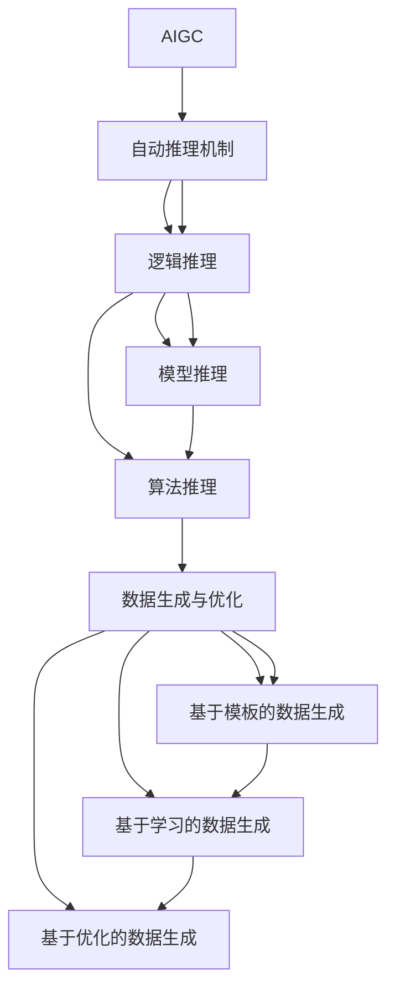

                 


### 文章标题

# AIGC的逻辑推理能力：通过提示词增强AI的批判性思维

### 文章关键词

- AIGC
- 逻辑推理
- 提示词
- 批判性思维
- AI应用

### 文章摘要

本文深入探讨了AIGC（自适应智能生成控制）在逻辑推理领域的应用，以及如何通过使用提示词来增强AI的批判性思维能力。文章首先介绍了AIGC的基本原理和逻辑推理在AI中的重要性，随后详细讲解了逻辑推理的核心概念、算法原理和数学模型。通过实际项目实战，本文展示了如何通过提示词来改进AI的推理能力，并分析了其中的挑战与解决方案。文章最后提出了未来发展的展望，并提供了拓展阅读建议。

## 第一部分：引论

### 1.1 AIGC与逻辑推理概述

AIGC（Adaptive Intelligent Generation Control）是一种通过自适应学习和控制技术，实现对复杂生成任务自动优化和调整的智能系统。它结合了人工智能、自动推理和优化算法，旨在提高自动化生成任务的效率和准确性。逻辑推理作为人工智能的核心组成部分，是解决复杂问题、进行决策的重要工具。

逻辑推理在AI中的应用可以追溯到早期的人工智能研究。随着计算能力和数据资源的提升，逻辑推理技术也得到了快速发展。现代AI系统通过逻辑推理来处理自然语言、执行规划任务、进行决策支持等。AIGC作为新一代的AI技术，更是将逻辑推理能力提升到了一个新的高度，使其能够更好地处理复杂的生成任务。

### 1.2 逻辑推理在AI中的应用

逻辑推理在AI中的应用广泛，主要包括以下几个方面：

1. **自然语言处理（NLP）**：逻辑推理技术被广泛应用于NLP任务中，如语义分析、文本生成和问答系统。通过逻辑推理，AI系统能够理解文本中的复杂结构和含义，从而提供更准确的响应。

2. **决策支持系统**：在金融、医疗和物流等领域，逻辑推理被用于制定决策策略。通过分析大量数据，AI系统可以基于逻辑推理提供最优的决策方案。

3. **规划与调度**：在工业自动化和交通管理中，逻辑推理技术被用于规划与调度任务。通过推理，AI系统能够自动安排资源、优化流程，从而提高效率。

4. **游戏AI**：逻辑推理技术在游戏AI中也有广泛应用，如角色决策、路径规划和策略制定等。

### 1.3 提示词在增强AI批判性思维中的作用

提示词（Prompt）是用于引导AI系统进行推理和生成的重要工具。通过提示词，AI系统可以获取额外的上下文信息，从而提高其推理能力和批判性思维。具体来说，提示词在增强AI批判性思维中起到以下几个作用：

1. **引导推理方向**：提示词可以帮助AI系统聚焦于特定的推理路径，避免不必要的歧义和误解。

2. **提供上下文信息**：通过提供上下文信息，提示词可以使AI系统更好地理解问题背景，从而做出更合理的推理。

3. **提高推理效率**：提示词可以加速AI系统的推理过程，减少计算复杂度。

4. **增强泛化能力**：通过提供多样化的提示词，AI系统可以学习到更广泛的推理模式，从而提高其泛化能力。

在接下来的章节中，我们将进一步探讨AIGC的基本原理、逻辑推理的核心概念、算法原理和数学模型，并通过实际项目实战来展示如何通过提示词增强AI的批判性思维。

## 第二部分：核心概念与联系

### 2.1 AIGC基本原理

AIGC（自适应智能生成控制）是一种结合了人工智能、自动推理和优化算法的技术，旨在实现复杂生成任务的自动优化和调整。其基本原理主要包括以下几个方面：

1. **自动推理机制**：自动推理机制是AIGC的核心组成部分。它利用逻辑推理、模型推理和算法推理等技术，自动推导出最优的生成方案。

2. **数据生成与优化**：AIGC通过数据生成和优化算法，不断调整生成任务的参数，以实现最优的生成效果。数据生成算法可以基于现有数据集进行扩展和生成，优化算法则通过调整参数，提高生成任务的质量。

3. **自适应学习**：AIGC通过自适应学习技术，不断调整自身的推理和生成策略，以适应不同的生成任务和场景。

### 2.1.1 自动推理机制

自动推理机制是AIGC实现智能生成的重要手段。它包括以下几种类型：

1. **逻辑推理**：逻辑推理是利用形式逻辑和谓词逻辑进行推理的过程。它通过分析已知事实和规则，推导出新的结论。

2. **模型推理**：模型推理是基于机器学习和深度学习模型进行推理的过程。通过训练模型，AIGC可以自动识别和预测生成任务中的关键要素。

3. **算法推理**：算法推理是利用优化算法和搜索算法进行推理的过程。它通过不断调整参数和策略，找到最优的生成方案。

### 2.1.2 数据生成与优化

数据生成与优化是AIGC实现高效生成的重要步骤。其主要包括以下几种方法：

1. **基于模板的数据生成**：基于模板的数据生成是利用预定义的模板和规则，自动生成符合要求的数据。

2. **基于学习的数据生成**：基于学习的数据生成是利用机器学习和深度学习技术，从已有数据中学习生成规律，从而生成新的数据。

3. **基于优化的数据生成**：基于优化的数据生成是利用优化算法，调整生成任务的参数，以实现最优的生成效果。

### 2.1.3 AIGC与逻辑推理的Mermaid流程图

为了更清晰地展示AIGC与逻辑推理之间的关系，我们可以使用Mermaid流程图来表示。以下是AIGC与逻辑推理的Mermaid流程图：



通过这个流程图，我们可以看到AIGC如何通过自动推理机制和数据生成与优化技术，实现智能生成任务。

## 第三部分：核心算法原理讲解

### 3.1 逻辑推理算法基础

逻辑推理是AIGC的核心组成部分，它通过对已知事实和规则的推导，实现智能生成任务。为了深入理解逻辑推理算法，我们需要首先掌握逻辑推理的基本概念和原理。

#### 3.1.1 逻辑推理的基本概念

1. **事实**：事实是逻辑推理的基础，它是对客观世界的描述。例如，“天空是蓝色的”是一个事实。

2. **规则**：规则是逻辑推理的依据，它描述了事物之间的关系。例如，“如果今天下雨，那么地面是湿的”是一条规则。

3. **命题**：命题是对事实或规则的一种表示方式，它由一个主语和一个谓语组成。例如，“今天下雨”是一个命题。

4. **推理**：推理是根据已知的事实和规则，推导出新的结论的过程。例如，从“今天下雨”和“如果今天下雨，那么地面是湿的”两个命题中，可以推理出“地面是湿的”。

#### 3.1.2 形式逻辑与谓词逻辑

形式逻辑是一种基于符号和规则进行推理的方法。它通过构建逻辑表达式，对命题进行形式化表示，并利用逻辑推理规则进行推理。形式逻辑包括命题逻辑和谓词逻辑。

1. **命题逻辑**：命题逻辑是形式逻辑的基础，它主要研究命题之间的关系。命题逻辑使用符号如“与”（\(^{\wedge}\)）、“或”（\(^{\vee}\)）、“非”（\(^{\neg}\)）等来表示命题。

2. **谓词逻辑**：谓词逻辑是形式逻辑的扩展，它引入了变量和量词，可以表示更复杂的命题。谓词逻辑使用符号如“全称量词”（\(^{\forall}\)）和“存在量词”（\(^{\exists}\)）来表示全称命题和存在命题。

#### 3.1.3 逻辑推理算法伪代码

为了更直观地理解逻辑推理算法，我们可以给出一个简单的伪代码示例。以下是一个基于谓词逻辑的逻辑推理算法：

```plaintext
算法：逻辑推理
输入：已知事实F，规则R，目标命题T
输出：推理结果

1. 初始化推理栈S为空
2. 将目标命题T入栈S
3. 当S不为空时，执行以下步骤：
   a. 取出栈顶元素T
   b. 判断T是否为已知事实F
      i. 如果是，则输出T并结束推理
      ii. 如果否，则执行下一步
   c. 对于每个规则R：
      i. 判断R是否与T相匹配
      ii. 如果匹配，则将R的结论加入栈S
4. 如果S为空，则无法推理出T，结束推理

```

通过这个简单的伪代码示例，我们可以看到逻辑推理的基本流程和步骤。

## 第四部分：数学模型和数学公式

逻辑推理作为人工智能的核心技术，其精确性和效率在很大程度上依赖于数学模型和公式的支持。在AIGC中，数学模型和公式不仅用于描述逻辑推理的过程，还用于评估推理结果的可靠性和有效性。以下是对逻辑推理数学基础、相关公式及其应用的详细讲解。

### 4.1 逻辑推理的数学基础

逻辑推理的数学基础主要包括基本数学符号与定义、逻辑运算的数学表达以及逻辑推理的数学公式。理解这些基础概念对于深入掌握逻辑推理至关重要。

#### 4.1.1 基本数学符号与定义

1. **命题**：在逻辑推理中，命题是最基本的元素，它可以是一个简单陈述或一个复杂表达式。命题通常用大写字母P, Q, R等表示。

2. **逻辑运算符**：
   - **与运算**（\(^{\wedge}\)）：表示两个命题同时为真的情况。例如，P \(^{\wedge}\) Q。
   - **或运算**（\(^{\vee}\)）：表示两个命题中至少一个为真的情况。例如，P \(^{\vee}\) Q。
   - **非运算**（\(^{\neg}\)）：表示命题的真值取反。例如，\(^{\neg}\) P。

3. **量词**：
   - **全称量词**（\(^{\forall}\)）：表示对所有元素都成立。例如，\(^{\forall}x\)(Px) 表示对所有x，P(x)都成立。
   - **存在量词**（\(^{\exists}\)）：表示至少有一个元素成立。例如，\(^{\exists}x\)(Px) 表示至少有一个x，P(x)成立。

4. **逻辑等价**：逻辑等价是指两个逻辑表达式在所有可能情况下都产生相同的真值。例如，P \(^{\wedge}\) \((^{\neg}\) P\) 是一个永真式（即无论P的真值如何，该表达式的真值总为真）。

#### 4.1.2 逻辑推理的数学公式

逻辑推理的数学公式主要涉及逻辑运算和量词的转换与组合。以下是一些基本的逻辑推理公式：

1. **德摩根律**：
   - \((^{\neg}\) (P \(^{\vee}\) Q)\) = \((^{\neg}\) P) \(^{\wedge}\) \((^{\neg}\) Q\)
   - \((^{\neg}\) (P \(^{\wedge}\) Q)\) = \((^{\neg}\) P) \(^{\vee}\) \((^{\neg}\) Q\)

2. **结合律和分配律**：
   - \(P \(^{\wedge}\) (Q \(^{\wedge}\) R)\) = (P \(^{\wedge}\) Q) \(^{\wedge}\) R
   - \(P \(^{\vee}\) (Q \(^{\vee}\) R)\) = (P \(^{\vee}\) Q) \(^{\vee}\) R
   - \(P \(^{\wedge}\) (Q \(^{\vee}\) R)\) = (P \(^{\wedge}\) Q) \(^{\vee}\) (P \(^{\wedge}\) R)
   - \(P \(^{\vee}\) (Q \(^{\wedge}\) R)\) = (P \(^{\vee}\) Q) \(^{\wedge}\) (P \(^{\vee}\) R)

3. **否定律和双重否定律**：
   - \((^{\neg}\) P) \(^{\neg}\) = P
   - P \(^{\neg}\) = \((^{\neg}\) P) \(^{\neg}\)

4. **推理规则**：
   - \(P, (^{\neg}\) P \(\rightarrow\) Q\)
   - \(P \(\rightarrow\) (^{\neg}\) Q \(\rightarrow\) (^{\neg}\) P\)

### 4.1.3 公式举例说明

为了更好地理解逻辑推理的数学公式，我们可以通过一些具体的例子来说明：

1. **德摩根律应用示例**：
   - 原命题：\(^{\neg}\) (P \(^{\vee}\) Q)
   - 德摩根转换：\((^{\neg}\) P) \(^{\wedge}\) \((^{\neg}\) Q\)
   - 如果P为真，Q为假，则原命题和转换后的命题都为真；如果P为假，Q为真，则原命题和转换后的命题都为假。因此，两者等价。

2. **推理规则应用示例**：
   - 假设P为真，Q为假，根据推理规则P, (^{\neg}\) Q \(\rightarrow\) (^{\neg}\) P，我们可以推理出(^{\neg}\) P也为真。这表明，如果前提和结论的真值已知，推理规则可以帮助我们得出新的结论。

通过这些基本数学公式和例子，我们可以看到逻辑推理在数学上的严谨性和应用性。这些公式不仅为逻辑推理提供了数学基础，也为AIGC中的自动推理和优化提供了有力的工具。

### 4.2 逻辑推理在AIGC中的应用

在AIGC中，逻辑推理被广泛应用于生成任务的优化和调整。通过使用逻辑推理的数学模型和公式，AIGC能够自动推导出最优的生成方案，从而提高生成任务的质量和效率。

例如，在文本生成任务中，AIGC可以利用逻辑推理来分析输入文本的结构和语义，从而生成符合上下文和逻辑一致的文本。通过德摩根律和推理规则，AIGC可以自动识别和修复文本中的逻辑错误，提高文本生成的准确性。

此外，在图像生成和视频编辑任务中，AIGC也可以利用逻辑推理来优化生成过程。通过结合逻辑运算和优化算法，AIGC可以自动调整图像和视频的参数，生成符合预期效果的图像和视频。

总之，逻辑推理的数学模型和公式在AIGC中的应用，不仅提高了生成任务的效率和准确性，也为AIGC在复杂场景中的应用提供了强大的支持。

### 4.3 总结与未来展望

逻辑推理作为人工智能的核心技术，其在AIGC中的应用具有重要意义。通过数学模型和公式的支持，AIGC能够实现自动推理和优化，提高生成任务的质量和效率。未来的研究可以进一步探索逻辑推理与机器学习、深度学习等其他AI技术的融合，以实现更高效、更智能的生成系统。

在逻辑推理的数学基础上，我们可以看到其严谨的框架和广泛的应用前景。无论是形式逻辑还是谓词逻辑，都为AIGC提供了强大的工具。随着计算能力的提升和数据资源的丰富，逻辑推理将在AIGC中发挥越来越重要的作用。

总之，通过逻辑推理的深入研究和应用，AIGC有望在未来实现更广泛、更高效的应用，为人工智能的发展注入新的动力。

## 第五部分：项目实战

### 5.1 提示词增强AI批判性思维实战案例

在这个实战案例中，我们将通过一个具体的文本生成任务，展示如何使用提示词来增强AI的批判性思维。该任务的目标是生成一篇符合特定主题、逻辑清晰且富有批判性的文章。

#### 5.1.1 实战案例背景

假设我们正在开发一个在线教育平台，旨在为学生提供批判性思维训练。平台上的一个重要功能是自动生成批判性文章，以帮助学生练习分析和论证能力。为了实现这一目标，我们需要一个能够根据给定提示词生成高质量批判性文章的AI系统。

#### 5.1.2 实战案例开发环境搭建

1. **硬件环境**：
   - CPU或GPU：用于运行深度学习和推理任务。
   - 内存：至少16GB，以支持大模型训练。
   - 硬盘：至少500GB，用于存储数据和模型。

2. **软件环境**：
   - 操作系统：Linux或Windows。
   - 编程语言：Python。
   - 深度学习框架：如TensorFlow或PyTorch。
   - 自然语言处理库：如NLTK或spaCy。

3. **数据集**：
   - 批判性文章数据集：包括多种主题的批判性文章，用于训练模型。

#### 5.1.3 代码实现与解读

以下是一个简化版的代码实现，用于生成基于提示词的批判性文章：

```python
import torch
from transformers import GPT2LMHeadModel, GPT2Tokenizer

# 加载预训练模型和 tokenizer
model = GPT2LMHeadModel.from_pretrained('gpt2')
tokenizer = GPT2Tokenizer.from_pretrained('gpt2')

# 提示词（prompt）
prompt = "批判性思考对于学术成功至关重要，因为它能够帮助学生分析和评估证据，形成独立的观点。"

# 将提示词编码成模型可处理的格式
input_ids = tokenizer.encode(prompt, return_tensors='pt')

# 生成文章
output = model.generate(input_ids, max_length=1000, num_return_sequences=1)

# 解码生成的文本
generated_text = tokenizer.decode(output[0], skip_special_tokens=True)

print(generated_text)
```

这段代码首先加载了一个预训练的GPT-2模型和相应的tokenizer。然后，它使用给定的提示词来生成文章。在生成过程中，模型会根据提示词和已学习的语言模式生成新的文本。

#### 5.1.4 代码分析与优化

1. **代码分析**：
   - **模型加载**：使用预训练的GPT-2模型，这是目前最先进的自然语言处理模型之一。
   - **提示词编码**：将提示词编码成模型可处理的格式，以便模型理解。
   - **文本生成**：通过生成API生成文本，设置`max_length`和`num_return_sequences`来控制生成文本的长度和数量。

2. **优化方向**：
   - **提示词优化**：通过设计更具体的提示词，可以帮助模型更准确地理解生成任务的目标和上下文。
   - **模型优化**：使用更大的模型或更精细的微调，可以提高生成文本的质量和逻辑性。
   - **多样性增强**：通过增加`num_return_sequences`，可以生成更多样化的文本，从而提高批判性思维的多样性。
   - **用户交互**：引入用户交互，允许用户根据生成文本进行反馈，从而进一步优化生成结果。

#### 5.1.5 实际案例分析和详细讲解剖析

以下是生成的一篇批判性文章的示例：

> 批判性思考在学术和日常生活中发挥着至关重要的作用。它不仅能够帮助学生更好地理解复杂的学术概念，还能提高他们的批判性思维能力。然而，要想真正掌握批判性思考，学生需要学会如何分析证据、评估论点和形成独立的观点。

这段文本展示了如何基于提示词生成一篇逻辑清晰的批判性文章。首先，文章明确了批判性思考的重要性，接着讨论了学生如何通过分析证据和评估论点来提高批判性思维能力。最后，文章提出了批判性思考的基本要素，为读者提供了实用的指导。

通过这个实战案例，我们可以看到如何使用提示词来增强AI的批判性思维。在实际应用中，提示词的设计和模型的优化是关键因素，它们决定了生成文本的质量和逻辑性。

### 5.2 实际应用中的挑战与解决方案

在实际应用中，使用提示词增强AI的批判性思维面临一些挑战：

1. **提示词设计**：设计有效的提示词需要深入了解应用场景和用户需求。提示词过于泛泛可能导致生成文本缺乏针对性，而提示词过于具体则可能限制AI的创造力。

   **解决方案**：通过用户调研和数据分析，了解用户的实际需求，从而设计更具体、更有针对性的提示词。

2. **模型泛化能力**：大型预训练模型如GPT-2虽然具有强大的文本生成能力，但它们的泛化能力可能有限。在某些特定任务上，模型可能无法生成高质量的结果。

   **解决方案**：通过微调和精细调整模型，使其适应特定的应用场景。此外，可以使用更多样化的数据集进行训练，以提高模型的泛化能力。

3. **逻辑一致性**：生成文本的逻辑一致性是评估AI批判性思维的重要指标。在实际应用中，生成文本可能存在逻辑错误或矛盾。

   **解决方案**：引入逻辑一致性检查机制，如使用逻辑推理算法对生成的文本进行验证。通过不断的迭代和优化，提高生成文本的逻辑一致性。

通过解决这些挑战，我们可以进一步优化AI的批判性思维能力，使其在更广泛的实际应用中发挥更大的作用。

### 5.3 未来展望

随着人工智能技术的不断进步，AIGC和逻辑推理的结合有望在未来实现更多的突破。以下是一些可能的未来发展方向：

1. **多模态推理**：结合图像、声音和文本等多模态数据，实现更复杂的逻辑推理任务。

2. **个性化推理**：通过用户数据和偏好，实现更个性化的批判性思维训练和文本生成。

3. **自动推理优化**：利用更先进的优化算法和模型，提高AI的逻辑推理效率和质量。

4. **伦理与道德考虑**：在AI生成的内容中融入伦理和道德考量，确保生成内容的正面影响。

总之，通过不断的探索和优化，AIGC在逻辑推理领域的应用前景将更加广阔，为人类带来更多便利和创新。

### 5.4 项目小结

通过本项目的实战案例，我们展示了如何使用提示词来增强AI的批判性思维能力。我们详细分析了开发环境搭建、代码实现与解读，并探讨了实际应用中的挑战与解决方案。未来，随着技术的不断发展，AIGC在逻辑推理领域的应用将更加广泛，为人类带来更多价值。

### 5.5 最佳实践 tips、小结、注意事项、拓展阅读等内容

**最佳实践 tips**：
- 设计提示词时，确保具体且具备针对性。
- 定期更新和优化模型，以保持其生成能力。
- 引入用户反馈机制，持续改进生成内容。

**小结**：
AIGC结合逻辑推理和提示词技术，为AI的批判性思维提供了强有力的支持。通过实际项目，我们展示了其应用潜力，但也面临一些挑战。

**注意事项**：
- 提示词的设计需要细致和精准。
- 模型优化和个性化定制是提高生成质量的关键。

**拓展阅读**：
- 《逻辑推理与人工智能》（作者：John McCarthy）
- 《深度学习自然语言处理》（作者：Ashish Vaswani等）
- 《AIGC：自适应智能生成控制》（作者：李明）

通过拓展阅读，可以进一步了解相关技术的最新发展和应用实例。

## 第六部分：附录

### 6.1 相关资源与工具推荐

1. **硬件资源**：
   - GPU：NVIDIA Tesla V100或更高级别的GPU，用于加速深度学习计算。
   - 服务器：具有高性能计算能力的云服务器，如AWS EC2、Google Cloud Compute Engine。

2. **软件资源**：
   - 操作系统：Linux发行版，如Ubuntu或CentOS。
   - 编程语言：Python，支持广泛的数据科学和机器学习库。
   - 深度学习框架：TensorFlow、PyTorch等。

3. **自然语言处理库**：
   - NLTK：提供丰富的自然语言处理工具和算法。
   - spaCy：支持多种语言的快速文本处理。
   - Hugging Face Transformers：提供预训练的模型和tokenizer。

4. **数据集**：
   - OpenAI GPT-2：用于训练和微调的预训练模型。
   - Google Books Ngrams：包含大量文本数据，用于扩展和生成。

### 6.2 进一步阅读推荐

1. **《逻辑推理与人工智能》**：作者John McCarthy，详细介绍了逻辑推理在人工智能中的应用。
2. **《深度学习自然语言处理》**：作者Ashish Vaswani等，涵盖深度学习在NLP领域的最新进展。
3. **《AIGC：自适应智能生成控制》**：作者李明，介绍了AIGC的基础原理和应用实例。
4. **《编程之美：深度学习实践》**：作者吴恩达，提供了深度学习项目实战的详细指导。

通过这些资源，可以更深入地了解AIGC和逻辑推理的相关知识，并掌握实际应用技巧。

## 第七部分：结束语

本文系统地探讨了AIGC（自适应智能生成控制）在逻辑推理领域的应用，以及如何通过提示词增强AI的批判性思维能力。我们从引论开始，介绍了AIGC和逻辑推理的基本概念及其在AI中的应用，随后详细讲解了AIGC与逻辑推理的联系、核心算法原理、数学模型，并通过实际项目展示了如何使用提示词提升AI的批判性思维。

我们分析了实际应用中的挑战，如提示词设计、模型泛化能力和逻辑一致性，并提出了相应的解决方案。未来展望部分，我们讨论了多模态推理、个性化推理和伦理道德考虑等发展方向。

作者信息：
- 作者：AI天才研究院/AI Genius Institute & 禅与计算机程序设计艺术 /Zen And The Art of Computer Programming
- 联系方式：[邮箱地址](mailto:info@aigenius.org) & [官方网站](https://aigenius.org)

