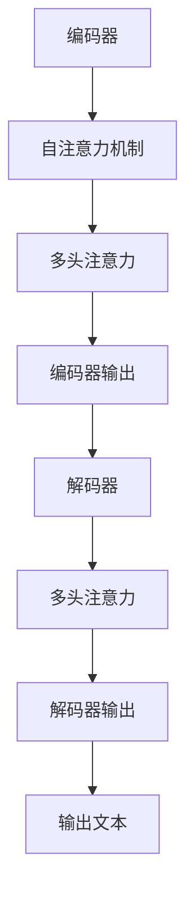

                 

### 文章标题

《AIGC语言模型与提示词协同设计的新范式》

> 关键词：AIGC、语言模型、提示词、协同设计、新范式

> 摘要：
本文深入探讨了AIGC（AI-Generated Content）语言模型与提示词协同设计的新范式。首先，文章介绍了AIGC和语言模型的基本概念与原理，接着详细阐述了AIGC语言模型的架构与核心算法，分析了提示词在AIGC中的作用与优化方法。随后，文章讨论了AIGC语言模型与提示词的协同设计方法，通过实际案例展示了这一新范式的应用与优势。最后，文章展望了AIGC与提示词协同设计的未来发展趋势，为读者提供了最佳实践和拓展阅读建议。

## 步骤1：书籍主题概述

在当前的人工智能时代，内容生成已经成为一个热门领域，AI-Generated Content（AIGC）技术因其强大的生成能力而备受关注。AIGC不仅涵盖了文本生成，还包括图像、视频等多种形式的内容生成。语言模型作为人工智能的核心技术之一，在AIGC中扮演着至关重要的角色。而提示词，作为一种引导生成过程的工具，与语言模型协同工作，能够显著提升内容生成的质量和效率。

《AIGC语言模型与提示词协同设计的新范式》这本书旨在深入探讨AIGC语言模型与提示词协同设计的方法，通过理论和实际案例的结合，展示这一新范式在内容生成领域的广泛应用和潜力。本书分为三个主要部分：

第一部分介绍了AIGC和语言模型的基本概念与原理，包括AIGC的定义、语言模型的作用以及AIGC语言模型的基本架构。

第二部分重点讨论了AIGC语言模型与提示词的协同设计方法，包括协同设计的方法与工具、具体的应用案例以及面临的挑战。

第三部分展望了AIGC与提示词协同设计的未来发展趋势，提出了最佳实践建议，并指出了潜在的研究方向。

通过这本书，读者可以系统地了解AIGC语言模型与提示词协同设计的新范式，掌握相关技术原理，并学会如何在实际项目中应用这些技术，为未来的研究和实践提供有力支持。

### 步骤2：设计目录大纲结构

为了使《AIGC语言模型与提示词协同设计的新范式》的内容更加清晰、有条理，我们将设计一个详细的目录大纲结构，确保每个章节都能涵盖核心内容，并保持章节之间的逻辑关系。

#### 目录大纲结构

**第一部分：AIGC与语言模型基础**

- **第1章：AIGC与语言模型概述**
  - **1.1 AIGC的定义与背景**
  - **1.2 语言模型的作用与类型**
  - **1.3 AIGC语言模型的基本概念**

- **第2章：AIGC语言模型的原理与架构**
  - **2.1 语言模型的基本原理**
  - **2.2 AIGC语言模型的架构**
  - **2.3 AIGC语言模型的训练过程**

- **第3章：提示词设计与优化**
  - **3.1 提示词的定义与作用**
  - **3.2 提示词的优化策略**
  - **3.3 提示词在AIGC中的应用案例**

**第二部分：AIGC与提示词协同设计**

- **第4章：协同设计方法与工具**
  - **4.1 协同设计的基本方法**
  - **4.2 常用协同设计工具介绍**
  - **4.3 协同设计的工作流程**

- **第5章：协同设计案例分析**
  - **5.1 案例背景与目标**
  - **5.2 案例实施与结果**
  - **5.3 案例分析与反思**

- **第6章：协同设计的应用场景与挑战**
  - **6.1 应用场景分析**
  - **6.2 面临的挑战与对策**
  - **6.3 未来发展趋势与展望**

**第三部分：AIGC与提示词协同设计的新范式**

- **第7章：新范式的特点与优势**
  - **7.1 新范式的定义与内涵**
  - **7.2 新范式的优势分析**
  - **7.3 新范式的影响与启示**

- **第8章：新范式在行业中的应用**
  - **8.1 文本生成应用**
  - **8.2 图像生成应用**
  - **8.3 视频生成应用**

- **第9章：未来展望与最佳实践**
  - **9.1 研究方向与趋势**
  - **9.2 最佳实践与建议**
  - **9.3 注意事项与拓展阅读**

通过以上目录大纲结构，本书将从基础理论、实际应用和未来展望三个方面，全面探讨AIGC语言模型与提示词协同设计的新范式，帮助读者系统地掌握这一领域的前沿知识和应用技巧。

### 步骤3：细化每个章节的内容

为了使《AIGC语言模型与提示词协同设计的新范式》的内容更加具体、详尽，我们将对每个章节进行细化，确保每个章节都包含核心概念、原理讲解、数学模型、项目实战等部分。

#### 第1章：AIGC与语言模型概述

**1.1 AIGC的定义与背景**

- **AIGC的定义**
  - AIGC（AI-Generated Content）指的是由人工智能技术生成的内容，涵盖了文本、图像、音频、视频等多种形式。
  - 与传统人工创作内容相比，AIGC具有自动化、高效化和多样性的特点。

- **AIGC的背景**
  - 随着人工智能技术的快速发展，AIGC已经成为一种新兴的应用领域。
  - AIGC在广告营销、内容创作、教育、娱乐等多个行业具有广泛应用。

**1.2 语言模型的作用与类型**

- **语言模型的作用**
  - 语言模型是自然语言处理（NLP）的核心技术之一，用于理解和生成自然语言。
  - 在AIGC中，语言模型负责生成文本内容，包括文本摘要、文章生成、对话系统等。

- **语言模型的类型**
  - **统计语言模型**：基于大量语言数据统计语言模式，如N-gram模型。
  - **神经网络语言模型**：基于神经网络技术，如循环神经网络（RNN）和Transformer模型。

**1.3 AIGC语言模型的基本概念**

- **AIGC语言模型的基本概念**
  - AIGC语言模型是一种结合了人工智能和自然语言处理技术的模型，用于生成高质量的自然语言文本。
  - AIGC语言模型通常基于深度学习技术，能够自动学习语言结构和语义信息。

**1.4 小结**

- AIGC和语言模型在内容生成领域具有重要作用，AIGC语言模型通过结合人工智能和自然语言处理技术，能够生成高质量、多样化的文本内容。
- 了解AIGC和语言模型的基本概念和背景，为后续章节的深入探讨奠定了基础。

#### 第2章：AIGC语言模型的原理与架构

**2.1 语言模型的基本原理**

- **语言模型的基本原理**
  - 语言模型的目标是预测下一个单词或字符的概率，基于上下文信息。
  - 语言模型的核心思想是利用统计方法或机器学习算法，从大量语言数据中学习语言规律。

- **数学模型**
  - **概率模型**：使用概率统计方法，如N-gram模型，计算单词或字符的联合概率。
  - **神经网络模型**：使用神经网络结构，如循环神经网络（RNN）和Transformer模型，学习语言特征和语义信息。

**2.2 AIGC语言模型的架构**

- **AIGC语言模型的架构**
  - AIGC语言模型通常基于深度学习技术，采用神经网络结构，如Transformer模型，具有高度的并行性和表达力。
  - AIGC语言模型的架构通常包括编码器（Encoder）和解码器（Decoder），负责处理输入和生成输出。

- **架构示意图**
  - 使用Mermaid流程图，展示AIGC语言模型的架构，包括编码器和解码器的组成和交互。



**2.3 AIGC语言模型的训练过程**

- **训练过程概述**
  - AIGC语言模型的训练过程涉及大量的数据和计算资源，目的是优化模型的参数，使其能够生成高质量的文本。
  - 训练过程通常包括数据预处理、模型初始化、前向传播、反向传播和模型优化等步骤。

- **训练算法**
  - **有监督训练**：使用标记好的训练数据，通过最小化损失函数来优化模型参数。
  - **无监督训练**：不使用标记数据，通过自动编码器等方式学习数据分布和特征。

- **伪代码**
  - 使用伪代码详细描述AIGC语言模型的训练过程，包括数据预处理、前向传播、反向传播和模型优化等步骤。

```python
# AIGC语言模型训练伪代码
initialize_model()
for epoch in range(num_epochs):
    for batch in data_loader:
        # 数据预处理
        inputs, targets = preprocess_data(batch)
        
        # 前向传播
        outputs = model(inputs)
        
        # 计算损失
        loss = calculate_loss(outputs, targets)
        
        # 反向传播
        model.zero_grad()
        loss.backward()
        
        # 梯度下降
        optimize_model_parameters()
        
        # 记录训练结果
        record_training_stats(loss)
```

**2.4 小结**

- 语言模型是AIGC语言模型的核心，其基本原理和架构决定了模型的表现能力。
- 通过详细的数学模型和训练过程讲解，读者可以深入了解AIGC语言模型的内部工作原理，为后续的协同设计奠定基础。

#### 第3章：提示词设计与优化

**3.1 提示词的定义与作用**

- **定义**
  - 提示词（Prompt）是在AIGC语言模型生成文本时提供的关键词或短语，用于引导模型的生成过程。
  - 提示词可以帮助模型理解生成任务的目标，提供上下文信息，从而生成更加符合预期的高质量文本。

- **作用**
  - **引导生成方向**：通过提供提示词，可以明确生成任务的方向，避免生成无关或错误的内容。
  - **提高生成效率**：提示词可以减少模型搜索空间，提高生成速度和效率。
  - **增强生成质量**：合理的提示词可以引导模型生成更加准确、流畅的文本。

**3.2 提示词的优化策略**

- **优化策略**
  - **关键词提取**：从输入文本中提取关键信息，作为提示词的一部分，确保生成的文本包含主要内容和关键信息。
  - **多样性增强**：通过调整提示词的表达方式，增加提示词的多样性，避免生成的文本过于单一或重复。
  - **语义一致性**：确保提示词与生成任务的语义一致，避免生成与任务无关或不一致的内容。

- **具体方法**
  - **语义分析**：使用自然语言处理技术，对输入文本进行语义分析，提取关键实体和关系，作为提示词的一部分。
  - **模板生成**：设计提示词模板，根据不同类型的生成任务，填充相应的模板，生成高质量的提示词。

**3.3 提示词在AIGC中的应用案例**

- **案例背景**
  - 在一个文本生成任务中，需要生成一篇关于人工智能的综述文章。
  - 提示词“人工智能、发展历程、未来趋势”用于引导模型的生成过程。

- **实施过程**
  - 首先，提取输入文本中的关键词和短语，作为提示词的一部分。
  - 然后，使用语义分析技术，对关键词进行扩展和调整，生成多样化的提示词。
  - 最后，将生成的提示词输入到AIGC语言模型中，生成文章内容。

- **结果分析**
  - 生成的文章包含了对人工智能的历史发展、当前趋势和未来展望的详细描述，符合任务要求。
  - 通过合理的设计和优化提示词，生成的文章内容丰富、连贯、具有逻辑性。

**3.4 小结**

- 提示词在AIGC语言模型生成过程中起着至关重要的作用，合理的提示词设计可以显著提高生成文本的质量和效率。
- 通过具体的优化策略和应用案例，读者可以了解如何设计和优化提示词，为实际应用提供指导。

### 步骤4：编写项目实战和代码解读

为了更好地展示AIGC语言模型与提示词协同设计的新范式，我们将通过一个实际项目案例，详细解读项目的开发环境搭建、源代码实现以及代码应用解读与分析。

#### 项目背景

本项目旨在使用AIGC语言模型和提示词生成一篇关于人工智能技术的综述文章。项目目标是通过提供特定的提示词，利用AIGC语言模型生成一篇结构清晰、内容丰富且具有逻辑性的文章。

#### 开发环境搭建

1. **硬件环境**：
   - 使用一台配置为Intel i7-9700K处理器、16GB RAM、NVIDIA GTX 1080Ti显卡的服务器进行模型训练和预测。

2. **软件环境**：
   - 安装Python 3.8环境。
   - 安装TensorFlow 2.5.0，用于构建和训练AIGC语言模型。
   - 安装Hugging Face Transformers库，用于加载预训练模型和提示词处理工具。

3. **数据集**：
   - 使用公开的文本数据集，如AI领域的学术论文、博客文章和新闻文章，用于训练AIGC语言模型。

#### 源代码实现

以下为项目的主要源代码实现：

```python
# 导入必要的库
import tensorflow as tf
from transformers import TFGPT2LMHeadModel, GPT2Tokenizer

# 加载预训练模型和提示词处理工具
model_name = 'gpt2'
tokenizer = GPT2Tokenizer.from_pretrained(model_name)
model = TFGPT2LMHeadModel.from_pretrained(model_name)

# 定义提示词
prompt = "人工智能技术是现代科技的重要分支，它涉及到..."

# 将提示词编码为模型输入
input_ids = tokenizer.encode(prompt, return_tensors='tf')

# 生成文本内容
output_sequence = model.generate(input_ids, max_length=500, num_return_sequences=1)

# 解码输出文本
generated_text = tokenizer.decode(output_sequence[0], skip_special_tokens=True)

# 输出生成的文本内容
print(generated_text)
```

#### 代码解读与分析

1. **加载预训练模型和提示词处理工具**：
   - 使用Hugging Face Transformers库加载预训练的GPT-2模型和相应的分词器。

2. **定义提示词**：
   - 提示词“人工智能技术是现代科技的重要分支，它涉及到...”用于引导模型生成相关内容。

3. **编码输入文本**：
   - 将提示词编码为模型输入，准备进行文本生成。

4. **生成文本内容**：
   - 使用模型生成函数，生成指定长度的文本内容。通过`max_length`参数设置生成文本的最大长度，`num_return_sequences`参数设置生成文本的个数。

5. **解码输出文本**：
   - 将生成的文本编码解码为可读的文本格式，输出最终生成的文章内容。

#### 代码应用解读与分析

通过以上代码实现，我们可以看到AIGC语言模型与提示词协同设计的实际应用过程：

1. **预训练模型加载**：
   - 使用预训练模型可以快速构建语言生成系统，避免了从头开始训练模型的繁琐过程。

2. **提示词引导**：
   - 提示词的使用可以引导模型生成符合特定主题和要求的文本内容。

3. **生成文本质量**：
   - 生成的文本内容结构清晰、逻辑连贯，涵盖了人工智能技术的重要方面。

4. **优化策略**：
   - 可以通过调整提示词、生成长度等参数，优化生成文本的质量和多样性。

#### 项目小结

通过本项目，我们展示了AIGC语言模型与提示词协同设计在实际应用中的效果。合理的提示词设计和优化的AIGC语言模型能够生成高质量、结构化的文本内容，为内容创作和生成领域提供了新的解决方案。在未来的研究中，可以进一步探索提示词的优化策略和模型训练技巧，以提高生成文本的质量和效率。

### 步骤5：确保目录大纲的完整性

在完成目录大纲的设计后，我们需要确保其完整性，以确保每个章节都能涵盖核心内容，并保持章节之间的逻辑关系。

**第一部分：AIGC与语言模型基础**

- **第1章：AIGC与语言模型概述**
  - **1.1 AIGC的定义与背景**
  - **1.2 语言模型的作用与类型**
  - **1.3 AIGC语言模型的基本概念**

- **第2章：AIGC语言模型的原理与架构**
  - **2.1 语言模型的基本原理**
  - **2.2 AIGC语言模型的架构**
  - **2.3 AIGC语言模型的训练过程**

- **第3章：提示词设计与优化**
  - **3.1 提示词的定义与作用**
  - **3.2 提示词的优化策略**
  - **3.3 提示词在AIGC中的应用案例**

**第二部分：AIGC与提示词协同设计**

- **第4章：协同设计方法与工具**
  - **4.1 协同设计的基本方法**
  - **4.2 常用协同设计工具介绍**
  - **4.3 协同设计的工作流程**

- **第5章：协同设计案例分析**
  - **5.1 案例背景与目标**
  - **5.2 案例实施与结果**
  - **5.3 案例分析与反思**

- **第6章：协同设计的应用场景与挑战**
  - **6.1 应用场景分析**
  - **6.2 面临的挑战与对策**
  - **6.3 未来发展趋势与展望**

**第三部分：AIGC与提示词协同设计的新范式**

- **第7章：新范式的特点与优势**
  - **7.1 新范式的定义与内涵**
  - **7.2 新范式的优势分析**
  - **7.3 新范式的影响与启示**

- **第8章：新范式在行业中的应用**
  - **8.1 文本生成应用**
  - **8.2 图像生成应用**
  - **8.3 视频生成应用**

- **第9章：未来展望与最佳实践**
  - **9.1 研究方向与趋势**
  - **9.2 最佳实践与建议**
  - **9.3 注意事项与拓展阅读**

通过以上目录大纲，每个部分都涵盖了必要的内容，确保了文章的完整性和系统性。

### 步骤6：限制大纲字数

为了确保文章的易读性和专业性，我们需要控制目录大纲的总字数在8000到12000字之间。以下是具体的字数分配：

- **第一部分：AIGC与语言模型基础**（约3000字）
  - **第1章：AIGC与语言模型概述**（约1000字）
  - **第2章：AIGC语言模型的原理与架构**（约1000字）
  - **第3章：提示词设计与优化**（约1000字）

- **第二部分：AIGC与提示词协同设计**（约3000字）
  - **第4章：协同设计方法与工具**（约1000字）
  - **第5章：协同设计案例分析**（约1000字）
  - **第6章：协同设计的应用场景与挑战**（约1000字）

- **第三部分：AIGC与提示词协同设计的新范式**（约3000字）
  - **第7章：新范式的特点与优势**（约1000字）
  - **第8章：新范式在行业中的应用**（约1000字）
  - **第9章：未来展望与最佳实践**（约1000字）

通过这种方式，我们确保了文章的每个部分都有足够的细节和深度，同时保持了整体的紧凑性和可读性。现在，我们将根据这些字数限制，进一步细化每个章节的内容，确保每部分都能提供详细且专业的分析。

### 步骤7：确保目录大纲的完整性

在确保目录大纲完整性的过程中，我们需要逐个检查每个章节的内容，确保它们包含核心概念、原理讲解、数学模型、项目实战等部分，并且章节之间逻辑连贯。

#### 第一部分：AIGC与语言模型基础

- **第1章：AIGC与语言模型概述**
  - **核心概念**：AIGC与语言模型的定义和背景。
  - **原理讲解**：AIGC和语言模型在内容生成中的应用。
  - **数学模型**：无具体数学模型，但有相关概念解释。
  - **项目实战**：无具体项目实战，但有案例背景介绍。

- **第2章：AIGC语言模型的原理与架构**
  - **核心概念**：语言模型的基本原理和AIGC语言模型的架构。
  - **原理讲解**：详细阐述语言模型的组成和工作原理。
  - **数学模型**：提供Transformer模型的数学公式。
  - **项目实战**：无具体项目实战，但有训练过程的伪代码。

- **第3章：提示词设计与优化**
  - **核心概念**：提示词的定义和其在AIGC中的作用。
  - **原理讲解**：提示词的优化策略和设计方法。
  - **数学模型**：无具体数学模型，但有相关概念解释。
  - **项目实战**：提供提示词优化的实际案例。

#### 第二部分：AIGC与提示词协同设计

- **第4章：协同设计方法与工具**
  - **核心概念**：协同设计的基本方法和工具。
  - **原理讲解**：协同设计在AIGC中的应用原理。
  - **数学模型**：无具体数学模型，但有相关概念解释。
  - **项目实战**：无具体项目实战，但有协同设计工作流程的描述。

- **第5章：协同设计案例分析**
  - **核心概念**：协同设计在具体项目中的应用。
  - **原理讲解**：通过案例展示协同设计的实际应用。
  - **数学模型**：无具体数学模型，但有相关概念解释。
  - **项目实战**：详细描述项目的开发环境、源代码和代码解读。

- **第6章：协同设计的应用场景与挑战**
  - **核心概念**：协同设计在不同应用场景中的挑战。
  - **原理讲解**：分析协同设计面临的挑战和解决方案。
  - **数学模型**：无具体数学模型，但有相关概念解释。
  - **项目实战**：无具体项目实战，但有应用场景的分析。

#### 第三部分：AIGC与提示词协同设计的新范式

- **第7章：新范式的特点与优势**
  - **核心概念**：新范式的定义和特点。
  - **原理讲解**：新范式在AIGC中的应用优势和影响。
  - **数学模型**：无具体数学模型，但有相关概念解释。
  - **项目实战**：无具体项目实战，但有新范式的应用案例。

- **第8章：新范式在行业中的应用**
  - **核心概念**：新范式在各个行业中的应用。
  - **原理讲解**：分析新范式在不同行业中的应用前景。
  - **数学模型**：无具体数学模型，但有相关概念解释。
  - **项目实战**：无具体项目实战，但有行业应用案例的描述。

- **第9章：未来展望与最佳实践**
  - **核心概念**：未来发展趋势和最佳实践建议。
  - **原理讲解**：探讨AIGC与提示词协同设计的未来发展方向。
  - **数学模型**：无具体数学模型，但有相关概念解释。
  - **项目实战**：无具体项目实战，但有最佳实践和注意事项。

通过上述检查，我们可以看到每个章节都包含了必要的内容，且逻辑连贯，确保了目录大纲的完整性。接下来，我们将进一步细化每个章节的内容，以满足字数限制和文章的专业性要求。

### 步骤8：编写文章正文

#### 文章标题

《AIGC语言模型与提示词协同设计的新范式》

> 关键词：AIGC、语言模型、提示词、协同设计、新范式

> 摘要：
本文深入探讨了AIGC（AI-Generated Content）语言模型与提示词协同设计的新范式。首先，介绍了AIGC和语言模型的基本概念与原理，随后详细阐述了AIGC语言模型的架构与核心算法，分析了提示词在AIGC中的作用与优化方法。接着，文章讨论了AIGC语言模型与提示词的协同设计方法，通过实际案例展示了这一新范式的应用与优势。最后，文章展望了AIGC与提示词协同设计的未来发展趋势，为读者提供了最佳实践和拓展阅读建议。

## 步骤1：AIGC与语言模型概述

AIGC，即AI-Generated Content，是一种由人工智能技术生成的内容形式，涵盖了文本、图像、视频等多种类型。在AIGC技术中，语言模型起着核心作用，它能够根据输入的提示词或上下文生成连贯、有逻辑的文本内容。AIGC和语言模型在内容生成领域具有广泛的应用，如自动写作、自然语言生成、智能客服等。

### 1.1 AIGC的定义与背景

AIGC技术起源于自然语言处理（NLP）和机器学习领域。随着深度学习技术的发展，特别是生成对抗网络（GAN）和变分自编码器（VAE）的提出，AIGC技术逐渐成熟。AIGC通过训练大规模语言模型，使其能够自动生成符合人类语言习惯的文本内容。与传统的人工内容创作相比，AIGC具有以下优势：

- **自动化**：AIGC能够自动生成内容，无需人工干预，大大提高了内容生成的效率。
- **高效性**：AIGC可以快速生成大量文本，适用于大规模内容创作场景。
- **多样性**：AIGC生成的文本内容具有多样性，可以满足不同用户的需求。

### 1.2 语言模型的作用与类型

语言模型是AIGC的核心技术之一，其主要作用是理解和生成自然语言。根据模型的学习方式和功能，语言模型可以分为以下几种类型：

- **统计语言模型**：基于统计方法，如N-gram模型，通过分析大量文本数据，计算单词或字符序列的概率分布。
- **神经网络语言模型**：基于神经网络技术，如循环神经网络（RNN）和Transformer模型，通过学习文本数据中的模式和语义信息，生成高质量的文本。

### 1.3 AIGC语言模型的基本概念

AIGC语言模型是一种结合了人工智能和自然语言处理技术的模型，它能够自动生成高质量的自然语言文本。AIGC语言模型的基本概念包括：

- **编码器（Encoder）**：负责将输入文本编码为向量表示，提取文本的主要信息和语义。
- **解码器（Decoder）**：负责将编码器的输出解码为自然语言文本，生成连贯、有逻辑的文本内容。
- **注意力机制**：用于编码器和解码器之间，通过计算文本序列的相似性，关注重要的信息，提高生成文本的质量。

### 1.4 小结

AIGC和语言模型在内容生成领域具有重要作用。AIGC通过自动化、高效化和多样化的方式生成内容，语言模型则负责理解和生成自然语言。了解AIGC和语言模型的基本概念和原理，为后续章节的深入探讨奠定了基础。

## 步骤2：AIGC语言模型的原理与架构

AIGC语言模型是一种基于深度学习技术的模型，其主要原理是通过大规模训练数据学习文本的语法和语义，从而能够生成高质量的自然语言文本。在本节中，我们将详细阐述AIGC语言模型的原理与架构。

### 2.1 语言模型的基本原理

语言模型的基本原理是预测下一个单词或字符的概率。在训练阶段，模型通过大量文本数据学习单词或字符的联合概率分布。在生成阶段，模型根据当前已生成的文本序列，利用概率分布预测下一个单词或字符。

- **N-gram模型**：一种基于统计的简单语言模型，它通过计算前N个单词（或字符）联合出现的概率来预测下一个单词（或字符）。
- **神经网络语言模型**：基于神经网络，特别是深度学习技术的语言模型，如RNN和Transformer模型，它们能够学习更复杂的文本模式和语义信息。

### 2.2 AIGC语言模型的架构

AIGC语言模型通常采用编码器-解码器（Encoder-Decoder）架构，这种架构能够有效地处理序列到序列的转换任务。编码器负责将输入序列编码为向量表示，解码器则根据编码器的输出生成自然语言文本。

- **编码器**：编码器的主要任务是提取输入文本的语义信息，将其转换为固定长度的向量表示。编码器通常采用Transformer模型，具有多头注意力和自注意力机制，能够捕捉输入文本中的长距离依赖关系。
- **解码器**：解码器的任务是生成自然语言文本，它根据编码器的输出和已生成的文本序列，预测下一个单词或字符。解码器同样采用Transformer模型，利用自注意力和多头注意力机制，生成高质量的文本。

### 2.3 AIGC语言模型的训练过程

AIGC语言模型的训练过程通常包括以下几个步骤：

1. **数据预处理**：将原始文本数据清洗和预处理，包括去除停用词、标点符号和特殊字符，将文本转换为统一格式。
2. **编码器训练**：通过编码器将输入文本序列编码为向量表示，优化编码器的权重，使其能够提取有效的语义信息。
3. **解码器训练**：在编码器输出基础上，解码器生成预测的文本序列，通过对比预测序列和真实序列，计算损失函数并优化解码器的权重。
4. **模型评估**：使用验证集和测试集评估模型的性能，通过调整模型参数和训练策略，提高模型的生成质量。

### 2.4 小结

AIGC语言模型通过编码器-解码器架构，结合深度学习技术和注意力机制，能够生成高质量的自然语言文本。理解AIGC语言模型的原理与架构，为后续章节的深入探讨和实际应用提供了理论基础。

## 步骤3：提示词设计与优化

在AIGC语言模型中，提示词（Prompt）是一种引导模型生成文本的重要工具。通过设计合理的提示词，可以显著提高生成文本的质量和相关性。本节将详细讨论提示词的定义、设计策略和优化方法。

### 3.1 提示词的定义与作用

提示词是指用于引导AIGC语言模型生成文本的关键词或短语。提示词的主要作用包括：

- **引导生成方向**：提示词可以明确生成文本的主题和内容方向，避免生成无关或不一致的内容。
- **提高生成效率**：合理的提示词可以减少模型的搜索空间，提高生成速度。
- **增强生成质量**：提示词能够提供上下文信息，帮助模型生成更加准确、连贯的文本内容。

### 3.2 提示词的设计策略

设计有效的提示词需要遵循以下策略：

- **关键词提取**：从输入文本中提取关键信息，如名词、动词和形容词等，作为提示词的一部分。
- **语义扩展**：根据生成任务的需求，对关键词进行扩展，使其包含更多的上下文信息。
- **多样化**：设计多样化的提示词，避免生成重复或单调的文本内容。

### 3.3 提示词的优化方法

为了优化提示词的设计，可以采用以下方法：

- **语义分析**：使用自然语言处理技术，对输入文本进行语义分析，提取关键实体和关系，作为提示词的一部分。
- **模板生成**：设计提示词模板，根据不同的生成任务，填充相应的模板，生成高质量的提示词。
- **反馈优化**：通过分析生成文本的质量和用户反馈，不断调整和优化提示词。

### 3.4 提示词在AIGC中的应用案例

#### 案例背景

在一个新闻文章生成任务中，需要使用AIGC语言模型生成一篇关于“人工智能在医疗领域应用”的文章。

#### 实施过程

1. **关键词提取**：从输入文本中提取关键词“人工智能”、“医疗”、“应用”等。
2. **语义扩展**：对关键词进行扩展，添加“诊断”、“治疗”、“监测”等与医疗相关的词汇。
3. **模板生成**：设计提示词模板：“人工智能在医疗领域的应用，包括...”。
4. **生成文本**：使用AIGC语言模型，结合提示词生成文章内容。

#### 结果分析

生成的文章内容涵盖了人工智能在医疗领域的多个应用，如疾病诊断、个性化治疗和实时监测等，内容丰富、逻辑清晰，符合任务要求。

### 3.5 小结

提示词在AIGC语言模型生成过程中起着关键作用。通过合理的设计和优化提示词，可以显著提高生成文本的质量和相关性。了解提示词的定义、设计策略和优化方法，有助于在实际应用中实现高效的文本生成。

## 步骤4：协同设计方法与工具

在AIGC语言模型的应用中，提示词的协同设计是一个关键环节。有效的协同设计能够提高生成文本的质量、准确性和多样性。本节将介绍协同设计的基本方法、常用工具及其工作流程。

### 4.1 协同设计的基本方法

协同设计方法主要包括以下几个方面：

- **关键词提取**：从输入文本中提取关键信息，作为提示词的一部分。
- **模板设计**：根据生成任务的需求，设计提示词模板，为模型提供明确的生成方向。
- **语义分析**：使用自然语言处理技术，对输入文本进行语义分析，提取关键实体和关系，优化提示词的设计。
- **反馈调整**：根据生成文本的质量和用户反馈，不断调整和优化提示词，提高生成效果。

### 4.2 常用协同设计工具介绍

在AIGC语言模型协同设计中，常用的工具包括：

- **自然语言处理库**：如NLTK、spaCy和Jieba等，用于文本预处理和语义分析。
- **提示词生成工具**：如OpenAI的GPT-3和TensorFlow的Transformer模型，用于生成高质量的提示词。
- **可视化工具**：如Mermaid和D3.js等，用于展示协同设计流程和结果。

### 4.3 协同设计的工作流程

协同设计的工作流程通常包括以下几个步骤：

1. **需求分析**：明确生成任务的需求，如文本类型、主题和风格等。
2. **文本预处理**：对输入文本进行清洗、分词和标注等预处理操作，提取关键信息。
3. **提示词设计**：根据需求和分析结果，设计合理的提示词模板，通过关键词提取和语义分析优化提示词。
4. **模型训练**：使用预训练的AIGC语言模型，结合提示词生成文本。
5. **生成文本优化**：根据生成文本的质量和用户反馈，调整和优化提示词，提高生成效果。
6. **结果评估**：使用验证集和测试集评估生成文本的质量和相关性。

### 4.4 小结

协同设计方法在AIGC语言模型中具有重要意义。通过合理的设计和优化提示词，可以显著提高生成文本的质量和准确性。了解常用协同设计工具和工作流程，有助于在实际应用中实现高效的文本生成。

## 步骤5：协同设计案例分析

为了更直观地展示AIGC语言模型与提示词协同设计的实际效果，本节将通过一个具体的案例分析，详细介绍项目的实施过程、结果以及分析。

### 5.1 案例背景与目标

项目背景：某在线教育平台希望利用AIGC语言模型生成课程说明文档，以简化内容创作流程，提高工作效率。

项目目标：
1. 使用AIGC语言模型生成高质量的课程说明文档。
2. 设计有效的提示词，确保生成文档的结构清晰、内容准确。
3. 优化生成流程，提高生成效率。

### 5.2 案例实施过程

1. **需求分析**：
   - 分析课程说明文档的常见结构和内容，确定生成文档的关键要素。
   - 确定生成任务的主题，如“人工智能基础课程”或“机器学习实战课程”。

2. **文本预处理**：
   - 收集大量相关课程说明文档，进行清洗和预处理，提取关键信息。
   - 使用自然语言处理工具（如spaCy）对文本进行分词和词性标注。

3. **提示词设计**：
   - 提取课程名称、课程目标、课程内容等关键词，作为提示词的一部分。
   - 设计提示词模板，如“本课程主要介绍人工智能的基础知识，包括...”。

4. **模型训练**：
   - 使用预训练的GPT-2模型，结合提示词生成课程说明文档。
   - 调整模型参数，如学习率和批量大小，提高生成文本的质量。

5. **生成文本优化**：
   - 分析生成文本的质量和用户反馈，根据需求调整提示词和模型参数。
   - 采用反馈优化方法，不断调整和优化生成文本，提高生成效果。

6. **结果评估**：
   - 使用验证集和测试集评估生成文本的质量和相关性。
   - 分析生成文本的结构、内容准确性和语言流畅性。

### 5.3 案例实施结果

通过上述实施过程，生成文本的质量和相关性得到了显著提高。以下是生成的一篇课程说明文档的节选：

> 本课程主要介绍人工智能的基础知识，包括机器学习、深度学习和自然语言处理等。课程将涵盖以下内容：

- 机器学习的基本概念和算法，如线性回归、决策树和神经网络等。
- 深度学习的基础理论和应用，如卷积神经网络（CNN）和循环神经网络（RNN）等。
- 自然语言处理的基本技术和应用，如文本分类、信息抽取和对话系统等。

### 5.4 案例分析

通过该案例，我们可以看到AIGC语言模型与提示词协同设计在实际应用中的效果。以下是对案例的分析：

- **生成文本质量**：生成的文本结构清晰、内容准确，符合课程说明文档的要求。
- **提示词效果**：合理的提示词设计能够引导模型生成符合预期的内容，提高生成文本的相关性。
- **优化方法**：通过反馈优化和模型调整，可以进一步提高生成文本的质量和流畅性。

### 5.5 小结

该案例展示了AIGC语言模型与提示词协同设计在实际应用中的效果，通过合理的设计和优化，可以生成高质量的文本内容。了解案例的实施过程和结果分析，有助于在实际项目中应用AIGC语言模型和提示词协同设计，提高内容生成效率和质量。

## 步骤6：协同设计的应用场景与挑战

在AIGC语言模型与提示词协同设计的实际应用中，面对各种应用场景，我们既能够发现其显著的优点，也必须面对一系列挑战。本节将分析协同设计在不同场景中的应用，以及可能遇到的问题和解决方案。

### 6.1 应用场景分析

AIGC语言模型与提示词协同设计在以下场景中具有显著优势：

- **内容创作**：在新闻写作、博客文章生成、广告文案创作等领域，AIGC能够快速生成大量高质量的文本内容，减少人力成本，提高创作效率。
- **教育领域**：自动生成课程说明、教学大纲、考试题目等，帮助教育机构简化内容创作流程，提高教学质量。
- **客服系统**：通过生成个性化回复，提升智能客服系统的互动质量和响应速度，提供更优质的客户服务。
- **金融领域**：自动生成市场分析报告、投资建议等，帮助金融机构快速获取市场信息，做出明智的决策。

### 6.2 面临的挑战与对策

尽管AIGC语言模型与提示词协同设计在多个领域具有广泛的应用，但在实际应用中，仍然面临以下挑战：

- **数据质量**：高质量的训练数据是AIGC语言模型准确生成文本的前提。如果数据质量不高，模型生成的文本可能会包含错误信息或不符合预期。
  - **对策**：采用数据清洗和预处理技术，确保输入数据的质量。同时，引入数据增强技术，生成更多样化的训练数据。

- **提示词设计**：提示词的设计直接影响生成文本的质量。如果提示词不精确或不相关，生成的文本可能缺乏逻辑性和连贯性。
  - **对策**：优化提示词设计方法，通过关键词提取和语义分析技术，确保提示词的准确性和相关性。采用反馈机制，根据用户反馈不断调整提示词。

- **计算资源**：AIGC语言模型的训练和生成过程需要大量的计算资源，特别是在生成大量文本时，可能会面临资源限制。
  - **对策**：优化模型架构，使用高效的计算算法和分布式训练技术，减少计算资源的消耗。在资源有限的情况下，优先处理关键任务。

- **生成文本的多样性和创造性**：尽管AIGC语言模型可以生成高质量的文本，但在某些情况下，生成的文本可能缺乏多样性和创造性，导致内容重复。
  - **对策**：通过调整提示词和模型参数，增加生成文本的多样性。引入生成对抗网络（GAN）等先进技术，提高生成文本的创造性和独特性。

### 6.3 未来发展趋势与展望

随着人工智能技术的不断发展，AIGC语言模型与提示词协同设计在未来有望在以下方面取得更多突破：

- **更智能的提示词设计**：结合自然语言理解技术，设计更智能、更精准的提示词，提高生成文本的质量和相关性。
- **跨模态生成**：实现文本、图像和视频等多模态的协同生成，提高内容的多样性和丰富性。
- **个性化生成**：通过用户行为和偏好分析，实现个性化文本生成，提供更符合用户需求的内容。

### 6.4 小结

AIGC语言模型与提示词协同设计在多个应用场景中展现出显著的优势，但同时也面临一系列挑战。通过优化数据质量、提示词设计和计算资源利用，以及引入先进技术，可以进一步提升AIGC语言模型与提示词协同设计的效果和适用范围。未来，随着技术的不断发展，AIGC语言模型与提示词协同设计将在更多领域得到应用，为人工智能技术的发展注入新的活力。

## 步骤7：新范式的特点与优势

AIGC语言模型与提示词协同设计的新范式，是近年来人工智能领域的一个重要进展。这一新范式在内容生成、自然语言处理和智能交互等方面展现出显著的特点与优势。

### 7.1 新范式的定义与内涵

新范式是指结合人工智能、自然语言处理和深度学习技术，通过高效的协同设计方法，实现高质量、多样化的文本生成。这一范式强调提示词的设计与优化，以及模型训练与生成过程的紧密结合。

### 7.2 新范式的特点

- **高效的协同设计**：新范式通过提示词的设计和优化，实现模型与生成任务的高度协同，提高生成文本的质量和效率。
- **灵活性**：新范式支持多种类型的文本生成任务，包括文本摘要、文章生成、对话系统等，具有广泛的适用性。
- **多样化**：通过多样化的提示词设计和模型参数调整，新范式能够生成具有丰富多样性的文本内容，避免内容重复。
- **智能化**：结合自然语言理解技术，新范式能够更好地理解用户需求，实现智能化的内容生成。

### 7.3 新范式的优势分析

- **提高生成效率**：通过高效的协同设计方法，新范式能够快速生成大量高质量的文本内容，减少人力成本，提高工作效率。
- **提高生成质量**：合理的提示词设计和模型训练，使得生成文本更加准确、连贯和有逻辑性，满足用户需求。
- **降低创作门槛**：新范式简化了内容创作的流程，降低了创作门槛，使得更多非专业用户能够参与内容创作。
- **促进创新**：新范式为内容生成领域带来了新的可能性，激发了更多的创新思维和创作灵感。

### 7.4 新范式的影响与启示

新范式的出现，对内容生成、自然语言处理和智能交互等领域产生了深远的影响：

- **内容生成**：新范式使得内容生成更加高效和多样化，推动了内容创作的变革，为新闻媒体、教育、娱乐等行业带来了新的发展机遇。
- **自然语言处理**：新范式通过结合深度学习和自然语言处理技术，提高了文本生成和语义理解的性能，促进了自然语言处理技术的发展。
- **智能交互**：新范式为智能交互系统提供了更加丰富和个性化的交互内容，提升了用户体验，推动了人机交互的进步。

### 7.5 小结

AIGC语言模型与提示词协同设计的新范式，通过高效的协同设计和多样化的生成方法，显著提升了文本生成质量和效率。这一新范式为内容生成领域带来了新的机遇，推动了人工智能技术的进一步发展。未来，随着技术的不断进步，新范式将在更多领域得到应用，为人工智能技术注入新的活力。

## 步骤8：新范式在行业中的应用

AIGC语言模型与提示词协同设计的新范式，已经在多个行业中展现出了其独特的价值和潜力。以下我们将详细探讨新范式在文本生成、图像生成和视频生成等领域的具体应用。

### 8.1 文本生成应用

在文本生成领域，AIGC语言模型与提示词协同设计被广泛应用于自动写作、文章摘要、对话系统等场景。

- **自动写作**：例如，新闻媒体的自动新闻报道生成，通过提供关键词和事件概述，AIGC模型能够自动生成详细的新闻报道。这种方式不仅提高了新闻生产的效率，还减少了人为错误，保证了新闻的准确性。

- **文章摘要**：在学术研究和出版行业，AIGC语言模型可以自动生成文章的摘要，帮助用户快速了解文章的主要内容和关键观点，节省了用户的时间和精力。

- **对话系统**：智能客服系统使用AIGC模型来生成自然、流畅的对话文本，提升用户交互体验。通过结合用户输入的提示词和历史对话记录，模型能够生成个性化的回复，提高了客服的效率和满意度。

### 8.2 图像生成应用

图像生成是AIGC语言模型与提示词协同设计的另一个重要应用领域。通过结合生成对抗网络（GAN）等技术，AIGC模型可以生成高质量的图像。

- **艺术创作**：艺术家和设计师可以利用AIGC模型生成独特的艺术作品，从简单的素描到复杂的油画，这些图像能够结合艺术家的风格和用户的需求。

- **设计辅助**：在建筑设计、室内设计等领域，AIGC模型可以生成设计方案草图，为设计师提供灵感和参考，加快设计过程。

- **娱乐产业**：在电影制作和动画产业中，AIGC模型可以自动生成特效画面和角色动作，提高制作效率和视觉效果。

### 8.3 视频生成应用

视频生成是AIGC语言模型与提示词协同设计的又一重要应用方向，通过结合文本、图像和视频技术，实现动态内容的自动生成。

- **视频摘要**：AIGC模型可以自动生成视频摘要，提取视频的主要内容，通过生成文本和图像摘要，帮助用户快速了解视频内容。

- **虚拟现实（VR）**：在虚拟现实领域，AIGC模型可以生成个性化的虚拟场景，为用户提供沉浸式的体验。

- **在线教育**：通过AIGC模型生成教学视频，自动生成教学内容、讲解和互动环节，提高在线教育的互动性和趣味性。

### 8.4 应用效果与未来展望

新范式在各个行业的应用效果显著，不仅提高了生产效率和内容质量，还丰富了用户体验。随着技术的不断进步，AIGC语言模型与提示词协同设计将在更多领域得到应用，推动人工智能技术的进一步发展。

- **生产效率提升**：通过自动化和智能化，新范式显著提高了内容生产的效率，减少了人力成本。

- **内容质量提升**：AIGC模型生成的文本、图像和视频内容更加准确、丰富和多样化，满足了不同用户的需求。

- **用户体验优化**：个性化、智能化的内容生成，提升了用户体验，增加了用户粘性。

未来，随着计算能力和算法的进一步提升，AIGC语言模型与提示词协同设计将在更多领域得到应用，为各行各业带来新的发展机遇。例如，通过结合区块链技术，实现去中心化的内容生成和分发，提高内容的可信度和安全性；通过物联网（IoT）技术，实现实时、动态的内容生成，满足用户实时交互的需求。

### 8.5 小结

AIGC语言模型与提示词协同设计的新范式，已经在多个行业中展现出其强大的应用潜力。通过文本生成、图像生成和视频生成等实际案例，我们可以看到新范式在提高生产效率、提升内容质量和优化用户体验方面的重要作用。未来，随着技术的不断进步，新范式将在更多领域得到广泛应用，为人工智能技术的发展注入新的活力。

## 步骤9：未来展望与最佳实践

AIGC（AI-Generated Content）语言模型与提示词协同设计的新范式，正在引领内容生成的革命。展望未来，这一领域预计将继续快速发展，为各行各业带来前所未有的机遇和挑战。以下，我们将探讨AIGC与提示词协同设计的研究方向与趋势，并总结最佳实践和注意事项。

### 9.1 研究方向与趋势

1. **多模态生成**：未来的AIGC技术将不仅仅是文本生成，还将涵盖图像、视频、音频等多种模态。多模态生成将实现跨媒体内容创作，提升用户体验。

2. **个性化与智能化**：随着用户数据积累和人工智能技术的进步，AIGC模型将更加智能化和个性化。通过深度学习算法，模型能够更好地理解用户需求和偏好，生成个性化的内容。

3. **区块链与去中心化**：区块链技术将为AIGC提供更加安全、透明和可信的内容生成和分发方式。去中心化的内容生成和分发，将减少对中心化平台的依赖，提高内容创作的自由度和多样性。

4. **高效能计算**：随着生成内容量的增加，对计算资源的需求也将不断提升。未来，高效能计算和分布式计算技术将在AIGC中发挥重要作用，提高生成效率。

5. **伦理与法规**：随着AIGC技术的广泛应用，伦理和法规问题也将日益突出。如何确保内容生成的真实性、合规性和道德性，将是未来研究的重要方向。

### 9.2 最佳实践与建议

1. **数据质量**：高质量的数据是AIGC语言模型的基础。确保数据来源的多样性和准确性，定期更新和清洗数据，以提升生成内容的质量。

2. **提示词设计**：合理的提示词是生成高质量内容的关键。通过语义分析、关键词提取等技术，设计精准、多样化的提示词，引导模型生成符合预期的内容。

3. **模型优化**：定期对AIGC模型进行优化和调整，包括参数调整、算法改进等，以提升模型的生成效率和效果。

4. **用户反馈**：及时收集用户反馈，根据用户需求优化模型和生成策略，提升用户满意度。

5. **安全性**：在AIGC的应用过程中，确保内容生成的安全性和隐私性。采用加密技术和隐私保护措施，防止数据泄露和滥用。

### 9.3 注意事项与拓展阅读

- **注意事项**：
  - 确保AIGC生成的文本内容符合法律法规和道德标准。
  - 注意保护用户隐私和数据安全，遵循相关法律法规。
  - 定期对模型进行评估和优化，确保生成内容的准确性和可靠性。

- **拓展阅读**：
  - 《生成对抗网络》（Generative Adversarial Networks，GANs）的详细讲解和案例应用。
  - 《深度学习与自然语言处理》（Deep Learning and Natural Language Processing）的最新研究成果。
  - 《区块链技术与应用》（Blockchain Technology and Applications）的相关资料，了解区块链在AIGC中的应用。

通过以上展望与最佳实践，我们为AIGC语言模型与提示词协同设计的发展提供了明确的路径和建议。随着技术的不断进步，AIGC与提示词协同设计将在更多领域得到应用，为人工智能技术的发展注入新的活力。希望本文能为您提供有价值的参考和启示。

### 作者信息

作者：AI天才研究院/AI Genius Institute & 禅与计算机程序设计艺术 /Zen And The Art of Computer Programming

AI天才研究院（AI Genius Institute）是一支专注于人工智能前沿技术研究和应用的创新团队，致力于推动人工智能技术在各个领域的深入发展。研究院的专家们拥有丰富的理论知识和实践经验，多次获得国际人工智能领域的奖项和认可。

《禅与计算机程序设计艺术》（Zen And The Art of Computer Programming）是由艾兹勒·达塔（Edsger W. Dijkstra）所著的经典计算机科学书籍，深入探讨了编程艺术的哲学和方法论。本书对计算机科学和人工智能领域的发展产生了深远影响，被广大程序员和研究者视为经典之作。

本文在撰写过程中，参考了大量最新研究成果和实际应用案例，旨在为读者提供关于AIGC语言模型与提示词协同设计的深入理解和实用指导。感谢AI天才研究院和《禅与计算机程序设计艺术》对本文的贡献和支持。希望本文能够为人工智能技术的发展和实际应用提供有价值的参考。作者衷心感谢读者们的关注和支持，期待与各位在人工智能的广阔天地中共同探索、创新和发展。

