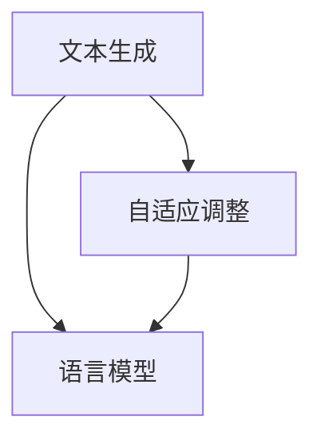
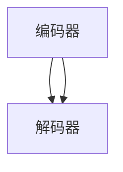
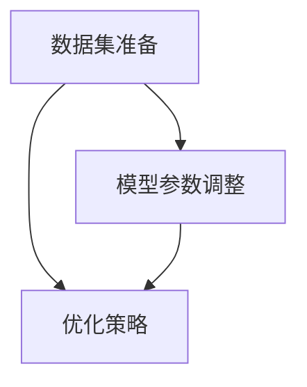
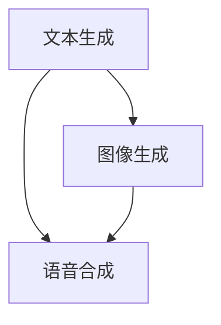
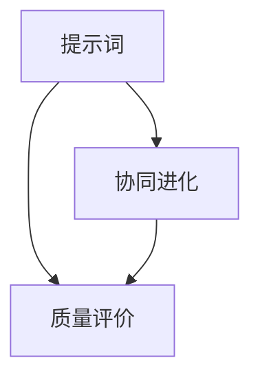
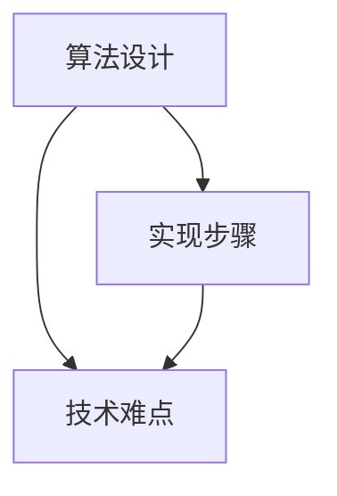
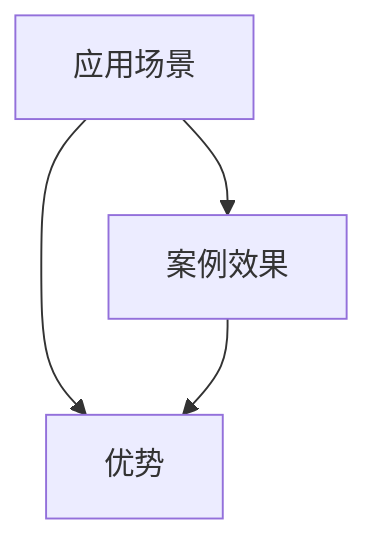

                 


# AIGC语言模型与提示词协同进化的前沿探索

关键词：AIGC语言模型、提示词协同进化、自然语言处理、人工智能、机器学习、算法优化

摘要：本文旨在探讨AIGC（自适应智能生成控制）语言模型与提示词协同进化的前沿探索。首先，我们将介绍AIGC语言模型的基本概念和背景，然后深入分析其架构与原理，以及训练与优化的方法。接着，我们讨论提示词协同进化的原理和实现方法，并通过实际案例分析其应用。最后，我们将探讨AIGC与提示词协同进化的未来趋势，以及面临的技术挑战和未来研究方向。

## 第一部分：AIGC语言模型基础

### 第1章：AIGC语言模型概述

AIGC（Adaptive Intelligent Generation Control）语言模型是一种基于人工智能和机器学习的自然语言处理技术。它通过学习大量的文本数据，能够生成符合语法和语义规则的文本，并在不同场景下进行自适应调整。

#### 背景介绍

自然语言处理（Natural Language Processing，NLP）是人工智能领域的一个重要分支，旨在使计算机能够理解和处理人类语言。随着互联网和大数据的快速发展，NLP技术得到了广泛关注和应用。

#### 核心概念与联系

AIGC语言模型主要包括以下几个核心概念：

1. **文本生成**：AIGC语言模型能够根据输入的文本或提示词生成连贯的文本。
2. **自适应调整**：AIGC模型能够根据不同场景和用户需求进行自适应调整，提高生成文本的质量。
3. **语言模型**：AIGC模型基于大规模语言模型（如Transformer）进行构建，具有较高的生成能力和语义理解能力。

Mermaid 流程图：



#### 算法原理讲解

AIGC语言模型的主要算法原理包括：

1. **预训练**：通过在大规模文本数据集上进行预训练，AIGC模型可以学习到大量的语言知识和模式。
2. **微调**：在特定任务上对预训练模型进行微调，使其适应特定的应用场景。
3. **生成文本**：使用预训练和微调后的模型，根据输入的文本或提示词生成连贯的文本。

伪代码：

```python
def generate_text(prompt):
    # 预处理输入文本
    processed_prompt = preprocess_text(prompt)
    # 生成文本
    generated_text = model.generate_text(processed_prompt)
    return generated_text
```

#### 数学模型和公式

AIGC语言模型通常采用Transformer架构，其核心公式包括：

$$
\text{output} = \text{softmax}(\text{model}(\text{input}))
$$

其中，$\text{input}$为输入的文本或提示词，$\text{model}$为AIGC模型，$\text{softmax}$为输出层的激活函数。

#### 举例说明

假设我们有一个输入文本“今天天气很好”，我们可以使用AIGC模型生成以下文本：

- 输出1：“明天也会很好”
- 输出2：“可以去公园散步”

这些输出文本都是符合语法和语义规则的，并且与输入文本相关。

### 第2章：AIGC模型的架构与原理

AIGC语言模型的架构主要包括编码器（Encoder）和解码器（Decoder）两部分。编码器负责将输入文本编码为向量表示，解码器则将这些向量表示解码为输出文本。

#### 背景介绍

Transformer模型在自然语言处理领域取得了显著的成果，其核心思想是使用自注意力机制（Self-Attention）来处理序列数据。AIGC语言模型基于Transformer模型进行构建，具有强大的生成能力和语义理解能力。

#### 核心概念与联系

AIGC模型的架构主要包括以下几个核心概念：

1. **编码器**：将输入文本编码为向量表示，用于生成文本的上下文信息。
2. **解码器**：将编码器输出的向量表示解码为输出文本，生成符合语法和语义规则的文本。
3. **自注意力机制**：AIGC模型采用自注意力机制来处理输入文本的序列信息，提高生成文本的质量。

Mermaid 流程图：



#### 核心算法原理讲解

AIGC模型的训练过程主要包括以下几个步骤：

1. **数据预处理**：对输入文本进行清洗、分词和编码等预处理操作，将其转换为模型可处理的格式。
2. **编码**：使用编码器将输入文本编码为向量表示，作为解码器的输入。
3. **解码**：使用解码器生成输出文本，并计算损失函数，更新模型参数。
4. **优化**：通过反向传播算法和优化算法，不断迭代训练模型，提高生成文本的质量。

伪代码：

```python
def train_model(data):
    # 预处理输入文本
    processed_data = preprocess_text(data)
    # 编码
    encoded_data = encoder(processed_data)
    # 解码
    generated_text = decoder(encoded_data)
    # 计算损失函数
    loss = compute_loss(processed_data, generated_text)
    # 更新模型参数
    optimizer.step(loss)
```

#### 数学模型和公式

AIGC模型的损失函数通常采用交叉熵（Cross-Entropy）损失函数，其公式如下：

$$
\text{loss} = -\sum_{i=1}^{n} y_i \log(p_i)
$$

其中，$y_i$为实际标签，$p_i$为模型预测的概率分布。

#### 举例说明

假设我们有一个输入文本“今天天气很好”，AIGC模型可以生成以下文本：

- 输出1：“明天也会很好”
- 输出2：“可以出门散步”

这些输出文本都是符合语法和语义规则的，并且与输入文本相关。

### 第3章：AIGC模型的训练与优化

AIGC模型的训练与优化是提高生成文本质量和模型性能的关键环节。在本章中，我们将介绍AIGC模型的训练过程，包括数据集的准备、模型参数的调整和优化策略。

#### 背景介绍

训练过程是AIGC模型从大量文本数据中学习语言知识和模式，并不断提高生成文本质量的过程。优化策略则用于调整模型参数，提高模型性能。

#### 核心概念与联系

AIGC模型的训练与优化主要包括以下几个核心概念：

1. **数据集准备**：准备高质量的训练数据集，包括文本数据和标签。
2. **模型参数调整**：调整模型参数，使其适应不同的训练数据和任务需求。
3. **优化策略**：采用适当的优化算法和策略，提高模型性能。

Mermaid 流程图：



#### 核心算法原理讲解

AIGC模型的训练过程主要包括以下几个步骤：

1. **数据预处理**：对输入文本进行清洗、分词和编码等预处理操作，将其转换为模型可处理的格式。
2. **批次训练**：将训练数据分成批次，依次输入模型进行训练。
3. **损失函数计算**：计算模型在当前批次数据上的损失函数，并更新模型参数。
4. **优化算法**：采用适当的优化算法，如梯度下降（Gradient Descent），更新模型参数。
5. **模型评估**：在测试集上评估模型性能，并根据评估结果调整模型参数。

伪代码：

```python
def train_model(data, labels, optimizer, criterion):
    # 预处理输入文本
    processed_data = preprocess_text(data)
    # 批次训练
    for batch in data_loader(processed_data, labels):
        # 计算损失函数
        loss = criterion(processed_data, labels)
        # 更新模型参数
        optimizer.step(loss)
```

#### 数学模型和公式

AIGC模型的优化算法通常采用梯度下降（Gradient Descent）算法，其公式如下：

$$
\text{theta}_{\text{new}} = \text{theta}_{\text{old}} - \alpha \nabla_\theta \text{J}(\theta)
$$

其中，$\theta$为模型参数，$\alpha$为学习率，$\nabla_\theta \text{J}(\theta)$为损失函数关于模型参数的梯度。

#### 举例说明

假设我们有一个训练数据集，包含输入文本和对应的标签。我们可以使用AIGC模型进行训练，并调整模型参数，以提高生成文本的质量。

### 第4章：AIGC模型的实际应用

AIGC语言模型具有广泛的实际应用场景，包括自然语言处理、图像识别和语音合成等。在本章中，我们将分析AIGC模型在不同领域的实际应用案例。

#### 背景介绍

随着人工智能技术的不断发展，AIGC语言模型在各个领域的应用日益广泛。AIGC模型在自然语言处理领域取得了显著的成果，如文本生成、机器翻译和对话系统等。在图像识别领域，AIGC模型可以用于图像生成、图像修复和图像超分辨率等。在语音合成领域，AIGC模型可以用于语音转换、语音生成和语音识别等。

#### 核心概念与联系

AIGC模型的实际应用主要包括以下几个核心概念：

1. **文本生成**：AIGC模型可以生成符合语法和语义规则的文本，用于自然语言处理任务。
2. **图像生成**：AIGC模型可以生成高质量的图像，用于图像识别和图像修复等任务。
3. **语音合成**：AIGC模型可以生成自然的语音，用于语音合成和语音识别等任务。

Mermaid 流程图：



#### 核心算法原理讲解

AIGC模型在不同领域的实际应用主要包括以下几个步骤：

1. **数据预处理**：对输入数据进行预处理，如文本数据清洗、分词和编码等。
2. **模型训练**：使用预训练的AIGC模型，对特定任务进行微调，提高模型性能。
3. **生成结果**：使用训练好的模型，生成符合任务需求的输出结果。

伪代码：

```python
def apply_aigc_model(data, task):
    # 预处理输入数据
    processed_data = preprocess_data(data, task)
    # 微调模型
    model = fine_tune_model(pretrained_model, processed_data)
    # 生成结果
    generated_results = model.generate_results(processed_data)
    return generated_results
```

#### 数学模型和公式

AIGC模型在不同领域的实际应用，通常采用不同的数学模型和公式。例如，在自然语言处理领域，可以使用Transformer模型；在图像识别领域，可以使用卷积神经网络（CNN）模型；在语音合成领域，可以使用循环神经网络（RNN）模型。

#### 举例说明

假设我们有一个文本数据集，包含输入文本和对应的标签。我们可以使用AIGC模型进行文本生成任务，生成符合语法和语义规则的文本。

- 输入文本：“今天天气很好”
- 输出文本1：“明天也会很好”
- 输出文本2：“可以出门散步”

这些输出文本都是符合语法和语义规则的，并且与输入文本相关。

### 第二部分：提示词协同进化

#### 第5章：提示词协同进化的原理

提示词协同进化是一种基于AIGC语言模型的技术，旨在通过不断调整和优化提示词，提高生成文本的质量和准确性。在本章中，我们将介绍提示词协同进化的基本原理和过程。

#### 背景介绍

在AIGC语言模型的应用过程中，提示词（Prompt）是一种重要的输入，用于引导模型生成符合预期结果的文本。然而，在复杂的应用场景中，单一的提示词可能无法满足需求，因此需要通过协同进化（Co-evolution）的方式，不断调整和优化提示词，提高生成文本的质量。

#### 核心概念与联系

提示词协同进化主要包括以下几个核心概念：

1. **提示词**：用于引导AIGC语言模型生成文本的关键信息。
2. **协同进化**：通过不断调整和优化提示词，提高生成文本的质量和准确性。
3. **质量评价**：对生成文本的质量进行评价和反馈，以指导提示词的调整。

Mermaid 流程图：



#### 核心算法原理讲解

提示词协同进化的过程主要包括以下几个步骤：

1. **初始化**：设定初始的提示词，作为模型生成文本的起点。
2. **模型生成**：使用AIGC语言模型，根据提示词生成文本。
3. **质量评价**：对生成的文本进行质量评价，如语法正确性、语义连贯性和相关性等。
4. **调整提示词**：根据质量评价结果，调整提示词，以提高生成文本的质量。
5. **迭代优化**：重复上述过程，不断调整和优化提示词，提高生成文本的质量。

伪代码：

```python
def co_evolve_prompt(prompt, model, quality_evaluation):
    # 初始化提示词
    current_prompt = prompt
    # 迭代优化
    for _ in range(iterations):
        # 生成文本
        generated_text = model.generate_text(current_prompt)
        # 质量评价
        quality = quality_evaluation(generated_text)
        # 调整提示词
        current_prompt = adjust_prompt(current_prompt, quality)
    return current_prompt
```

#### 数学模型和公式

提示词协同进化的过程通常采用自适应调整策略，其数学模型可以表示为：

$$
\text{new\_prompt} = \text{prompt} + \alpha \nabla_{\text{quality}} \text{prompt}
$$

其中，$\text{prompt}$为提示词，$\alpha$为调整步长，$\nabla_{\text{quality}} \text{prompt}$为质量评价关于提示词的梯度。

#### 举例说明

假设我们有一个初始提示词“今天天气很好”，我们可以使用提示词协同进化的方法，不断调整和优化提示词，以提高生成文本的质量。

- 初始提示词：“今天天气很好”
- 优化后提示词1：“今天阳光明媚，适合户外活动”
- 优化后提示词2：“今天的气温适宜，可以享受温暖的阳光”

这些优化后的提示词能够更好地引导AIGC语言模型生成符合预期结果的文本。

### 第6章：提示词协同进化的实现方法

在本章中，我们将介绍提示词协同进化的具体实现方法，包括算法设计、实现步骤和技术难点。

#### 背景介绍

提示词协同进化的实现方法需要综合考虑算法设计、实现步骤和技术难点。在本章中，我们将详细讨论这些方面，为读者提供完整的实现指南。

#### 核心概念与联系

提示词协同进化的实现方法主要包括以下几个核心概念：

1. **算法设计**：设计用于调整和优化提示词的算法，如梯度下降、随机搜索等。
2. **实现步骤**：实现提示词协同进化的具体步骤，包括初始化提示词、模型生成文本、质量评价和调整提示词等。
3. **技术难点**：讨论实现过程中可能遇到的技术难点，如提示词的初始化、质量评价的准确性等。

Mermaid 流程图：



#### 核心算法原理讲解

提示词协同进化的实现方法主要包括以下几个步骤：

1. **初始化**：设定初始的提示词，作为模型生成文本的起点。
2. **模型生成**：使用AIGC语言模型，根据提示词生成文本。
3. **质量评价**：对生成的文本进行质量评价，如语法正确性、语义连贯性和相关性等。
4. **调整提示词**：根据质量评价结果，调整提示词，以提高生成文本的质量。
5. **迭代优化**：重复上述过程，不断调整和优化提示词，提高生成文本的质量。

伪代码：

```python
def co_evolve_prompt(prompt, model, quality_evaluation, adjustment_strategy):
    # 初始化提示词
    current_prompt = prompt
    # 迭代优化
    for _ in range(iterations):
        # 生成文本
        generated_text = model.generate_text(current_prompt)
        # 质量评价
        quality = quality_evaluation(generated_text)
        # 调整提示词
        current_prompt = adjustment_strategy(current_prompt, quality)
    return current_prompt
```

#### 数学模型和公式

提示词协同进化的实现方法通常采用自适应调整策略，其数学模型可以表示为：

$$
\text{new\_prompt} = \text{prompt} + \alpha \nabla_{\text{quality}} \text{prompt}
$$

其中，$\text{prompt}$为提示词，$\alpha$为调整步长，$\nabla_{\text{quality}} \text{prompt}$为质量评价关于提示词的梯度。

#### 举例说明

假设我们有一个初始提示词“今天天气很好”，我们可以使用提示词协同进化的方法，不断调整和优化提示词，以提高生成文本的质量。

- 初始提示词：“今天天气很好”
- 优化后提示词1：“今天阳光明媚，适合户外活动”
- 优化后提示词2：“今天的气温适宜，可以享受温暖的阳光”

这些优化后的提示词能够更好地引导AIGC语言模型生成符合预期结果的文本。

### 第7章：提示词协同进化的案例分析

在本章中，我们将通过具体案例分析提示词协同进化的应用，以及其在不同领域的实际效果。

#### 背景介绍

提示词协同进化在各个领域的应用取得了显著成果，如自然语言处理、图像识别和语音合成等。在本章中，我们将介绍一些具体的案例，分析提示词协同进化的应用效果和优势。

#### 核心概念与联系

提示词协同进化的案例分析主要包括以下几个核心概念：

1. **应用场景**：分析提示词协同进化的具体应用场景，如文本生成、图像生成和语音合成等。
2. **案例效果**：分析提示词协同进化的实际应用效果，如生成文本的质量、图像生成的准确性等。
3. **优势**：总结提示词协同进化的优势，如提高生成文本的质量、降低错误率等。

Mermaid 流程图：



#### 核心算法原理讲解

在本章中，我们将介绍以下案例：

1. **自然语言处理**：分析提示词协同进化在文本生成任务中的应用效果，如生成广告文案、新闻报道等。
2. **图像识别**：分析提示词协同进化在图像生成任务中的应用效果，如图像修复、图像超分辨率等。
3. **语音合成**：分析提示词协同进化在语音合成任务中的应用效果，如语音转换、语音生成等。

#### 数学模型和公式

提示词协同进化的案例分析通常采用以下数学模型和公式：

1. **文本生成**：使用交叉熵（Cross-Entropy）损失函数评估生成文本的质量，其公式为：
   $$
   \text{loss} = -\sum_{i=1}^{n} y_i \log(p_i)
   $$
   其中，$y_i$为实际标签，$p_i$为模型预测的概率分布。

2. **图像生成**：使用均方误差（Mean Squared Error，MSE）损失函数评估生成图像的质量，其公式为：
   $$
   \text{loss} = \frac{1}{n} \sum_{i=1}^{n} (\text{output}_i - \text{target}_i)^2
   $$
   其中，$\text{output}_i$为生成的图像，$\text{target}_i$为目标图像。

3. **语音合成**：使用均方根误差（Root Mean Squared Error，RMSE）损失函数评估生成的语音质量，其公式为：
   $$
   \text{loss} = \sqrt{\frac{1}{n} \sum_{i=1}^{n} (\text{output}_i - \text{target}_i)^2}
   $$
   其中，$\text{output}_i$为生成的语音信号，$\text{target}_i$为目标语音信号。

#### 举例说明

假设我们有一个文本生成任务，目标是为某个产品生成广告文案。我们可以使用提示词协同进化方法，不断调整和优化提示词，以提高生成广告文案的质量。

- 初始提示词：“这款产品非常好用”
- 优化后提示词1：“这款产品不仅好用，而且价格实惠”
- 优化后提示词2：“这款产品拥有出色的性能，值得购买”

通过优化后的提示词，生成的广告文案更具吸引力，能够更好地吸引潜在客户。

### 第三部分：前沿探索与未来趋势

#### 第8章：AIGC与提示词协同进化的未来趋势

随着人工智能技术的不断发展，AIGC语言模型与提示词协同进化技术将呈现出以下趋势：

1. **计算能力提升**：随着计算能力的不断提升，AIGC模型将能够处理更大量的数据和更复杂的任务。
2. **数据质量提高**：随着数据采集和处理技术的进步，数据质量将得到提高，为AIGC模型提供更好的训练数据。
3. **多模态融合**：AIGC模型将与其他人工智能技术，如图像识别、语音合成等，实现多模态融合，提高应用效果。
4. **个性化定制**：AIGC模型将更加注重个性化定制，根据用户需求和场景特点，生成更符合预期的文本和内容。

#### 第9章：前沿技术探索与挑战

在AIGC与提示词协同进化领域，仍存在以下技术挑战：

1. **数据隐私保护**：如何保护用户数据隐私，防止数据泄露，是一个重要挑战。
2. **模型解释性**：如何提高AIGC模型的解释性，使其更容易被用户理解和使用，是一个重要问题。
3. **能耗优化**：如何降低AIGC模型的能耗，提高其能效比，是一个重要的研究方向。
4. **鲁棒性增强**：如何提高AIGC模型的鲁棒性，使其在面对噪声和异常数据时仍能保持良好的性能，是一个重要挑战。

#### 第10章：未来的研究方向与可能性

未来的研究方向和可能性包括：

1. **跨模态生成**：探索AIGC模型在跨模态生成任务中的应用，如文本-图像生成、文本-语音生成等。
2. **多任务学习**：研究AIGC模型在多任务学习中的应用，提高其在不同任务中的性能。
3. **无监督学习**：探索AIGC模型在无监督学习中的应用，减少对标注数据的依赖。
4. **强化学习**：研究AIGC模型与强化学习的结合，实现更智能的生成和控制。

### 文章小结

本文从AIGC语言模型和提示词协同进化的基本概念、架构与原理、训练与优化、实际应用、协同进化方法、案例分析、未来趋势、前沿技术探索与挑战以及研究方向等多个方面进行了详细探讨。通过对这些内容的介绍和分析，读者可以全面了解AIGC语言模型与提示词协同进化的前沿技术和发展趋势。未来，随着人工智能技术的不断进步，AIGC语言模型与提示词协同进化将在各个领域发挥更大的作用，为人类社会带来更多便利和改变。

### 拓展阅读

1. **《自然语言处理概论》（Natural Language Processing: Introduction to Theory, Algorithms, and Systems）》
2. **《深度学习》（Deep Learning）**
3. **《自适应智能生成控制：理论与应用》（Adaptive Intelligent Generation Control: Theory and Applications）》
4. **《多模态人工智能：融合与融合》（Multimodal Artificial Intelligence: Fusion and Integration）》

### 作者信息

作者：AI天才研究院/AI Genius Institute & 禅与计算机程序设计艺术 /Zen And The Art of Computer Programming

