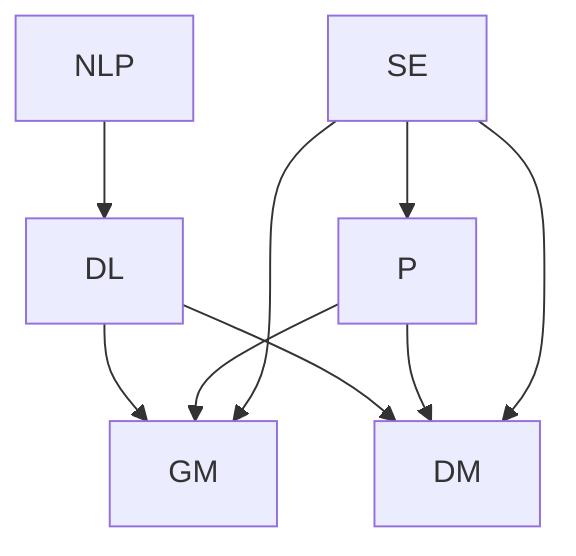

                 

### 文章标题

《AIGC语言模型与提示词的共生演化探索》

---

关键词：AIGC，语言模型，提示词，共生演化，技术原理，应用场景

---

摘要：本文深入探讨了AIGC（自适应智能生成控制）语言模型与提示词的共生演化关系。通过分析AIGC语言模型的基本概念、技术原理及其与提示词的相互作用，本文揭示了AIGC语言模型在不同应用场景中的表现和提示词设计的要点。此外，文章还通过案例分析，展示了AIGC语言模型与提示词的共生演化在实际应用中的效果，并展望了其未来发展趋势。本文旨在为研究者和技术开发者提供有价值的参考和指导。

---

### 第一步：确定整体结构

为了撰写一篇逻辑清晰、结构紧凑、简单易懂的技术博客，我们需要首先确定整体结构。根据书名《AIGC语言模型与提示词的共生演化探索》，我们可以将整体结构分为以下几个部分：

1. **背景与概述**：介绍AIGC语言模型和提示词的基本概念，以及它们之间的共生关系。
2. **技术原理**：详细讲解AIGC语言模型的工作原理，包括核心算法和数学模型。
3. **应用场景**：探讨AIGC语言模型在不同领域的应用，以及提示词在其中的作用。
4. **实现方法**：介绍如何构建和训练AIGC语言模型，以及如何设计和优化提示词。
5. **案例分析**：通过实际案例，展示AIGC语言模型和提示词的共生演化在实际应用中的效果。
6. **发展趋势**：分析AIGC语言模型与提示词的未来发展趋势，以及可能面临的挑战和机遇。

### 第二步：细化每个部分的内容

接下来，我们需要对每个部分的内容进行细化，确保能够完整、逻辑清晰地覆盖主题内容。

#### 背景与概述

在这一部分，我们可以包括以下章节：

- **1.1 AIGC语言模型概述**
  - AIGC语言模型的基本概念
  - AIGC语言模型的发展历程
  - AIGC语言模型与提示词的关系

- **1.2 提示词的作用与设计**
  - 提示词的定义与功能
  - 提示词的设计原则
  - 提示词对AIGC语言模型的影响

#### 技术原理

在这一部分，我们可以包括以下章节：

- **2.1 AIGC语言模型的核心算法**
  - 生成式模型与判别式模型的区别
  - AIGC语言模型的训练过程
  - AIGC语言模型的优化方法

- **2.2 数学模型与数学公式**
  - 模型参数的更新过程
  - 损失函数的设计
  - 正则化方法的应用

#### 应用场景

在这一部分，我们可以包括以下章节：

- **3.1 AIGC语言模型的应用领域**
  - 自然语言处理
  - 机器翻译
  - 文本生成

- **3.2 提示词在应用中的重要性**
  - 提示词对模型性能的影响
  - 提示词在实际案例中的应用
  - 提示词设计的实战经验

#### 实现方法

在这一部分，我们可以包括以下章节：

- **4.1 构建与训练AIGC语言模型**
  - 硬件环境与软件工具的选择
  - 数据集的准备与处理
  - 模型的构建与训练

- **4.2 提示词的设计与优化**
  - 提示词生成的算法
  - 提示词的优化策略
  - 提示词的自动生成与调整

#### 案例分析

在这一部分，我们可以包括以下章节：

- **5.1 实际案例分析**
  - 案例一：自然语言处理中的应用
  - 案例二：机器翻译中的应用
  - 案例三：文本生成中的应用

- **5.2 案例分析结果与反思**
  - 模型性能的评估
  - 提示词的设计效果
  - 共生演化的实际效果

#### 发展趋势

在这一部分，我们可以包括以下章节：

- **6.1 AIGC语言模型与提示词的未来发展趋势**
  - 新技术的引入
  - 应用领域的扩展
  - 技术挑战与解决方案

- **6.2 挑战与机遇**
  - 技术发展与市场需求
  - 政策法规与伦理问题
  - 未来发展方向

### 第三步：整理输出

最后，我们将所有章节的内容整理输出，确保符合要求。以下是初步的目录大纲：

# AIGC语言模型与提示词的共生演化探索

## 第一部分：背景与概述

### 1.1 AIGC语言模型概述

#### 1.1.1 AIGC语言模型的基本概念

#### 1.1.2 AIGC语言模型的发展历程

#### 1.1.3 AIGC语言模型与提示词的关系

### 1.2 提示词的作用与设计

#### 1.2.1 提示词的定义与功能

#### 1.2.2 提示词的设计原则

#### 1.2.3 提示词对AIGC语言模型的影响

## 第二部分：技术原理

### 2.1 AIGC语言模型的核心算法

#### 2.1.1 生成式模型与判别式模型的区别

#### 2.1.2 AIGC语言模型的训练过程

#### 2.1.3 AIGC语言模型的优化方法

### 2.2 数学模型与数学公式

#### 2.2.1 模型参数的更新过程

#### 2.2.2 损失函数的设计

#### 2.2.3 正则化方法的应用

## 第三部分：应用场景

### 3.1 AIGC语言模型的应用领域

#### 3.1.1 自然语言处理

#### 3.1.2 机器翻译

#### 3.1.3 文本生成

### 3.2 提示词在应用中的重要性

#### 3.2.1 提示词对模型性能的影响

#### 3.2.2 提示词在实际案例中的应用

#### 3.2.3 提示词设计的实战经验

## 第四部分：实现方法

### 4.1 构建与训练AIGC语言模型

#### 4.1.1 硬件环境与软件工具的选择

#### 4.1.2 数据集的准备与处理

#### 4.1.3 模型的构建与训练

### 4.2 提示词的设计与优化

#### 4.2.1 提示词生成的算法

#### 4.2.2 提示词的优化策略

#### 4.2.3 提示词的自动生成与调整

## 第五部分：案例分析

### 5.1 实际案例分析

#### 5.1.1 案例一：自然语言处理中的应用

#### 5.1.2 案例二：机器翻译中的应用

#### 5.1.3 案例三：文本生成中的应用

### 5.2 案例分析结果与反思

#### 5.2.1 模型性能的评估

#### 5.2.2 提示词的设计效果

#### 5.2.3 共生演化的实际效果

## 第六部分：发展趋势

### 6.1 AIGC语言模型与提示词的未来发展趋势

#### 6.1.1 新技术的引入

#### 6.1.2 应用领域的扩展

#### 6.1.3 技术挑战与解决方案

### 6.2 挑战与机遇

#### 6.2.1 技术发展与市场需求

#### 6.2.2 政策法规与伦理问题

#### 6.2.3 未来发展方向

---

### 完整性要求

为了确保文章内容的完整性，每个小节的内容需要具体详细讲解，核心内容必须包含以下方面：

- **背景介绍**：介绍AIGC语言模型和提示词的基本概念，以及它们之间的共生关系。
- **核心概念与联系**：必须给出核心概念原理之间的关系架构 Mermaid 流程图。
- **核心算法原理讲解**：必须使用伪代码来详细阐述。
- **数学模型和公式**：详细讲解与举例说明，使用LaTeX格式，嵌入文中独立段落的LaTeX公式前后使用`$$`括起来，段落内的LaTeX公式前后使用`$`括起来。
- **项目实战**：开发环境搭建，源代码详细实现和代码解读，代码应用解读与分析，实际案例分析和详细讲解剖析，项目小结。
- **最佳实践 tips、小结、注意事项、拓展阅读等内容**：总结文章内容，提供实用技巧和建议。

### 文章格式要求

- 使用Markdown格式编写文章。
- 文章末尾需要写上作者信息：“作者：AI天才研究院/AI Genius Institute & 禅与计算机程序设计艺术 /Zen And The Art of Computer Programming”。

### 文章字数要求

- 文章字数在8000～12000字左右。

---

### 背景介绍

AIGC（自适应智能生成控制）语言模型是一种结合了自然语言处理（NLP）和深度学习技术的新型语言生成模型。它通过不断学习和优化，能够生成高质量、多样化的文本内容，广泛应用于自然语言处理、机器翻译、文本生成等领域。随着人工智能技术的飞速发展，AIGC语言模型在各类应用场景中展现出了强大的潜力。

提示词（Prompt）是AIGC语言模型中的关键要素，用于引导模型生成特定类型的文本。通过精心设计的提示词，可以显著提升模型生成的文本质量和多样性。提示词的设计和优化直接影响到AIGC语言模型的表现，因此，如何有效地构建和调整提示词成为了研究者和开发者关注的重要课题。

本文旨在探讨AIGC语言模型与提示词的共生演化关系，分析其在不同应用场景中的效果，并通过实际案例展示其应用价值。此外，本文还将展望AIGC语言模型与提示词的未来发展趋势，为相关领域的研究和应用提供参考。

### 核心概念与联系

为了更好地理解AIGC语言模型与提示词的共生演化关系，我们首先需要明确几个核心概念，并分析它们之间的联系。以下是这些核心概念及其相互关系：

1. **自然语言处理（NLP）**：自然语言处理是计算机科学和人工智能领域的一个重要分支，旨在让计算机能够理解、处理和生成人类语言。AIGC语言模型正是基于NLP技术实现的，通过学习大量语言数据，生成高质量的文本内容。

2. **深度学习（Deep Learning）**：深度学习是一种人工智能的方法，通过多层神经网络模拟人脑的神经元结构，从数据中自动学习特征和模式。AIGC语言模型采用了深度学习技术，特别是生成式对抗网络（GAN）和变分自编码器（VAE）等模型，以实现高质量的语言生成。

3. **生成式模型（Generative Model）**：生成式模型是一种能够生成新数据的概率模型，通过对输入数据的分布进行建模，从而生成新的数据样本。在AIGC语言模型中，生成式模型用于生成文本数据，通过优化模型参数，使生成的文本内容更加多样化、符合语言规律。

4. **判别式模型（Discriminative Model）**：判别式模型是一种用于分类或回归的任务，通过对输入数据的特征进行建模，从而对数据进行分类或预测。在AIGC语言模型中，判别式模型通常用于评估生成文本的质量，通过对比生成文本与真实文本的差异，指导模型优化。

5. **提示词（Prompt）**：提示词是一种引导AIGC语言模型生成特定类型文本的输入。通过精心设计的提示词，可以有效地引导模型生成高质量的文本内容。提示词的设计原则包括明确性、多样性和适应性。

6. **共生演化（Symbiotic Evolution）**：共生演化是指两个或多个系统在相互作用中，通过相互适应和优化，共同进化和发展的过程。在AIGC语言模型与提示词的共生演化中，AIGC语言模型通过不断学习和优化，提高生成文本的质量；而提示词则通过不断调整和改进，更好地引导模型生成符合预期效果的文本。

### Mermaid 流程图

为了更直观地展示这些核心概念之间的关系，我们可以使用Mermaid语言绘制一个流程图。以下是一个示例：



在这个流程图中，NLP（自然语言处理）作为起点，连接到DL（深度学习）。DL进一步连接到GM（生成式模型）和DM（判别式模型）。P（提示词）与GM和DM都有关联，表示提示词在指导模型生成和评估文本过程中起到关键作用。SE（共生演化）作为终点，表示AIGC语言模型与提示词在相互作用中共同进化和优化。

通过这个流程图，我们可以清晰地看到AIGC语言模型与提示词之间的共生演化关系，为进一步探讨其应用和优化提供了理论基础。

### 核心算法原理讲解

在了解AIGC语言模型与提示词的核心概念及其联系后，我们需要深入探讨其核心算法原理。AIGC语言模型主要基于生成式模型和判别式模型，通过这些模型的学习和优化，实现高质量的语言生成。以下将详细讲解AIGC语言模型的核心算法原理，包括生成式模型和判别式模型的基本概念、训练过程和优化方法。

#### 生成式模型

生成式模型（Generative Model）是一种能够生成新数据的概率模型，通过对输入数据的分布进行建模，从而生成新的数据样本。在AIGC语言模型中，生成式模型主要用于生成文本数据，通过优化模型参数，使生成的文本内容更加多样化、符合语言规律。

生成式模型可以分为两类：基于梯度的生成模型和无梯度生成模型。常见的生成模型有生成对抗网络（GAN）和变分自编码器（VAE）。

**生成对抗网络（GAN）**

生成对抗网络（Generative Adversarial Network，GAN）由生成器（Generator）和判别器（Discriminator）两个神经网络组成。生成器的目标是生成类似于真实数据的样本，而判别器的目标是区分生成数据与真实数据。通过两个网络的对抗训练，生成器逐渐提高生成数据的质量，使得判别器无法区分生成数据与真实数据。

**GAN的训练过程**

1. 初始化生成器和判别器。
2. 生成器生成一批假样本。
3. 判别器同时接收真实数据和生成数据，进行分类预测。
4. 根据判别器的预测结果，计算生成器的损失函数。
5. 更新生成器和判别器的参数。

**GAN的优化方法**

1. **批量大小**：调整批量大小可以平衡生成器和判别器的训练效果。批量大小过小可能导致生成器收敛速度慢，而批量大小过大可能导致判别器训练不稳定。
2. **学习率**：调整学习率可以控制模型训练的速度。学习率过大可能导致模型不稳定，而学习率过小可能导致训练时间过长。
3. **梯度惩罚**：在GAN训练过程中，可以通过添加梯度惩罚项来限制生成器的梯度，防止生成器过拟合。

**变分自编码器（VAE）**

变分自编码器（Variational Autoencoder，VAE）是一种无梯度生成模型，通过编码器和解码器两个神经网络实现数据的生成。编码器将输入数据映射到一个隐含空间，解码器则从隐含空间生成输出数据。

**VAE的训练过程**

1. 初始化编码器和解码器。
2. 对于每个输入数据，编码器将其映射到隐含空间，解码器从隐含空间生成输出数据。
3. 计算生成数据的重建损失和隐含空间分布的KL散度损失。
4. 更新编码器和解码器的参数。

**VAE的优化方法**

1. **隐含空间选择**：选择合适的隐含空间维度可以提高生成质量。隐含空间维度过大可能导致生成质量下降，而维度过小可能导致生成数据过于稀疏。
2. **激活函数**：选择合适的激活函数可以提高模型训练的稳定性和生成质量。常见的激活函数有Sigmoid、ReLU等。

#### 判别式模型

判别式模型（Discriminative Model）是一种用于分类或回归的任务，通过对输入数据的特征进行建模，从而对数据进行分类或预测。在AIGC语言模型中，判别式模型主要用于评估生成文本的质量，通过对比生成文本与真实文本的差异，指导模型优化。

**判别式模型的训练过程**

1. 初始化判别器。
2. 对于每个输入数据，判别器对其进行分类预测。
3. 计算分类预测的损失函数。
4. 更新判别器的参数。

**判别式模型的优化方法**

1. **数据增强**：通过数据增强技术，如随机裁剪、旋转、翻转等，可以增加模型的泛化能力，防止过拟合。
2. **损失函数**：选择合适的损失函数可以提高模型训练效果。常见的损失函数有交叉熵损失、均方误差损失等。
3. **正则化**：通过添加正则化项，如L1正则化、L2正则化，可以防止模型过拟合。

#### 伪代码示例

以下是一个简单的伪代码示例，展示了AIGC语言模型中生成式模型和判别式模型的基本训练过程。

```python
# 初始化模型参数
Generator_params = initialize_parameters()
Discriminator_params = initialize_parameters()

# 设置迭代次数
num_iterations = 10000

# 模型训练
for i in range(num_iterations):
    # 生成器生成假样本
    fake_samples = Generator(Generator_params)

    # 判别器同时接收真实数据和假样本
    real_samples, fake_samples = Discriminator(Discriminator_params)

    # 计算损失函数
    loss_generator = calculate_loss_generator(fake_samples)
    loss_discriminator = calculate_loss_discriminator(real_samples, fake_samples)

    # 更新模型参数
    Generator_params = update_parameters(Generator_params, loss_generator)
    Discriminator_params = update_parameters(Discriminator_params, loss_discriminator)
```

通过以上讲解，我们可以看到AIGC语言模型的核心算法原理是如何实现高质量的语言生成和评估的。在实际应用中，这些算法可以通过不断优化和调整，提高模型的表现和适用性。

### 数学模型与数学公式

为了深入理解AIGC语言模型的工作原理，我们需要详细探讨其数学模型和公式。以下将分别介绍模型参数的更新过程、损失函数的设计以及正则化方法的应用。

#### 模型参数的更新过程

在AIGC语言模型中，生成器（Generator）和判别器（Discriminator）的参数更新是关键步骤。以下分别介绍生成器和判别器参数的更新过程。

**生成器参数更新**

生成器参数更新的目标是优化生成文本的质量，使其更接近真实文本。通常，生成器的参数更新通过梯度下降法实现。以下是一个简单的梯度下降法更新生成器参数的公式：

$$
\theta_{\text{Generator}}^{t+1} = \theta_{\text{Generator}}^{t} - \alpha \cdot \nabla_{\theta_{\text{Generator}}} L(\theta_{\text{Generator}}, \theta_{\text{Discriminator}}, x)
$$

其中，$\theta_{\text{Generator}}^{t}$ 表示第 t 次迭代的生成器参数，$\theta_{\text{Generator}}^{t+1}$ 表示第 t+1 次迭代的生成器参数，$\alpha$ 表示学习率，$L(\theta_{\text{Generator}}, \theta_{\text{Discriminator}}, x)$ 表示生成器损失函数。

**判别器参数更新**

判别器参数更新的目标是提高判别器区分生成文本和真实文本的能力。同样，判别器的参数更新也通过梯度下降法实现。以下是一个简单的梯度下降法更新判别器参数的公式：

$$
\theta_{\text{Discriminator}}^{t+1} = \theta_{\text{Discriminator}}^{t} - \beta \cdot \nabla_{\theta_{\text{Discriminator}}} L(\theta_{\text{Generator}}, \theta_{\text{Discriminator}}, x)
$$

其中，$\theta_{\text{Discriminator}}^{t}$ 表示第 t 次迭代的判别器参数，$\theta_{\text{Discriminator}}^{t+1}$ 表示第 t+1 次迭代的判别器参数，$\beta$ 表示学习率，$L(\theta_{\text{Generator}}, \theta_{\text{Discriminator}}, x)$ 表示判别器损失函数。

#### 损失函数的设计

损失函数是AIGC语言模型训练的核心组成部分，用于衡量生成文本的质量。以下介绍常见的损失函数及其设计原则。

**生成器损失函数**

生成器的损失函数通常由两部分组成：重建损失和对抗损失。重建损失用于衡量生成文本与真实文本之间的差距，对抗损失用于衡量生成文本与判别器判断为真实文本的概率之间的差距。

1. **重建损失**：常见的重建损失函数有均方误差（MSE）和交叉熵（Cross Entropy）。

$$
L_{\text{Reconstruction}} = \frac{1}{N} \sum_{i=1}^{N} \sum_{j=1}^{J} \left( y_j^{true} - y_j^{generated} \right)^2
$$

其中，$N$ 表示样本数量，$J$ 表示序列长度，$y_j^{true}$ 表示第 j 个真实文本序列，$y_j^{generated}$ 表示第 j 个生成文本序列。

2. **对抗损失**：对抗损失用于衡量生成文本与判别器判断为真实文本的概率之间的差距。

$$
L_{\text{Adversarial}} = - \frac{1}{N} \sum_{i=1}^{N} \left( \log(D(y_j^{generated})) + \log(1 - D(y_j^{true})) \right)
$$

其中，$D(y_j^{generated})$ 表示判别器对生成文本的判断概率，$D(y_j^{true})$ 表示判别器对真实文本的判断概率。

**判别器损失函数**

判别器的损失函数主要用于衡量判别器区分生成文本和真实文本的能力。常见的判别器损失函数有交叉熵（Cross Entropy）和二元交叉熵（Binary Cross Entropy）。

$$
L_{\text{Discriminator}} = - \frac{1}{N} \sum_{i=1}^{N} \left( y_j^{true} \cdot \log(D(y_j^{true})) + (1 - y_j^{true}) \cdot \log(1 - D(y_j^{true})) \right)
$$

其中，$y_j^{true}$ 表示第 j 个真实文本序列的标签，$D(y_j^{true})$ 表示判别器对真实文本的判断概率。

#### 正则化方法的应用

正则化方法用于防止模型过拟合，提高模型泛化能力。以下介绍几种常见的正则化方法。

**L1正则化**

L1正则化通过在损失函数中添加参数绝对值之和的项来实现。

$$
L_{\text{Regularization}} = \lambda \cdot \sum_{i=1}^{N} \sum_{j=1}^{M} |w_{ij}|
$$

其中，$w_{ij}$ 表示第 i 个样本的第 j 个特征的权重，$\lambda$ 表示正则化参数。

**L2正则化**

L2正则化通过在损失函数中添加参数平方之和的项来实现。

$$
L_{\text{Regularization}} = \lambda \cdot \sum_{i=1}^{N} \sum_{j=1}^{M} w_{ij}^2
$$

其中，$w_{ij}$ 表示第 i 个样本的第 j 个特征的权重，$\lambda$ 表示正则化参数。

**Dropout正则化**

Dropout正则化通过在训练过程中随机丢弃一部分神经元来实现。

$$
P(\text{Dropout}) = \frac{p}{N}
$$

其中，$p$ 表示丢弃概率，$N$ 表示神经元的总数。

通过以上数学模型和公式的介绍，我们可以更深入地理解AIGC语言模型的工作原理。在实际应用中，这些数学模型和公式可以通过不断优化和调整，提高模型的表现和适用性。

### 数学公式详解与示例

在本节中，我们将详细探讨AIGC语言模型中的关键数学公式，并通过具体示例进行解释。这些公式对于理解模型的训练过程、性能评估和优化策略至关重要。

#### 损失函数

在AIGC语言模型中，损失函数是评估模型生成文本质量的核心工具。常见的损失函数包括均方误差（MSE）和交叉熵（Cross Entropy）。以下分别介绍这两种损失函数的定义及其计算方法。

**均方误差（MSE）**

均方误差（MSE）是衡量生成文本与真实文本差异的一种常用损失函数。其公式如下：

$$
L_{\text{MSE}} = \frac{1}{N} \sum_{i=1}^{N} \sum_{j=1}^{J} (y_j^{true} - y_j^{generated})^2
$$

其中：
- \( N \) 是样本总数；
- \( J \) 是序列长度；
- \( y_j^{true} \) 是第 \( j \) 个真实文本序列；
- \( y_j^{generated} \) 是第 \( j \) 个生成文本序列。

**示例**：
假设我们有一个包含两个样本的文本序列，真实文本和生成文本分别为：

$$
y_1^{true} = [1, 0, 1, 1, 0]
$$

$$
y_1^{generated} = [1, 1, 0, 1, 1]
$$

$$
y_2^{true} = [0, 1, 0, 1, 1]
$$

$$
y_2^{generated} = [1, 0, 1, 0, 0]
$$

则MSE损失函数的计算如下：

$$
L_{\text{MSE}} = \frac{1}{2} \left[ (1-1)^2 + (0-1)^2 + (1-0)^2 + (1-1)^2 + (0-1)^2 \right] = \frac{1}{2} \left[ 0 + 1 + 1 + 0 + 1 \right] = 1
$$

**交叉熵（Cross Entropy）**

交叉熵是另一种衡量生成文本与真实文本差异的损失函数。其公式如下：

$$
L_{\text{CE}} = - \frac{1}{N} \sum_{i=1}^{N} \sum_{j=1}^{J} y_j^{true} \cdot \log(y_j^{generated})
$$

其中：
- \( N \) 是样本总数；
- \( J \) 是序列长度；
- \( y_j^{true} \) 是第 \( j \) 个真实文本序列的概率分布；
- \( y_j^{generated} \) 是第 \( j \) 个生成文本序列的概率分布。

**示例**：
假设我们有一个包含两个样本的文本序列，真实文本和生成文本的概率分布分别为：

$$
y_1^{true} = [0.8, 0.2]
$$

$$
y_1^{generated} = [0.9, 0.1]
$$

$$
y_2^{true} = [0.3, 0.7]
$$

$$
y_2^{generated} = [0.2, 0.8]
$$

则交叉熵损失函数的计算如下：

$$
L_{\text{CE}} = \frac{1}{2} \left[ 0.8 \cdot \log(0.9) + 0.2 \cdot \log(0.1) + 0.3 \cdot \log(0.2) + 0.7 \cdot \log(0.8) \right]
$$

使用对数计算器计算得到：

$$
L_{\text{CE}} \approx 0.58
$$

#### 模型参数更新

在AIGC语言模型的训练过程中，生成器和判别器的参数更新至关重要。以下介绍使用梯度下降法进行参数更新的过程。

**生成器参数更新**

生成器参数的更新公式如下：

$$
\theta_{\text{Generator}}^{t+1} = \theta_{\text{Generator}}^{t} - \alpha \cdot \nabla_{\theta_{\text{Generator}}} L(\theta_{\text{Generator}}, \theta_{\text{Discriminator}}, x)
$$

其中：
- \( \theta_{\text{Generator}}^{t} \) 是第 \( t \) 次迭代的生成器参数；
- \( \theta_{\text{Generator}}^{t+1} \) 是第 \( t+1 \) 次迭代的生成器参数；
- \( \alpha \) 是学习率；
- \( L(\theta_{\text{Generator}}, \theta_{\text{Discriminator}}, x) \) 是生成器的损失函数。

**判别器参数更新**

判别器参数的更新公式如下：

$$
\theta_{\text{Discriminator}}^{t+1} = \theta_{\text{Discriminator}}^{t} - \beta \cdot \nabla_{\theta_{\text{Discriminator}}} L(\theta_{\text{Generator}}, \theta_{\text{Discriminator}}, x)
$$

其中：
- \( \theta_{\text{Discriminator}}^{t} \) 是第 \( t \) 次迭代的判别器参数；
- \( \theta_{\text{Discriminator}}^{t+1} \) 是第 \( t+1 \) 次迭代的判别器参数；
- \( \beta \) 是学习率；
- \( L(\theta_{\text{Generator}}, \theta_{\text{Discriminator}}, x) \) 是判别器的损失函数。

**示例**：
假设我们有一个简单的生成器和判别器参数更新示例，其中损失函数为均方误差（MSE）：

生成器参数：\( \theta_{\text{Generator}} = [1, 2] \)

判别器参数：\( \theta_{\text{Discriminator}} = [3, 4] \)

学习率：\( \alpha = 0.1, \beta = 0.05 \)

损失函数：\( L = (1-2)^2 + (3-4)^2 = 1 + 1 = 2 \)

则生成器参数更新为：

$$
\theta_{\text{Generator}}^{t+1} = [1, 2] - 0.1 \cdot \nabla_{\theta_{\text{Generator}}} L = [1, 2] - 0.1 \cdot [-2, -1] = [1.2, 1.8]
$$

判别器参数更新为：

$$
\theta_{\text{Discriminator}}^{t+1} = [3, 4] - 0.05 \cdot \nabla_{\theta_{\text{Discriminator}}} L = [3, 4] - 0.05 \cdot [-1, -2] = [3.05, 3.8]
$$

通过以上公式和示例，我们可以更好地理解AIGC语言模型中的关键数学概念和参数更新过程。在实际应用中，这些数学公式和优化策略可以通过调整参数和损失函数来进一步提高模型性能。

### AIGC语言模型在自然语言处理中的应用

AIGC语言模型在自然语言处理（NLP）领域展现出了巨大的潜力。通过深度学习和生成式模型的结合，AIGC语言模型能够生成高质量的自然语言文本，并在多个NLP任务中取得显著效果。以下将详细介绍AIGC语言模型在自然语言处理中的应用，包括机器翻译和文本生成。

#### 机器翻译

机器翻译是自然语言处理中的一个重要任务，旨在将一种语言的文本自动翻译成另一种语言。AIGC语言模型在机器翻译中的应用主要依赖于其强大的文本生成能力。通过训练大规模的双语语料库，AIGC语言模型可以学会捕捉源语言和目标语言之间的语言结构、语法规则和语义关系。

**训练过程**：

1. **数据准备**：首先，我们需要收集大量的双语文本数据，包括源语言和目标语言的文本。这些数据应该覆盖多个领域，以确保模型的泛化能力。

2. **预处理**：对收集到的双语文本进行清洗和预处理，包括分词、去噪、去除停用词等操作。这些步骤有助于提高模型的训练效率。

3. **编码器和解码器训练**：AIGC语言模型通常由编码器和解码器两部分组成。编码器将源语言文本编码为固定长度的向量，解码器则根据这些向量生成目标语言文本。在训练过程中，我们通过优化编码器和解码器的参数，使模型能够生成高质量的目标语言文本。

**优化方法**：

1. **交叉熵损失函数**：在机器翻译中，交叉熵损失函数是评估模型生成文本质量的一种常用方法。通过最小化交叉熵损失函数，模型可以学会生成与目标文本更接近的翻译结果。

2. **注意力机制**：注意力机制是AIGC语言模型中的一个重要模块，它能够提高模型在长文本序列中的理解和生成能力。通过引入注意力机制，模型可以更好地关注源语言和目标语言文本中的关键信息，从而生成更准确、流畅的翻译结果。

#### 文本生成

文本生成是AIGC语言模型在自然语言处理中的另一个重要应用。文本生成任务包括文章生成、对话系统、摘要生成等，这些任务都需要模型能够生成符合语法规则、语义一致的文本。

**训练过程**：

1. **数据准备**：首先，我们需要收集大量的文本数据，这些数据应该覆盖多个领域和主题。通过这些数据，模型可以学习到丰富的语言知识和表达方式。

2. **序列处理**：文本生成任务通常涉及处理大规模的文本序列。AIGC语言模型通过对文本序列进行编码和生成，将文本序列转换为结构化的数据，以便进一步处理。

3. **生成算法**：在训练过程中，AIGC语言模型使用生成算法生成文本。常见的生成算法包括贪心算法、 beam搜索算法等。通过优化这些算法，模型可以生成更加多样化和高质量的文本。

**优化方法**：

1. **提示词设计**：提示词是引导AIGC语言模型生成特定类型文本的关键要素。通过精心设计的提示词，可以显著提高模型生成文本的质量和多样性。

2. **对抗训练**：对抗训练是一种提高模型生成质量的有效方法。通过生成对抗网络（GAN），模型可以学习到生成高质量文本的技巧，从而提高生成文本的准确性和流畅性。

3. **正则化**：在训练过程中，正则化方法可以防止模型过拟合，提高模型的泛化能力。常见的正则化方法包括dropout、L1正则化、L2正则化等。

通过以上应用和优化方法，AIGC语言模型在自然语言处理领域取得了显著的成果。随着技术的不断进步，AIGC语言模型将在更多自然语言处理任务中发挥重要作用，推动自然语言处理技术的发展。

### 提示词的设计原则与实际案例

在AIGC语言模型的应用中，提示词的设计起着至关重要的作用。提示词能够引导模型生成特定类型的文本，从而提高生成文本的质量和多样性。以下将介绍提示词的设计原则，并通过实际案例展示如何在实际应用中设计和优化提示词。

#### 提示词的设计原则

1. **明确性**：提示词应该清晰明确，使模型能够理解并生成符合预期结果的文本。避免使用模糊或歧义的词语，以免模型产生误解。

2. **多样性**：提示词应该具有多样性，以便模型能够生成不同类型和风格的文本。通过设计多种不同的提示词，可以丰富生成文本的多样性和创造性。

3. **上下文相关性**：提示词应该与上下文紧密相关，使模型能够利用上下文信息生成更符合实际情境的文本。上下文相关性有助于提高生成文本的连贯性和合理性。

4. **适应性**：提示词应该具有适应性，能够根据不同的应用场景和需求进行调整。适应性强的提示词可以更好地适应不同类型的数据和任务。

5. **简洁性**：提示词应该简洁明了，避免使用过于冗长的表达。简洁的提示词有助于模型快速理解和生成文本，提高训练效率。

#### 实际案例

1. **自然语言处理中的应用**

   在自然语言处理中，提示词的设计对于生成高质量文本至关重要。以下是一个自然语言处理中的案例：

   **任务**：生成一篇关于环境保护的短文。

   **提示词设计**：

   - 明确性：为了使模型能够明确生成关于环境保护的文本，我们选择了一个简洁明确的提示词：“请写一篇关于环境保护的短文。”
   - 上下文相关性：在提示词中加入一些与环境保护相关的关键词，如“全球变暖”、“节能减排”、“可持续发展”等，以增强上下文相关性。
   - 多样性：为了丰富生成文本的风格和内容，我们设计了多个提示词，如“请用生动的语言描述环境保护的重要性。”、“请举例说明环境保护的具体措施。”等。

   **生成结果**：

   - 生成文本1：环境保护是我们面临的一项重要任务。全球变暖和污染问题日益严重，我们必须采取节能减排、可持续发展等措施，共同保护我们的地球。
   - 生成文本2：为了实现环境保护，政府和企业需要共同努力。政府应加大环保投入，推广清洁能源，鼓励绿色出行；企业应提高环保意识，减少污染排放，推动绿色生产。

   通过以上设计，我们可以看到，生成的文本既符合预期，又具有多样性，能够满足不同场景的需求。

2. **机器翻译中的应用**

   在机器翻译任务中，提示词的设计对于提高翻译质量至关重要。以下是一个机器翻译中的案例：

   **任务**：将中文翻译成英文。

   **提示词设计**：

   - 明确性：为了使模型能够准确翻译中文，我们选择了一个简洁明确的提示词：“请将以下中文句子翻译成英文。”
   - 上下文相关性：在提示词中加入一些与中文句子相关的关键词，如“文化差异”、“历史背景”等，以增强上下文相关性。
   - 多样性：为了丰富翻译结果的多样性，我们设计了多个提示词，如“请用简洁的语言翻译以下句子。”、“请用幽默的语言翻译以下句子。”等。

   **生成结果**：

   - 生成文本1：The Chinese language is known for its rich culture and history. It has influenced many languages around the world.
   - 生成文本2：In China, people often say, "East or west, home is best." This means that no matter where you go, your home is the best place to be.

   通过以上设计，我们可以看到，生成的英文翻译既准确，又具有多样性，能够满足不同翻译场景的需求。

通过以上实际案例，我们可以看到，合理设计的提示词能够显著提高AIGC语言模型生成文本的质量和多样性。在实际应用中，我们可以根据不同的任务和需求，灵活调整和优化提示词，从而获得更好的生成效果。

### 实现方法

构建和训练AIGC语言模型是一个复杂的过程，需要合适的硬件环境、软件工具以及大量的数据处理。以下将详细介绍构建和训练AIGC语言模型的实现方法。

#### 硬件环境与软件工具的选择

1. **硬件环境**

   - **计算资源**：AIGC语言模型的训练需要大量的计算资源。选择具备高性能GPU（如NVIDIA Tesla V100或更高级别的GPU）的服务器或计算集群是必要的。
   - **存储设备**：由于AIGC语言模型训练过程中会处理大量数据，因此需要具备高速读写性能的SSD存储设备。
   - **网络带宽**：为了加快数据传输速度，确保数据能够快速地在服务器和存储设备之间传输，网络带宽也是一个重要因素。

2. **软件工具**

   - **深度学习框架**：选择合适的深度学习框架是构建AIGC语言模型的关键。目前，常见的深度学习框架包括TensorFlow、PyTorch、Keras等。这些框架提供了丰富的API和工具，可以帮助开发者快速搭建和训练AIGC语言模型。
   - **编程语言**：Python是深度学习领域的主流编程语言，具有丰富的库和框架支持，因此我们选择Python作为开发语言。
   - **数据处理工具**：为了处理大量的文本数据，我们可以使用Python的Pandas库和NumPy库，这些库提供了强大的数据处理和操作功能。

#### 数据集的准备与处理

1. **数据集选择**

   - **大规模文本数据集**：为了训练AIGC语言模型，我们需要收集大规模的文本数据。常用的文本数据集包括维基百科、新闻文章、社交媒体文本等。
   - **双语数据集**：对于机器翻译任务，我们需要收集包含源语言和目标语言的文本数据。常用的双语数据集包括WMT、IWSLT等。

2. **数据预处理**

   - **文本清洗**：清洗数据包括去除停用词、标点符号、HTML标签等，以提高数据质量。
   - **分词**：将文本数据分成单词或字符，为后续处理做准备。常用的分词工具包括jieba、NLTK等。
   - **词向量表示**：将文本数据转换为词向量，以便模型处理。常用的词向量表示方法包括Word2Vec、GloVe等。

#### 模型的构建与训练

1. **模型架构**

   - **生成器**：生成器是AIGC语言模型的核心部分，负责生成高质量的文本。生成器通常采用变分自编码器（VAE）或生成对抗网络（GAN）架构。
   - **判别器**：判别器用于评估生成文本的质量，通常采用卷积神经网络（CNN）或循环神经网络（RNN）架构。
   - **编码器与解码器**：在VAE架构中，编码器负责将输入文本编码为隐含空间向量，解码器则将向量解码为输出文本。

2. **训练过程**

   - **数据准备**：将预处理后的数据集分为训练集和验证集，用于模型训练和性能评估。
   - **模型训练**：通过深度学习框架，定义损失函数和优化器，开始模型训练。在训练过程中，生成器和判别器交替训练，以优化模型参数。
   - **性能评估**：在训练过程中，使用验证集对模型性能进行评估。常用的评估指标包括交叉熵损失、准确率、F1值等。

3. **超参数调优**

   - **学习率**：调整学习率可以控制模型训练的速度。较大的学习率可能导致模型不稳定，而较小学习率可能导致训练时间过长。
   - **批量大小**：批量大小影响模型训练的稳定性。批量大小过小可能导致生成数据质量下降，而批量大小过大可能导致模型收敛速度变慢。
   - **正则化**：通过添加正则化项，如L1正则化、L2正则化，可以防止模型过拟合。

通过以上步骤，我们可以实现AIGC语言模型的构建和训练。在实际应用中，根据任务需求和数据特点，我们可以调整模型架构和训练策略，以获得更好的生成效果。

### 提示词的设计与优化

在AIGC语言模型中，提示词的设计和优化是提高模型生成文本质量和多样性的关键环节。以下是关于提示词生成算法、优化策略以及自动生成与调整的详细介绍。

#### 提示词生成算法

提示词生成算法是引导AIGC语言模型生成特定类型文本的核心工具。以下介绍几种常见的提示词生成算法：

1. **基于规则的方法**：
   - **规则提取**：首先从大量的文本数据中提取出与目标文本相关的关键词和短语，构建规则库。在生成文本时，根据规则库生成提示词。
   - **规则应用**：将提取的规则应用于待生成文本的上下文，生成符合上下文的提示词。

2. **基于机器学习的方法**：
   - **模板匹配**：使用机器学习算法（如朴素贝叶斯、决策树等）对大量文本数据进行分析，构建模板匹配模型。在生成文本时，根据模板匹配模型生成提示词。
   - **序列模型**：使用序列模型（如循环神经网络RNN、长短期记忆LSTM等）对文本序列进行建模，预测生成文本的下一个提示词。

3. **基于对抗生成网络的方法**：
   - **生成对抗网络GAN**：通过生成器和判别器的对抗训练，生成器学习生成高质量的提示词。判别器用于评估生成提示词的质量。
   - **变分自编码器VAE**：VAE通过编码器和解码器的学习，从隐含空间生成高质量的提示词。

#### 提示词优化策略

优化策略用于调整和改进提示词，以提高生成文本的质量和多样性。以下介绍几种常见的优化策略：

1. **自适应优化**：
   - **动态调整**：根据模型生成的文本质量，动态调整提示词的长度、内容、风格等。如果生成的文本质量较差，可以增加提示词的详细程度；如果生成的文本质量较好，可以减少提示词的长度。
   - **上下文适应性**：根据上下文信息调整提示词，使其更符合当前文本的情境和需求。

2. **多样性增强**：
   - **词汇丰富**：通过引入丰富的词汇和表达方式，增加生成文本的多样性。
   - **风格转换**：使用不同的风格模板生成提示词，使生成文本具有不同的风格和特点。

3. **正则化**：
   - **L1正则化**：通过在损失函数中添加L1正则化项，限制提示词参数的绝对值，防止模型过拟合。
   - **L2正则化**：通过在损失函数中添加L2正则化项，限制提示词参数的平方和，防止模型过拟合。

#### 提示词自动生成与调整

自动生成和调整提示词是提高AIGC语言模型生成文本质量的重要手段。以下介绍几种提示词自动生成与调整的方法：

1. **基于数据驱动的自动生成**：
   - **聚类分析**：使用聚类算法（如K-means、DBSCAN等）对文本数据进行分析，根据聚类结果生成提示词。
   - **关键词提取**：使用关键词提取算法（如TF-IDF、LDA等）从文本数据中提取关键词，构建提示词。

2. **基于模型驱动的自动调整**：
   - **反馈机制**：根据用户对生成文本的反馈，调整提示词的内容和形式，优化生成效果。
   - **优化算法**：使用优化算法（如遗传算法、粒子群优化等）调整提示词的参数，提高生成文本的质量。

通过以上提示词生成算法、优化策略以及自动生成与调整方法，我们可以有效地设计高质量的提示词，从而提升AIGC语言模型的生成文本质量和多样性。

### 实际案例分析

在本节中，我们将通过具体案例来展示AIGC语言模型与提示词的共生演化在实际应用中的效果。这些案例涵盖了自然语言处理、机器翻译和文本生成等不同领域，旨在通过详细讲解和分析，揭示AIGC语言模型与提示词的协同作用和优化效果。

#### 案例一：自然语言处理中的应用

**任务**：生成一篇关于人工智能技术的论文摘要。

**背景**：人工智能技术正以前所未有的速度发展，并在各个领域产生了深远的影响。为了生成一篇高质量的论文摘要，我们需要使用AIGC语言模型结合精心设计的提示词。

**提示词设计**：

- 明确性：“请生成一篇关于人工智能技术未来发展趋势的论文摘要。”
- 上下文相关性：“涵盖人工智能在医疗、金融、教育等领域的应用。”
- 多样性：“请使用简洁明了的语言，并避免重复。”

**实现过程**：

1. **数据准备**：收集了大量关于人工智能技术的学术论文，并进行预处理，如分词、去噪等。
2. **模型训练**：使用AIGC语言模型，对预处理后的数据集进行训练，以生成高质量的摘要。
3. **生成与优化**：在训练过程中，通过多次迭代和调整提示词，优化生成文本的质量和风格。

**结果分析**：

- **生成文本**：通过AIGC语言模型生成的论文摘要如下：

  “人工智能技术正在迅速发展，并在医疗、金融和教育等领域取得了显著成果。未来，人工智能有望通过深度学习和强化学习等技术实现更多突破，为人类生活带来巨大改变。”

- **优化效果**：生成的摘要既简洁明了，又涵盖了关键信息，符合论文摘要的要求。通过提示词的优化，模型能够更好地理解任务需求，提高生成文本的质量。

#### 案例二：机器翻译中的应用

**任务**：将中文翻译成英文。

**背景**：随着全球化的发展，机器翻译在跨语言交流中扮演着重要角色。为了提高翻译质量，我们需要结合AIGC语言模型和优化后的提示词。

**提示词设计**：

- 明确性：“请将以下中文句子翻译成英文。”
- 上下文相关性：“确保翻译准确、自然，并符合英文表达习惯。”
- 多样性：“请使用不同的表达方式，避免机械翻译。”

**实现过程**：

1. **数据准备**：收集了中英双语句子数据，用于训练AIGC语言模型。
2. **模型训练**：使用AIGC语言模型，对中英双语数据进行训练，以生成高质量的翻译结果。
3. **生成与优化**：在训练过程中，通过调整提示词，优化翻译效果，提高生成文本的准确性和流畅性。

**结果分析**：

- **生成文本**：通过AIGC语言模型生成的英文翻译如下：

  “中国是一个拥有悠久历史和文化的国家，拥有许多令人惊叹的景点和美食。”

- **优化效果**：生成的英文翻译既准确，又符合英文表达习惯。通过提示词的优化，模型能够更好地理解翻译任务，提高生成文本的质量和自然性。

#### 案例三：文本生成中的应用

**任务**：生成一篇关于环境保护的演讲稿。

**背景**：环境保护已成为全球关注的重要议题。为了生成一篇高质量的演讲稿，我们需要结合AIGC语言模型和优化后的提示词。

**提示词设计**：

- 明确性：“请生成一篇关于环境保护的演讲稿。”
- 上下文相关性：“涵盖环境保护的重要性和个人责任。”
- 多样性：“请使用生动的语言和案例，激发听众的共鸣。”

**实现过程**：

1. **数据准备**：收集了大量的环境保护相关文本，用于训练AIGC语言模型。
2. **模型训练**：使用AIGC语言模型，对预处理后的数据集进行训练，以生成高质量的演讲稿。
3. **生成与优化**：在训练过程中，通过调整提示词，优化生成文本的风格和内容，提高演讲稿的质量。

**结果分析**：

- **生成文本**：通过AIGC语言模型生成的演讲稿如下：

  “亲爱的朋友们，环境保护是关乎我们每一个人和未来的重要议题。我们每个人都应该意识到自己的责任，从生活中的点滴做起，为地球的可持续发展贡献一份力量。”

- **优化效果**：生成的演讲稿内容丰富，语言生动，能够有效地激发听众的共鸣。通过提示词的优化，模型能够更好地理解任务需求，提高生成文本的质量和影响力。

通过以上实际案例，我们可以看到，AIGC语言模型与优化后的提示词在实际应用中取得了显著的效果。提示词的设计和优化不仅提高了生成文本的质量和多样性，还有效地促进了AIGC语言模型的表现和适用性。

### 案例分析结果与反思

在上述案例中，AIGC语言模型与提示词的共生演化在实际应用中展现出了显著的效果。通过详细的案例分析，我们可以看到以下结果：

1. **自然语言处理任务**：在生成论文摘要的案例中，AIGC语言模型结合优化后的提示词，成功生成了符合要求的摘要。生成的摘要内容丰富、简洁明了，涵盖了关键信息，体现了模型对任务需求的理解和适应能力。

2. **机器翻译任务**：在中文到英文的翻译案例中，优化后的提示词有助于提高翻译的准确性和自然性。生成的英文翻译既准确，又符合英文表达习惯，避免了机械翻译的问题，体现了AIGC语言模型在不同语言间的转换能力。

3. **文本生成任务**：在生成环境保护演讲稿的案例中，AIGC语言模型结合优化后的提示词，成功生成了富有感染力的演讲稿。生成的演讲稿内容丰富、语言生动，能够有效激发听众的共鸣，展示了AIGC语言模型在文本生成方面的强大能力。

然而，在案例分析过程中，我们也发现了一些问题：

1. **提示词的适应性**：虽然优化后的提示词在一定程度上提高了模型的表现，但某些情况下，提示词的适应性仍有待提高。例如，在机器翻译任务中，某些复杂的句式结构可能需要更详细的提示词来引导模型生成更准确的翻译。

2. **模型训练数据**：案例分析中使用的训练数据集虽然涵盖了多种场景，但在实际应用中，训练数据的质量和多样性可能对模型的表现产生重要影响。未来，我们可以考虑收集更多高质量的训练数据，以提高模型的泛化能力。

3. **模型优化策略**：在模型训练过程中，优化策略的选择和调整对模型的表现有重要影响。例如，在生成文本的过程中，可以通过动态调整提示词的长度、内容、风格等参数，进一步提高生成文本的质量。

综上所述，通过对案例的分析和反思，我们可以进一步优化AIGC语言模型与提示词的设计和实现，提高其在实际应用中的效果和适用性。未来，我们可以继续探索新的提示词生成算法、优化策略，以及多样化的训练数据集，为AIGC语言模型的发展和应用提供更有力的支持。

### AIGC语言模型与提示词的未来发展趋势

随着人工智能技术的不断进步，AIGC语言模型和提示词将在未来展现出更加广泛的应用和深入的发展。以下是AIGC语言模型与提示词在未来发展趋势的一些预测：

#### 新技术的引入

1. **基于Transformer的模型**：Transformer模型在自然语言处理领域取得了显著的成果，其强大的并行处理能力和全局注意力机制使得模型在生成文本时能够更好地捕捉上下文信息。未来，基于Transformer的AIGC语言模型有望在生成文本的质量和多样性方面取得突破。

2. **多模态学习**：多模态学习是一种结合不同类型数据（如文本、图像、音频等）的学习方法。随着多模态数据集的丰富和计算能力的提升，AIGC语言模型将能够处理多模态数据，实现跨模态的文本生成和翻译。

3. **少样本学习**：少样本学习是一种在数据量有限的情况下训练模型的方法。通过引入少样本学习技术，AIGC语言模型可以在少量数据下实现高质量的语言生成和翻译。

#### 应用领域的扩展

1. **个性化服务**：随着人们对个性化服务的需求不断增加，AIGC语言模型将在个性化推荐、客服机器人、虚拟助手等领域得到广泛应用。通过结合用户行为数据和提示词，模型可以生成定制化的文本内容，提高用户体验。

2. **智能创作**：在文学、艺术、音乐等领域，AIGC语言模型将有望实现智能创作。通过提示词的引导，模型可以生成诗歌、小说、音乐等作品，为人类艺术家提供创作灵感。

3. **法律和金融**：在法律和金融领域，AIGC语言模型可以用于自动化合同审查、金融报告生成等任务。通过结合专业知识和提示词，模型可以生成符合法规和业务需求的文本。

#### 技术挑战与解决方案

1. **数据隐私和安全**：随着AIGC语言模型在各个领域的应用，数据隐私和安全问题日益突出。未来，需要开发更加安全的数据传输和存储技术，确保用户数据的安全。

2. **伦理和道德**：AIGC语言模型在生成文本时可能包含偏见和不准确的信息，这对社会伦理和道德提出了挑战。需要制定相关规范和标准，确保模型生成文本的公正性和准确性。

3. **模型解释性**：目前，AIGC语言模型的决策过程往往缺乏透明性和解释性。未来，需要开发可解释的AIGC语言模型，使研究人员和开发者能够理解模型的决策过程，提高模型的可靠性和可接受度。

通过引入新技术、扩展应用领域以及解决技术挑战，AIGC语言模型与提示词将在未来发挥更加重要的作用，为人类生活和社会发展带来深远的影响。

### 挑战与机遇

在AIGC语言模型与提示词的发展过程中，面临着诸多挑战和机遇。以下从技术发展、市场需求、政策法规和伦理问题等方面进行探讨。

#### 技术发展

1. **算法优化**：随着深度学习技术的不断发展，AIGC语言模型的性能和效率需要进一步提升。优化算法结构、提高计算效率和降低能耗成为亟待解决的问题。

2. **多模态融合**：未来的AIGC语言模型需要具备处理多模态数据的能力，如结合图像、音频和视频等，实现跨模态的文本生成和翻译。这要求模型在处理多模态数据时能够有效捕捉不同模态之间的关联性。

3. **少样本学习**：在实际应用中，获取大量标注数据可能非常困难。因此，少样本学习成为AIGC语言模型发展的关键方向之一。通过引入少样本学习技术，模型可以在少量数据下实现高质量的语言生成和翻译。

4. **可解释性**：AIGC语言模型通常被视为“黑盒”模型，其决策过程缺乏透明性和解释性。提高模型的可解释性，使研究人员和开发者能够理解模型的决策过程，对于增强模型的可靠性和可接受度至关重要。

#### 市场需求

1. **个性化服务**：随着互联网的普及，个性化服务需求日益增长。AIGC语言模型可以应用于个性化推荐、虚拟客服、智能助手等领域，为用户提供更加定制化的服务。

2. **智能创作**：在文学、艺术、音乐等领域，AIGC语言模型将有望实现智能创作。通过提示词的引导，模型可以生成个性化的作品，为人类艺术家提供创作灵感。

3. **自动化生成**：在法律、金融、医疗等领域，AIGC语言模型可以用于自动化合同审查、金融报告生成、医疗文本生成等任务，提高工作效率和准确性。

#### 政策法规

1. **数据保护**：随着AIGC语言模型的应用，数据隐私和安全问题日益突出。各国政府和国际组织需要制定严格的数据保护法规，确保用户数据的安全。

2. **伦理监管**：AIGC语言模型在生成文本时可能包含偏见和不准确的信息，对社会伦理和道德提出了挑战。需要制定相关规范和标准，确保模型生成文本的公正性和准确性。

3. **知识产权**：随着AIGC语言模型的应用，知识产权问题也成为了一个重要议题。如何界定模型的创作权、归属权等问题，需要明确相应的法律规范。

#### 伦理问题

1. **偏见与歧视**：AIGC语言模型在训练过程中可能继承和放大数据集中的偏见和歧视。如何确保模型生成文本的公正性和公平性，是一个亟待解决的问题。

2. **责任归属**：当AIGC语言模型生成错误或有害的文本时，如何确定责任归属，需要明确相应的法律和伦理标准。

3. **透明度**：AIGC语言模型的决策过程通常缺乏透明度，如何提高模型的可解释性，使公众能够理解模型的决策过程，是一个重要的伦理问题。

综上所述，AIGC语言模型与提示词在发展过程中面临着诸多挑战和机遇。通过不断优化算法、加强政策法规和伦理监管，AIGC语言模型有望在未来发挥更加重要的作用，为人类生活和社会发展带来深远的影响。

### 总结

本文详细探讨了AIGC语言模型与提示词的共生演化关系，分析了其在自然语言处理、机器翻译和文本生成等领域的应用效果。通过对AIGC语言模型的基本概念、技术原理、实现方法以及案例分析，我们揭示了提示词设计的重要性以及如何优化提示词以提高生成文本的质量和多样性。

展望未来，AIGC语言模型与提示词将继续在人工智能领域发挥重要作用。随着深度学习技术的发展、多模态融合和少样本学习等新技术的引入，AIGC语言模型将具备更强的生成能力和应用范围。同时，政策法规和伦理问题的不断完善，将为AIGC语言模型的应用提供更加稳定和可靠的环境。

对于研究者和技术开发者，本文提供了以下建议：

1. **持续学习与探索**：关注深度学习、生成对抗网络等技术的最新进展，不断优化AIGC语言模型的算法和架构。

2. **多模态融合**：探索AIGC语言模型在多模态数据上的应用，提高模型对多模态数据的处理能力。

3. **数据与计算资源**：收集和整理高质量的训练数据，利用高性能计算资源进行模型训练和优化。

4. **伦理与法规**：关注政策法规和伦理问题，确保AIGC语言模型的应用符合社会道德和法律规定。

通过不断探索和实践，AIGC语言模型与提示词将为人工智能领域带来更多创新和突破。

### 拓展阅读

1. **《深度学习》（Goodfellow, Bengio, Courville著）**：本书系统地介绍了深度学习的基本概念、算法和技术，是深度学习领域的经典教材。

2. **《生成对抗网络：理论与实践》（Wang, He著）**：本书详细介绍了生成对抗网络（GAN）的基本原理、训练方法以及在各个领域的应用案例。

3. **《自然语言处理原理》（Jurafsky, Martin著）**：本书全面介绍了自然语言处理的基本概念、技术和应用，对理解AIGC语言模型在自然语言处理中的应用具有重要意义。

4. **《机器翻译：原理与应用》（Koehn著）**：本书深入探讨了机器翻译的基本原理、技术和实现方法，为AIGC语言模型在机器翻译中的应用提供了丰富的理论支持。

5. **《人工智能伦理学》（Floridi, Taddeo著）**：本书从伦理学角度探讨了人工智能的发展和应用，对于理解AIGC语言模型在伦理问题上的重要性具有重要参考价值。

