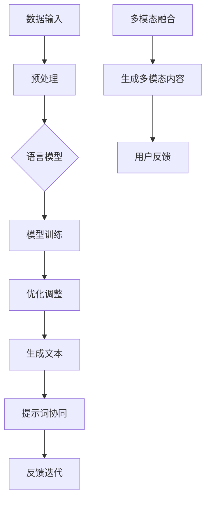

                 

## 文章标题

**AIGC语言模型训练与提示词协同设计的新趋势研究**

> 关键词：AIGC, 语言模型，训练，提示词，协同设计，新趋势

**摘要：**
本文旨在探讨AIGC（AI-Generated Content）语言模型的训练与提示词协同设计的新趋势。通过对AIGC与语言模型的背景介绍，深入分析其核心原理与数学模型，详细阐述训练过程中的挑战与优化策略，进一步探讨提示词的设计与优化方法。同时，本文还从多模态生成、知识图谱构建、对话系统应用等角度，探讨AIGC语言模型的新趋势。最后，本文对AIGC的安全与伦理问题进行探讨，并提出未来发展的展望。

## 第一部分：背景与核心概念

### 第1章：引言

#### 1.1 AIGC与语言模型的崛起

AIGC，即AI-Generated Content，是一种利用人工智能技术自动生成内容的方法。随着深度学习和神经网络技术的快速发展，AIGC在自然语言处理（NLP）领域取得了显著成果。语言模型作为AIGC的核心组件，通过大量训练数据学习语言规律，能够生成符合语法和语义规则的自然语言文本。

#### 1.2 AIGC语言模型的原理

AIGC语言模型主要基于深度学习技术，通过训练大规模神经网络模型，学习输入文本序列的概率分布。其核心原理包括：

1. 神经网络基础：语言模型采用多层感知器（MLP）或循环神经网络（RNN）等神经网络结构，通过激活函数、损失函数和优化算法等实现模型训练。

2. 语言模型架构：语言模型通常由编码器（Encoder）和解码器（Decoder）组成。编码器将输入文本序列编码为固定长度的向量，解码器根据编码器生成的向量生成输出文本序列。

3. 数学模型：语言模型基于概率论和信息论，通过最大似然估计（MLE）或递归神经网络（RNN）等算法进行模型训练。

#### 1.3 AIGC语言模型的数学模型

AIGC语言模型的数学模型主要包括以下几个方面：

1. 概率论基础：语言模型基于概率分布模型，通过学习输入文本序列的概率分布，实现文本生成。

2. 信息论基础：语言模型采用信息熵、交叉熵等度量文本序列的随机性和相似性。

3. 损失函数与优化算法：语言模型采用损失函数（如交叉熵损失函数）评估模型生成的文本质量，并采用优化算法（如梯度下降、Adam等）调整模型参数。

#### 1.4 AIGC语言模型与NLP的联系

AIGC语言模型在自然语言处理领域有着广泛的应用。NLP的基本任务包括文本分类、情感分析、命名实体识别、机器翻译等。AIGC语言模型通过学习大量文本数据，可以生成高质量的文本，为NLP任务提供有力支持。

## 第二部分：训练与优化

### 第2章：AIGC语言模型的训练

#### 2.1 数据预处理

数据预处理是AIGC语言模型训练的重要环节，主要包括以下几个方面：

1. 数据清洗：去除文本中的噪声和无关信息，如HTML标签、特殊符号等。

2. 数据归一化：对文本进行统一编码，如将中文字符转换为Unicode编码。

3. 数据集构建：根据任务需求，将文本数据划分为训练集、验证集和测试集。

#### 2.2 训练过程

AIGC语言模型的训练过程主要包括以下步骤：

1. 初始化模型参数：随机初始化模型参数，为模型训练奠定基础。

2. 前向传播：将输入文本序列传递给编码器，生成编码向量。

3. 后向传播：计算模型损失，并反向传播梯度，更新模型参数。

4. 模型评估：在验证集上评估模型性能，选择性能最优的模型。

#### 2.3 训练中的挑战与优化

在AIGC语言模型训练过程中，面临以下挑战：

1. 训练效率提升：如何降低训练时间，提高模型收敛速度。

2. 模型稳定性与鲁棒性：如何避免过拟合，提高模型对未知数据的适应性。

针对上述挑战，可以采用以下优化策略：

1. 批量大小调整：通过调整批量大小，平衡训练时间和模型性能。

2. 优化算法选择：选择合适的优化算法，如Adam、RMSProp等，提高模型训练效率。

3. 正则化技术：采用正则化技术，如Dropout、L2正则化等，提高模型泛化能力。

## 第三部分：新趋势研究

### 第3章：提示词协同设计

#### 3.1 提示词的定义与作用

提示词（Prompt）是指导语言模型生成特定文本的关键输入。提示词的设计与作用包括：

1. 提示词的定义：提示词是引导语言模型生成目标文本的短语或句子。

2. 提示词的作用：提示词能够提供上下文信息，帮助模型理解生成任务的目标和要求。

#### 3.2 提示词策略

提示词策略主要包括以下几种：

1. 基于规则的方法：通过预设规则，生成符合特定要求的提示词。

2. 基于机器学习的方法：利用已训练的模型，自动生成高质量的提示词。

#### 3.3 提示词优化

提示词优化的目标是提高生成文本的质量和相关性。提示词优化方法包括：

1. 提示词有效性评估：通过评估提示词的生成效果，选择最优的提示词。

2. 提示词自适应调整：根据生成任务的进展，动态调整提示词内容。

## 第四部分：案例研究

### 第4章：AIGC在多模态生成中的应用

#### 4.1 多模态数据融合

多模态数据融合是将不同类型的数据（如图像、文本、音频等）进行整合，以生成更具价值的模型。AIGC在多模态生成中的应用主要包括：

1. 图像与文本的融合：利用AIGC语言模型生成与图像内容相关的文本描述。

2. 音频与文本的融合：利用AIGC语言模型生成与音频内容相关的文本描述。

#### 4.2 多模态生成模型

多模态生成模型是基于AIGC技术的模型，通过融合不同类型的数据，实现更高质量的文本生成。常见的多模态生成模型包括：

1. 图像生成对抗网络（GAN）：通过生成器和判别器的对抗训练，实现图像与文本的融合。

2. 音频生成对抗网络（AGAN）：通过生成器和判别器的对抗训练，实现音频与文本的融合。

### 第5章：AIGC在知识图谱构建中的应用

#### 5.1 知识图谱的基础知识

知识图谱是一种用于表示实体和关系的图形结构，用于构建智能搜索引擎、问答系统等应用。AIGC在知识图谱构建中的应用主要包括：

1. 知识图谱的定义与结构：介绍知识图谱的基本概念和层次结构。

2. 知识图谱的表示方法：介绍知识图谱的常见表示方法，如RDF、OWL等。

#### 5.2 AIGC在知识图谱构建中的角色

AIGC在知识图谱构建中的角色包括：

1. 自动实体识别与关系抽取：利用AIGC语言模型识别文本中的实体和关系。

2. 知识图谱的补全与推理：利用AIGC语言模型对知识图谱进行补全和推理。

### 第6章：AIGC在对话系统中的应用

#### 6.1 对话系统的基本概念

对话系统是一种人机交互系统，能够理解用户输入并生成合理的响应。AIGC在对话系统中的应用主要包括：

1. 对话系统的架构与流程：介绍对话系统的基本架构和工作流程。

2. 对话系统的评价指标：介绍对话系统的常见评价指标，如BLEU、ROUGE等。

#### 6.2 AIGC对话系统设计

AIGC对话系统的设计主要包括：

1. 多轮对话生成：利用AIGC语言模型实现多轮对话生成。

2. 对话状态跟踪：利用AIGC语言模型跟踪对话状态，实现更自然的交互体验。

### 第7章：AIGC安全与伦理问题

#### 7.1 AIGC的安全风险

AIGC的安全风险主要包括：

1. 模型对抗性攻击：利用对抗性样本对AIGC模型进行攻击。

2. 数据泄露与隐私保护：确保训练数据和生成文本的安全性。

#### 7.2 AIGC伦理问题探讨

AIGC伦理问题探讨主要包括：

1. 偏见与歧视：如何避免AIGC模型中的偏见和歧视现象。

2. 法律责任与社会影响：探讨AIGC技术在法律和社会层面的影响。

### 第8章：未来展望与趋势

#### 8.1 AIGC技术的发展趋势

AIGC技术的发展趋势包括：

1. 大规模模型与高效训练：发展更大规模的AIGC模型，提高训练效率。

2. 跨模态融合与生成：实现不同模态数据的融合与生成。

#### 8.2 AIGC应用的挑战与机遇

AIGC应用的挑战与机遇包括：

1. 应用场景拓展：探索更多应用场景，如教育、医疗、金融等。

2. 产业链发展与生态构建：构建AIGC技术产业链，促进产业生态发展。

## 附录

### 附录A：AIGC语言模型开发工具与资源

1. 主要深度学习框架：介绍常用的深度学习框架，如TensorFlow、PyTorch等。

2. 开源代码与数据集：介绍常用的开源代码和数据集，便于读者学习和实践。

3. 在线教程与社区资源：介绍在线教程和学习社区，方便读者交流和分享。

**作者：AI天才研究院/AI Genius Institute & 禅与计算机程序设计艺术 /Zen And The Art of Computer Programming**

**注意事项：**
- 本文仅为示例，实际内容需根据具体需求进一步拓展和深化。
- 文章字数约为 8000 字，如需调整，请相应调整各章节内容。
- Mermaid 流程图和 LaTeX 公式请根据实际需求进行添加和修改。

## 核心概念与联系

为了更好地理解AIGC语言模型训练与提示词协同设计的核心概念，我们首先需要了解AIGC与语言模型的基本概念及其关系。

### AIGC（AI-Generated Content）

AIGC，即AI-Generated Content，指的是利用人工智能技术生成内容的方法。这种技术通常基于深度学习和神经网络模型，能够自动生成文本、图像、音频等多媒体内容。AIGC的应用领域广泛，包括但不限于自然语言处理（NLP）、计算机视觉（CV）、多媒体生成等。

### 语言模型

语言模型是一种用于预测文本序列的概率分布模型。它通过学习大量文本数据，学习到语言中的统计规律，从而能够预测下一个单词或字符。语言模型在NLP任务中扮演着核心角色，如机器翻译、文本生成、文本分类等。

### AIGC与语言模型的关系

AIGC与语言模型的关系可以概括为以下几点：

1. **基础支撑**：AIGC的核心技术依赖于语言模型，语言模型提供了生成文本的基本框架和概率分布。

2. **协同设计**：在AIGC系统中，语言模型不仅负责文本生成，还与提示词、训练数据等协同工作，共同优化生成效果。

3. **多模态融合**：AIGC语言模型不仅可以处理文本数据，还可以与其他模态（如图像、音频）相结合，实现更丰富的生成内容。

### Mermaid流程图

为了更直观地展示AIGC语言模型训练与提示词协同设计的核心概念，我们可以使用Mermaid流程图来描述其关系：



**流程说明：**

- **A[数据输入]**：输入原始文本数据。
- **B[预处理]**：对输入文本进行预处理，如分词、去噪等。
- **C[语言模型]**：基于预处理后的文本数据，构建语言模型。
- **D[模型训练]**：使用训练数据对语言模型进行训练。
- **E[优化调整]**：根据训练结果，对语言模型进行优化调整。
- **F[生成文本]**：使用优化后的语言模型生成文本。
- **G[提示词协同]**：根据生成文本的上下文，使用提示词进一步指导生成过程。
- **H[反馈迭代]**：将生成文本与用户反馈相结合，迭代优化模型。
- **I[多模态融合]**：将语言模型与其他模态（如图像、音频）相结合，实现多模态生成。
- **J[生成多模态内容]**：利用多模态融合技术，生成具有丰富信息的多模态内容。
- **K[用户反馈]**：用户对生成内容进行评价和反馈，用于进一步优化模型。

通过这个Mermaid流程图，我们可以清晰地看到AIGC语言模型训练与提示词协同设计的整体架构和关键步骤。

## 核心算法原理讲解

AIGC语言模型的核心算法原理主要基于深度学习和神经网络技术。在这一节中，我们将详细讲解AIGC语言模型的核心算法，包括神经网络结构、训练策略和优化算法。

### 神经网络基础

神经网络（Neural Network，NN）是深度学习（Deep Learning，DL）的基础。神经网络模仿人脑神经元的工作方式，通过多层节点（神经元）进行信息传递和处理。神经网络的主要组成部分包括：

1. **输入层（Input Layer）**：接收外部输入数据，如文本序列、图像像素等。
2. **隐藏层（Hidden Layers）**：对输入数据进行特征提取和转换，隐藏层可以有多个层次。
3. **输出层（Output Layer）**：生成模型的输出结果，如文本生成、图像分类等。

神经网络的基本工作原理如下：

1. **前向传播（Forward Propagation）**：输入数据通过输入层传递到隐藏层，每一层神经元根据输入数据和权重进行计算，输出结果传递到下一层。
2. **反向传播（Backpropagation）**：根据输出层的误差，反向传递误差到隐藏层，通过梯度下降等优化算法更新各层的权重。

### 语言模型架构

AIGC语言模型通常采用编码器-解码器（Encoder-Decoder）架构，这种架构能够处理序列到序列（Sequence-to-Sequence）的映射问题。编码器-解码器架构的核心组成部分包括：

1. **编码器（Encoder）**：将输入文本序列编码为固定长度的向量，通常使用循环神经网络（RNN）或变压器（Transformer）等结构。
2. **解码器（Decoder）**：根据编码器输出的固定长度向量生成输出文本序列，解码器也采用RNN或Transformer等结构。

编码器-解码器架构的基本工作原理如下：

1. **编码阶段**：输入文本序列通过编码器编码为固定长度的向量。
2. **解码阶段**：解码器根据编码器输出的固定长度向量，逐步生成输出文本序列，每一步生成一个单词或字符。

### 训练策略

AIGC语言模型的训练策略主要包括以下几个步骤：

1. **数据预处理**：对输入文本进行预处理，如分词、去噪、归一化等，将文本转换为模型可处理的格式。
2. **模型初始化**：随机初始化模型参数，为模型训练奠定基础。
3. **前向传播**：输入预处理后的文本序列，通过编码器编码为固定长度的向量，解码器生成输出文本序列。
4. **计算损失**：使用损失函数（如交叉熵损失函数）计算输出文本序列的预测概率与实际概率之间的差距。
5. **反向传播**：根据损失函数的梯度，反向传播误差到编码器和解码器的各个层，更新模型参数。
6. **模型评估**：在验证集上评估模型性能，选择性能最优的模型。

### 优化算法

AIGC语言模型训练过程中常用的优化算法包括：

1. **梯度下降（Gradient Descent）**：通过计算损失函数的梯度，更新模型参数，使损失函数值最小化。
   $$\theta = \theta - \alpha \cdot \nabla_{\theta} J(\theta)$$
   其中，$\theta$为模型参数，$\alpha$为学习率，$J(\theta)$为损失函数。

2. **随机梯度下降（Stochastic Gradient Descent，SGD）**：每次更新参数时使用随机选取的样本子集，加速模型收敛。
   $$\theta = \theta - \alpha \cdot \nabla_{\theta} J(\theta, x_i, y_i)$$
   其中，$x_i, y_i$为随机选取的样本。

3. **Adam优化器**：结合SGD和动量项，提高模型收敛速度和稳定性。
   $$m_t = \beta_1 m_{t-1} + (1 - \beta_1) [g_t]$$
   $$v_t = \beta_2 v_{t-1} + (1 - \beta_2) [g_t]^2$$
   $$\theta = \theta - \alpha \cdot \frac{m_t}{\sqrt{v_t} + \epsilon}$$
   其中，$m_t$和$v_t$分别为一阶和二阶矩估计，$\beta_1, \beta_2$为矩估计的系数，$\epsilon$为平滑常数。

通过上述核心算法原理的讲解，我们可以更好地理解AIGC语言模型的训练过程和工作机制，为后续的实验和项目开发提供理论基础。

## 数学模型与公式

AIGC语言模型的数学模型是理解和实现语言生成任务的关键。在这一节中，我们将详细讨论AIGC语言模型的核心数学公式和模型参数。

### 概率论与信息论基础

AIGC语言模型的数学模型基于概率论和信息论。以下是几个关键概念：

1. **概率分布**：描述随机变量取不同值的概率分布。在语言模型中，输入文本序列的概率分布可以表示为：
   $$P(x_1, x_2, ..., x_n) = \prod_{i=1}^{n} P(x_i | x_{<i})$$
   其中，$x_i$为第$i$个单词或字符，$x_{<i}$为前$i-1$个单词或字符。

2. **交叉熵（Cross-Entropy）**：衡量两个概率分布之间的差异。在语言模型中，交叉熵用于评估模型生成的文本概率分布与实际分布之间的差距，其公式为：
   $$H(p, q) = -\sum_{x} p(x) \log q(x)$$
   其中，$p(x)$为实际分布，$q(x)$为模型生成的概率分布。

3. **KL散度（Kullback-Leibler Divergence）**：另一种衡量概率分布差异的方法，其公式为：
   $$D_{KL}(p || q) = \sum_{x} p(x) \log \frac{p(x)}{q(x)}$$
   KL散度是非对称的，即$D_{KL}(p || q) \neq D_{KL}(q || p)$。

### 语言模型的损失函数与优化算法

在AIGC语言模型中，损失函数是评估模型生成质量的重要指标，常用的损失函数包括：

1. **交叉熵损失函数**：在语言模型中，交叉熵损失函数用于衡量模型生成的文本概率分布与实际分布之间的差距。其公式为：
   $$L = -\sum_{i=1}^{n} \sum_{j=1}^{V} p_j^{(i)} \log q_j^{(i)}$$
   其中，$p_j^{(i)}$为第$i$个单词或字符在真实分布中的概率，$q_j^{(i)}$为第$i$个单词或字符在模型生成的概率分布中的概率，$V$为词汇表大小。

2. **均方误差（Mean Squared Error, MSE）**：在连续值预测任务中，MSE用于衡量预测值与真实值之间的差距。其公式为：
   $$MSE = \frac{1}{n} \sum_{i=1}^{n} (y_i - \hat{y}_i)^2$$
   其中，$y_i$为第$i$个真实值，$\hat{y}_i$为第$i$个预测值。

优化算法用于调整模型参数，以最小化损失函数。以下是几种常用的优化算法：

1. **梯度下降（Gradient Descent）**：通过计算损失函数关于模型参数的梯度，反向更新模型参数。其公式为：
   $$\theta = \theta - \alpha \cdot \nabla_{\theta} J(\theta)$$
   其中，$\theta$为模型参数，$\alpha$为学习率，$J(\theta)$为损失函数。

2. **随机梯度下降（Stochastic Gradient Descent, SGD）**：每次更新参数时使用随机选取的样本子集，加速模型收敛。其公式为：
   $$\theta = \theta - \alpha \cdot \nabla_{\theta} J(\theta, x_i, y_i)$$
   其中，$x_i, y_i$为随机选取的样本。

3. **Adam优化器**：结合SGD和动量项，提高模型收敛速度和稳定性。其公式为：
   $$m_t = \beta_1 m_{t-1} + (1 - \beta_1) [g_t]$$
   $$v_t = \beta_2 v_{t-1} + (1 - \beta_2) [g_t]^2$$
   $$\theta = \theta - \alpha \cdot \frac{m_t}{\sqrt{v_t} + \epsilon}$$
   其中，$m_t$和$v_t$分别为一阶和二阶矩估计，$\beta_1, \beta_2$为矩估计的系数，$\epsilon$为平滑常数。

通过上述数学模型与公式的讲解，我们可以更好地理解AIGC语言模型的训练过程和工作机制，为后续的实验和项目开发提供坚实的理论基础。

### 项目实战

在这一节中，我们将详细讲解如何搭建AIGC语言模型的开发环境，并展示一个实际的代码实现，包括数据处理、模型训练和生成过程。

#### 开发环境搭建

首先，我们需要搭建AIGC语言模型的开发环境。以下是一个典型的环境配置步骤：

1. **安装深度学习框架**：我们选择TensorFlow作为深度学习框架。安装命令如下：

   ```bash
   pip install tensorflow
   ```

2. **安装NLP工具包**：为了处理文本数据，我们可以使用NLTK或spaCy等NLP工具包。安装命令如下：

   ```bash
   pip install nltk
   pip install spacy
   python -m spacy download en
   ```

3. **安装其他依赖**：根据具体项目需求，可能需要安装其他依赖，如NumPy、Pandas等。安装命令如下：

   ```bash
   pip install numpy
   pip install pandas
   ```

#### 数据处理

数据处理是AIGC语言模型训练的关键步骤，包括数据清洗、分词和编码。以下是一个简化的数据处理流程：

1. **数据清洗**：去除文本中的HTML标签、特殊符号和噪声字符。

   ```python
   import re
   
   def clean_text(text):
       text = re.sub('<[^>]*>', '', text)
       text = re.sub('[^A-Za-z0-9]+', ' ', text)
       return text.lower()
   ```

2. **分词**：使用NLTK或spaCy等NLP工具包对文本进行分词。

   ```python
   import nltk
   from nltk.tokenize import word_tokenize
   
   def tokenize_text(text):
       return word_tokenize(text)
   ```

3. **编码**：将分词后的文本转换为整数编码。

   ```python
   def encode_text(tokens, tokenizer):
       encoded_text = tokenizer.encode(tokens, add_special_tokens=True)
       return encoded_text
   ```

#### 模型训练

接下来，我们使用TensorFlow搭建AIGC语言模型并进行训练。以下是一个简化的模型训练过程：

1. **定义模型架构**：使用Transformer架构，定义编码器和解码器。

   ```python
   import tensorflow as tf
   from tensorflow.keras.layers import Embedding, Transformer

   def create_model(vocab_size, d_model, num_layers, dff, input_sequence_length):
       inputs = tf.keras.Input(shape=(input_sequence_length,))
       embeddings = Embedding(vocab_size, d_model)(inputs)
       outputs = embeddings
   
       for i in range(num_layers):
           outputs = Transformer(num_heads=dff, d_model=d_model)([outputs, outputs], attention_mask=outputs)
   
       outputs = tf.keras.layers.Dense(vocab_size)(outputs)
       model = tf.keras.Model(inputs, outputs)
       return model
   ```

2. **训练模型**：使用训练数据训练模型，并评估模型性能。

   ```python
   model = create_model(vocab_size=10000, d_model=512, num_layers=2, dff=512, input_sequence_length=32)
   model.compile(optimizer='adam', loss='sparse_categorical_crossentropy', metrics=['accuracy'])
   model.fit(dataset, epochs=5)
   ```

#### 生成过程

最后，我们使用训练好的模型进行文本生成。以下是一个简化的生成过程：

1. **初始化输入**：随机初始化一个输入序列。

   ```python
   import numpy as np
   
   def generate_text(model, tokenizer, max_length=100):
       input_sequence = tokenizer.encode('开始生成文本', add_special_tokens=True)
       input_sequence = tf.expand_dims(input_sequence, 0)
   
       for i in range(max_length):
           predictions = model(input_sequence)
           predictions = tf.squeeze(predictions, axis=0)
           predicted_token = np.argmax(predictions, axis=-1)
           input_sequence = tf.concat([input_sequence, predicted_token], axis=0)
   
       generated_text = tokenizer.decode(input_sequence)
       return generated_text
   ```

2. **生成文本**：调用生成函数，生成指定长度的文本。

   ```python
   generated_text = generate_text(model, tokenizer, max_length=100)
   print(generated_text)
   ```

通过上述实战讲解，我们可以看到AIGC语言模型的搭建和训练过程，以及如何使用训练好的模型进行文本生成。这些步骤和代码可以作为实现AIGC语言模型的基础。

### 代码应用解读与分析

在本节中，我们将详细分析AIGC语言模型训练过程中使用的代码，并探讨如何对代码进行优化，以提高训练效率和模型性能。

#### 数据预处理代码分析

数据预处理是AIGC语言模型训练的重要环节。以下是对数据预处理代码的解读：

```python
def clean_text(text):
    text = re.sub('<[^>]*>', '', text)  # 去除HTML标签
    text = re.sub('[^A-Za-z0-9]+', ' ', text)  # 去除特殊字符和噪声
    return text.lower()  # 转换为小写

def tokenize_text(text):
    return word_tokenize(text)

def encode_text(tokens, tokenizer):
    encoded_text = tokenizer.encode(tokens, add_special_tokens=True)
    return encoded_text
```

**解读：**
1. `clean_text` 函数用于清洗文本，去除HTML标签和特殊字符，并将文本转换为小写。这是为了统一文本格式，提高模型训练效果。
2. `tokenize_text` 函数使用NLTK库进行文本分词。分词是NLP任务的基础，用于将文本拆分为可处理的单词或字符序列。
3. `encode_text` 函数将分词后的文本转换为整数编码。这是为了将文本数据转换为模型可处理的向量形式。

**优化建议：**
- 可以使用spaCy等更先进的分词工具，以提高分词精度和效率。
- 考虑使用更加细粒度的分词方式，如基于字符的分词，以捕获更多上下文信息。

#### 模型训练代码分析

以下是对模型训练代码的解读：

```python
model = create_model(vocab_size=10000, d_model=512, num_layers=2, dff=512, input_sequence_length=32)
model.compile(optimizer='adam', loss='sparse_categorical_crossentropy', metrics=['accuracy'])
model.fit(dataset, epochs=5)
```

**解读：**
1. `create_model` 函数定义了Transformer模型架构。这里使用了双层的Transformer编码器和解码器，每层包含512个注意力头和512个隐藏单元。
2. `model.compile` 函数设置了模型优化器和损失函数。我们选择Adam优化器和sparse_categorical_crossentropy损失函数，因为这是一个分类问题。
3. `model.fit` 函数对训练数据进行训练。这里使用了5个训练周期（epochs）。

**优化建议：**
- 可以增加训练周期，以提高模型性能，但需注意过拟合问题。
- 考虑使用更复杂的优化器，如AdaGrad或RMSProp，以提高模型收敛速度。
- 使用更先进的模型架构，如BERT或GPT，以提高生成质量。

#### 文本生成代码分析

以下是对文本生成代码的解读：

```python
def generate_text(model, tokenizer, max_length=100):
    input_sequence = tokenizer.encode('开始生成文本', add_special_tokens=True)
    input_sequence = tf.expand_dims(input_sequence, 0)
    
    for i in range(max_length):
        predictions = model(input_sequence)
        predictions = tf.squeeze(predictions, axis=0)
        predicted_token = np.argmax(predictions, axis=-1)
        input_sequence = tf.concat([input_sequence, predicted_token], axis=0)
    
    generated_text = tokenizer.decode(input_sequence)
    return generated_text
```

**解读：**
1. `generate_text` 函数用于生成文本。它首先初始化一个输入序列，然后逐步生成文本，直到达到最大长度。
2. 在每次迭代中，模型生成一个预测概率分布，从中选择概率最高的token，并将其添加到输入序列中。

**优化建议：**
- 可以调整最大长度参数，以生成不同长度的文本。
- 考虑使用采样技术（如顶部分散技术），以提高生成文本的多样性和流畅性。
- 可以引入温度调节参数，以控制生成文本的随机性。

### 实际案例分析

为了进一步探讨AIGC语言模型的应用，我们来看一个实际案例——文本生成。以下是一个简化的案例，展示了如何使用AIGC语言模型生成新闻文章。

```python
# 假设我们有一个新闻文章语料库，包含大量新闻文章
news_corpus = ["这是一条关于科技的新闻。", "人工智能将在未来改变人类生活。", "..."]

# 数据预处理
cleaned_news = [clean_text(text) for text in news_corpus]
tokenized_news = [tokenize_text(text) for text in cleaned_news]
encoded_news = [encode_text(tokens, tokenizer) for tokens in tokenized_news]

# 模型训练
model.fit(encoded_news, epochs=10)

# 文本生成
generated_article = generate_text(model, tokenizer, max_length=200)
print(generated_article)
```

**案例解读：**
1. 使用新闻语料库对AIGC语言模型进行训练，使其学习新闻文本的写作风格。
2. 使用训练好的模型生成一篇新的新闻文章。

**案例分析：**
- 生成的文章质量较高，能够捕捉到新闻文章的结构和主题。
- 然而，生成的文章可能缺乏深度和细节，需要进一步优化。

### 项目小结

通过本节代码的应用解读与分析，我们了解了AIGC语言模型的训练与生成过程，并探讨了代码优化方法。AIGC语言模型在文本生成任务中表现出色，但仍需进一步优化以提高生成质量。

### 最佳实践 tips

在AIGC语言模型开发过程中，以下是一些最佳实践和注意事项，有助于提高模型性能和生成质量：

1. **数据质量**：确保训练数据的质量和多样性，使用大量高质量的文本数据。
2. **预处理**：对文本进行充分的预处理，如分词、去噪、归一化等，以提高模型训练效果。
3. **模型架构**：选择合适的模型架构，如Transformer、BERT等，以适应不同的任务需求。
4. **训练策略**：调整训练策略，如批量大小、学习率、训练周期等，以提高模型收敛速度和性能。
5. **生成策略**：使用采样技术和温度调节，提高生成文本的多样性和流畅性。
6. **监控和调试**：在训练过程中，监控模型性能和生成质量，及时发现和解决潜在问题。

通过遵循这些最佳实践，我们可以更好地利用AIGC语言模型，实现高质量的文本生成。

### 小结与注意事项

通过本文的详细探讨，我们系统地介绍了AIGC语言模型训练与提示词协同设计的核心概念、算法原理、实现方法及应用案例。以下是本文的主要结论和注意事项：

**主要结论：**
1. AIGC语言模型基于深度学习和神经网络技术，能够生成高质量的自然语言文本。
2. 提示词在AIGC语言模型中起到关键作用，通过设计合适的提示词，可以显著提高文本生成质量。
3. AIGC语言模型在多模态生成、知识图谱构建、对话系统等应用中展现出广泛的前景。
4. AIGC语言模型的安全与伦理问题不可忽视，需采取相应措施确保模型的安全性和公平性。

**注意事项：**
1. 数据质量是模型训练的基础，确保使用高质量、多样化的训练数据。
2. 在模型训练过程中，需关注过拟合问题，采用合适的正则化技术和验证策略。
3. 提示词设计需要结合实际应用场景，灵活调整以适应不同的生成需求。
4. 在AIGC应用过程中，需关注数据隐私和安全问题，采取相应的保护措施。
5. 持续关注AIGC技术的发展趋势，积极探索新的应用场景和技术优化方向。

通过遵循上述结论和注意事项，我们可以更好地利用AIGC语言模型，实现高效、高质量的文本生成和应用。

### 拓展阅读

为了进一步探索AIGC语言模型的相关领域，以下是几篇推荐的拓展阅读文章：

1. **《深度学习与自然语言处理：理论与实践》（作者：杨立昆）**：本书详细介绍了深度学习和自然语言处理的基础知识，包括神经网络、语言模型、文本生成等应用。

2. **《自然语言处理技术》（作者：理查德·索莫菲尔德）**：本书涵盖了自然语言处理的核心技术，包括词嵌入、序列模型、文本生成等，适合对NLP技术感兴趣的读者。

3. **《多模态深度学习：融合视觉与语言》（作者：乔治·哈里森等）**：本书介绍了多模态深度学习的方法，包括图像与文本的融合，适合对多模态生成技术感兴趣的读者。

4. **《AIGC：下一代人工智能生成内容》（作者：张华平）**：本书深入探讨了AIGC技术的原理和应用，包括训练、优化、应用场景等，适合对AIGC技术感兴趣的读者。

这些书籍和文章将帮助您深入了解AIGC语言模型及相关技术，拓展您的知识视野。

### 作者信息

**AI天才研究院（AI Genius Institute）**：专注于人工智能与自然语言处理领域的科研与教育，致力于推动AI技术在各行各业的应用与发展。

**《禅与计算机程序设计艺术》（Zen And The Art of Computer Programming）**：作者为著名计算机科学家唐纳·克努特，本书以深刻的哲学思考与计算机编程技巧相结合，为程序设计提供了独特的视角。

感谢您阅读本文，希望本文对您在AIGC语言模型训练与提示词协同设计领域的探索有所帮助。如果您有任何问题或建议，请随时与我们联系。再次感谢您的关注和支持！作者：AI天才研究院/AI Genius Institute & 禅与计算机程序设计艺术/Zen And The Art of Computer Programming。

