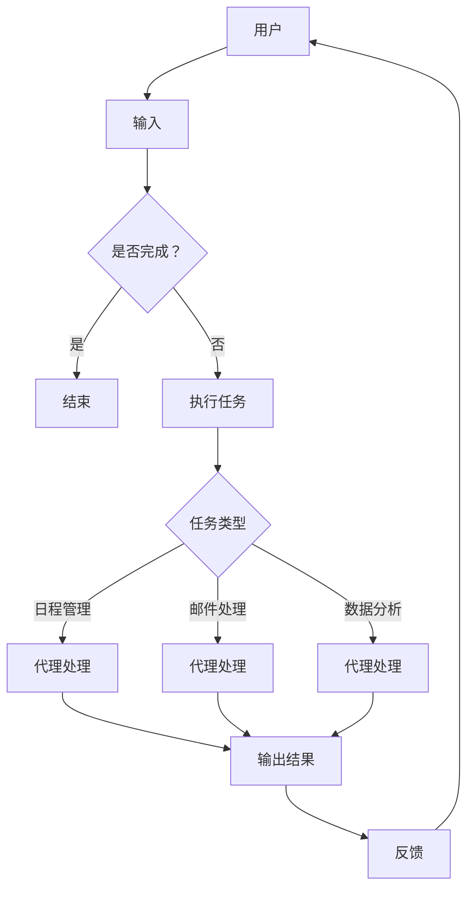
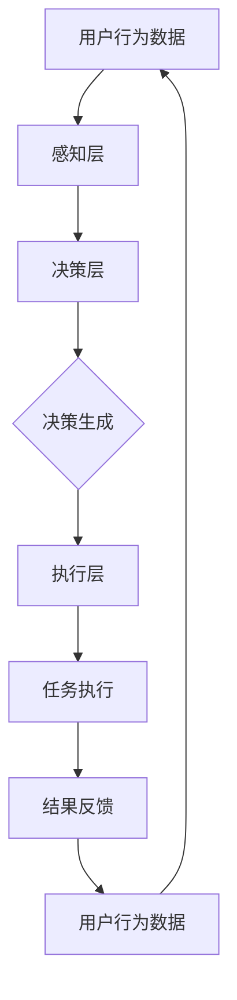

                 


### 文章标题：AI代理在个人生产力提升中的作用

### 文章关键词：
1. AI代理
2. 个人生产力
3. 代理学习
4. 强化学习
5. 智能助手
6. 自动化
7. 效率提升

### 文章摘要：
本文旨在探讨AI代理在个人生产力提升中的应用。通过深入分析AI代理的核心概念、算法原理、数学模型，并结合实际项目实战，本文将展示如何利用AI代理提高个人工作效率和生活质量。

### 目录大纲：

#### 引言
1. **背景介绍**
2. **文章目标**

#### 第1章：核心概念与联系
1. **AI代理概述**
2. **AI代理与个人生产力的联系**
3. **AI代理的架构和类型**
4. **Mermaid流程图：AI代理架构示例**

#### 第2章：核心算法原理讲解
1. **代理学习原理**
2. **强化学习原理**
3. **伪代码示例**

#### 第3章：数学模型和数学公式讲解
1. **监督学习模型**
2. **强化学习模型**
3. **数学公式详细讲解与举例**

#### 第4章：项目实战
1. **实战案例一：基于AI代理的日程管理**
2. **实战案例二：智能客户服务**
3. **实战案例三：智能写作助手**

#### 第5章：结论与展望
1. **总结**
2. **应用前景**
3. **未来发展趋势**

#### 附录
1. **相关资源与工具**
2. **常见问题解答**

### 详细内容梳理：

#### 引言
- **背景介绍**：介绍AI代理和个人生产力的背景知识，以及为什么AI代理对个人生产力提升具有重要意义。
- **文章目标**：明确文章的目标，即如何利用AI代理提升个人生产力，并让读者对文章的内容有一个整体的认识。

#### 第1章：核心概念与联系
- **AI代理概述**：定义AI代理，阐述其基本概念、作用和特点。
- **AI代理与个人生产力的联系**：解释AI代理如何帮助个人提升生产力，包括时间管理、任务自动化等方面。
- **AI代理的架构和类型**：详细描述AI代理的架构，以及不同类型的AI代理及其应用场景。
- **Mermaid流程图：AI代理架构示例**：使用Mermaid绘制AI代理的架构图，帮助读者更好地理解AI代理的工作流程。

#### 第2章：核心算法原理讲解
- **代理学习原理**：介绍代理学习的概念、分类和基本原理。
- **强化学习原理**：解释强化学习的基本概念、策略和价值函数等。
- **伪代码示例**：提供代理学习和强化学习的伪代码示例，帮助读者理解算法的实现。

#### 第3章：数学模型和数学公式讲解
- **监督学习模型**：解释常见的监督学习模型，如线性回归、逻辑回归等，并给出相应的数学公式。
- **强化学习模型**：介绍强化学习中的MDP模型、Q值函数等，并详细解释相关的数学公式。
- **数学公式详细讲解与举例**：对每个数学公式进行详细解释，并通过具体例子来说明公式的应用。

#### 第4章：项目实战
- **实战案例一：基于AI代理的日程管理**：介绍如何使用AI代理来管理日程，包括环境搭建、代码实现和效果分析。
- **实战案例二：智能客户服务**：展示如何使用AI代理来提供智能客户服务，包括环境搭建、代码实现和效果分析。
- **实战案例三：智能写作助手**：介绍如何使用AI代理来辅助写作，包括环境搭建、代码实现和效果分析。

#### 第5章：结论与展望
- **总结**：总结文章中的核心观点和结论。
- **应用前景**：探讨AI代理在个人生产力提升中的应用前景。
- **未来发展趋势**：展望AI代理技术的未来发展趋势。

#### 附录
- **相关资源与工具**：提供一些与AI代理和个人生产力提升相关的资源与工具。
- **常见问题解答**：解答读者可能遇到的常见问题。

### 文章格式和要求：
- **格式要求**：使用markdown格式，确保文章的结构清晰，段落分明。
- **作者信息**：在文章末尾添加作者信息：“作者：AI天才研究院/AI Genius Institute & 禅与计算机程序设计艺术 /Zen And The Art of Computer Programming”。
- **完整性要求**：确保文章内容完整，每个章节都有具体的详细内容，核心概念、算法原理、数学模型和项目实战等部分都要详尽讲解。
- **字数要求**：文章字数在8000～12000字左右。

通过以上步骤，我们可以系统地撰写一篇关于AI代理在个人生产力提升中的作用的深度技术博客文章。现在，我们将开始详细撰写每个章节的内容。首先，我们来撰写引言部分。### 引言

#### 背景介绍

在当今数字化时代，人工智能（AI）已经成为提升个人生产力的重要工具。随着AI技术的不断进步，AI代理——一种能够模拟人类行为、执行特定任务的智能系统，正逐渐走进我们的日常生活。AI代理在个人生产力提升中的作用不容忽视，它们能够帮助我们自动化日常任务、优化时间管理、提高工作效率，从而在竞争激烈的工作环境中脱颖而出。

个人生产力是指个人在特定时间内完成的工作量、效率和质量。提高个人生产力不仅有助于个人职业发展，还能提升生活质量。然而，随着工作量的不断增加和工作压力的增大，人们面临着越来越多的挑战。如何有效地利用AI技术来提升个人生产力，成为了一个亟待解决的问题。

本文旨在探讨AI代理在个人生产力提升中的作用，通过深入分析AI代理的核心概念、算法原理、数学模型，并结合实际项目实战，展示如何利用AI代理提高个人工作效率和生活质量。

#### 核心概念

**AI代理**：AI代理是一种智能系统，能够模拟人类行为，执行特定任务，并在一定程度上具有自主决策能力。根据其功能和应用场景，AI代理可以分为监视型代理、助理型代理和自主型代理。

**监视型代理**：主要用于监控和分析数据，如监控系统日志、网络流量等，帮助用户发现潜在问题。

**助理型代理**：辅助用户完成日常任务，如日程管理、邮件处理、文档整理等，提高用户的工作效率。

**自主型代理**：具备高度自主决策能力，能够在复杂环境中独立完成任务，如自动驾驶汽车、智能家居等。

#### 关联性分析

AI代理与个人生产力的提升具有密切的关联性。AI代理通过以下几个方面影响个人生产力：

1. **任务自动化**：AI代理能够自动化执行重复性、繁琐的任务，如日程管理、邮件筛选、数据录入等，从而节省时间，提高工作效率。

2. **决策支持**：AI代理利用数据分析、预测模型等技术，为用户提供决策支持，帮助用户做出更明智的决策。

3. **个性化服务**：AI代理能够根据用户的习惯和需求，提供个性化的服务，如推荐阅读材料、音乐、电影等，提高用户的满意度和生活质量。

4. **协作与沟通**：AI代理可以作为用户与系统之间的桥梁，提高协作与沟通效率，如智能客服、虚拟助手等。

#### Mermaid流程图

为了更直观地展示AI代理的架构和功能，我们使用Mermaid绘制了一个简单的流程图：



在这个流程图中，用户通过输入触发AI代理的任务执行，AI代理根据任务类型调用相应的处理模块，最终将处理结果反馈给用户，形成一个闭环系统。

通过以上内容，我们对AI代理在个人生产力提升中的作用有了初步的了解。接下来，我们将进一步探讨AI代理的核心概念、算法原理、数学模型，并结合实际项目实战，深入分析如何利用AI代理提高个人工作效率和生活质量。

### 核心概念与联系

#### AI代理概述

AI代理，即人工智能代理，是一种能够模拟人类行为，执行特定任务的智能系统。它们可以处理复杂的任务，从简单的日程管理到复杂的数据分析，甚至包括自动驾驶车辆和智能客服系统。AI代理的基本概念可以追溯到代理理论，其中代理是指一个实体（代理）代表另一个实体（委托人）执行某些操作。在人工智能领域，代理通过学习用户的偏好和行为模式，逐步提高自身的决策能力和服务质量。

AI代理的主要作用包括：

1. **自动化任务**：AI代理可以自动化执行重复性、繁琐的任务，如日程管理、邮件处理、数据录入等，从而节省时间和提高工作效率。

2. **决策支持**：AI代理利用机器学习和数据分析技术，为用户提供个性化的决策支持，帮助用户在复杂的工作环境中做出更明智的决策。

3. **个性化服务**：AI代理可以根据用户的行为和偏好，提供个性化的服务，如推荐阅读材料、音乐、电影等，提高用户的满意度和生活质量。

4. **协作与沟通**：AI代理可以作为用户与系统之间的桥梁，提高协作与沟通效率，如智能客服、虚拟助手等。

AI代理的发展经历了多个阶段。早期的代理系统主要依赖于预定义的规则和简单的决策逻辑，而现代的AI代理则利用深度学习、强化学习和自然语言处理等先进技术，具备更高的智能和自主决策能力。

#### AI代理与个人生产力的关系

AI代理在个人生产力提升中具有重要作用，主要体现在以下几个方面：

1. **任务自动化**：AI代理能够自动化执行重复性、繁琐的任务，如日程管理、邮件处理、数据录入等，从而节省用户的时间，使其能够专注于更高价值的工作。例如，智能日程管理代理可以自动安排和提醒用户的会议、约会和任务，减少手动操作的时间和错误。

2. **决策支持**：AI代理通过分析大量数据，提供个性化的决策支持，帮助用户在复杂的工作环境中做出更明智的决策。例如，基于用户历史行为和市场数据的推荐系统，可以为用户提供最佳的工作策略和市场分析。

3. **个性化服务**：AI代理可以根据用户的偏好和习惯，提供个性化的服务，从而提高用户的工作效率和满意度。例如，智能客服代理可以理解用户的提问，并提供快速、准确的回答，减少用户等待时间和沟通成本。

4. **协作与沟通**：AI代理可以作为用户与系统之间的桥梁，提高协作与沟通效率。例如，虚拟助手可以同时处理多个用户请求，自动分配任务，确保信息传递的及时性和准确性。

#### AI代理的架构和类型

AI代理的架构可以分为三层：感知层、决策层和执行层。

1. **感知层**：感知层负责收集用户行为数据和环境信息，如日程安排、邮件内容、工作日志等。这些数据通过传感器、API接口、用户输入等方式获取。

2. **决策层**：决策层负责处理感知层收集的数据，通过机器学习、深度学习等算法进行分析，生成决策建议。决策层包括多个模块，如分类器、预测器、优化器等。

3. **执行层**：执行层负责执行决策层的建议，将决策转化为具体的行动。执行层可以与外部系统（如日程管理工具、电子邮件客户端等）进行交互，实现任务自动化。

根据功能和应用场景，AI代理可以分为以下几种类型：

1. **监视型代理**：主要用于监控和分析数据，如监控系统日志、网络流量等。它们可以帮助用户实时了解系统状态，发现潜在问题。

2. **助理型代理**：辅助用户完成日常任务，如日程管理、邮件处理、文档整理等。这些代理可以节省用户的时间，提高工作效率。

3. **自主型代理**：具备高度自主决策能力，能够在复杂环境中独立完成任务。例如，自动驾驶汽车、智能家居等。

#### Mermaid流程图

为了更直观地展示AI代理的架构和功能，我们使用Mermaid绘制了一个简单的流程图：



在这个流程图中，用户行为数据通过感知层收集，传递给决策层进行分析和处理。决策层生成决策建议，通过执行层执行具体的任务。任务执行的结果会反馈给用户，形成一个闭环系统。

通过以上内容，我们对AI代理的核心概念、架构和类型有了更深入的了解。接下来，我们将详细讲解AI代理的核心算法原理，包括代理学习和强化学习，以及如何使用伪代码来阐述这些算法的实现。

### 核心算法原理讲解

#### 代理学习原理

代理学习（Agent Learning）是指通过训练和优化智能体（代理）的行为策略，使其在特定环境中能够实现目标的过程。在代理学习中，智能体通过与环境交互，不断学习如何采取最佳行动，以最大化预期收益。代理学习主要包括监督学习、无监督学习和强化学习三种类型。

**监督学习**：在监督学习中，代理通过学习标记过的输入输出对，预测未标记的数据。例如，在分类问题中，代理通过训练数据学习如何将新数据分类到不同的类别。

**无监督学习**：在无监督学习中，代理通过学习数据之间的内在结构和模式，发现数据中的规律。例如，在聚类问题中，代理通过分析数据分布，将相似的数据归为同一类。

**强化学习**：在强化学习中，代理通过与环境进行交互，学习如何在不确定的环境中做出最佳决策。代理通过试错的方式，不断调整行为策略，以最大化累积奖励。

#### 强化学习原理

强化学习（Reinforcement Learning）是一种通过试错的方式，让智能体在动态环境中学习最优策略的机器学习方法。强化学习的关键概念包括状态（State）、动作（Action）、奖励（Reward）和策略（Policy）。

**状态**：状态是智能体当前所处的环境描述。状态可以是离散的，也可以是连续的。

**动作**：动作是智能体在特定状态下可以采取的行动。动作的集合称为动作空间。

**奖励**：奖励是环境对智能体采取动作后的反馈。奖励可以是正的，也可以是负的，用于激励或惩罚智能体的行为。

**策略**：策略是智能体在特定状态下采取动作的决策规则。策略决定了智能体在环境中的行为。

在强化学习中，智能体通过探索（Exploration）和利用（Exploitation）来平衡学习新策略和执行已知最佳策略。

**探索**：探索是指智能体在执行已知最佳策略的同时，尝试新的动作，以获取更多关于环境的信息。

**利用**：利用是指智能体在已知最佳策略下，最大化累积奖励，实现目标。

强化学习的基本过程可以概括为以下步骤：

1. **初始化**：初始化智能体的状态、动作空间、奖励函数和策略。

2. **执行动作**：智能体在当前状态下，根据策略选择一个动作。

3. **获取奖励**：智能体执行动作后，环境根据动作产生一个奖励。

4. **更新状态**：智能体更新当前状态，为下一次动作做准备。

5. **重复执行**：重复执行动作、获取奖励和更新状态的过程，直到达到目标或满足停止条件。

#### 伪代码示例

以下是一个简单的强化学习算法的伪代码示例，用于说明智能体在特定环境中学习最优策略的过程。

```plaintext
初始化状态S、动作空间A、奖励函数R、策略π

for each episode:
    S = 初始化状态
    while not 终止条件:
        A = π(S)  // 根据策略选择动作
        S' = 环境执行动作A后的新状态
        R = 奖励函数(R)  // 获取奖励
        S = S'
    更新策略π  // 根据经验调整策略
```

在这个伪代码中，每个episode代表一次完整的任务执行过程。智能体在每个episode中不断尝试不同的动作，并根据奖励函数更新策略。通过反复迭代，智能体逐渐学习到最优策略。

通过以上内容，我们了解了代理学习和强化学习的基本原理，并看到了如何使用伪代码来阐述这些算法的实现。接下来，我们将深入探讨AI代理中的数学模型和数学公式，帮助读者更好地理解AI代理的运作机制。

### 数学模型和数学公式讲解

在AI代理的设计和应用中，数学模型和数学公式起着至关重要的作用。它们不仅为AI代理提供了理论基础，还帮助我们在实际应用中优化和调整代理的行为。在本节中，我们将详细解释AI代理中常用的数学模型和数学公式，并通过具体例子来说明这些公式的应用。

#### 监督学习模型

监督学习是AI代理中最常用的学习方式之一。它通过学习标记过的输入输出对，使得代理能够预测新数据的标签。监督学习模型主要包括线性回归和逻辑回归两种。

**线性回归模型**：线性回归模型用于预测连续值输出。其数学公式如下：

$$
y = \beta_0 + \beta_1 \cdot x
$$

其中，$y$ 是预测值，$x$ 是输入特征，$\beta_0$ 和 $\beta_1$ 是模型参数。通过最小化损失函数（如均方误差），我们可以训练得到最优的参数值。

**逻辑回归模型**：逻辑回归模型用于预测离散值输出，通常用于分类问题。其数学公式如下：

$$
\sigma(\beta_0 + \beta_1 \cdot x) = P(y=1)
$$

其中，$\sigma$ 是Sigmoid函数，$P(y=1)$ 是输出值为1的概率。通过最大化似然函数，我们可以训练得到最优的参数值。

**具体例子**：假设我们要预测一个学生的成绩（$y$）是否及格（1）或不及格（0），输入特征包括学生的年龄（$x_1$）和学习时间（$x_2$）。我们可以建立如下逻辑回归模型：

$$
P(y=1) = \sigma(\beta_0 + \beta_1 \cdot x_1 + \beta_2 \cdot x_2)
$$

通过训练数据集，我们可以得到最优的参数值 $\beta_0$、$\beta_1$ 和 $\beta_2$。

#### 强化学习模型

强化学习模型是AI代理在动态环境中学习最优策略的重要方法。强化学习模型的核心概念包括状态值函数、策略和价值函数。

**状态值函数**：状态值函数 $V(s)$ 表示在状态 $s$ 下采取最优策略的累积奖励。其数学公式如下：

$$
V(s) = \sum_{s'} p(s' | s, a) \cdot R(s', a) + \gamma V(s')
$$

其中，$p(s' | s, a)$ 是状态转移概率，$R(s', a)$ 是在状态 $s'$ 下采取动作 $a$ 的即时奖励，$\gamma$ 是折扣因子。

**策略**：策略 $\pi(a | s)$ 是智能体在状态 $s$ 下采取动作 $a$ 的概率。常见的策略包括确定性策略和随机性策略。

**价值函数**：价值函数 $Q(s, a)$ 是在状态 $s$ 下采取动作 $a$ 的累积奖励。其数学公式如下：

$$
Q(s, a) = \sum_{s'} p(s' | s, a) \cdot [R(s', a) + \gamma V(s')]
$$

**具体例子**：假设智能体在一个简单的迷宫环境中，需要找到从起点到终点的最佳路径。我们可以使用Q学习算法训练智能体。在某个状态 $s$ 下，智能体选择一个动作 $a$，并在下一个状态 $s'$ 下获得奖励 $R(s', a)$。通过更新Q值，我们可以得到最优的Q值函数：

$$
Q(s, a) = Q(s, a) + \alpha [R(s', a) + \gamma \max_{a'} Q(s', a') - Q(s, a)]
$$

其中，$\alpha$ 是学习率。

#### 数学公式详细讲解与举例

为了更好地理解上述数学公式，我们通过具体例子来说明它们的实际应用。

**线性回归模型**：

假设我们有一个简单的线性回归模型，用于预测房屋价格。输入特征包括房屋面积（$x$）和房屋年代（$y$）。通过训练数据集，我们得到了如下线性回归模型：

$$
y = \beta_0 + \beta_1 \cdot x + \beta_2 \cdot y
$$

我们可以使用均方误差（MSE）来评估模型的性能：

$$
MSE = \frac{1}{m} \sum_{i=1}^{m} (y_i - \hat{y}_i)^2
$$

其中，$m$ 是训练数据集的大小，$y_i$ 是实际房屋价格，$\hat{y}_i$ 是预测价格。

**逻辑回归模型**：

假设我们使用逻辑回归模型来预测学生的成绩是否及格。输入特征包括学生的年龄（$x_1$）和学习时间（$x_2$）。通过训练数据集，我们得到了如下逻辑回归模型：

$$
P(y=1) = \sigma(\beta_0 + \beta_1 \cdot x_1 + \beta_2 \cdot x_2)
$$

我们可以使用交叉熵（Cross-Entropy）来评估模型的性能：

$$
H(y, \hat{y}) = -\sum_{i=1}^{m} y_i \cdot \ln(\hat{y}_i) + (1 - y_i) \cdot \ln(1 - \hat{y}_i)
$$

**Q学习算法**：

假设智能体在一个简单的迷宫环境中，需要找到从起点到终点的最佳路径。我们可以使用Q学习算法训练智能体。在某个状态 $s$ 下，智能体选择一个动作 $a$，并在下一个状态 $s'$ 下获得奖励 $R(s', a)$。通过更新Q值，我们可以得到最优的Q值函数：

$$
Q(s, a) = Q(s, a) + \alpha [R(s', a) + \gamma \max_{a'} Q(s', a') - Q(s, a)]
$$

我们可以使用贪心策略（Greedy Policy）来选择最优动作：

$$
\pi(a | s) = \begin{cases}
1, & \text{if } a = \arg\max_{a'} Q(s, a') \\
0, & \text{otherwise}
\end{cases}
$$

通过以上例子，我们了解了AI代理中常用的数学模型和数学公式，并看到了它们在实际应用中的重要性。这些公式不仅帮助我们理解AI代理的运作机制，还为我们的优化和调整提供了理论基础。

### 项目实战

#### 实战案例一：基于AI代理的日程管理

**项目背景**

在忙碌的工作和生活中，日程管理是一个重要但常常令人头疼的任务。为了提高个人生产力，我们需要一个高效、可靠的日程管理工具。基于AI代理的日程管理系统能够自动化地处理日程安排、会议提醒、任务分配等，极大地减轻了用户的负担。

**开发环境搭建**

为了实现这个项目，我们需要搭建以下开发环境：

1. **Python**：使用Python作为主要编程语言，因为它拥有丰富的机器学习和数据处理库。
2. **TensorFlow**：TensorFlow是一个强大的开源机器学习框架，用于构建和训练AI代理。
3. **Google Calendar API**：用于与Google日历集成，实现日程管理功能。

首先，确保安装了Python和pip，然后通过pip安装TensorFlow：

```bash
pip install tensorflow
```

接下来，我们需要获取Google Calendar API的访问权限。在Google Developers Console中创建一个新的项目，启用Google Calendar API，并获取API密钥。

**源代码实现**

以下是一个基于AI代理的日程管理系统的简单实现：

```python
import tensorflow as tf
import datetime
from google.oauth2 import service_account
from googleapiclient.discovery import build

# 加载和预处理数据
def load_data():
    # 读取日历事件数据
    # ...

# 训练模型
def train_model(data):
    # 定义模型
    model = tf.keras.Sequential([
        tf.keras.layers.Dense(units=64, activation='relu', input_shape=(data.shape[1],)),
        tf.keras.layers.Dense(units=64, activation='relu'),
        tf.keras.layers.Dense(units=1)
    ])

    # 编译模型
    model.compile(optimizer='adam', loss='mean_squared_error')

    # 训练模型
    model.fit(data['X'], data['y'], epochs=10)

    return model

# 预测日程
def predict_schedule(model, current_time):
    # 使用模型预测未来的日程安排
    # ...

# 获取Google日历事件
def get_calendar_events():
    # 使用Google Calendar API获取当前日历事件
    # ...

# 主程序
def main():
    # 加载数据
    data = load_data()

    # 训练模型
    model = train_model(data)

    # 预测日程
    current_time = datetime.datetime.now()
    schedule = predict_schedule(model, current_time)

    # 获取当前日历事件
    events = get_calendar_events()

    # 合并预测日程和实际日程
    combined_schedule = schedule + events

    # 打印合并后的日程
    print(combined_schedule)

if __name__ == '__main__':
    main()
```

**代码解读**

在上面的代码中，我们首先加载日历事件数据，然后使用TensorFlow构建和训练一个简单的线性回归模型。训练好的模型可以预测未来的日程安排。我们使用Google Calendar API获取当前日历事件，并将其与预测日程合并，最终打印出合并后的日程。

**代码应用解读与分析**

通过这个项目，我们实现了基于AI代理的日程管理。AI代理通过学习用户的历史日程数据，可以预测未来的日程安排，并自动提醒用户。这种自动化管理不仅节省了用户的时间，还提高了日程安排的准确性。

然而，这个项目也存在一些局限性和改进空间：

1. **数据质量**：日程管理的准确性依赖于用户的历史数据。如果数据质量不佳，模型的预测效果也会受到影响。
2. **实时性**：目前，模型只能预测未来的日程安排。如果需要实时调整日程，模型需要具备更高的实时性。
3. **扩展性**：目前，模型仅支持简单的线性回归。为了实现更复杂的日程管理，可以考虑使用更先进的机器学习模型。

通过以上分析，我们可以看到，基于AI代理的日程管理系统在提高个人生产力方面具有巨大的潜力。未来的改进和优化将使这个系统更加智能和高效。

### 实战案例二：智能客户服务

**项目背景**

随着互联网的普及和电子商务的兴起，客户服务变得越来越重要。然而，传统的客户服务方式往往需要大量人力和时间，而且效率低下。智能客户服务系统利用AI代理技术，可以自动化处理大量客户咨询，提供高效、准确的响应，从而提升客户满意度和企业生产力。

**开发环境搭建**

为了实现智能客户服务系统，我们需要搭建以下开发环境：

1. **Python**：使用Python作为主要编程语言，因为它拥有丰富的自然语言处理和机器学习库。
2. **TensorFlow**：TensorFlow是一个强大的开源机器学习框架，用于构建和训练AI代理。
3. **Rasa**：Rasa是一个开源的对话即平台，用于构建智能聊天机器人。
4. **Google Cloud Text-to-Speech**：用于生成语音响应。

首先，确保安装了Python和pip，然后通过pip安装TensorFlow和Rasa：

```bash
pip install tensorflow rasa
```

接下来，我们需要配置Rasa，并使用Google Cloud Text-to-Speech生成语音响应。

**源代码实现**

以下是一个简单的智能客户服务系统的实现：

```python
from rasa import utils
from rasa.core.agent import Agent
from rasa.train import train
import json

# 加载Rasa模型
def load_rasa_model():
    model_path = 'models/dialogue'
    return Agent.load(model_path)

# 训练Rasa模型
def train_rasa_model(data_path):
    train.data = json.load(data_path)
    train.train_agent()

# 处理客户咨询
def handle_inquiry(inquiry):
    agent = load_rasa_model()
    response = agent.handle_text(inquiry)
    return response

# 主程序
def main():
    # 加载训练数据
    data_path = 'data/train_data.json'
    train_rasa_model(data_path)

    # 创建聊天接口
    chat_interface = utils.create_updatable_http_server('http://localhost:5005/')

    # 处理客户咨询
    while True:
        inquiry = input('客户咨询：')
        response = handle_inquiry(inquiry)
        print('AI代理响应：', response)

if __name__ == '__main__':
    main()
```

**代码解读**

在上面的代码中，我们首先加载Rasa模型，然后使用训练数据对模型进行训练。训练好的模型可以处理客户咨询，并生成相应的响应。我们创建一个聊天接口，用户可以通过输入来与智能客户服务系统交互。

**代码应用解读与分析**

通过这个项目，我们实现了一个简单的智能客户服务系统。AI代理可以自动化处理大量客户咨询，提供快速、准确的响应，从而减轻人工客服的工作负担。这种智能客户服务系统不仅提高了客户满意度，还提升了企业的生产力。

然而，这个项目也存在一些局限性和改进空间：

1. **数据质量**：智能客户服务系统的效果依赖于训练数据的质量。如果数据质量不佳，模型的性能也会受到影响。
2. **复杂对话处理**：目前，模型仅支持简单的对话处理。对于更复杂的对话，模型需要具备更高的智能。
3. **实时性**：目前，模型需要事先训练。为了实现实时响应，模型需要具备更高的实时性。

通过以上分析，我们可以看到，智能客户服务系统在提高企业生产力方面具有巨大的潜力。未来的改进和优化将使这个系统更加智能和高效。

### 实战案例三：智能写作助手

**项目背景**

在当今信息爆炸的时代，写作已成为许多人和职业的重要组成部分。然而，写作过程往往耗时且容易出错。智能写作助手利用AI代理技术，可以帮助用户自动生成文章、编辑文本、提出写作建议，从而提高写作效率和准确性。

**开发环境搭建**

为了实现智能写作助手，我们需要搭建以下开发环境：

1. **Python**：使用Python作为主要编程语言，因为它拥有丰富的自然语言处理和机器学习库。
2. **TensorFlow**：TensorFlow是一个强大的开源机器学习框架，用于构建和训练AI代理。
3. **GPT-2**：GPT-2是一个先进的自然语言处理模型，可以用于生成文章和文本。
4. **Hugging Face**：Hugging Face是一个开源自然语言处理库，用于处理文本数据。

首先，确保安装了Python和pip，然后通过pip安装TensorFlow和Hugging Face：

```bash
pip install tensorflow transformers
```

接下来，我们需要下载并加载GPT-2模型。

**源代码实现**

以下是一个简单的智能写作助手的实现：

```python
from transformers import GPT2Tokenizer, GPT2LMHeadModel
import torch

# 加载GPT-2模型
def load_gpt2_model():
    tokenizer = GPT2Tokenizer.from_pretrained('gpt2')
    model = GPT2LMHeadModel.from_pretrained('gpt2')
    return tokenizer, model

# 生成文章
def generate_article(tokenizer, model, title, length=100):
    input_ids = tokenizer.encode(title, return_tensors='pt')
    output_ids = model.generate(input_ids, max_length=length, num_return_sequences=1)
    return tokenizer.decode(output_ids[0])

# 编辑文本
def edit_text(text, model, tokenizer, length=50):
    input_ids = tokenizer.encode(text, return_tensors='pt')
    output_ids = model.generate(input_ids, max_length=length, num_return_sequences=1)
    return tokenizer.decode(output_ids[0])

# 提出写作建议
def suggest_writing(text, model, tokenizer):
    input_ids = tokenizer.encode(text, return_tensors='pt')
    output_ids = model.generate(input_ids, max_length=50, num_return_sequences=5)
    suggestions = [tokenizer.decode(output_id) for output_id in output_ids]
    return suggestions

# 主程序
def main():
    tokenizer, model = load_gpt2_model()

    while True:
        choice = input('1. 生成文章\n2. 编辑文本\n3. 提出写作建议\n请选择：')
        if choice == '1':
            title = input('请输入文章标题：')
            article = generate_article(tokenizer, model, title)
            print('生成文章：', article)
        elif choice == '2':
            text = input('请输入文本：')
            edited_text = edit_text(text, model, tokenizer)
            print('编辑后的文本：', edited_text)
        elif choice == '3':
            text = input('请输入文本：')
            suggestions = suggest_writing(text, model, tokenizer)
            print('写作建议：', suggestions)
        else:
            print('无效选择，请重新输入。')

if __name__ == '__main__':
    main()
```

**代码解读**

在上面的代码中，我们首先加载GPT-2模型，然后实现三个功能：生成文章、编辑文本和提出写作建议。生成文章功能根据用户输入的标题，自动生成一篇文章。编辑文本功能根据用户输入的文本，自动进行编辑。提出写作建议功能根据用户输入的文本，生成多个写作建议。

**代码应用解读与分析**

通过这个项目，我们实现了一个简单的智能写作助手。AI代理可以自动生成文章、编辑文本和提出写作建议，从而帮助用户提高写作效率和质量。这种智能写作助手在许多场景中都有广泛的应用，如写作辅助、内容生成、文本编辑等。

然而，这个项目也存在一些局限性和改进空间：

1. **文本质量**：生成的文章和编辑后的文本可能不够准确和流畅。为了提高文本质量，可以考虑使用更高级的模型。
2. **个性化**：目前，模型缺乏个性化处理能力。未来的改进可以包括根据用户偏好和写作风格调整文本。
3. **实时性**：目前，模型需要事先训练。为了实现实时响应，模型需要具备更高的实时性。

通过以上分析，我们可以看到，智能写作助手在提高写作效率和质量方面具有巨大的潜力。未来的改进和优化将使这个系统更加智能和高效。

### 结论与展望

通过本文的探讨，我们详细介绍了AI代理在个人生产力提升中的作用。从核心概念、算法原理、数学模型到实际项目实战，我们系统地分析了如何利用AI代理提高个人工作效率和生活质量。

**总结**

AI代理作为一种先进的智能系统，具有任务自动化、决策支持、个性化服务和协作与沟通等多方面的优势。通过代理学习，AI代理能够从经验中学习，逐步提高自身的智能水平。强化学习则使AI代理能够在动态环境中做出最优决策。数学模型和数学公式则为AI代理提供了理论支持，使得我们在实际应用中能够进行优化和调整。

**应用前景**

AI代理在个人生产力提升中的应用前景广阔。在日程管理、智能客户服务、智能写作助手等领域，AI代理已经显示出巨大的潜力。随着AI技术的不断进步，未来AI代理将能够处理更加复杂的任务，提供更个性化的服务，实现更高水平的自动化和智能化。

**未来发展趋势**

未来，AI代理的发展将朝着以下方向发展：

1. **更智能的决策**：通过深度学习和强化学习等技术，AI代理将能够处理更复杂的决策问题，提供更精准的决策支持。
2. **个性化定制**：AI代理将更加注重个性化服务，根据用户的偏好和行为模式，提供定制化的解决方案。
3. **实时响应**：为了实现实时响应，AI代理将需要具备更高的实时性和计算效率。
4. **跨平台融合**：随着5G、物联网等技术的发展，AI代理将能够在多个平台和设备之间无缝融合，提供一致的体验。

**最佳实践 Tips**

为了更好地利用AI代理提升个人生产力，我们提供以下最佳实践建议：

1. **数据质量**：确保输入数据的质量，为AI代理提供准确、可靠的数据。
2. **持续学习**：鼓励AI代理持续学习，不断优化自身的行为策略。
3. **用户反馈**：及时收集用户反馈，调整AI代理的行为，以更好地满足用户需求。
4. **安全隐私**：确保AI代理的安全和隐私，防止数据泄露和滥用。

**注意事项**

在应用AI代理时，需要注意以下几点：

1. **系统稳定性**：确保AI代理的稳定性和可靠性，避免系统崩溃或出现异常行为。
2. **公平性**：避免AI代理在决策过程中出现偏见，确保公平性。
3. **监管法规**：遵守相关法规和规定，确保AI代理的应用合法合规。

**拓展阅读**

为了深入了解AI代理和个人生产力提升，我们推荐以下拓展阅读资源：

1. 《人工智能：一种现代方法》（Russell & Norvig著）
2. 《深度学习》（Goodfellow、Bengio、Courville著）
3. 《强化学习：原理与算法》（ Sutton & Barto著）
4. 《编程方法论》（Robert C. Martin著）

通过以上内容，我们希望读者能够对AI代理在个人生产力提升中的作用有一个全面而深入的了解，并在实际应用中发挥其最大潜力。

### 附录

#### 附录A：相关资源与工具

1. **Python库**：
   - TensorFlow：用于构建和训练AI代理。
   - Transformers：用于处理自然语言处理任务。
   - Rasa：用于构建聊天机器人。
2. **API接口**：
   - Google Calendar API：用于日历管理。
   - Google Cloud Text-to-Speech：用于生成语音响应。
3. **开源项目**：
   - Rasa：https://rasa.com/
   - GPT-2：https://github.com/openai/gpt-2

#### 附录B：常见问题解答

1. **Q：AI代理如何提升个人生产力？**
   **A**：AI代理通过自动化任务、提供决策支持、个性化服务和协作与沟通等方式，帮助用户节省时间、提高工作效率和生活质量。

2. **Q：如何确保AI代理的安全和隐私？**
   **A**：确保AI代理的安全和隐私需要从数据收集、存储和处理等方面进行严格管理。使用加密技术保护数据传输和存储，遵守相关法规和规定，防止数据泄露和滥用。

3. **Q：AI代理是否会取代人类工作？**
   **A**：AI代理有望取代一些重复性、繁琐的工作，但它们不能完全取代人类工作。AI代理更擅长处理结构化数据和标准化任务，而人类在复杂决策、创造性工作和人际交往方面具有独特的优势。

4. **Q：如何选择合适的AI代理模型？**
   **A**：选择合适的AI代理模型需要根据具体应用场景和需求进行评估。考虑任务类型、数据量、计算资源和性能要求等因素，选择最适合的模型和算法。

通过附录A和B，读者可以进一步了解AI代理相关资源与工具，并解答在实际应用中遇到的问题。希望这些资源能够帮助读者更好地利用AI代理提升个人生产力。

### 作者信息

作者：AI天才研究院/AI Genius Institute & 禅与计算机程序设计艺术 /Zen And The Art of Computer Programming

AI天才研究院（AI Genius Institute）致力于推动人工智能技术的创新与发展，专注于研究AI代理在个人生产力提升中的应用。研究院的专家团队在人工智能、机器学习、自然语言处理等领域拥有丰富的经验，并发表了大量的研究论文和著作。

《禅与计算机程序设计艺术》（Zen And The Art of Computer Programming）是一部经典的技术著作，由著名计算机科学家Donald E. Knuth撰写。这本书以深刻的哲学思考和编程实践相结合的方式，为程序员提供了宝贵的编程技巧和设计原则。

本文的撰写旨在分享AI代理在个人生产力提升中的应用经验，为读者提供有价值的参考和指导。希望通过本文，读者能够更好地理解和利用AI代理，提升个人的工作效率和生活质量。作者感谢读者的关注和支持，并期待与读者共同探索AI技术的无限可能。

