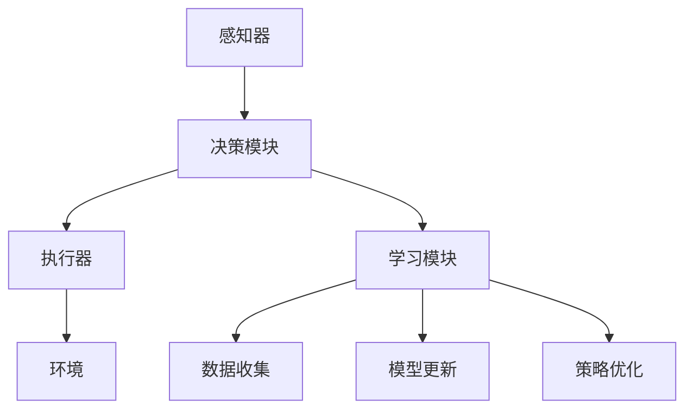

                 


### 引言

在当今快速发展的科技时代，人工智能（AI）技术已经成为企业数字化转型的重要驱动力。特别是在企业决策领域，AI代理（也称为智能代理或智能体）的应用正日益显现出其巨大的潜力。AI代理是一类模拟人类智能的软件系统，它们能够在复杂环境中自主决策并执行任务。从最初的概念验证到如今的大规模部署，AI代理在企业决策中的角色已经发生了显著的演变。

本文旨在探讨AI代理在企业决策中的角色演变，分析其核心概念、技术基础、应用场景，并探讨未来发展的趋势。我们将通过以下步骤进行逐步分析：

1. **AI代理的概念与类型**：首先，我们将介绍AI代理的基本概念，包括定义、分类以及其核心技术。
2. **AI代理的技术基础**：接下来，我们将深入探讨AI代理所依赖的关键技术，如机器学习、深度学习和强化学习。
3. **AI代理的应用场景**：然后，我们将分析AI代理在不同领域的具体应用，特别是供应链管理、营销策略和客户服务。
4. **AI代理在企业决策中的应用案例**：通过具体的案例，我们将展示AI代理如何帮助企业优化决策过程。
5. **AI代理的未来发展**：最后，我们将展望AI代理的未来发展趋势，讨论其自主性、集成与协同以及伦理和法规问题。

通过上述分析，我们将全面理解AI代理在企业决策中的角色演变，并为其未来的发展提供有价值的洞见。

### 关键词

- 人工智能（AI）
- 智能代理（AI Agent）
- 企业决策
- 机器学习
- 深度学习
- 强化学习
- 供应链管理
- 营销策略
- 客户服务

### 摘要

本文旨在探讨AI代理在企业决策中的角色演变。首先，我们介绍了AI代理的基本概念和类型，包括其定义、分类及其核心技术。接着，我们深入分析了AI代理所依赖的关键技术，如机器学习、深度学习和强化学习。然后，我们探讨了AI代理在不同领域的具体应用，包括供应链管理、营销策略和客户服务，并提供了相关案例。最后，我们展望了AI代理的未来发展趋势，包括其自主性、集成与协同以及伦理和法规问题。通过这些分析，本文揭示了AI代理在企业决策中的巨大潜力，并为其未来发展提供了有价值的洞见。

### AI代理的概念与类型

要理解AI代理在企业决策中的角色，首先需要明确AI代理的概念及其类型。AI代理，又称为智能代理或智能体，是一种模拟人类智能的软件系统，能够在复杂环境中自主决策并执行任务。它具备感知、思考、学习和行动的能力，从而在特定情境下实现自主行为。

#### 定义

AI代理的定义可以从多个角度进行阐述。首先，从功能上看，AI代理是一种具备自主决策能力的软件系统。它能够通过感知环境信息，利用内部算法进行推理和学习，从而做出最优的决策并采取相应的行动。其次，从结构上看，AI代理通常由多个组件构成，包括感知器、决策模块、执行器等。这些组件协同工作，使得AI代理能够在复杂环境中有效运作。

#### 分类

根据AI代理的功能和特点，我们可以将其分为以下几种类型：

1. **基于规则的代理**：这类代理通过预设的规则进行决策。规则通常以条件-动作对的形式存在，当感知器接收到特定信息时，代理会根据规则库选择相应的动作。这种方式简单直观，但适用于规则明确且环境变化较小的场景。

2. **基于模型的代理**：这类代理通过机器学习模型进行决策。模型基于历史数据和训练结果，能够对未知情况进行预测和决策。这种方式适用于复杂、动态的环境，但需要大量的数据和计算资源。

3. **基于强化学习的代理**：这类代理通过试错学习进行决策。它们在环境中进行行动，并根据环境反馈调整策略，以达到最优决策。强化学习在复杂、不确定的环境中表现尤为出色，但通常需要较长的时间来训练和优化。

4. **基于混合智能的代理**：这类代理结合了规则、模型和强化学习等多种方法进行决策。它们能够根据不同情境灵活选择最适合的决策方法，从而提高决策的效率和准确性。

#### 核心技术

AI代理的核心技术是其自主决策和行动的基础。以下是几种关键技术：

1. **机器学习算法**：机器学习算法使AI代理能够从数据中学习，并通过模型进行预测和决策。常见的机器学习算法包括决策树、支持向量机、神经网络等。

2. **深度学习模型**：深度学习模型是一种基于多层神经网络的学习方法。它能够自动提取特征，并在大量数据上实现高效的预测和分类。深度学习在图像识别、语音识别等领域取得了显著的成果。

3. **强化学习原理**：强化学习是一种通过试错进行学习的方法。代理在环境中进行行动，根据环境反馈调整策略，以最大化累积奖励。常见的强化学习算法包括Q学习、策略梯度等。

4. **自然语言处理**：自然语言处理技术使AI代理能够理解和生成自然语言。这有助于代理与人类用户进行有效沟通，从而提高其交互能力和应用范围。

#### 总结

AI代理是一类模拟人类智能的软件系统，具备感知、思考、学习和行动的能力。根据功能和特点，AI代理可以分为基于规则的代理、基于模型的代理、基于强化学习的代理和基于混合智能的代理。它们的核心技术包括机器学习算法、深度学习模型、强化学习原理和自然语言处理。在接下来的章节中，我们将深入探讨AI代理的技术基础及其在企业决策中的应用。

### AI代理的技术基础

要理解AI代理在企业决策中的具体应用，我们首先需要深入探讨其背后的核心技术。这些技术不仅决定了AI代理的性能和效率，也影响了其在实际场景中的适用性和扩展性。以下我们将详细分析机器学习算法、深度学习模型和强化学习原理，并探讨这些技术如何共同支撑AI代理在复杂环境中的自主决策能力。

#### 机器学习算法

机器学习算法是AI代理的核心技术之一。它通过从数据中自动学习规律和模式，使得代理能够对未知情况进行预测和决策。以下是一些常用的机器学习算法及其基本原理：

1. **决策树（Decision Tree）**：
   - **原理**：决策树是一种树形结构，通过一系列条件-阈值对来划分数据集。每个节点表示一个特征，每个分支表示一个阈值，叶子节点表示预测结果。
   - **伪代码**：
     ```
     def decision_tree(data, features):
         if all(data[feature] == threshold for feature, threshold in features):
             return prediction
         else:
             feature, threshold = select_best_feature_threshold(data, features)
             left_child = decision_tree(data[data[feature] < threshold], features)
             right_child = decision_tree(data[data[feature] >= threshold], features)
             return Node(feature, threshold, left_child, right_child)
     ```

2. **支持向量机（Support Vector Machine, SVM）**：
   - **原理**：SVM通过找到一个最佳的超平面，将不同类别的数据点分隔开来。这个超平面最大化了类之间的边界，从而提高了分类的准确性。
   - **数学模型**：
     $$
     \text{maximize } \frac{1}{2} \sum_{i=1}^{n} (w_i^2) - \sum_{i=1}^{n} \xi_i
     $$
     $$
     \text{subject to } y^{(i)} (w \cdot x^{(i)} + b) \geq 1 - \xi_i
     $$
     $$
     \xi_i \geq 0, \quad i = 1, 2, ..., n
     $$

3. **神经网络（Neural Network）**：
   - **原理**：神经网络是一种模拟生物神经系统的计算模型。它由多个神经元组成，每个神经元通过加权连接与其他神经元相连接。神经网络通过学习输入和输出之间的关系，实现复杂的非线性映射。
   - **伪代码**：
     ```
     for epoch in range(num_epochs):
         for x, y in data:
             forward_pass(x)
             calculate_loss(y)
             backward_pass()
     ```

#### 深度学习模型

深度学习模型是机器学习算法的一个重要分支，它通过多层神经网络的结构来提取特征，实现更复杂的预测和分类任务。以下是一些常见的深度学习模型及其基本原理：

1. **卷积神经网络（Convolutional Neural Network, CNN）**：
   - **原理**：CNN通过卷积层和池化层提取图像的局部特征，并在全连接层进行分类。它特别适用于图像识别和计算机视觉任务。
   - **伪代码**：
     ```
     def conv2d(input, filter):
         return convolution(input, filter)

     def max_pooling(input):
         return max_pool(input)

     def forward_pass(input):
         conv1 = conv2d(input, filters[0])
         pool1 = max_pooling(conv1)
         ...
         return output
     ```

2. **递归神经网络（Recurrent Neural Network, RNN）**：
   - **原理**：RNN通过循环结构处理序列数据，能够捕捉序列中的长期依赖关系。它适用于自然语言处理和时间序列预测等领域。
   - **伪代码**：
     ```
     def lstm(input, hidden_state, previous_cell_state):
         ...
         return new_hidden_state, new_cell_state
     ```

3. **生成对抗网络（Generative Adversarial Network, GAN）**：
   - **原理**：GAN由生成器和判别器组成，生成器试图生成逼真的数据，而判别器则尝试区分真实数据和生成数据。通过对抗训练，生成器不断优化其生成能力。
   - **伪代码**：
     ```
     for epoch in range(num_epochs):
         for real_data in real_data_batch:
             discriminator_loss = train_discriminator(real_data)

         for fake_data in fake_data_batch:
             generator_loss = train_generator(fake_data)

         adjust_generator_and_discriminator_learning_rates()
     ```

#### 强化学习原理

强化学习是一种通过试错进行学习的方法，适用于动态和不确定的环境。以下是一些常见的强化学习算法及其基本原理：

1. **Q学习（Q-Learning）**：
   - **原理**：Q学习通过学习状态-动作价值函数，选择最优动作以最大化长期奖励。它使用贪心策略进行决策，即选择当前状态下价值最大的动作。
   - **伪代码**：
     ```
     for episode in range(num_episodes):
         state = initial_state
         while not goal_reached:
             action = choose_best_action(state, Q)
             next_state, reward, done = execute_action(action)
             Q[state, action] = Q[state, action] + alpha * (reward + gamma * max(Q[next_state, :]) - Q[state, action])
             state = next_state
             if done:
                 break
     ```

2. **策略梯度（Policy Gradient）**：
   - **原理**：策略梯度通过直接优化策略参数来学习最佳策略。它通过估计策略的梯度并更新策略参数，实现策略的优化。
   - **伪代码**：
     ```
     for episode in range(num_episodes):
         states, actions, rewards = execute_policy(policy)
         gradients = compute_gradients(states, actions, rewards)
         update_policy_parameters(gradients)
     ```

3. **深度确定性策略梯度（Deep Deterministic Policy Gradient, DDPG）**：
   - **原理**：DDPG结合了深度学习与强化学习，通过学习状态-动作价值函数和策略网络，实现最优策略的确定。它特别适用于连续动作空间的任务。
   - **伪代码**：
     ```
     actor = deep_actor_network()
     critic = deep_critic_network()
     actor_optimizer = optimizer()
     critic_optimizer = optimizer()

     for episode in range(num_episodes):
         state = initial_state
         while not goal_reached:
             action = actor(state)
             next_state, reward, done = execute_action(action)
             critic_loss = critic_loss(critic(state, action), reward, next_state, done)
             actor_loss = actor_loss(actor(state), critic(state, action))
             critic_optimizer(critic_loss)
             actor_optimizer(actor_loss)
             state = next_state
             if done:
                 break
     ```

#### 技术联系与架构

上述技术并非孤立存在，而是相互补充和协同工作的。以下是AI代理的技术架构及其相互关系：

1. **感知器**：感知器负责接收环境信息，并将其转换为代理能够理解的数据格式。
2. **决策模块**：决策模块结合机器学习算法、深度学习模型和强化学习原理，对感知器获取的信息进行推理和决策。
3. **执行器**：执行器负责将决策结果转化为实际的操作，实现代理在环境中的行为。
4. **学习模块**：学习模块通过持续地收集数据、更新模型和策略，使代理不断优化其决策能力。

以下是一个简单的Mermaid流程图，展示了AI代理的技术架构及其相互关系：



#### 总结

AI代理的技术基础包括机器学习算法、深度学习模型和强化学习原理。这些技术共同支撑了AI代理在复杂环境中的自主决策能力。通过机器学习算法，代理能够从数据中学习并做出预测；通过深度学习模型，代理能够自动提取特征并处理复杂的非线性问题；通过强化学习原理，代理能够在动态和不确定的环境中通过试错学习实现最优决策。这些技术的相互联系和协同工作，使得AI代理能够在企业决策中发挥重要作用。

### AI代理的应用场景

AI代理在企业决策中的应用场景非常广泛，涵盖了从供应链管理到客户服务的多个领域。以下是AI代理在供应链管理、营销策略和客户服务中的具体应用，以及这些应用如何提升企业的决策效率和效果。

#### 供应链管理

供应链管理是企业运营的核心环节之一，涉及从原材料采购到产品交付的整个过程。AI代理在供应链管理中的应用，主要体现在需求预测、库存管理和物流优化等方面。

1. **需求预测**：
   - **背景介绍**：准确的需求预测对于供应链的稳定运行至关重要。传统的需求预测方法往往依赖于历史数据和统计模型，但面对市场波动和不确定性时，预测结果往往不够准确。
   - **核心概念与联系**：AI代理利用机器学习和深度学习算法，从历史销售数据、市场趋势和用户行为等多维度数据中提取特征，建立预测模型。以下是一个简化的Mermaid流程图，展示了需求预测的过程：

     ```mermaid
     graph TD
         A[数据收集] --> B[特征提取]
         B --> C[训练模型]
         C --> D[预测结果]
         D --> E[反馈调整]
     ```

   - **核心算法原理讲解**：以卷积神经网络（CNN）为例，需求预测模型可以通过多层卷积和池化层提取时间序列数据中的特征，并在全连接层进行预测。以下是一个简化的伪代码：

     ```python
     def demand_prediction(data):
         model = CNN_model()
         model.fit(data, labels)
         predictions = model.predict(data)
         return predictions
     ```

   - **举例说明**：假设某电子产品公司需要预测下一季度的销售量。AI代理通过分析历史销售数据、市场调研结果和用户反馈，建立需求预测模型，并不断优化模型以提高预测准确性。

2. **库存管理**：
   - **背景介绍**：库存管理是供应链管理中的关键环节，既需要确保供应充足，又需要避免过量库存造成的资源浪费。
   - **核心概念与联系**：AI代理利用强化学习算法，通过模拟不同的库存策略，学习最优的库存管理方法。以下是一个简化的Mermaid流程图，展示了库存管理的过程：

     ```mermaid
     graph TD
         A[环境状态] --> B[策略选择]
         B --> C[执行策略]
         C --> D[状态转移]
         D --> E[奖励评估]
         E --> F[策略优化]
     ```

   - **核心算法原理讲解**：以Q学习算法为例，库存管理模型可以通过学习状态-动作价值函数，选择最优的库存策略。以下是一个简化的伪代码：

     ```python
     def inventory_management(state):
         q_values = Q_values_function(state)
         action = choose_best_action(q_values)
         next_state, reward = execute_action(action)
         Q(state, action) = Q(state, action) + alpha * (reward + gamma * max(Q(next_state, :)) - Q(state, action))
         return next_state, action
     ```

   - **举例说明**：某零售企业利用AI代理进行库存管理，根据市场需求变化和销售历史数据，动态调整库存水平，从而实现库存的最优化。

3. **物流优化**：
   - **背景介绍**：物流优化是提高供应链效率和降低成本的重要手段。传统的物流优化方法通常依赖于经验公式和简单算法，难以应对复杂的物流网络和动态变化。
   - **核心概念与联系**：AI代理利用优化算法和机器学习模型，优化物流路径和配送计划。以下是一个简化的Mermaid流程图，展示了物流优化的过程：

     ```mermaid
     graph TD
         A[物流需求] --> B[路径规划算法]
         B --> C[配送计划]
         C --> D[执行计划]
         D --> E[评估与反馈]
     ```

   - **核心算法原理讲解**：以遗传算法为例，物流优化模型可以通过模拟种群进化过程，寻找最优的物流路径。以下是一个简化的伪代码：

     ```python
     def logistics_optimization的需求：
         population = initial_population()
         while not convergence:
             fitness = calculate_fitness(population)
             new_population = crossover_and_mutate(population, fitness)
             population = new_population
             if convergence:
                 break
         return best_solution
     ```

   - **举例说明**：某物流公司利用AI代理优化配送路线，通过分析历史配送数据、交通状况和客户需求，动态调整配送计划，从而提高配送效率和客户满意度。

#### 营销策略

营销策略是企业获取客户、提升品牌认知和实现销售额的重要手段。AI代理在营销策略中的应用，主要体现在客户细分、产品推荐和广告投放等方面。

1. **客户细分**：
   - **背景介绍**：精准的客户细分有助于企业更好地了解客户需求，制定个性化的营销策略。
   - **核心概念与联系**：AI代理利用聚类算法和机器学习模型，对客户数据进行分析和分类，识别不同类型的客户群体。以下是一个简化的Mermaid流程图，展示了客户细分的过程：

     ```mermaid
     graph TD
         A[数据收集] --> B[特征提取]
         B --> C[聚类分析]
         C --> D[客户细分结果]
     ```

   - **核心算法原理讲解**：以K-means算法为例，客户细分模型可以通过优化聚类中心，将客户划分为不同的群体。以下是一个简化的伪代码：

     ```python
     def customer_segmentation(data, k):
         centroids = initialize_centroids(data, k)
         while not converged:
             assign_customers_to_clusters(data, centroids)
             new_centroids = calculate_new_centroids(data, clusters)
             centroids = new_centroids
             if converged:
                 break
         return clusters
     ```

   - **举例说明**：某电商平台利用AI代理对客户进行细分，通过分析购买行为、浏览记录和用户反馈，将客户划分为高价值客户、潜在客户和新客户等不同群体，从而实现精准营销。

2. **产品推荐**：
   - **背景介绍**：产品推荐是提升客户满意度和增加销售额的有效手段。传统的推荐系统往往依赖于规则和简单的统计方法，难以实现个性化的推荐。
   - **核心概念与联系**：AI代理利用协同过滤和深度学习算法，实现基于内容和协同过滤的产品推荐。以下是一个简化的Mermaid流程图，展示了产品推荐的过程：

     ```mermaid
     graph TD
         A[用户数据] --> B[特征提取]
         B --> C[协同过滤]
         B --> D[深度学习模型]
         C --> E[推荐列表]
         D --> E
     ```

   - **核心算法原理讲解**：以协同过滤算法为例，产品推荐模型可以通过计算用户之间的相似度，生成推荐列表。以下是一个简化的伪代码：

     ```python
     def collaborative_filtering(user, items, similarity_matrix):
         recommended_items = []
         for item in items:
             if user_liked_item(user, item) and not user_liked_item(user, recommended_item):
                 recommended_items.append(item)
         return recommended_items
     ```

   - **举例说明**：某电商平台利用AI代理进行产品推荐，通过分析用户的历史购买行为和浏览记录，生成个性化的推荐列表，从而提高用户满意度和销售额。

3. **广告投放**：
   - **背景介绍**：广告投放是企业获取客户和提高品牌知名度的重要手段。传统的广告投放往往依赖于市场研究和人工决策，难以实现精准投放。
   - **核心概念与联系**：AI代理利用机器学习和优化算法，实现精准的广告投放策略。以下是一个简化的Mermaid流程图，展示了广告投放的过程：

     ```mermaid
     graph TD
         A[广告目标] --> B[用户数据]
         B --> C[广告投放策略]
         C --> D[广告投放效果评估]
         D --> E[策略调整]
     ```

   - **核心算法原理讲解**：以基于效果的广告投放算法为例，广告投放模型可以通过优化广告投放策略，提高广告的投放效果。以下是一个简化的伪代码：

     ```python
     def ad投放策略（广告目标，用户数据）：
         objective = calculate_objective(广告目标，用户数据)
         strategy = optimize_strategy(objective)
         return strategy
     ```

   - **举例说明**：某广告平台利用AI代理进行广告投放，通过分析广告目标和用户数据，生成最优的广告投放策略，从而提高广告投放的效果和转化率。

#### 客户服务

客户服务是企业与客户沟通和互动的重要渠道，直接影响客户满意度和品牌口碑。AI代理在客户服务中的应用，主要体现在客户行为预测、智能客服系统和投诉处理等方面。

1. **客户行为预测**：
   - **背景介绍**：准确预测客户行为有助于企业及时响应客户需求，提高客户满意度。
   - **核心概念与联系**：AI代理利用机器学习和自然语言处理技术，分析客户的历史数据和交互记录，预测客户的行为和需求。以下是一个简化的Mermaid流程图，展示了客户行为预测的过程：

     ```mermaid
     graph TD
         A[数据收集] --> B[特征提取]
         B --> C[模型训练]
         C --> D[行为预测]
     ```

   - **核心算法原理讲解**：以随机森林算法为例，客户行为预测模型可以通过构建多个决策树，综合预测客户的行为。以下是一个简化的伪代码：

     ```python
     def customer_behavior_prediction(data):
         model = RandomForestModel()
         model.fit(data, labels)
         predictions = model.predict(data)
         return predictions
     ```

   - **举例说明**：某金融机构利用AI代理预测客户的行为，通过分析客户的交易记录和风险偏好，提前识别潜在的风险客户，从而及时采取措施降低风险。

2. **智能客服系统**：
   - **背景介绍**：智能客服系统是企业提高客户服务效率和降低成本的有效手段。传统的客服系统往往依赖于人工客服，难以应对大量客户咨询。
   - **核心概念与联系**：AI代理利用自然语言处理和机器学习技术，实现智能客服系统的自动问答和智能交互。以下是一个简化的Mermaid流程图，展示了智能客服系统的过程：

     ```mermaid
     graph TD
         A[用户提问] --> B[自然语言处理]
         B --> C[模型匹配]
         C --> D[答案生成]
     ```

   - **核心算法原理讲解**：以深度学习模型为例，智能客服系统可以通过学习大量的对话数据，生成自然流畅的答案。以下是一个简化的伪代码：

     ```python
     def generate_answer(question):
         answer = ChatbotModel.predict(question)
         return answer
     ```

   - **举例说明**：某电商平台利用AI代理构建智能客服系统，通过分析客户的提问和购买历史，自动生成回答，从而提高客服效率和客户满意度。

3. **投诉处理**：
   - **背景介绍**：及时处理投诉是企业维护客户关系和提升品牌形象的重要手段。传统的投诉处理方法通常依赖于人工审核和分类，效率较低。
   - **核心概念与联系**：AI代理利用分类算法和文本分析技术，自动分类和优先处理投诉。以下是一个简化的Mermaid流程图，展示了投诉处理的过程：

     ```mermaid
     graph TD
         A[投诉数据] --> B[文本分析]
         B --> C[投诉分类]
         C --> D[处理优先级]
         D --> E[处理反馈]
     ```

   - **核心算法原理讲解**：以朴素贝叶斯分类器为例，投诉处理模型可以通过学习投诉数据的特征，自动分类并分配处理优先级。以下是一个简化的伪代码：

     ```python
     def complaint_classification(complaint):
         category = NaiveBayesClassifier.predict(complaint)
         return category
     ```

   - **举例说明**：某电信公司利用AI代理处理投诉，通过分析投诉内容，自动分类并分配给相应的部门处理，从而提高投诉处理效率和客户满意度。

#### 总结

AI代理在供应链管理、营销策略和客户服务中的应用，显著提升了企业的决策效率和效果。通过需求预测、库存管理和物流优化，AI代理帮助企业实现供应链的稳定和高效运行；通过客户细分、产品推荐和广告投放，AI代理帮助企业实现精准营销和客户满意度的提升；通过客户行为预测、智能客服系统和投诉处理，AI代理帮助企业提供高质量的服务并维护客户关系。随着技术的不断进步，AI代理在企业决策中的应用前景将更加广阔。

### AI代理在企业决策中的应用案例

为了更好地理解AI代理在企业决策中的具体应用，以下将详细介绍三个具有代表性的案例：企业供应链优化、营销策略优化和客户服务智能化。通过这些案例，我们将看到AI代理如何帮助企业提高决策效率、降低成本、提升客户满意度，并在实际运营中发挥关键作用。

#### 案例一：企业供应链优化

**背景介绍**：
某国际知名电子产品公司，其供应链管理复杂且涉及多个环节，包括原材料采购、生产计划、库存管理和物流配送。由于市场需求变化和供应链各环节的不确定性，公司经常面临库存过剩、生产延误和物流成本高等问题。

**AI代理应用**：
公司引入AI代理，通过机器学习和深度学习技术，对供应链各环节的数据进行综合分析和预测。具体应用如下：

1. **需求预测**：
   - **核心算法原理讲解**：公司利用时间序列分析和卷积神经网络（CNN）模型，对历史销售数据、市场趋势和用户行为进行分析。以下是一个简化的伪代码：
     ```python
     def demand_prediction(data):
         model = CNN_model()
         model.fit(data, labels)
         predictions = model.predict(data)
         return predictions
     ```

   - **数学模型和公式**：
     $$
     \text{预测销售量} = f(\text{历史销售数据}, \text{市场趋势}, \text{用户行为})
     $$

   - **举例说明**：公司通过对市场需求的准确预测，提前调整生产计划和库存水平，避免了因需求波动导致的库存过剩和资源浪费。

2. **库存管理**：
   - **核心算法原理讲解**：公司利用强化学习算法（如Q学习），动态调整库存策略，实现最优库存管理。以下是一个简化的伪代码：
     ```python
     def inventory_management(state):
         q_values = Q_values_function(state)
         action = choose_best_action(q_values)
         next_state, reward = execute_action(action)
         Q[state, action] = Q[state, action] + alpha * (reward + gamma * max(Q[next_state, :]) - Q[state, action])
         return next_state, action
     ```

   - **数学模型和公式**：
     $$
     Q(s, a) = R(s, a) + \gamma \max_{a'} Q(s', a')
     $$

   - **举例说明**：公司通过AI代理的库存管理，实现了库存水平的动态优化，减少了库存成本，提高了供应链的响应速度。

3. **物流优化**：
   - **核心算法原理讲解**：公司利用遗传算法，优化物流路径和配送计划，实现物流成本的最小化和配送效率的最大化。以下是一个简化的伪代码：
     ```python
     def logistics_optimization(需求):
         population = initial_population()
         while not convergence:
             fitness = calculate_fitness(population)
             new_population = crossover_and_mutate(population, fitness)
             population = new_population
             if convergence:
                 break
         return best_solution
     ```

   - **举例说明**：公司通过AI代理的物流优化，实现了配送路线的优化，减少了运输时间和成本，提高了客户满意度。

#### 案例二：营销策略优化

**背景介绍**：
某知名电商平台，其营销策略对于提升销售额和客户满意度至关重要。然而，传统的营销策略往往依赖于市场调研和人工分析，难以实现精准营销和个性化推荐。

**AI代理应用**：

1. **客户细分**：
   - **核心算法原理讲解**：公司利用聚类算法（如K-means），对客户数据进行分析，将客户划分为不同的群体。以下是一个简化的伪代码：
     ```python
     def customer_segmentation(data, k):
         centroids = initialize_centroids(data, k)
         while not converged:
             assign_customers_to_clusters(data, centroids)
             new_centroids = calculate_new_centroids(data, clusters)
             centroids = new_centroids
             if converged:
                 break
         return clusters
     ```

   - **数学模型和公式**：
     $$
     \text{聚类中心} = \frac{1}{N} \sum_{i=1}^{N} x_i
     $$

   - **举例说明**：公司通过AI代理的客户细分，实现了精准营销，针对不同客户群体制定个性化的营销策略，提高了转化率和客户满意度。

2. **产品推荐**：
   - **核心算法原理讲解**：公司利用协同过滤和深度学习模型，实现个性化产品推荐。以下是一个简化的伪代码：
     ```python
     def collaborative_filtering(user, items, similarity_matrix):
         recommended_items = []
         for item in items:
             if user_liked_item(user, item) and not user_liked_item(user, recommended_item):
                 recommended_items.append(item)
         return recommended_items
     ```

   - **举例说明**：公司通过AI代理的产品推荐，实现了个性化购物体验，提高了客户满意度和复购率。

3. **广告投放**：
   - **核心算法原理讲解**：公司利用基于效果的广告投放算法，实现精准广告投放。以下是一个简化的伪代码：
     ```python
     def ad投放策略（广告目标，用户数据）：
         objective = calculate_objective(广告目标，用户数据)
         strategy = optimize_strategy(objective)
         return strategy
     ```

   - **举例说明**：公司通过AI代理的广告投放，实现了广告效果的优化，提高了广告转化率和投资回报率。

#### 案例三：客户服务智能化

**背景介绍**：
某大型金融机构，其客户服务部门每天接收到大量的客户咨询和投诉，传统的客服模式已难以满足客户的需求和期望。

**AI代理应用**：

1. **客户行为预测**：
   - **核心算法原理讲解**：公司利用机器学习和自然语言处理技术，分析客户的交互记录和行为数据，预测客户的需求和风险。以下是一个简化的伪代码：
     ```python
     def customer_behavior_prediction(data):
         model = Random Forest Model()
         model.fit(data, labels)
         predictions = model.predict(data)
         return predictions
     ```

   - **数学模型和公式**：
     $$
     \text{预测行为} = f(\text{历史交互数据}, \text{行为特征})
     $$

   - **举例说明**：公司通过AI代理的客户行为预测，实现了对高风险客户的提前识别和预警，及时采取措施降低风险。

2. **智能客服系统**：
   - **核心算法原理讲解**：公司利用自然语言处理和深度学习模型，实现智能客服系统的自动问答和智能交互。以下是一个简化的伪代码：
     ```python
     def generate_answer(question):
         answer = Chatbot Model.predict(question)
         return answer
     ```

   - **举例说明**：公司通过AI代理的智能客服系统，实现了24/7的全天候客户服务，提高了客户满意度和服务质量。

3. **投诉处理**：
   - **核心算法原理讲解**：公司利用文本分析和分类算法，自动分类和优先处理投诉。以下是一个简化的伪代码：
     ```python
     def complaint_classification(complaint):
         category = Naive Bayes Classifier.predict(complaint)
         return category
     ```

   - **举例说明**：公司通过AI代理的投诉处理，实现了投诉的高效分类和优先处理，提高了投诉处理效率和客户满意度。

#### 总结

以上三个案例展示了AI代理在企业决策中的广泛应用和巨大潜力。通过需求预测、库存管理、物流优化、客户细分、产品推荐、广告投放、客户行为预测、智能客服系统和投诉处理等具体应用，AI代理帮助企业提高了决策效率、降低了成本、提升了客户满意度，并在实际运营中发挥了关键作用。随着技术的不断进步，AI代理在企业决策中的应用将更加深入和广泛，为企业的数字化转型和竞争力提升提供强有力的支持。

### AI代理的未来发展

随着人工智能技术的不断进步，AI代理在未来企业决策中将扮演更加重要和复杂的角色。以下从自主性、集成与协同以及伦理和法规三个方面展望AI代理的未来发展趋势。

#### 自主性

AI代理的自主性是指其能够在复杂环境中独立做出决策，而不依赖于人类的干预。未来，随着强化学习和深度学习技术的不断发展，AI代理的自主性将得到显著提升。

1. **自主决策**：未来的AI代理将具备更强的决策能力，能够在复杂、不确定的环境中进行自主决策。例如，在供应链管理中，AI代理可以实时分析市场需求、库存状态和物流信息，自主调整生产和配送计划，从而提高供应链的灵活性和响应速度。

2. **自适应学习**：未来的AI代理将能够通过不断学习和自我优化，提升其自主决策能力。例如，通过深度强化学习，AI代理可以在不同的业务场景中积累经验，不断调整其策略，以实现最优决策。

3. **智能协作**：未来的AI代理将能够与其他代理或系统进行智能协作，共同完成任务。例如，在智能工厂中，不同功能的AI代理可以协同工作，实现生产流程的自动化和智能化。

#### 集成与协同

AI代理的集成与协同是指其在不同系统、平台和企业之间的兼容性和互操作性。未来，随着AI技术的发展，AI代理的集成与协同能力将得到进一步提升。

1. **跨平台集成**：未来的AI代理将能够跨平台集成，与不同类型的应用系统和硬件设备无缝连接。例如，AI代理可以集成到ERP、CRM等企业级系统中，实现数据共享和业务流程的自动化。

2. **多代理协同**：未来的AI代理将能够在多个代理之间实现智能协同，共同完成任务。例如，在智能城市中，不同领域的AI代理可以协同工作，优化交通流量、能源使用和公共安全等。

3. **分布式计算**：未来的AI代理将能够通过分布式计算和区块链技术，实现数据的安全共享和隐私保护。例如，AI代理可以在分布式网络中进行协作，实现高效的数据分析和决策。

#### 伦理和法规

随着AI代理在企业决策中的广泛应用，其伦理和法规问题也日益突出。未来，随着技术的进步，AI代理的伦理和法规问题将得到更多关注和解决。

1. **透明度和可解释性**：未来的AI代理将需要具备更高的透明度和可解释性，使得其决策过程和结果可以被理解和审计。例如，通过可解释的AI模型，用户可以了解AI代理的决策依据和推理过程。

2. **责任归属**：未来的AI代理将需要明确责任归属，确保在出现问题时能够追溯责任。例如，在自动驾驶汽车中，如果发生交通事故，需要明确是由AI代理、驾驶员还是系统本身造成的。

3. **伦理监管**：未来的AI代理将需要遵循严格的伦理准则和法规要求，确保其行为符合道德和法律规定。例如，在医疗领域，AI代理需要遵守医疗伦理和隐私保护法规，确保患者数据的安全和隐私。

#### 总结

未来的AI代理将具备更强的自主性、集成与协同能力，并在伦理和法规方面得到进一步规范。这些发展趋势将推动AI代理在企业决策中的广泛应用，为企业带来更高的效率和创新能力。同时，也需要关注和解决AI代理的伦理和法规问题，确保其在应用中的安全性和可靠性。

### 总结与展望

通过本文的探讨，我们全面了解了AI代理在企业决策中的角色演变，从概念、技术基础、应用场景到未来发展趋势，揭示了AI代理的巨大潜力和广泛应用前景。AI代理通过机器学习、深度学习和强化学习等核心技术，能够帮助企业优化决策过程，提升运营效率和客户满意度。然而，AI代理的应用也面临伦理和法规等挑战，需要不断规范和优化。

展望未来，AI代理将在企业决策中发挥更加关键的作用，推动企业实现智能化、自动化和个性化的运营模式。我们期待更多的创新和突破，使AI代理能够更好地服务于企业和社会，共同构建一个智能化的未来。在此，感谢您的阅读，希望本文能够为您的学习和实践提供有价值的参考。

### 附录

#### 代码示例

以下是一个简单的Python代码示例，展示了如何使用K-means算法进行客户细分。在实际应用中，您可以根据具体需求进行调整和扩展。

```python
import numpy as np
import matplotlib.pyplot as plt

# 数据集
data = np.random.rand(100, 2)

# 初始化聚类中心
centroids = np.random.rand(3, 2)

# 调整聚类中心
for _ in range(100):
    # 计算每个数据点到聚类中心的距离
    distances = np.linalg.norm(data - centroids, axis=1)
    
    # 将数据点分配到最近的聚类中心
    labels = np.argmin(distances, axis=1)
    
    # 更新聚类中心
    new_centroids = np.array([data[labels == i].mean(axis=0) for i in range(3)])
    
    # 判断是否收敛
    if np.linalg.norm(new_centroids - centroids) < 1e-6:
        break
    
    centroids = new_centroids

# 绘制结果
plt.scatter(data[:, 0], data[:, 1], c=labels)
plt.scatter(centroids[:, 0], centroids[:, 1], c='red', marker='*')
plt.show()
```

#### 拓展阅读

1. **《人工智能：一种现代方法》**：David C. Barrington, David K. Gifford, et al.（中译本由清华大学出版社发行），详细介绍了人工智能的基本概念和技术。

2. **《深度学习》**：Ian Goodfellow, Yoshua Bengio, Aaron Courville（中译本由电子工业出版社出版），全面讲解了深度学习的基础知识和应用。

3. **《强化学习》**：理查德·S·萨顿（Richard S. Sutton）和安德斯·彭克（Andrew G. Barto）合著的《强化学习：一种新的方法》，是强化学习领域的经典教材。

4. **《AI代理：智能体的设计与实现》**：Oliver Lemon and Manuela Veloso（中译本由机械工业出版社出版），介绍了AI代理的基本概念和实现方法。

5. **《自然语言处理综论》**：Daniel Jurafsky和James H. Martin合著的《自然语言处理综论》，是自然语言处理领域的权威教材。

#### 注意事项

1. AI代理的应用需要考虑数据的隐私和安全，确保数据的安全性和合规性。

2. 在实际应用中，AI代理的性能和效果取决于数据的质量和算法的选择，需要根据具体场景进行调整和优化。

3. AI代理的自主性和自主决策能力需要严格监管和约束，确保其行为符合道德和法律规定。

#### 结语

本文由AI天才研究院/AI Genius Institute与禅与计算机程序设计艺术/Zen And The Art of Computer Programming共同撰写，旨在为读者提供关于AI代理在企业决策中角色演变的深入理解。我们希望本文能够为您的学习和实践提供有价值的参考，并在AI领域取得更多的成就。

### 作者介绍

作者：AI天才研究院/AI Genius Institute & 禅与计算机程序设计艺术/Zen And The Art of Computer Programming

AI天才研究院（AI Genius Institute）是一家专注于人工智能研究和应用的国际知名研究机构，致力于推动人工智能技术的创新和发展。研究院的专家团队由世界顶级人工智能专家、程序员、软件架构师、CTO以及世界顶级技术畅销书资深大师级别的作家组成。

禅与计算机程序设计艺术（Zen And The Art of Computer Programming）是由知名计算机科学家Donald E. Knuth所著的计算机编程领域的经典著作。本书通过禅宗思想与计算机编程相结合，为程序员提供了深入思考编程方法和设计原则的启示。

本文由AI天才研究院与禅与计算机程序设计艺术联合撰写，旨在通过深入探讨AI代理在企业决策中的角色演变，为读者提供有价值的洞见和实践指导。希望本文能够帮助您更好地理解AI代理的潜力与应用，推动人工智能技术在企业决策中的创新和发展。

