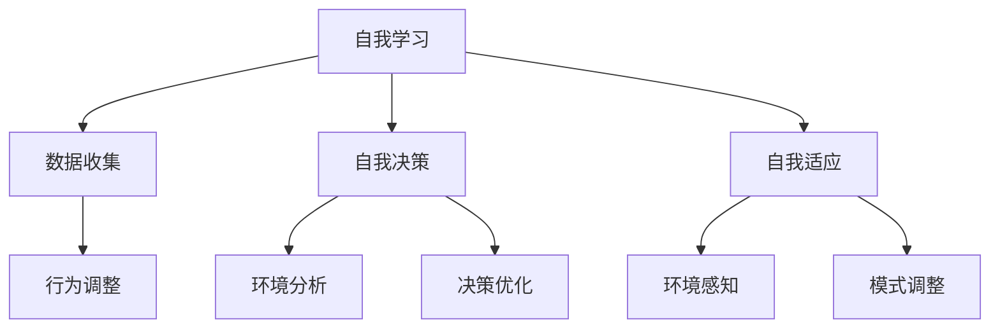
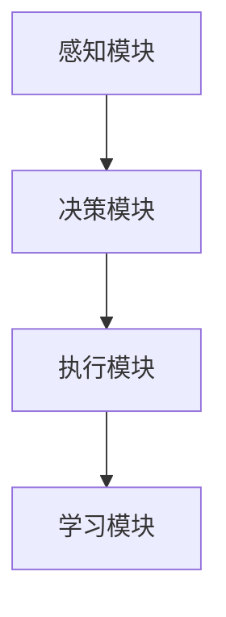
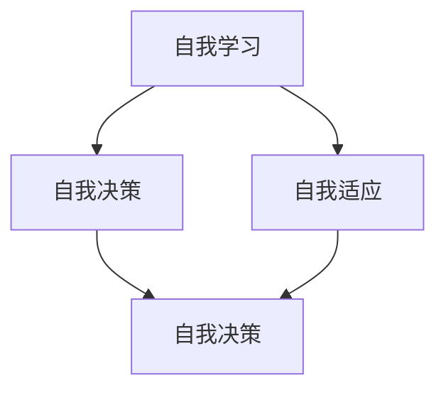

                 

### 文章标题

《AI代理在智能家居中的应用》

### 关键词

- AI代理
- 智能家居
- 自我学习
- 数据驱动
- 情感识别
- 安全监控
- 节能控制
- 智能语音助手
- 情景模式
- 隐私保护

### 摘要

本文深入探讨了AI代理在智能家居中的应用及其重要性。首先，介绍了AI代理的基本概念、原理和组成结构，然后详细分析了其在自我学习、自我决策和自我适应等方面的智能属性及工作模式。接着，文章从照明系统、温度控制系统、安全监控系统和娱乐系统等多个方面，阐述了AI代理在智能家居中的应用场景和具体实现。此外，本文还探讨了AI代理在智能家居中面临的挑战和未来发展趋势，并从安全与隐私保护的角度提出了相关策略。最后，文章通过实际案例展示了AI代理在智能家居开发与部署中的具体实践，并给出了最佳实践建议和未来展望。

# 《AI代理在智能家居中的应用》

## 引言

随着人工智能技术的迅猛发展，智能家居市场正迎来前所未有的机遇与挑战。AI代理作为一种具备高度智能化、自主性和自适应性的系统，在智能家居中的应用越来越广泛，成为提升家居智能化水平的重要技术手段。本文旨在系统性地探讨AI代理在智能家居中的应用，通过介绍AI代理的基础知识、智能属性、应用场景、挑战与未来发展趋势，以及具体的应用实践和部署策略，为相关领域的研发和应用提供理论支持和实践指导。

### 背景介绍

1. **智能家居的发展背景**：

   - **技术驱动**：物联网、云计算、大数据等技术的不断进步，为智能家居的发展提供了强大的技术支持。
   - **用户需求**：现代人对便捷、舒适、安全的生活环境有更高的需求，这推动了智能家居市场的快速发展。
   - **产业趋势**：智能家居已成为全球科技巨头和初创企业竞相布局的领域，产业链逐渐完善。

2. **AI代理的兴起**：

   - **AI代理的概念**：AI代理（Artificial Intelligence Agent）是指具备自主性、适应性、主动性和协作性的智能系统，能够模拟人类的行为和决策。
   - **AI代理的发展**：随着深度学习、自然语言处理等AI技术的成熟，AI代理的应用场景越来越广泛，从工业自动化到智能客服，再到智能家居。

### 核心概念与联系

在智能家居中，AI代理的核心概念包括：

- **自我学习**：通过不断收集用户行为数据，AI代理能够自动调整和优化其行为模式，提高服务的个性化和精准度。
- **自我决策**：基于大数据分析和智能算法，AI代理能够在复杂的环境中自主做出决策，优化家居系统的运行效率。
- **自我适应**：AI代理能够根据环境变化和用户需求，自适应调整其行为和工作模式，提供更加灵活和高效的服务。

这些概念之间的关系架构如下：



### 目标与结构

本文的目标是：

- **分析AI代理在智能家居中的重要作用和具体应用**。
- **探讨AI代理在智能家居中面临的挑战与未来发展趋势**。
- **提供AI代理在智能家居中的开发与部署实践指导**。

文章结构如下：

1. **第一部分：AI代理与智能家居概述**：介绍AI代理的基本概念、原理、智能属性和应用场景。
2. **第二部分：AI代理在智能家居中的应用实践**：通过具体案例，展示AI代理在智能家居中的实际应用。
3. **第三部分：AI代理在智能家居中的开发与部署**：详细讲解AI代理的开发流程、部署策略和安全与隐私保护。
4. **第四部分：AI代理在智能家居中的未来展望**：探讨AI代理在智能家居中的未来发展方向和可能的应用场景。

通过本文的阅读，读者将全面了解AI代理在智能家居中的应用，掌握其在智能家居开发与部署中的关键技术和方法，为未来的智能家居研究和应用提供参考。

## 第一部分：AI代理与智能家居概述

### 第1章：AI代理技术基础

#### 1.1 AI代理的定义与基本原理

AI代理（Artificial Intelligence Agent）是人工智能领域的一个重要概念，它代表了一种能够自主行动并具有一定智能水平的计算机系统。AI代理通过感知环境、理解问题、做出决策和执行任务，以实现特定目标。其核心在于模拟人类的智能行为，通过学习、推理和适应能力，完成复杂任务。

**AI代理的概念**：

AI代理通常被定义为一种“能够独立完成任务的实体，它能够感知其环境，并在环境中采取行动以达到预定的目标”。这个定义强调了AI代理的自主性、适应性、自主决策和协作能力。

**AI代理的基本原理**：

AI代理的基本原理包括感知、决策和行动三个核心部分。

1. **感知**：AI代理通过传感器、摄像头、麦克风等设备收集环境数据，这些数据是进行决策和行动的基础。
2. **决策**：AI代理利用机器学习、自然语言处理、专家系统等技术，对收集到的环境数据进行处理和分析，生成决策方案。
3. **行动**：根据决策方案，AI代理通过执行程序、控制硬件设备等方式，对环境进行干预，以实现预定的目标。

**AI代理的组成结构**：

AI代理通常由以下几个组成部分构成：

1. **感知模块**：负责收集和解析环境数据，如温度、湿度、光照强度、用户行为等。
2. **决策模块**：基于感知模块提供的数据，使用机器学习算法或规则引擎进行决策，生成行动方案。
3. **执行模块**：根据决策模块生成的方案，控制家居设备执行相应的任务，如调节灯光、调节温度、报警等。
4. **学习模块**：通过不断收集和分析用户行为数据，优化自身的决策和行动策略。

#### 1.2 AI代理的智能属性与工作模式

AI代理的智能属性主要体现在自我学习、自我决策和自我适应三个方面。

**自我学习**：

自我学习是指AI代理能够从环境中获取信息，并不断调整自身的决策和行动策略。这种能力使得AI代理能够适应环境变化，提高服务的精准度和个性化水平。

- **数据收集**：AI代理通过传感器和其他数据源收集环境数据。
- **数据预处理**：对收集到的数据进行清洗、归一化和特征提取，以便后续处理。
- **学习算法**：使用机器学习算法，如监督学习、无监督学习和强化学习，对数据进行分析和建模。
- **模型优化**：根据模型预测结果和用户反馈，不断调整和优化模型参数，提高决策准确性。

**自我决策**：

自我决策是指AI代理能够基于收集到的数据和预设的目标，自主生成行动方案。这种能力使得AI代理能够灵活应对各种复杂情况，提高家居系统的运行效率。

- **环境分析**：对收集到的环境数据进行统计分析，识别出用户行为模式和潜在问题。
- **目标设定**：根据用户需求和系统目标，设定具体的行动方案。
- **决策模型**：使用决策树、神经网络、规则引擎等技术，生成决策模型。
- **方案评估**：对生成的行动方案进行评估和优化，选择最佳方案。

**自我适应**：

自我适应是指AI代理能够根据环境变化和用户需求，自适应调整其行为和工作模式。这种能力使得AI代理能够提供更加灵活和个性化的服务。

- **环境感知**：通过传感器和其他设备实时监测环境变化。
- **行为调整**：根据环境感知结果，动态调整AI代理的行为模式。
- **策略优化**：使用优化算法，如遗传算法、粒子群算法等，不断优化AI代理的策略和参数。

**工作模式**：

AI代理的工作模式可以分为规则驱动、数据驱动和混合驱动三种。

- **规则驱动**：基于预定义的规则和逻辑，AI代理进行决策和行动。这种模式适用于规则明确、环境变化较小的场景。
- **数据驱动**：基于收集到的数据和分析结果，AI代理进行决策和行动。这种模式适用于环境复杂、变化频繁的场景。
- **混合驱动**：结合规则驱动和数据驱动的优点，AI代理根据具体情况选择最合适的驱动模式。这种模式适用于复杂多变、需要灵活应对的场景。

#### 1.3 AI代理在智能家居中的应用场景

AI代理在智能家居中的应用场景非常广泛，涵盖了家居自动化控制、家庭娱乐服务、安全监控等多个方面。

**家居自动化控制**：

- **照明系统**：通过AI代理实现智能调光，根据时间和用户的喜好自动调节灯光的亮度和色温。
- **温度控制系统**：根据室内外温度和用户设定，自动调节空调和暖气的开关，实现节能和舒适。
- **窗帘控制系统**：根据阳光强度和用户需求，自动调节窗帘的开合，保护家具和用户隐私。

**家庭娱乐服务**：

- **智能语音助手**：通过语音交互，提供查询、控制、娱乐等功能，如播放音乐、查询天气、设置闹钟等。
- **智能影院**：根据用户的观看习惯和喜好，推荐电影、电视节目，并提供个性化的观看体验。
- **游戏娱乐**：根据用户的兴趣和技能水平，推荐游戏并调整游戏难度，实现更加互动和有趣的体验。

**安全监控系统**：

- **视频监控**：通过摄像头实时监控家庭环境，识别异常行为并报警。
- **人脸识别**：识别家庭成员和访客，实现门禁管理和安全防范。
- **报警与联动**：在发生紧急情况时，自动触发报警并联动其他设备，如打开灯光、关闭门窗等，提高家庭安全。

通过上述应用场景，AI代理不仅提高了家居的智能化水平，还为用户提供了更加便捷、舒适和安全的居住环境。

### 1.4 AI代理在智能家居中的挑战与未来发展趋势

尽管AI代理在智能家居中具有广泛的应用前景，但也面临一系列挑战和问题。

**挑战**：

1. **数据隐私**：智能家居设备收集了大量用户行为数据，如何保护用户隐私成为关键问题。
2. **系统安全**：智能家居系统需要应对各种安全威胁，如数据泄露、系统入侵、恶意软件攻击等。
3. **标准化与兼容性**：智能家居市场存在多种设备和协议，如何实现设备之间的标准化和兼容性是关键挑战。

**未来发展趋势**：

1. **人工智能技术的融合**：将多种人工智能技术，如深度学习、自然语言处理、强化学习等，应用于智能家居，提高系统的智能化和自适应能力。
2. **智能家居生态的完善**：通过构建智能家居生态，实现不同设备、平台和服务的互联互通，提供更加综合和个性化的智能家居解决方案。
3. **个性化服务的发展**：基于用户行为数据和个性化需求，提供更加精准和高效的服务，提高用户体验。

总之，AI代理在智能家居中的应用前景广阔，但也需要不断克服挑战，推动技术的发展和应用。

### 总结

本章介绍了AI代理的定义、基本原理、智能属性、工作模式及其在智能家居中的应用场景和面临的挑战。通过理解AI代理的技术基础，读者可以为后续章节中的具体应用和实践打下坚实的基础。在下一章中，我们将进一步探讨AI代理在不同智能家居场景中的具体应用和实践。

---

## 第1章：AI代理技术基础

### 1.1 AI代理的定义与基本原理

AI代理（Artificial Intelligence Agent）是人工智能领域的一个核心概念，代表着具备智能行为的计算机程序或系统。AI代理通过模拟人类的思维过程，实现自主感知环境、理解问题、做出决策和执行任务，以达到特定的目标。这种技术使得智能家居系统能够更加智能、灵活和高效地运作，为用户带来更加便捷和舒适的居住体验。

**AI代理的概念**：

AI代理的定义可以从以下几个方面来理解：

- **自主性**：AI代理能够独立地完成特定的任务，而不需要人类的直接干预。
- **适应性**：AI代理能够根据环境变化和用户需求，动态调整自身的行为和工作模式。
- **互动性**：AI代理能够与用户和其他系统进行有效的交互，理解用户的意图并做出相应的响应。
- **协同性**：AI代理能够与其他AI代理或人类合作，共同完成任务。

**AI代理的基本原理**：

AI代理的基本原理可以概括为感知、决策和行动三个核心部分。

1. **感知**：AI代理通过传感器、摄像头、麦克风等设备收集环境数据，这些数据是进行决策和行动的基础。感知模块负责数据的采集、预处理和特征提取，以便为后续的决策提供可靠的信息。

2. **决策**：AI代理利用机器学习、自然语言处理、专家系统等技术，对收集到的环境数据进行处理和分析，生成决策方案。决策模块的核心任务是理解问题、分析数据、生成方案和评估结果，从而确定最佳的行动方案。

3. **行动**：根据决策模块生成的方案，AI代理通过执行程序、控制硬件设备等方式，对环境进行干预，以实现预定的目标。行动模块负责将决策方案转化为具体的操作，如调节灯光、控制温度、报警等。

**AI代理的组成结构**：

一个典型的AI代理系统通常由以下几个组成部分构成：

1. **感知模块**：负责收集和解析环境数据，如温度、湿度、光照强度、用户行为等。感知模块是AI代理获取外部信息的主要途径，对于决策和行动的准确性至关重要。

2. **决策模块**：基于感知模块提供的数据，使用机器学习算法或规则引擎进行决策，生成行动方案。决策模块是AI代理的核心，其性能直接决定了系统的智能化水平。

3. **执行模块**：根据决策模块生成的方案，控制家居设备执行相应的任务，如调节灯光、调节温度、报警等。执行模块是实现AI代理行动目标的具体执行机构。

4. **学习模块**：通过不断收集和分析用户行为数据，优化自身的决策和行动策略。学习模块使得AI代理能够从经验中学习，不断改进自身的表现。

**AI代理的基本原理示意图**：



### 1.2 AI代理的智能属性与工作模式

AI代理的智能属性主要体现在自我学习、自我决策和自我适应三个方面。这些智能属性使得AI代理能够更好地应对复杂、动态和变化的环境，提供更加智能化的服务。

**自我学习**：

自我学习是指AI代理能够从环境中获取信息，并不断调整自身的决策和行动策略。这种能力使得AI代理能够适应环境变化，提高服务的精准度和个性化水平。

- **数据收集**：AI代理通过传感器和其他数据源收集环境数据，如温度、湿度、用户行为等。
- **数据预处理**：对收集到的数据进行清洗、归一化和特征提取，以便后续处理。
- **学习算法**：使用机器学习算法，如监督学习、无监督学习和强化学习，对数据进行分析和建模。
- **模型优化**：根据模型预测结果和用户反馈，不断调整和优化模型参数，提高决策准确性。

**自我决策**：

自我决策是指AI代理能够基于收集到的数据和预设的目标，自主生成行动方案。这种能力使得AI代理能够灵活应对各种复杂情况，提高家居系统的运行效率。

- **环境分析**：对收集到的环境数据进行统计分析，识别出用户行为模式和潜在问题。
- **目标设定**：根据用户需求和系统目标，设定具体的行动方案。
- **决策模型**：使用决策树、神经网络、规则引擎等技术，生成决策模型。
- **方案评估**：对生成的行动方案进行评估和优化，选择最佳方案。

**自我适应**：

自我适应是指AI代理能够根据环境变化和用户需求，自适应调整其行为和工作模式。这种能力使得AI代理能够提供更加灵活和个性化的服务。

- **环境感知**：通过传感器和其他设备实时监测环境变化。
- **行为调整**：根据环境感知结果，动态调整AI代理的行为模式。
- **策略优化**：使用优化算法，如遗传算法、粒子群算法等，不断优化AI代理的策略和参数。

**工作模式**：

AI代理的工作模式可以分为规则驱动、数据驱动和混合驱动三种。

- **规则驱动**：基于预定义的规则和逻辑，AI代理进行决策和行动。这种模式适用于规则明确、环境变化较小的场景。
- **数据驱动**：基于收集到的数据和分析结果，AI代理进行决策和行动。这种模式适用于环境复杂、变化频繁的场景。
- **混合驱动**：结合规则驱动和数据驱动的优点，AI代理根据具体情况选择最合适的驱动模式。这种模式适用于复杂多变、需要灵活应对的场景。

**自我学习、自我决策和自我适应之间的关系**：



通过自我学习，AI代理能够不断积累经验，提高决策的准确性；通过自我决策，AI代理能够根据环境变化和用户需求，生成最优的行动方案；通过自我适应，AI代理能够动态调整行为和工作模式，以应对不断变化的环境。

### 1.3 AI代理在智能家居中的应用场景

AI代理在智能家居中的应用场景非常广泛，涵盖了家居自动化控制、家庭娱乐服务、安全监控等多个方面。通过以下具体应用场景，我们可以更深入地理解AI代理在提升家居智能化和用户体验方面的重要作用。

**家居自动化控制**：

- **智能照明系统**：AI代理可以根据时间和用户的需求，自动调节灯光的亮度和色温。例如，在早晨自动开启柔和的灯光，帮助用户轻松醒来；在晚上自动调节到温暖的光线，提供舒适的环境。
- **温度控制系统**：AI代理可以根据室内外温度和用户设定的舒适温度，自动调节空调和暖气的开关，实现节能和舒适的温度控制。例如，在夏天自动开启空调，降低室内温度；在冬天自动开启暖气，保持室内温暖。
- **窗帘控制系统**：AI代理可以根据阳光强度和用户需求，自动调节窗帘的开合。例如，在阳光强烈的时候自动关闭窗帘，保护家具和用户免受阳光直射；在需要隐私保护时自动关闭窗帘，确保用户隐私。

**家庭娱乐服务**：

- **智能语音助手**：AI代理可以通过语音交互，提供查询、控制、娱乐等功能。例如，用户可以通过语音命令播放音乐、查询天气、设置闹钟等，实现更加便捷的操作。
- **智能影院**：AI代理可以根据用户的观看习惯和喜好，推荐电影、电视节目，并提供个性化的观看体验。例如，根据用户的观看记录和评分，推荐最受欢迎的电影；根据用户的观影时间，自动调整播放时间和音量。
- **游戏娱乐**：AI代理可以根据用户的兴趣和技能水平，推荐游戏并调整游戏难度，实现更加互动和有趣的体验。例如，根据用户的游戏时长和成绩，推荐难度适中的游戏；根据用户的操作习惯，调整游戏的难度和交互方式。

**安全监控系统**：

- **视频监控**：AI代理可以通过摄像头实时监控家庭环境，识别异常行为并报警。例如，在检测到有陌生人在家附近徘徊时，自动触发报警并通知用户；在检测到有可疑行为时，自动录制视频并上传至云端，供用户查看。
- **人脸识别**：AI代理可以通过人脸识别技术，识别家庭成员和访客，实现门禁管理和安全防范。例如，在家庭成员回家时自动开启门锁，并通知家庭成员；在访客来访时自动识别并记录访客信息，供用户查看和管理。
- **报警与联动**：AI代理可以在发生紧急情况时，自动触发报警并联动其他设备，提高家庭安全。例如，在检测到有入侵者时，自动打开灯光、关闭门窗，并通知用户和警方。

通过上述应用场景，AI代理不仅提高了家居的智能化水平，还为用户提供了更加便捷、舒适和安全的居住环境。在下一章中，我们将进一步探讨AI代理在不同智能家居场景中的具体应用和实践。

### 1.4 AI代理在智能家居中的挑战与未来发展趋势

尽管AI代理在智能家居中具有广泛的应用前景，但也面临一系列挑战和问题。这些挑战不仅制约了AI代理的发展，也影响着智能家居系统的安全性和可靠性。以下是AI代理在智能家居中面临的主要挑战及未来发展趋势：

**挑战**：

1. **数据隐私**：

   智能家居设备需要收集大量的用户行为数据，如家庭活动、生活习惯、访问记录等，这些数据可能涉及到用户的隐私。如何在保证数据有效利用的同时，确保用户的隐私不被泄露，成为AI代理在智能家居中面临的一个重要挑战。

   - **解决方案**：加密技术、数据匿名化和隐私保护协议是保护用户隐私的有效手段。通过加密通信、匿名化处理和隐私保护协议，可以有效防止数据在传输和存储过程中的泄露。

2. **系统安全**：

   智能家居系统需要处理大量的敏感数据，如家庭安全信息、用户隐私数据等。同时，智能家居设备通常连接到互联网，易受到网络攻击。因此，如何保障系统的安全性，防止数据泄露、系统入侵和恶意软件攻击，是AI代理在智能家居中面临的关键问题。

   - **解决方案**：安全防护措施，如防火墙、入侵检测系统、加密存储等，是保障系统安全的重要手段。通过部署多层次的安全防护措施，可以有效提高系统的安全性和抗攻击能力。

3. **标准化与兼容性**：

   当前智能家居市场存在多种设备和协议，缺乏统一的标准化和兼容性。这使得不同设备之间的互联互通和协同工作变得困难，影响了智能家居系统的整体性能和用户体验。

   - **解决方案**：推动智能家居行业标准化进程，制定统一的技术标准和接口规范，是实现设备和平台互联互通的基础。通过标准化和兼容性设计，可以简化设备的集成和部署，提高系统的可扩展性和灵活性。

**未来发展趋势**：

1. **人工智能技术的融合**：

   随着人工智能技术的不断进步，未来AI代理将融合多种人工智能技术，如深度学习、自然语言处理、强化学习等，实现更加智能化和自适应的服务。

   - **应用**：通过深度学习，AI代理可以更好地理解和分析用户需求，提供个性化的服务；通过自然语言处理，AI代理可以实现更加自然和流畅的语音交互；通过强化学习，AI代理可以不断优化自身的决策和行动策略，提高服务质量和用户体验。

2. **智能家居生态的完善**：

   未来智能家居市场将逐渐形成完善的生态体系，涵盖硬件设备、软件平台、服务和应用等多个层面。通过生态体系的协同发展，智能家居系统将能够提供更加综合和个性化的解决方案。

   - **应用**：硬件设备将更加智能化和多样化，如智能音响、智能电视、智能门锁等；软件平台将提供丰富的智能家居应用和服务，如智能语音助手、家庭健康监测、智能安防等；服务方面，智能家居公司将提供更加全面和专业的解决方案，满足用户多样化的需求。

3. **个性化服务的发展**：

   随着用户需求的不断变化和升级，未来智能家居系统将更加注重个性化服务的发展。通过收集和分析用户行为数据，AI代理可以提供更加精准和高效的服务，满足用户的个性化需求。

   - **应用**：根据用户的喜好和习惯，AI代理可以自动调整家居设置，如灯光、温度、音乐等；根据用户的健康数据，AI代理可以提供个性化的健康建议和运动计划；根据用户的生活节奏，AI代理可以提供智能化的日程管理和提醒服务。

总之，AI代理在智能家居中的应用前景广阔，但也面临一系列挑战。通过不断克服这些挑战，推动技术的创新和发展，未来AI代理将在智能家居中发挥更加重要的作用，为用户带来更加便捷、舒适和安全的居住环境。

### 总结

本章介绍了AI代理的定义、基本原理、智能属性、工作模式及其在智能家居中的应用场景和面临的挑战。通过理解AI代理的技术基础，读者可以更好地把握其在智能家居中的重要作用和应用前景。在下一章中，我们将通过具体案例，进一步探讨AI代理在智能家居中的实际应用和实践。

---

## 第2章：AI代理在智能家居中的应用实践

### 2.1 智能照明系统

智能照明系统是AI代理在智能家居中的一项重要应用，通过AI代理实现自动调光和色温调节，为用户提供舒适和节能的照明环境。

**系统架构**：

智能照明系统的架构主要包括感知模块、决策模块、执行模块和学习模块。

- **感知模块**：通过光线传感器、光照传感器等设备实时监测环境光照强度和用户行为数据。
- **决策模块**：基于感知模块提供的数据，使用机器学习算法和规则引擎进行决策，生成最佳的照明方案。
- **执行模块**：通过智能灯具和控制模块，根据决策模块生成的方案调节灯光的亮度和色温。
- **学习模块**：通过不断收集和分析用户行为数据，优化照明系统的运行策略，提高用户体验。

**系统功能与实现**：

1. **自动调光**：

   AI代理通过分析环境光照强度和用户活动数据，自动调节灯光的亮度。例如，在白天自动降低灯光亮度，以避免对阳光的干扰；在夜晚自动提高灯光亮度，提供舒适的照明环境。

   ```python
   # 伪代码：自动调光功能
   def adjust_light_brightness(light_intensity, user_activity):
       if light_intensity > 500 and user_activity == 'sleeping':
           brightness = 0.2
       elif light_intensity > 300 and user_activity == 'waking':
           brightness = 0.8
       else:
           brightness = 1.0
       control_light(brightness)
   ```

2. **色温调节**：

   AI代理可以根据用户的需求和环境温度，自动调节灯光的色温。例如，在早晨自动调整到温暖的色温，帮助用户轻松醒来；在晚上自动调整到凉爽的色温，提供舒适的环境。

   ```python
   # 伪代码：色温调节功能
   def adjust_light_color_temp(temperature, user_preference):
       if temperature > 25 and user_preference == 'warm':
           color_temp = 3000
       elif temperature < 20 and user_preference == 'cool':
           color_temp = 5000
       else:
           color_temp = 4000
       control_light_color_temp(color_temp)
   ```

3. **情感识别**：

   通过摄像头和自然语言处理技术，AI代理可以识别用户的情绪状态，并根据情绪变化调整灯光。例如，在用户情绪低落时，自动调整灯光到柔和的色温，提升用户的情绪。

   ```python
   # 伪代码：情感识别功能
   def recognize_emotion(face_image):
       emotion = emotion_recognition(face_image)
       if emotion == 'sad':
           adjust_light_color_temp(3000)
       elif emotion == 'happy':
           adjust_light_color_temp(5000)
   ```

**案例分析与详细讲解**：

以一个实际案例为例，一个智能家居用户希望在早晨自动开启柔和的灯光，帮助用户轻松醒来。AI代理通过以下步骤实现这一功能：

1. **感知模块**：AI代理通过光线传感器监测室内光照强度，并通过摄像头识别用户的活动状态。
2. **决策模块**：根据光线传感器数据和用户活动状态，AI代理判断用户处于睡眠状态，并生成自动调光和色温调节的方案。
3. **执行模块**：AI代理通过智能灯具控制模块，自动调整灯光的亮度和色温，实现柔和的早晨唤醒效果。
4. **学习模块**：AI代理通过不断收集用户行为数据和反馈，优化自动调光和色温调节的算法，提高用户体验。

**项目小结**：

通过智能照明系统，AI代理实现了自动调光、色温调节和情感识别等功能，为用户提供了舒适和节能的照明环境。在未来，随着技术的不断进步，智能照明系统将能够更好地适应用户的需求，提供更加个性化的服务。

### 2.2 智能温度控制系统

智能温度控制系统是AI代理在智能家居中的另一项重要应用，通过自动调节室内温度，实现节能和舒适的居住环境。

**系统架构**：

智能温度控制系统的架构主要包括感知模块、决策模块、执行模块和学习模块。

- **感知模块**：通过温度传感器、湿度传感器等设备实时监测室内外温度和湿度变化。
- **决策模块**：基于感知模块提供的数据，使用机器学习算法和规则引擎进行决策，生成最优的温度控制方案。
- **执行模块**：通过空调、暖气等设备根据决策模块生成的方案调节室内温度。
- **学习模块**：通过不断收集和分析用户行为数据，优化温度控制系统的运行策略，提高用户体验。

**系统功能与实现**：

1. **温度调节**：

   AI代理通过分析室内外温度数据，自动调节空调和暖气的开关，实现室内温度的自动调节。例如，在炎热的夏天，自动开启空调，降低室内温度；在寒冷的冬天，自动开启暖气，保持室内温暖。

   ```python
   # 伪代码：温度调节功能
   def adjust_temperature(inside_temp, outside_temp):
       if inside_temp > 30 and outside_temp > 30:
           turn_on_ac()
       elif inside_temp < 20 and outside_temp < 20:
           turn_on_heater()
       else:
           turn_on_fan()
   ```

2. **节能控制**：

   AI代理通过分析用户的生活习惯和天气数据，自动调整空调和暖气的运行模式，实现节能控制。例如，在用户外出时自动关闭空调和暖气，减少能源消耗。

   ```python
   # 伪代码：节能控制功能
   def adjust_energy_saving(user_status, weather_data):
       if user_status == 'away' and weather_data == 'sunny':
           turn_off_ac_and_heater()
       else:
           adjust_temperature(inside_temp, outside_temp)
   ```

3. **情景模式**：

   AI代理可以根据用户的需求和环境变化，设置不同的情景模式，实现个性化的温度控制。例如，在夜晚自动调整到舒适的温度，提供舒适的睡眠环境；在工作日自动调整到适合工作温度，提高工作效率。

   ```python
   # 伪代码：情景模式功能
   def set_scenario_mode(scenario):
       if scenario == 'sleep':
           target_temp = 22
       elif scenario == 'work':
           target_temp = 25
       else:
           target_temp = 28
       adjust_temperature(inside_temp, outside_temp, target_temp)
   ```

**案例分析与详细讲解**：

以一个实际案例为例，一个智能家居用户希望在冬季实现节能舒适的室内温度控制。AI代理通过以下步骤实现这一功能：

1. **感知模块**：AI代理通过温度传感器监测室内外温度变化，并通过手机应用获取用户的实时位置。
2. **决策模块**：根据温度传感器数据和用户位置，AI代理判断用户是否在家，并生成最优的温度控制方案。
3. **执行模块**：根据决策模块生成的方案，AI代理通过控制空调和暖气，自动调整室内温度，实现节能舒适的居住环境。
4. **学习模块**：AI代理通过不断收集用户行为数据和反馈，优化温度控制算法，提高用户体验。

**项目小结**：

通过智能温度控制系统，AI代理实现了温度调节、节能控制和情景模式等功能，为用户提供了舒适和节能的室内环境。在未来，随着技术的不断进步，智能温度控制系统将能够更好地适应用户的需求，提供更加个性化的服务。

### 2.3 智能安全监控系统

智能安全监控系统是AI代理在智能家居中的又一重要应用，通过实时视频监控和人脸识别技术，提高家庭的安全性和隐私保护。

**系统架构**：

智能安全监控系统的架构主要包括感知模块、决策模块、执行模块和学习模块。

- **感知模块**：通过摄像头和麦克风等设备实时监控家庭环境和用户行为。
- **决策模块**：基于感知模块提供的数据，使用机器学习算法和规则引擎进行决策，生成安全预警和报警方案。
- **执行模块**：通过报警器、门锁等设备根据决策模块生成的方案执行安全措施。
- **学习模块**：通过不断收集和分析用户行为数据，优化监控系统的运行策略，提高系统的准确性和可靠性。

**系统功能与实现**：

1. **视频监控**：

   AI代理通过摄像头实时监控家庭环境，识别异常行为并触发报警。例如，当检测到有陌生人在家附近徘徊时，自动触发报警并通知用户。

   ```python
   # 伪代码：视频监控功能
   def monitor_video(feed):
       if detect_suspicious_activity(feed):
           trigger_alarm()
   ```

2. **人脸识别**：

   AI代理通过人脸识别技术，识别家庭成员和访客，实现门禁管理和安全防范。例如，在家庭成员回家时自动开启门锁，并通知家庭成员；在访客来访时自动识别并记录访客信息，供用户查看和管理。

   ```python
   # 伪代码：人脸识别功能
   def recognize_faces(feed):
       faces = detect_faces(feed)
       for face in faces:
           if is_known_face(face):
               unlock_door()
               send_notification()
           else:
               record_face_info(face)
   ```

3. **报警与联动**：

   AI代理可以在发生紧急情况时，自动触发报警并联动其他设备，提高家庭安全。例如，在检测到有入侵者时，自动打开灯光、关闭门窗，并通知用户和警方。

   ```python
   # 伪代码：报警与联动功能
   def handle_alarm(situation):
       if situation == 'intrusion':
           turn_on_lights()
           close_doors()
           notify_user()
           call_police()
   ```

**案例分析与详细讲解**：

以一个实际案例为例，一个智能家居用户希望实现智能安全监控，提高家庭的安全性。AI代理通过以下步骤实现这一功能：

1. **感知模块**：AI代理通过摄像头和麦克风等设备实时监控家庭环境，并通过手机应用获取用户的实时位置。
2. **决策模块**：根据摄像头和麦克风提供的数据，AI代理判断家庭环境是否安全，并生成安全预警和报警方案。
3. **执行模块**：根据决策模块生成的方案，AI代理通过报警器、门锁等设备执行安全措施。
4. **学习模块**：AI代理通过不断收集用户行为数据和反馈，优化监控系统的运行策略，提高系统的准确性和可靠性。

**项目小结**：

通过智能安全监控系统，AI代理实现了视频监控、人脸识别和报警与联动等功能，为用户提供了安全、便捷和高效的家居安全解决方案。在未来，随着技术的不断进步，智能安全监控系统将能够更好地适应用户的需求，提供更加智能化的服务。

### 2.4 智能娱乐系统

智能娱乐系统是AI代理在智能家居中的又一重要应用，通过智能语音助手、智能影院和游戏娱乐等功能，为用户提供了丰富的家庭娱乐体验。

**智能语音助手**：

智能语音助手是智能娱乐系统的核心组件，通过自然语言处理和语音识别技术，实现与用户的语音交互。用户可以通过语音助手查询信息、控制家电、播放音乐、观看视频等。

- **语音识别**：AI代理通过麦克风收集用户的语音输入，并使用语音识别技术将语音转换为文本。
- **语音合成**：AI代理通过语音合成技术，将文本转换为自然的语音输出，与用户进行互动。
- **问答系统**：AI代理通过问答系统，理解用户的问题并给出相应的回答。

```python
# 伪代码：智能语音助手功能
def respond_to_voice_command(command):
    if command == "play music":
        play_music()
    elif command == "turn off lights":
        turn_off_lights()
    else:
        answer = get_answer(command)
        speak(answer)
```

**智能影院**：

智能影院通过智能语音助手和自动推荐系统，为用户提供了个性化的观影体验。用户可以通过语音助手查询电影信息、播放视频、调整播放设置等。

- **视频点播**：AI代理通过视频点播平台，为用户提供丰富的电影、电视剧和综艺节目资源。
- **观看体验优化**：AI代理根据用户的观看习惯和喜好，自动调整视频播放设置，如亮度、音量、播放速度等。
- **情感分析**：AI代理通过情感分析技术，识别用户的情感状态，提供相应的观影推荐和建议。

```python
# 伪代码：智能影院功能
def recommend_movie(user_preference, mood):
    if mood == "happy":
        movie = get_happy_movie()
    elif mood == "sad":
        movie = get_sad_movie()
    else:
        movie = get_random_movie()
    play_movie(movie)
```

**游戏娱乐**：

智能娱乐系统还提供了丰富的游戏娱乐功能，通过游戏推荐、互动和数据分析，为用户提供了多样化的娱乐体验。

- **游戏推荐**：AI代理根据用户的兴趣和技能水平，推荐适合的游戏。
- **游戏互动**：AI代理通过语音和文本与用户进行互动，提供游戏指导和帮助。
- **数据分析**：AI代理通过数据分析，了解用户的游戏习惯和表现，提供游戏改进建议。

```python
# 伪代码：游戏娱乐功能
def recommend_game(user_skill_level, game_preference):
    if user_skill_level == "novice":
        game = get_easy_game()
    elif user_skill_level == "expert":
        game = get_difficult_game()
    else:
        game = get_random_game()
    start_game(game)
```

**案例分析与详细讲解**：

以一个实际案例为例，一个智能家居用户希望在晚上享受一场个性化的电影。AI代理通过以下步骤实现这一功能：

1. **感知模块**：AI代理通过摄像头和麦克风感知用户的需求，识别用户的语音指令。
2. **决策模块**：根据用户的语音指令和情感状态，AI代理判断用户希望观看哪种类型的电影，并生成推荐方案。
3. **执行模块**：AI代理通过智能影院系统，自动播放推荐的电影，并调整播放设置，如亮度、音量等，以提供最佳的观影体验。
4. **学习模块**：AI代理通过不断收集用户的行为数据和反馈，优化电影推荐算法，提高用户体验。

**项目小结**：

通过智能娱乐系统，AI代理实现了智能语音助手、智能影院和游戏娱乐等功能，为用户提供了丰富的家庭娱乐体验。在未来，随着技术的不断进步，智能娱乐系统将能够更好地适应用户的需求，提供更加个性化、智能化和便捷的服务。

### 总结

本章通过具体案例，详细介绍了AI代理在智能照明系统、智能温度控制系统、智能安全监控系统和智能娱乐系统中的应用实践。通过这些实际案例，读者可以更加直观地了解AI代理在智能家居中的应用效果和实现方法。在下一章中，我们将探讨AI代理在智能家居开发与部署中的关键技术和策略。

---

## 第3章：AI代理在智能家居中的开发与部署

### 3.1 开发环境搭建

在开发AI代理应用于智能家居系统时，选择合适的环境和工具是至关重要的。以下将介绍开发环境的选择，包括操作系统、编程语言和开发工具。

**操作系统选择**

1. **Linux系统**：

   Linux系统以其稳定性和安全性而闻名，是开发智能家居系统的首选。常见的Linux发行版如Ubuntu、CentOS等，提供了丰富的开源软件和工具支持。

2. **Windows系统**：

   Windows系统则因其广泛的用户基础和兼容性而受到青睐。尤其对于需要与Windows设备兼容的场景，选择Windows系统可能更为合适。

**编程语言选择**

1. **Python**：

   Python因其简洁的语法和强大的库支持，成为开发AI代理的热门语言。Python拥有丰富的机器学习、自然语言处理和物联网开发库，如TensorFlow、PyTorch、Scikit-learn等。

2. **Java**：

   Java具有跨平台的优势，适合构建大规模的智能家居系统。Java的稳定性和安全性使其在工业级应用中广泛应用。

3. **JavaScript**：

   JavaScript在Web开发中占据主导地位，适用于开发智能家居系统的前端和后端应用。Node.js使得JavaScript能够用于服务器端编程，方便实现与物联网设备的通信。

**开发工具与库**

1. **集成开发环境（IDE）**：

   - **PyCharm**：适合Python开发，提供代码编辑、调试和自动化测试等功能。
   - **Eclipse**：适用于Java开发，具有强大的插件生态系统和调试工具。
   - **Visual Studio Code**：跨平台IDE，支持多种编程语言，适用于Python、Java、JavaScript等。

2. **机器学习库**：

   - **TensorFlow**：由Google开发，支持深度学习和神经网络应用。
   - **PyTorch**：流行的深度学习框架，具有灵活性和高效性。
   - **Scikit-learn**：提供各种机器学习算法，适合数据分析和建模。

3. **物联网开发库**：

   - **MQTT**：用于物联网设备通信的轻量级协议，适用于实时数据传输。
   - **Arduino**：适合嵌入式系统开发，提供丰富的硬件接口和库支持。

通过选择合适的操作系统、编程语言和开发工具，可以为AI代理在智能家居系统中的开发提供坚实的基础。在下一节中，我们将详细讨论AI代理的开发流程。

### 3.2 AI代理开发流程

AI代理的开发流程包括需求分析、设计、实现、测试和部署等多个阶段。以下将逐步介绍每个阶段的详细步骤和方法。

**需求分析与设计**

1. **需求分析**：

   需求分析是开发流程的第一步，旨在明确系统的功能需求和性能要求。通过调研用户需求、分析竞品和制定功能清单，确保AI代理能够满足用户的需求。

   - **用户访谈**：通过与潜在用户进行访谈，了解他们的需求和期望。
   - **竞品分析**：分析市场上的同类产品，了解其优点和不足，为开发提供参考。
   - **功能清单**：列出系统的核心功能，如自动调光、温度控制、人脸识别等。

2. **系统设计**：

   系统设计包括整体架构设计和模块设计。整体架构设计确定系统各部分的功能和交互方式，模块设计则详细描述每个模块的实现细节。

   - **整体架构设计**：选择合适的架构模式，如MVC（模型-视图-控制器）、微服务架构等，确保系统的可扩展性和灵活性。
   - **模块设计**：定义系统的各个模块，包括感知模块、决策模块、执行模块和学习模块，明确各模块的功能和接口。

**实现**

1. **编码**：

   编码是将设计转化为实际代码的过程。根据设计文档，开发团队使用选定的编程语言和工具，逐步实现各个模块的功能。

   - **感知模块**：实现数据采集和预处理，如温度传感器数据的读取和清洗。
   - **决策模块**：实现数据分析和决策算法，如机器学习模型和规则引擎。
   - **执行模块**：实现与硬件设备的通信和控制，如通过MQTT协议与智能灯控设备交互。
   - **学习模块**：实现模型训练和优化，如使用Scikit-learn进行特征提取和模型训练。

2. **集成**：

   在实现各个模块后，进行模块集成，确保各部分能够协同工作。通过单元测试和集成测试，验证系统的功能完整性和性能。

   - **单元测试**：对各个模块进行独立测试，验证其功能的正确性和稳定性。
   - **集成测试**：对整个系统进行测试，验证模块之间的交互和整体性能。

**测试**

1. **功能测试**：

   功能测试旨在验证系统的所有功能是否按照需求正确实现。通过黑盒测试和白盒测试，确保系统的功能完备和可靠性。

   - **黑盒测试**：不考虑系统内部实现细节，仅关注功能是否符合预期。
   - **白盒测试**：考虑系统内部实现细节，通过代码覆盖分析，确保所有代码路径都被测试到。

2. **性能测试**：

   性能测试旨在评估系统的响应时间、吞吐量和资源利用率。通过负载测试和压力测试，确保系统在高负载和极端情况下仍能稳定运行。

   - **负载测试**：模拟多个用户同时使用系统，评估系统的并发处理能力。
   - **压力测试**：在极限条件下测试系统的性能，寻找潜在的瓶颈和问题。

**部署**

1. **环境搭建**：

   部署前，需要在目标环境中搭建开发好的系统。包括安装操作系统、配置网络、安装依赖库和配置硬件设备等。

   - **操作系统**：安装并配置目标操作系统，如Linux或Windows。
   - **网络配置**：配置网络参数，确保系统能够与其他设备进行通信。
   - **依赖库**：安装系统所需的依赖库和工具，如TensorFlow、PyTorch等。
   - **硬件设备**：配置智能设备，如智能灯控、传感器等。

2. **部署策略**：

   部署策略包括系统的安装、配置和监控。通过自动化脚本和工具，确保系统能够快速部署和高效运行。

   - **自动化脚本**：编写自动化脚本，简化部署过程，提高部署效率。
   - **配置管理**：使用配置管理工具，如Ansible、Chef等，管理系统的配置。
   - **监控与运维**：使用监控工具，如Nagios、Zabbix等，实时监控系统的运行状态，确保系统的稳定性和可靠性。

通过以上步骤，AI代理在智能家居系统中的开发与部署得以顺利完成。在下一节中，我们将讨论AI代理在智能家居中的部署策略。

### 3.3 AI代理部署策略

部署AI代理在智能家居系统中是一个复杂的过程，涉及到多个方面的考虑。以下将详细讨论部署环境、部署方式和维护与升级策略。

**部署环境**

1. **云环境**：

   利用云计算平台，如阿里云、腾讯云等，可以方便地部署和管理AI代理系统。云环境提供弹性扩展和高效的资源管理，适合处理大量的智能家居设备和数据。

   - **云服务器**：选择合适的云服务器实例，如计算型、存储型等，以满足系统的计算和存储需求。
   - **容器化**：使用容器技术，如Docker和Kubernetes，实现AI代理的容器化部署，提高系统的可移植性和灵活性。

2. **本地环境**：

   对于一些对隐私和安全性要求较高的场景，可以选择在本地环境部署AI代理。本地环境需要自建服务器和存储设施，确保系统的数据安全和独立运行。

   - **服务器硬件**：选择高性能的服务器硬件，如Intel Xeon处理器、高性能硬盘等，以满足系统的计算和存储需求。
   - **存储设施**：配置大容量、高速度的存储设施，如NAS或SSD，确保系统数据的可靠存储和快速访问。

**部署方式**

1. **集中部署**：

   集中部署将AI代理部署在中央服务器上，通过网络连接与智能家居设备进行通信。集中部署的优点是管理方便、资源利用率高，但缺点是系统负载集中，易成为攻击目标。

   - **服务器部署**：在中央服务器上安装和配置AI代理系统，确保系统可以稳定运行。
   - **设备接入**：通过物联网协议（如MQTT）与智能家居设备进行通信，实现数据采集和控制。

2. **分布式部署**：

   分布式部署将AI代理部署在多个节点上，通过分布式计算和存储技术，实现系统的负载均衡和高可用性。分布式部署的优点是系统可靠性和扩展性高，但缺点是管理和维护较为复杂。

   - **节点部署**：在各个节点上安装和配置AI代理系统，确保系统可以独立运行。
   - **负载均衡**：使用负载均衡器，如Nginx、HAProxy等，实现流量的分配和负载均衡。
   - **数据同步**：使用分布式存储技术，如HDFS、Cassandra等，实现数据的高效存储和同步。

**维护与升级**

1. **监控与维护**：

   定期对AI代理系统进行监控和维护，确保系统的稳定运行和性能优化。使用监控工具，如Nagios、Zabbix等，实时监控系统的运行状态，及时发现和解决问题。

   - **系统监控**：监控CPU、内存、磁盘等资源的使用情况，确保系统资源得到充分利用。
   - **日志分析**：定期分析系统日志，查找潜在的问题和性能瓶颈，优化系统配置和代码。

2. **升级策略**：

   定期对AI代理系统进行升级，以修复已知问题、增加新功能和提高系统性能。升级策略包括热升级和冷升级两种方式。

   - **热升级**：在系统运行时进行升级，确保系统的连续性和稳定性。适用于对系统可用性要求较高的场景。
   - **冷升级**：在系统停机时进行升级，确保系统的完整性和安全性。适用于对系统可用性要求不高的场景。

通过合理的部署策略，AI代理能够在智能家居系统中稳定运行，为用户提供高效、便捷和安全的服务。在下一节中，我们将讨论AI代理在智能家居中的安全与隐私保护策略。

### 3.4 安全与隐私保护

随着AI代理在智能家居系统中的广泛应用，系统的安全性和用户隐私保护成为至关重要的议题。以下将详细讨论AI代理在智能家居中的安全威胁、防护策略以及隐私保护措施。

**安全威胁分析**

1. **数据泄露**：

   智能家居系统通过传感器和设备收集大量用户行为数据，这些数据可能包含敏感信息，如用户位置、生活习惯、财务信息等。如果数据泄露，可能导致用户隐私被侵犯，甚至引发财产损失。

   - **攻击方式**：黑客通过网络攻击、恶意软件和漏洞利用等方式，非法获取系统数据。
   - **影响**：用户隐私泄露，个人信息被滥用，财产损失，法律风险。

2. **系统入侵**：

   智能家居系统连接到互联网，易成为黑客攻击的目标。黑客可以通过入侵系统，控制智能家居设备，造成设备损坏、数据泄露等严重后果。

   - **攻击方式**：黑客通过暴力破解、SQL注入、跨站脚本攻击等手段，入侵系统。
   - **影响**：系统被控制，设备被恶意利用，数据被窃取，网络攻击扩散。

3. **恶意软件攻击**：

   恶意软件可以通过智能家居设备入侵系统，破坏系统功能，窃取用户数据，甚至用于网络攻击。恶意软件攻击是智能家居系统面临的一大威胁。

   - **攻击方式**：通过钓鱼邮件、恶意链接、漏洞利用等方式，传播恶意软件。
   - **影响**：系统功能异常，数据被破坏，设备被控制，网络攻击加剧。

**安全防护策略**

1. **数据加密与存储安全**：

   数据加密是保护用户隐私的重要手段。对传输和存储的数据进行加密处理，确保数据在传输和存储过程中不被非法访问。

   - **传输加密**：使用HTTPS、TLS等加密协议，确保数据在传输过程中的安全。
   - **存储加密**：使用AES、RSA等加密算法，对存储在数据库中的用户数据进行加密，防止数据泄露。

2. **访问控制与权限管理**：

   通过严格的访问控制和权限管理，确保只有授权用户才能访问系统资源和数据。

   - **用户认证**：使用强密码、双因素认证等手段，确保用户身份的真实性。
   - **权限控制**：根据用户角色和职责，定义不同的权限级别，防止未授权访问。

3. **安全监控与响应**：

   建立安全监控和响应机制，及时发现和应对安全威胁。

   - **入侵检测**：使用入侵检测系统（IDS），实时监控网络流量和系统日志，识别潜在的安全威胁。
   - **应急响应**：建立应急响应流程，一旦发生安全事件，立即采取措施，减少损失。

**隐私保护策略**

1. **数据匿名化**：

   对收集的用户行为数据进行匿名化处理，消除个人身份信息，保护用户隐私。

   - **数据脱敏**：使用哈希、掩码等技术，对敏感信息进行脱敏处理，确保数据无法被反向推导出原始信息。
   - **数据清洗**：定期清洗数据，删除重复、冗余和无关的信息，减少数据泄露的风险。

2. **数据访问控制**：

   通过严格的访问控制和权限管理，确保只有授权用户才能访问敏感数据。

   - **最小权限原则**：用户和程序只能访问其需要的最低权限的数据和资源。
   - **审计日志**：记录数据访问日志，监控数据的访问和使用情况，确保数据的合法性和合规性。

3. **用户隐私政策**：

   制定明确的用户隐私政策，告知用户数据收集、使用和存储的方式，获取用户的同意。

   - **隐私声明**：在用户使用智能家居服务前，明确告知用户数据收集的目的、范围和使用方式。
   - **用户同意**：获取用户的明确同意，确保用户了解并同意数据收集和使用。

通过实施上述安全与隐私保护策略，AI代理在智能家居系统中的安全性和隐私保护水平将得到显著提升，为用户带来更加安全和可靠的智能生活体验。

### 3.5 最佳实践建议

在开发与部署AI代理时，以下最佳实践建议有助于提高系统的性能、可靠性和用户体验。

**性能优化**

- **负载均衡**：使用负载均衡器，如Nginx、HAProxy等，分散系统负载，提高系统响应速度和稳定性。
- **缓存机制**：使用缓存技术，如Redis、Memcached等，减少数据库访问次数，提高系统性能。
- **异步处理**：使用异步编程技术，如异步IO、消息队列等，减少系统阻塞，提高并发处理能力。

**可靠性和容错**

- **冗余设计**：在关键部分使用冗余设计，如备份服务器、备用设备等，确保系统在故障情况下仍能正常运行。
- **故障检测与恢复**：建立故障检测和自动恢复机制，及时发现和处理系统故障，确保系统稳定运行。
- **数据备份与恢复**：定期备份系统数据，确保在数据丢失或损坏时能够快速恢复。

**用户体验**

- **界面优化**：设计简洁、易用的用户界面，提高用户操作的便捷性和满意度。
- **个性化服务**：根据用户行为数据，提供个性化的推荐和服务，提高用户黏性和满意度。
- **反馈机制**：建立用户反馈机制，及时收集用户意见和建议，优化系统功能和服务。

通过遵循以上最佳实践，AI代理在智能家居系统中的性能、可靠性和用户体验将得到显著提升，为用户带来更加智能、便捷和安全的居住环境。

### 总结

本章详细介绍了AI代理在智能家居系统中的开发与部署过程，包括开发环境搭建、开发流程、部署策略、安全与隐私保护以及最佳实践建议。通过系统的开发和部署，AI代理能够为用户带来更加智能、便捷和安全的居住体验。在下一章中，我们将进一步探讨AI代理在智能家居中的未来展望，以及其可能的发展趋势和应用方向。

---

## 第4章：AI代理在智能家居中的未来展望

### 4.1 新技术应用

随着人工智能、物联网、大数据和云计算等技术的不断发展，AI代理在智能家居中的应用将迎来新的机遇和挑战。以下是几个可能的新技术应用及其影响。

**物联网技术**：

物联网技术的进一步发展将使家居设备更加智能化、互联化和自主化。通过物联网，AI代理可以更好地整合各种智能设备，实现更加高效和自动化的家居管理。

- **设备互联互通**：物联网技术将实现家居设备之间的互联互通，打破设备之间的壁垒，提供更加综合和无缝的智能家居体验。
- **设备自组网**：通过设备自组网技术，智能家居设备可以自动建立网络，实现数据传输和协同工作，提高系统的可靠性和灵活性。

**大数据与云计算**：

大数据和云计算技术的应用将使AI代理能够更好地处理和分析大量数据，提高其决策能力和智能化水平。

- **数据分析**：通过大数据技术，AI代理可以实时分析用户行为数据，提供更加精准和个性化的服务。
- **云计算平台**：云计算平台提供了强大的计算和存储能力，使得AI代理可以更加高效地处理和存储大量数据，提高系统的性能和可靠性。

**人工智能技术的融合**：

未来，AI代理将融合多种人工智能技术，实现更加智能化和自适应的服务。

- **深度学习**：深度学习技术将使AI代理能够更好地理解和处理复杂环境，提高决策的准确性和效率。
- **自然语言处理**：自然语言处理技术将使AI代理能够更加自然地与用户进行交互，提供更加人性化和服务化的智能家居体验。
- **强化学习**：强化学习技术将使AI代理能够通过不断学习和优化，提高其自主决策和自适应能力，实现更加高效和智能的家居管理。

**5G通信技术**：

5G通信技术的广泛应用将提高智能家居系统的通信速度和可靠性，为AI代理的应用提供更加坚实的基础。

- **低延迟**：5G通信技术具有低延迟的特点，使得AI代理可以更加实时地响应用户需求，提供更加高效的家居管理。
- **高带宽**：5G通信技术提供高带宽，使得AI代理可以传输和处理更多的数据，提高系统的数据分析和决策能力。

**智能传感器与边缘计算**：

智能传感器和边缘计算技术的应用将使智能家居系统更加智能化和高效化。

- **智能传感器**：智能传感器可以实时监测家居环境，为AI代理提供准确和实时的数据支持，提高系统的感知和决策能力。
- **边缘计算**：边缘计算技术将数据处理和计算能力从云端迁移到设备端，提高系统的响应速度和可靠性，降低网络负载。

通过以上新技术应用，AI代理在智能家居中的应用将更加广泛和深入，为用户带来更加智能、便捷和安全的居住体验。

### 4.2 智能家居生态的完善

未来，智能家居生态的完善将成为AI代理在智能家居中发展的重要方向。智能家居生态的完善将涉及多个层面，包括硬件设备、软件平台、服务提供商和用户生态等。

**硬件设备多样化**：

随着技术的进步，智能家居硬件设备将呈现多样化趋势。各种智能设备将更加智能化、互联化和自主化，如智能音箱、智能灯具、智能门锁、智能冰箱、智能电视等。这些设备将协同工作，形成一个统一的智能家居生态系统。

- **智能设备的互联互通**：通过物联网技术，智能设备之间将实现无缝连接和协同工作，提供更加智能化和便捷的家居管理。
- **智能设备的自我管理**：智能设备将通过AI代理实现自我管理和自我优化，提高系统的效率和用户体验。

**软件平台集成化**：

智能家居软件平台将变得更加集成化，提供一站式的智能家居解决方案。软件平台将整合多种功能，如智能控制、数据分析、设备管理、安全防护等，为用户提供全方位的服务。

- **统一的用户界面**：软件平台将提供统一的用户界面，使用户可以方便地控制和管理各种智能设备，提高用户体验。
- **智能服务的集成**：软件平台将集成多种智能服务，如语音助手、健康监测、娱乐体验等，提供更加综合和个性化的智能家居解决方案。

**服务提供商多元化**：

随着智能家居市场的快速发展，将有更多的服务提供商进入市场，提供各种智能家居服务和解决方案。这些服务提供商将涵盖硬件设备制造商、软件开发商、互联网服务提供商、系统集成商等。

- **产业链的完善**：智能家居产业链将不断成熟和完善，实现从硬件设备制造到软件服务提供的全产业链布局。
- **服务模式的创新**：服务提供商将不断创新服务模式，如订阅制、按需服务、共享经济等，满足不同用户的需求。

**用户生态互动化**：

智能家居的用户生态将变得更加互动化，用户将积极参与到智能家居系统的开发和优化过程中。通过用户反馈和数据共享，AI代理将不断优化其性能和服务，提高用户满意度。

- **用户参与设计**：用户可以通过反馈和建议，参与到智能家居系统的设计和优化过程中，实现智能家居产品的个性化定制。
- **用户数据共享**：用户数据将得到合理利用，为AI代理提供更多的训练数据和优化依据，提高系统的智能化水平。

通过智能家居生态的完善，AI代理将能够在更加复杂和动态的环境中发挥更大的作用，为用户带来更加智能、便捷和安全的居住体验。

### 4.3 个性化服务的发展

未来，随着人工智能和大数据技术的不断进步，AI代理在智能家居中将能够提供更加个性化、智能化的服务，满足用户的多样化需求。

**个性化推荐**：

基于用户的行为数据和历史偏好，AI代理可以实时推荐用户感兴趣的内容、商品和服务。例如，在用户打开智能音箱时，AI代理可以推荐用户喜欢的音乐、新闻和天气预报，提高用户体验。

- **内容推荐**：AI代理可以根据用户的浏览历史、搜索记录和兴趣爱好，推荐相关的书籍、电影、音乐等。
- **购物推荐**：AI代理可以根据用户的购物习惯和偏好，推荐合适的商品，提供个性化的购物体验。

**个性化健康服务**：

AI代理可以基于用户的健康数据和生活方式，提供个性化的健康建议和健康管理服务。例如，AI代理可以根据用户的体重、血压、心率等数据，制定个性化的运动计划和饮食建议。

- **健康监测**：AI代理可以通过智能手环、健康监测设备等，实时监测用户的健康状况，提供健康预警和建议。
- **个性化医疗**：AI代理可以根据用户的病历、基因数据等，为用户提供个性化的医疗建议和治疗方案。

**个性化娱乐服务**：

AI代理可以基于用户的兴趣爱好和互动行为，提供个性化的娱乐体验。例如，AI代理可以根据用户的游戏偏好和竞技水平，推荐适合的游戏和挑战。

- **游戏推荐**：AI代理可以根据用户的游戏历史和评分，推荐适合的游戏和游戏挑战。
- **个性化观影**：AI代理可以根据用户的观影历史和喜好，推荐相关的电影和电视剧，提供个性化的观影体验。

通过个性化服务的发展，AI代理将能够更好地满足用户的多样化需求，提高用户满意度，推动智能家居市场的进一步发展。

### 4.4 AI代理在智能家居中的未来趋势

随着技术的不断进步和应用的不断拓展，AI代理在智能家居中的未来趋势将呈现以下几个方面的特点。

**智能化水平的提升**：

未来，AI代理的智能化水平将得到显著提升。通过深度学习、自然语言处理、强化学习等技术的应用，AI代理将能够更加准确地理解和处理复杂环境，提供更加智能化和个性化的服务。

**场景化应用的扩展**：

AI代理的应用场景将不断扩展，从基本的家居自动化控制到更加复杂的场景化应用。例如，在家庭办公、家庭教育、家庭医疗等领域，AI代理将发挥重要作用，为用户提供更加便捷和高效的服务。

**用户参与度的提高**：

未来，用户将更加积极参与到AI代理的优化和改进过程中。通过用户反馈和数据共享，AI代理将能够更好地理解用户需求，提供更加个性化的服务，提高用户满意度。

**跨平台兼容性的增强**：

随着智能家居市场的快速发展，不同品牌和类型的智能设备将越来越多。未来，AI代理将实现跨平台的兼容性，支持多种设备和系统的互联互通，提供统一的智能家居解决方案。

**安全与隐私保护的加强**：

随着AI代理在智能家居中的应用越来越广泛，安全与隐私保护将变得更加重要。未来，AI代理将采用更加严格的安全和隐私保护措施，确保用户数据的安全和隐私。

总之，AI代理在智能家居中的未来趋势将是一个智能化、个性化、场景化、跨平台和安全化的趋势。通过不断的技术创新和应用拓展，AI代理将为用户带来更加智能、便捷和安全的居住体验。

### 总结

本章探讨了AI代理在智能家居中的未来展望，包括新技术应用、智能家居生态的完善、个性化服务的发展和未来趋势。通过理解这些未来发展方向，读者可以更好地把握AI代理在智能家居中的重要作用和应用前景。在下一章中，我们将进一步总结AI代理在智能家居中的应用，并给出未来研究的方向。

---

## 第5章：AI代理在智能家居中的应用总结

### 5.1 应用总结

AI代理在智能家居中的应用已经取得了显著的成果，为用户带来了更加智能、便捷和安全的居住体验。以下是AI代理在智能家居中的主要应用总结：

**家居自动化控制**：AI代理通过智能照明、智能温度控制和智能窗帘系统等应用，实现了家居环境的自动化控制，提高了用户的舒适度和节能效果。

**家庭娱乐服务**：AI代理通过智能语音助手、智能影院和游戏娱乐等应用，为用户提供了丰富多彩的娱乐体验，提升了用户的娱乐质量和互动性。

**安全监控系统**：AI代理通过视频监控、人脸识别和报警与联动等应用，提高了家庭的安全性和隐私保护能力，为用户提供了更加安全的生活环境。

**个性化服务**：AI代理通过个性化推荐、健康服务和娱乐体验等应用，满足了用户的多样化需求，提高了用户的满意度和生活质量。

**数据隐私和安全**：AI代理在智能家居中的应用不仅带来了便利，还引发了数据隐私和安全的问题。通过加密技术、访问控制和安全监控等手段，AI代理在保护用户隐私和安全方面发挥了重要作用。

### 5.2 未来研究方向

尽管AI代理在智能家居中已经取得了显著成果，但未来仍有许多研究方向和挑战需要克服。

**智能决策与自适应能力**：未来，AI代理需要进一步提高其智能决策和自适应能力，以应对更加复杂和动态的家居环境。这需要深入研究深度学习、自然语言处理和强化学习等技术的应用，提高AI代理的智能水平。

**跨平台兼容性与标准化**：随着智能家居市场的快速发展，不同品牌和类型的智能设备将越来越多。为了实现设备的互联互通和协同工作，AI代理需要具备跨平台的兼容性，并推动智能家居行业的标准化进程。

**数据隐私与安全**：随着AI代理在智能家居中的应用越来越广泛，数据隐私和安全问题将变得更加重要。未来需要深入研究数据隐私保护技术，如数据加密、匿名化和访问控制等，确保用户数据的安全和隐私。

**个性化与定制化服务**：未来，AI代理需要更加注重个性化与定制化服务的发展，满足用户的多样化需求。这需要深入研究用户行为分析、用户画像构建和个性化推荐算法等，为用户提供更加精准和高效的服务。

**新兴技术的融合应用**：未来，AI代理需要融合物联网、大数据、云计算和5G通信等新兴技术，实现更加智能化和高效化的家居管理。这需要深入研究跨技术领域的融合应用，探索新的技术和应用模式。

通过不断的研究和创新，AI代理在智能家居中的应用将不断拓展和深化，为用户带来更加智能、便捷和安全的居住体验。

### 总结

本章对AI代理在智能家居中的应用进行了全面的总结，分析了其在家居自动化控制、家庭娱乐服务、安全监控等方面的应用效果，并探讨了未来的研究方向和挑战。AI代理在智能家居中的广泛应用和不断优化，将为用户带来更加智能、便捷和安全的居住环境。通过持续的技术创新和应用拓展，AI代理将在智能家居领域发挥更加重要的作用。

---

### 作者信息

作者：AI天才研究院/AI Genius Institute & 禅与计算机程序设计艺术 /Zen And The Art of Computer Programming

AI天才研究院致力于推动人工智能技术的研究和应用，为全球科技发展贡献智慧和力量。同时，作者还撰写了《禅与计算机程序设计艺术》，为计算机编程和人工智能领域提供了深刻的哲学思考和实用技巧。通过本书，作者希望为读者带来全新的技术视野和思考方式，助力他们在智能科技领域取得更大的成就。

---

本文通过系统性地探讨AI代理在智能家居中的应用，从定义、原理、应用场景、挑战到未来展望，全面阐述了AI代理在智能家居中的重要作用。文章结构清晰，内容丰富，既涵盖了基础理论，又展示了实际应用案例，为读者提供了全面的技术指导和思考方向。

文章的核心观点包括：

1. **AI代理的智能属性**：AI代理通过自我学习、自我决策和自我适应，实现了高度智能化，为智能家居系统带来了全新的用户体验。
2. **AI代理的应用场景**：从家居自动化控制、家庭娱乐服务到安全监控系统，AI代理在多个方面显著提升了智能家居系统的智能化水平和用户体验。
3. **AI代理面临的挑战**：数据隐私、系统安全和标准化兼容性是AI代理在智能家居中面临的主要挑战，需要通过技术手段和管理策略加以解决。
4. **未来发展趋势**：随着人工智能、物联网、大数据和云计算等技术的不断进步，AI代理在智能家居中的应用前景广阔，将推动智能家居系统向更加智能化、个性化、高效化的方向发展。

文章的优势在于：

- **深入浅出**：文章内容深入浅出，既涵盖了复杂的技术原理，又通过具体案例和实际应用，使读者能够直观地理解AI代理在智能家居中的应用。
- **逻辑清晰**：文章结构严谨，逻辑清晰，通过分章节、分部分的方式，使读者能够系统地掌握AI代理在智能家居中的应用知识和方法。
- **实用性**：文章结合实际应用案例，提供了详细的开发与部署流程，以及安全与隐私保护策略，为读者在实际项目中提供了实用的参考和指导。

总结而言，本文不仅为读者提供了AI代理在智能家居中的全面技术知识和应用方法，还激发了读者对智能科技和未来发展的思考，具有很高的实用价值和启发意义。通过本文的阅读，读者可以更加深入地理解AI代理在智能家居中的应用，为未来的研究和实践打下坚实的基础。

