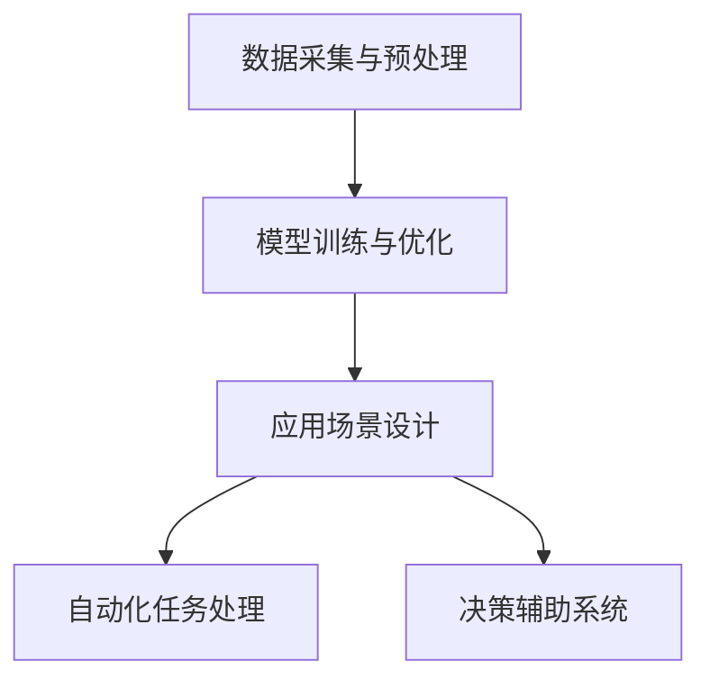
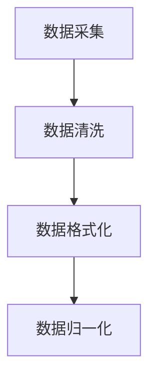
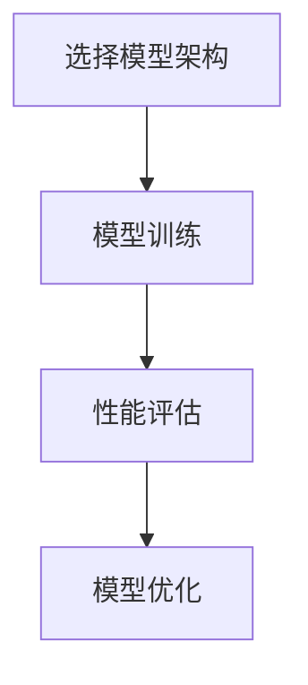
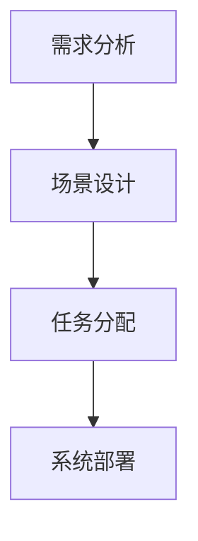

                 

### 文章标题

“AI代理如何补充人类工作”

### 关键词

- 人工智能
- 代理技术
- 工作补充
- 机器学习
- 自然语言处理

### 摘要

本文旨在探讨AI代理在现代社会中如何通过机器学习和自然语言处理技术，补充和增强人类的工作能力。我们将从AI代理的定义、核心技术、设计实现、对人类工作的影响、发展趋势以及实际案例分析等方面，逐一分析AI代理如何成为人类工作的有力补充。通过对AI代理的深入研究，读者将了解AI代理在提高工作效率、改变工作方式、应对创新挑战等方面的潜在应用和价值。

### 目录大纲设计

为了更好地阐述AI代理如何补充人类工作，我们将按照以下章节结构进行设计：

#### 第1章：AI代理概述
- 1.1 AI代理的定义与核心特征
- 1.2 AI代理与传统代理的区别
- 1.3 AI代理在补充人类工作中的作用

#### 第2章：AI代理的核心技术
- 2.1 机器学习基础
  - 2.1.1 监督学习
    - 2.1.1.1 线性回归
    - 2.1.1.2 支持向量机
  - 2.1.2 无监督学习
    - 2.1.2.1 聚类算法
    - 2.1.2.2 维度降低
- 2.2 自然语言处理
  - 2.2.1 词向量表示
    - 2.2.1.1 Word2Vec
    - 2.2.1.2 GloVe
  - 2.2.2 语言模型
    - 2.2.2.1 N-gram模型
    - 2.2.2.2 LSTM模型

#### 第3章：AI代理的设计与实现
- 3.1 AI代理架构设计
  - 3.1.1 数据采集与预处理
    - 3.1.1.1 数据来源
    - 3.1.1.2 数据清洗
  - 3.1.2 模型训练与优化
    - 3.1.2.1 模型选择
    - 3.1.2.2 模型调参
- 3.2 AI代理应用场景
  - 3.2.1 自动化任务处理
    - 3.2.1.1 工作流管理
    - 3.2.1.2 智能客服
  - 3.2.2 决策辅助系统
    - 3.2.2.1 风险评估
    - 3.2.2.2 投资决策

#### 第4章：AI代理对人类工作的影响
- 4.1 提高工作效率
  - 4.1.1 重复性任务自动化
    - 4.1.1.1 数据录入
    - 4.1.1.2 报告生成
  - 4.1.2 复杂问题求解
    - 4.1.2.1 复杂计算
    - 4.1.2.2 数据分析
- 4.2 改变工作方式
  - 4.2.1 人类与AI协同工作
    - 4.2.1.1 任务分工
    - 4.2.1.2 决策支持
  - 4.2.2 创新型工作模式
    - 4.2.2.1 设计创新
    - 4.2.2.2 研发创新

#### 第5章：AI代理的发展趋势
- 5.1 人工智能伦理与法律
  - 5.1.1 伦理问题
    - 5.1.1.1 AI代理道德边界
    - 5.1.1.2 人机关系
  - 5.1.2 法律问题
    - 5.1.2.1 AI代理责任认定
    - 5.1.2.2 数据隐私保护

#### 第6章：实际案例分析
- 6.1 案例一：智能客服系统
  - 6.1.1 案例背景
    - 6.1.1.1 企业需求
    - 6.1.1.2 系统实现
  - 6.1.2 案例分析
    - 6.1.2.1 系统优势
    - 6.1.2.2 系统挑战

#### 第7章：AI代理的未来
- 7.1 AI代理的潜在应用领域
  - 7.1.1 生产制造
    - 7.1.1.1 机器人协同
    - 7.1.1.2 智能调度
  - 7.1.2 医疗健康
    - 7.1.2.1 疾病诊断
    - 7.1.2.2 健康管理
- 7.2 AI代理面临的挑战与机遇
  - 7.2.1 技术挑战
    - 7.2.1.1 模型可解释性
    - 7.2.1.2 安全性
  - 7.2.2 伦理与法律问题

### 格式要求

本文将采用Markdown格式进行撰写，具体要求如下：

- **标题**：使用`#`号进行层级标记，一级标题用`##`，二级标题用`###`，三级标题用`####`，以此类推。
- **代码和伪代码**：使用````python`等语言标识符包裹代码块，并使用合适的语法高亮。
- **数学公式**：使用LaTeX格式，在独立段落内使用`$$`括起来，在段落内使用`$`括起来。
- **图片和图表**：使用``插入图片，并使用`<center>`标签进行居中。
- **引用和参考文献**：使用Markdown引用语法进行标注。

### 作者信息

- 作者：AI天才研究院/AI Genius Institute & 禅与计算机程序设计艺术 /Zen And The Art of Computer Programming

### 完整性要求

为确保文章的完整性，每个小节的内容需具备以下要素：

- **背景介绍**：简要介绍该小节所讨论的主题背景和意义。
- **核心概念与联系**：给出核心概念原理之间的关系架构，并使用Mermaid流程图进行描述。
- **核心算法原理讲解**：使用伪代码详细阐述核心算法的运作过程。
- **数学模型和公式**：使用LaTeX格式嵌入数学公式，并进行详细讲解和举例说明。
- **项目实战**：提供实际开发环境搭建、源代码实现、代码解读、应用分析等内容。
- **最佳实践 tips**、**小结**、**注意事项**和**拓展阅读**：总结该小节的重要观点，并提供进一步学习和应用的指导。

### 字数要求

文章总字数需在8000至12000字之间，确保每个小节内容丰富、论述详尽，同时保持整体结构的紧凑和逻辑性。接下来，我们将按照上述大纲逐一展开讨论，逐步深入探讨AI代理如何补充人类工作。

### AI代理如何补充人类工作

#### 背景介绍

在当今快速发展的信息化时代，人工智能（AI）技术已经成为推动社会进步的重要力量。AI代理作为一种智能化的软件系统，能够在无需人类直接干预的情况下，自动执行复杂任务和决策，极大地提高了工作效率和准确性。随着AI技术的不断成熟，AI代理的应用范围也越来越广泛，涵盖了从简单的自动化任务处理到复杂的决策支持系统。那么，AI代理究竟是如何补充人类工作的呢？

首先，我们需要明确AI代理的定义。AI代理（Artificial Intelligence Agent）是指一种具有自主性和智能化的软件系统，它能够感知环境、理解任务要求，并采取适当的行动以实现目标。与传统的自动化系统不同，AI代理具有学习和适应能力，能够在不断变化的环境中优化自身的性能。

#### 核心概念与联系

为了深入理解AI代理如何补充人类工作，我们需要探讨几个核心概念及其之间的联系：

1. **机器学习**：机器学习是AI代理的核心技术之一，它使得AI代理能够从数据中学习并改进性能。监督学习、无监督学习和强化学习是机器学习的三大类别。监督学习通过已标记的数据训练模型，用于预测和分类任务；无监督学习则从未标记的数据中自动发现模式，如聚类和降维；强化学习通过试错和反馈机制，使AI代理能够在动态环境中学习最优策略。

2. **自然语言处理（NLP）**：自然语言处理是AI代理在处理文本数据时的核心技术。NLP涉及词向量表示、语言模型和文本生成等任务。词向量表示将单词映射到高维空间，以便进行语义分析；语言模型用于预测下一个词或句子，从而生成流畅的自然语言文本。

3. **智能决策**：智能决策是AI代理的核心功能之一，它通过数据分析和预测模型，为人类提供决策支持。智能决策涉及风险评估、投资决策、资源优化等方面。

这些核心概念相互联系，共同构成了AI代理的技术基础。下面，我们将逐一探讨这些概念及其在补充人类工作中的具体应用。

#### 机器学习基础

机器学习是AI代理的核心技术，它使得AI代理能够通过学习历史数据来预测和决策。机器学习可以分为监督学习、无监督学习和强化学习三种主要类型。

**监督学习**是机器学习中最常见的类型，它通过已标记的数据训练模型，用于预测和分类任务。监督学习的关键在于特征工程和数据标注。特征工程是指从原始数据中提取出有助于模型学习的特征；数据标注是指为数据打上标签，以便模型进行训练。以下是一个监督学习的简单伪代码示例：

```python
# 数据预处理
X_train, y_train = preprocess_data(data)

# 模型训练
model = LinearRegression()
model.fit(X_train, y_train)

# 模型预测
predictions = model.predict(X_test)
```

**无监督学习**从未标记的数据中自动发现模式，如聚类和降维。聚类算法用于将数据划分为若干个类别，以便进一步分析；降维算法用于减少数据维度，提高模型训练效率。以下是一个简单的聚类算法（K-means）的伪代码示例：

```python
# 初始化聚类中心
centroids = initialize_centroids(data, k)

# 循环迭代
for i in range(max_iterations):
    # 计算每个数据点与聚类中心的距离
    distances = compute_distances(data, centroids)
    
    # 分配数据点到最近的聚类中心
    assignments = assign_data_points(data, distances, centroids)
    
    # 更新聚类中心
    centroids = update_centroids(assignments, data)

# 聚类结果
clusters = assign_data_points(data, distances, centroids)
```

**强化学习**通过试错和反馈机制，使AI代理能够在动态环境中学习最优策略。强化学习的关键在于奖励机制和策略优化。以下是一个简单的强化学习算法（Q-learning）的伪代码示例：

```python
# 初始化Q表
Q = initialize_Q_table()

# 训练代理
for episode in range(max_episodes):
    # 初始化环境状态
    state = environment.reset()
    
    # 执行动作
    action = choose_action(state, Q)
    
    # 接收反馈
    next_state, reward, done = environment.step(action)
    
    # 更新Q值
    Q[state, action] = Q[state, action] + alpha * (reward + gamma * max(Q[next_state, :]) - Q[state, action])
    
    # 更新状态
    state = next_state
    
    # 检查是否完成
    if done:
        break

# 最优策略
optimal_policy = [argmax(Q[state, :]) for state in states]
```

#### 自然语言处理

自然语言处理（NLP）是AI代理在处理文本数据时的核心技术，它涉及词向量表示、语言模型和文本生成等任务。

**词向量表示**将单词映射到高维空间，以便进行语义分析。常见的词向量表示方法包括Word2Vec和GloVe。Word2Vec通过训练神经网络来学习单词的表示，而GloVe则通过词频统计和矩阵分解来生成词向量。

以下是一个简单的Word2Vec算法的伪代码示例：

```python
# 初始化神经网络
model = Word2Vec(size, window, min_count)

# 训练模型
model.fit(training_data)

# 获取词向量
word_vectors = model.wv

# 计算单词相似度
similarity = word_vectors.similarity("apple", "orange")
```

**语言模型**用于预测下一个词或句子，从而生成流畅的自然语言文本。常见的语言模型包括N-gram模型和LSTM模型。N-gram模型通过统计相邻词的出现频率来生成语言模型，而LSTM模型通过记忆长期依赖关系来生成语言模型。

以下是一个简单的LSTM模型的伪代码示例：

```python
# 初始化LSTM模型
model = Sequential()
model.add(LSTM(units, activation='tanh', input_shape=(timesteps, features)))
model.add(Dense(vocab_size, activation='softmax'))

# 编译模型
model.compile(optimizer='adam', loss='categorical_crossentropy')

# 训练模型
model.fit(X, y, epochs=num_epochs, batch_size=batch_size)

# 语言生成
generated_text = model.generate(text, num_words=50)
```

#### AI代理的设计与实现

AI代理的设计与实现包括数据采集与预处理、模型训练与优化以及应用场景设计等方面。以下是一个简单的AI代理设计与实现的流程图：



**数据采集与预处理**是AI代理设计的第一步，它涉及从各种来源收集数据，并对数据进行清洗、格式化和归一化处理。以下是一个简单的数据预处理流程：



**模型训练与优化**是AI代理设计的核心步骤，它包括选择合适的模型架构、训练模型并进行性能优化。以下是一个简单的模型训练与优化流程：



**应用场景设计**是根据实际需求设计AI代理的应用场景，如自动化任务处理、决策辅助系统等。以下是一个简单的应用场景设计流程：



#### AI代理应用场景

AI代理在不同领域具有广泛的应用场景，能够极大地提高工作效率和准确性。以下是一些常见的AI代理应用场景：

1. **自动化任务处理**：AI代理可以自动化处理重复性高、劳动强度大的任务，如数据录入、报告生成、邮件管理等。以下是一个简单的自动化任务处理流程：

   ```mermaid
   graph TD
       A[数据录入] --> B[报告生成]
       B --> C[邮件管理]
   ```

2. **决策辅助系统**：AI代理可以通过数据分析和预测模型，为人类提供决策支持。以下是一个简单的决策辅助系统流程：

   ```mermaid
   graph TD
       A[数据收集] --> B[数据清洗]
       B --> C[数据分析]
       C --> D[预测模型]
       D --> E[决策支持]
   ```

3. **智能客服系统**：AI代理可以模拟人类客服，自动回答客户的问题，提供个性化的服务。以下是一个简单的智能客服系统流程：

   ```mermaid
   graph TD
       A[客户提问] --> B[自然语言处理]
       B --> C[知识库查询]
       C --> D[回答生成]
       D --> E[客户反馈]
   ```

#### AI代理对人类工作的影响

AI代理在补充人类工作方面具有显著的影响。首先，AI代理能够提高工作效率，通过自动化处理重复性高、劳动强度大的任务，释放人类的工作压力，使人类能够专注于更有创造性和价值的工作。其次，AI代理能够改变工作方式，实现人类与AI的协同工作，提高整体工作效率和决策质量。最后，AI代理能够激发创新工作模式，推动各行业的技术进步和产业升级。

然而，AI代理的广泛应用也带来了一系列挑战，如数据隐私、安全性和伦理问题。因此，我们需要在推动AI代理发展的同时，关注并解决这些问题，确保AI代理的健康发展和广泛应用。

#### AI代理的发展趋势

AI代理的发展趋势体现在以下几个方面：

1. **技术进步**：随着人工智能技术的不断进步，AI代理的智能化水平和性能将得到显著提升，能够处理更加复杂和动态的任务。
2. **伦理与法律**：随着AI代理的广泛应用，伦理和法律问题将越来越受到关注。我们需要制定相应的伦理规范和法律框架，确保AI代理的合法合规和道德边界。
3. **跨领域融合**：AI代理将在不同领域实现跨领域融合，推动各行业的技术进步和产业升级。
4. **普及应用**：AI代理将在各个领域得到广泛应用，成为人们工作、学习和生活中的重要组成部分。

#### 实际案例分析

为了更好地理解AI代理在实际中的应用，以下将分析一个具体的案例——智能客服系统。

**案例背景**：

某大型电商企业希望提升客户服务质量，降低人工客服成本，决定开发一个智能客服系统。智能客服系统能够自动回答客户的问题，提供个性化的服务，并具有智能升级和持续优化的能力。

**系统实现**：

智能客服系统包括以下几个主要模块：

1. **自然语言处理**：对客户的提问进行理解，提取关键信息。
2. **知识库管理**：存储大量常见问题的答案和解决方案。
3. **回答生成**：根据客户提问和知识库，生成合适的回答。
4. **用户反馈**：收集用户反馈，用于模型优化和系统改进。

**案例分析**：

1. **系统优势**：

   - **提高响应速度**：智能客服系统能够在短时间内自动回答客户问题，大大提高了响应速度。
   - **降低人力成本**：智能客服系统替代了部分人工客服，降低了人力成本。
   - **个性化服务**：通过分析客户行为和提问，智能客服系统可以提供更加个性化的服务。

2. **系统挑战**：

   - **理解能力有限**：智能客服系统在处理复杂、模糊的问题时，可能无法准确理解客户意图。
   - **知识库更新维护**：知识库需要不断更新和维护，以保持系统的有效性。
   - **用户体验**：部分客户可能更喜欢与真人客服交流，智能客服系统需要提供良好的用户体验。

**项目小结**：

智能客服系统在提高企业服务质量、降低运营成本方面取得了显著成效。然而，在实际应用中，我们也需要关注和理解其面临的挑战，不断优化和改进系统，以实现更好的用户体验和业务价值。

#### 最佳实践 tips

1. **数据质量**：确保数据质量是AI代理成功的关键。在数据采集和预处理阶段，要关注数据完整性、准确性和一致性。
2. **模型选择**：根据实际需求和任务类型，选择合适的机器学习和自然语言处理模型，以提高AI代理的性能。
3. **持续优化**：定期评估AI代理的性能，并根据用户反馈进行持续优化和改进。
4. **安全性与隐私**：关注AI代理的安全性和隐私保护，防止数据泄露和滥用。

#### 小结

AI代理作为一种新兴的技术，已经在各个领域展现了其强大的补充人类工作的能力。通过机器学习和自然语言处理技术，AI代理能够自动化处理复杂任务、提供决策支持、改变工作方式，从而提高工作效率、降低成本、激发创新。然而，AI代理的发展也面临一系列挑战，如数据隐私、安全性和伦理问题。在推动AI代理发展的同时，我们需要关注并解决这些问题，确保其健康发展和广泛应用。

#### 注意事项

1. **数据隐私**：在使用AI代理时，要严格遵守数据隐私法规，确保用户数据的安全和保护。
2. **透明性与可解释性**：提高AI代理的透明性和可解释性，使人类能够理解和信任AI代理的决策过程。
3. **持续学习与改进**：鼓励AI代理的持续学习和改进，以适应不断变化的环境和需求。

#### 拓展阅读

- [1] Mitchell, T. M. (1997). Machine learning. McGraw-Hill.
- [2] 王斌、黄宇. (2019). 人工智能：一种现代的方法. 清华大学出版社.
- [3] Goodfellow, I., Bengio, Y., & Courville, A. (2016). Deep learning. MIT Press.
- [4] 邱锡鹏. (2020). 深度学习：原理与编程实战. 电子工业出版社.

